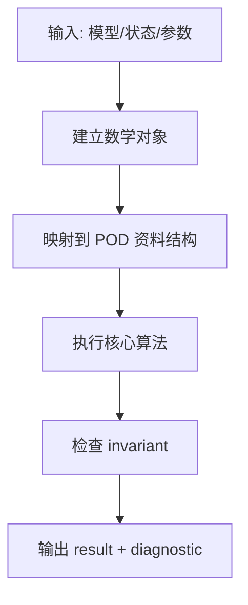

# FrameCore v2 深度課程合併版


<!-- pagebreak: lesson_01_state_vectors_local_frames.md -->


# 力學引擎開發與理論實作課程表

> 目標：從零內化並複製一個結構力學 / 物理模擬核心。  
> 對齊專案：`ArchSim / Plugins / FrameSolver / Source / FrameCore`。  
> 主要語言：C++17。  
> 核心風格：POD public API、底層資料結構明確、數學不變量先行、測試驅動。  
> 單位約定：N、mm、MPa，其中 MPa = N/mm²。  
> 本文件版本：Lesson 1 完整擴充版。

---


## 0. 如何閱讀這份課程

這不是「使用物理引擎」課程，而是「複製物理 / 力學引擎內核」課程。

本課程採用三層並行：

1. **數學層**  
   向量空間、矩陣、微分方程、能量、虛功、有限元素、約束與非線性求解。

2. **資料結構層**  
   `Vec3`、`Mat3`、`Node`、`Member`、`Element`、`SparseMatrix`、`Solver`、`PreparedSystem`。

3. **工程驗證層**  
   每一個公式都落成可測試的 invariant。  
   例如：

\[
R^TR=I
\]

\[
q_l^TK_lq_l=q_g^TK_gq_g
\]

\[
R_{reaction}=Ku-F
\]

\[
K\phi=\omega^2M\phi
\]

\[
K_T=K+K_G
\]

你要把每一課都視為一個可獨立 commit 的 engine milestone。

---


## 1. 專案對齊：FrameCore 的核心邊界

本工作區目前核心專案是：

```text
ArchSim/
    Plugins/
        FrameSolver/
            Source/
                FrameCore/
                    Public/FrameCore/
                    Private/
                    Private/Tests/
            Standalone/
            Grasshopper/
```

其中 `FrameCore` 的公共 API 使用普通 C++ / POD 型別，私有實作可使用 Eigen。這是很重要的工程邊界：

```text
外部世界 / UE / CLI / Grasshopper
        |
        v
Public POD API
        |
        v
Private numerical backend
        |
        v
Eigen / sparse solve / element implementation
```

本課程的複製策略：

```text
第一階段：完全不用 Eigen，手寫最小線代核心
第二階段：建立有限元素資料流
第三階段：接入 sparse backend
第四階段：擴充梁柱、殼、動力、非線性、倒塌、最佳化
```

---


## 2. 完整課程 Roadmap

### Phase A — 數學與引擎最小地基

| 課次 | 主題 | 理論核心 | 實作核心 | 本課完成後你應該能寫出的東西 |
|---:|---|---|---|---|
| 1 | 向量、矩陣、局部座標、節點 / 元素狀態 | \(\mathbb{R}^3\)、內積、外積、正交基、DOF 編碼、虛功不變性 | `Vec3`、`Mat3`、`Node`、`Member`、`memberLocalFrame()`、`T=diag(R,R,R,R)` | 最小幾何與 DOF 核心 |
| 2 | 點、剛體、結構節點的運動學 | 位置、速度、加速度、小轉角、角速度、\(SO(3)\) | `ParticleState`、`RigidBodyState`、`StructuralState` | 能清楚區分 particle / rigid body / structural node |
| 3 | 微分方程與數值積分 | \(\dot{x}=v\)、\(M\ddot{q}=f\)、Euler、Symplectic、RK4、Newmark | `Integrator` interface | 從 ODE 到 time stepping |
| 4 | 質量、慣性、力與力矩累積 | \(p=mv\)、\(L=I\omega\)、平行軸定理、力矩 \(\tau=r\times f\) | `ForceAccumulator`、`MassProperties` | 可推導剛體與結構動力質量模型 |


### Phase B — 一般物理引擎核心

| 課次 | 主題 | 理論核心 | 實作核心 | 交付物 |
|---:|---|---|---|---|
| 5 | 幾何 primitive 與碰撞檢測 I | sphere、plane、AABB、segment、triangle | overlap / distance tests | 幾何查詢庫 |
| 6 | 碰撞檢測 II：Broadphase / Narrowphase | Sweep-and-Prune、BVH、SAT、GJK 概念 | broadphase candidates、narrowphase contact | contact generation |
| 7 | 衝量響應 | 線動量、角動量、恢復係數、摩擦錐 | `ContactConstraint`、impulse solve | 單點接觸 solver |
| 8 | 約束求解器 | Lagrange multiplier、KKT、LCP、PGS、XPBD | constraint rows、Jacobian、sequential impulse | 可擴展 constraint solver |


### Phase C — 結構 FEM 線性核心

| 課次 | 主題 | 理論核心 | 實作核心 | 交付物 |
|---:|---|---|---|---|
| 9 | FEM 總入口：虛功與能量 | \(\delta W_{int}=\delta W_{ext}\)、\(\Pi=U-W\) | `IElement` interface | 所有元素共同界面 |
| 10 | 3D Euler–Bernoulli 梁柱元素 | 12 DOF、軸向、扭轉、雙向彎曲 | `localStiffness12()` | 梁柱局部剛度 |
| 11 | 局部到全域與稀疏組裝 | \(K_g=T^TK_lT\)、scatter-add | global DOF map、assembler | 全域剛度矩陣 |
| 12 | 支承、邊界條件、機構判定 | DOF 消去、prescribed displacement、pivot guard | constrained solve | 能穩定解 \(Kq=f\) |
| 13 | 荷載、等效節點力、反力、桿端力 | fixed-end force、\(R=Ku-F\) | `LoadCase`、member force recovery | 結構線性分析完整回路 |
| 14 | 端部釋放與靜力凝聚 | Schur complement、released DOF condensation | `condenseReleases()` | hinge / truss / pin member |


### Phase D — 動力、模態、穩定

| 課次 | 主題 | 理論核心 | 實作核心 | 交付物 |
|---:|---|---|---|---|
| 15 | 質量矩陣與模態分析 | consistent mass、\(K\phi=\omega^2M\phi\) | `localMass12()`、modal solver | 頻率 / mode shape |
| 16 | Newmark 與 modal transient | \(M\ddot{q}+C\dot{q}+Kq=f(t)\) | Newmark-\(\beta\)、modal superposition | 線性時間歷程 |
| 17 | 幾何剛度、P-Delta、線性屈曲 | \(K_T=K+K_G\)、Euler load | `localGeometric12()`、buckling eigen | 二階與屈曲 |
| 18 | Timoshenko 梁 | 剪切變形、\(\Phi=12EI/(GA_sL^2)\) | `localStiffness12T()` | 剪切柔性梁 |


### Phase E — 殼元素與高階元素

| 課次 | 主題 | 理論核心 | 實作核心 | 交付物 |
|---:|---|---|---|---|
| 19 | 2D / plate / shell 基礎 | membrane、bending、shear、drilling DOF | shell local coordinates | shell 元素準備 |
| 20 | MITC4 Reissner–Mindlin shell | assumed shear、locking、Jacobian、Gauss integration | `MITC4ShellElement` clone | 24 DOF shell |
| 21 | Shell stress recovery 與 failure screen | \(N_{xx},M_{xx},Q_x\)、von Mises | stress resultants | shell D/C screen |


### Phase F — 非線性與倒塌

| 課次 | 主題 | 理論核心 | 實作核心 | 交付物 |
|---:|---|---|---|---|
| 22 | co-rotational beam | 大位移、小應變、元素跟隨座標 | corotational transform | 幾何非線性梁 |
| 23 | Newton、切線剛度、弧長法 | residual、tangent、snap-through | arc-length continuation | 極限點追蹤 |
| 24 | tension-only active set | complementarity、active-set iteration | cable / brace deactivation | 拉力構件 |
| 25 | 塑性鉸與 event-to-event collapse | 塑性事件、機構、順序線性分析 | hinge driver | progressive collapse |
| 26 | dynamic collapse 與碎片交接 | modal Newmark、momentum handoff、fragment inertia | `FragmentCluster` | 動態倒塌橋接物理引擎 |


### Phase G — 再分析、最佳化、產品化

| 課次 | 主題 | 理論核心 | 實作核心 | 交付物 |
|---:|---|---|---|---|
| 27 | 再分析與互動式求解 | Woodbury、stale factor PCG、rebaseline | `PreparedSystem` / reanalysis ladder | 即時編輯求解 |
| 28 | 稀疏求解器與 supernodal lane | Cholesky、LDLT、ordering、fill-in | sparse backend seam | 大規模 DOF |
| 29 | 尺寸最佳化 FSD | stress ratio、multi-load envelope | member sizing loop | section optimizer |
| 30 | BESO 拓樸最佳化 | strain energy sensitivity、hard kill | topology loop | topology optimizer |
| 31 | API / CLI / C API / Grasshopper | wire protocol、POD ABI、daemon | external bridge | 工具鏈介面 |
| 32 | Clone 專案總整合 | 分層重建、驗證矩陣、能力邊界 | MiniFrameCore | 可交接引擎核心 |

---


# Lesson 1 — 向量、矩陣、局部座標與結構狀態表示

## 1.1 本課定位

本課不是「線性代數複習」。

本課要建立的是一個力學引擎最底層的、不允許模糊的 convention layer。

在結構力學引擎中，只要下面任一點錯誤，後續所有結果都會出現表面正常但物理錯誤的災難：

1. DOF 順序錯。
2. 局部軸方向錯。
3. row-major / column-major convention 混亂。
4. \(R\) 與 \(R^T\) 用反。
5. \(K_g=T^TK_lT\) 寫成 \(TK_lT^T\)。
6. 彎矩正負號沒有對齊 local DOF。
7. 元素端部力 local / reaction global 混淆。

因此 Lesson 1 只做一件事：

> 把幾何、座標、DOF、元素狀態、局部 / 全域轉換徹底釘死。

---


## 1.2 本課輸出物

本課結束時，應該能從零寫出：

```text
Lesson1Core/
    CMakeLists.txt
    include/
        FrameTypes.hpp
        Mat3.hpp
        MemberFrame.hpp
        ModelTypes.hpp
        Transform12.hpp
        DenseSmall.hpp
    tests/
        test_lesson1.cpp
```

功能包括：

1. `Vec3`
2. `Mat3`
3. `Node`
4. `Material`
5. `Section`
6. `Member`
7. `memberLocalFrame(pi,pj,refVec)`
8. \(12\times12\) block transform
9. 能量不變性測試
10. row convention 測試
11. degenerate refVec fallback 測試

---


## 1.3 引擎級 convention

### 1.3.1 單位

本課採用：

\[
\text{Force}=\mathrm{N}
\]

\[
\text{Length}=\mathrm{mm}
\]

\[
\text{Stress}=\mathrm{MPa}=\mathrm{N/mm^2}
\]

對材料：

\[
E\in \mathrm{MPa}
\]

\[
G\in \mathrm{MPa}
\]

對截面：

\[
A\in \mathrm{mm^2}
\]

\[
I_y,I_z,J\in \mathrm{mm^4}
\]

軸向剛度：

\[
k_a=\frac{EA}{L}
\]

單位為：

\[
\frac{\mathrm{N/mm^2}\cdot\mathrm{mm^2}}{\mathrm{mm}}
=\mathrm{N/mm}
\]

彎曲剛度係數之一：

\[
k_b=\frac{12EI}{L^3}
\]

單位為：

\[
\frac{\mathrm{N/mm^2}\cdot\mathrm{mm^4}}{\mathrm{mm^3}}
=\mathrm{N/mm}
\]

轉角剛度係數之一：

\[
k_r=\frac{4EI}{L}
\]

單位為：

\[
\frac{\mathrm{N/mm^2}\cdot\mathrm{mm^4}}{\mathrm{mm}}
=\mathrm{N\cdot mm}
\]

因為轉角是 rad，工程上 rad 視為無因次，所以彎矩 / 轉角剛度為 \(\mathrm{N\cdot mm}\)。

---


### 1.3.2 節點自由度 DOF

每一個節點有 6 個 DOF：

\[
q_i=
\begin{bmatrix}
U_x\\
U_y\\
U_z\\
R_x\\
R_y\\
R_z
\end{bmatrix}_i
\]

其中：

\[
U_x,U_y,U_z
\]

是位移，單位為 mm。

\[
R_x,R_y,R_z
\]

是小轉角，單位為 rad。

固定 DOF 順序：

\[
[U_x,U_y,U_z,R_x,R_y,R_z]=[0,1,2,3,4,5]
\]

全域 DOF 編號：

\[
\operatorname{gdof}(i,d)=6i+d
\]

例如：節點 7 的 \(R_z\)：

\[
\operatorname{gdof}(7,5)=6\cdot7+5=47
\]

---


### 1.3.3 元素 DOF

一根二節點梁柱元素連接節點 \(i\) 與 \(j\)。

元素位移向量：

\[
q_e=
\begin{bmatrix}
q_i\\
q_j
\end{bmatrix}
\in\mathbb{R}^{12}
\]

完整展開：

\[
q_e=
\begin{bmatrix}
U_{xi}\\
U_{yi}\\
U_{zi}\\
R_{xi}\\
R_{yi}\\
R_{zi}\\
U_{xj}\\
U_{yj}\\
U_{zj}\\
R_{xj}\\
R_{yj}\\
R_{zj}
\end{bmatrix}
\]

索引表：

| local element index | DOF |
|---:|---|
| 0 | \(U_{xi}\) |
| 1 | \(U_{yi}\) |
| 2 | \(U_{zi}\) |
| 3 | \(R_{xi}\) |
| 4 | \(R_{yi}\) |
| 5 | \(R_{zi}\) |
| 6 | \(U_{xj}\) |
| 7 | \(U_{yj}\) |
| 8 | \(U_{zj}\) |
| 9 | \(R_{xj}\) |
| 10 | \(R_{yj}\) |
| 11 | \(R_{zj}\) |

這個順序與很多教科書的 block 排列一致：

\[
[u_i,v_i,w_i,\theta_{xi},\theta_{yi},\theta_{zi},u_j,v_j,w_j,\theta_{xj},\theta_{yj},\theta_{zj}]^T
\]

---


### 1.3.4 力與元素端力 convention

元素端力通常寫成：

\[
f_e=
\begin{bmatrix}
F_{xi}\\
F_{yi}\\
F_{zi}\\
M_{xi}\\
M_{yi}\\
M_{zi}\\
F_{xj}\\
F_{yj}\\
F_{zj}\\
M_{xj}\\
M_{yj}\\
M_{zj}
\end{bmatrix}
\]

結構分析常報告 local member end force：

\[
[N,V_y,V_z,T,M_y,M_z]_i
\]

\[
[N,V_y,V_z,T,M_y,M_z]_j
\]

其中：

- \(N\)：軸力。
- \(V_y,V_z\)：局部剪力。
- \(T\)：扭矩。
- \(M_y,M_z\)：局部彎矩。

此類引擎常約定：

```text
member end forces: local coordinates
reactions: global coordinates
```

這種分工很合理，因為：

- 桿件設計需要沿自身 local axis 讀取 \(N,V,M\)。
- 支承反力需要在全域座標下與外力平衡。

---


## 1.4 數學層：\(\mathbb{R}^3\) 向量

### 1.4.1 向量定義

\[
a=
\begin{bmatrix}
a_x\\a_y\\a_z
\end{bmatrix},
\qquad
b=
\begin{bmatrix}
b_x\\b_y\\b_z
\end{bmatrix}
\]

C++ POD：

```cpp
struct Vec3 {
    double x = 0;
    double y = 0;
    double z = 0;
};
```

這不是「小工具類」。  
這是整個引擎所有幾何、力、速度、力矩、軸向、shell normal、contact normal 的基礎資料單元。

---


### 1.4.2 線性運算

加法：

\[
a+b=
\begin{bmatrix}
a_x+b_x\\
a_y+b_y\\
a_z+b_z
\end{bmatrix}
\]

減法：

\[
a-b=
\begin{bmatrix}
a_x-b_x\\
a_y-b_y\\
a_z-b_z
\end{bmatrix}
\]

純量乘法：

\[
\lambda a=
\begin{bmatrix}
\lambda a_x\\
\lambda a_y\\
\lambda a_z
\end{bmatrix}
\]

向量的線性組合：

\[
v=\alpha a+\beta b+\gamma c
\]

這是 local axis 組成 global vector 的形式。

若 \(e_x,e_y,e_z\) 是一組基底，則：

\[
v_g=v_xe_x+v_ye_y+v_ze_z
\]

矩陣形式：

\[
v_g=
\begin{bmatrix}
e_x&e_y&e_z
\end{bmatrix}
\begin{bmatrix}
v_x\\v_y\\v_z
\end{bmatrix}
\]

注意這裡 \(e_x,e_y,e_z\) 作為 column 時，該矩陣是從 local 到 global 的矩陣。

---


### 1.4.3 內積 dot product

定義：

\[
a\cdot b=a_xb_x+a_yb_y+a_zb_z
\]

矩陣形式：

\[
a\cdot b=a^Tb
\]

長度：

\[
\|a\|=\sqrt{a\cdot a}
\]

夾角關係：

\[
a\cdot b=\|a\|\|b\|\cos\theta
\]

所以：

\[
\cos\theta=\frac{a\cdot b}{\|a\|\|b\|}
\]

垂直判定：

\[
a\perp b\quad\Longleftrightarrow\quad a\cdot b=0
\]

在引擎中的用途：

1. 判斷 local axes 是否正交。
2. 將 global vector 投影到 local axis。
3. 計算 contact normal velocity。
4. 計算桿件軸向伸長。
5. 計算模態正交性。

---


### 1.4.4 外積 cross product

定義：

\[
a\times b=
\begin{bmatrix}
a_yb_z-a_zb_y\\
a_zb_x-a_xb_z\\
a_xb_y-a_yb_x
\end{bmatrix}
\]

性質：

\[
a\times b=-(b\times a)
\]

\[
a\cdot(a\times b)=0
\]

\[
b\cdot(a\times b)=0
\]

長度：

\[
\|a\times b\|=\|a\|\|b\|\sin\theta
\]

外積方向由右手定則決定。

在 local frame 中，外積決定第三軸方向。

若：

\[
e_x=(1,0,0)
\]

\[
e_y=(0,1,0)
\]

則：

\[
e_x\times e_y=e_z=(0,0,1)
\]

---


### 1.4.5 外積矩陣

定義：

\[
[a]_\times=
\begin{bmatrix}
0&-a_z&a_y\\
a_z&0&-a_x\\
-a_y&a_x&0
\end{bmatrix}
\]

則：

\[
a\times b=[a]_\times b
\]

證明：

\[
[a]_\times b=
\begin{bmatrix}
0&-a_z&a_y\\
a_z&0&-a_x\\
-a_y&a_x&0
\end{bmatrix}
\begin{bmatrix}
b_x\\b_y\\b_z
\end{bmatrix}
\]

\[
=
\begin{bmatrix}
-a_zb_y+a_yb_z\\
a_zb_x-a_xb_z\\
-a_yb_x+a_xb_y
\end{bmatrix}
\]

\[
=
\begin{bmatrix}
a_yb_z-a_zb_y\\
a_zb_x-a_xb_z\\
a_xb_y-a_yb_x
\end{bmatrix}
=a\times b
\]

反對稱性：

\[
[a]_\times^T=-[a]_\times
\]

小角度旋轉：

\[
r'\approx r+\theta\times r
\]

\[
\Delta r=\theta\times r=[\theta]_\times r
\]

也可寫成：

\[
\theta\times r=-r\times \theta=-[r]_\times\theta
\]

所以剛體 contact point 速度：

\[
v_c=v+\omega\times r
\]

\[
=v-[r]_\times\omega
\]

這是後續碰撞與約束 Jacobian 的核心。

---


## 1.5 數學層：矩陣與座標變換

### 1.5.1 基底與座標

令 global basis 為：

\[
E=
\{\hat{i},\hat{j},\hat{k}\}
\]

local basis 為：

\[
B=\{e_x,e_y,e_z\}
\]

其中 \(e_x,e_y,e_z\) 皆用 global coordinates 表示。

任一 global vector \(v_g\) 可投影到 local basis：

\[
v_l=
\begin{bmatrix}
v_g\cdot e_x\\
v_g\cdot e_y\\
v_g\cdot e_z
\end{bmatrix}
\]

因此定義：

\[
R=
\begin{bmatrix}
e_x^T\\
e_y^T\\
e_z^T
\end{bmatrix}
\]

則：

\[
v_l=Rv_g
\]

這個 convention 非常重要：

```text
R 的 row 是 local axis。
R * global = local。
R^T * local = global。
```

---


### 1.5.2 正交矩陣

若 local axes 是正交單位向量：

\[
e_x\cdot e_x=1
\]

\[
e_y\cdot e_y=1
\]

\[
e_z\cdot e_z=1
\]

\[
e_x\cdot e_y=e_y\cdot e_z=e_z\cdot e_x=0
\]

則：

\[
RR^T=I
\]

證明：

\[
RR^T=
\begin{bmatrix}
e_x^T\\
e_y^T\\
e_z^T
\end{bmatrix}
\begin{bmatrix}
e_x&e_y&e_z
\end{bmatrix}
\]

\[
=
\begin{bmatrix}
e_x^Te_x&e_x^Te_y&e_x^Te_z\\
e_y^Te_x&e_y^Te_y&e_y^Te_z\\
e_z^Te_x&e_z^Te_y&e_z^Te_z
\end{bmatrix}
\]

\[
=
\begin{bmatrix}
1&0&0\\
0&1&0\\
0&0&1
\end{bmatrix}=I
\]

對正交矩陣：

\[
R^{-1}=R^T
\]

如果還滿足右手座標：

\[
e_x\times e_y=e_z
\]

則：

\[
\det R=+1
\]

若 \(\det R=-1\)，代表你建立了左手座標系。這會讓彎矩、扭轉、殼 normal 或 contact tangent 出現鏡射錯誤。

---


### 1.5.3 row convention 與 column convention 的比較

本課採用 row convention：

\[
R_{row}=\begin{bmatrix}e_x^T\\e_y^T\\e_z^T\end{bmatrix}
\]

\[
v_l=R_{row}v_g
\]

\[
v_g=R_{row}^Tv_l
\]

另一種常見 convention 是 column convention：

\[
C=\begin{bmatrix}e_x&e_y&e_z\end{bmatrix}
\]

\[
v_g=Cv_l
\]

\[
v_l=C^Tv_g
\]

兩者關係：

\[
R_{row}=C^T
\]

\[
C=R_{row}^T
\]

不要混用。

工程規則：

```text
函式名稱一定要帶方向：

mulGlobalToLocal(v)  // R * v
mulLocalToGlobal(v)  // R^T * v

不要只叫 rotate(v)。
```

---


## 1.6 建立梁柱元素局部座標系

### 1.6.1 輸入

給定兩端節點位置：

\[
p_i,p_j\in\mathbb{R}^3
\]

給定參考向量：

\[
r\in\mathbb{R}^3
\]

參考向量的角色：

```text
它不是 local y 軸本身。
它只是用來定義 local x-y 平面的大致方向。
```

---


### 1.6.2 local x 軸

元素方向：

\[
d=p_j-p_i
\]

長度：

\[
L=\|d\|
\]

若：

\[
L<\varepsilon
\]

則元素退化，不可建立。

local x：

\[
e_x=\frac{d}{L}
\]

---


### 1.6.3 local z 軸

若 \(r\) 大致在 local \(x-y\) 平面中，則垂直於該平面的方向為：

\[
e_x\times r
\]

因此：

\[
e_z=\frac{e_x\times r}{\|e_x\times r\|}
\]

若：

\[
\|e_x\times r\|<\varepsilon
\]

表示：

\[
r\parallel e_x
\]

此時無法定義 local \(x-y\) 平面，需要 fallback。

典型 fallback：

\[
r=(0,1,0)
\]

若仍平行，再用：

\[
r=(1,0,0)
\]

---


### 1.6.4 local y 軸

為了得到右手座標：

\[
e_x\times e_y=e_z
\]

由外積反推：

\[
e_y=e_z\times e_x
\]

檢查：

\[
e_x\times(e_z\times e_x)
\]

使用向量三重積：

\[
a\times(b\times c)=b(a\cdot c)-c(a\cdot b)
\]

令 \(a=e_x,b=e_z,c=e_x\)：

\[
e_x\times(e_z\times e_x)=e_z(e_x\cdot e_x)-e_x(e_x\cdot e_z)
\]

因為：

\[
e_x\cdot e_x=1
\]

\[
e_x\cdot e_z=0
\]

所以：

\[
e_x\times(e_z\times e_x)=e_z
\]

因此 \(e_y=e_z\times e_x\) 的確滿足：

\[
e_x\times e_y=e_z
\]

---


### 1.6.5 局部座標建立演算法

```text
Input: pi, pj, refVec

1. d = pj - pi
2. L = ||d||
3. ex = d / L
4. ezRaw = ex × refVec
5. if ||ezRaw|| too small:
       refVec = global +Y
       ezRaw = ex × refVec
6. if still too small:
       refVec = global +X
       ezRaw = ex × refVec
7. ez = normalize(ezRaw)
8. ey = normalize(ez × ex)
9. R = rows(ex, ey, ez)
10. assert orthonormal and det(R)=+1
```

---


### 1.6.6 ASCII 幾何圖

```text
global space

             refVec r
                ↑
                |
                |
node i ------------------------> node j
                  local x = ex
```

計算：

```text
ex = unit(j - i)
ez = unit(ex × refVec)
ey = unit(ez × ex)
```

若你手繪：

1. 畫 \(i\rightarrow j\) 作為元素軸。
2. 畫參考向量 \(r\)。
3. 右手定則畫 \(e_x\times r\)，它是 \(e_z\)。
4. 再畫 \(e_z\times e_x\)，它是 \(e_y\)。

---


## 1.7 元素 12 DOF 轉換矩陣

### 1.7.1 三維向量轉換

對任一全域向量：

\[
v_g\in\mathbb{R}^3
\]

轉到 local：

\[
v_l=Rv_g
\]

反向：

\[
v_g=R^Tv_l
\]

位移向量與小轉角向量都用同一個 \(R\)：

\[
u_l=Ru_g
\]

\[
\theta_l=R\theta_g
\]

注意：這裡 \(\theta\) 是小轉角向量，不是 finite rotation matrix。

---


### 1.7.2 元素位移 block

全域元素 DOF：

\[
q_g=
\begin{bmatrix}
u_i^g\\
\theta_i^g\\
u_j^g\\
\theta_j^g
\end{bmatrix}
\]

局部元素 DOF：

\[
q_l=
\begin{bmatrix}
u_i^l\\
\theta_i^l\\
u_j^l\\
\theta_j^l
\end{bmatrix}
\]

其中每個 block 都是 \(3\times1\)。

因此：

\[
q_l=
\begin{bmatrix}
R&0&0&0\\
0&R&0&0\\
0&0&R&0\\
0&0&0&R
\end{bmatrix}
q_g
\]

定義：

\[
T=\operatorname{diag}(R,R,R,R)
\]

則：

\[
q_l=Tq_g
\]

反向：

\[
q_g=T^Tq_l
\]

因為：

\[
T^{-1}=T^T
\]

---


### 1.7.3 block index map

元素 DOF 12 entries 可以被視為 4 個 3-vector block：

| block | entries | meaning |
|---:|---|---|
| 0 | 0,1,2 | node i translation |
| 1 | 3,4,5 | node i rotation |
| 2 | 6,7,8 | node j translation |
| 3 | 9,10,11 | node j rotation |

因此程式中：

```cpp
int offset = 3 * block;
Vec3 b = { q[offset+0], q[offset+1], q[offset+2] };
```

---


## 1.8 虛功與剛度轉換推導

這是本課的核心公式來源。

不要背：

\[
K_g=T^TK_lT
\]

要從虛功推出來。

---


### 1.8.1 局部剛度關係

元素在 local coordinates 中：

\[
f_l=K_lq_l
\]

其中：

\[
K_l\in\mathbb{R}^{12\times12}
\]

\[
q_l\in\mathbb{R}^{12}
\]

\[
f_l\in\mathbb{R}^{12}
\]

---


### 1.8.2 位移轉換

\[
q_l=Tq_g
\]

虛位移同理：

\[
\delta q_l=T\delta q_g
\]

---


### 1.8.3 虛功不變性

同一個物理虛功不應該因座標改變而改變：

\[
\delta W=\delta q_l^Tf_l=\delta q_g^Tf_g
\]

將 \(\delta q_l=T\delta q_g\) 代入：

\[
\delta W=(T\delta q_g)^Tf_l
\]

\[
=\delta q_g^TT^Tf_l
\]

與：

\[
\delta W=\delta q_g^Tf_g
\]

比較得：

\[
f_g=T^Tf_l
\]

所以力的轉換方向與位移相反：

```text
q_l = T q_g
f_g = T^T f_l
```

這不是任意規則，而是虛功對偶性。

---


### 1.8.4 剛度轉換

由：

\[
f_l=K_lq_l
\]

\[
f_g=T^Tf_l
\]

代入：

\[
f_g=T^TK_lq_l
\]

又：

\[
q_l=Tq_g
\]

因此：

\[
f_g=T^TK_lTq_g
\]

所以：

\[
K_g=T^TK_lT
\]

---


### 1.8.5 能量不變性

局部應變能：

\[
U_l=\frac{1}{2}q_l^TK_lq_l
\]

代入 \(q_l=Tq_g\)：

\[
U_l=\frac{1}{2}(Tq_g)^TK_l(Tq_g)
\]

矩陣乘法轉置：

\[
(Tq_g)^T=q_g^TT^T
\]

所以：

\[
U_l=\frac{1}{2}q_g^TT^TK_lTq_g
\]

定義：

\[
K_g=T^TK_lT
\]

得：

\[
U_l=\frac{1}{2}q_g^TK_gq_g=U_g
\]

測試 invariant：

\[
q_l^TK_lq_l=q_g^TK_gq_g
\]

若這條不通過，通常只有以下幾種可能：

1. \(R\) row / column convention 錯。
2. `mul` / `mulT` 寫反。
3. \(T\) block 順序錯。
4. \(K_g\) 用成 \(TK_lT^T\)。
5. `Mat12` index 錯。

---


## 1.9 從數學到資料結構

### 1.9.1 `Vec3` 設計原則

`Vec3` 必須：

1. 是 plain data。
2. 沒有 virtual function。
3. 沒有 hidden heap allocation。
4. 不依賴 Unreal / Eigen。
5. 可直接出現在 public API。

```cpp
struct Vec3 {
    real x = 0;
    real y = 0;
    real z = 0;
};
```

不要在底層 `Vec3` 裡放：

```cpp
std::vector<double>
std::string
shared_ptr
virtual function
UE type
Eigen::Vector3d
```

---


### 1.9.2 `Mat3` 設計原則

本課只需要 \(3\times3\) 矩陣。

```cpp
struct Mat3 {
    real m[3][3];
};
```

row convention：

```text
m[0] = ex^T
m[1] = ey^T
m[2] = ez^T
```

所以：

```cpp
Vec3 globalToLocal(Vec3 v) const; // R * v
Vec3 localToGlobal(Vec3 v) const; // R^T * v
```

命名上避免：

```cpp
rotate(v)
transform(v)
```

因為它們沒有說明方向。

---


### 1.9.3 `Node`

結構節點保存參考構型位置：

\[
X_i=(X_i,Y_i,Z_i)
\]

線性靜力分析求解的是 displacement：

\[
u_i=(U_x,U_y,U_z)
\]

變形後位置：

\[
x_i=X_i+u_i
\]

節點本身不一定保存求解後 displacement；求解結果可以存在 `SolveResult`。

最小 `Node`：

```cpp
struct Node {
    NodeId id;
    Vec3 pos;
    std::array<bool, 6> fixed;
    std::array<real, 6> prescribed;
};
```

---


### 1.9.4 `Material`

線彈性材料：

\[
\sigma=E\varepsilon
\]

剪切：

\[
\tau=G\gamma
\]

若由 \(E\) 與 Poisson ratio \(\nu\) 推 \(G\)：

\[
G=\frac{E}{2(1+\nu)}
\]

最小資料：

```cpp
struct Material {
    real E;
    real G;
    real rho;
};
```

其中 `rho` 對靜力可暫時不用，動力與自重會用。

---


### 1.9.5 `Section`

梁柱截面：

```cpp
struct Section {
    real A;
    real Iy;
    real Iz;
    real J;
};
```

物理意義：

\[
A: \text{area}
\]

\[
I_y: \text{second moment about local y}
\]

\[
I_z: \text{second moment about local z}
\]

\[
J: \text{torsional constant / polar-like torsion property}
\]

---


### 1.9.6 `Member`

最小梁柱元素拓樸：

```cpp
struct Member {
    MemberId id;
    NodeId i;
    NodeId j;
    int matIdx;
    int secIdx;
    Vec3 refVec;
    std::array<bool, 12> release;
    bool active;
};
```

不要在 `Member` 裡直接保存 raw pointer：

```cpp
Material* mat;
Section* sec;
```

原因：

```text
vector push_back 可能造成 reallocation。
raw pointer 可能 dangling。
```

用 index 是更穩定的 public model representation：

```cpp
int matIdx;
int secIdx;
```

---


## 1.10 Mermaid：Lesson 1 資料流

```mermaid
flowchart LR
    A[Node positions Xi] --> B[Member i-j]
    B --> C[Compute d = Xj - Xi]
    C --> D[ex = d / ||d||]
    D --> E[ez = normalize ex cross refVec]
    E --> F[ey = normalize ez cross ex]
    F --> G[R rows = ex ey ez]
    G --> H[T = diag R R R R]
    H --> I[q_l = T q_g]
    H --> J[K_g = T^T K_l T]
    J --> K[Energy invariant test]
```

---


# 2. Lesson 1 完整 C++17 實作

## 2.1 專案目錄

```text
Lesson1Core/
    CMakeLists.txt
    include/
        FrameTypes.hpp
        DenseSmall.hpp
        Mat3.hpp
        MemberFrame.hpp
        ModelTypes.hpp
        Transform12.hpp
    tests/
        test_lesson1.cpp
```

---


## 2.2 `FrameTypes.hpp`

```cpp
#pragma once

#include <array>
#include <cmath>
#include <cstdint>
#include <stdexcept>

namespace mech {

using real = double;

constexpr real EPS = 1e-12;
constexpr real AXIS_EPS = 1e-8;

enum Dof : int {
    Ux = 0,
    Uy = 1,
    Uz = 2,
    Rx = 3,
    Ry = 4,
    Rz = 5
};

constexpr int DOF_PER_NODE = 6;
constexpr int ELEM_DOF = 12;

using NodeId = int;
using MemberId = int;

inline int gdof(int nodeIndex, int localDof) {
    return DOF_PER_NODE * nodeIndex + localDof;
}

struct Vec3 {
    real x = 0;
    real y = 0;
    real z = 0;

    Vec3() = default;

    Vec3(real x_, real y_, real z_)
        : x(x_), y(y_), z(z_) {}
};

inline Vec3 operator+(const Vec3& a, const Vec3& b) {
    return Vec3(a.x + b.x, a.y + b.y, a.z + b.z);
}

inline Vec3 operator-(const Vec3& a, const Vec3& b) {
    return Vec3(a.x - b.x, a.y - b.y, a.z - b.z);
}

inline Vec3 operator-(const Vec3& a) {
    return Vec3(-a.x, -a.y, -a.z);
}

inline Vec3 operator*(const Vec3& a, real s) {
    return Vec3(a.x * s, a.y * s, a.z * s);
}

inline Vec3 operator*(real s, const Vec3& a) {
    return a * s;
}

inline Vec3 operator/(const Vec3& a, real s) {
    if (std::abs(s) < EPS) {
        throw std::runtime_error("Vec3 division by near-zero scalar");
    }
    return Vec3(a.x / s, a.y / s, a.z / s);
}

inline real dot(const Vec3& a, const Vec3& b) {
    return a.x * b.x + a.y * b.y + a.z * b.z;
}

inline Vec3 cross(const Vec3& a, const Vec3& b) {
    return Vec3(
        a.y * b.z - a.z * b.y,
        a.z * b.x - a.x * b.z,
        a.x * b.y - a.y * b.x
    );
}

inline real norm2(const Vec3& a) {
    return dot(a, a);
}

inline real norm(const Vec3& a) {
    return std::sqrt(norm2(a));
}

inline Vec3 normalized(const Vec3& a) {
    const real n = norm(a);
    if (n < EPS) {
        throw std::runtime_error("Cannot normalize near-zero vector");
    }
    return a / n;
}

inline bool near(real a, real b, real eps = 1e-9) {
    return std::abs(a - b) <= eps;
}

inline bool nearVec(const Vec3& a, const Vec3& b, real eps = 1e-9) {
    return near(a.x, b.x, eps)
        && near(a.y, b.y, eps)
        && near(a.z, b.z, eps);
}

} // namespace mech
```

---


## 2.3 `DenseSmall.hpp`

本課不需要通用大矩陣，只需要固定大小容器。

```cpp
#pragma once

#include "FrameTypes.hpp"
#include <array>

namespace mech {

template <int N>
using VecN = std::array<real, N>;

template <int R, int C>
using MatRC = std::array<std::array<real, C>, R>;

using Vec12 = VecN<12>;
using Mat12 = MatRC<12, 12>;

template <int N>
inline VecN<N> zeroVec() {
    VecN<N> v{};
    for (int i = 0; i < N; ++i) {
        v[i] = 0;
    }
    return v;
}

template <int R, int C>
inline MatRC<R, C> zeroMat() {
    MatRC<R, C> A{};
    for (int i = 0; i < R; ++i) {
        for (int j = 0; j < C; ++j) {
            A[i][j] = 0;
        }
    }
    return A;
}

template <int N>
inline real dotN(const VecN<N>& a, const VecN<N>& b) {
    real s = 0;
    for (int i = 0; i < N; ++i) {
        s += a[i] * b[i];
    }
    return s;
}

template <int R, int C>
inline VecN<R> mul(const MatRC<R, C>& A, const VecN<C>& x) {
    VecN<R> y = zeroVec<R>();
    for (int i = 0; i < R; ++i) {
        real s = 0;
        for (int j = 0; j < C; ++j) {
            s += A[i][j] * x[j];
        }
        y[i] = s;
    }
    return y;
}

template <int N>
inline real quadraticForm(const VecN<N>& q, const MatRC<N, N>& K) {
    real result = 0;
    for (int i = 0; i < N; ++i) {
        for (int j = 0; j < N; ++j) {
            result += q[i] * K[i][j] * q[j];
        }
    }
    return result;
}

template <int N>
inline bool nearVecN(const VecN<N>& a, const VecN<N>& b, real eps = 1e-9) {
    for (int i = 0; i < N; ++i) {
        if (!near(a[i], b[i], eps)) {
            return false;
        }
    }
    return true;
}

} // namespace mech
```

---


## 2.4 `Mat3.hpp`

```cpp
#pragma once

#include "FrameTypes.hpp"

namespace mech {

struct Mat3 {
    real m[3][3] = {
        {0, 0, 0},
        {0, 0, 0},
        {0, 0, 0}
    };

    static Mat3 identity() {
        Mat3 I;
        I.m[0][0] = 1;
        I.m[1][1] = 1;
        I.m[2][2] = 1;
        return I;
    }

    static Mat3 fromRows(const Vec3& r0, const Vec3& r1, const Vec3& r2) {
        Mat3 R;
        R.m[0][0] = r0.x; R.m[0][1] = r0.y; R.m[0][2] = r0.z;
        R.m[1][0] = r1.x; R.m[1][1] = r1.y; R.m[1][2] = r1.z;
        R.m[2][0] = r2.x; R.m[2][1] = r2.y; R.m[2][2] = r2.z;
        return R;
    }

    Vec3 row(int i) const {
        return Vec3(m[i][0], m[i][1], m[i][2]);
    }

    Vec3 col(int j) const {
        return Vec3(m[0][j], m[1][j], m[2][j]);
    }

    // R * v : global vector -> local vector
    Vec3 globalToLocal(const Vec3& v) const {
        return Vec3(
            m[0][0] * v.x + m[0][1] * v.y + m[0][2] * v.z,
            m[1][0] * v.x + m[1][1] * v.y + m[1][2] * v.z,
            m[2][0] * v.x + m[2][1] * v.y + m[2][2] * v.z
        );
    }

    // R^T * v : local vector -> global vector
    Vec3 localToGlobal(const Vec3& v) const {
        return Vec3(
            m[0][0] * v.x + m[1][0] * v.y + m[2][0] * v.z,
            m[0][1] * v.x + m[1][1] * v.y + m[2][1] * v.z,
            m[0][2] * v.x + m[1][2] * v.y + m[2][2] * v.z
        );
    }

    real det() const {
        const real a = m[0][0], b = m[0][1], c = m[0][2];
        const real d = m[1][0], e = m[1][1], f = m[1][2];
        const real g = m[2][0], h = m[2][1], i = m[2][2];

        return a * (e * i - f * h)
             - b * (d * i - f * g)
             + c * (d * h - e * g);
    }
};

inline bool isOrthonormal(const Mat3& R, real eps = 1e-8) {
    const Vec3 r0 = R.row(0);
    const Vec3 r1 = R.row(1);
    const Vec3 r2 = R.row(2);

    return near(dot(r0, r0), 1.0, eps)
        && near(dot(r1, r1), 1.0, eps)
        && near(dot(r2, r2), 1.0, eps)
        && near(dot(r0, r1), 0.0, eps)
        && near(dot(r1, r2), 0.0, eps)
        && near(dot(r2, r0), 0.0, eps)
        && near(R.det(), 1.0, eps);
}

} // namespace mech
```

---


## 2.5 `MemberFrame.hpp`

```cpp
#pragma once

#include "FrameTypes.hpp"
#include "Mat3.hpp"

namespace mech {

struct MemberFrame {
    Vec3 ex;
    Vec3 ey;
    Vec3 ez;
    Mat3 R;
    real L = 0;
};

inline MemberFrame makeMemberFrame(
    const Vec3& pi,
    const Vec3& pj,
    const Vec3& refVec = Vec3(0, 0, 1)
) {
    const Vec3 d = pj - pi;
    const real L = norm(d);

    if (L < EPS) {
        throw std::runtime_error("Degenerate member: zero length");
    }

    const Vec3 ex = d / L;

    Vec3 ref = refVec;
    Vec3 ezRaw = cross(ex, ref);

    if (norm(ezRaw) < AXIS_EPS) {
        ref = Vec3(0, 1, 0);
        ezRaw = cross(ex, ref);
    }

    if (norm(ezRaw) < AXIS_EPS) {
        ref = Vec3(1, 0, 0);
        ezRaw = cross(ex, ref);
    }

    if (norm(ezRaw) < AXIS_EPS) {
        throw std::runtime_error("Cannot build member frame: fallback refs failed");
    }

    const Vec3 ez = normalized(ezRaw);
    const Vec3 ey = normalized(cross(ez, ex));

    const Mat3 R = Mat3::fromRows(ex, ey, ez);

    if (!isOrthonormal(R)) {
        throw std::runtime_error("Internal error: member frame is not orthonormal");
    }

    MemberFrame f;
    f.ex = ex;
    f.ey = ey;
    f.ez = ez;
    f.R = R;
    f.L = L;
    return f;
}

} // namespace mech
```

---


## 2.6 `ModelTypes.hpp`

```cpp
#pragma once

#include "FrameTypes.hpp"
#include <array>

namespace mech {

struct Node {
    NodeId id = 0;
    Vec3 pos;

    std::array<bool, DOF_PER_NODE> fixed {
        false, false, false, false, false, false
    };

    std::array<real, DOF_PER_NODE> prescribed {
        0, 0, 0, 0, 0, 0
    };

    Node() = default;

    Node(NodeId id_, real x, real y, real z)
        : id(id_), pos(x, y, z) {}

    void fixAll() {
        fixed = { true, true, true, true, true, true };
    }

    void pinTranslations() {
        fixed = { true, true, true, false, false, false };
    }
};

struct Material {
    real E = 0;
    real G = 0;
    real rho = 0;
};

struct Section {
    real A = 0;
    real Iy = 0;
    real Iz = 0;
    real J = 0;
};

enum class ReleasePreset {
    Rigid,
    TrussPin,
    HingeI,
    HingeJ
};

inline std::array<bool, ELEM_DOF> makeRelease(ReleasePreset p) {
    std::array<bool, ELEM_DOF> r{};
    for (bool& b : r) {
        b = false;
    }

    switch (p) {
        case ReleasePreset::Rigid:
            break;

        case ReleasePreset::TrussPin:
            r[3] = r[4] = r[5] = true;
            r[9] = r[10] = r[11] = true;
            break;

        case ReleasePreset::HingeI:
            r[4] = true;
            r[5] = true;
            break;

        case ReleasePreset::HingeJ:
            r[10] = true;
            r[11] = true;
            break;
    }

    return r;
}

struct Member {
    MemberId id = 0;
    NodeId i = 0;
    NodeId j = 0;

    int matIdx = -1;
    int secIdx = -1;

    Vec3 refVec = Vec3(0, 0, 1);

    std::array<bool, ELEM_DOF> release{};

    bool active = true;
    bool tensionOnly = false;

    Member() = default;

    Member(MemberId id_, NodeId i_, NodeId j_, int matIdx_, int secIdx_)
        : id(id_), i(i_), j(j_), matIdx(matIdx_), secIdx(secIdx_) {}
};

} // namespace mech
```

---


## 2.7 `Transform12.hpp`

```cpp
#pragma once

#include "DenseSmall.hpp"
#include "Mat3.hpp"

namespace mech {

inline Vec3 getBlock3(const Vec12& v, int block) {
    const int o = 3 * block;
    return Vec3(v[o + 0], v[o + 1], v[o + 2]);
}

inline void setBlock3(Vec12& v, int block, const Vec3& x) {
    const int o = 3 * block;
    v[o + 0] = x.x;
    v[o + 1] = x.y;
    v[o + 2] = x.z;
}

// q_l = T q_g
inline Vec12 toLocal12(const Mat3& R, const Vec12& qg) {
    Vec12 ql = zeroVec<12>();

    for (int block = 0; block < 4; ++block) {
        const Vec3 vg = getBlock3(qg, block);
        const Vec3 vl = R.globalToLocal(vg);
        setBlock3(ql, block, vl);
    }

    return ql;
}

// q_g = T^T q_l
inline Vec12 toGlobal12(const Mat3& R, const Vec12& ql) {
    Vec12 qg = zeroVec<12>();

    for (int block = 0; block < 4; ++block) {
        const Vec3 vl = getBlock3(ql, block);
        const Vec3 vg = R.localToGlobal(vl);
        setBlock3(qg, block, vg);
    }

    return qg;
}

// K_g = T^T K_l T
inline Mat12 transformKLocalToGlobal(const Mat3& R, const Mat12& Kl) {
    Mat12 Kg = zeroMat<12, 12>();

    for (int br = 0; br < 4; ++br) {
        for (int bc = 0; bc < 4; ++bc) {
            for (int ga = 0; ga < 3; ++ga) {
                for (int gb = 0; gb < 3; ++gb) {
                    real sum = 0;

                    for (int la = 0; la < 3; ++la) {
                        for (int lb = 0; lb < 3; ++lb) {
                            const int rowL = 3 * br + la;
                            const int colL = 3 * bc + lb;

                            // T maps global to local: local_index la receives R[la][ga] * global_ga.
                            sum += R.m[la][ga] * Kl[rowL][colL] * R.m[lb][gb];
                        }
                    }

                    const int rowG = 3 * br + ga;
                    const int colG = 3 * bc + gb;
                    Kg[rowG][colG] = sum;
                }
            }
        }
    }

    return Kg;
}

inline bool isSymmetric12(const Mat12& A, real eps = 1e-9) {
    for (int i = 0; i < 12; ++i) {
        for (int j = i + 1; j < 12; ++j) {
            if (!near(A[i][j], A[j][i], eps)) {
                return false;
            }
        }
    }
    return true;
}

} // namespace mech
```

---


## 2.8 `test_lesson1.cpp`

```cpp
#include <cassert>
#include <cmath>
#include <iostream>
#include <stdexcept>

#include "FrameTypes.hpp"
#include "Mat3.hpp"
#include "MemberFrame.hpp"
#include "ModelTypes.hpp"
#include "Transform12.hpp"

using namespace mech;

static Mat12 makeSymmetricPositiveTestMatrix() {
    Mat12 K = zeroMat<12, 12>();

    for (int i = 0; i < 12; ++i) {
        for (int j = i; j < 12; ++j) {
            real value = 0.01 * static_cast<real>((i + 1) * (j + 2));
            if (i == j) {
                value += 10.0;
            }
            K[i][j] = value;
            K[j][i] = value;
        }
    }

    return K;
}

static Vec12 makeTestVec12() {
    Vec12 q = zeroVec<12>();
    for (int i = 0; i < 12; ++i) {
        q[i] = 0.1 * static_cast<real>(i + 1);
    }
    return q;
}

static void test_vec3_basic() {
    Vec3 a(1, 2, 3);
    Vec3 b(4, -5, 6);

    assert(near(dot(a, b), 1 * 4 + 2 * (-5) + 3 * 6));

    Vec3 c = cross(a, b);
    assert(nearVec(c, Vec3(27, 6, -13)));
    assert(near(dot(a, c), 0.0));
    assert(near(dot(b, c), 0.0));
}

static void test_member_frame_axis_aligned() {
    Vec3 pi(0, 0, 0);
    Vec3 pj(3000, 0, 0);
    Vec3 ref(0, 0, 1);

    MemberFrame f = makeMemberFrame(pi, pj, ref);

    assert(near(f.L, 3000.0));
    assert(nearVec(f.ex, Vec3(1, 0, 0)));
    assert(nearVec(f.ey, Vec3(0, 0, 1)));
    assert(nearVec(f.ez, Vec3(0, -1, 0)));
    assert(isOrthonormal(f.R));
}

static void test_member_frame_roundtrip() {
    Vec3 pi(0, 0, 0);
    Vec3 pj(3, 4, 5);
    Vec3 ref(0, 0, 1);

    MemberFrame f = makeMemberFrame(pi, pj, ref);

    Vec3 vg(7, -2, 5);
    Vec3 vl = f.R.globalToLocal(vg);
    Vec3 vg2 = f.R.localToGlobal(vl);

    assert(nearVec(vg, vg2, 1e-9));
}

static void test_fallback_refvec_parallel() {
    Vec3 pi(0, 0, 0);
    Vec3 pj(0, 0, 10);
    Vec3 ref(0, 0, 1);

    MemberFrame f = makeMemberFrame(pi, pj, ref);

    assert(nearVec(f.ex, Vec3(0, 0, 1)));
    assert(isOrthonormal(f.R));
    assert(near(f.R.det(), 1.0, 1e-9));
}

static void test_12_vector_roundtrip() {
    Vec3 pi(0, 0, 0);
    Vec3 pj(3, 4, 5);
    MemberFrame f = makeMemberFrame(pi, pj, Vec3(0, 0, 1));

    Vec12 qg = makeTestVec12();
    Vec12 ql = toLocal12(f.R, qg);
    Vec12 qg2 = toGlobal12(f.R, ql);

    assert(nearVecN<12>(qg, qg2, 1e-9));
}

static void test_energy_invariance() {
    Vec3 pi(0, 0, 0);
    Vec3 pj(3, 4, 5);
    Vec3 ref(0, 0, 1);

    MemberFrame f = makeMemberFrame(pi, pj, ref);

    Mat12 Kl = makeSymmetricPositiveTestMatrix();
    Mat12 Kg = transformKLocalToGlobal(f.R, Kl);

    assert(isSymmetric12(Kl));
    assert(isSymmetric12(Kg, 1e-8));

    Vec12 qg = makeTestVec12();
    Vec12 ql = toLocal12(f.R, qg);

    real eLocal = quadraticForm<12>(ql, Kl);
    real eGlobal = quadraticForm<12>(qg, Kg);

    assert(std::abs(eLocal - eGlobal) < 1e-8);
}

static void test_gdof() {
    assert(gdof(0, Ux) == 0);
    assert(gdof(0, Rz) == 5);
    assert(gdof(3, Ry) == 22);
    assert(gdof(7, Rz) == 47);
}

int main() {
    test_vec3_basic();
    test_gdof();
    test_member_frame_axis_aligned();
    test_member_frame_roundtrip();
    test_fallback_refvec_parallel();
    test_12_vector_roundtrip();
    test_energy_invariance();

    std::cout << "Lesson 1 tests passed.\n";
    return 0;
}
```

---


## 2.9 `CMakeLists.txt`

```cmake
cmake_minimum_required(VERSION 3.16)
project(Lesson1Core LANGUAGES CXX)

set(CMAKE_CXX_STANDARD 17)
set(CMAKE_CXX_STANDARD_REQUIRED ON)
set(CMAKE_CXX_EXTENSIONS OFF)

add_executable(test_lesson1
    tests/test_lesson1.cpp
)

target_include_directories(test_lesson1 PRIVATE
    ${CMAKE_CURRENT_SOURCE_DIR}/include
)

if (MSVC)
    target_compile_options(test_lesson1 PRIVATE /W4 /permissive-)
else()
    target_compile_options(test_lesson1 PRIVATE -Wall -Wextra -Wpedantic)
endif()
```

---


## 2.10 編譯方式

```bash
mkdir build
cd build
cmake ..
cmake --build .
./test_lesson1
```

期望輸出：

```text
Lesson 1 tests passed.
```

---


# 3. Lesson 1 手算推導與例題

## 3.1 例題 A：軸向元素的 local frame

給定：

\[
p_i=(0,0,0)
\]

\[
p_j=(3000,0,0)
\]

\[
r=(0,0,1)
\]

計算：

\[
d=p_j-p_i=(3000,0,0)
\]

\[
L=\|d\|=3000
\]

\[
e_x=\frac{d}{L}=(1,0,0)
\]

\[
e_z=\frac{e_x\times r}{\|e_x\times r\|}
\]

\[
e_x\times r=(1,0,0)\times(0,0,1)
\]

\[
=
\begin{bmatrix}
0\cdot1-0\cdot0\\
0\cdot0-1\cdot1\\
1\cdot0-0\cdot0
\end{bmatrix}
=
\begin{bmatrix}
0\\-1\\0
\end{bmatrix}
\]

所以：

\[
e_z=(0,-1,0)
\]

\[
e_y=e_z\times e_x
\]

\[
=(0,-1,0)\times(1,0,0)
\]

\[
=
\begin{bmatrix}
(-1)\cdot0-0\cdot0\\
0\cdot1-0\cdot0\\
0\cdot0-(-1)\cdot1
\end{bmatrix}
=
\begin{bmatrix}
0\\0\\1
\end{bmatrix}
\]

因此：

\[
R=
\begin{bmatrix}
1&0&0\\
0&0&1\\
0&-1&0
\end{bmatrix}
\]

---


## 3.2 例題 B：全域力轉局部力

令全域力：

\[
f_g=(0,-12,0)
\]

用上題：

\[
R=
\begin{bmatrix}
1&0&0\\
0&0&1\\
0&-1&0
\end{bmatrix}
\]

則：

\[
f_l=Rf_g
\]

\[
=
\begin{bmatrix}
1&0&0\\
0&0&1\\
0&-1&0
\end{bmatrix}
\begin{bmatrix}
0\\-12\\0
\end{bmatrix}
\]

\[
=
\begin{bmatrix}
0\\0\\12
\end{bmatrix}
\]

結論：

```text
global -Y force = local +Z force
```

---


## 3.3 例題 C：一般斜桿 local frame

給定：

\[
p_i=(0,0,0)
\]

\[
p_j=(3,4,0)
\]

\[
r=(0,0,1)
\]

計算：

\[
d=(3,4,0)
\]

\[
L=\sqrt{3^2+4^2}=5
\]

\[
e_x=\left(\frac{3}{5},\frac{4}{5},0\right)
\]

\[
e_z=\frac{e_x\times r}{\|e_x\times r\|}
\]

\[
e_x\times r=
\left(\frac{3}{5},\frac{4}{5},0\right)
\times(0,0,1)
\]

\[
=
\begin{bmatrix}
\frac{4}{5}\cdot1-0\cdot0\\
0\cdot0-\frac{3}{5}\cdot1\\
\frac{3}{5}\cdot0-\frac{4}{5}\cdot0
\end{bmatrix}
=
\begin{bmatrix}
\frac{4}{5}\\
-\frac{3}{5}\\
0
\end{bmatrix}
\]

長度：

\[
\sqrt{\left(\frac{4}{5}\right)^2+\left(-\frac{3}{5}\right)^2}=1
\]

所以：

\[
e_z=\left(\frac{4}{5},-\frac{3}{5},0\right)
\]

\[
e_y=e_z\times e_x
\]

\[
=\left(\frac{4}{5},-\frac{3}{5},0\right)
\times
\left(\frac{3}{5},\frac{4}{5},0\right)
\]

\[
=
\begin{bmatrix}
0\\0\\
\frac{4}{5}\cdot\frac{4}{5}-\left(-\frac{3}{5}\right)\cdot\frac{3}{5}
\end{bmatrix}
=
\begin{bmatrix}
0\\0\\1
\end{bmatrix}
\]

因此：

\[
R=
\begin{bmatrix}
3/5&4/5&0\\
0&0&1\\
4/5&-3/5&0
\end{bmatrix}
\]

---


## 3.4 例題 D：2D axial bar 剛度從能量推出

雖然本課主軸是 3D frame，但 2D axial bar 是最純粹的剛度推導模型。

軸向單位向量：

\[
n=\begin{bmatrix}c\\s\end{bmatrix}
\]

節點位移：

\[
u_i=\begin{bmatrix}u_{xi}\\u_{yi}\end{bmatrix},
\qquad
u_j=\begin{bmatrix}u_{xj}\\u_{yj}\end{bmatrix}
\]

相對位移：

\[
u_j-u_i
\]

軸向伸長：

\[
\Delta=n^T(u_j-u_i)
\]

展開：

\[
\Delta=
\begin{bmatrix}c&s\end{bmatrix}
\left(
\begin{bmatrix}u_{xj}\\u_{yj}\end{bmatrix}
-
\begin{bmatrix}u_{xi}\\u_{yi}\end{bmatrix}
\right)
\]

\[
=-cu_{xi}-su_{yi}+cu_{xj}+su_{yj}
\]

定義：

\[
q=\begin{bmatrix}u_{xi}\\u_{yi}\\u_{xj}\\u_{yj}\end{bmatrix}
\]

\[
B=\begin{bmatrix}-c&-s&c&s\end{bmatrix}
\]

則：

\[
\Delta=Bq
\]

軸向能量：

\[
U=\frac{1}{2}k\Delta^2
\]

\[
=\frac{1}{2}k(Bq)^T(Bq)
\]

因為 \(Bq\) 是 scalar：

\[
(Bq)^T(Bq)=q^TB^TBq
\]

所以：

\[
U=\frac{1}{2}q^T(kB^TB)q
\]

剛度矩陣：

\[
K=kB^TB
\]

展開：

\[
K=k
\begin{bmatrix}
 c^2& cs&-c^2&-cs\\
 cs& s^2&-cs&-s^2\\
-c^2&-cs& c^2& cs\\
-cs&-s^2& cs& s^2
\end{bmatrix}
\]

這個推導會在 Lesson 10 變成 3D beam-column 的能量推導。

---


# 4. Debug Checklist

## 4.1 local frame 錯誤檢查

每建立一根 member frame，都應檢查：

\[
\|e_x\|=1
\]

\[
\|e_y\|=1
\]

\[
\|e_z\|=1
\]

\[
e_x\cdot e_y=0
\]

\[
e_y\cdot e_z=0
\]

\[
e_z\cdot e_x=0
\]

\[
e_x\times e_y=e_z
\]

\[
\det R=1
\]

若 \(\det R=-1\)，通常是：

```cpp
ey = cross(ex, ez); // wrong for this convention
```

正確是：

```cpp
ey = cross(ez, ex);
```

---


## 4.2 轉換方向錯誤檢查

檢查：

\[
v_g=R^T(Rv_g)
\]

程式：

```cpp
Vec3 vl = R.globalToLocal(vg);
Vec3 vg2 = R.localToGlobal(vl);
assert(nearVec(vg, vg2));
```

---


## 4.3 剛度轉換錯誤檢查

取任意 symmetric \(K_l\)，任意 \(q_g\)：

\[
q_l=Tq_g
\]

\[
K_g=T^TK_lT
\]

檢查：

\[
q_l^TK_lq_l=q_g^TK_gq_g
\]

這是最硬的 invariant。

---


## 4.4 單位錯誤檢查

若使用：

\[
E=200000\ \mathrm{MPa}
\]

\[
A=10000\ \mathrm{mm^2}
\]

\[
L=3000\ \mathrm{mm}
\]

軸向剛度：

\[
\frac{EA}{L}=\frac{200000\cdot10000}{3000}=666666.6667\ \mathrm{N/mm}
\]

若你得到 \(666.7\)、\(6.67e8\)、或 \(6.67e-4\)，通常是 m / mm 單位混用。

---


# 5. 課後硬核練習題

## 題目 1：local frame 與 force transform 手算

給定：

\[
p_i=(0,0,0)
\]

\[
p_j=(0,4000,0)
\]

\[
r=(0,0,1)
\]

全域力：

\[
f_g=(10,20,30)
\]

請求：

1. \(L\)
2. \(e_x,e_y,e_z\)
3. \(R\)
4. \(f_l=Rf_g\)
5. 驗證 \(\det R=1\)

<details>
<summary>解析答案</summary>

\[
d=(0,4000,0)
\]

\[
L=4000
\]

\[
e_x=(0,1,0)
\]

\[
e_z=\frac{e_x\times r}{\|e_x\times r\|}
=(0,1,0)\times(0,0,1)
\]

\[
=
\begin{bmatrix}
1\cdot1-0\cdot0\\
0\cdot0-0\cdot1\\
0\cdot0-1\cdot0
\end{bmatrix}
=
(1,0,0)
\]

\[
e_y=e_z\times e_x=(1,0,0)\times(0,1,0)=(0,0,1)
\]

所以：

\[
R=
\begin{bmatrix}
0&1&0\\
0&0&1\\
1&0&0
\end{bmatrix}
\]

\[
f_l=Rf_g=
\begin{bmatrix}
0&1&0\\
0&0&1\\
1&0&0
\end{bmatrix}
\begin{bmatrix}
10\\20\\30
\end{bmatrix}
=
\begin{bmatrix}
20\\30\\10
\end{bmatrix}
\]

\[
\det R=1
\]

因為該矩陣是 cyclic permutation matrix，且方向為右手系。

</details>

---


## 題目 2：能量不變性手算簡化版

考慮 2D axial bar。

\[
c=\frac{3}{5},\qquad s=\frac{4}{5}
\]

\[
k=1000
\]

\[
q=\begin{bmatrix}1\\2\\4\\6\end{bmatrix}
\]

1. 求 axial elongation \(\Delta\)。
2. 求 \(U=\frac{1}{2}k\Delta^2\)。
3. 用 \(K=kB^TB\) 驗證 \(U=\frac{1}{2}q^TKq\)。

<details>
<summary>解析答案</summary>

\[
B=\begin{bmatrix}-c&-s&c&s\end{bmatrix}
=
\begin{bmatrix}-3/5&-4/5&3/5&4/5\end{bmatrix}
\]

\[
q=\begin{bmatrix}1\\2\\4\\6\end{bmatrix}
\]

\[
\Delta=Bq
\]

\[
=-\frac{3}{5}(1)-\frac{4}{5}(2)+\frac{3}{5}(4)+\frac{4}{5}(6)
\]

\[
=-\frac{3}{5}-\frac{8}{5}+\frac{12}{5}+\frac{24}{5}
\]

\[
=\frac{25}{5}=5
\]

能量：

\[
U=\frac{1}{2}k\Delta^2
\]

\[
=\frac{1}{2}\cdot1000\cdot25=12500
\]

因為：

\[
K=kB^TB
\]

所以：

\[
q^TKq=q^T(kB^TB)q
\]

\[
=k(Bq)^T(Bq)
\]

\[
=k\Delta^2
\]

\[
=1000\cdot25=25000
\]

因此：

\[
\frac{1}{2}q^TKq=12500
\]

與直接能量一致。

</details>

---


## 題目 3：核心程式碼重構 / 實作題

把本課程式碼重構為「方向顯式」API。

要求：

1. `Mat3` 不允許出現 `mul()`。
2. 必須改為：

```cpp
Vec3 globalToLocal(const Vec3& v) const;
Vec3 localToGlobal(const Vec3& v) const;
```

3. `Transform12.hpp` 不允許直接手寫 `R.m` 轉向量；必須通過 `globalToLocal()` 與 `localToGlobal()` 完成向量轉換。
4. `transformKLocalToGlobal()` 內保留矩陣 index 展開，但要用註解寫出：

\[
K_g[a,b]=\sum_{\alpha,\beta}T_{\alpha a}K_l[\alpha,\beta]T_{\beta b}
\]

5. 加入以下測試：

```cpp
static void test_wrong_transform_should_fail_energy();
```

這個測試故意構造：

\[
K_{wrong}=TK_lT^T
\]

並驗證它通常不滿足：

\[
q_l^TK_lq_l=q_g^TK_{wrong}q_g
\]

目的：證明你不是只靠「結果看起來差不多」通過，而是靠 invariant 抓錯。

---


# 6. Lesson 1 必背不變量

\[
\operatorname{gdof}(i,d)=6i+d
\]

\[
e_x=\frac{p_j-p_i}{\|p_j-p_i\|}
\]

\[
e_z=\frac{e_x\times r}{\|e_x\times r\|}
\]

\[
e_y=e_z\times e_x
\]

\[
R=
\begin{bmatrix}
e_x^T\\e_y^T\\e_z^T
\end{bmatrix}
\]

\[
v_l=Rv_g
\]

\[
v_g=R^Tv_l
\]

\[
T=\operatorname{diag}(R,R,R,R)
\]

\[
q_l=Tq_g
\]

\[
f_g=T^Tf_l
\]

\[
K_g=T^TK_lT
\]

\[
q_l^TK_lq_l=q_g^TK_gq_g
\]

---


# 7. Lesson 2 預告：運動學與狀態方程

下一課會把「座標與 DOF」推進到「時間演化」。

我們會嚴格區分：

## 7.1 Particle state

\[
x,v,m
\]

\[
\dot{x}=v
\]

\[
m\dot{v}=f
\]

---


## 7.2 Rigid body state

\[
x,R,v,\omega,m,I
\]

\[
\dot{x}=v
\]

\[
\dot{R}=[\omega]_\times R
\]

\[
M\dot{v}=f
\]

\[
I\dot{\omega}+\omega\times(I\omega)=\tau
\]

---


## 7.3 Structural node state

\[
X,u,\theta,\dot{u},\dot{\theta}
\]

\[
x=X+u
\]

整體系統：

\[
M\ddot{q}+C\dot{q}+Kq=f(t)
\]

這會把一般物理引擎與結構 FEM 引擎正式接起來。


<!-- pagebreak: lesson_02_運動學_狀態方程與_engine_state_分層.md -->


# Lesson 02 - 運動學、狀態方程與 engine state 分層

> Phase: Phase A - 數學與引擎最小地基  
> Objective: 把 particle、rigid body、structural node 三種狀態表示拆開，避免把剛體引擎和 FEM 節點狀態混成一團。  
> Style: 数学不变量先行 -> POD 资料结构 -> C++17 实作 -> oracle 验证。

---


## 0. 本课在整套课程的位置

这一课不是孤立知识点。它必须接在前面的不变量之后，并为后面的 solver 或分析模块提供一个可测试的接口。

你读本课时，只问三件事：

1. 数学对象是什么？
2. 资料结构如何承载它？
3. 哪一个 invariant 可以证明实现没有偏离？

---


## 1. 专案源码对齐

本课优先对齐下列 FrameCore 源码或文件：

- FrameCore/Node.h
- FrameCore/SolveResult.h
- ModalDynamics.h
- CorotationalAnalysis.h

阅读顺序：

1. 先读 public header，确认 API 边界。
2. 再读 private implementation，确认数学如何落地。
3. 最后读 tests 或 verification map，确认 oracle。

---


## 2. 数学层：核心公式

以下公式不是装饰；每一个都必须能写成测试。

\[
x_dot = v
\]

\[
M q_ddot + C q_dot + K q = f(t)
\]

\[
R_dot = [omega]_x R
\]

\[
x = X + u
\]

\[
theta is infinitesimal only in the linear core
\]


### 2.1 维度检查

写任何 solver 前，先做单位与维度检查：

```text
force      : N
length     : mm
stress     : N/mm^2 = MPa
rotation   : rad, dimensionless in linearized equations
stiffness  : translational N/mm, rotational N*mm
```

如果一个公式无法通过单位检查，不准进入实现。

### 2.2 从连续形式到离散形式

工程实现只处理离散资料结构。你必须能说明：

```text
continuous field / equation
        |
        v
finite-dimensional vector or matrix
        |
        v
POD data structure
        |
        v
testable invariant
```

---


## 3. 资料结构层

本课至少需要下列资料结构或概念：

- ParticleState{x,v,m}
- RigidBodyState{x,R,v,omega,m,I}
- StructuralState{X,u,theta,udot,thetadot}
- StateVector q in R^(6n)

设计原则：

- public API 只放普通 C++ 型别。
- index 与 id 分离。
- 单位写进注释，不藏在命名习惯里。
- 可变状态和不可变模型资料分开。

### 3.1 最小资料流



---


## 4. 必守不变量

- state type must reveal its kinematic assumptions
- linear structural rotation is not finite SO(3)
- all time derivatives have explicit units

把这些不变量写成测试，而不是写在 README 里相信自己。

### 4.1 Invariant template

```cpp
static void test_lesson_02_invariant() {
    // Arrange: build the smallest model that activates the formula.
    // Act: run the implementation.
    // Assert: compare against an independent oracle.
}
```

---


## 5. C++17 实作骨架

```cpp
// Lesson 2: 運動學、狀態方程與 engine state 分層
// Minimal C++17 skeleton. Keep it POD-first; do not leak Eigen/UE types here.

namespace mini {

struct Lesson02Context {
    // Inputs are explicit. No hidden global unit conversion.
    double tolerance = 1.0e-9;
};

struct Lesson02Result {
    bool ok = false;
    const char* diagnostic = "";
};

inline Lesson02Result runLesson02Check(const Lesson02Context& ctx) {
    Lesson02Result r;

    // TODO 1: encode the mathematical invariant for this lesson.
    // TODO 2: build the smallest data structure that can carry the invariant.
    // TODO 3: compare against an independent hand-computed oracle.
    // TODO 4: return diagnostic instead of silently producing nonsense.

    r.ok = ctx.tolerance > 0.0;
    r.diagnostic = r.ok ? "pass" : "invalid tolerance";
    return r;
}

} // namespace mini
```

### 5.1 实作输出物

本课结束时，你应该能提交：

- Define three POD state structs
- Implement derivative evaluation
- Add unit comments beside every field
- Write conversion notes but no implicit conversion operators

### 5.2 文件组织建议

```text
Lesson02/
    include/
        Lesson02Types.hpp
        Lesson02Core.hpp
    tests/
        test_lesson02.cpp
    CMakeLists.txt
```

---


## 6. 手算例题

本课至少手算以下例题：

- Compare a falling particle and a vibrating cantilever tip
- Show why rigid body orientation cannot be stored as three linear rotations
- Map SolveResult.u into StructuralState

### 6.1 手算格式

每题固定写成：

```text
Given:
    已知量、单位、坐标系

Derive:
    从定义开始，不跳步

Compute:
    代入数值

Check:
    单位、符号、极限情况
```

### 6.2 例题模板

\[
\text{input} \rightarrow \text{mathematical object} \rightarrow \text{matrix/vector} \rightarrow \text{oracle}
\]

---


## 7. Debug Checklist

优先检查这些错误：

- using Rx/Ry/Rz as finite Euler angles in linear FEM
- hiding units in Vec3
- mixing current x and reference X

### 7.1 Debug 顺序

1. 检查单位。
2. 检查 index。
3. 检查 local/global convention。
4. 检查符号。
5. 检查 invariant。
6. 再检查数值误差。

---


## 8. 验证关卡

本课必须至少通过以下测试：

- dimension check for every derivative
- round-trip structural q -> node states -> q
- rigid identity orientation keeps local inertia unchanged

### 8.1 Oracle 分类

优先级：

1. closed-form analytic solution
2. independent small dense implementation
3. external reference such as OpenSees
4. invariance test
5. regression test

不要用「同一段代码跑两次」当 oracle。

---


## 9. 课后硬核练习

### 题目 1：理论手算题

选择本课第 2 节的一个公式，给定具体数值，完整算到最后一行。要求写出单位。

<details>
<summary>解析方向</summary>

1. 先写定义。
2. 再代入数值。
3. 最后做单位检查。
4. 如果结果与直觉相反，先检查符号 convention。

</details>


### 题目 2：矩阵不变量题

构造一个最小矩阵或向量例子，验证本课 invariant。

<details>
<summary>解析方向</summary>

把 invariant 写成：

\[
\left|a-b\right| < \epsilon
\]

或：

\[
\frac{\|a-b\|}{\max(1,\|a\|)} < \epsilon
\]

不要只比较打印出来的小数位。

</details>


### 题目 3：核心程式码实作题

實作三種 state struct，並寫一個函式把 FrameCore 的 6N 位移向量映射成 StructuralState 陣列。

要求：

- C++17。
- 不使用高层物理库。
- public header 不暴露 Eigen/UE。
- 至少一个失败测试能证明错误实现会被抓到。

---


## 10. 本课必背

- state type must reveal its kinematic assumptions
- linear structural rotation is not finite SO(3)
- all time derivatives have explicit units
- x_dot = v
- M q_ddot + C q_dot + K q = f(t)
- R_dot = [omega]_x R

---


## 11. 下一课

下一课：**數值積分器**

你进入下一课前，应确认：

```text
[ ] 本课公式能手算
[ ] 本课资料结构能从零写出
[ ] 本课 invariant 有测试
[ ] 本课错误案例会失败
```

---


## A. 源碼閱讀卡片

### A.1 `FrameCore/Node.h`

閱讀時不要只找函式名稱。要回答四個問題：

1. 這個檔案位於 public API 還是 private backend？
2. 它承載的是資料、演算法、還是驗證？
3. 它依賴哪個 convention？
4. 它失敗時應該回傳 diagnostic、assert、還是測試失敗？

Freeform 卡片建議：

```text
[FrameCore/Node.h]
    input     -> ?
    output    -> ?
    invariant -> ?
    oracle    -> ?
```

### A.2 `FrameCore/SolveResult.h`

閱讀時不要只找函式名稱。要回答四個問題：

1. 這個檔案位於 public API 還是 private backend？
2. 它承載的是資料、演算法、還是驗證？
3. 它依賴哪個 convention？
4. 它失敗時應該回傳 diagnostic、assert、還是測試失敗？

Freeform 卡片建議：

```text
[FrameCore/SolveResult.h]
    input     -> ?
    output    -> ?
    invariant -> ?
    oracle    -> ?
```

### A.3 `ModalDynamics.h`

閱讀時不要只找函式名稱。要回答四個問題：

1. 這個檔案位於 public API 還是 private backend？
2. 它承載的是資料、演算法、還是驗證？
3. 它依賴哪個 convention？
4. 它失敗時應該回傳 diagnostic、assert、還是測試失敗？

Freeform 卡片建議：

```text
[ModalDynamics.h]
    input     -> ?
    output    -> ?
    invariant -> ?
    oracle    -> ?
```

### A.4 `CorotationalAnalysis.h`

閱讀時不要只找函式名稱。要回答四個問題：

1. 這個檔案位於 public API 還是 private backend？
2. 它承載的是資料、演算法、還是驗證？
3. 它依賴哪個 convention？
4. 它失敗時應該回傳 diagnostic、assert、還是測試失敗？

Freeform 卡片建議：

```text
[CorotationalAnalysis.h]
    input     -> ?
    output    -> ?
    invariant -> ?
    oracle    -> ?
```


---


## B. 公式逐步拆解卡片

### B.1 公式：`x_dot = v`

#### Step 1 - 先写数学对象

\[
x_dot = v
\]

不要直接写代码。先确认它描述的是标量、向量、矩阵、线性算子，还是约束列。

#### Step 2 - 写出输入与输出

```text
input  : 本公式需要的最小物理量
output : 本公式产生的数值对象
frame  : global / local / material / body
unit   : N, mm, MPa, tonne, rad
```

#### Step 3 - 单位检查

把每个符号都替换成单位。如果单位不收敛，先修公式，不要修代码。

```text
left hand side unit  = ?
right hand side unit = ?
must match           = true
```

#### Step 4 - 程式映射

```cpp
// Pseudocode mapping for this formula
auto input = read_model_or_state();
auto value = compute_formula(input);
assert(isfinite(value));
```

#### Step 5 - Oracle

为这个公式建立最小测试：

- 一个手算数值。
- 一个极限情况。
- 一个错误符号会失败的反例。

### B.2 公式：`M q_ddot + C q_dot + K q = f(t)`

#### Step 1 - 先写数学对象

\[
M q_ddot + C q_dot + K q = f(t)
\]

不要直接写代码。先确认它描述的是标量、向量、矩阵、线性算子，还是约束列。

#### Step 2 - 写出输入与输出

```text
input  : 本公式需要的最小物理量
output : 本公式产生的数值对象
frame  : global / local / material / body
unit   : N, mm, MPa, tonne, rad
```

#### Step 3 - 单位检查

把每个符号都替换成单位。如果单位不收敛，先修公式，不要修代码。

```text
left hand side unit  = ?
right hand side unit = ?
must match           = true
```

#### Step 4 - 程式映射

```cpp
// Pseudocode mapping for this formula
auto input = read_model_or_state();
auto value = compute_formula(input);
assert(isfinite(value));
```

#### Step 5 - Oracle

为这个公式建立最小测试：

- 一个手算数值。
- 一个极限情况。
- 一个错误符号会失败的反例。

### B.3 公式：`R_dot = [omega]_x R`

#### Step 1 - 先写数学对象

\[
R_dot = [omega]_x R
\]

不要直接写代码。先确认它描述的是标量、向量、矩阵、线性算子，还是约束列。

#### Step 2 - 写出输入与输出

```text
input  : 本公式需要的最小物理量
output : 本公式产生的数值对象
frame  : global / local / material / body
unit   : N, mm, MPa, tonne, rad
```

#### Step 3 - 单位检查

把每个符号都替换成单位。如果单位不收敛，先修公式，不要修代码。

```text
left hand side unit  = ?
right hand side unit = ?
must match           = true
```

#### Step 4 - 程式映射

```cpp
// Pseudocode mapping for this formula
auto input = read_model_or_state();
auto value = compute_formula(input);
assert(isfinite(value));
```

#### Step 5 - Oracle

为这个公式建立最小测试：

- 一个手算数值。
- 一个极限情况。
- 一个错误符号会失败的反例。

### B.4 公式：`x = X + u`

#### Step 1 - 先写数学对象

\[
x = X + u
\]

不要直接写代码。先确认它描述的是标量、向量、矩阵、线性算子，还是约束列。

#### Step 2 - 写出输入与输出

```text
input  : 本公式需要的最小物理量
output : 本公式产生的数值对象
frame  : global / local / material / body
unit   : N, mm, MPa, tonne, rad
```

#### Step 3 - 单位检查

把每个符号都替换成单位。如果单位不收敛，先修公式，不要修代码。

```text
left hand side unit  = ?
right hand side unit = ?
must match           = true
```

#### Step 4 - 程式映射

```cpp
// Pseudocode mapping for this formula
auto input = read_model_or_state();
auto value = compute_formula(input);
assert(isfinite(value));
```

#### Step 5 - Oracle

为这个公式建立最小测试：

- 一个手算数值。
- 一个极限情况。
- 一个错误符号会失败的反例。

### B.5 公式：`theta is infinitesimal only in the linear core`

#### Step 1 - 先写数学对象

\[
theta is infinitesimal only in the linear core
\]

不要直接写代码。先确认它描述的是标量、向量、矩阵、线性算子，还是约束列。

#### Step 2 - 写出输入与输出

```text
input  : 本公式需要的最小物理量
output : 本公式产生的数值对象
frame  : global / local / material / body
unit   : N, mm, MPa, tonne, rad
```

#### Step 3 - 单位检查

把每个符号都替换成单位。如果单位不收敛，先修公式，不要修代码。

```text
left hand side unit  = ?
right hand side unit = ?
must match           = true
```

#### Step 4 - 程式映射

```cpp
// Pseudocode mapping for this formula
auto input = read_model_or_state();
auto value = compute_formula(input);
assert(isfinite(value));
```

#### Step 5 - Oracle

为这个公式建立最小测试：

- 一个手算数值。
- 一个极限情况。
- 一个错误符号会失败的反例。


---


## C. 资料结构设计卡片

### C.1 `ParticleState{x,v,m}`

这个资料结构必须回答：它保存 reference configuration、current state、solver cache，还是 result？

```cpp
struct ParticlestateXVM {
    // Write only fields that are necessary for this lesson.
    // Do not store derived values unless caching is justified.
    bool valid = false;
};
```

字段设计检查：

- 是否需要 id？
- 是否需要 index？
- 是否需要单位注释？
- 是否应放在 public header？
- 是否会被 solver cache fingerprint 使用？

### C.2 `RigidBodyState{x,R,v,omega,m,I}`

这个资料结构必须回答：它保存 reference configuration、current state、solver cache，还是 result？

```cpp
struct RigidbodystateXRVOmegaMI {
    // Write only fields that are necessary for this lesson.
    // Do not store derived values unless caching is justified.
    bool valid = false;
};
```

字段设计检查：

- 是否需要 id？
- 是否需要 index？
- 是否需要单位注释？
- 是否应放在 public header？
- 是否会被 solver cache fingerprint 使用？

### C.3 `StructuralState{X,u,theta,udot,thetadot}`

这个资料结构必须回答：它保存 reference configuration、current state、solver cache，还是 result？

```cpp
struct StructuralstateXUThetaUdotThetadot {
    // Write only fields that are necessary for this lesson.
    // Do not store derived values unless caching is justified.
    bool valid = false;
};
```

字段设计检查：

- 是否需要 id？
- 是否需要 index？
- 是否需要单位注释？
- 是否应放在 public header？
- 是否会被 solver cache fingerprint 使用？

### C.4 `StateVector q in R^(6n)`

这个资料结构必须回答：它保存 reference configuration、current state、solver cache，还是 result？

```cpp
struct StatevectorQInR6N {
    // Write only fields that are necessary for this lesson.
    // Do not store derived values unless caching is justified.
    bool valid = false;
};
```

字段设计检查：

- 是否需要 id？
- 是否需要 index？
- 是否需要单位注释？
- 是否应放在 public header？
- 是否会被 solver cache fingerprint 使用？


---


## D. 建议实现顺序：可提交 milestone

每一步都应该能独立编译、独立测试。不要一次写完再 debug。

### D.1 Milestone - Define three POD state structs

交付物：

```text
source file      :
public API       :
private backend  :
unit test        :
expected failure :
```

验收条件：

- 编译通过。
- 至少一个正向案例。
- 至少一个反向案例。
- diagnostic 不为空。

### D.2 Milestone - Implement derivative evaluation

交付物：

```text
source file      :
public API       :
private backend  :
unit test        :
expected failure :
```

验收条件：

- 编译通过。
- 至少一个正向案例。
- 至少一个反向案例。
- diagnostic 不为空。

### D.3 Milestone - Add unit comments beside every field

交付物：

```text
source file      :
public API       :
private backend  :
unit test        :
expected failure :
```

验收条件：

- 编译通过。
- 至少一个正向案例。
- 至少一个反向案例。
- diagnostic 不为空。

### D.4 Milestone - Write conversion notes but no implicit conversion operators

交付物：

```text
source file      :
public API       :
private backend  :
unit test        :
expected failure :
```

验收条件：

- 编译通过。
- 至少一个正向案例。
- 至少一个反向案例。
- diagnostic 不为空。


---


## E. 手算例题展开模板

### E.1 例题 - Compare a falling particle and a vibrating cantilever tip

#### Given

```text
geometry/material/state/load = fill by hand
unit system = N, mm, MPa unless explicitly stated
frame = local or global
```

#### Derivation

\[
\text{definition} \rightarrow \text{substitution} \rightarrow \text{numeric result}
\]

#### Implementation check

```cpp
// The test should compute the same scalar/vector/matrix.
// Do not compare formatted strings. Compare numeric tolerance.
```

#### Failure case

刻意翻转一个符号、交换一个 index、或切换 local/global frame，测试必须失败。

### E.2 例题 - Show why rigid body orientation cannot be stored as three linear rotations

#### Given

```text
geometry/material/state/load = fill by hand
unit system = N, mm, MPa unless explicitly stated
frame = local or global
```

#### Derivation

\[
\text{definition} \rightarrow \text{substitution} \rightarrow \text{numeric result}
\]

#### Implementation check

```cpp
// The test should compute the same scalar/vector/matrix.
// Do not compare formatted strings. Compare numeric tolerance.
```

#### Failure case

刻意翻转一个符号、交换一个 index、或切换 local/global frame，测试必须失败。

### E.3 例题 - Map SolveResult.u into StructuralState

#### Given

```text
geometry/material/state/load = fill by hand
unit system = N, mm, MPa unless explicitly stated
frame = local or global
```

#### Derivation

\[
\text{definition} \rightarrow \text{substitution} \rightarrow \text{numeric result}
\]

#### Implementation check

```cpp
// The test should compute the same scalar/vector/matrix.
// Do not compare formatted strings. Compare numeric tolerance.
```

#### Failure case

刻意翻转一个符号、交换一个 index、或切换 local/global frame，测试必须失败。


---


## F. Debug 分页清单

### F.1 常见错误 - using Rx/Ry/Rz as finite Euler angles in linear FEM

症状：

```text
displacement wrong / force sign wrong / matrix nonsymmetric / singular unexpectedly
```

定位顺序：

1. 打印输入单位。
2. 打印 local/global frame。
3. 打印 DOF map。
4. 打印最小矩阵 block。
5. 比对手算 oracle。

修复原则：

- 不用调 tolerance 掩盖符号错误。
- 不改测试迁就错误实现。
- 先缩小到单元素模型。

### F.2 常见错误 - hiding units in Vec3

症状：

```text
displacement wrong / force sign wrong / matrix nonsymmetric / singular unexpectedly
```

定位顺序：

1. 打印输入单位。
2. 打印 local/global frame。
3. 打印 DOF map。
4. 打印最小矩阵 block。
5. 比对手算 oracle。

修复原则：

- 不用调 tolerance 掩盖符号错误。
- 不改测试迁就错误实现。
- 先缩小到单元素模型。

### F.3 常见错误 - mixing current x and reference X

症状：

```text
displacement wrong / force sign wrong / matrix nonsymmetric / singular unexpectedly
```

定位顺序：

1. 打印输入单位。
2. 打印 local/global frame。
3. 打印 DOF map。
4. 打印最小矩阵 block。
5. 比对手算 oracle。

修复原则：

- 不用调 tolerance 掩盖符号错误。
- 不改测试迁就错误实现。
- 先缩小到单元素模型。


---


## G. Test Matrix

| Test | Purpose | Oracle | Expected failure |
|---|---|---|---|
| G1 `dimension check for every derivative` | protect lesson invariant | hand / dense / external | wrong convention must fail |
| G2 `round-trip structural q -> node states -> q` | protect lesson invariant | hand / dense / external | wrong convention must fail |
| G3 `rigid identity orientation keeps local inertia unchanged` | protect lesson invariant | hand / dense / external | wrong convention must fail |

### G.x 最小测试程式骨架

```cpp
static void assertNear(double a, double b, double eps) {
    assert(std::abs(a - b) <= eps * std::max(1.0, std::abs(a)));
}

static void test_expected_failure_path() {
    // Build a deliberately wrong input or wrong convention.
    // The test must fail before the bug reaches a larger model.
}
```


---


## H. Freeform 大畫布排版建議

每一課匯入 Freeform 後，建議拆成 6 個大區塊：

```text
┌──────────────────────────────┐
│ Lesson 02: 運動學、狀態方程與 engine state 分層
├──────────────┬───────────────┤
│ 數學推導      │ 資料結構        │
├──────────────┼───────────────┤
│ C++ 實作      │ 測試 / oracle   │
├──────────────┴───────────────┤
│ Debug checklist + 課後練習     │
└──────────────────────────────┘
```

視覺規則：

- 中央只放本課核心公式。
- 左側放手算推導。
- 右側放 C++ struct / function。
- 下方放測試矩陣。
- 最外圈放錯誤案例與 debug checklist。

這樣你會得到「由中心慢慢擴散」的學習路徑，而不是一張裝飾圖。


---


## I. 本課完整複製任務書

### I.1 Scope

本課只實作和 `運動學、狀態方程與 engine state 分層` 直接相關的最小功能。不得提前實作後面課程的 solver。

### I.2 Source References

- FrameCore/Node.h
- FrameCore/SolveResult.h
- ModalDynamics.h
- CorotationalAnalysis.h

### I.3 Data Contract

- ParticleState{x,v,m}
- RigidBodyState{x,R,v,omega,m,I}
- StructuralState{X,u,theta,udot,thetadot}
- StateVector q in R^(6n)

### I.4 Invariants

- state type must reveal its kinematic assumptions
- linear structural rotation is not finite SO(3)
- all time derivatives have explicit units

### I.5 Rollback

如果本課實作導致後續測試混亂，rollback 方式是：

```text
1. 保留測試檔。
2. 移除本課新增實作。
3. 保留 public API 討論記錄。
4. 重新從最小 oracle 開始。
```

### I.6 Completion Definition

```text
[ ] 數學公式已手算
[ ] C++17 skeleton 已實作
[ ] 正向測試通過
[ ] 反向測試會失敗
[ ] Debug checklist 已跑過
[ ] Freeform 大畫布已整理
```


<!-- pagebreak: lesson_03_微分方程_時間步進與_newmark_rk_家族.md -->


# Lesson 03 - 微分方程、時間步進與 Newmark/RK 家族

> Phase: Phase A - 數學與引擎最小地基  
> Objective: 從一階 ODE 到二階結構動力方程，建立 integrator interface，並釐清顯式、半隱式、隱式方法的穩定性。  
> Style: 数学不变量先行 -> POD 资料结构 -> C++17 实作 -> oracle 验证。

---


## 0. 本课在整套课程的位置

这一课不是孤立知识点。它必须接在前面的不变量之后，并为后面的 solver 或分析模块提供一个可测试的接口。

你读本课时，只问三件事：

1. 数学对象是什么？
2. 资料结构如何承载它？
3. 哪一个 invariant 可以证明实现没有偏离？

---


## 1. 专案源码对齐

本课优先对齐下列 FrameCore 源码或文件：

- ModalDynamics.cpp
- DynamicCollapse.cpp
- docs/VERIFICATION.md

阅读顺序：

1. 先读 public header，确认 API 边界。
2. 再读 private implementation，确认数学如何落地。
3. 最后读 tests 或 verification map，确认 oracle。

---


## 2. 数学层：核心公式

以下公式不是装饰；每一个都必须能写成测试。

\[
y_dot = f(t,y)
\]

\[
x_{n+1}=x_n+h v_n
\]

\[
v_{n+1}=v_n+h a(x_n)
\]

\[
M a_{n+1}+C v_{n+1}+K x_{n+1}=F_{n+1}
\]

\[
Newmark beta=1/4, gamma=1/2
\]


### 2.1 维度检查

写任何 solver 前，先做单位与维度检查：

```text
force      : N
length     : mm
stress     : N/mm^2 = MPa
rotation   : rad, dimensionless in linearized equations
stiffness  : translational N/mm, rotational N*mm
```

如果一个公式无法通过单位检查，不准进入实现。

### 2.2 从连续形式到离散形式

工程实现只处理离散资料结构。你必须能说明：

```text
continuous field / equation
        |
        v
finite-dimensional vector or matrix
        |
        v
POD data structure
        |
        v
testable invariant
```

---


## 3. 资料结构层

本课至少需要下列资料结构或概念：

- Integrator interface
- StepContext{dt,t}
- StateDerivative
- NewmarkState{x,v,a}

设计原则：

- public API 只放普通 C++ 型别。
- index 与 id 分离。
- 单位写进注释，不藏在命名习惯里。
- 可变状态和不可变模型资料分开。

### 3.1 最小资料流


---


## 4. 必守不变量

- dt is part of the numerical model
- energy behavior must be characterized, not guessed
- implicit solve must expose failure

把这些不变量写成测试，而不是写在 README 里相信自己。

### 4.1 Invariant template

```cpp
static void test_lesson_03_invariant() {
    // Arrange: build the smallest model that activates the formula.
    // Act: run the implementation.
    // Assert: compare against an independent oracle.
}
```

---


## 5. C++17 实作骨架

```cpp
// Lesson 3: 微分方程、時間步進與 Newmark/RK 家族
// Minimal C++17 skeleton. Keep it POD-first; do not leak Eigen/UE types here.

namespace mini {

struct Lesson03Context {
    // Inputs are explicit. No hidden global unit conversion.
    double tolerance = 1.0e-9;
};

struct Lesson03Result {
    bool ok = false;
    const char* diagnostic = "";
};

inline Lesson03Result runLesson03Check(const Lesson03Context& ctx) {
    Lesson03Result r;

    // TODO 1: encode the mathematical invariant for this lesson.
    // TODO 2: build the smallest data structure that can carry the invariant.
    // TODO 3: compare against an independent hand-computed oracle.
    // TODO 4: return diagnostic instead of silently producing nonsense.

    r.ok = ctx.tolerance > 0.0;
    r.diagnostic = r.ok ? "pass" : "invalid tolerance";
    return r;
}

} // namespace mini
```

### 5.1 实作输出物

本课结束时，你应该能提交：

- Implement explicit Euler
- Implement symplectic Euler
- Implement RK4 for first-order systems
- Implement Newmark average acceleration for M,C,K

### 5.2 文件组织建议

```text
Lesson03/
    include/
        Lesson03Types.hpp
        Lesson03Core.hpp
    tests/
        test_lesson03.cpp
    CMakeLists.txt
```

---


## 6. 手算例题

本课至少手算以下例题：

- Harmonic oscillator phase error
- Free fall analytic comparison
- SDOF damped oscillator
- modal coordinate stepping

### 6.1 手算格式

每题固定写成：

```text
Given:
    已知量、单位、坐标系

Derive:
    从定义开始，不跳步

Compute:
    代入数值

Check:
    单位、符号、极限情况
```

### 6.2 例题模板

\[
\text{input} \rightarrow \text{mathematical object} \rightarrow \text{matrix/vector} \rightarrow \text{oracle}
\]

---


## 7. Debug Checklist

优先检查这些错误：

- using Euler for stiff structural modes
- updating position with stale acceleration in Newmark
- comparing only final norm

### 7.1 Debug 顺序

1. 检查单位。
2. 检查 index。
3. 检查 local/global convention。
4. 检查符号。
5. 检查 invariant。
6. 再检查数值误差。

---


## 8. 验证关卡

本课必须至少通过以下测试：

- x(t)=x0+v0t+0.5gt^2
- undamped oscillator energy drift plot
- Newmark SDOF against analytic solution

### 8.1 Oracle 分类

优先级：

1. closed-form analytic solution
2. independent small dense implementation
3. external reference such as OpenSees
4. invariance test
5. regression test

不要用「同一段代码跑两次」当 oracle。

---


## 9. 课后硬核练习

### 题目 1：理论手算题

选择本课第 2 节的一个公式，给定具体数值，完整算到最后一行。要求写出单位。

<details>
<summary>解析方向</summary>

1. 先写定义。
2. 再代入数值。
3. 最后做单位检查。
4. 如果结果与直觉相反，先检查符号 convention。

</details>


### 题目 2：矩阵不变量题

构造一个最小矩阵或向量例子，验证本课 invariant。

<details>
<summary>解析方向</summary>

把 invariant 写成：

\[
\left|a-b\right| < \epsilon
\]

或：

\[
\frac{\|a-b\|}{\max(1,\|a\|)} < \epsilon
\]

不要只比较打印出来的小数位。

</details>


### 题目 3：核心程式码实作题

建立 Integrator.hpp，至少支援 symplectic Euler 與 Newmark，並用 SDOF oscillator 寫能量誤差測試。

要求：

- C++17。
- 不使用高层物理库。
- public header 不暴露 Eigen/UE。
- 至少一个失败测试能证明错误实现会被抓到。

---


## 10. 本课必背

- dt is part of the numerical model
- energy behavior must be characterized, not guessed
- implicit solve must expose failure
- y_dot = f(t,y)
- x_{n+1}=x_n+h v_n
- v_{n+1}=v_n+h a(x_n)

---


## 11. 下一课

下一课：**質量、慣性與動量**

你进入下一课前，应确认：

```text
[ ] 本课公式能手算
[ ] 本课资料结构能从零写出
[ ] 本课 invariant 有测试
[ ] 本课错误案例会失败
```

---


## A. 源碼閱讀卡片

### A.1 `ModalDynamics.cpp`

閱讀時不要只找函式名稱。要回答四個問題：

1. 這個檔案位於 public API 還是 private backend？
2. 它承載的是資料、演算法、還是驗證？
3. 它依賴哪個 convention？
4. 它失敗時應該回傳 diagnostic、assert、還是測試失敗？

Freeform 卡片建議：

```text
[ModalDynamics.cpp]
    input     -> ?
    output    -> ?
    invariant -> ?
    oracle    -> ?
```

### A.2 `DynamicCollapse.cpp`

閱讀時不要只找函式名稱。要回答四個問題：

1. 這個檔案位於 public API 還是 private backend？
2. 它承載的是資料、演算法、還是驗證？
3. 它依賴哪個 convention？
4. 它失敗時應該回傳 diagnostic、assert、還是測試失敗？

Freeform 卡片建議：

```text
[DynamicCollapse.cpp]
    input     -> ?
    output    -> ?
    invariant -> ?
    oracle    -> ?
```

### A.3 `docs/VERIFICATION.md`

閱讀時不要只找函式名稱。要回答四個問題：

1. 這個檔案位於 public API 還是 private backend？
2. 它承載的是資料、演算法、還是驗證？
3. 它依賴哪個 convention？
4. 它失敗時應該回傳 diagnostic、assert、還是測試失敗？

Freeform 卡片建議：

```text
[docs/VERIFICATION.md]
    input     -> ?
    output    -> ?
    invariant -> ?
    oracle    -> ?
```


---


## B. 公式逐步拆解卡片

### B.1 公式：`y_dot = f(t,y)`

#### Step 1 - 先写数学对象

\[
y_dot = f(t,y)
\]

不要直接写代码。先确认它描述的是标量、向量、矩阵、线性算子，还是约束列。

#### Step 2 - 写出输入与输出

```text
input  : 本公式需要的最小物理量
output : 本公式产生的数值对象
frame  : global / local / material / body
unit   : N, mm, MPa, tonne, rad
```

#### Step 3 - 单位检查

把每个符号都替换成单位。如果单位不收敛，先修公式，不要修代码。

```text
left hand side unit  = ?
right hand side unit = ?
must match           = true
```

#### Step 4 - 程式映射

```cpp
// Pseudocode mapping for this formula
auto input = read_model_or_state();
auto value = compute_formula(input);
assert(isfinite(value));
```

#### Step 5 - Oracle

为这个公式建立最小测试：

- 一个手算数值。
- 一个极限情况。
- 一个错误符号会失败的反例。

### B.2 公式：`x_{n+1}=x_n+h v_n`

#### Step 1 - 先写数学对象

\[
x_{n+1}=x_n+h v_n
\]

不要直接写代码。先确认它描述的是标量、向量、矩阵、线性算子，还是约束列。

#### Step 2 - 写出输入与输出

```text
input  : 本公式需要的最小物理量
output : 本公式产生的数值对象
frame  : global / local / material / body
unit   : N, mm, MPa, tonne, rad
```

#### Step 3 - 单位检查

把每个符号都替换成单位。如果单位不收敛，先修公式，不要修代码。

```text
left hand side unit  = ?
right hand side unit = ?
must match           = true
```

#### Step 4 - 程式映射

```cpp
// Pseudocode mapping for this formula
auto input = read_model_or_state();
auto value = compute_formula(input);
assert(isfinite(value));
```

#### Step 5 - Oracle

为这个公式建立最小测试：

- 一个手算数值。
- 一个极限情况。
- 一个错误符号会失败的反例。

### B.3 公式：`v_{n+1}=v_n+h a(x_n)`

#### Step 1 - 先写数学对象

\[
v_{n+1}=v_n+h a(x_n)
\]

不要直接写代码。先确认它描述的是标量、向量、矩阵、线性算子，还是约束列。

#### Step 2 - 写出输入与输出

```text
input  : 本公式需要的最小物理量
output : 本公式产生的数值对象
frame  : global / local / material / body
unit   : N, mm, MPa, tonne, rad
```

#### Step 3 - 单位检查

把每个符号都替换成单位。如果单位不收敛，先修公式，不要修代码。

```text
left hand side unit  = ?
right hand side unit = ?
must match           = true
```

#### Step 4 - 程式映射

```cpp
// Pseudocode mapping for this formula
auto input = read_model_or_state();
auto value = compute_formula(input);
assert(isfinite(value));
```

#### Step 5 - Oracle

为这个公式建立最小测试：

- 一个手算数值。
- 一个极限情况。
- 一个错误符号会失败的反例。

### B.4 公式：`M a_{n+1}+C v_{n+1}+K x_{n+1}=F_{n+1}`

#### Step 1 - 先写数学对象

\[
M a_{n+1}+C v_{n+1}+K x_{n+1}=F_{n+1}
\]

不要直接写代码。先确认它描述的是标量、向量、矩阵、线性算子，还是约束列。

#### Step 2 - 写出输入与输出

```text
input  : 本公式需要的最小物理量
output : 本公式产生的数值对象
frame  : global / local / material / body
unit   : N, mm, MPa, tonne, rad
```

#### Step 3 - 单位检查

把每个符号都替换成单位。如果单位不收敛，先修公式，不要修代码。

```text
left hand side unit  = ?
right hand side unit = ?
must match           = true
```

#### Step 4 - 程式映射

```cpp
// Pseudocode mapping for this formula
auto input = read_model_or_state();
auto value = compute_formula(input);
assert(isfinite(value));
```

#### Step 5 - Oracle

为这个公式建立最小测试：

- 一个手算数值。
- 一个极限情况。
- 一个错误符号会失败的反例。

### B.5 公式：`Newmark beta=1/4, gamma=1/2`

#### Step 1 - 先写数学对象

\[
Newmark beta=1/4, gamma=1/2
\]

不要直接写代码。先确认它描述的是标量、向量、矩阵、线性算子，还是约束列。

#### Step 2 - 写出输入与输出

```text
input  : 本公式需要的最小物理量
output : 本公式产生的数值对象
frame  : global / local / material / body
unit   : N, mm, MPa, tonne, rad
```

#### Step 3 - 单位检查

把每个符号都替换成单位。如果单位不收敛，先修公式，不要修代码。

```text
left hand side unit  = ?
right hand side unit = ?
must match           = true
```

#### Step 4 - 程式映射

```cpp
// Pseudocode mapping for this formula
auto input = read_model_or_state();
auto value = compute_formula(input);
assert(isfinite(value));
```

#### Step 5 - Oracle

为这个公式建立最小测试：

- 一个手算数值。
- 一个极限情况。
- 一个错误符号会失败的反例。


---


## C. 资料结构设计卡片

### C.1 `Integrator interface`

这个资料结构必须回答：它保存 reference configuration、current state、solver cache，还是 result？

```cpp
struct IntegratorInterface {
    // Write only fields that are necessary for this lesson.
    // Do not store derived values unless caching is justified.
    bool valid = false;
};
```

字段设计检查：

- 是否需要 id？
- 是否需要 index？
- 是否需要单位注释？
- 是否应放在 public header？
- 是否会被 solver cache fingerprint 使用？

### C.2 `StepContext{dt,t}`

这个资料结构必须回答：它保存 reference configuration、current state、solver cache，还是 result？

```cpp
struct StepcontextDtT {
    // Write only fields that are necessary for this lesson.
    // Do not store derived values unless caching is justified.
    bool valid = false;
};
```

字段设计检查：

- 是否需要 id？
- 是否需要 index？
- 是否需要单位注释？
- 是否应放在 public header？
- 是否会被 solver cache fingerprint 使用？

### C.3 `StateDerivative`

这个资料结构必须回答：它保存 reference configuration、current state、solver cache，还是 result？

```cpp
struct Statederivative {
    // Write only fields that are necessary for this lesson.
    // Do not store derived values unless caching is justified.
    bool valid = false;
};
```

字段设计检查：

- 是否需要 id？
- 是否需要 index？
- 是否需要单位注释？
- 是否应放在 public header？
- 是否会被 solver cache fingerprint 使用？

### C.4 `NewmarkState{x,v,a}`

这个资料结构必须回答：它保存 reference configuration、current state、solver cache，还是 result？

```cpp
struct NewmarkstateXVA {
    // Write only fields that are necessary for this lesson.
    // Do not store derived values unless caching is justified.
    bool valid = false;
};
```

字段设计检查：

- 是否需要 id？
- 是否需要 index？
- 是否需要单位注释？
- 是否应放在 public header？
- 是否会被 solver cache fingerprint 使用？


---


## D. 建议实现顺序：可提交 milestone

每一步都应该能独立编译、独立测试。不要一次写完再 debug。

### D.1 Milestone - Implement explicit Euler

交付物：

```text
source file      :
public API       :
private backend  :
unit test        :
expected failure :
```

验收条件：

- 编译通过。
- 至少一个正向案例。
- 至少一个反向案例。
- diagnostic 不为空。

### D.2 Milestone - Implement symplectic Euler

交付物：

```text
source file      :
public API       :
private backend  :
unit test        :
expected failure :
```

验收条件：

- 编译通过。
- 至少一个正向案例。
- 至少一个反向案例。
- diagnostic 不为空。

### D.3 Milestone - Implement RK4 for first-order systems

交付物：

```text
source file      :
public API       :
private backend  :
unit test        :
expected failure :
```

验收条件：

- 编译通过。
- 至少一个正向案例。
- 至少一个反向案例。
- diagnostic 不为空。

### D.4 Milestone - Implement Newmark average acceleration for M,C,K

交付物：

```text
source file      :
public API       :
private backend  :
unit test        :
expected failure :
```

验收条件：

- 编译通过。
- 至少一个正向案例。
- 至少一个反向案例。
- diagnostic 不为空。


---


## E. 手算例题展开模板

### E.1 例题 - Harmonic oscillator phase error

#### Given

```text
geometry/material/state/load = fill by hand
unit system = N, mm, MPa unless explicitly stated
frame = local or global
```

#### Derivation

\[
\text{definition} \rightarrow \text{substitution} \rightarrow \text{numeric result}
\]

#### Implementation check

```cpp
// The test should compute the same scalar/vector/matrix.
// Do not compare formatted strings. Compare numeric tolerance.
```

#### Failure case

刻意翻转一个符号、交换一个 index、或切换 local/global frame，测试必须失败。

### E.2 例题 - Free fall analytic comparison

#### Given

```text
geometry/material/state/load = fill by hand
unit system = N, mm, MPa unless explicitly stated
frame = local or global
```

#### Derivation

\[
\text{definition} \rightarrow \text{substitution} \rightarrow \text{numeric result}
\]

#### Implementation check

```cpp
// The test should compute the same scalar/vector/matrix.
// Do not compare formatted strings. Compare numeric tolerance.
```

#### Failure case

刻意翻转一个符号、交换一个 index、或切换 local/global frame，测试必须失败。

### E.3 例题 - SDOF damped oscillator

#### Given

```text
geometry/material/state/load = fill by hand
unit system = N, mm, MPa unless explicitly stated
frame = local or global
```

#### Derivation

\[
\text{definition} \rightarrow \text{substitution} \rightarrow \text{numeric result}
\]

#### Implementation check

```cpp
// The test should compute the same scalar/vector/matrix.
// Do not compare formatted strings. Compare numeric tolerance.
```

#### Failure case

刻意翻转一个符号、交换一个 index、或切换 local/global frame，测试必须失败。

### E.4 例题 - modal coordinate stepping

#### Given

```text
geometry/material/state/load = fill by hand
unit system = N, mm, MPa unless explicitly stated
frame = local or global
```

#### Derivation

\[
\text{definition} \rightarrow \text{substitution} \rightarrow \text{numeric result}
\]

#### Implementation check

```cpp
// The test should compute the same scalar/vector/matrix.
// Do not compare formatted strings. Compare numeric tolerance.
```

#### Failure case

刻意翻转一个符号、交换一个 index、或切换 local/global frame，测试必须失败。


---


## F. Debug 分页清单

### F.1 常见错误 - using Euler for stiff structural modes

症状：

```text
displacement wrong / force sign wrong / matrix nonsymmetric / singular unexpectedly
```

定位顺序：

1. 打印输入单位。
2. 打印 local/global frame。
3. 打印 DOF map。
4. 打印最小矩阵 block。
5. 比对手算 oracle。

修复原则：

- 不用调 tolerance 掩盖符号错误。
- 不改测试迁就错误实现。
- 先缩小到单元素模型。

### F.2 常见错误 - updating position with stale acceleration in Newmark

症状：

```text
displacement wrong / force sign wrong / matrix nonsymmetric / singular unexpectedly
```

定位顺序：

1. 打印输入单位。
2. 打印 local/global frame。
3. 打印 DOF map。
4. 打印最小矩阵 block。
5. 比对手算 oracle。

修复原则：

- 不用调 tolerance 掩盖符号错误。
- 不改测试迁就错误实现。
- 先缩小到单元素模型。

### F.3 常见错误 - comparing only final norm

症状：

```text
displacement wrong / force sign wrong / matrix nonsymmetric / singular unexpectedly
```

定位顺序：

1. 打印输入单位。
2. 打印 local/global frame。
3. 打印 DOF map。
4. 打印最小矩阵 block。
5. 比对手算 oracle。

修复原则：

- 不用调 tolerance 掩盖符号错误。
- 不改测试迁就错误实现。
- 先缩小到单元素模型。


---


## G. Test Matrix

| Test | Purpose | Oracle | Expected failure |
|---|---|---|---|
| G1 `x(t)=x0+v0t+0.5gt^2` | protect lesson invariant | hand / dense / external | wrong convention must fail |
| G2 `undamped oscillator energy drift plot` | protect lesson invariant | hand / dense / external | wrong convention must fail |
| G3 `Newmark SDOF against analytic solution` | protect lesson invariant | hand / dense / external | wrong convention must fail |

### G.x 最小测试程式骨架

```cpp
static void assertNear(double a, double b, double eps) {
    assert(std::abs(a - b) <= eps * std::max(1.0, std::abs(a)));
}

static void test_expected_failure_path() {
    // Build a deliberately wrong input or wrong convention.
    // The test must fail before the bug reaches a larger model.
}
```


---


## H. Freeform 大畫布排版建議

每一課匯入 Freeform 後，建議拆成 6 個大區塊：

```text
┌──────────────────────────────┐
│ Lesson 03: 微分方程、時間步進與 Newmark/RK 家族
├──────────────┬───────────────┤
│ 數學推導      │ 資料結構        │
├──────────────┼───────────────┤
│ C++ 實作      │ 測試 / oracle   │
├──────────────┴───────────────┤
│ Debug checklist + 課後練習     │
└──────────────────────────────┘
```

視覺規則：

- 中央只放本課核心公式。
- 左側放手算推導。
- 右側放 C++ struct / function。
- 下方放測試矩陣。
- 最外圈放錯誤案例與 debug checklist。

這樣你會得到「由中心慢慢擴散」的學習路徑，而不是一張裝飾圖。


---


## I. 本課完整複製任務書

### I.1 Scope

本課只實作和 `微分方程、時間步進與 Newmark/RK 家族` 直接相關的最小功能。不得提前實作後面課程的 solver。

### I.2 Source References

- ModalDynamics.cpp
- DynamicCollapse.cpp
- docs/VERIFICATION.md

### I.3 Data Contract

- Integrator interface
- StepContext{dt,t}
- StateDerivative
- NewmarkState{x,v,a}

### I.4 Invariants

- dt is part of the numerical model
- energy behavior must be characterized, not guessed
- implicit solve must expose failure

### I.5 Rollback

如果本課實作導致後續測試混亂，rollback 方式是：

```text
1. 保留測試檔。
2. 移除本課新增實作。
3. 保留 public API 討論記錄。
4. 重新從最小 oracle 開始。
```

### I.6 Completion Definition

```text
[ ] 數學公式已手算
[ ] C++17 skeleton 已實作
[ ] 正向測試通過
[ ] 反向測試會失敗
[ ] Debug checklist 已跑過
[ ] Freeform 大畫布已整理
```


<!-- pagebreak: lesson_04_質量_慣性_動量與力累加器.md -->


# Lesson 04 - 質量、慣性、動量與力累加器

> Phase: Phase A - 數學與引擎最小地基  
> Objective: 把力、力矩、線動量、角動量與慣性張量明確化，為 dynamic collapse fragment handoff 和剛體後端鋪路。  
> Style: 数学不变量先行 -> POD 资料结构 -> C++17 实作 -> oracle 验证。

---


## 0. 本课在整套课程的位置

这一课不是孤立知识点。它必须接在前面的不变量之后，并为后面的 solver 或分析模块提供一个可测试的接口。

你读本课时，只问三件事：

1. 数学对象是什么？
2. 资料结构如何承载它？
3. 哪一个 invariant 可以证明实现没有偏离？

---


## 1. 专案源码对齐

本课优先对齐下列 FrameCore 源码或文件：

- FragmentMomentum.h
- Connectivity.cpp
- DynamicCollapse.cpp
- Material.h

阅读顺序：

1. 先读 public header，确认 API 边界。
2. 再读 private implementation，确认数学如何落地。
3. 最后读 tests 或 verification map，确认 oracle。

---


## 2. 数学层：核心公式

以下公式不是装饰；每一个都必须能写成测试。

\[
p = m v
\]

\[
L = I omega
\]

\[
tau = r x f
\]

\[
v_c = v + omega x r
\]

\[
I_world = R I_body R^T
\]


### 2.1 维度检查

写任何 solver 前，先做单位与维度检查：

```text
force      : N
length     : mm
stress     : N/mm^2 = MPa
rotation   : rad, dimensionless in linearized equations
stiffness  : translational N/mm, rotational N*mm
```

如果一个公式无法通过单位检查，不准进入实现。

### 2.2 从连续形式到离散形式

工程实现只处理离散资料结构。你必须能说明：

```text
continuous field / equation
        |
        v
finite-dimensional vector or matrix
        |
        v
POD data structure
        |
        v
testable invariant
```

---


## 3. 资料结构层

本课至少需要下列资料结构或概念：

- MassProperties{mass,com,inertia}
- ForceAccumulator{force,torque}
- FragmentCluster{mass,com,inertia,vel,angVel}

设计原则：

- public API 只放普通 C++ 型别。
- index 与 id 分离。
- 单位写进注释，不藏在命名习惯里。
- 可变状态和不可变模型资料分开。

### 3.1 最小资料流


---


## 4. 必守不变量

- mass must be positive
- inertia tensor symmetric positive definite
- force application point must name its frame

把这些不变量写成测试，而不是写在 README 里相信自己。

### 4.1 Invariant template

```cpp
static void test_lesson_04_invariant() {
    // Arrange: build the smallest model that activates the formula.
    // Act: run the implementation.
    // Assert: compare against an independent oracle.
}
```

---


## 5. C++17 实作骨架

```cpp
// Lesson 4: 質量、慣性、動量與力累加器
// Minimal C++17 skeleton. Keep it POD-first; do not leak Eigen/UE types here.

namespace mini {

struct Lesson04Context {
    // Inputs are explicit. No hidden global unit conversion.
    double tolerance = 1.0e-9;
};

struct Lesson04Result {
    bool ok = false;
    const char* diagnostic = "";
};

inline Lesson04Result runLesson04Check(const Lesson04Context& ctx) {
    Lesson04Result r;

    // TODO 1: encode the mathematical invariant for this lesson.
    // TODO 2: build the smallest data structure that can carry the invariant.
    // TODO 3: compare against an independent hand-computed oracle.
    // TODO 4: return diagnostic instead of silently producing nonsense.

    r.ok = ctx.tolerance > 0.0;
    r.diagnostic = r.ok ? "pass" : "invalid tolerance";
    return r;
}

} // namespace mini
```

### 5.1 实作输出物

本课结束时，你应该能提交：

- Implement addForceAtPoint(f, worldPoint)
- Implement translate inertia by parallel-axis theorem
- Implement body/world inertia transform

### 5.2 文件组织建议

```text
Lesson04/
    include/
        Lesson04Types.hpp
        Lesson04Core.hpp
    tests/
        test_lesson04.cpp
    CMakeLists.txt
```

---


## 6. 手算例题

本课至少手算以下例题：

- single point mass
- slender rod inertia
- two-member detached fragment
- force couple produces torque only

### 6.1 手算格式

每题固定写成：

```text
Given:
    已知量、单位、坐标系

Derive:
    从定义开始，不跳步

Compute:
    代入数值

Check:
    单位、符号、极限情况
```

### 6.2 例题模板

\[
\text{input} \rightarrow \text{mathematical object} \rightarrow \text{matrix/vector} \rightarrow \text{oracle}
\]

---


## 7. Debug Checklist

优先检查这些错误：

- forgetting parallel-axis term
- using kg/m^3 directly in N-mm system
- computing torque around world origin instead of COM

### 7.1 Debug 顺序

1. 检查单位。
2. 检查 index。
3. 检查 local/global convention。
4. 检查符号。
5. 检查 invariant。
6. 再检查数值误差。

---


## 8. 验证关卡

本课必须至少通过以下测试：

- momentum closure p=sum m_i v_i
- I symmetric test
- pure couple net force zero

### 8.1 Oracle 分类

优先级：

1. closed-form analytic solution
2. independent small dense implementation
3. external reference such as OpenSees
4. invariance test
5. regression test

不要用「同一段代码跑两次」当 oracle。

---


## 9. 课后硬核练习

### 题目 1：理论手算题

选择本课第 2 节的一个公式，给定具体数值，完整算到最后一行。要求写出单位。

<details>
<summary>解析方向</summary>

1. 先写定义。
2. 再代入数值。
3. 最后做单位检查。
4. 如果结果与直觉相反，先检查符号 convention。

</details>


### 题目 2：矩阵不变量题

构造一个最小矩阵或向量例子，验证本课 invariant。

<details>
<summary>解析方向</summary>

把 invariant 写成：

\[
\left|a-b\right| < \epsilon
\]

或：

\[
\frac{\|a-b\|}{\max(1,\|a\|)} < \epsilon
\]

不要只比较打印出来的小数位。

</details>


### 题目 3：核心程式码实作题

寫 MassProperties 合併函式，把兩根 beam 的 mass/com/inertia 合成一個 FragmentCluster 近似。

要求：

- C++17。
- 不使用高层物理库。
- public header 不暴露 Eigen/UE。
- 至少一个失败测试能证明错误实现会被抓到。

---


## 10. 本课必背

- mass must be positive
- inertia tensor symmetric positive definite
- force application point must name its frame
- p = m v
- L = I omega
- tau = r x f

---


## 11. 下一课

下一课：**幾何 primitive 與距離測試**

你进入下一课前，应确认：

```text
[ ] 本课公式能手算
[ ] 本课资料结构能从零写出
[ ] 本课 invariant 有测试
[ ] 本课错误案例会失败
```

---


## A. 源碼閱讀卡片

### A.1 `FragmentMomentum.h`

閱讀時不要只找函式名稱。要回答四個問題：

1. 這個檔案位於 public API 還是 private backend？
2. 它承載的是資料、演算法、還是驗證？
3. 它依賴哪個 convention？
4. 它失敗時應該回傳 diagnostic、assert、還是測試失敗？

Freeform 卡片建議：

```text
[FragmentMomentum.h]
    input     -> ?
    output    -> ?
    invariant -> ?
    oracle    -> ?
```

### A.2 `Connectivity.cpp`

閱讀時不要只找函式名稱。要回答四個問題：

1. 這個檔案位於 public API 還是 private backend？
2. 它承載的是資料、演算法、還是驗證？
3. 它依賴哪個 convention？
4. 它失敗時應該回傳 diagnostic、assert、還是測試失敗？

Freeform 卡片建議：

```text
[Connectivity.cpp]
    input     -> ?
    output    -> ?
    invariant -> ?
    oracle    -> ?
```

### A.3 `DynamicCollapse.cpp`

閱讀時不要只找函式名稱。要回答四個問題：

1. 這個檔案位於 public API 還是 private backend？
2. 它承載的是資料、演算法、還是驗證？
3. 它依賴哪個 convention？
4. 它失敗時應該回傳 diagnostic、assert、還是測試失敗？

Freeform 卡片建議：

```text
[DynamicCollapse.cpp]
    input     -> ?
    output    -> ?
    invariant -> ?
    oracle    -> ?
```

### A.4 `Material.h`

閱讀時不要只找函式名稱。要回答四個問題：

1. 這個檔案位於 public API 還是 private backend？
2. 它承載的是資料、演算法、還是驗證？
3. 它依賴哪個 convention？
4. 它失敗時應該回傳 diagnostic、assert、還是測試失敗？

Freeform 卡片建議：

```text
[Material.h]
    input     -> ?
    output    -> ?
    invariant -> ?
    oracle    -> ?
```


---


## B. 公式逐步拆解卡片

### B.1 公式：`p = m v`

#### Step 1 - 先写数学对象

\[
p = m v
\]

不要直接写代码。先确认它描述的是标量、向量、矩阵、线性算子，还是约束列。

#### Step 2 - 写出输入与输出

```text
input  : 本公式需要的最小物理量
output : 本公式产生的数值对象
frame  : global / local / material / body
unit   : N, mm, MPa, tonne, rad
```

#### Step 3 - 单位检查

把每个符号都替换成单位。如果单位不收敛，先修公式，不要修代码。

```text
left hand side unit  = ?
right hand side unit = ?
must match           = true
```

#### Step 4 - 程式映射

```cpp
// Pseudocode mapping for this formula
auto input = read_model_or_state();
auto value = compute_formula(input);
assert(isfinite(value));
```

#### Step 5 - Oracle

为这个公式建立最小测试：

- 一个手算数值。
- 一个极限情况。
- 一个错误符号会失败的反例。

### B.2 公式：`L = I omega`

#### Step 1 - 先写数学对象

\[
L = I omega
\]

不要直接写代码。先确认它描述的是标量、向量、矩阵、线性算子，还是约束列。

#### Step 2 - 写出输入与输出

```text
input  : 本公式需要的最小物理量
output : 本公式产生的数值对象
frame  : global / local / material / body
unit   : N, mm, MPa, tonne, rad
```

#### Step 3 - 单位检查

把每个符号都替换成单位。如果单位不收敛，先修公式，不要修代码。

```text
left hand side unit  = ?
right hand side unit = ?
must match           = true
```

#### Step 4 - 程式映射

```cpp
// Pseudocode mapping for this formula
auto input = read_model_or_state();
auto value = compute_formula(input);
assert(isfinite(value));
```

#### Step 5 - Oracle

为这个公式建立最小测试：

- 一个手算数值。
- 一个极限情况。
- 一个错误符号会失败的反例。

### B.3 公式：`tau = r x f`

#### Step 1 - 先写数学对象

\[
tau = r x f
\]

不要直接写代码。先确认它描述的是标量、向量、矩阵、线性算子，还是约束列。

#### Step 2 - 写出输入与输出

```text
input  : 本公式需要的最小物理量
output : 本公式产生的数值对象
frame  : global / local / material / body
unit   : N, mm, MPa, tonne, rad
```

#### Step 3 - 单位检查

把每个符号都替换成单位。如果单位不收敛，先修公式，不要修代码。

```text
left hand side unit  = ?
right hand side unit = ?
must match           = true
```

#### Step 4 - 程式映射

```cpp
// Pseudocode mapping for this formula
auto input = read_model_or_state();
auto value = compute_formula(input);
assert(isfinite(value));
```

#### Step 5 - Oracle

为这个公式建立最小测试：

- 一个手算数值。
- 一个极限情况。
- 一个错误符号会失败的反例。

### B.4 公式：`v_c = v + omega x r`

#### Step 1 - 先写数学对象

\[
v_c = v + omega x r
\]

不要直接写代码。先确认它描述的是标量、向量、矩阵、线性算子，还是约束列。

#### Step 2 - 写出输入与输出

```text
input  : 本公式需要的最小物理量
output : 本公式产生的数值对象
frame  : global / local / material / body
unit   : N, mm, MPa, tonne, rad
```

#### Step 3 - 单位检查

把每个符号都替换成单位。如果单位不收敛，先修公式，不要修代码。

```text
left hand side unit  = ?
right hand side unit = ?
must match           = true
```

#### Step 4 - 程式映射

```cpp
// Pseudocode mapping for this formula
auto input = read_model_or_state();
auto value = compute_formula(input);
assert(isfinite(value));
```

#### Step 5 - Oracle

为这个公式建立最小测试：

- 一个手算数值。
- 一个极限情况。
- 一个错误符号会失败的反例。

### B.5 公式：`I_world = R I_body R^T`

#### Step 1 - 先写数学对象

\[
I_world = R I_body R^T
\]

不要直接写代码。先确认它描述的是标量、向量、矩阵、线性算子，还是约束列。

#### Step 2 - 写出输入与输出

```text
input  : 本公式需要的最小物理量
output : 本公式产生的数值对象
frame  : global / local / material / body
unit   : N, mm, MPa, tonne, rad
```

#### Step 3 - 单位检查

把每个符号都替换成单位。如果单位不收敛，先修公式，不要修代码。

```text
left hand side unit  = ?
right hand side unit = ?
must match           = true
```

#### Step 4 - 程式映射

```cpp
// Pseudocode mapping for this formula
auto input = read_model_or_state();
auto value = compute_formula(input);
assert(isfinite(value));
```

#### Step 5 - Oracle

为这个公式建立最小测试：

- 一个手算数值。
- 一个极限情况。
- 一个错误符号会失败的反例。


---


## C. 资料结构设计卡片

### C.1 `MassProperties{mass,com,inertia}`

这个资料结构必须回答：它保存 reference configuration、current state、solver cache，还是 result？

```cpp
struct MasspropertiesMassComInertia {
    // Write only fields that are necessary for this lesson.
    // Do not store derived values unless caching is justified.
    bool valid = false;
};
```

字段设计检查：

- 是否需要 id？
- 是否需要 index？
- 是否需要单位注释？
- 是否应放在 public header？
- 是否会被 solver cache fingerprint 使用？

### C.2 `ForceAccumulator{force,torque}`

这个资料结构必须回答：它保存 reference configuration、current state、solver cache，还是 result？

```cpp
struct ForceaccumulatorForceTorque {
    // Write only fields that are necessary for this lesson.
    // Do not store derived values unless caching is justified.
    bool valid = false;
};
```

字段设计检查：

- 是否需要 id？
- 是否需要 index？
- 是否需要单位注释？
- 是否应放在 public header？
- 是否会被 solver cache fingerprint 使用？

### C.3 `FragmentCluster{mass,com,inertia,vel,angVel}`

这个资料结构必须回答：它保存 reference configuration、current state、solver cache，还是 result？

```cpp
struct FragmentclusterMassComInertiaVelAngvel {
    // Write only fields that are necessary for this lesson.
    // Do not store derived values unless caching is justified.
    bool valid = false;
};
```

字段设计检查：

- 是否需要 id？
- 是否需要 index？
- 是否需要单位注释？
- 是否应放在 public header？
- 是否会被 solver cache fingerprint 使用？


---


## D. 建议实现顺序：可提交 milestone

每一步都应该能独立编译、独立测试。不要一次写完再 debug。

### D.1 Milestone - Implement addForceAtPoint(f, worldPoint)

交付物：

```text
source file      :
public API       :
private backend  :
unit test        :
expected failure :
```

验收条件：

- 编译通过。
- 至少一个正向案例。
- 至少一个反向案例。
- diagnostic 不为空。

### D.2 Milestone - Implement translate inertia by parallel-axis theorem

交付物：

```text
source file      :
public API       :
private backend  :
unit test        :
expected failure :
```

验收条件：

- 编译通过。
- 至少一个正向案例。
- 至少一个反向案例。
- diagnostic 不为空。

### D.3 Milestone - Implement body/world inertia transform

交付物：

```text
source file      :
public API       :
private backend  :
unit test        :
expected failure :
```

验收条件：

- 编译通过。
- 至少一个正向案例。
- 至少一个反向案例。
- diagnostic 不为空。


---


## E. 手算例题展开模板

### E.1 例题 - single point mass

#### Given

```text
geometry/material/state/load = fill by hand
unit system = N, mm, MPa unless explicitly stated
frame = local or global
```

#### Derivation

\[
\text{definition} \rightarrow \text{substitution} \rightarrow \text{numeric result}
\]

#### Implementation check

```cpp
// The test should compute the same scalar/vector/matrix.
// Do not compare formatted strings. Compare numeric tolerance.
```

#### Failure case

刻意翻转一个符号、交换一个 index、或切换 local/global frame，测试必须失败。

### E.2 例题 - slender rod inertia

#### Given

```text
geometry/material/state/load = fill by hand
unit system = N, mm, MPa unless explicitly stated
frame = local or global
```

#### Derivation

\[
\text{definition} \rightarrow \text{substitution} \rightarrow \text{numeric result}
\]

#### Implementation check

```cpp
// The test should compute the same scalar/vector/matrix.
// Do not compare formatted strings. Compare numeric tolerance.
```

#### Failure case

刻意翻转一个符号、交换一个 index、或切换 local/global frame，测试必须失败。

### E.3 例题 - two-member detached fragment

#### Given

```text
geometry/material/state/load = fill by hand
unit system = N, mm, MPa unless explicitly stated
frame = local or global
```

#### Derivation

\[
\text{definition} \rightarrow \text{substitution} \rightarrow \text{numeric result}
\]

#### Implementation check

```cpp
// The test should compute the same scalar/vector/matrix.
// Do not compare formatted strings. Compare numeric tolerance.
```

#### Failure case

刻意翻转一个符号、交换一个 index、或切换 local/global frame，测试必须失败。

### E.4 例题 - force couple produces torque only

#### Given

```text
geometry/material/state/load = fill by hand
unit system = N, mm, MPa unless explicitly stated
frame = local or global
```

#### Derivation

\[
\text{definition} \rightarrow \text{substitution} \rightarrow \text{numeric result}
\]

#### Implementation check

```cpp
// The test should compute the same scalar/vector/matrix.
// Do not compare formatted strings. Compare numeric tolerance.
```

#### Failure case

刻意翻转一个符号、交换一个 index、或切换 local/global frame，测试必须失败。


---


## F. Debug 分页清单

### F.1 常见错误 - forgetting parallel-axis term

症状：

```text
displacement wrong / force sign wrong / matrix nonsymmetric / singular unexpectedly
```

定位顺序：

1. 打印输入单位。
2. 打印 local/global frame。
3. 打印 DOF map。
4. 打印最小矩阵 block。
5. 比对手算 oracle。

修复原则：

- 不用调 tolerance 掩盖符号错误。
- 不改测试迁就错误实现。
- 先缩小到单元素模型。

### F.2 常见错误 - using kg/m^3 directly in N-mm system

症状：

```text
displacement wrong / force sign wrong / matrix nonsymmetric / singular unexpectedly
```

定位顺序：

1. 打印输入单位。
2. 打印 local/global frame。
3. 打印 DOF map。
4. 打印最小矩阵 block。
5. 比对手算 oracle。

修复原则：

- 不用调 tolerance 掩盖符号错误。
- 不改测试迁就错误实现。
- 先缩小到单元素模型。

### F.3 常见错误 - computing torque around world origin instead of COM

症状：

```text
displacement wrong / force sign wrong / matrix nonsymmetric / singular unexpectedly
```

定位顺序：

1. 打印输入单位。
2. 打印 local/global frame。
3. 打印 DOF map。
4. 打印最小矩阵 block。
5. 比对手算 oracle。

修复原则：

- 不用调 tolerance 掩盖符号错误。
- 不改测试迁就错误实现。
- 先缩小到单元素模型。


---


## G. Test Matrix

| Test | Purpose | Oracle | Expected failure |
|---|---|---|---|
| G1 `momentum closure p=sum m_i v_i` | protect lesson invariant | hand / dense / external | wrong convention must fail |
| G2 `I symmetric test` | protect lesson invariant | hand / dense / external | wrong convention must fail |
| G3 `pure couple net force zero` | protect lesson invariant | hand / dense / external | wrong convention must fail |

### G.x 最小测试程式骨架

```cpp
static void assertNear(double a, double b, double eps) {
    assert(std::abs(a - b) <= eps * std::max(1.0, std::abs(a)));
}

static void test_expected_failure_path() {
    // Build a deliberately wrong input or wrong convention.
    // The test must fail before the bug reaches a larger model.
}
```


---


## H. Freeform 大畫布排版建議

每一課匯入 Freeform 後，建議拆成 6 個大區塊：

```text
┌──────────────────────────────┐
│ Lesson 04: 質量、慣性、動量與力累加器
├──────────────┬───────────────┤
│ 數學推導      │ 資料結構        │
├──────────────┼───────────────┤
│ C++ 實作      │ 測試 / oracle   │
├──────────────┴───────────────┤
│ Debug checklist + 課後練習     │
└──────────────────────────────┘
```

視覺規則：

- 中央只放本課核心公式。
- 左側放手算推導。
- 右側放 C++ struct / function。
- 下方放測試矩陣。
- 最外圈放錯誤案例與 debug checklist。

這樣你會得到「由中心慢慢擴散」的學習路徑，而不是一張裝飾圖。


---


## I. 本課完整複製任務書

### I.1 Scope

本課只實作和 `質量、慣性、動量與力累加器` 直接相關的最小功能。不得提前實作後面課程的 solver。

### I.2 Source References

- FragmentMomentum.h
- Connectivity.cpp
- DynamicCollapse.cpp
- Material.h

### I.3 Data Contract

- MassProperties{mass,com,inertia}
- ForceAccumulator{force,torque}
- FragmentCluster{mass,com,inertia,vel,angVel}

### I.4 Invariants

- mass must be positive
- inertia tensor symmetric positive definite
- force application point must name its frame

### I.5 Rollback

如果本課實作導致後續測試混亂，rollback 方式是：

```text
1. 保留測試檔。
2. 移除本課新增實作。
3. 保留 public API 討論記錄。
4. 重新從最小 oracle 開始。
```

### I.6 Completion Definition

```text
[ ] 數學公式已手算
[ ] C++17 skeleton 已實作
[ ] 正向測試通過
[ ] 反向測試會失敗
[ ] Debug checklist 已跑過
[ ] Freeform 大畫布已整理
```


<!-- pagebreak: lesson_05_幾何_primitive_與距離_投影測試.md -->


# Lesson 05 - 幾何 primitive 與距離/投影測試

> Phase: Phase B - 一般物理引擎核心  
> Objective: 建立 sphere、plane、AABB、segment、triangle 的最小幾何庫；它是 collision 與 shell/mesh 幾何檢查的共同底層。  
> Style: 数学不变量先行 -> POD 资料结构 -> C++17 实作 -> oracle 验证。

---


## 0. 本课在整套课程的位置

这一课不是孤立知识点。它必须接在前面的不变量之后，并为后面的 solver 或分析模块提供一个可测试的接口。

你读本课时，只问三件事：

1. 数学对象是什么？
2. 资料结构如何承载它？
3. 哪一个 invariant 可以证明实现没有偏离？

---


## 1. 专案源码对齐

本课优先对齐下列 FrameCore 源码或文件：

- FrameModel.cpp shell validation
- Shell.h
- MITC4ShellElement.cpp

阅读顺序：

1. 先读 public header，确认 API 边界。
2. 再读 private implementation，确认数学如何落地。
3. 最后读 tests 或 verification map，确认 oracle。

---


## 2. 数学层：核心公式

以下公式不是装饰；每一个都必须能写成测试。

\[
point-plane distance d=n dot (x-p0)
\]

\[
segment closest t=clamp(dot(p-a,b-a)/||b-a||^2)
\]

\[
AABB overlap interval test
\]

\[
triangle normal n=(b-a)x(c-a)
\]

\[
barycentric coordinates
\]


### 2.1 维度检查

写任何 solver 前，先做单位与维度检查：

```text
force      : N
length     : mm
stress     : N/mm^2 = MPa
rotation   : rad, dimensionless in linearized equations
stiffness  : translational N/mm, rotational N*mm
```

如果一个公式无法通过单位检查，不准进入实现。

### 2.2 从连续形式到离散形式

工程实现只处理离散资料结构。你必须能说明：

```text
continuous field / equation
        |
        v
finite-dimensional vector or matrix
        |
        v
POD data structure
        |
        v
testable invariant
```

---


## 3. 资料结构层

本课至少需要下列资料结构或概念：

- Sphere{c,r}
- Plane{n,d}
- AABB{min,max}
- Segment{a,b}
- Triangle{a,b,c}

设计原则：

- public API 只放普通 C++ 型别。
- index 与 id 分离。
- 单位写进注释，不藏在命名习惯里。
- 可变状态和不可变模型资料分开。

### 3.1 最小资料流


---


## 4. 必守不变量

- normal vectors must be normalized or explicitly marked unnormalized
- degenerate primitives must be rejected
- distance sign convention must be documented

把这些不变量写成测试，而不是写在 README 里相信自己。

### 4.1 Invariant template

```cpp
static void test_lesson_05_invariant() {
    // Arrange: build the smallest model that activates the formula.
    // Act: run the implementation.
    // Assert: compare against an independent oracle.
}
```

---


## 5. C++17 实作骨架

```cpp
// Lesson 5: 幾何 primitive 與距離/投影測試
// Minimal C++17 skeleton. Keep it POD-first; do not leak Eigen/UE types here.

namespace mini {

struct Lesson05Context {
    // Inputs are explicit. No hidden global unit conversion.
    double tolerance = 1.0e-9;
};

struct Lesson05Result {
    bool ok = false;
    const char* diagnostic = "";
};

inline Lesson05Result runLesson05Check(const Lesson05Context& ctx) {
    Lesson05Result r;

    // TODO 1: encode the mathematical invariant for this lesson.
    // TODO 2: build the smallest data structure that can carry the invariant.
    // TODO 3: compare against an independent hand-computed oracle.
    // TODO 4: return diagnostic instead of silently producing nonsense.

    r.ok = ctx.tolerance > 0.0;
    r.diagnostic = r.ok ? "pass" : "invalid tolerance";
    return r;
}

} // namespace mini
```

### 5.1 实作输出物

本课结束时，你应该能提交：

- Implement closestPointSegment
- Implement pointTriangleBarycentric
- Implement AABB overlap
- Implement shell quad planarity check

### 5.2 文件组织建议

```text
Lesson05/
    include/
        Lesson05Types.hpp
        Lesson05Core.hpp
    tests/
        test_lesson05.cpp
    CMakeLists.txt
```

---


## 6. 手算例题

本课至少手算以下例题：

- point above plane
- segment endpoint clamp
- zero-area triangle
- AABB touching faces

### 6.1 手算格式

每题固定写成：

```text
Given:
    已知量、单位、坐标系

Derive:
    从定义开始，不跳步

Compute:
    代入数值

Check:
    单位、符号、极限情况
```

### 6.2 例题模板

\[
\text{input} \rightarrow \text{mathematical object} \rightarrow \text{matrix/vector} \rightarrow \text{oracle}
\]

---


## 7. Debug Checklist

优先检查这些错误：

- normalizing a zero vector
- using epsilon in model units without scale
- confusing signed distance with absolute distance

### 7.1 Debug 顺序

1. 检查单位。
2. 检查 index。
3. 检查 local/global convention。
4. 检查符号。
5. 检查 invariant。
6. 再检查数值误差。

---


## 8. 验证关卡

本课必须至少通过以下测试：

- degenerate triangle returns false
- AABB overlap symmetric
- quad warp tolerance scales with max edge

### 8.1 Oracle 分类

优先级：

1. closed-form analytic solution
2. independent small dense implementation
3. external reference such as OpenSees
4. invariance test
5. regression test

不要用「同一段代码跑两次」当 oracle。

---


## 9. 课后硬核练习

### 题目 1：理论手算题

选择本课第 2 节的一个公式，给定具体数值，完整算到最后一行。要求写出单位。

<details>
<summary>解析方向</summary>

1. 先写定义。
2. 再代入数值。
3. 最后做单位检查。
4. 如果结果与直觉相反，先检查符号 convention。

</details>


### 题目 2：矩阵不变量题

构造一个最小矩阵或向量例子，验证本课 invariant。

<details>
<summary>解析方向</summary>

把 invariant 写成：

\[
\left|a-b\right| < \epsilon
\]

或：

\[
\frac{\|a-b\|}{\max(1,\|a\|)} < \epsilon
\]

不要只比较打印出来的小数位。

</details>


### 题目 3：核心程式码实作题

建立 GeometryPrimitives.hpp，複製 FrameModel.cpp 裡 shell validation 需要的幾何檢查。

要求：

- C++17。
- 不使用高层物理库。
- public header 不暴露 Eigen/UE。
- 至少一个失败测试能证明错误实现会被抓到。

---


## 10. 本课必背

- normal vectors must be normalized or explicitly marked unnormalized
- degenerate primitives must be rejected
- distance sign convention must be documented
- point-plane distance d=n dot (x-p0)
- segment closest t=clamp(dot(p-a,b-a)/||b-a||^2)
- AABB overlap interval test

---


## 11. 下一课

下一课：**Broadphase / Narrowphase**

你进入下一课前，应确认：

```text
[ ] 本课公式能手算
[ ] 本课资料结构能从零写出
[ ] 本课 invariant 有测试
[ ] 本课错误案例会失败
```

---


## A. 源碼閱讀卡片

### A.1 `FrameModel.cpp shell validation`

閱讀時不要只找函式名稱。要回答四個問題：

1. 這個檔案位於 public API 還是 private backend？
2. 它承載的是資料、演算法、還是驗證？
3. 它依賴哪個 convention？
4. 它失敗時應該回傳 diagnostic、assert、還是測試失敗？

Freeform 卡片建議：

```text
[FrameModel.cpp shell validation]
    input     -> ?
    output    -> ?
    invariant -> ?
    oracle    -> ?
```

### A.2 `Shell.h`

閱讀時不要只找函式名稱。要回答四個問題：

1. 這個檔案位於 public API 還是 private backend？
2. 它承載的是資料、演算法、還是驗證？
3. 它依賴哪個 convention？
4. 它失敗時應該回傳 diagnostic、assert、還是測試失敗？

Freeform 卡片建議：

```text
[Shell.h]
    input     -> ?
    output    -> ?
    invariant -> ?
    oracle    -> ?
```

### A.3 `MITC4ShellElement.cpp`

閱讀時不要只找函式名稱。要回答四個問題：

1. 這個檔案位於 public API 還是 private backend？
2. 它承載的是資料、演算法、還是驗證？
3. 它依賴哪個 convention？
4. 它失敗時應該回傳 diagnostic、assert、還是測試失敗？

Freeform 卡片建議：

```text
[MITC4ShellElement.cpp]
    input     -> ?
    output    -> ?
    invariant -> ?
    oracle    -> ?
```


---


## B. 公式逐步拆解卡片

### B.1 公式：`point-plane distance d=n dot (x-p0)`

#### Step 1 - 先写数学对象

\[
point-plane distance d=n dot (x-p0)
\]

不要直接写代码。先确认它描述的是标量、向量、矩阵、线性算子，还是约束列。

#### Step 2 - 写出输入与输出

```text
input  : 本公式需要的最小物理量
output : 本公式产生的数值对象
frame  : global / local / material / body
unit   : N, mm, MPa, tonne, rad
```

#### Step 3 - 单位检查

把每个符号都替换成单位。如果单位不收敛，先修公式，不要修代码。

```text
left hand side unit  = ?
right hand side unit = ?
must match           = true
```

#### Step 4 - 程式映射

```cpp
// Pseudocode mapping for this formula
auto input = read_model_or_state();
auto value = compute_formula(input);
assert(isfinite(value));
```

#### Step 5 - Oracle

为这个公式建立最小测试：

- 一个手算数值。
- 一个极限情况。
- 一个错误符号会失败的反例。

### B.2 公式：`segment closest t=clamp(dot(p-a,b-a)/||b-a||^2)`

#### Step 1 - 先写数学对象

\[
segment closest t=clamp(dot(p-a,b-a)/||b-a||^2)
\]

不要直接写代码。先确认它描述的是标量、向量、矩阵、线性算子，还是约束列。

#### Step 2 - 写出输入与输出

```text
input  : 本公式需要的最小物理量
output : 本公式产生的数值对象
frame  : global / local / material / body
unit   : N, mm, MPa, tonne, rad
```

#### Step 3 - 单位检查

把每个符号都替换成单位。如果单位不收敛，先修公式，不要修代码。

```text
left hand side unit  = ?
right hand side unit = ?
must match           = true
```

#### Step 4 - 程式映射

```cpp
// Pseudocode mapping for this formula
auto input = read_model_or_state();
auto value = compute_formula(input);
assert(isfinite(value));
```

#### Step 5 - Oracle

为这个公式建立最小测试：

- 一个手算数值。
- 一个极限情况。
- 一个错误符号会失败的反例。

### B.3 公式：`AABB overlap interval test`

#### Step 1 - 先写数学对象

\[
AABB overlap interval test
\]

不要直接写代码。先确认它描述的是标量、向量、矩阵、线性算子，还是约束列。

#### Step 2 - 写出输入与输出

```text
input  : 本公式需要的最小物理量
output : 本公式产生的数值对象
frame  : global / local / material / body
unit   : N, mm, MPa, tonne, rad
```

#### Step 3 - 单位检查

把每个符号都替换成单位。如果单位不收敛，先修公式，不要修代码。

```text
left hand side unit  = ?
right hand side unit = ?
must match           = true
```

#### Step 4 - 程式映射

```cpp
// Pseudocode mapping for this formula
auto input = read_model_or_state();
auto value = compute_formula(input);
assert(isfinite(value));
```

#### Step 5 - Oracle

为这个公式建立最小测试：

- 一个手算数值。
- 一个极限情况。
- 一个错误符号会失败的反例。

### B.4 公式：`triangle normal n=(b-a)x(c-a)`

#### Step 1 - 先写数学对象

\[
triangle normal n=(b-a)x(c-a)
\]

不要直接写代码。先确认它描述的是标量、向量、矩阵、线性算子，还是约束列。

#### Step 2 - 写出输入与输出

```text
input  : 本公式需要的最小物理量
output : 本公式产生的数值对象
frame  : global / local / material / body
unit   : N, mm, MPa, tonne, rad
```

#### Step 3 - 单位检查

把每个符号都替换成单位。如果单位不收敛，先修公式，不要修代码。

```text
left hand side unit  = ?
right hand side unit = ?
must match           = true
```

#### Step 4 - 程式映射

```cpp
// Pseudocode mapping for this formula
auto input = read_model_or_state();
auto value = compute_formula(input);
assert(isfinite(value));
```

#### Step 5 - Oracle

为这个公式建立最小测试：

- 一个手算数值。
- 一个极限情况。
- 一个错误符号会失败的反例。

### B.5 公式：`barycentric coordinates`

#### Step 1 - 先写数学对象

\[
barycentric coordinates
\]

不要直接写代码。先确认它描述的是标量、向量、矩阵、线性算子，还是约束列。

#### Step 2 - 写出输入与输出

```text
input  : 本公式需要的最小物理量
output : 本公式产生的数值对象
frame  : global / local / material / body
unit   : N, mm, MPa, tonne, rad
```

#### Step 3 - 单位检查

把每个符号都替换成单位。如果单位不收敛，先修公式，不要修代码。

```text
left hand side unit  = ?
right hand side unit = ?
must match           = true
```

#### Step 4 - 程式映射

```cpp
// Pseudocode mapping for this formula
auto input = read_model_or_state();
auto value = compute_formula(input);
assert(isfinite(value));
```

#### Step 5 - Oracle

为这个公式建立最小测试：

- 一个手算数值。
- 一个极限情况。
- 一个错误符号会失败的反例。


---


## C. 资料结构设计卡片

### C.1 `Sphere{c,r}`

这个资料结构必须回答：它保存 reference configuration、current state、solver cache，还是 result？

```cpp
struct SphereCR {
    // Write only fields that are necessary for this lesson.
    // Do not store derived values unless caching is justified.
    bool valid = false;
};
```

字段设计检查：

- 是否需要 id？
- 是否需要 index？
- 是否需要单位注释？
- 是否应放在 public header？
- 是否会被 solver cache fingerprint 使用？

### C.2 `Plane{n,d}`

这个资料结构必须回答：它保存 reference configuration、current state、solver cache，还是 result？

```cpp
struct PlaneND {
    // Write only fields that are necessary for this lesson.
    // Do not store derived values unless caching is justified.
    bool valid = false;
};
```

字段设计检查：

- 是否需要 id？
- 是否需要 index？
- 是否需要单位注释？
- 是否应放在 public header？
- 是否会被 solver cache fingerprint 使用？

### C.3 `AABB{min,max}`

这个资料结构必须回答：它保存 reference configuration、current state、solver cache，还是 result？

```cpp
struct AabbMinMax {
    // Write only fields that are necessary for this lesson.
    // Do not store derived values unless caching is justified.
    bool valid = false;
};
```

字段设计检查：

- 是否需要 id？
- 是否需要 index？
- 是否需要单位注释？
- 是否应放在 public header？
- 是否会被 solver cache fingerprint 使用？

### C.4 `Segment{a,b}`

这个资料结构必须回答：它保存 reference configuration、current state、solver cache，还是 result？

```cpp
struct SegmentAB {
    // Write only fields that are necessary for this lesson.
    // Do not store derived values unless caching is justified.
    bool valid = false;
};
```

字段设计检查：

- 是否需要 id？
- 是否需要 index？
- 是否需要单位注释？
- 是否应放在 public header？
- 是否会被 solver cache fingerprint 使用？

### C.5 `Triangle{a,b,c}`

这个资料结构必须回答：它保存 reference configuration、current state、solver cache，还是 result？

```cpp
struct TriangleABC {
    // Write only fields that are necessary for this lesson.
    // Do not store derived values unless caching is justified.
    bool valid = false;
};
```

字段设计检查：

- 是否需要 id？
- 是否需要 index？
- 是否需要单位注释？
- 是否应放在 public header？
- 是否会被 solver cache fingerprint 使用？


---


## D. 建议实现顺序：可提交 milestone

每一步都应该能独立编译、独立测试。不要一次写完再 debug。

### D.1 Milestone - Implement closestPointSegment

交付物：

```text
source file      :
public API       :
private backend  :
unit test        :
expected failure :
```

验收条件：

- 编译通过。
- 至少一个正向案例。
- 至少一个反向案例。
- diagnostic 不为空。

### D.2 Milestone - Implement pointTriangleBarycentric

交付物：

```text
source file      :
public API       :
private backend  :
unit test        :
expected failure :
```

验收条件：

- 编译通过。
- 至少一个正向案例。
- 至少一个反向案例。
- diagnostic 不为空。

### D.3 Milestone - Implement AABB overlap

交付物：

```text
source file      :
public API       :
private backend  :
unit test        :
expected failure :
```

验收条件：

- 编译通过。
- 至少一个正向案例。
- 至少一个反向案例。
- diagnostic 不为空。

### D.4 Milestone - Implement shell quad planarity check

交付物：

```text
source file      :
public API       :
private backend  :
unit test        :
expected failure :
```

验收条件：

- 编译通过。
- 至少一个正向案例。
- 至少一个反向案例。
- diagnostic 不为空。


---


## E. 手算例题展开模板

### E.1 例题 - point above plane

#### Given

```text
geometry/material/state/load = fill by hand
unit system = N, mm, MPa unless explicitly stated
frame = local or global
```

#### Derivation

\[
\text{definition} \rightarrow \text{substitution} \rightarrow \text{numeric result}
\]

#### Implementation check

```cpp
// The test should compute the same scalar/vector/matrix.
// Do not compare formatted strings. Compare numeric tolerance.
```

#### Failure case

刻意翻转一个符号、交换一个 index、或切换 local/global frame，测试必须失败。

### E.2 例题 - segment endpoint clamp

#### Given

```text
geometry/material/state/load = fill by hand
unit system = N, mm, MPa unless explicitly stated
frame = local or global
```

#### Derivation

\[
\text{definition} \rightarrow \text{substitution} \rightarrow \text{numeric result}
\]

#### Implementation check

```cpp
// The test should compute the same scalar/vector/matrix.
// Do not compare formatted strings. Compare numeric tolerance.
```

#### Failure case

刻意翻转一个符号、交换一个 index、或切换 local/global frame，测试必须失败。

### E.3 例题 - zero-area triangle

#### Given

```text
geometry/material/state/load = fill by hand
unit system = N, mm, MPa unless explicitly stated
frame = local or global
```

#### Derivation

\[
\text{definition} \rightarrow \text{substitution} \rightarrow \text{numeric result}
\]

#### Implementation check

```cpp
// The test should compute the same scalar/vector/matrix.
// Do not compare formatted strings. Compare numeric tolerance.
```

#### Failure case

刻意翻转一个符号、交换一个 index、或切换 local/global frame，测试必须失败。

### E.4 例题 - AABB touching faces

#### Given

```text
geometry/material/state/load = fill by hand
unit system = N, mm, MPa unless explicitly stated
frame = local or global
```

#### Derivation

\[
\text{definition} \rightarrow \text{substitution} \rightarrow \text{numeric result}
\]

#### Implementation check

```cpp
// The test should compute the same scalar/vector/matrix.
// Do not compare formatted strings. Compare numeric tolerance.
```

#### Failure case

刻意翻转一个符号、交换一个 index、或切换 local/global frame，测试必须失败。


---


## F. Debug 分页清单

### F.1 常见错误 - normalizing a zero vector

症状：

```text
displacement wrong / force sign wrong / matrix nonsymmetric / singular unexpectedly
```

定位顺序：

1. 打印输入单位。
2. 打印 local/global frame。
3. 打印 DOF map。
4. 打印最小矩阵 block。
5. 比对手算 oracle。

修复原则：

- 不用调 tolerance 掩盖符号错误。
- 不改测试迁就错误实现。
- 先缩小到单元素模型。

### F.2 常见错误 - using epsilon in model units without scale

症状：

```text
displacement wrong / force sign wrong / matrix nonsymmetric / singular unexpectedly
```

定位顺序：

1. 打印输入单位。
2. 打印 local/global frame。
3. 打印 DOF map。
4. 打印最小矩阵 block。
5. 比对手算 oracle。

修复原则：

- 不用调 tolerance 掩盖符号错误。
- 不改测试迁就错误实现。
- 先缩小到单元素模型。

### F.3 常见错误 - confusing signed distance with absolute distance

症状：

```text
displacement wrong / force sign wrong / matrix nonsymmetric / singular unexpectedly
```

定位顺序：

1. 打印输入单位。
2. 打印 local/global frame。
3. 打印 DOF map。
4. 打印最小矩阵 block。
5. 比对手算 oracle。

修复原则：

- 不用调 tolerance 掩盖符号错误。
- 不改测试迁就错误实现。
- 先缩小到单元素模型。


---


## G. Test Matrix

| Test | Purpose | Oracle | Expected failure |
|---|---|---|---|
| G1 `degenerate triangle returns false` | protect lesson invariant | hand / dense / external | wrong convention must fail |
| G2 `AABB overlap symmetric` | protect lesson invariant | hand / dense / external | wrong convention must fail |
| G3 `quad warp tolerance scales with max edge` | protect lesson invariant | hand / dense / external | wrong convention must fail |

### G.x 最小测试程式骨架

```cpp
static void assertNear(double a, double b, double eps) {
    assert(std::abs(a - b) <= eps * std::max(1.0, std::abs(a)));
}

static void test_expected_failure_path() {
    // Build a deliberately wrong input or wrong convention.
    // The test must fail before the bug reaches a larger model.
}
```


---


## H. Freeform 大畫布排版建議

每一課匯入 Freeform 後，建議拆成 6 個大區塊：

```text
┌──────────────────────────────┐
│ Lesson 05: 幾何 primitive 與距離/投影測試
├──────────────┬───────────────┤
│ 數學推導      │ 資料結構        │
├──────────────┼───────────────┤
│ C++ 實作      │ 測試 / oracle   │
├──────────────┴───────────────┤
│ Debug checklist + 課後練習     │
└──────────────────────────────┘
```

視覺規則：

- 中央只放本課核心公式。
- 左側放手算推導。
- 右側放 C++ struct / function。
- 下方放測試矩陣。
- 最外圈放錯誤案例與 debug checklist。

這樣你會得到「由中心慢慢擴散」的學習路徑，而不是一張裝飾圖。


---


## I. 本課完整複製任務書

### I.1 Scope

本課只實作和 `幾何 primitive 與距離/投影測試` 直接相關的最小功能。不得提前實作後面課程的 solver。

### I.2 Source References

- FrameModel.cpp shell validation
- Shell.h
- MITC4ShellElement.cpp

### I.3 Data Contract

- Sphere{c,r}
- Plane{n,d}
- AABB{min,max}
- Segment{a,b}
- Triangle{a,b,c}

### I.4 Invariants

- normal vectors must be normalized or explicitly marked unnormalized
- degenerate primitives must be rejected
- distance sign convention must be documented

### I.5 Rollback

如果本課實作導致後續測試混亂，rollback 方式是：

```text
1. 保留測試檔。
2. 移除本課新增實作。
3. 保留 public API 討論記錄。
4. 重新從最小 oracle 開始。
```

### I.6 Completion Definition

```text
[ ] 數學公式已手算
[ ] C++17 skeleton 已實作
[ ] 正向測試通過
[ ] 反向測試會失敗
[ ] Debug checklist 已跑過
[ ] Freeform 大畫布已整理
```


<!-- pagebreak: lesson_06_碰撞檢測_ii_broadphase_sat_gjk.md -->


# Lesson 06 - 碰撞檢測 II：Broadphase、SAT、GJK

> Phase: Phase B - 一般物理引擎核心  
> Objective: 從候選對生成到精確接觸測試，建立 contact manifold 的輸入端；這部分屬於剛體後端，不是 FrameCore 線性 FEM 核心。  
> Style: 数学不变量先行 -> POD 资料结构 -> C++17 实作 -> oracle 验证。

---


## 0. 本课在整套课程的位置

这一课不是孤立知识点。它必须接在前面的不变量之后，并为后面的 solver 或分析模块提供一个可测试的接口。

你读本课时，只问三件事：

1. 数学对象是什么？
2. 资料结构如何承载它？
3. 哪一个 invariant 可以证明实现没有偏离？

---


## 1. 专案源码对齐

本课优先对齐下列 FrameCore 源码或文件：

- FragmentCluster handoff
- UE Chaos boundary note in README
- Geometry primitive lesson

阅读顺序：

1. 先读 public header，确认 API 边界。
2. 再读 private implementation，确认数学如何落地。
3. 最后读 tests 或 verification map，确认 oracle。

---


## 2. 数学层：核心公式

以下公式不是装饰；每一个都必须能写成测试。

\[
broadphase: reduce O(n^2)
\]

\[
SAT: separated if exists axis a with intervals disjoint
\]

\[
support_A-B(d)=support_A(d)-support_B(-d)
\]

\[
GJK simplex contains origin
\]

\[
EPA gives penetration depth
\]


### 2.1 维度检查

写任何 solver 前，先做单位与维度检查：

```text
force      : N
length     : mm
stress     : N/mm^2 = MPa
rotation   : rad, dimensionless in linearized equations
stiffness  : translational N/mm, rotational N*mm
```

如果一个公式无法通过单位检查，不准进入实现。

### 2.2 从连续形式到离散形式

工程实现只处理离散资料结构。你必须能说明：

```text
continuous field / equation
        |
        v
finite-dimensional vector or matrix
        |
        v
POD data structure
        |
        v
testable invariant
```

---


## 3. 资料结构层

本课至少需要下列资料结构或概念：

- Collider{type,transform}
- BroadphaseProxy{AABB,id}
- ContactCandidate
- ContactManifold{normal,points,depth}

设计原则：

- public API 只放普通 C++ 型别。
- index 与 id 分离。
- 单位写进注释，不藏在命名习惯里。
- 可变状态和不可变模型资料分开。

### 3.1 最小资料流


---


## 4. 必守不变量

- broadphase cannot decide contact response
- manifold normal orientation must be consistent
- convex support mapping must be deterministic

把这些不变量写成测试，而不是写在 README 里相信自己。

### 4.1 Invariant template

```cpp
static void test_lesson_06_invariant() {
    // Arrange: build the smallest model that activates the formula.
    // Act: run the implementation.
    // Assert: compare against an independent oracle.
}
```

---


## 5. C++17 实作骨架

```cpp
// Lesson 6: 碰撞檢測 II：Broadphase、SAT、GJK
// Minimal C++17 skeleton. Keep it POD-first; do not leak Eigen/UE types here.

namespace mini {

struct Lesson06Context {
    // Inputs are explicit. No hidden global unit conversion.
    double tolerance = 1.0e-9;
};

struct Lesson06Result {
    bool ok = false;
    const char* diagnostic = "";
};

inline Lesson06Result runLesson06Check(const Lesson06Context& ctx) {
    Lesson06Result r;

    // TODO 1: encode the mathematical invariant for this lesson.
    // TODO 2: build the smallest data structure that can carry the invariant.
    // TODO 3: compare against an independent hand-computed oracle.
    // TODO 4: return diagnostic instead of silently producing nonsense.

    r.ok = ctx.tolerance > 0.0;
    r.diagnostic = r.ok ? "pass" : "invalid tolerance";
    return r;
}

} // namespace mini
```

### 5.1 实作输出物

本课结束时，你应该能提交：

- Implement sweep-and-prune on one axis
- Implement SAT for OBB-lite boxes
- Write GJK support interface
- Return manifold skeleton

### 5.2 文件组织建议

```text
Lesson06/
    include/
        Lesson06Types.hpp
        Lesson06Core.hpp
    tests/
        test_lesson06.cpp
    CMakeLists.txt
```

---


## 6. 手算例题

本课至少手算以下例题：

- sphere-sphere
- AABB-AABB
- box-plane
- convex hull support point

### 6.1 手算格式

每题固定写成：

```text
Given:
    已知量、单位、坐标系

Derive:
    从定义开始，不跳步

Compute:
    代入数值

Check:
    单位、符号、极限情况
```

### 6.2 例题模板

\[
\text{input} \rightarrow \text{mathematical object} \rightarrow \text{matrix/vector} \rightarrow \text{oracle}
\]

---


## 7. Debug Checklist

优先检查这些错误：

- treating broadphase pair as collision
- normal flips between frames
- no tolerance around touching contacts

### 7.1 Debug 顺序

1. 检查单位。
2. 检查 index。
3. 检查 local/global convention。
4. 检查符号。
5. 检查 invariant。
6. 再检查数值误差。

---


## 8. 验证关卡

本课必须至少通过以下测试：

- candidate count sanity
- SAT no-overlap axis test
- GJK distance on separated shapes

### 8.1 Oracle 分类

优先级：

1. closed-form analytic solution
2. independent small dense implementation
3. external reference such as OpenSees
4. invariance test
5. regression test

不要用「同一段代码跑两次」当 oracle。

---


## 9. 课后硬核练习

### 题目 1：理论手算题

选择本课第 2 节的一个公式，给定具体数值，完整算到最后一行。要求写出单位。

<details>
<summary>解析方向</summary>

1. 先写定义。
2. 再代入数值。
3. 最后做单位检查。
4. 如果结果与直觉相反，先检查符号 convention。

</details>


### 题目 2：矩阵不变量题

构造一个最小矩阵或向量例子，验证本课 invariant。

<details>
<summary>解析方向</summary>

把 invariant 写成：

\[
\left|a-b\right| < \epsilon
\]

或：

\[
\frac{\|a-b\|}{\max(1,\|a\|)} < \epsilon
\]

不要只比较打印出来的小数位。

</details>


### 题目 3：核心程式码实作题

寫一個最小 broadphase + sphere/sphere narrowphase，輸出 ContactManifold 給下一課 impulse solver。

要求：

- C++17。
- 不使用高层物理库。
- public header 不暴露 Eigen/UE。
- 至少一个失败测试能证明错误实现会被抓到。

---


## 10. 本课必背

- broadphase cannot decide contact response
- manifold normal orientation must be consistent
- convex support mapping must be deterministic
- broadphase: reduce O(n^2)
- SAT: separated if exists axis a with intervals disjoint
- support_A-B(d)=support_A(d)-support_B(-d)

---


## 11. 下一课

下一课：**碰撞衝量**

你进入下一课前，应确认：

```text
[ ] 本课公式能手算
[ ] 本课资料结构能从零写出
[ ] 本课 invariant 有测试
[ ] 本课错误案例会失败
```

---


## A. 源碼閱讀卡片

### A.1 `FragmentCluster handoff`

閱讀時不要只找函式名稱。要回答四個問題：

1. 這個檔案位於 public API 還是 private backend？
2. 它承載的是資料、演算法、還是驗證？
3. 它依賴哪個 convention？
4. 它失敗時應該回傳 diagnostic、assert、還是測試失敗？

Freeform 卡片建議：

```text
[FragmentCluster handoff]
    input     -> ?
    output    -> ?
    invariant -> ?
    oracle    -> ?
```

### A.2 `UE Chaos boundary note in README`

閱讀時不要只找函式名稱。要回答四個問題：

1. 這個檔案位於 public API 還是 private backend？
2. 它承載的是資料、演算法、還是驗證？
3. 它依賴哪個 convention？
4. 它失敗時應該回傳 diagnostic、assert、還是測試失敗？

Freeform 卡片建議：

```text
[UE Chaos boundary note in README]
    input     -> ?
    output    -> ?
    invariant -> ?
    oracle    -> ?
```

### A.3 `Geometry primitive lesson`

閱讀時不要只找函式名稱。要回答四個問題：

1. 這個檔案位於 public API 還是 private backend？
2. 它承載的是資料、演算法、還是驗證？
3. 它依賴哪個 convention？
4. 它失敗時應該回傳 diagnostic、assert、還是測試失敗？

Freeform 卡片建議：

```text
[Geometry primitive lesson]
    input     -> ?
    output    -> ?
    invariant -> ?
    oracle    -> ?
```


---


## B. 公式逐步拆解卡片

### B.1 公式：`broadphase: reduce O(n^2)`

#### Step 1 - 先写数学对象

\[
broadphase: reduce O(n^2)
\]

不要直接写代码。先确认它描述的是标量、向量、矩阵、线性算子，还是约束列。

#### Step 2 - 写出输入与输出

```text
input  : 本公式需要的最小物理量
output : 本公式产生的数值对象
frame  : global / local / material / body
unit   : N, mm, MPa, tonne, rad
```

#### Step 3 - 单位检查

把每个符号都替换成单位。如果单位不收敛，先修公式，不要修代码。

```text
left hand side unit  = ?
right hand side unit = ?
must match           = true
```

#### Step 4 - 程式映射

```cpp
// Pseudocode mapping for this formula
auto input = read_model_or_state();
auto value = compute_formula(input);
assert(isfinite(value));
```

#### Step 5 - Oracle

为这个公式建立最小测试：

- 一个手算数值。
- 一个极限情况。
- 一个错误符号会失败的反例。

### B.2 公式：`SAT: separated if exists axis a with intervals disjoint`

#### Step 1 - 先写数学对象

\[
SAT: separated if exists axis a with intervals disjoint
\]

不要直接写代码。先确认它描述的是标量、向量、矩阵、线性算子，还是约束列。

#### Step 2 - 写出输入与输出

```text
input  : 本公式需要的最小物理量
output : 本公式产生的数值对象
frame  : global / local / material / body
unit   : N, mm, MPa, tonne, rad
```

#### Step 3 - 单位检查

把每个符号都替换成单位。如果单位不收敛，先修公式，不要修代码。

```text
left hand side unit  = ?
right hand side unit = ?
must match           = true
```

#### Step 4 - 程式映射

```cpp
// Pseudocode mapping for this formula
auto input = read_model_or_state();
auto value = compute_formula(input);
assert(isfinite(value));
```

#### Step 5 - Oracle

为这个公式建立最小测试：

- 一个手算数值。
- 一个极限情况。
- 一个错误符号会失败的反例。

### B.3 公式：`support_A-B(d)=support_A(d)-support_B(-d)`

#### Step 1 - 先写数学对象

\[
support_A-B(d)=support_A(d)-support_B(-d)
\]

不要直接写代码。先确认它描述的是标量、向量、矩阵、线性算子，还是约束列。

#### Step 2 - 写出输入与输出

```text
input  : 本公式需要的最小物理量
output : 本公式产生的数值对象
frame  : global / local / material / body
unit   : N, mm, MPa, tonne, rad
```

#### Step 3 - 单位检查

把每个符号都替换成单位。如果单位不收敛，先修公式，不要修代码。

```text
left hand side unit  = ?
right hand side unit = ?
must match           = true
```

#### Step 4 - 程式映射

```cpp
// Pseudocode mapping for this formula
auto input = read_model_or_state();
auto value = compute_formula(input);
assert(isfinite(value));
```

#### Step 5 - Oracle

为这个公式建立最小测试：

- 一个手算数值。
- 一个极限情况。
- 一个错误符号会失败的反例。

### B.4 公式：`GJK simplex contains origin`

#### Step 1 - 先写数学对象

\[
GJK simplex contains origin
\]

不要直接写代码。先确认它描述的是标量、向量、矩阵、线性算子，还是约束列。

#### Step 2 - 写出输入与输出

```text
input  : 本公式需要的最小物理量
output : 本公式产生的数值对象
frame  : global / local / material / body
unit   : N, mm, MPa, tonne, rad
```

#### Step 3 - 单位检查

把每个符号都替换成单位。如果单位不收敛，先修公式，不要修代码。

```text
left hand side unit  = ?
right hand side unit = ?
must match           = true
```

#### Step 4 - 程式映射

```cpp
// Pseudocode mapping for this formula
auto input = read_model_or_state();
auto value = compute_formula(input);
assert(isfinite(value));
```

#### Step 5 - Oracle

为这个公式建立最小测试：

- 一个手算数值。
- 一个极限情况。
- 一个错误符号会失败的反例。

### B.5 公式：`EPA gives penetration depth`

#### Step 1 - 先写数学对象

\[
EPA gives penetration depth
\]

不要直接写代码。先确认它描述的是标量、向量、矩阵、线性算子，还是约束列。

#### Step 2 - 写出输入与输出

```text
input  : 本公式需要的最小物理量
output : 本公式产生的数值对象
frame  : global / local / material / body
unit   : N, mm, MPa, tonne, rad
```

#### Step 3 - 单位检查

把每个符号都替换成单位。如果单位不收敛，先修公式，不要修代码。

```text
left hand side unit  = ?
right hand side unit = ?
must match           = true
```

#### Step 4 - 程式映射

```cpp
// Pseudocode mapping for this formula
auto input = read_model_or_state();
auto value = compute_formula(input);
assert(isfinite(value));
```

#### Step 5 - Oracle

为这个公式建立最小测试：

- 一个手算数值。
- 一个极限情况。
- 一个错误符号会失败的反例。


---


## C. 资料结构设计卡片

### C.1 `Collider{type,transform}`

这个资料结构必须回答：它保存 reference configuration、current state、solver cache，还是 result？

```cpp
struct ColliderTypeTransform {
    // Write only fields that are necessary for this lesson.
    // Do not store derived values unless caching is justified.
    bool valid = false;
};
```

字段设计检查：

- 是否需要 id？
- 是否需要 index？
- 是否需要单位注释？
- 是否应放在 public header？
- 是否会被 solver cache fingerprint 使用？

### C.2 `BroadphaseProxy{AABB,id}`

这个资料结构必须回答：它保存 reference configuration、current state、solver cache，还是 result？

```cpp
struct BroadphaseproxyAabbId {
    // Write only fields that are necessary for this lesson.
    // Do not store derived values unless caching is justified.
    bool valid = false;
};
```

字段设计检查：

- 是否需要 id？
- 是否需要 index？
- 是否需要单位注释？
- 是否应放在 public header？
- 是否会被 solver cache fingerprint 使用？

### C.3 `ContactCandidate`

这个资料结构必须回答：它保存 reference configuration、current state、solver cache，还是 result？

```cpp
struct Contactcandidate {
    // Write only fields that are necessary for this lesson.
    // Do not store derived values unless caching is justified.
    bool valid = false;
};
```

字段设计检查：

- 是否需要 id？
- 是否需要 index？
- 是否需要单位注释？
- 是否应放在 public header？
- 是否会被 solver cache fingerprint 使用？

### C.4 `ContactManifold{normal,points,depth}`

这个资料结构必须回答：它保存 reference configuration、current state、solver cache，还是 result？

```cpp
struct ContactmanifoldNormalPointsDepth {
    // Write only fields that are necessary for this lesson.
    // Do not store derived values unless caching is justified.
    bool valid = false;
};
```

字段设计检查：

- 是否需要 id？
- 是否需要 index？
- 是否需要单位注释？
- 是否应放在 public header？
- 是否会被 solver cache fingerprint 使用？


---


## D. 建议实现顺序：可提交 milestone

每一步都应该能独立编译、独立测试。不要一次写完再 debug。

### D.1 Milestone - Implement sweep-and-prune on one axis

交付物：

```text
source file      :
public API       :
private backend  :
unit test        :
expected failure :
```

验收条件：

- 编译通过。
- 至少一个正向案例。
- 至少一个反向案例。
- diagnostic 不为空。

### D.2 Milestone - Implement SAT for OBB-lite boxes

交付物：

```text
source file      :
public API       :
private backend  :
unit test        :
expected failure :
```

验收条件：

- 编译通过。
- 至少一个正向案例。
- 至少一个反向案例。
- diagnostic 不为空。

### D.3 Milestone - Write GJK support interface

交付物：

```text
source file      :
public API       :
private backend  :
unit test        :
expected failure :
```

验收条件：

- 编译通过。
- 至少一个正向案例。
- 至少一个反向案例。
- diagnostic 不为空。

### D.4 Milestone - Return manifold skeleton

交付物：

```text
source file      :
public API       :
private backend  :
unit test        :
expected failure :
```

验收条件：

- 编译通过。
- 至少一个正向案例。
- 至少一个反向案例。
- diagnostic 不为空。


---


## E. 手算例题展开模板

### E.1 例题 - sphere-sphere

#### Given

```text
geometry/material/state/load = fill by hand
unit system = N, mm, MPa unless explicitly stated
frame = local or global
```

#### Derivation

\[
\text{definition} \rightarrow \text{substitution} \rightarrow \text{numeric result}
\]

#### Implementation check

```cpp
// The test should compute the same scalar/vector/matrix.
// Do not compare formatted strings. Compare numeric tolerance.
```

#### Failure case

刻意翻转一个符号、交换一个 index、或切换 local/global frame，测试必须失败。

### E.2 例题 - AABB-AABB

#### Given

```text
geometry/material/state/load = fill by hand
unit system = N, mm, MPa unless explicitly stated
frame = local or global
```

#### Derivation

\[
\text{definition} \rightarrow \text{substitution} \rightarrow \text{numeric result}
\]

#### Implementation check

```cpp
// The test should compute the same scalar/vector/matrix.
// Do not compare formatted strings. Compare numeric tolerance.
```

#### Failure case

刻意翻转一个符号、交换一个 index、或切换 local/global frame，测试必须失败。

### E.3 例题 - box-plane

#### Given

```text
geometry/material/state/load = fill by hand
unit system = N, mm, MPa unless explicitly stated
frame = local or global
```

#### Derivation

\[
\text{definition} \rightarrow \text{substitution} \rightarrow \text{numeric result}
\]

#### Implementation check

```cpp
// The test should compute the same scalar/vector/matrix.
// Do not compare formatted strings. Compare numeric tolerance.
```

#### Failure case

刻意翻转一个符号、交换一个 index、或切换 local/global frame，测试必须失败。

### E.4 例题 - convex hull support point

#### Given

```text
geometry/material/state/load = fill by hand
unit system = N, mm, MPa unless explicitly stated
frame = local or global
```

#### Derivation

\[
\text{definition} \rightarrow \text{substitution} \rightarrow \text{numeric result}
\]

#### Implementation check

```cpp
// The test should compute the same scalar/vector/matrix.
// Do not compare formatted strings. Compare numeric tolerance.
```

#### Failure case

刻意翻转一个符号、交换一个 index、或切换 local/global frame，测试必须失败。


---


## F. Debug 分页清单

### F.1 常见错误 - treating broadphase pair as collision

症状：

```text
displacement wrong / force sign wrong / matrix nonsymmetric / singular unexpectedly
```

定位顺序：

1. 打印输入单位。
2. 打印 local/global frame。
3. 打印 DOF map。
4. 打印最小矩阵 block。
5. 比对手算 oracle。

修复原则：

- 不用调 tolerance 掩盖符号错误。
- 不改测试迁就错误实现。
- 先缩小到单元素模型。

### F.2 常见错误 - normal flips between frames

症状：

```text
displacement wrong / force sign wrong / matrix nonsymmetric / singular unexpectedly
```

定位顺序：

1. 打印输入单位。
2. 打印 local/global frame。
3. 打印 DOF map。
4. 打印最小矩阵 block。
5. 比对手算 oracle。

修复原则：

- 不用调 tolerance 掩盖符号错误。
- 不改测试迁就错误实现。
- 先缩小到单元素模型。

### F.3 常见错误 - no tolerance around touching contacts

症状：

```text
displacement wrong / force sign wrong / matrix nonsymmetric / singular unexpectedly
```

定位顺序：

1. 打印输入单位。
2. 打印 local/global frame。
3. 打印 DOF map。
4. 打印最小矩阵 block。
5. 比对手算 oracle。

修复原则：

- 不用调 tolerance 掩盖符号错误。
- 不改测试迁就错误实现。
- 先缩小到单元素模型。


---


## G. Test Matrix

| Test | Purpose | Oracle | Expected failure |
|---|---|---|---|
| G1 `candidate count sanity` | protect lesson invariant | hand / dense / external | wrong convention must fail |
| G2 `SAT no-overlap axis test` | protect lesson invariant | hand / dense / external | wrong convention must fail |
| G3 `GJK distance on separated shapes` | protect lesson invariant | hand / dense / external | wrong convention must fail |

### G.x 最小测试程式骨架

```cpp
static void assertNear(double a, double b, double eps) {
    assert(std::abs(a - b) <= eps * std::max(1.0, std::abs(a)));
}

static void test_expected_failure_path() {
    // Build a deliberately wrong input or wrong convention.
    // The test must fail before the bug reaches a larger model.
}
```


---


## H. Freeform 大畫布排版建議

每一課匯入 Freeform 後，建議拆成 6 個大區塊：

```text
┌──────────────────────────────┐
│ Lesson 06: 碰撞檢測 II：Broadphase、SAT、GJK
├──────────────┬───────────────┤
│ 數學推導      │ 資料結構        │
├──────────────┼───────────────┤
│ C++ 實作      │ 測試 / oracle   │
├──────────────┴───────────────┤
│ Debug checklist + 課後練習     │
└──────────────────────────────┘
```

視覺規則：

- 中央只放本課核心公式。
- 左側放手算推導。
- 右側放 C++ struct / function。
- 下方放測試矩陣。
- 最外圈放錯誤案例與 debug checklist。

這樣你會得到「由中心慢慢擴散」的學習路徑，而不是一張裝飾圖。


---


## I. 本課完整複製任務書

### I.1 Scope

本課只實作和 `碰撞檢測 II：Broadphase、SAT、GJK` 直接相關的最小功能。不得提前實作後面課程的 solver。

### I.2 Source References

- FragmentCluster handoff
- UE Chaos boundary note in README
- Geometry primitive lesson

### I.3 Data Contract

- Collider{type,transform}
- BroadphaseProxy{AABB,id}
- ContactCandidate
- ContactManifold{normal,points,depth}

### I.4 Invariants

- broadphase cannot decide contact response
- manifold normal orientation must be consistent
- convex support mapping must be deterministic

### I.5 Rollback

如果本課實作導致後續測試混亂，rollback 方式是：

```text
1. 保留測試檔。
2. 移除本課新增實作。
3. 保留 public API 討論記錄。
4. 重新從最小 oracle 開始。
```

### I.6 Completion Definition

```text
[ ] 數學公式已手算
[ ] C++17 skeleton 已實作
[ ] 正向測試通過
[ ] 反向測試會失敗
[ ] Debug checklist 已跑過
[ ] Freeform 大畫布已整理
```


<!-- pagebreak: lesson_07_碰撞衝量_接觸速度與反彈.md -->


# Lesson 07 - 碰撞衝量、接觸速度與反彈

> Phase: Phase B - 一般物理引擎核心  
> Objective: 把 contact manifold 轉成速度層 impulse，推導 effective mass 與 restitution；這是碎片進入剛體後端後的第一個 solver。  
> Style: 数学不变量先行 -> POD 资料结构 -> C++17 实作 -> oracle 验证。

---


## 0. 本课在整套课程的位置

这一课不是孤立知识点。它必须接在前面的不变量之后，并为后面的 solver 或分析模块提供一个可测试的接口。

你读本课时，只问三件事：

1. 数学对象是什么？
2. 资料结构如何承载它？
3. 哪一个 invariant 可以证明实现没有偏离？

---


## 1. 专案源码对齐

本课优先对齐下列 FrameCore 源码或文件：

- FragmentMomentum.h
- README scope boundary: Chaos owns rigid-body fall
- DynamicCollapse fragment velocity

阅读顺序：

1. 先读 public header，确认 API 边界。
2. 再读 private implementation，确认数学如何落地。
3. 最后读 tests 或 verification map，确认 oracle。

---


## 2. 数学层：核心公式

以下公式不是装饰；每一个都必须能写成测试。

\[
v_c = v + omega x r
\]

\[
v_rel = n dot (v_Bc - v_Ac)
\]

\[
j = -(1+e)v_rel / (n^T M_eff^-1 n)
\]

\[
v' = v + M^-1 J^T lambda
\]

\[
omega' = omega + I^-1 (r x J)
\]


### 2.1 维度检查

写任何 solver 前，先做单位与维度检查：

```text
force      : N
length     : mm
stress     : N/mm^2 = MPa
rotation   : rad, dimensionless in linearized equations
stiffness  : translational N/mm, rotational N*mm
```

如果一个公式无法通过单位检查，不准进入实现。

### 2.2 从连续形式到离散形式

工程实现只处理离散资料结构。你必须能说明：

```text
continuous field / equation
        |
        v
finite-dimensional vector or matrix
        |
        v
POD data structure
        |
        v
testable invariant
```

---


## 3. 资料结构层

本课至少需要下列资料结构或概念：

- RigidBody
- ContactPoint
- ImpulseAccumulator
- MaterialContact{restitution,friction}

设计原则：

- public API 只放普通 C++ 型别。
- index 与 id 分离。
- 单位写进注释，不藏在命名习惯里。
- 可变状态和不可变模型资料分开。

### 3.1 最小资料流


---


## 4. 必守不变量

- normal impulse is non-negative
- restitution applies only when closing speed exceeds threshold
- impulse changes velocity, not position

把这些不变量写成测试，而不是写在 README 里相信自己。

### 4.1 Invariant template

```cpp
static void test_lesson_07_invariant() {
    // Arrange: build the smallest model that activates the formula.
    // Act: run the implementation.
    // Assert: compare against an independent oracle.
}
```

---


## 5. C++17 实作骨架

```cpp
// Lesson 7: 碰撞衝量、接觸速度與反彈
// Minimal C++17 skeleton. Keep it POD-first; do not leak Eigen/UE types here.

namespace mini {

struct Lesson07Context {
    // Inputs are explicit. No hidden global unit conversion.
    double tolerance = 1.0e-9;
};

struct Lesson07Result {
    bool ok = false;
    const char* diagnostic = "";
};

inline Lesson07Result runLesson07Check(const Lesson07Context& ctx) {
    Lesson07Result r;

    // TODO 1: encode the mathematical invariant for this lesson.
    // TODO 2: build the smallest data structure that can carry the invariant.
    // TODO 3: compare against an independent hand-computed oracle.
    // TODO 4: return diagnostic instead of silently producing nonsense.

    r.ok = ctx.tolerance > 0.0;
    r.diagnostic = r.ok ? "pass" : "invalid tolerance";
    return r;
}

} // namespace mini
```

### 5.1 实作输出物

本课结束时，你应该能提交：

- Implement normal impulse
- Add angular contribution
- Add restitution clamp
- Accumulate impulses for warm starting

### 5.2 文件组织建议

```text
Lesson07/
    include/
        Lesson07Types.hpp
        Lesson07Core.hpp
    tests/
        test_lesson07.cpp
    CMakeLists.txt
```

---


## 6. 手算例题

本课至少手算以下例题：

- 1D ball-wall impact
- two equal masses exchange velocity
- off-center hit creates angular velocity

### 6.1 手算格式

每题固定写成：

```text
Given:
    已知量、单位、坐标系

Derive:
    从定义开始，不跳步

Compute:
    代入数值

Check:
    单位、符号、极限情况
```

### 6.2 例题模板

\[
\text{input} \rightarrow \text{mathematical object} \rightarrow \text{matrix/vector} \rightarrow \text{oracle}
\]

---


## 7. Debug Checklist

优先检查这些错误：

- applying impulse twice per frame
- using penetration depth as impulse
- forgetting inverse inertia rotation

### 7.1 Debug 顺序

1. 检查单位。
2. 检查 index。
3. 检查 local/global convention。
4. 检查符号。
5. 检查 invariant。
6. 再检查数值误差。

---


## 8. 验证关卡

本课必须至少通过以下测试：

- momentum conservation e=1
- kinetic energy non-increase for e<=1
- no impulse for separating contact

### 8.1 Oracle 分类

优先级：

1. closed-form analytic solution
2. independent small dense implementation
3. external reference such as OpenSees
4. invariance test
5. regression test

不要用「同一段代码跑两次」当 oracle。

---


## 9. 课后硬核练习

### 题目 1：理论手算题

选择本课第 2 节的一个公式，给定具体数值，完整算到最后一行。要求写出单位。

<details>
<summary>解析方向</summary>

1. 先写定义。
2. 再代入数值。
3. 最后做单位检查。
4. 如果结果与直觉相反，先检查符号 convention。

</details>


### 题目 2：矩阵不变量题

构造一个最小矩阵或向量例子，验证本课 invariant。

<details>
<summary>解析方向</summary>

把 invariant 写成：

\[
\left|a-b\right| < \epsilon
\]

或：

\[
\frac{\|a-b\|}{\max(1,\|a\|)} < \epsilon
\]

不要只比较打印出来的小数位。

</details>


### 题目 3：核心程式码实作题

以 circle-plane 或 sphere-plane 寫一個 contact impulse solver，列印碰撞前後線動量。

要求：

- C++17。
- 不使用高层物理库。
- public header 不暴露 Eigen/UE。
- 至少一个失败测试能证明错误实现会被抓到。

---


## 10. 本课必背

- normal impulse is non-negative
- restitution applies only when closing speed exceeds threshold
- impulse changes velocity, not position
- v_c = v + omega x r
- v_rel = n dot (v_Bc - v_Ac)
- j = -(1+e)v_rel / (n^T M_eff^-1 n)

---


## 11. 下一课

下一课：**約束求解器**

你进入下一课前，应确认：

```text
[ ] 本课公式能手算
[ ] 本课资料结构能从零写出
[ ] 本课 invariant 有测试
[ ] 本课错误案例会失败
```

---


## A. 源碼閱讀卡片

### A.1 `FragmentMomentum.h`

閱讀時不要只找函式名稱。要回答四個問題：

1. 這個檔案位於 public API 還是 private backend？
2. 它承載的是資料、演算法、還是驗證？
3. 它依賴哪個 convention？
4. 它失敗時應該回傳 diagnostic、assert、還是測試失敗？

Freeform 卡片建議：

```text
[FragmentMomentum.h]
    input     -> ?
    output    -> ?
    invariant -> ?
    oracle    -> ?
```

### A.2 `README scope boundary: Chaos owns rigid-body fall`

閱讀時不要只找函式名稱。要回答四個問題：

1. 這個檔案位於 public API 還是 private backend？
2. 它承載的是資料、演算法、還是驗證？
3. 它依賴哪個 convention？
4. 它失敗時應該回傳 diagnostic、assert、還是測試失敗？

Freeform 卡片建議：

```text
[README scope boundary: Chaos owns rigid-body fall]
    input     -> ?
    output    -> ?
    invariant -> ?
    oracle    -> ?
```

### A.3 `DynamicCollapse fragment velocity`

閱讀時不要只找函式名稱。要回答四個問題：

1. 這個檔案位於 public API 還是 private backend？
2. 它承載的是資料、演算法、還是驗證？
3. 它依賴哪個 convention？
4. 它失敗時應該回傳 diagnostic、assert、還是測試失敗？

Freeform 卡片建議：

```text
[DynamicCollapse fragment velocity]
    input     -> ?
    output    -> ?
    invariant -> ?
    oracle    -> ?
```


---


## B. 公式逐步拆解卡片

### B.1 公式：`v_c = v + omega x r`

#### Step 1 - 先写数学对象

\[
v_c = v + omega x r
\]

不要直接写代码。先确认它描述的是标量、向量、矩阵、线性算子，还是约束列。

#### Step 2 - 写出输入与输出

```text
input  : 本公式需要的最小物理量
output : 本公式产生的数值对象
frame  : global / local / material / body
unit   : N, mm, MPa, tonne, rad
```

#### Step 3 - 单位检查

把每个符号都替换成单位。如果单位不收敛，先修公式，不要修代码。

```text
left hand side unit  = ?
right hand side unit = ?
must match           = true
```

#### Step 4 - 程式映射

```cpp
// Pseudocode mapping for this formula
auto input = read_model_or_state();
auto value = compute_formula(input);
assert(isfinite(value));
```

#### Step 5 - Oracle

为这个公式建立最小测试：

- 一个手算数值。
- 一个极限情况。
- 一个错误符号会失败的反例。

### B.2 公式：`v_rel = n dot (v_Bc - v_Ac)`

#### Step 1 - 先写数学对象

\[
v_rel = n dot (v_Bc - v_Ac)
\]

不要直接写代码。先确认它描述的是标量、向量、矩阵、线性算子，还是约束列。

#### Step 2 - 写出输入与输出

```text
input  : 本公式需要的最小物理量
output : 本公式产生的数值对象
frame  : global / local / material / body
unit   : N, mm, MPa, tonne, rad
```

#### Step 3 - 单位检查

把每个符号都替换成单位。如果单位不收敛，先修公式，不要修代码。

```text
left hand side unit  = ?
right hand side unit = ?
must match           = true
```

#### Step 4 - 程式映射

```cpp
// Pseudocode mapping for this formula
auto input = read_model_or_state();
auto value = compute_formula(input);
assert(isfinite(value));
```

#### Step 5 - Oracle

为这个公式建立最小测试：

- 一个手算数值。
- 一个极限情况。
- 一个错误符号会失败的反例。

### B.3 公式：`j = -(1+e)v_rel / (n^T M_eff^-1 n)`

#### Step 1 - 先写数学对象

\[
j = -(1+e)v_rel / (n^T M_eff^-1 n)
\]

不要直接写代码。先确认它描述的是标量、向量、矩阵、线性算子，还是约束列。

#### Step 2 - 写出输入与输出

```text
input  : 本公式需要的最小物理量
output : 本公式产生的数值对象
frame  : global / local / material / body
unit   : N, mm, MPa, tonne, rad
```

#### Step 3 - 单位检查

把每个符号都替换成单位。如果单位不收敛，先修公式，不要修代码。

```text
left hand side unit  = ?
right hand side unit = ?
must match           = true
```

#### Step 4 - 程式映射

```cpp
// Pseudocode mapping for this formula
auto input = read_model_or_state();
auto value = compute_formula(input);
assert(isfinite(value));
```

#### Step 5 - Oracle

为这个公式建立最小测试：

- 一个手算数值。
- 一个极限情况。
- 一个错误符号会失败的反例。

### B.4 公式：`v' = v + M^-1 J^T lambda`

#### Step 1 - 先写数学对象

\[
v' = v + M^-1 J^T lambda
\]

不要直接写代码。先确认它描述的是标量、向量、矩阵、线性算子，还是约束列。

#### Step 2 - 写出输入与输出

```text
input  : 本公式需要的最小物理量
output : 本公式产生的数值对象
frame  : global / local / material / body
unit   : N, mm, MPa, tonne, rad
```

#### Step 3 - 单位检查

把每个符号都替换成单位。如果单位不收敛，先修公式，不要修代码。

```text
left hand side unit  = ?
right hand side unit = ?
must match           = true
```

#### Step 4 - 程式映射

```cpp
// Pseudocode mapping for this formula
auto input = read_model_or_state();
auto value = compute_formula(input);
assert(isfinite(value));
```

#### Step 5 - Oracle

为这个公式建立最小测试：

- 一个手算数值。
- 一个极限情况。
- 一个错误符号会失败的反例。

### B.5 公式：`omega' = omega + I^-1 (r x J)`

#### Step 1 - 先写数学对象

\[
omega' = omega + I^-1 (r x J)
\]

不要直接写代码。先确认它描述的是标量、向量、矩阵、线性算子，还是约束列。

#### Step 2 - 写出输入与输出

```text
input  : 本公式需要的最小物理量
output : 本公式产生的数值对象
frame  : global / local / material / body
unit   : N, mm, MPa, tonne, rad
```

#### Step 3 - 单位检查

把每个符号都替换成单位。如果单位不收敛，先修公式，不要修代码。

```text
left hand side unit  = ?
right hand side unit = ?
must match           = true
```

#### Step 4 - 程式映射

```cpp
// Pseudocode mapping for this formula
auto input = read_model_or_state();
auto value = compute_formula(input);
assert(isfinite(value));
```

#### Step 5 - Oracle

为这个公式建立最小测试：

- 一个手算数值。
- 一个极限情况。
- 一个错误符号会失败的反例。


---


## C. 资料结构设计卡片

### C.1 `RigidBody`

这个资料结构必须回答：它保存 reference configuration、current state、solver cache，还是 result？

```cpp
struct Rigidbody {
    // Write only fields that are necessary for this lesson.
    // Do not store derived values unless caching is justified.
    bool valid = false;
};
```

字段设计检查：

- 是否需要 id？
- 是否需要 index？
- 是否需要单位注释？
- 是否应放在 public header？
- 是否会被 solver cache fingerprint 使用？

### C.2 `ContactPoint`

这个资料结构必须回答：它保存 reference configuration、current state、solver cache，还是 result？

```cpp
struct Contactpoint {
    // Write only fields that are necessary for this lesson.
    // Do not store derived values unless caching is justified.
    bool valid = false;
};
```

字段设计检查：

- 是否需要 id？
- 是否需要 index？
- 是否需要单位注释？
- 是否应放在 public header？
- 是否会被 solver cache fingerprint 使用？

### C.3 `ImpulseAccumulator`

这个资料结构必须回答：它保存 reference configuration、current state、solver cache，还是 result？

```cpp
struct Impulseaccumulator {
    // Write only fields that are necessary for this lesson.
    // Do not store derived values unless caching is justified.
    bool valid = false;
};
```

字段设计检查：

- 是否需要 id？
- 是否需要 index？
- 是否需要单位注释？
- 是否应放在 public header？
- 是否会被 solver cache fingerprint 使用？

### C.4 `MaterialContact{restitution,friction}`

这个资料结构必须回答：它保存 reference configuration、current state、solver cache，还是 result？

```cpp
struct MaterialcontactRestitutionFriction {
    // Write only fields that are necessary for this lesson.
    // Do not store derived values unless caching is justified.
    bool valid = false;
};
```

字段设计检查：

- 是否需要 id？
- 是否需要 index？
- 是否需要单位注释？
- 是否应放在 public header？
- 是否会被 solver cache fingerprint 使用？


---


## D. 建议实现顺序：可提交 milestone

每一步都应该能独立编译、独立测试。不要一次写完再 debug。

### D.1 Milestone - Implement normal impulse

交付物：

```text
source file      :
public API       :
private backend  :
unit test        :
expected failure :
```

验收条件：

- 编译通过。
- 至少一个正向案例。
- 至少一个反向案例。
- diagnostic 不为空。

### D.2 Milestone - Add angular contribution

交付物：

```text
source file      :
public API       :
private backend  :
unit test        :
expected failure :
```

验收条件：

- 编译通过。
- 至少一个正向案例。
- 至少一个反向案例。
- diagnostic 不为空。

### D.3 Milestone - Add restitution clamp

交付物：

```text
source file      :
public API       :
private backend  :
unit test        :
expected failure :
```

验收条件：

- 编译通过。
- 至少一个正向案例。
- 至少一个反向案例。
- diagnostic 不为空。

### D.4 Milestone - Accumulate impulses for warm starting

交付物：

```text
source file      :
public API       :
private backend  :
unit test        :
expected failure :
```

验收条件：

- 编译通过。
- 至少一个正向案例。
- 至少一个反向案例。
- diagnostic 不为空。


---


## E. 手算例题展开模板

### E.1 例题 - 1D ball-wall impact

#### Given

```text
geometry/material/state/load = fill by hand
unit system = N, mm, MPa unless explicitly stated
frame = local or global
```

#### Derivation

\[
\text{definition} \rightarrow \text{substitution} \rightarrow \text{numeric result}
\]

#### Implementation check

```cpp
// The test should compute the same scalar/vector/matrix.
// Do not compare formatted strings. Compare numeric tolerance.
```

#### Failure case

刻意翻转一个符号、交换一个 index、或切换 local/global frame，测试必须失败。

### E.2 例题 - two equal masses exchange velocity

#### Given

```text
geometry/material/state/load = fill by hand
unit system = N, mm, MPa unless explicitly stated
frame = local or global
```

#### Derivation

\[
\text{definition} \rightarrow \text{substitution} \rightarrow \text{numeric result}
\]

#### Implementation check

```cpp
// The test should compute the same scalar/vector/matrix.
// Do not compare formatted strings. Compare numeric tolerance.
```

#### Failure case

刻意翻转一个符号、交换一个 index、或切换 local/global frame，测试必须失败。

### E.3 例题 - off-center hit creates angular velocity

#### Given

```text
geometry/material/state/load = fill by hand
unit system = N, mm, MPa unless explicitly stated
frame = local or global
```

#### Derivation

\[
\text{definition} \rightarrow \text{substitution} \rightarrow \text{numeric result}
\]

#### Implementation check

```cpp
// The test should compute the same scalar/vector/matrix.
// Do not compare formatted strings. Compare numeric tolerance.
```

#### Failure case

刻意翻转一个符号、交换一个 index、或切换 local/global frame，测试必须失败。


---


## F. Debug 分页清单

### F.1 常见错误 - applying impulse twice per frame

症状：

```text
displacement wrong / force sign wrong / matrix nonsymmetric / singular unexpectedly
```

定位顺序：

1. 打印输入单位。
2. 打印 local/global frame。
3. 打印 DOF map。
4. 打印最小矩阵 block。
5. 比对手算 oracle。

修复原则：

- 不用调 tolerance 掩盖符号错误。
- 不改测试迁就错误实现。
- 先缩小到单元素模型。

### F.2 常见错误 - using penetration depth as impulse

症状：

```text
displacement wrong / force sign wrong / matrix nonsymmetric / singular unexpectedly
```

定位顺序：

1. 打印输入单位。
2. 打印 local/global frame。
3. 打印 DOF map。
4. 打印最小矩阵 block。
5. 比对手算 oracle。

修复原则：

- 不用调 tolerance 掩盖符号错误。
- 不改测试迁就错误实现。
- 先缩小到单元素模型。

### F.3 常见错误 - forgetting inverse inertia rotation

症状：

```text
displacement wrong / force sign wrong / matrix nonsymmetric / singular unexpectedly
```

定位顺序：

1. 打印输入单位。
2. 打印 local/global frame。
3. 打印 DOF map。
4. 打印最小矩阵 block。
5. 比对手算 oracle。

修复原则：

- 不用调 tolerance 掩盖符号错误。
- 不改测试迁就错误实现。
- 先缩小到单元素模型。


---


## G. Test Matrix

| Test | Purpose | Oracle | Expected failure |
|---|---|---|---|
| G1 `momentum conservation e=1` | protect lesson invariant | hand / dense / external | wrong convention must fail |
| G2 `kinetic energy non-increase for e<=1` | protect lesson invariant | hand / dense / external | wrong convention must fail |
| G3 `no impulse for separating contact` | protect lesson invariant | hand / dense / external | wrong convention must fail |

### G.x 最小测试程式骨架

```cpp
static void assertNear(double a, double b, double eps) {
    assert(std::abs(a - b) <= eps * std::max(1.0, std::abs(a)));
}

static void test_expected_failure_path() {
    // Build a deliberately wrong input or wrong convention.
    // The test must fail before the bug reaches a larger model.
}
```


---


## H. Freeform 大畫布排版建議

每一課匯入 Freeform 後，建議拆成 6 個大區塊：

```text
┌──────────────────────────────┐
│ Lesson 07: 碰撞衝量、接觸速度與反彈
├──────────────┬───────────────┤
│ 數學推導      │ 資料結構        │
├──────────────┼───────────────┤
│ C++ 實作      │ 測試 / oracle   │
├──────────────┴───────────────┤
│ Debug checklist + 課後練習     │
└──────────────────────────────┘
```

視覺規則：

- 中央只放本課核心公式。
- 左側放手算推導。
- 右側放 C++ struct / function。
- 下方放測試矩陣。
- 最外圈放錯誤案例與 debug checklist。

這樣你會得到「由中心慢慢擴散」的學習路徑，而不是一張裝飾圖。


---


## I. 本課完整複製任務書

### I.1 Scope

本課只實作和 `碰撞衝量、接觸速度與反彈` 直接相關的最小功能。不得提前實作後面課程的 solver。

### I.2 Source References

- FragmentMomentum.h
- README scope boundary: Chaos owns rigid-body fall
- DynamicCollapse fragment velocity

### I.3 Data Contract

- RigidBody
- ContactPoint
- ImpulseAccumulator
- MaterialContact{restitution,friction}

### I.4 Invariants

- normal impulse is non-negative
- restitution applies only when closing speed exceeds threshold
- impulse changes velocity, not position

### I.5 Rollback

如果本課實作導致後續測試混亂，rollback 方式是：

```text
1. 保留測試檔。
2. 移除本課新增實作。
3. 保留 public API 討論記錄。
4. 重新從最小 oracle 開始。
```

### I.6 Completion Definition

```text
[ ] 數學公式已手算
[ ] C++17 skeleton 已實作
[ ] 正向測試通過
[ ] 反向測試會失敗
[ ] Debug checklist 已跑過
[ ] Freeform 大畫布已整理
```


<!-- pagebreak: lesson_08_約束求解器_jacobian_kkt_pgs_與_pbd_邊界.md -->


# Lesson 08 - 約束求解器：Jacobian、KKT、PGS 與 PBD 邊界

> Phase: Phase B - 一般物理引擎核心  
> Objective: 把接觸、joint、限制條件都表示成約束列，建立 sequential impulse/PGS 的核心形式。  
> Style: 数学不变量先行 -> POD 资料结构 -> C++17 实作 -> oracle 验证。

---


## 0. 本课在整套课程的位置

这一课不是孤立知识点。它必须接在前面的不变量之后，并为后面的 solver 或分析模块提供一个可测试的接口。

你读本课时，只问三件事：

1. 数学对象是什么？
2. 资料结构如何承载它？
3. 哪一个 invariant 可以证明实现没有偏离？

---


## 1. 专案源码对齐

本课优先对齐下列 FrameCore 源码或文件：

- Rigid body backend boundary
- DynamicCollapse handoff data
- Future integration with UE Chaos

阅读顺序：

1. 先读 public header，确认 API 边界。
2. 再读 private implementation，确认数学如何落地。
3. 最后读 tests 或 verification map，确认 oracle。

---


## 2. 数学层：核心公式

以下公式不是装饰；每一个都必须能写成测试。

\[
C(q)=0
\]

\[
J v + b = 0
\]

\[
J M^-1 J^T lambda = -(Jv+b)
\]

\[
lambda_min <= lambda <= lambda_max
\]

\[
PGS row solve with clamping
\]


### 2.1 维度检查

写任何 solver 前，先做单位与维度检查：

```text
force      : N
length     : mm
stress     : N/mm^2 = MPa
rotation   : rad, dimensionless in linearized equations
stiffness  : translational N/mm, rotational N*mm
```

如果一个公式无法通过单位检查，不准进入实现。

### 2.2 从连续形式到离散形式

工程实现只处理离散资料结构。你必须能说明：

```text
continuous field / equation
        |
        v
finite-dimensional vector or matrix
        |
        v
POD data structure
        |
        v
testable invariant
```

---


## 3. 资料结构层

本课至少需要下列资料结构或概念：

- ConstraintRow{J, rhs, lo, hi}
- SolverIsland
- WarmStartCache
- ContactConstraint

设计原则：

- public API 只放普通 C++ 型别。
- index 与 id 分离。
- 单位写进注释，不藏在命名习惯里。
- 可变状态和不可变模型资料分开。

### 3.1 最小资料流


---


## 4. 必守不变量

- constraint rows must be frame-consistent
- bounds encode contact/friction behavior
- iterations are part of quality setting

把这些不变量写成测试，而不是写在 README 里相信自己。

### 4.1 Invariant template

```cpp
static void test_lesson_08_invariant() {
    // Arrange: build the smallest model that activates the formula.
    // Act: run the implementation.
    // Assert: compare against an independent oracle.
}
```

---


## 5. C++17 实作骨架

```cpp
// Lesson 8: 約束求解器：Jacobian、KKT、PGS 與 PBD 邊界
// Minimal C++17 skeleton. Keep it POD-first; do not leak Eigen/UE types here.

namespace mini {

struct Lesson08Context {
    // Inputs are explicit. No hidden global unit conversion.
    double tolerance = 1.0e-9;
};

struct Lesson08Result {
    bool ok = false;
    const char* diagnostic = "";
};

inline Lesson08Result runLesson08Check(const Lesson08Context& ctx) {
    Lesson08Result r;

    // TODO 1: encode the mathematical invariant for this lesson.
    // TODO 2: build the smallest data structure that can carry the invariant.
    // TODO 3: compare against an independent hand-computed oracle.
    // TODO 4: return diagnostic instead of silently producing nonsense.

    r.ok = ctx.tolerance > 0.0;
    r.diagnostic = r.ok ? "pass" : "invalid tolerance";
    return r;
}

} // namespace mini
```

### 5.1 实作输出物

本课结束时，你应该能提交：

- Implement one scalar constraint row
- Implement PGS loop
- Add normal contact bounds
- Add two tangent friction rows

### 5.2 文件组织建议

```text
Lesson08/
    include/
        Lesson08Types.hpp
        Lesson08Core.hpp
    tests/
        test_lesson08.cpp
    CMakeLists.txt
```

---


## 6. 手算例题

本课至少手算以下例题：

- distance joint
- contact normal
- box stack toy
- friction block on plane

### 6.1 手算格式

每题固定写成：

```text
Given:
    已知量、单位、坐标系

Derive:
    从定义开始，不跳步

Compute:
    代入数值

Check:
    单位、符号、极限情况
```

### 6.2 例题模板

\[
\text{input} \rightarrow \text{mathematical object} \rightarrow \text{matrix/vector} \rightarrow \text{oracle}
\]

---


## 7. Debug Checklist

优先检查这些错误：

- solving position and velocity constraints with same units
- missing Baumgarte scaling
- friction lambda not tied to normal lambda

### 7.1 Debug 顺序

1. 检查单位。
2. 检查 index。
3. 检查 local/global convention。
4. 检查符号。
5. 检查 invariant。
6. 再检查数值误差。

---


## 8. 验证关卡

本课必须至少通过以下测试：

- single row analytic comparison
- lambda clamping
- stack stability smoke test

### 8.1 Oracle 分类

优先级：

1. closed-form analytic solution
2. independent small dense implementation
3. external reference such as OpenSees
4. invariance test
5. regression test

不要用「同一段代码跑两次」当 oracle。

---


## 9. 课后硬核练习

### 题目 1：理论手算题

选择本课第 2 节的一个公式，给定具体数值，完整算到最后一行。要求写出单位。

<details>
<summary>解析方向</summary>

1. 先写定义。
2. 再代入数值。
3. 最后做单位检查。
4. 如果结果与直觉相反，先检查符号 convention。

</details>


### 题目 2：矩阵不变量题

构造一个最小矩阵或向量例子，验证本课 invariant。

<details>
<summary>解析方向</summary>

把 invariant 写成：

\[
\left|a-b\right| < \epsilon
\]

或：

\[
\frac{\|a-b\|}{\max(1,\|a\|)} < \epsilon
\]

不要只比较打印出来的小数位。

</details>


### 题目 3：核心程式码实作题

寫 ConstraintRow 與 PGS solver，讓兩個 1D rigid bodies 透過距離約束保持固定距離。

要求：

- C++17。
- 不使用高层物理库。
- public header 不暴露 Eigen/UE。
- 至少一个失败测试能证明错误实现会被抓到。

---


## 10. 本课必背

- constraint rows must be frame-consistent
- bounds encode contact/friction behavior
- iterations are part of quality setting
- C(q)=0
- J v + b = 0
- J M^-1 J^T lambda = -(Jv+b)

---


## 11. 下一课

下一课：**FEM 虛功入口**

你进入下一课前，应确认：

```text
[ ] 本课公式能手算
[ ] 本课资料结构能从零写出
[ ] 本课 invariant 有测试
[ ] 本课错误案例会失败
```

---


## A. 源碼閱讀卡片

### A.1 `Rigid body backend boundary`

閱讀時不要只找函式名稱。要回答四個問題：

1. 這個檔案位於 public API 還是 private backend？
2. 它承載的是資料、演算法、還是驗證？
3. 它依賴哪個 convention？
4. 它失敗時應該回傳 diagnostic、assert、還是測試失敗？

Freeform 卡片建議：

```text
[Rigid body backend boundary]
    input     -> ?
    output    -> ?
    invariant -> ?
    oracle    -> ?
```

### A.2 `DynamicCollapse handoff data`

閱讀時不要只找函式名稱。要回答四個問題：

1. 這個檔案位於 public API 還是 private backend？
2. 它承載的是資料、演算法、還是驗證？
3. 它依賴哪個 convention？
4. 它失敗時應該回傳 diagnostic、assert、還是測試失敗？

Freeform 卡片建議：

```text
[DynamicCollapse handoff data]
    input     -> ?
    output    -> ?
    invariant -> ?
    oracle    -> ?
```

### A.3 `Future integration with UE Chaos`

閱讀時不要只找函式名稱。要回答四個問題：

1. 這個檔案位於 public API 還是 private backend？
2. 它承載的是資料、演算法、還是驗證？
3. 它依賴哪個 convention？
4. 它失敗時應該回傳 diagnostic、assert、還是測試失敗？

Freeform 卡片建議：

```text
[Future integration with UE Chaos]
    input     -> ?
    output    -> ?
    invariant -> ?
    oracle    -> ?
```


---


## B. 公式逐步拆解卡片

### B.1 公式：`C(q)=0`

#### Step 1 - 先写数学对象

\[
C(q)=0
\]

不要直接写代码。先确认它描述的是标量、向量、矩阵、线性算子，还是约束列。

#### Step 2 - 写出输入与输出

```text
input  : 本公式需要的最小物理量
output : 本公式产生的数值对象
frame  : global / local / material / body
unit   : N, mm, MPa, tonne, rad
```

#### Step 3 - 单位检查

把每个符号都替换成单位。如果单位不收敛，先修公式，不要修代码。

```text
left hand side unit  = ?
right hand side unit = ?
must match           = true
```

#### Step 4 - 程式映射

```cpp
// Pseudocode mapping for this formula
auto input = read_model_or_state();
auto value = compute_formula(input);
assert(isfinite(value));
```

#### Step 5 - Oracle

为这个公式建立最小测试：

- 一个手算数值。
- 一个极限情况。
- 一个错误符号会失败的反例。

### B.2 公式：`J v + b = 0`

#### Step 1 - 先写数学对象

\[
J v + b = 0
\]

不要直接写代码。先确认它描述的是标量、向量、矩阵、线性算子，还是约束列。

#### Step 2 - 写出输入与输出

```text
input  : 本公式需要的最小物理量
output : 本公式产生的数值对象
frame  : global / local / material / body
unit   : N, mm, MPa, tonne, rad
```

#### Step 3 - 单位检查

把每个符号都替换成单位。如果单位不收敛，先修公式，不要修代码。

```text
left hand side unit  = ?
right hand side unit = ?
must match           = true
```

#### Step 4 - 程式映射

```cpp
// Pseudocode mapping for this formula
auto input = read_model_or_state();
auto value = compute_formula(input);
assert(isfinite(value));
```

#### Step 5 - Oracle

为这个公式建立最小测试：

- 一个手算数值。
- 一个极限情况。
- 一个错误符号会失败的反例。

### B.3 公式：`J M^-1 J^T lambda = -(Jv+b)`

#### Step 1 - 先写数学对象

\[
J M^-1 J^T lambda = -(Jv+b)
\]

不要直接写代码。先确认它描述的是标量、向量、矩阵、线性算子，还是约束列。

#### Step 2 - 写出输入与输出

```text
input  : 本公式需要的最小物理量
output : 本公式产生的数值对象
frame  : global / local / material / body
unit   : N, mm, MPa, tonne, rad
```

#### Step 3 - 单位检查

把每个符号都替换成单位。如果单位不收敛，先修公式，不要修代码。

```text
left hand side unit  = ?
right hand side unit = ?
must match           = true
```

#### Step 4 - 程式映射

```cpp
// Pseudocode mapping for this formula
auto input = read_model_or_state();
auto value = compute_formula(input);
assert(isfinite(value));
```

#### Step 5 - Oracle

为这个公式建立最小测试：

- 一个手算数值。
- 一个极限情况。
- 一个错误符号会失败的反例。

### B.4 公式：`lambda_min <= lambda <= lambda_max`

#### Step 1 - 先写数学对象

\[
lambda_min <= lambda <= lambda_max
\]

不要直接写代码。先确认它描述的是标量、向量、矩阵、线性算子，还是约束列。

#### Step 2 - 写出输入与输出

```text
input  : 本公式需要的最小物理量
output : 本公式产生的数值对象
frame  : global / local / material / body
unit   : N, mm, MPa, tonne, rad
```

#### Step 3 - 单位检查

把每个符号都替换成单位。如果单位不收敛，先修公式，不要修代码。

```text
left hand side unit  = ?
right hand side unit = ?
must match           = true
```

#### Step 4 - 程式映射

```cpp
// Pseudocode mapping for this formula
auto input = read_model_or_state();
auto value = compute_formula(input);
assert(isfinite(value));
```

#### Step 5 - Oracle

为这个公式建立最小测试：

- 一个手算数值。
- 一个极限情况。
- 一个错误符号会失败的反例。

### B.5 公式：`PGS row solve with clamping`

#### Step 1 - 先写数学对象

\[
PGS row solve with clamping
\]

不要直接写代码。先确认它描述的是标量、向量、矩阵、线性算子，还是约束列。

#### Step 2 - 写出输入与输出

```text
input  : 本公式需要的最小物理量
output : 本公式产生的数值对象
frame  : global / local / material / body
unit   : N, mm, MPa, tonne, rad
```

#### Step 3 - 单位检查

把每个符号都替换成单位。如果单位不收敛，先修公式，不要修代码。

```text
left hand side unit  = ?
right hand side unit = ?
must match           = true
```

#### Step 4 - 程式映射

```cpp
// Pseudocode mapping for this formula
auto input = read_model_or_state();
auto value = compute_formula(input);
assert(isfinite(value));
```

#### Step 5 - Oracle

为这个公式建立最小测试：

- 一个手算数值。
- 一个极限情况。
- 一个错误符号会失败的反例。


---


## C. 资料结构设计卡片

### C.1 `ConstraintRow{J, rhs, lo, hi}`

这个资料结构必须回答：它保存 reference configuration、current state、solver cache，还是 result？

```cpp
struct ConstraintrowJRhsLoHi {
    // Write only fields that are necessary for this lesson.
    // Do not store derived values unless caching is justified.
    bool valid = false;
};
```

字段设计检查：

- 是否需要 id？
- 是否需要 index？
- 是否需要单位注释？
- 是否应放在 public header？
- 是否会被 solver cache fingerprint 使用？

### C.2 `SolverIsland`

这个资料结构必须回答：它保存 reference configuration、current state、solver cache，还是 result？

```cpp
struct Solverisland {
    // Write only fields that are necessary for this lesson.
    // Do not store derived values unless caching is justified.
    bool valid = false;
};
```

字段设计检查：

- 是否需要 id？
- 是否需要 index？
- 是否需要单位注释？
- 是否应放在 public header？
- 是否会被 solver cache fingerprint 使用？

### C.3 `WarmStartCache`

这个资料结构必须回答：它保存 reference configuration、current state、solver cache，还是 result？

```cpp
struct Warmstartcache {
    // Write only fields that are necessary for this lesson.
    // Do not store derived values unless caching is justified.
    bool valid = false;
};
```

字段设计检查：

- 是否需要 id？
- 是否需要 index？
- 是否需要单位注释？
- 是否应放在 public header？
- 是否会被 solver cache fingerprint 使用？

### C.4 `ContactConstraint`

这个资料结构必须回答：它保存 reference configuration、current state、solver cache，还是 result？

```cpp
struct Contactconstraint {
    // Write only fields that are necessary for this lesson.
    // Do not store derived values unless caching is justified.
    bool valid = false;
};
```

字段设计检查：

- 是否需要 id？
- 是否需要 index？
- 是否需要单位注释？
- 是否应放在 public header？
- 是否会被 solver cache fingerprint 使用？


---


## D. 建议实现顺序：可提交 milestone

每一步都应该能独立编译、独立测试。不要一次写完再 debug。

### D.1 Milestone - Implement one scalar constraint row

交付物：

```text
source file      :
public API       :
private backend  :
unit test        :
expected failure :
```

验收条件：

- 编译通过。
- 至少一个正向案例。
- 至少一个反向案例。
- diagnostic 不为空。

### D.2 Milestone - Implement PGS loop

交付物：

```text
source file      :
public API       :
private backend  :
unit test        :
expected failure :
```

验收条件：

- 编译通过。
- 至少一个正向案例。
- 至少一个反向案例。
- diagnostic 不为空。

### D.3 Milestone - Add normal contact bounds

交付物：

```text
source file      :
public API       :
private backend  :
unit test        :
expected failure :
```

验收条件：

- 编译通过。
- 至少一个正向案例。
- 至少一个反向案例。
- diagnostic 不为空。

### D.4 Milestone - Add two tangent friction rows

交付物：

```text
source file      :
public API       :
private backend  :
unit test        :
expected failure :
```

验收条件：

- 编译通过。
- 至少一个正向案例。
- 至少一个反向案例。
- diagnostic 不为空。


---


## E. 手算例题展开模板

### E.1 例题 - distance joint

#### Given

```text
geometry/material/state/load = fill by hand
unit system = N, mm, MPa unless explicitly stated
frame = local or global
```

#### Derivation

\[
\text{definition} \rightarrow \text{substitution} \rightarrow \text{numeric result}
\]

#### Implementation check

```cpp
// The test should compute the same scalar/vector/matrix.
// Do not compare formatted strings. Compare numeric tolerance.
```

#### Failure case

刻意翻转一个符号、交换一个 index、或切换 local/global frame，测试必须失败。

### E.2 例题 - contact normal

#### Given

```text
geometry/material/state/load = fill by hand
unit system = N, mm, MPa unless explicitly stated
frame = local or global
```

#### Derivation

\[
\text{definition} \rightarrow \text{substitution} \rightarrow \text{numeric result}
\]

#### Implementation check

```cpp
// The test should compute the same scalar/vector/matrix.
// Do not compare formatted strings. Compare numeric tolerance.
```

#### Failure case

刻意翻转一个符号、交换一个 index、或切换 local/global frame，测试必须失败。

### E.3 例题 - box stack toy

#### Given

```text
geometry/material/state/load = fill by hand
unit system = N, mm, MPa unless explicitly stated
frame = local or global
```

#### Derivation

\[
\text{definition} \rightarrow \text{substitution} \rightarrow \text{numeric result}
\]

#### Implementation check

```cpp
// The test should compute the same scalar/vector/matrix.
// Do not compare formatted strings. Compare numeric tolerance.
```

#### Failure case

刻意翻转一个符号、交换一个 index、或切换 local/global frame，测试必须失败。

### E.4 例题 - friction block on plane

#### Given

```text
geometry/material/state/load = fill by hand
unit system = N, mm, MPa unless explicitly stated
frame = local or global
```

#### Derivation

\[
\text{definition} \rightarrow \text{substitution} \rightarrow \text{numeric result}
\]

#### Implementation check

```cpp
// The test should compute the same scalar/vector/matrix.
// Do not compare formatted strings. Compare numeric tolerance.
```

#### Failure case

刻意翻转一个符号、交换一个 index、或切换 local/global frame，测试必须失败。


---


## F. Debug 分页清单

### F.1 常见错误 - solving position and velocity constraints with same units

症状：

```text
displacement wrong / force sign wrong / matrix nonsymmetric / singular unexpectedly
```

定位顺序：

1. 打印输入单位。
2. 打印 local/global frame。
3. 打印 DOF map。
4. 打印最小矩阵 block。
5. 比对手算 oracle。

修复原则：

- 不用调 tolerance 掩盖符号错误。
- 不改测试迁就错误实现。
- 先缩小到单元素模型。

### F.2 常见错误 - missing Baumgarte scaling

症状：

```text
displacement wrong / force sign wrong / matrix nonsymmetric / singular unexpectedly
```

定位顺序：

1. 打印输入单位。
2. 打印 local/global frame。
3. 打印 DOF map。
4. 打印最小矩阵 block。
5. 比对手算 oracle。

修复原则：

- 不用调 tolerance 掩盖符号错误。
- 不改测试迁就错误实现。
- 先缩小到单元素模型。

### F.3 常见错误 - friction lambda not tied to normal lambda

症状：

```text
displacement wrong / force sign wrong / matrix nonsymmetric / singular unexpectedly
```

定位顺序：

1. 打印输入单位。
2. 打印 local/global frame。
3. 打印 DOF map。
4. 打印最小矩阵 block。
5. 比对手算 oracle。

修复原则：

- 不用调 tolerance 掩盖符号错误。
- 不改测试迁就错误实现。
- 先缩小到单元素模型。


---


## G. Test Matrix

| Test | Purpose | Oracle | Expected failure |
|---|---|---|---|
| G1 `single row analytic comparison` | protect lesson invariant | hand / dense / external | wrong convention must fail |
| G2 `lambda clamping` | protect lesson invariant | hand / dense / external | wrong convention must fail |
| G3 `stack stability smoke test` | protect lesson invariant | hand / dense / external | wrong convention must fail |

### G.x 最小测试程式骨架

```cpp
static void assertNear(double a, double b, double eps) {
    assert(std::abs(a - b) <= eps * std::max(1.0, std::abs(a)));
}

static void test_expected_failure_path() {
    // Build a deliberately wrong input or wrong convention.
    // The test must fail before the bug reaches a larger model.
}
```


---


## H. Freeform 大畫布排版建議

每一課匯入 Freeform 後，建議拆成 6 個大區塊：

```text
┌──────────────────────────────┐
│ Lesson 08: 約束求解器：Jacobian、KKT、PGS 與 PBD 邊界
├──────────────┬───────────────┤
│ 數學推導      │ 資料結構        │
├──────────────┼───────────────┤
│ C++ 實作      │ 測試 / oracle   │
├──────────────┴───────────────┤
│ Debug checklist + 課後練習     │
└──────────────────────────────┘
```

視覺規則：

- 中央只放本課核心公式。
- 左側放手算推導。
- 右側放 C++ struct / function。
- 下方放測試矩陣。
- 最外圈放錯誤案例與 debug checklist。

這樣你會得到「由中心慢慢擴散」的學習路徑，而不是一張裝飾圖。


---


## I. 本課完整複製任務書

### I.1 Scope

本課只實作和 `約束求解器：Jacobian、KKT、PGS 與 PBD 邊界` 直接相關的最小功能。不得提前實作後面課程的 solver。

### I.2 Source References

- Rigid body backend boundary
- DynamicCollapse handoff data
- Future integration with UE Chaos

### I.3 Data Contract

- ConstraintRow{J, rhs, lo, hi}
- SolverIsland
- WarmStartCache
- ContactConstraint

### I.4 Invariants

- constraint rows must be frame-consistent
- bounds encode contact/friction behavior
- iterations are part of quality setting

### I.5 Rollback

如果本課實作導致後續測試混亂，rollback 方式是：

```text
1. 保留測試檔。
2. 移除本課新增實作。
3. 保留 public API 討論記錄。
4. 重新從最小 oracle 開始。
```

### I.6 Completion Definition

```text
[ ] 數學公式已手算
[ ] C++17 skeleton 已實作
[ ] 正向測試通過
[ ] 反向測試會失敗
[ ] Debug checklist 已跑過
[ ] Freeform 大畫布已整理
```


<!-- pagebreak: lesson_09_fem_入口_虛功_能量與元素抽象.md -->


# Lesson 09 - FEM 入口：虛功、能量與元素抽象

> Phase: Phase C - 結構 FEM 線性核心  
> Objective: 把連續體力學的弱式轉成元素剛度、元素荷載與全域組裝接口。  
> Style: 数学不变量先行 -> POD 资料结构 -> C++17 实作 -> oracle 验证。

---


## 0. 本课在整套课程的位置

这一课不是孤立知识点。它必须接在前面的不变量之后，并为后面的 solver 或分析模块提供一个可测试的接口。

你读本课时，只问三件事：

1. 数学对象是什么？
2. 资料结构如何承载它？
3. 哪一个 invariant 可以证明实现没有偏离？

---


## 1. 专案源码对齐

本课优先对齐下列 FrameCore 源码或文件：

- IElement.h
- ElementFactory.h
- BeamColumnElement.cpp
- MITC4ShellElement.cpp

阅读顺序：

1. 先读 public header，确认 API 边界。
2. 再读 private implementation，确认数学如何落地。
3. 最后读 tests 或 verification map，确认 oracle。

---


## 2. 数学层：核心公式

以下公式不是装饰；每一个都必须能写成测试。

\[
delta W_int = delta W_ext
\]

\[
U = 1/2 q^T K q
\]

\[
f_int = partial U / partial q
\]

\[
K = partial f_int / partial q
\]

\[
K = integral B^T D B dOmega
\]


### 2.1 维度检查

写任何 solver 前，先做单位与维度检查：

```text
force      : N
length     : mm
stress     : N/mm^2 = MPa
rotation   : rad, dimensionless in linearized equations
stiffness  : translational N/mm, rotational N*mm
```

如果一个公式无法通过单位检查，不准进入实现。

### 2.2 从连续形式到离散形式

工程实现只处理离散资料结构。你必须能说明：

```text
continuous field / equation
        |
        v
finite-dimensional vector or matrix
        |
        v
POD data structure
        |
        v
testable invariant
```

---


## 3. 资料结构层

本课至少需要下列资料结构或概念：

- IElement
- ElementDofMap
- LocalStiffness
- EquivalentLoad
- RecoverResult

设计原则：

- public API 只放普通 C++ 型别。
- index 与 id 分离。
- 单位写进注释，不藏在命名习惯里。
- 可变状态和不可变模型资料分开。

### 3.1 最小资料流


---


## 4. 必守不变量

- element owns local mathematics
- solver owns assembly and boundary conditions
- recover uses the same convention as stiffness

把这些不变量写成测试，而不是写在 README 里相信自己。

### 4.1 Invariant template

```cpp
static void test_lesson_09_invariant() {
    // Arrange: build the smallest model that activates the formula.
    // Act: run the implementation.
    // Assert: compare against an independent oracle.
}
```

---


## 5. C++17 实作骨架

```cpp
// Lesson 9: FEM 入口：虛功、能量與元素抽象
// Minimal C++17 skeleton. Keep it POD-first; do not leak Eigen/UE types here.

namespace mini {

struct Lesson09Context {
    // Inputs are explicit. No hidden global unit conversion.
    double tolerance = 1.0e-9;
};

struct Lesson09Result {
    bool ok = false;
    const char* diagnostic = "";
};

inline Lesson09Result runLesson09Check(const Lesson09Context& ctx) {
    Lesson09Result r;

    // TODO 1: encode the mathematical invariant for this lesson.
    // TODO 2: build the smallest data structure that can carry the invariant.
    // TODO 3: compare against an independent hand-computed oracle.
    // TODO 4: return diagnostic instead of silently producing nonsense.

    r.ok = ctx.tolerance > 0.0;
    r.diagnostic = r.ok ? "pass" : "invalid tolerance";
    return r;
}

} // namespace mini
```

### 5.1 实作输出物

本课结束时，你应该能提交：

- Define IElement prepare/assemble/recover
- Implement axial bar as first element
- Separate local and global element data

### 5.2 文件组织建议

```text
Lesson09/
    include/
        Lesson09Types.hpp
        Lesson09Core.hpp
    tests/
        test_lesson09.cpp
    CMakeLists.txt
```

---


## 6. 手算例题

本课至少手算以下例题：

- one-bar spring
- two-element chain
- energy-derived stiffness
- force recovery

### 6.1 手算格式

每题固定写成：

```text
Given:
    已知量、单位、坐标系

Derive:
    从定义开始，不跳步

Compute:
    代入数值

Check:
    单位、符号、极限情况
```

### 6.2 例题模板

\[
\text{input} \rightarrow \text{mathematical object} \rightarrow \text{matrix/vector} \rightarrow \text{oracle}
\]

---


## 7. Debug Checklist

优先检查这些错误：

- putting boundary conditions inside element
- changing DOF order per element
- recovering forces in a different sign convention

### 7.1 Debug 顺序

1. 检查单位。
2. 检查 index。
3. 检查 local/global convention。
4. 检查符号。
5. 检查 invariant。
6. 再检查数值误差。

---


## 8. 验证关卡

本课必须至少通过以下测试：

- energy derivative finite difference
- symmetric K
- rigid-body modes where expected

### 8.1 Oracle 分类

优先级：

1. closed-form analytic solution
2. independent small dense implementation
3. external reference such as OpenSees
4. invariance test
5. regression test

不要用「同一段代码跑两次」当 oracle。

---


## 9. 课后硬核练习

### 题目 1：理论手算题

选择本课第 2 节的一个公式，给定具体数值，完整算到最后一行。要求写出单位。

<details>
<summary>解析方向</summary>

1. 先写定义。
2. 再代入数值。
3. 最后做单位检查。
4. 如果结果与直觉相反，先检查符号 convention。

</details>


### 题目 2：矩阵不变量题

构造一个最小矩阵或向量例子，验证本课 invariant。

<details>
<summary>解析方向</summary>

把 invariant 写成：

\[
\left|a-b\right| < \epsilon
\]

或：

\[
\frac{\|a-b\|}{\max(1,\|a\|)} < \epsilon
\]

不要只比较打印出来的小数位。

</details>


### 题目 3：核心程式码实作题

寫一個 AxialBarElement，使用虛功/能量推導 K，並接到簡化 assembler。

要求：

- C++17。
- 不使用高层物理库。
- public header 不暴露 Eigen/UE。
- 至少一个失败测试能证明错误实现会被抓到。

---


## 10. 本课必背

- element owns local mathematics
- solver owns assembly and boundary conditions
- recover uses the same convention as stiffness
- delta W_int = delta W_ext
- U = 1/2 q^T K q
- f_int = partial U / partial q

---


## 11. 下一课

下一课：**3D Euler-Bernoulli beam**

你进入下一课前，应确认：

```text
[ ] 本课公式能手算
[ ] 本课资料结构能从零写出
[ ] 本课 invariant 有测试
[ ] 本课错误案例会失败
```

---


## A. 源碼閱讀卡片

### A.1 `IElement.h`

閱讀時不要只找函式名稱。要回答四個問題：

1. 這個檔案位於 public API 還是 private backend？
2. 它承載的是資料、演算法、還是驗證？
3. 它依賴哪個 convention？
4. 它失敗時應該回傳 diagnostic、assert、還是測試失敗？

Freeform 卡片建議：

```text
[IElement.h]
    input     -> ?
    output    -> ?
    invariant -> ?
    oracle    -> ?
```

### A.2 `ElementFactory.h`

閱讀時不要只找函式名稱。要回答四個問題：

1. 這個檔案位於 public API 還是 private backend？
2. 它承載的是資料、演算法、還是驗證？
3. 它依賴哪個 convention？
4. 它失敗時應該回傳 diagnostic、assert、還是測試失敗？

Freeform 卡片建議：

```text
[ElementFactory.h]
    input     -> ?
    output    -> ?
    invariant -> ?
    oracle    -> ?
```

### A.3 `BeamColumnElement.cpp`

閱讀時不要只找函式名稱。要回答四個問題：

1. 這個檔案位於 public API 還是 private backend？
2. 它承載的是資料、演算法、還是驗證？
3. 它依賴哪個 convention？
4. 它失敗時應該回傳 diagnostic、assert、還是測試失敗？

Freeform 卡片建議：

```text
[BeamColumnElement.cpp]
    input     -> ?
    output    -> ?
    invariant -> ?
    oracle    -> ?
```

### A.4 `MITC4ShellElement.cpp`

閱讀時不要只找函式名稱。要回答四個問題：

1. 這個檔案位於 public API 還是 private backend？
2. 它承載的是資料、演算法、還是驗證？
3. 它依賴哪個 convention？
4. 它失敗時應該回傳 diagnostic、assert、還是測試失敗？

Freeform 卡片建議：

```text
[MITC4ShellElement.cpp]
    input     -> ?
    output    -> ?
    invariant -> ?
    oracle    -> ?
```


---


## B. 公式逐步拆解卡片

### B.1 公式：`delta W_int = delta W_ext`

#### Step 1 - 先写数学对象

\[
delta W_int = delta W_ext
\]

不要直接写代码。先确认它描述的是标量、向量、矩阵、线性算子，还是约束列。

#### Step 2 - 写出输入与输出

```text
input  : 本公式需要的最小物理量
output : 本公式产生的数值对象
frame  : global / local / material / body
unit   : N, mm, MPa, tonne, rad
```

#### Step 3 - 单位检查

把每个符号都替换成单位。如果单位不收敛，先修公式，不要修代码。

```text
left hand side unit  = ?
right hand side unit = ?
must match           = true
```

#### Step 4 - 程式映射

```cpp
// Pseudocode mapping for this formula
auto input = read_model_or_state();
auto value = compute_formula(input);
assert(isfinite(value));
```

#### Step 5 - Oracle

为这个公式建立最小测试：

- 一个手算数值。
- 一个极限情况。
- 一个错误符号会失败的反例。

### B.2 公式：`U = 1/2 q^T K q`

#### Step 1 - 先写数学对象

\[
U = 1/2 q^T K q
\]

不要直接写代码。先确认它描述的是标量、向量、矩阵、线性算子，还是约束列。

#### Step 2 - 写出输入与输出

```text
input  : 本公式需要的最小物理量
output : 本公式产生的数值对象
frame  : global / local / material / body
unit   : N, mm, MPa, tonne, rad
```

#### Step 3 - 单位检查

把每个符号都替换成单位。如果单位不收敛，先修公式，不要修代码。

```text
left hand side unit  = ?
right hand side unit = ?
must match           = true
```

#### Step 4 - 程式映射

```cpp
// Pseudocode mapping for this formula
auto input = read_model_or_state();
auto value = compute_formula(input);
assert(isfinite(value));
```

#### Step 5 - Oracle

为这个公式建立最小测试：

- 一个手算数值。
- 一个极限情况。
- 一个错误符号会失败的反例。

### B.3 公式：`f_int = partial U / partial q`

#### Step 1 - 先写数学对象

\[
f_int = partial U / partial q
\]

不要直接写代码。先确认它描述的是标量、向量、矩阵、线性算子，还是约束列。

#### Step 2 - 写出输入与输出

```text
input  : 本公式需要的最小物理量
output : 本公式产生的数值对象
frame  : global / local / material / body
unit   : N, mm, MPa, tonne, rad
```

#### Step 3 - 单位检查

把每个符号都替换成单位。如果单位不收敛，先修公式，不要修代码。

```text
left hand side unit  = ?
right hand side unit = ?
must match           = true
```

#### Step 4 - 程式映射

```cpp
// Pseudocode mapping for this formula
auto input = read_model_or_state();
auto value = compute_formula(input);
assert(isfinite(value));
```

#### Step 5 - Oracle

为这个公式建立最小测试：

- 一个手算数值。
- 一个极限情况。
- 一个错误符号会失败的反例。

### B.4 公式：`K = partial f_int / partial q`

#### Step 1 - 先写数学对象

\[
K = partial f_int / partial q
\]

不要直接写代码。先确认它描述的是标量、向量、矩阵、线性算子，还是约束列。

#### Step 2 - 写出输入与输出

```text
input  : 本公式需要的最小物理量
output : 本公式产生的数值对象
frame  : global / local / material / body
unit   : N, mm, MPa, tonne, rad
```

#### Step 3 - 单位检查

把每个符号都替换成单位。如果单位不收敛，先修公式，不要修代码。

```text
left hand side unit  = ?
right hand side unit = ?
must match           = true
```

#### Step 4 - 程式映射

```cpp
// Pseudocode mapping for this formula
auto input = read_model_or_state();
auto value = compute_formula(input);
assert(isfinite(value));
```

#### Step 5 - Oracle

为这个公式建立最小测试：

- 一个手算数值。
- 一个极限情况。
- 一个错误符号会失败的反例。

### B.5 公式：`K = integral B^T D B dOmega`

#### Step 1 - 先写数学对象

\[
K = integral B^T D B dOmega
\]

不要直接写代码。先确认它描述的是标量、向量、矩阵、线性算子，还是约束列。

#### Step 2 - 写出输入与输出

```text
input  : 本公式需要的最小物理量
output : 本公式产生的数值对象
frame  : global / local / material / body
unit   : N, mm, MPa, tonne, rad
```

#### Step 3 - 单位检查

把每个符号都替换成单位。如果单位不收敛，先修公式，不要修代码。

```text
left hand side unit  = ?
right hand side unit = ?
must match           = true
```

#### Step 4 - 程式映射

```cpp
// Pseudocode mapping for this formula
auto input = read_model_or_state();
auto value = compute_formula(input);
assert(isfinite(value));
```

#### Step 5 - Oracle

为这个公式建立最小测试：

- 一个手算数值。
- 一个极限情况。
- 一个错误符号会失败的反例。


---


## C. 资料结构设计卡片

### C.1 `IElement`

这个资料结构必须回答：它保存 reference configuration、current state、solver cache，还是 result？

```cpp
struct Ielement {
    // Write only fields that are necessary for this lesson.
    // Do not store derived values unless caching is justified.
    bool valid = false;
};
```

字段设计检查：

- 是否需要 id？
- 是否需要 index？
- 是否需要单位注释？
- 是否应放在 public header？
- 是否会被 solver cache fingerprint 使用？

### C.2 `ElementDofMap`

这个资料结构必须回答：它保存 reference configuration、current state、solver cache，还是 result？

```cpp
struct Elementdofmap {
    // Write only fields that are necessary for this lesson.
    // Do not store derived values unless caching is justified.
    bool valid = false;
};
```

字段设计检查：

- 是否需要 id？
- 是否需要 index？
- 是否需要单位注释？
- 是否应放在 public header？
- 是否会被 solver cache fingerprint 使用？

### C.3 `LocalStiffness`

这个资料结构必须回答：它保存 reference configuration、current state、solver cache，还是 result？

```cpp
struct Localstiffness {
    // Write only fields that are necessary for this lesson.
    // Do not store derived values unless caching is justified.
    bool valid = false;
};
```

字段设计检查：

- 是否需要 id？
- 是否需要 index？
- 是否需要单位注释？
- 是否应放在 public header？
- 是否会被 solver cache fingerprint 使用？

### C.4 `EquivalentLoad`

这个资料结构必须回答：它保存 reference configuration、current state、solver cache，还是 result？

```cpp
struct Equivalentload {
    // Write only fields that are necessary for this lesson.
    // Do not store derived values unless caching is justified.
    bool valid = false;
};
```

字段设计检查：

- 是否需要 id？
- 是否需要 index？
- 是否需要单位注释？
- 是否应放在 public header？
- 是否会被 solver cache fingerprint 使用？

### C.5 `RecoverResult`

这个资料结构必须回答：它保存 reference configuration、current state、solver cache，还是 result？

```cpp
struct Recoverresult {
    // Write only fields that are necessary for this lesson.
    // Do not store derived values unless caching is justified.
    bool valid = false;
};
```

字段设计检查：

- 是否需要 id？
- 是否需要 index？
- 是否需要单位注释？
- 是否应放在 public header？
- 是否会被 solver cache fingerprint 使用？


---


## D. 建议实现顺序：可提交 milestone

每一步都应该能独立编译、独立测试。不要一次写完再 debug。

### D.1 Milestone - Define IElement prepare/assemble/recover

交付物：

```text
source file      :
public API       :
private backend  :
unit test        :
expected failure :
```

验收条件：

- 编译通过。
- 至少一个正向案例。
- 至少一个反向案例。
- diagnostic 不为空。

### D.2 Milestone - Implement axial bar as first element

交付物：

```text
source file      :
public API       :
private backend  :
unit test        :
expected failure :
```

验收条件：

- 编译通过。
- 至少一个正向案例。
- 至少一个反向案例。
- diagnostic 不为空。

### D.3 Milestone - Separate local and global element data

交付物：

```text
source file      :
public API       :
private backend  :
unit test        :
expected failure :
```

验收条件：

- 编译通过。
- 至少一个正向案例。
- 至少一个反向案例。
- diagnostic 不为空。


---


## E. 手算例题展开模板

### E.1 例题 - one-bar spring

#### Given

```text
geometry/material/state/load = fill by hand
unit system = N, mm, MPa unless explicitly stated
frame = local or global
```

#### Derivation

\[
\text{definition} \rightarrow \text{substitution} \rightarrow \text{numeric result}
\]

#### Implementation check

```cpp
// The test should compute the same scalar/vector/matrix.
// Do not compare formatted strings. Compare numeric tolerance.
```

#### Failure case

刻意翻转一个符号、交换一个 index、或切换 local/global frame，测试必须失败。

### E.2 例题 - two-element chain

#### Given

```text
geometry/material/state/load = fill by hand
unit system = N, mm, MPa unless explicitly stated
frame = local or global
```

#### Derivation

\[
\text{definition} \rightarrow \text{substitution} \rightarrow \text{numeric result}
\]

#### Implementation check

```cpp
// The test should compute the same scalar/vector/matrix.
// Do not compare formatted strings. Compare numeric tolerance.
```

#### Failure case

刻意翻转一个符号、交换一个 index、或切换 local/global frame，测试必须失败。

### E.3 例题 - energy-derived stiffness

#### Given

```text
geometry/material/state/load = fill by hand
unit system = N, mm, MPa unless explicitly stated
frame = local or global
```

#### Derivation

\[
\text{definition} \rightarrow \text{substitution} \rightarrow \text{numeric result}
\]

#### Implementation check

```cpp
// The test should compute the same scalar/vector/matrix.
// Do not compare formatted strings. Compare numeric tolerance.
```

#### Failure case

刻意翻转一个符号、交换一个 index、或切换 local/global frame，测试必须失败。

### E.4 例题 - force recovery

#### Given

```text
geometry/material/state/load = fill by hand
unit system = N, mm, MPa unless explicitly stated
frame = local or global
```

#### Derivation

\[
\text{definition} \rightarrow \text{substitution} \rightarrow \text{numeric result}
\]

#### Implementation check

```cpp
// The test should compute the same scalar/vector/matrix.
// Do not compare formatted strings. Compare numeric tolerance.
```

#### Failure case

刻意翻转一个符号、交换一个 index、或切换 local/global frame，测试必须失败。


---


## F. Debug 分页清单

### F.1 常见错误 - putting boundary conditions inside element

症状：

```text
displacement wrong / force sign wrong / matrix nonsymmetric / singular unexpectedly
```

定位顺序：

1. 打印输入单位。
2. 打印 local/global frame。
3. 打印 DOF map。
4. 打印最小矩阵 block。
5. 比对手算 oracle。

修复原则：

- 不用调 tolerance 掩盖符号错误。
- 不改测试迁就错误实现。
- 先缩小到单元素模型。

### F.2 常见错误 - changing DOF order per element

症状：

```text
displacement wrong / force sign wrong / matrix nonsymmetric / singular unexpectedly
```

定位顺序：

1. 打印输入单位。
2. 打印 local/global frame。
3. 打印 DOF map。
4. 打印最小矩阵 block。
5. 比对手算 oracle。

修复原则：

- 不用调 tolerance 掩盖符号错误。
- 不改测试迁就错误实现。
- 先缩小到单元素模型。

### F.3 常见错误 - recovering forces in a different sign convention

症状：

```text
displacement wrong / force sign wrong / matrix nonsymmetric / singular unexpectedly
```

定位顺序：

1. 打印输入单位。
2. 打印 local/global frame。
3. 打印 DOF map。
4. 打印最小矩阵 block。
5. 比对手算 oracle。

修复原则：

- 不用调 tolerance 掩盖符号错误。
- 不改测试迁就错误实现。
- 先缩小到单元素模型。


---


## G. Test Matrix

| Test | Purpose | Oracle | Expected failure |
|---|---|---|---|
| G1 `energy derivative finite difference` | protect lesson invariant | hand / dense / external | wrong convention must fail |
| G2 `symmetric K` | protect lesson invariant | hand / dense / external | wrong convention must fail |
| G3 `rigid-body modes where expected` | protect lesson invariant | hand / dense / external | wrong convention must fail |

### G.x 最小测试程式骨架

```cpp
static void assertNear(double a, double b, double eps) {
    assert(std::abs(a - b) <= eps * std::max(1.0, std::abs(a)));
}

static void test_expected_failure_path() {
    // Build a deliberately wrong input or wrong convention.
    // The test must fail before the bug reaches a larger model.
}
```


---


## H. Freeform 大畫布排版建議

每一課匯入 Freeform 後，建議拆成 6 個大區塊：

```text
┌──────────────────────────────┐
│ Lesson 09: FEM 入口：虛功、能量與元素抽象
├──────────────┬───────────────┤
│ 數學推導      │ 資料結構        │
├──────────────┼───────────────┤
│ C++ 實作      │ 測試 / oracle   │
├──────────────┴───────────────┤
│ Debug checklist + 課後練習     │
└──────────────────────────────┘
```

視覺規則：

- 中央只放本課核心公式。
- 左側放手算推導。
- 右側放 C++ struct / function。
- 下方放測試矩陣。
- 最外圈放錯誤案例與 debug checklist。

這樣你會得到「由中心慢慢擴散」的學習路徑，而不是一張裝飾圖。


---


## I. 本課完整複製任務書

### I.1 Scope

本課只實作和 `FEM 入口：虛功、能量與元素抽象` 直接相關的最小功能。不得提前實作後面課程的 solver。

### I.2 Source References

- IElement.h
- ElementFactory.h
- BeamColumnElement.cpp
- MITC4ShellElement.cpp

### I.3 Data Contract

- IElement
- ElementDofMap
- LocalStiffness
- EquivalentLoad
- RecoverResult

### I.4 Invariants

- element owns local mathematics
- solver owns assembly and boundary conditions
- recover uses the same convention as stiffness

### I.5 Rollback

如果本課實作導致後續測試混亂，rollback 方式是：

```text
1. 保留測試檔。
2. 移除本課新增實作。
3. 保留 public API 討論記錄。
4. 重新從最小 oracle 開始。
```

### I.6 Completion Definition

```text
[ ] 數學公式已手算
[ ] C++17 skeleton 已實作
[ ] 正向測試通過
[ ] 反向測試會失敗
[ ] Debug checklist 已跑過
[ ] Freeform 大畫布已整理
```


<!-- pagebreak: lesson_10_3d_euler_bernoulli_beam_column_局部剛度.md -->


# Lesson 10 - 3D Euler-Bernoulli beam-column 局部剛度

> Phase: Phase C - 結構 FEM 線性核心  
> Objective: 完整拆解 FrameCore 的 localStiffness12：axial、torsion、兩個 bending plane。  
> Style: 数学不变量先行 -> POD 资料结构 -> C++17 实作 -> oracle 验证。

---


## 0. 本课在整套课程的位置

这一课不是孤立知识点。它必须接在前面的不变量之后，并为后面的 solver 或分析模块提供一个可测试的接口。

你读本课时，只问三件事：

1. 数学对象是什么？
2. 资料结构如何承载它？
3. 哪一个 invariant 可以证明实现没有偏离？

---


## 1. 专案源码对齐

本课优先对齐下列 FrameCore 源码或文件：

- ElementStiffness.cpp localStiffness12
- Section.h
- BeamColumnElement.cpp

阅读顺序：

1. 先读 public header，确认 API 边界。
2. 再读 private implementation，确认数学如何落地。
3. 最后读 tests 或 verification map，确认 oracle。

---


## 2. 数学层：核心公式

以下公式不是装饰；每一个都必须能写成测试。

\[
EA/L
\]

\[
GJ/L
\]

\[
12EI/L^3
\]

\[
6EI/L^2
\]

\[
4EI/L and 2EI/L
\]


### 2.1 维度检查

写任何 solver 前，先做单位与维度检查：

```text
force      : N
length     : mm
stress     : N/mm^2 = MPa
rotation   : rad, dimensionless in linearized equations
stiffness  : translational N/mm, rotational N*mm
```

如果一个公式无法通过单位检查，不准进入实现。

### 2.2 从连续形式到离散形式

工程实现只处理离散资料结构。你必须能说明：

```text
continuous field / equation
        |
        v
finite-dimensional vector or matrix
        |
        v
POD data structure
        |
        v
testable invariant
```

---


## 3. 资料结构层

本课至少需要下列资料结构或概念：

- Mat12
- Section{A,Iy,Iz,J}
- Material{E,G}
- BeamColumnElement::kl_

设计原则：

- public API 只放普通 C++ 型别。
- index 与 id 分离。
- 单位写进注释，不藏在命名习惯里。
- 可变状态和不可变模型资料分开。

### 3.1 最小资料流


---


## 4. 必守不变量

- local DOF order is fixed
- Iy pairs with local z deflection w/ry
- Iz pairs with local y deflection v/rz

把这些不变量写成测试，而不是写在 README 里相信自己。

### 4.1 Invariant template

```cpp
static void test_lesson_10_invariant() {
    // Arrange: build the smallest model that activates the formula.
    // Act: run the implementation.
    // Assert: compare against an independent oracle.
}
```

---


## 5. C++17 实作骨架

```cpp
// Lesson 10: 3D Euler-Bernoulli beam-column 局部剛度
// Minimal C++17 skeleton. Keep it POD-first; do not leak Eigen/UE types here.

namespace mini {

struct Lesson10Context {
    // Inputs are explicit. No hidden global unit conversion.
    double tolerance = 1.0e-9;
};

struct Lesson10Result {
    bool ok = false;
    const char* diagnostic = "";
};

inline Lesson10Result runLesson10Check(const Lesson10Context& ctx) {
    Lesson10Result r;

    // TODO 1: encode the mathematical invariant for this lesson.
    // TODO 2: build the smallest data structure that can carry the invariant.
    // TODO 3: compare against an independent hand-computed oracle.
    // TODO 4: return diagnostic instead of silently producing nonsense.

    r.ok = ctx.tolerance > 0.0;
    r.diagnostic = r.ok ? "pass" : "invalid tolerance";
    return r;
}

} // namespace mini
```

### 5.1 实作输出物

本课结束时，你应该能提交：

- Build axial block
- Build torsion block
- Build z-bending block
- Build y-bending block with sign flips

### 5.2 文件组织建议

```text
Lesson10/
    include/
        Lesson10Types.hpp
        Lesson10Core.hpp
    tests/
        test_lesson10.cpp
    CMakeLists.txt
```

---


## 6. 手算例题

本课至少手算以下例题：

- cantilever tip deflection
- torsion shaft twist
- fixed-fixed end rotations
- symmetry of K

### 6.1 手算格式

每题固定写成：

```text
Given:
    已知量、单位、坐标系

Derive:
    从定义开始，不跳步

Compute:
    代入数值

Check:
    单位、符号、极限情况
```

### 6.2 例题模板

\[
\text{input} \rightarrow \text{mathematical object} \rightarrow \text{matrix/vector} \rightarrow \text{oracle}
\]

---


## 7. Debug Checklist

优先检查这些错误：

- swapping Iy and Iz
- wrong sign in y-plane block
- using L^2 where L^3 belongs

### 7.1 Debug 顺序

1. 检查单位。
2. 检查 index。
3. 检查 local/global convention。
4. 检查符号。
5. 检查 invariant。
6. 再检查数值误差。

---


## 8. 验证关卡

本课必须至少通过以下测试：

- PL^3/3EI
- TL/GJ
- K symmetric
- rigid translations produce zero internal force

### 8.1 Oracle 分类

优先级：

1. closed-form analytic solution
2. independent small dense implementation
3. external reference such as OpenSees
4. invariance test
5. regression test

不要用「同一段代码跑两次」当 oracle。

---


## 9. 课后硬核练习

### 题目 1：理论手算题

选择本课第 2 节的一个公式，给定具体数值，完整算到最后一行。要求写出单位。

<details>
<summary>解析方向</summary>

1. 先写定义。
2. 再代入数值。
3. 最后做单位检查。
4. 如果结果与直觉相反，先检查符号 convention。

</details>


### 题目 2：矩阵不变量题

构造一个最小矩阵或向量例子，验证本课 invariant。

<details>
<summary>解析方向</summary>

把 invariant 写成：

\[
\left|a-b\right| < \epsilon
\]

或：

\[
\frac{\|a-b\|}{\max(1,\|a\|)} < \epsilon
\]

不要只比较打印出来的小数位。

</details>


### 题目 3：核心程式码实作题

手寫 localStiffness12，不用 Eigen helper；用三個 closed-form fixture 驗證。

要求：

- C++17。
- 不使用高层物理库。
- public header 不暴露 Eigen/UE。
- 至少一个失败测试能证明错误实现会被抓到。

---


## 10. 本课必背

- local DOF order is fixed
- Iy pairs with local z deflection w/ry
- Iz pairs with local y deflection v/rz
- EA/L
- GJ/L
- 12EI/L^3

---


## 11. 下一课

下一课：**全域座標與組裝**

你进入下一课前，应确认：

```text
[ ] 本课公式能手算
[ ] 本课资料结构能从零写出
[ ] 本课 invariant 有测试
[ ] 本课错误案例会失败
```

---


## A. 源碼閱讀卡片

### A.1 `ElementStiffness.cpp localStiffness12`

閱讀時不要只找函式名稱。要回答四個問題：

1. 這個檔案位於 public API 還是 private backend？
2. 它承載的是資料、演算法、還是驗證？
3. 它依賴哪個 convention？
4. 它失敗時應該回傳 diagnostic、assert、還是測試失敗？

Freeform 卡片建議：

```text
[ElementStiffness.cpp localStiffness12]
    input     -> ?
    output    -> ?
    invariant -> ?
    oracle    -> ?
```

### A.2 `Section.h`

閱讀時不要只找函式名稱。要回答四個問題：

1. 這個檔案位於 public API 還是 private backend？
2. 它承載的是資料、演算法、還是驗證？
3. 它依賴哪個 convention？
4. 它失敗時應該回傳 diagnostic、assert、還是測試失敗？

Freeform 卡片建議：

```text
[Section.h]
    input     -> ?
    output    -> ?
    invariant -> ?
    oracle    -> ?
```

### A.3 `BeamColumnElement.cpp`

閱讀時不要只找函式名稱。要回答四個問題：

1. 這個檔案位於 public API 還是 private backend？
2. 它承載的是資料、演算法、還是驗證？
3. 它依賴哪個 convention？
4. 它失敗時應該回傳 diagnostic、assert、還是測試失敗？

Freeform 卡片建議：

```text
[BeamColumnElement.cpp]
    input     -> ?
    output    -> ?
    invariant -> ?
    oracle    -> ?
```


---


## B. 公式逐步拆解卡片

### B.1 公式：`EA/L`

#### Step 1 - 先写数学对象

\[
EA/L
\]

不要直接写代码。先确认它描述的是标量、向量、矩阵、线性算子，还是约束列。

#### Step 2 - 写出输入与输出

```text
input  : 本公式需要的最小物理量
output : 本公式产生的数值对象
frame  : global / local / material / body
unit   : N, mm, MPa, tonne, rad
```

#### Step 3 - 单位检查

把每个符号都替换成单位。如果单位不收敛，先修公式，不要修代码。

```text
left hand side unit  = ?
right hand side unit = ?
must match           = true
```

#### Step 4 - 程式映射

```cpp
// Pseudocode mapping for this formula
auto input = read_model_or_state();
auto value = compute_formula(input);
assert(isfinite(value));
```

#### Step 5 - Oracle

为这个公式建立最小测试：

- 一个手算数值。
- 一个极限情况。
- 一个错误符号会失败的反例。

### B.2 公式：`GJ/L`

#### Step 1 - 先写数学对象

\[
GJ/L
\]

不要直接写代码。先确认它描述的是标量、向量、矩阵、线性算子，还是约束列。

#### Step 2 - 写出输入与输出

```text
input  : 本公式需要的最小物理量
output : 本公式产生的数值对象
frame  : global / local / material / body
unit   : N, mm, MPa, tonne, rad
```

#### Step 3 - 单位检查

把每个符号都替换成单位。如果单位不收敛，先修公式，不要修代码。

```text
left hand side unit  = ?
right hand side unit = ?
must match           = true
```

#### Step 4 - 程式映射

```cpp
// Pseudocode mapping for this formula
auto input = read_model_or_state();
auto value = compute_formula(input);
assert(isfinite(value));
```

#### Step 5 - Oracle

为这个公式建立最小测试：

- 一个手算数值。
- 一个极限情况。
- 一个错误符号会失败的反例。

### B.3 公式：`12EI/L^3`

#### Step 1 - 先写数学对象

\[
12EI/L^3
\]

不要直接写代码。先确认它描述的是标量、向量、矩阵、线性算子，还是约束列。

#### Step 2 - 写出输入与输出

```text
input  : 本公式需要的最小物理量
output : 本公式产生的数值对象
frame  : global / local / material / body
unit   : N, mm, MPa, tonne, rad
```

#### Step 3 - 单位检查

把每个符号都替换成单位。如果单位不收敛，先修公式，不要修代码。

```text
left hand side unit  = ?
right hand side unit = ?
must match           = true
```

#### Step 4 - 程式映射

```cpp
// Pseudocode mapping for this formula
auto input = read_model_or_state();
auto value = compute_formula(input);
assert(isfinite(value));
```

#### Step 5 - Oracle

为这个公式建立最小测试：

- 一个手算数值。
- 一个极限情况。
- 一个错误符号会失败的反例。

### B.4 公式：`6EI/L^2`

#### Step 1 - 先写数学对象

\[
6EI/L^2
\]

不要直接写代码。先确认它描述的是标量、向量、矩阵、线性算子，还是约束列。

#### Step 2 - 写出输入与输出

```text
input  : 本公式需要的最小物理量
output : 本公式产生的数值对象
frame  : global / local / material / body
unit   : N, mm, MPa, tonne, rad
```

#### Step 3 - 单位检查

把每个符号都替换成单位。如果单位不收敛，先修公式，不要修代码。

```text
left hand side unit  = ?
right hand side unit = ?
must match           = true
```

#### Step 4 - 程式映射

```cpp
// Pseudocode mapping for this formula
auto input = read_model_or_state();
auto value = compute_formula(input);
assert(isfinite(value));
```

#### Step 5 - Oracle

为这个公式建立最小测试：

- 一个手算数值。
- 一个极限情况。
- 一个错误符号会失败的反例。

### B.5 公式：`4EI/L and 2EI/L`

#### Step 1 - 先写数学对象

\[
4EI/L and 2EI/L
\]

不要直接写代码。先确认它描述的是标量、向量、矩阵、线性算子，还是约束列。

#### Step 2 - 写出输入与输出

```text
input  : 本公式需要的最小物理量
output : 本公式产生的数值对象
frame  : global / local / material / body
unit   : N, mm, MPa, tonne, rad
```

#### Step 3 - 单位检查

把每个符号都替换成单位。如果单位不收敛，先修公式，不要修代码。

```text
left hand side unit  = ?
right hand side unit = ?
must match           = true
```

#### Step 4 - 程式映射

```cpp
// Pseudocode mapping for this formula
auto input = read_model_or_state();
auto value = compute_formula(input);
assert(isfinite(value));
```

#### Step 5 - Oracle

为这个公式建立最小测试：

- 一个手算数值。
- 一个极限情况。
- 一个错误符号会失败的反例。


---


## C. 资料结构设计卡片

### C.1 `Mat12`

这个资料结构必须回答：它保存 reference configuration、current state、solver cache，还是 result？

```cpp
struct Mat12 {
    // Write only fields that are necessary for this lesson.
    // Do not store derived values unless caching is justified.
    bool valid = false;
};
```

字段设计检查：

- 是否需要 id？
- 是否需要 index？
- 是否需要单位注释？
- 是否应放在 public header？
- 是否会被 solver cache fingerprint 使用？

### C.2 `Section{A,Iy,Iz,J}`

这个资料结构必须回答：它保存 reference configuration、current state、solver cache，还是 result？

```cpp
struct SectionAIyIzJ {
    // Write only fields that are necessary for this lesson.
    // Do not store derived values unless caching is justified.
    bool valid = false;
};
```

字段设计检查：

- 是否需要 id？
- 是否需要 index？
- 是否需要单位注释？
- 是否应放在 public header？
- 是否会被 solver cache fingerprint 使用？

### C.3 `Material{E,G}`

这个资料结构必须回答：它保存 reference configuration、current state、solver cache，还是 result？

```cpp
struct MaterialEG {
    // Write only fields that are necessary for this lesson.
    // Do not store derived values unless caching is justified.
    bool valid = false;
};
```

字段设计检查：

- 是否需要 id？
- 是否需要 index？
- 是否需要单位注释？
- 是否应放在 public header？
- 是否会被 solver cache fingerprint 使用？

### C.4 `BeamColumnElement::kl_`

这个资料结构必须回答：它保存 reference configuration、current state、solver cache，还是 result？

```cpp
struct BeamcolumnelementKl {
    // Write only fields that are necessary for this lesson.
    // Do not store derived values unless caching is justified.
    bool valid = false;
};
```

字段设计检查：

- 是否需要 id？
- 是否需要 index？
- 是否需要单位注释？
- 是否应放在 public header？
- 是否会被 solver cache fingerprint 使用？


---


## D. 建议实现顺序：可提交 milestone

每一步都应该能独立编译、独立测试。不要一次写完再 debug。

### D.1 Milestone - Build axial block

交付物：

```text
source file      :
public API       :
private backend  :
unit test        :
expected failure :
```

验收条件：

- 编译通过。
- 至少一个正向案例。
- 至少一个反向案例。
- diagnostic 不为空。

### D.2 Milestone - Build torsion block

交付物：

```text
source file      :
public API       :
private backend  :
unit test        :
expected failure :
```

验收条件：

- 编译通过。
- 至少一个正向案例。
- 至少一个反向案例。
- diagnostic 不为空。

### D.3 Milestone - Build z-bending block

交付物：

```text
source file      :
public API       :
private backend  :
unit test        :
expected failure :
```

验收条件：

- 编译通过。
- 至少一个正向案例。
- 至少一个反向案例。
- diagnostic 不为空。

### D.4 Milestone - Build y-bending block with sign flips

交付物：

```text
source file      :
public API       :
private backend  :
unit test        :
expected failure :
```

验收条件：

- 编译通过。
- 至少一个正向案例。
- 至少一个反向案例。
- diagnostic 不为空。


---


## E. 手算例题展开模板

### E.1 例题 - cantilever tip deflection

#### Given

```text
geometry/material/state/load = fill by hand
unit system = N, mm, MPa unless explicitly stated
frame = local or global
```

#### Derivation

\[
\text{definition} \rightarrow \text{substitution} \rightarrow \text{numeric result}
\]

#### Implementation check

```cpp
// The test should compute the same scalar/vector/matrix.
// Do not compare formatted strings. Compare numeric tolerance.
```

#### Failure case

刻意翻转一个符号、交换一个 index、或切换 local/global frame，测试必须失败。

### E.2 例题 - torsion shaft twist

#### Given

```text
geometry/material/state/load = fill by hand
unit system = N, mm, MPa unless explicitly stated
frame = local or global
```

#### Derivation

\[
\text{definition} \rightarrow \text{substitution} \rightarrow \text{numeric result}
\]

#### Implementation check

```cpp
// The test should compute the same scalar/vector/matrix.
// Do not compare formatted strings. Compare numeric tolerance.
```

#### Failure case

刻意翻转一个符号、交换一个 index、或切换 local/global frame，测试必须失败。

### E.3 例题 - fixed-fixed end rotations

#### Given

```text
geometry/material/state/load = fill by hand
unit system = N, mm, MPa unless explicitly stated
frame = local or global
```

#### Derivation

\[
\text{definition} \rightarrow \text{substitution} \rightarrow \text{numeric result}
\]

#### Implementation check

```cpp
// The test should compute the same scalar/vector/matrix.
// Do not compare formatted strings. Compare numeric tolerance.
```

#### Failure case

刻意翻转一个符号、交换一个 index、或切换 local/global frame，测试必须失败。

### E.4 例题 - symmetry of K

#### Given

```text
geometry/material/state/load = fill by hand
unit system = N, mm, MPa unless explicitly stated
frame = local or global
```

#### Derivation

\[
\text{definition} \rightarrow \text{substitution} \rightarrow \text{numeric result}
\]

#### Implementation check

```cpp
// The test should compute the same scalar/vector/matrix.
// Do not compare formatted strings. Compare numeric tolerance.
```

#### Failure case

刻意翻转一个符号、交换一个 index、或切换 local/global frame，测试必须失败。


---


## F. Debug 分页清单

### F.1 常见错误 - swapping Iy and Iz

症状：

```text
displacement wrong / force sign wrong / matrix nonsymmetric / singular unexpectedly
```

定位顺序：

1. 打印输入单位。
2. 打印 local/global frame。
3. 打印 DOF map。
4. 打印最小矩阵 block。
5. 比对手算 oracle。

修复原则：

- 不用调 tolerance 掩盖符号错误。
- 不改测试迁就错误实现。
- 先缩小到单元素模型。

### F.2 常见错误 - wrong sign in y-plane block

症状：

```text
displacement wrong / force sign wrong / matrix nonsymmetric / singular unexpectedly
```

定位顺序：

1. 打印输入单位。
2. 打印 local/global frame。
3. 打印 DOF map。
4. 打印最小矩阵 block。
5. 比对手算 oracle。

修复原则：

- 不用调 tolerance 掩盖符号错误。
- 不改测试迁就错误实现。
- 先缩小到单元素模型。

### F.3 常见错误 - using L^2 where L^3 belongs

症状：

```text
displacement wrong / force sign wrong / matrix nonsymmetric / singular unexpectedly
```

定位顺序：

1. 打印输入单位。
2. 打印 local/global frame。
3. 打印 DOF map。
4. 打印最小矩阵 block。
5. 比对手算 oracle。

修复原则：

- 不用调 tolerance 掩盖符号错误。
- 不改测试迁就错误实现。
- 先缩小到单元素模型。


---


## G. Test Matrix

| Test | Purpose | Oracle | Expected failure |
|---|---|---|---|
| G1 `PL^3/3EI` | protect lesson invariant | hand / dense / external | wrong convention must fail |
| G2 `TL/GJ` | protect lesson invariant | hand / dense / external | wrong convention must fail |
| G3 `K symmetric` | protect lesson invariant | hand / dense / external | wrong convention must fail |
| G4 `rigid translations produce zero internal force` | protect lesson invariant | hand / dense / external | wrong convention must fail |

### G.x 最小测试程式骨架

```cpp
static void assertNear(double a, double b, double eps) {
    assert(std::abs(a - b) <= eps * std::max(1.0, std::abs(a)));
}

static void test_expected_failure_path() {
    // Build a deliberately wrong input or wrong convention.
    // The test must fail before the bug reaches a larger model.
}
```


---


## H. Freeform 大畫布排版建議

每一課匯入 Freeform 後，建議拆成 6 個大區塊：

```text
┌──────────────────────────────┐
│ Lesson 10: 3D Euler-Bernoulli beam-column 局部剛度
├──────────────┬───────────────┤
│ 數學推導      │ 資料結構        │
├──────────────┼───────────────┤
│ C++ 實作      │ 測試 / oracle   │
├──────────────┴───────────────┤
│ Debug checklist + 課後練習     │
└──────────────────────────────┘
```

視覺規則：

- 中央只放本課核心公式。
- 左側放手算推導。
- 右側放 C++ struct / function。
- 下方放測試矩陣。
- 最外圈放錯誤案例與 debug checklist。

這樣你會得到「由中心慢慢擴散」的學習路徑，而不是一張裝飾圖。


---


## I. 本課完整複製任務書

### I.1 Scope

本課只實作和 `3D Euler-Bernoulli beam-column 局部剛度` 直接相關的最小功能。不得提前實作後面課程的 solver。

### I.2 Source References

- ElementStiffness.cpp localStiffness12
- Section.h
- BeamColumnElement.cpp

### I.3 Data Contract

- Mat12
- Section{A,Iy,Iz,J}
- Material{E,G}
- BeamColumnElement::kl_

### I.4 Invariants

- local DOF order is fixed
- Iy pairs with local z deflection w/ry
- Iz pairs with local y deflection v/rz

### I.5 Rollback

如果本課實作導致後續測試混亂，rollback 方式是：

```text
1. 保留測試檔。
2. 移除本課新增實作。
3. 保留 public API 討論記錄。
4. 重新從最小 oracle 開始。
```

### I.6 Completion Definition

```text
[ ] 數學公式已手算
[ ] C++17 skeleton 已實作
[ ] 正向測試通過
[ ] 反向測試會失敗
[ ] Debug checklist 已跑過
[ ] Freeform 大畫布已整理
```


<!-- pagebreak: lesson_11_局部到全域_k_g_t_t_k_l_t_與_sparse_assembly.md -->


# Lesson 11 - 局部到全域：K_g=T^T K_l T 與 sparse assembly

> Phase: Phase C - 結構 FEM 線性核心  
> Objective: 把元素局部矩陣轉回全域，並用 triplet scatter-add 組成 sparse K。  
> Style: 数学不变量先行 -> POD 资料结构 -> C++17 实作 -> oracle 验证。

---


## 0. 本课在整套课程的位置

这一课不是孤立知识点。它必须接在前面的不变量之后，并为后面的 solver 或分析模块提供一个可测试的接口。

你读本课时，只问三件事：

1. 数学对象是什么？
2. 资料结构如何承载它？
3. 哪一个 invariant 可以证明实现没有偏离？

---


## 1. 专案源码对齐

本课优先对齐下列 FrameCore 源码或文件：

- ElementStiffness.cpp transform12
- BeamColumnElement::assemble
- FrameSolver.cpp assembly

阅读顺序：

1. 先读 public header，确认 API 边界。
2. 再读 private implementation，确认数学如何落地。
3. 最后读 tests 或 verification map，确认 oracle。

---


## 2. 数学层：核心公式

以下公式不是装饰；每一个都必须能写成测试。

\[
q_l = T q_g
\]

\[
f_g = T^T f_l
\]

\[
K_g = T^T K_l T
\]

\[
K = sum A_e^T K_e A_e
\]

\[
energy invariance
\]


### 2.1 维度检查

写任何 solver 前，先做单位与维度检查：

```text
force      : N
length     : mm
stress     : N/mm^2 = MPa
rotation   : rad, dimensionless in linearized equations
stiffness  : translational N/mm, rotational N*mm
```

如果一个公式无法通过单位检查，不准进入实现。

### 2.2 从连续形式到离散形式

工程实现只处理离散资料结构。你必须能说明：

```text
continuous field / equation
        |
        v
finite-dimensional vector or matrix
        |
        v
POD data structure
        |
        v
testable invariant
```

---


## 3. 资料结构层

本课至少需要下列资料结构或概念：

- Triplet
- DofMap[12]
- SparseMatrix
- Assembler

设计原则：

- public API 只放普通 C++ 型别。
- index 与 id 分离。
- 单位写进注释，不藏在命名习惯里。
- 可变状态和不可变模型资料分开。

### 3.1 最小资料流


---


## 4. 必守不变量

- transform direction is an invariant, not a style choice
- assembly must add duplicate entries
- node id and node index are different

把这些不变量写成测试，而不是写在 README 里相信自己。

### 4.1 Invariant template

```cpp
static void test_lesson_11_invariant() {
    // Arrange: build the smallest model that activates the formula.
    // Act: run the implementation.
    // Assert: compare against an independent oracle.
}
```

---


## 5. C++17 实作骨架

```cpp
// Lesson 11: 局部到全域：K_g=T^T K_l T 與 sparse assembly
// Minimal C++17 skeleton. Keep it POD-first; do not leak Eigen/UE types here.

namespace mini {

struct Lesson11Context {
    // Inputs are explicit. No hidden global unit conversion.
    double tolerance = 1.0e-9;
};

struct Lesson11Result {
    bool ok = false;
    const char* diagnostic = "";
};

inline Lesson11Result runLesson11Check(const Lesson11Context& ctx) {
    Lesson11Result r;

    // TODO 1: encode the mathematical invariant for this lesson.
    // TODO 2: build the smallest data structure that can carry the invariant.
    // TODO 3: compare against an independent hand-computed oracle.
    // TODO 4: return diagnostic instead of silently producing nonsense.

    r.ok = ctx.tolerance > 0.0;
    r.diagnostic = r.ok ? "pass" : "invalid tolerance";
    return r;
}

} // namespace mini
```

### 5.1 实作输出物

本课结束时，你应该能提交：

- Implement transformK
- Build dofs_[12]
- Scatter K_e into triplets
- Compress sparse matrix

### 5.2 文件组织建议

```text
Lesson11/
    include/
        Lesson11Types.hpp
        Lesson11Core.hpp
    tests/
        test_lesson11.cpp
    CMakeLists.txt
```

---


## 6. 手算例题

本课至少手算以下例题：

- rotated cantilever
- two members sharing node
- duplicate triplets
- local/global roundtrip

### 6.1 手算格式

每题固定写成：

```text
Given:
    已知量、单位、坐标系

Derive:
    从定义开始，不跳步

Compute:
    代入数值

Check:
    单位、符号、极限情况
```

### 6.2 例题模板

\[
\text{input} \rightarrow \text{mathematical object} \rightarrow \text{matrix/vector} \rightarrow \text{oracle}
\]

---


## 7. Debug Checklist

优先检查这些错误：

- using TK_lT^T
- using NodeId as vector index
- dropping duplicate triplets

### 7.1 Debug 顺序

1. 检查单位。
2. 检查 index。
3. 检查 local/global convention。
4. 检查符号。
5. 检查 invariant。
6. 再检查数值误差。

---


## 8. 验证关卡

本课必须至少通过以下测试：

- q_l^T K_l q_l == q_g^T K_g q_g
- rotation equivariance
- same model reordered by ids

### 8.1 Oracle 分类

优先级：

1. closed-form analytic solution
2. independent small dense implementation
3. external reference such as OpenSees
4. invariance test
5. regression test

不要用「同一段代码跑两次」当 oracle。

---


## 9. 课后硬核练习

### 题目 1：理论手算题

选择本课第 2 节的一个公式，给定具体数值，完整算到最后一行。要求写出单位。

<details>
<summary>解析方向</summary>

1. 先写定义。
2. 再代入数值。
3. 最后做单位检查。
4. 如果结果与直觉相反，先检查符号 convention。

</details>


### 题目 2：矩阵不变量题

构造一个最小矩阵或向量例子，验证本课 invariant。

<details>
<summary>解析方向</summary>

把 invariant 写成：

\[
\left|a-b\right| < \epsilon
\]

或：

\[
\frac{\|a-b\|}{\max(1,\|a\|)} < \epsilon
\]

不要只比较打印出来的小数位。

</details>


### 题目 3：核心程式码实作题

建立 sparse assembler，支援多根 beam 並用能量不變性抓 transform bug。

要求：

- C++17。
- 不使用高层物理库。
- public header 不暴露 Eigen/UE。
- 至少一个失败测试能证明错误实现会被抓到。

---


## 10. 本课必背

- transform direction is an invariant, not a style choice
- assembly must add duplicate entries
- node id and node index are different
- q_l = T q_g
- f_g = T^T f_l
- K_g = T^T K_l T

---


## 11. 下一课

下一课：**邊界條件**

你进入下一课前，应确认：

```text
[ ] 本课公式能手算
[ ] 本课资料结构能从零写出
[ ] 本课 invariant 有测试
[ ] 本课错误案例会失败
```

---


## A. 源碼閱讀卡片

### A.1 `ElementStiffness.cpp transform12`

閱讀時不要只找函式名稱。要回答四個問題：

1. 這個檔案位於 public API 還是 private backend？
2. 它承載的是資料、演算法、還是驗證？
3. 它依賴哪個 convention？
4. 它失敗時應該回傳 diagnostic、assert、還是測試失敗？

Freeform 卡片建議：

```text
[ElementStiffness.cpp transform12]
    input     -> ?
    output    -> ?
    invariant -> ?
    oracle    -> ?
```

### A.2 `BeamColumnElement::assemble`

閱讀時不要只找函式名稱。要回答四個問題：

1. 這個檔案位於 public API 還是 private backend？
2. 它承載的是資料、演算法、還是驗證？
3. 它依賴哪個 convention？
4. 它失敗時應該回傳 diagnostic、assert、還是測試失敗？

Freeform 卡片建議：

```text
[BeamColumnElement::assemble]
    input     -> ?
    output    -> ?
    invariant -> ?
    oracle    -> ?
```

### A.3 `FrameSolver.cpp assembly`

閱讀時不要只找函式名稱。要回答四個問題：

1. 這個檔案位於 public API 還是 private backend？
2. 它承載的是資料、演算法、還是驗證？
3. 它依賴哪個 convention？
4. 它失敗時應該回傳 diagnostic、assert、還是測試失敗？

Freeform 卡片建議：

```text
[FrameSolver.cpp assembly]
    input     -> ?
    output    -> ?
    invariant -> ?
    oracle    -> ?
```


---


## B. 公式逐步拆解卡片

### B.1 公式：`q_l = T q_g`

#### Step 1 - 先写数学对象

\[
q_l = T q_g
\]

不要直接写代码。先确认它描述的是标量、向量、矩阵、线性算子，还是约束列。

#### Step 2 - 写出输入与输出

```text
input  : 本公式需要的最小物理量
output : 本公式产生的数值对象
frame  : global / local / material / body
unit   : N, mm, MPa, tonne, rad
```

#### Step 3 - 单位检查

把每个符号都替换成单位。如果单位不收敛，先修公式，不要修代码。

```text
left hand side unit  = ?
right hand side unit = ?
must match           = true
```

#### Step 4 - 程式映射

```cpp
// Pseudocode mapping for this formula
auto input = read_model_or_state();
auto value = compute_formula(input);
assert(isfinite(value));
```

#### Step 5 - Oracle

为这个公式建立最小测试：

- 一个手算数值。
- 一个极限情况。
- 一个错误符号会失败的反例。

### B.2 公式：`f_g = T^T f_l`

#### Step 1 - 先写数学对象

\[
f_g = T^T f_l
\]

不要直接写代码。先确认它描述的是标量、向量、矩阵、线性算子，还是约束列。

#### Step 2 - 写出输入与输出

```text
input  : 本公式需要的最小物理量
output : 本公式产生的数值对象
frame  : global / local / material / body
unit   : N, mm, MPa, tonne, rad
```

#### Step 3 - 单位检查

把每个符号都替换成单位。如果单位不收敛，先修公式，不要修代码。

```text
left hand side unit  = ?
right hand side unit = ?
must match           = true
```

#### Step 4 - 程式映射

```cpp
// Pseudocode mapping for this formula
auto input = read_model_or_state();
auto value = compute_formula(input);
assert(isfinite(value));
```

#### Step 5 - Oracle

为这个公式建立最小测试：

- 一个手算数值。
- 一个极限情况。
- 一个错误符号会失败的反例。

### B.3 公式：`K_g = T^T K_l T`

#### Step 1 - 先写数学对象

\[
K_g = T^T K_l T
\]

不要直接写代码。先确认它描述的是标量、向量、矩阵、线性算子，还是约束列。

#### Step 2 - 写出输入与输出

```text
input  : 本公式需要的最小物理量
output : 本公式产生的数值对象
frame  : global / local / material / body
unit   : N, mm, MPa, tonne, rad
```

#### Step 3 - 单位检查

把每个符号都替换成单位。如果单位不收敛，先修公式，不要修代码。

```text
left hand side unit  = ?
right hand side unit = ?
must match           = true
```

#### Step 4 - 程式映射

```cpp
// Pseudocode mapping for this formula
auto input = read_model_or_state();
auto value = compute_formula(input);
assert(isfinite(value));
```

#### Step 5 - Oracle

为这个公式建立最小测试：

- 一个手算数值。
- 一个极限情况。
- 一个错误符号会失败的反例。

### B.4 公式：`K = sum A_e^T K_e A_e`

#### Step 1 - 先写数学对象

\[
K = sum A_e^T K_e A_e
\]

不要直接写代码。先确认它描述的是标量、向量、矩阵、线性算子，还是约束列。

#### Step 2 - 写出输入与输出

```text
input  : 本公式需要的最小物理量
output : 本公式产生的数值对象
frame  : global / local / material / body
unit   : N, mm, MPa, tonne, rad
```

#### Step 3 - 单位检查

把每个符号都替换成单位。如果单位不收敛，先修公式，不要修代码。

```text
left hand side unit  = ?
right hand side unit = ?
must match           = true
```

#### Step 4 - 程式映射

```cpp
// Pseudocode mapping for this formula
auto input = read_model_or_state();
auto value = compute_formula(input);
assert(isfinite(value));
```

#### Step 5 - Oracle

为这个公式建立最小测试：

- 一个手算数值。
- 一个极限情况。
- 一个错误符号会失败的反例。

### B.5 公式：`energy invariance`

#### Step 1 - 先写数学对象

\[
energy invariance
\]

不要直接写代码。先确认它描述的是标量、向量、矩阵、线性算子，还是约束列。

#### Step 2 - 写出输入与输出

```text
input  : 本公式需要的最小物理量
output : 本公式产生的数值对象
frame  : global / local / material / body
unit   : N, mm, MPa, tonne, rad
```

#### Step 3 - 单位检查

把每个符号都替换成单位。如果单位不收敛，先修公式，不要修代码。

```text
left hand side unit  = ?
right hand side unit = ?
must match           = true
```

#### Step 4 - 程式映射

```cpp
// Pseudocode mapping for this formula
auto input = read_model_or_state();
auto value = compute_formula(input);
assert(isfinite(value));
```

#### Step 5 - Oracle

为这个公式建立最小测试：

- 一个手算数值。
- 一个极限情况。
- 一个错误符号会失败的反例。


---


## C. 资料结构设计卡片

### C.1 `Triplet`

这个资料结构必须回答：它保存 reference configuration、current state、solver cache，还是 result？

```cpp
struct Triplet {
    // Write only fields that are necessary for this lesson.
    // Do not store derived values unless caching is justified.
    bool valid = false;
};
```

字段设计检查：

- 是否需要 id？
- 是否需要 index？
- 是否需要单位注释？
- 是否应放在 public header？
- 是否会被 solver cache fingerprint 使用？

### C.2 `DofMap[12]`

这个资料结构必须回答：它保存 reference configuration、current state、solver cache，还是 result？

```cpp
struct Dofmap12 {
    // Write only fields that are necessary for this lesson.
    // Do not store derived values unless caching is justified.
    bool valid = false;
};
```

字段设计检查：

- 是否需要 id？
- 是否需要 index？
- 是否需要单位注释？
- 是否应放在 public header？
- 是否会被 solver cache fingerprint 使用？

### C.3 `SparseMatrix`

这个资料结构必须回答：它保存 reference configuration、current state、solver cache，还是 result？

```cpp
struct Sparsematrix {
    // Write only fields that are necessary for this lesson.
    // Do not store derived values unless caching is justified.
    bool valid = false;
};
```

字段设计检查：

- 是否需要 id？
- 是否需要 index？
- 是否需要单位注释？
- 是否应放在 public header？
- 是否会被 solver cache fingerprint 使用？

### C.4 `Assembler`

这个资料结构必须回答：它保存 reference configuration、current state、solver cache，还是 result？

```cpp
struct Assembler {
    // Write only fields that are necessary for this lesson.
    // Do not store derived values unless caching is justified.
    bool valid = false;
};
```

字段设计检查：

- 是否需要 id？
- 是否需要 index？
- 是否需要单位注释？
- 是否应放在 public header？
- 是否会被 solver cache fingerprint 使用？


---


## D. 建议实现顺序：可提交 milestone

每一步都应该能独立编译、独立测试。不要一次写完再 debug。

### D.1 Milestone - Implement transformK

交付物：

```text
source file      :
public API       :
private backend  :
unit test        :
expected failure :
```

验收条件：

- 编译通过。
- 至少一个正向案例。
- 至少一个反向案例。
- diagnostic 不为空。

### D.2 Milestone - Build dofs_[12]

交付物：

```text
source file      :
public API       :
private backend  :
unit test        :
expected failure :
```

验收条件：

- 编译通过。
- 至少一个正向案例。
- 至少一个反向案例。
- diagnostic 不为空。

### D.3 Milestone - Scatter K_e into triplets

交付物：

```text
source file      :
public API       :
private backend  :
unit test        :
expected failure :
```

验收条件：

- 编译通过。
- 至少一个正向案例。
- 至少一个反向案例。
- diagnostic 不为空。

### D.4 Milestone - Compress sparse matrix

交付物：

```text
source file      :
public API       :
private backend  :
unit test        :
expected failure :
```

验收条件：

- 编译通过。
- 至少一个正向案例。
- 至少一个反向案例。
- diagnostic 不为空。


---


## E. 手算例题展开模板

### E.1 例题 - rotated cantilever

#### Given

```text
geometry/material/state/load = fill by hand
unit system = N, mm, MPa unless explicitly stated
frame = local or global
```

#### Derivation

\[
\text{definition} \rightarrow \text{substitution} \rightarrow \text{numeric result}
\]

#### Implementation check

```cpp
// The test should compute the same scalar/vector/matrix.
// Do not compare formatted strings. Compare numeric tolerance.
```

#### Failure case

刻意翻转一个符号、交换一个 index、或切换 local/global frame，测试必须失败。

### E.2 例题 - two members sharing node

#### Given

```text
geometry/material/state/load = fill by hand
unit system = N, mm, MPa unless explicitly stated
frame = local or global
```

#### Derivation

\[
\text{definition} \rightarrow \text{substitution} \rightarrow \text{numeric result}
\]

#### Implementation check

```cpp
// The test should compute the same scalar/vector/matrix.
// Do not compare formatted strings. Compare numeric tolerance.
```

#### Failure case

刻意翻转一个符号、交换一个 index、或切换 local/global frame，测试必须失败。

### E.3 例题 - duplicate triplets

#### Given

```text
geometry/material/state/load = fill by hand
unit system = N, mm, MPa unless explicitly stated
frame = local or global
```

#### Derivation

\[
\text{definition} \rightarrow \text{substitution} \rightarrow \text{numeric result}
\]

#### Implementation check

```cpp
// The test should compute the same scalar/vector/matrix.
// Do not compare formatted strings. Compare numeric tolerance.
```

#### Failure case

刻意翻转一个符号、交换一个 index、或切换 local/global frame，测试必须失败。

### E.4 例题 - local/global roundtrip

#### Given

```text
geometry/material/state/load = fill by hand
unit system = N, mm, MPa unless explicitly stated
frame = local or global
```

#### Derivation

\[
\text{definition} \rightarrow \text{substitution} \rightarrow \text{numeric result}
\]

#### Implementation check

```cpp
// The test should compute the same scalar/vector/matrix.
// Do not compare formatted strings. Compare numeric tolerance.
```

#### Failure case

刻意翻转一个符号、交换一个 index、或切换 local/global frame，测试必须失败。


---


## F. Debug 分页清单

### F.1 常见错误 - using TK_lT^T

症状：

```text
displacement wrong / force sign wrong / matrix nonsymmetric / singular unexpectedly
```

定位顺序：

1. 打印输入单位。
2. 打印 local/global frame。
3. 打印 DOF map。
4. 打印最小矩阵 block。
5. 比对手算 oracle。

修复原则：

- 不用调 tolerance 掩盖符号错误。
- 不改测试迁就错误实现。
- 先缩小到单元素模型。

### F.2 常见错误 - using NodeId as vector index

症状：

```text
displacement wrong / force sign wrong / matrix nonsymmetric / singular unexpectedly
```

定位顺序：

1. 打印输入单位。
2. 打印 local/global frame。
3. 打印 DOF map。
4. 打印最小矩阵 block。
5. 比对手算 oracle。

修复原则：

- 不用调 tolerance 掩盖符号错误。
- 不改测试迁就错误实现。
- 先缩小到单元素模型。

### F.3 常见错误 - dropping duplicate triplets

症状：

```text
displacement wrong / force sign wrong / matrix nonsymmetric / singular unexpectedly
```

定位顺序：

1. 打印输入单位。
2. 打印 local/global frame。
3. 打印 DOF map。
4. 打印最小矩阵 block。
5. 比对手算 oracle。

修复原则：

- 不用调 tolerance 掩盖符号错误。
- 不改测试迁就错误实现。
- 先缩小到单元素模型。


---


## G. Test Matrix

| Test | Purpose | Oracle | Expected failure |
|---|---|---|---|
| G1 `q_l^T K_l q_l == q_g^T K_g q_g` | protect lesson invariant | hand / dense / external | wrong convention must fail |
| G2 `rotation equivariance` | protect lesson invariant | hand / dense / external | wrong convention must fail |
| G3 `same model reordered by ids` | protect lesson invariant | hand / dense / external | wrong convention must fail |

### G.x 最小测试程式骨架

```cpp
static void assertNear(double a, double b, double eps) {
    assert(std::abs(a - b) <= eps * std::max(1.0, std::abs(a)));
}

static void test_expected_failure_path() {
    // Build a deliberately wrong input or wrong convention.
    // The test must fail before the bug reaches a larger model.
}
```


---


## H. Freeform 大畫布排版建議

每一課匯入 Freeform 後，建議拆成 6 個大區塊：

```text
┌──────────────────────────────┐
│ Lesson 11: 局部到全域：K_g=T^T K_l T 與 sparse assembly
├──────────────┬───────────────┤
│ 數學推導      │ 資料結構        │
├──────────────┼───────────────┤
│ C++ 實作      │ 測試 / oracle   │
├──────────────┴───────────────┤
│ Debug checklist + 課後練習     │
└──────────────────────────────┘
```

視覺規則：

- 中央只放本課核心公式。
- 左側放手算推導。
- 右側放 C++ struct / function。
- 下方放測試矩陣。
- 最外圈放錯誤案例與 debug checklist。

這樣你會得到「由中心慢慢擴散」的學習路徑，而不是一張裝飾圖。


---


## I. 本課完整複製任務書

### I.1 Scope

本課只實作和 `局部到全域：K_g=T^T K_l T 與 sparse assembly` 直接相關的最小功能。不得提前實作後面課程的 solver。

### I.2 Source References

- ElementStiffness.cpp transform12
- BeamColumnElement::assemble
- FrameSolver.cpp assembly

### I.3 Data Contract

- Triplet
- DofMap[12]
- SparseMatrix
- Assembler

### I.4 Invariants

- transform direction is an invariant, not a style choice
- assembly must add duplicate entries
- node id and node index are different

### I.5 Rollback

如果本課實作導致後續測試混亂，rollback 方式是：

```text
1. 保留測試檔。
2. 移除本課新增實作。
3. 保留 public API 討論記錄。
4. 重新從最小 oracle 開始。
```

### I.6 Completion Definition

```text
[ ] 數學公式已手算
[ ] C++17 skeleton 已實作
[ ] 正向測試通過
[ ] 反向測試會失敗
[ ] Debug checklist 已跑過
[ ] Freeform 大畫布已整理
```


<!-- pagebreak: lesson_12_邊界條件_prescribed_displacement_與_constrained_solve.md -->


# Lesson 12 - 邊界條件、prescribed displacement 與 constrained solve

> Phase: Phase C - 結構 FEM 線性核心  
> Objective: 從完整 Kq=F 切成 free/constrained block，處理支承、settlement 與機構偵測。  
> Style: 数学不变量先行 -> POD 资料结构 -> C++17 实作 -> oracle 验证。

---


## 0. 本课在整套课程的位置

这一课不是孤立知识点。它必须接在前面的不变量之后，并为后面的 solver 或分析模块提供一个可测试的接口。

你读本课时，只问三件事：

1. 数学对象是什么？
2. 资料结构如何承载它？
3. 哪一个 invariant 可以证明实现没有偏离？

---


## 1. 专案源码对齐

本课优先对齐下列 FrameCore 源码或文件：

- FrameSolver.cpp free map/reduceFF/solveLoad
- Node.h
- SolveResult.h

阅读顺序：

1. 先读 public header，确认 API 边界。
2. 再读 private implementation，确认数学如何落地。
3. 最后读 tests 或 verification map，确认 oracle。

---


## 2. 数学层：核心公式

以下公式不是装饰；每一个都必须能写成测试。

\[
[Kff Kfc; Kcf Kcc][qf;qc]=[Ff;Fc]
\]

\[
Kff qf = Ff - Kfc qc
\]

\[
R=Kq-F
\]

\[
pivotMargin=min|D|/max|D|
\]

\[
qc=prescribed
\]


### 2.1 维度检查

写任何 solver 前，先做单位与维度检查：

```text
force      : N
length     : mm
stress     : N/mm^2 = MPa
rotation   : rad, dimensionless in linearized equations
stiffness  : translational N/mm, rotational N*mm
```

如果一个公式无法通过单位检查，不准进入实现。

### 2.2 从连续形式到离散形式

工程实现只处理离散资料结构。你必须能说明：

```text
continuous field / equation
        |
        v
finite-dimensional vector or matrix
        |
        v
POD data structure
        |
        v
testable invariant
```

---


## 3. 资料结构层

本课至少需要下列资料结构或概念：

- FreeMap
- ConstrainedDof
- PreparedSystem
- SolveResult{u,reactions,singular}

设计原则：

- public API 只放普通 C++ 型别。
- index 与 id 分离。
- 单位写进注释，不藏在命名习惯里。
- 可变状态和不可变模型资料分开。

### 3.1 最小资料流


---


## 4. 必守不变量

- fixed flag changes factorization
- prescribed value changes RHS only
- reactions are global

把这些不变量写成测试，而不是写在 README 里相信自己。

### 4.1 Invariant template

```cpp
static void test_lesson_12_invariant() {
    // Arrange: build the smallest model that activates the formula.
    // Act: run the implementation.
    // Assert: compare against an independent oracle.
}
```

---


## 5. C++17 实作骨架

```cpp
// Lesson 12: 邊界條件、prescribed displacement 與 constrained solve
// Minimal C++17 skeleton. Keep it POD-first; do not leak Eigen/UE types here.

namespace mini {

struct Lesson12Context {
    // Inputs are explicit. No hidden global unit conversion.
    double tolerance = 1.0e-9;
};

struct Lesson12Result {
    bool ok = false;
    const char* diagnostic = "";
};

inline Lesson12Result runLesson12Check(const Lesson12Context& ctx) {
    Lesson12Result r;

    // TODO 1: encode the mathematical invariant for this lesson.
    // TODO 2: build the smallest data structure that can carry the invariant.
    // TODO 3: compare against an independent hand-computed oracle.
    // TODO 4: return diagnostic instead of silently producing nonsense.

    r.ok = ctx.tolerance > 0.0;
    r.diagnostic = r.ok ? "pass" : "invalid tolerance";
    return r;
}

} // namespace mini
```

### 5.1 实作输出物

本课结束时，你应该能提交：

- Build free map
- Reduce Kff
- Move Kfc qc to RHS
- Backfill full q and reactions

### 5.2 文件组织建议

```text
Lesson12/
    include/
        Lesson12Types.hpp
        Lesson12Core.hpp
    tests/
        test_lesson12.cpp
    CMakeLists.txt
```

---


## 6. 手算例题

本课至少手算以下例题：

- cantilever fixed root
- support settlement
- fully constrained model
- mechanism model

### 6.1 手算格式

每题固定写成：

```text
Given:
    已知量、单位、坐标系

Derive:
    从定义开始，不跳步

Compute:
    代入数值

Check:
    单位、符号、极限情况
```

### 6.2 例题模板

\[
\text{input} \rightarrow \text{mathematical object} \rightarrow \text{matrix/vector} \rightarrow \text{oracle}
\]

---


## 7. Debug Checklist

优先检查这些错误：

- dropping prescribed terms
- reporting internal forces on singular model
- reaction sign mismatch

### 7.1 Debug 顺序

1. 检查单位。
2. 检查 index。
3. 检查 local/global convention。
4. 检查符号。
5. 检查 invariant。
6. 再检查数值误差。

---


## 8. 验证关卡

本课必须至少通过以下测试：

- settlement vs OpenSees sp()
- near-zero pivot guard
- R=Kq-F check

### 8.1 Oracle 分类

优先级：

1. closed-form analytic solution
2. independent small dense implementation
3. external reference such as OpenSees
4. invariance test
5. regression test

不要用「同一段代码跑两次」当 oracle。

---


## 9. 课后硬核练习

### 题目 1：理论手算题

选择本课第 2 节的一个公式，给定具体数值，完整算到最后一行。要求写出单位。

<details>
<summary>解析方向</summary>

1. 先写定义。
2. 再代入数值。
3. 最后做单位检查。
4. 如果结果与直觉相反，先检查符号 convention。

</details>


### 题目 2：矩阵不变量题

构造一个最小矩阵或向量例子，验证本课 invariant。

<details>
<summary>解析方向</summary>

把 invariant 写成：

\[
\left|a-b\right| < \epsilon
\]

或：

\[
\frac{\|a-b\|}{\max(1,\|a\|)} < \epsilon
\]

不要只比较打印出来的小数位。

</details>


### 题目 3：核心程式码实作题

實作 constrained solve；用支承沉陷測試證明 prescribed displacement 正確進 RHS。

要求：

- C++17。
- 不使用高层物理库。
- public header 不暴露 Eigen/UE。
- 至少一个失败测试能证明错误实现会被抓到。

---


## 10. 本课必背

- fixed flag changes factorization
- prescribed value changes RHS only
- reactions are global
- [Kff Kfc; Kcf Kcc][qf;qc]=[Ff;Fc]
- Kff qf = Ff - Kfc qc
- R=Kq-F

---


## 11. 下一课

下一课：**荷載與力回復**

你进入下一课前，应确认：

```text
[ ] 本课公式能手算
[ ] 本课资料结构能从零写出
[ ] 本课 invariant 有测试
[ ] 本课错误案例会失败
```

---


## A. 源碼閱讀卡片

### A.1 `FrameSolver.cpp free map/reduceFF/solveLoad`

閱讀時不要只找函式名稱。要回答四個問題：

1. 這個檔案位於 public API 還是 private backend？
2. 它承載的是資料、演算法、還是驗證？
3. 它依賴哪個 convention？
4. 它失敗時應該回傳 diagnostic、assert、還是測試失敗？

Freeform 卡片建議：

```text
[FrameSolver.cpp free map/reduceFF/solveLoad]
    input     -> ?
    output    -> ?
    invariant -> ?
    oracle    -> ?
```

### A.2 `Node.h`

閱讀時不要只找函式名稱。要回答四個問題：

1. 這個檔案位於 public API 還是 private backend？
2. 它承載的是資料、演算法、還是驗證？
3. 它依賴哪個 convention？
4. 它失敗時應該回傳 diagnostic、assert、還是測試失敗？

Freeform 卡片建議：

```text
[Node.h]
    input     -> ?
    output    -> ?
    invariant -> ?
    oracle    -> ?
```

### A.3 `SolveResult.h`

閱讀時不要只找函式名稱。要回答四個問題：

1. 這個檔案位於 public API 還是 private backend？
2. 它承載的是資料、演算法、還是驗證？
3. 它依賴哪個 convention？
4. 它失敗時應該回傳 diagnostic、assert、還是測試失敗？

Freeform 卡片建議：

```text
[SolveResult.h]
    input     -> ?
    output    -> ?
    invariant -> ?
    oracle    -> ?
```


---


## B. 公式逐步拆解卡片

### B.1 公式：`[Kff Kfc; Kcf Kcc][qf;qc]=[Ff;Fc]`

#### Step 1 - 先写数学对象

\[
[Kff Kfc; Kcf Kcc][qf;qc]=[Ff;Fc]
\]

不要直接写代码。先确认它描述的是标量、向量、矩阵、线性算子，还是约束列。

#### Step 2 - 写出输入与输出

```text
input  : 本公式需要的最小物理量
output : 本公式产生的数值对象
frame  : global / local / material / body
unit   : N, mm, MPa, tonne, rad
```

#### Step 3 - 单位检查

把每个符号都替换成单位。如果单位不收敛，先修公式，不要修代码。

```text
left hand side unit  = ?
right hand side unit = ?
must match           = true
```

#### Step 4 - 程式映射

```cpp
// Pseudocode mapping for this formula
auto input = read_model_or_state();
auto value = compute_formula(input);
assert(isfinite(value));
```

#### Step 5 - Oracle

为这个公式建立最小测试：

- 一个手算数值。
- 一个极限情况。
- 一个错误符号会失败的反例。

### B.2 公式：`Kff qf = Ff - Kfc qc`

#### Step 1 - 先写数学对象

\[
Kff qf = Ff - Kfc qc
\]

不要直接写代码。先确认它描述的是标量、向量、矩阵、线性算子，还是约束列。

#### Step 2 - 写出输入与输出

```text
input  : 本公式需要的最小物理量
output : 本公式产生的数值对象
frame  : global / local / material / body
unit   : N, mm, MPa, tonne, rad
```

#### Step 3 - 单位检查

把每个符号都替换成单位。如果单位不收敛，先修公式，不要修代码。

```text
left hand side unit  = ?
right hand side unit = ?
must match           = true
```

#### Step 4 - 程式映射

```cpp
// Pseudocode mapping for this formula
auto input = read_model_or_state();
auto value = compute_formula(input);
assert(isfinite(value));
```

#### Step 5 - Oracle

为这个公式建立最小测试：

- 一个手算数值。
- 一个极限情况。
- 一个错误符号会失败的反例。

### B.3 公式：`R=Kq-F`

#### Step 1 - 先写数学对象

\[
R=Kq-F
\]

不要直接写代码。先确认它描述的是标量、向量、矩阵、线性算子，还是约束列。

#### Step 2 - 写出输入与输出

```text
input  : 本公式需要的最小物理量
output : 本公式产生的数值对象
frame  : global / local / material / body
unit   : N, mm, MPa, tonne, rad
```

#### Step 3 - 单位检查

把每个符号都替换成单位。如果单位不收敛，先修公式，不要修代码。

```text
left hand side unit  = ?
right hand side unit = ?
must match           = true
```

#### Step 4 - 程式映射

```cpp
// Pseudocode mapping for this formula
auto input = read_model_or_state();
auto value = compute_formula(input);
assert(isfinite(value));
```

#### Step 5 - Oracle

为这个公式建立最小测试：

- 一个手算数值。
- 一个极限情况。
- 一个错误符号会失败的反例。

### B.4 公式：`pivotMargin=min|D|/max|D|`

#### Step 1 - 先写数学对象

\[
pivotMargin=min|D|/max|D|
\]

不要直接写代码。先确认它描述的是标量、向量、矩阵、线性算子，还是约束列。

#### Step 2 - 写出输入与输出

```text
input  : 本公式需要的最小物理量
output : 本公式产生的数值对象
frame  : global / local / material / body
unit   : N, mm, MPa, tonne, rad
```

#### Step 3 - 单位检查

把每个符号都替换成单位。如果单位不收敛，先修公式，不要修代码。

```text
left hand side unit  = ?
right hand side unit = ?
must match           = true
```

#### Step 4 - 程式映射

```cpp
// Pseudocode mapping for this formula
auto input = read_model_or_state();
auto value = compute_formula(input);
assert(isfinite(value));
```

#### Step 5 - Oracle

为这个公式建立最小测试：

- 一个手算数值。
- 一个极限情况。
- 一个错误符号会失败的反例。

### B.5 公式：`qc=prescribed`

#### Step 1 - 先写数学对象

\[
qc=prescribed
\]

不要直接写代码。先确认它描述的是标量、向量、矩阵、线性算子，还是约束列。

#### Step 2 - 写出输入与输出

```text
input  : 本公式需要的最小物理量
output : 本公式产生的数值对象
frame  : global / local / material / body
unit   : N, mm, MPa, tonne, rad
```

#### Step 3 - 单位检查

把每个符号都替换成单位。如果单位不收敛，先修公式，不要修代码。

```text
left hand side unit  = ?
right hand side unit = ?
must match           = true
```

#### Step 4 - 程式映射

```cpp
// Pseudocode mapping for this formula
auto input = read_model_or_state();
auto value = compute_formula(input);
assert(isfinite(value));
```

#### Step 5 - Oracle

为这个公式建立最小测试：

- 一个手算数值。
- 一个极限情况。
- 一个错误符号会失败的反例。


---


## C. 资料结构设计卡片

### C.1 `FreeMap`

这个资料结构必须回答：它保存 reference configuration、current state、solver cache，还是 result？

```cpp
struct Freemap {
    // Write only fields that are necessary for this lesson.
    // Do not store derived values unless caching is justified.
    bool valid = false;
};
```

字段设计检查：

- 是否需要 id？
- 是否需要 index？
- 是否需要单位注释？
- 是否应放在 public header？
- 是否会被 solver cache fingerprint 使用？

### C.2 `ConstrainedDof`

这个资料结构必须回答：它保存 reference configuration、current state、solver cache，还是 result？

```cpp
struct Constraineddof {
    // Write only fields that are necessary for this lesson.
    // Do not store derived values unless caching is justified.
    bool valid = false;
};
```

字段设计检查：

- 是否需要 id？
- 是否需要 index？
- 是否需要单位注释？
- 是否应放在 public header？
- 是否会被 solver cache fingerprint 使用？

### C.3 `PreparedSystem`

这个资料结构必须回答：它保存 reference configuration、current state、solver cache，还是 result？

```cpp
struct Preparedsystem {
    // Write only fields that are necessary for this lesson.
    // Do not store derived values unless caching is justified.
    bool valid = false;
};
```

字段设计检查：

- 是否需要 id？
- 是否需要 index？
- 是否需要单位注释？
- 是否应放在 public header？
- 是否会被 solver cache fingerprint 使用？

### C.4 `SolveResult{u,reactions,singular}`

这个资料结构必须回答：它保存 reference configuration、current state、solver cache，还是 result？

```cpp
struct SolveresultUReactionsSingular {
    // Write only fields that are necessary for this lesson.
    // Do not store derived values unless caching is justified.
    bool valid = false;
};
```

字段设计检查：

- 是否需要 id？
- 是否需要 index？
- 是否需要单位注释？
- 是否应放在 public header？
- 是否会被 solver cache fingerprint 使用？


---


## D. 建议实现顺序：可提交 milestone

每一步都应该能独立编译、独立测试。不要一次写完再 debug。

### D.1 Milestone - Build free map

交付物：

```text
source file      :
public API       :
private backend  :
unit test        :
expected failure :
```

验收条件：

- 编译通过。
- 至少一个正向案例。
- 至少一个反向案例。
- diagnostic 不为空。

### D.2 Milestone - Reduce Kff

交付物：

```text
source file      :
public API       :
private backend  :
unit test        :
expected failure :
```

验收条件：

- 编译通过。
- 至少一个正向案例。
- 至少一个反向案例。
- diagnostic 不为空。

### D.3 Milestone - Move Kfc qc to RHS

交付物：

```text
source file      :
public API       :
private backend  :
unit test        :
expected failure :
```

验收条件：

- 编译通过。
- 至少一个正向案例。
- 至少一个反向案例。
- diagnostic 不为空。

### D.4 Milestone - Backfill full q and reactions

交付物：

```text
source file      :
public API       :
private backend  :
unit test        :
expected failure :
```

验收条件：

- 编译通过。
- 至少一个正向案例。
- 至少一个反向案例。
- diagnostic 不为空。


---


## E. 手算例题展开模板

### E.1 例题 - cantilever fixed root

#### Given

```text
geometry/material/state/load = fill by hand
unit system = N, mm, MPa unless explicitly stated
frame = local or global
```

#### Derivation

\[
\text{definition} \rightarrow \text{substitution} \rightarrow \text{numeric result}
\]

#### Implementation check

```cpp
// The test should compute the same scalar/vector/matrix.
// Do not compare formatted strings. Compare numeric tolerance.
```

#### Failure case

刻意翻转一个符号、交换一个 index、或切换 local/global frame，测试必须失败。

### E.2 例题 - support settlement

#### Given

```text
geometry/material/state/load = fill by hand
unit system = N, mm, MPa unless explicitly stated
frame = local or global
```

#### Derivation

\[
\text{definition} \rightarrow \text{substitution} \rightarrow \text{numeric result}
\]

#### Implementation check

```cpp
// The test should compute the same scalar/vector/matrix.
// Do not compare formatted strings. Compare numeric tolerance.
```

#### Failure case

刻意翻转一个符号、交换一个 index、或切换 local/global frame，测试必须失败。

### E.3 例题 - fully constrained model

#### Given

```text
geometry/material/state/load = fill by hand
unit system = N, mm, MPa unless explicitly stated
frame = local or global
```

#### Derivation

\[
\text{definition} \rightarrow \text{substitution} \rightarrow \text{numeric result}
\]

#### Implementation check

```cpp
// The test should compute the same scalar/vector/matrix.
// Do not compare formatted strings. Compare numeric tolerance.
```

#### Failure case

刻意翻转一个符号、交换一个 index、或切换 local/global frame，测试必须失败。

### E.4 例题 - mechanism model

#### Given

```text
geometry/material/state/load = fill by hand
unit system = N, mm, MPa unless explicitly stated
frame = local or global
```

#### Derivation

\[
\text{definition} \rightarrow \text{substitution} \rightarrow \text{numeric result}
\]

#### Implementation check

```cpp
// The test should compute the same scalar/vector/matrix.
// Do not compare formatted strings. Compare numeric tolerance.
```

#### Failure case

刻意翻转一个符号、交换一个 index、或切换 local/global frame，测试必须失败。


---


## F. Debug 分页清单

### F.1 常见错误 - dropping prescribed terms

症状：

```text
displacement wrong / force sign wrong / matrix nonsymmetric / singular unexpectedly
```

定位顺序：

1. 打印输入单位。
2. 打印 local/global frame。
3. 打印 DOF map。
4. 打印最小矩阵 block。
5. 比对手算 oracle。

修复原则：

- 不用调 tolerance 掩盖符号错误。
- 不改测试迁就错误实现。
- 先缩小到单元素模型。

### F.2 常见错误 - reporting internal forces on singular model

症状：

```text
displacement wrong / force sign wrong / matrix nonsymmetric / singular unexpectedly
```

定位顺序：

1. 打印输入单位。
2. 打印 local/global frame。
3. 打印 DOF map。
4. 打印最小矩阵 block。
5. 比对手算 oracle。

修复原则：

- 不用调 tolerance 掩盖符号错误。
- 不改测试迁就错误实现。
- 先缩小到单元素模型。

### F.3 常见错误 - reaction sign mismatch

症状：

```text
displacement wrong / force sign wrong / matrix nonsymmetric / singular unexpectedly
```

定位顺序：

1. 打印输入单位。
2. 打印 local/global frame。
3. 打印 DOF map。
4. 打印最小矩阵 block。
5. 比对手算 oracle。

修复原则：

- 不用调 tolerance 掩盖符号错误。
- 不改测试迁就错误实现。
- 先缩小到单元素模型。


---


## G. Test Matrix

| Test | Purpose | Oracle | Expected failure |
|---|---|---|---|
| G1 `settlement vs OpenSees sp()` | protect lesson invariant | hand / dense / external | wrong convention must fail |
| G2 `near-zero pivot guard` | protect lesson invariant | hand / dense / external | wrong convention must fail |
| G3 `R=Kq-F check` | protect lesson invariant | hand / dense / external | wrong convention must fail |

### G.x 最小测试程式骨架

```cpp
static void assertNear(double a, double b, double eps) {
    assert(std::abs(a - b) <= eps * std::max(1.0, std::abs(a)));
}

static void test_expected_failure_path() {
    // Build a deliberately wrong input or wrong convention.
    // The test must fail before the bug reaches a larger model.
}
```


---


## H. Freeform 大畫布排版建議

每一課匯入 Freeform 後，建議拆成 6 個大區塊：

```text
┌──────────────────────────────┐
│ Lesson 12: 邊界條件、prescribed displacement 與 constrained solve
├──────────────┬───────────────┤
│ 數學推導      │ 資料結構        │
├──────────────┼───────────────┤
│ C++ 實作      │ 測試 / oracle   │
├──────────────┴───────────────┤
│ Debug checklist + 課後練習     │
└──────────────────────────────┘
```

視覺規則：

- 中央只放本課核心公式。
- 左側放手算推導。
- 右側放 C++ struct / function。
- 下方放測試矩陣。
- 最外圈放錯誤案例與 debug checklist。

這樣你會得到「由中心慢慢擴散」的學習路徑，而不是一張裝飾圖。


---


## I. 本課完整複製任務書

### I.1 Scope

本課只實作和 `邊界條件、prescribed displacement 與 constrained solve` 直接相關的最小功能。不得提前實作後面課程的 solver。

### I.2 Source References

- FrameSolver.cpp free map/reduceFF/solveLoad
- Node.h
- SolveResult.h

### I.3 Data Contract

- FreeMap
- ConstrainedDof
- PreparedSystem
- SolveResult{u,reactions,singular}

### I.4 Invariants

- fixed flag changes factorization
- prescribed value changes RHS only
- reactions are global

### I.5 Rollback

如果本課實作導致後續測試混亂，rollback 方式是：

```text
1. 保留測試檔。
2. 移除本課新增實作。
3. 保留 public API 討論記錄。
4. 重新從最小 oracle 開始。
```

### I.6 Completion Definition

```text
[ ] 數學公式已手算
[ ] C++17 skeleton 已實作
[ ] 正向測試通過
[ ] 反向測試會失敗
[ ] Debug checklist 已跑過
[ ] Freeform 大畫布已整理
```


<!-- pagebreak: lesson_13_荷載_fixed_end_force_反力與_member_force_recovery.md -->


# Lesson 13 - 荷載、fixed-end force、反力與 member force recovery

> Phase: Phase C - 結構 FEM 線性核心  
> Objective: 把 nodal load、UDL 與 element fixed-end force 放到同一個符號系統，並正確回復端力。  
> Style: 数学不变量先行 -> POD 资料结构 -> C++17 实作 -> oracle 验证。

---


## 0. 本课在整套课程的位置

这一课不是孤立知识点。它必须接在前面的不变量之后，并为后面的 solver 或分析模块提供一个可测试的接口。

你读本课时，只问三件事：

1. 数学对象是什么？
2. 资料结构如何承载它？
3. 哪一个 invariant 可以证明实现没有偏离？

---


## 1. 专案源码对齐

本课优先对齐下列 FrameCore 源码或文件：

- Load.h
- BeamColumnElement.cpp Qf_
- SolveResult.h
- FrameSolver.cpp reactions

阅读顺序：

1. 先读 public header，确认 API 边界。
2. 再读 private implementation，确认数学如何落地。
3. 最后读 tests 或 verification map，确认 oracle。

---


## 2. 数学层：核心公式

以下公式不是装饰；每一个都必须能写成测试。

\[
Q = K_l q_l + Qf
\]

\[
p_eq = -T^T Qf
\]

\[
R = Kq - F
\]

\[
wL/2
\]

\[
wL^2/12
\]


### 2.1 维度检查

写任何 solver 前，先做单位与维度检查：

```text
force      : N
length     : mm
stress     : N/mm^2 = MPa
rotation   : rad, dimensionless in linearized equations
stiffness  : translational N/mm, rotational N*mm
```

如果一个公式无法通过单位检查，不准进入实现。

### 2.2 从连续形式到离散形式

工程实现只处理离散资料结构。你必须能说明：

```text
continuous field / equation
        |
        v
finite-dimensional vector or matrix
        |
        v
POD data structure
        |
        v
testable invariant
```

---


## 3. 资料结构层

本课至少需要下列资料结构或概念：

- NodalLoad
- MemberUDL
- Vec12 Qf
- MemberForcePair

设计原则：

- public API 只放普通 C++ 型别。
- index 与 id 分离。
- 单位写进注释，不藏在命名习惯里。
- 可变状态和不可变模型资料分开。

### 3.1 最小资料流


---


## 4. 必守不变量

- UDL is local
- nodal load is global
- member end forces are local
- reactions are global

把这些不变量写成测试，而不是写在 README 里相信自己。

### 4.1 Invariant template

```cpp
static void test_lesson_13_invariant() {
    // Arrange: build the smallest model that activates the formula.
    // Act: run the implementation.
    // Assert: compare against an independent oracle.
}
```

---


## 5. C++17 实作骨架

```cpp
// Lesson 13: 荷載、fixed-end force、反力與 member force recovery
// Minimal C++17 skeleton. Keep it POD-first; do not leak Eigen/UE types here.

namespace mini {

struct Lesson13Context {
    // Inputs are explicit. No hidden global unit conversion.
    double tolerance = 1.0e-9;
};

struct Lesson13Result {
    bool ok = false;
    const char* diagnostic = "";
};

inline Lesson13Result runLesson13Check(const Lesson13Context& ctx) {
    Lesson13Result r;

    // TODO 1: encode the mathematical invariant for this lesson.
    // TODO 2: build the smallest data structure that can carry the invariant.
    // TODO 3: compare against an independent hand-computed oracle.
    // TODO 4: return diagnostic instead of silently producing nonsense.

    r.ok = ctx.tolerance > 0.0;
    r.diagnostic = r.ok ? "pass" : "invalid tolerance";
    return r;
}

} // namespace mini
```

### 5.1 实作输出物

本课结束时，你应该能提交：

- Accumulate nodal loads
- Convert UDL to Qf
- Add equivalent nodal loads
- Recover Q after solve

### 5.2 文件组织建议

```text
Lesson13/
    include/
        Lesson13Types.hpp
        Lesson13Core.hpp
    tests/
        test_lesson13.cpp
    CMakeLists.txt
```

---


## 6. 手算例题

本课至少手算以下例题：

- simply-supported UDL
- cantilever point load
- local y vs local z UDL
- reaction balance

### 6.1 手算格式

每题固定写成：

```text
Given:
    已知量、单位、坐标系

Derive:
    从定义开始，不跳步

Compute:
    代入数值

Check:
    单位、符号、极限情况
```

### 6.2 例题模板

\[
\text{input} \rightarrow \text{mathematical object} \rightarrow \text{matrix/vector} \rightarrow \text{oracle}
\]

---


## 7. Debug Checklist

优先检查这些错误：

- adding Qf instead of -Qf to F
- reporting end j axial with wrong sign
- mixing local/global loads

### 7.1 Debug 顺序

1. 检查单位。
2. 检查 index。
3. 检查 local/global convention。
4. 检查符号。
5. 检查 invariant。
6. 再检查数值误差。

---


## 8. 验证关卡

本课必须至少通过以下测试：

- sum reactions + loads = 0
- wL^2/8 moment
- local end force sign table

### 8.1 Oracle 分类

优先级：

1. closed-form analytic solution
2. independent small dense implementation
3. external reference such as OpenSees
4. invariance test
5. regression test

不要用「同一段代码跑两次」当 oracle。

---


## 9. 课后硬核练习

### 题目 1：理论手算题

选择本课第 2 节的一个公式，给定具体数值，完整算到最后一行。要求写出单位。

<details>
<summary>解析方向</summary>

1. 先写定义。
2. 再代入数值。
3. 最后做单位检查。
4. 如果结果与直觉相反，先检查符号 convention。

</details>


### 题目 2：矩阵不变量题

构造一个最小矩阵或向量例子，验证本课 invariant。

<details>
<summary>解析方向</summary>

把 invariant 写成：

\[
\left|a-b\right| < \epsilon
\]

或：

\[
\frac{\|a-b\|}{\max(1,\|a\|)} < \epsilon
\]

不要只比较打印出来的小数位。

</details>


### 题目 3：核心程式码实作题

加入 MemberUDL，通過 simply-supported beam 的反力與最大彎矩 oracle。

要求：

- C++17。
- 不使用高层物理库。
- public header 不暴露 Eigen/UE。
- 至少一个失败测试能证明错误实现会被抓到。

---


## 10. 本课必背

- UDL is local
- nodal load is global
- member end forces are local
- reactions are global
- Q = K_l q_l + Qf
- p_eq = -T^T Qf
- R = Kq - F

---


## 11. 下一课

下一课：**端釋放**

你进入下一课前，应确认：

```text
[ ] 本课公式能手算
[ ] 本课资料结构能从零写出
[ ] 本课 invariant 有测试
[ ] 本课错误案例会失败
```

---


## A. 源碼閱讀卡片

### A.1 `Load.h`

閱讀時不要只找函式名稱。要回答四個問題：

1. 這個檔案位於 public API 還是 private backend？
2. 它承載的是資料、演算法、還是驗證？
3. 它依賴哪個 convention？
4. 它失敗時應該回傳 diagnostic、assert、還是測試失敗？

Freeform 卡片建議：

```text
[Load.h]
    input     -> ?
    output    -> ?
    invariant -> ?
    oracle    -> ?
```

### A.2 `BeamColumnElement.cpp Qf_`

閱讀時不要只找函式名稱。要回答四個問題：

1. 這個檔案位於 public API 還是 private backend？
2. 它承載的是資料、演算法、還是驗證？
3. 它依賴哪個 convention？
4. 它失敗時應該回傳 diagnostic、assert、還是測試失敗？

Freeform 卡片建議：

```text
[BeamColumnElement.cpp Qf_]
    input     -> ?
    output    -> ?
    invariant -> ?
    oracle    -> ?
```

### A.3 `SolveResult.h`

閱讀時不要只找函式名稱。要回答四個問題：

1. 這個檔案位於 public API 還是 private backend？
2. 它承載的是資料、演算法、還是驗證？
3. 它依賴哪個 convention？
4. 它失敗時應該回傳 diagnostic、assert、還是測試失敗？

Freeform 卡片建議：

```text
[SolveResult.h]
    input     -> ?
    output    -> ?
    invariant -> ?
    oracle    -> ?
```

### A.4 `FrameSolver.cpp reactions`

閱讀時不要只找函式名稱。要回答四個問題：

1. 這個檔案位於 public API 還是 private backend？
2. 它承載的是資料、演算法、還是驗證？
3. 它依賴哪個 convention？
4. 它失敗時應該回傳 diagnostic、assert、還是測試失敗？

Freeform 卡片建議：

```text
[FrameSolver.cpp reactions]
    input     -> ?
    output    -> ?
    invariant -> ?
    oracle    -> ?
```


---


## B. 公式逐步拆解卡片

### B.1 公式：`Q = K_l q_l + Qf`

#### Step 1 - 先写数学对象

\[
Q = K_l q_l + Qf
\]

不要直接写代码。先确认它描述的是标量、向量、矩阵、线性算子，还是约束列。

#### Step 2 - 写出输入与输出

```text
input  : 本公式需要的最小物理量
output : 本公式产生的数值对象
frame  : global / local / material / body
unit   : N, mm, MPa, tonne, rad
```

#### Step 3 - 单位检查

把每个符号都替换成单位。如果单位不收敛，先修公式，不要修代码。

```text
left hand side unit  = ?
right hand side unit = ?
must match           = true
```

#### Step 4 - 程式映射

```cpp
// Pseudocode mapping for this formula
auto input = read_model_or_state();
auto value = compute_formula(input);
assert(isfinite(value));
```

#### Step 5 - Oracle

为这个公式建立最小测试：

- 一个手算数值。
- 一个极限情况。
- 一个错误符号会失败的反例。

### B.2 公式：`p_eq = -T^T Qf`

#### Step 1 - 先写数学对象

\[
p_eq = -T^T Qf
\]

不要直接写代码。先确认它描述的是标量、向量、矩阵、线性算子，还是约束列。

#### Step 2 - 写出输入与输出

```text
input  : 本公式需要的最小物理量
output : 本公式产生的数值对象
frame  : global / local / material / body
unit   : N, mm, MPa, tonne, rad
```

#### Step 3 - 单位检查

把每个符号都替换成单位。如果单位不收敛，先修公式，不要修代码。

```text
left hand side unit  = ?
right hand side unit = ?
must match           = true
```

#### Step 4 - 程式映射

```cpp
// Pseudocode mapping for this formula
auto input = read_model_or_state();
auto value = compute_formula(input);
assert(isfinite(value));
```

#### Step 5 - Oracle

为这个公式建立最小测试：

- 一个手算数值。
- 一个极限情况。
- 一个错误符号会失败的反例。

### B.3 公式：`R = Kq - F`

#### Step 1 - 先写数学对象

\[
R = Kq - F
\]

不要直接写代码。先确认它描述的是标量、向量、矩阵、线性算子，还是约束列。

#### Step 2 - 写出输入与输出

```text
input  : 本公式需要的最小物理量
output : 本公式产生的数值对象
frame  : global / local / material / body
unit   : N, mm, MPa, tonne, rad
```

#### Step 3 - 单位检查

把每个符号都替换成单位。如果单位不收敛，先修公式，不要修代码。

```text
left hand side unit  = ?
right hand side unit = ?
must match           = true
```

#### Step 4 - 程式映射

```cpp
// Pseudocode mapping for this formula
auto input = read_model_or_state();
auto value = compute_formula(input);
assert(isfinite(value));
```

#### Step 5 - Oracle

为这个公式建立最小测试：

- 一个手算数值。
- 一个极限情况。
- 一个错误符号会失败的反例。

### B.4 公式：`wL/2`

#### Step 1 - 先写数学对象

\[
wL/2
\]

不要直接写代码。先确认它描述的是标量、向量、矩阵、线性算子，还是约束列。

#### Step 2 - 写出输入与输出

```text
input  : 本公式需要的最小物理量
output : 本公式产生的数值对象
frame  : global / local / material / body
unit   : N, mm, MPa, tonne, rad
```

#### Step 3 - 单位检查

把每个符号都替换成单位。如果单位不收敛，先修公式，不要修代码。

```text
left hand side unit  = ?
right hand side unit = ?
must match           = true
```

#### Step 4 - 程式映射

```cpp
// Pseudocode mapping for this formula
auto input = read_model_or_state();
auto value = compute_formula(input);
assert(isfinite(value));
```

#### Step 5 - Oracle

为这个公式建立最小测试：

- 一个手算数值。
- 一个极限情况。
- 一个错误符号会失败的反例。

### B.5 公式：`wL^2/12`

#### Step 1 - 先写数学对象

\[
wL^2/12
\]

不要直接写代码。先确认它描述的是标量、向量、矩阵、线性算子，还是约束列。

#### Step 2 - 写出输入与输出

```text
input  : 本公式需要的最小物理量
output : 本公式产生的数值对象
frame  : global / local / material / body
unit   : N, mm, MPa, tonne, rad
```

#### Step 3 - 单位检查

把每个符号都替换成单位。如果单位不收敛，先修公式，不要修代码。

```text
left hand side unit  = ?
right hand side unit = ?
must match           = true
```

#### Step 4 - 程式映射

```cpp
// Pseudocode mapping for this formula
auto input = read_model_or_state();
auto value = compute_formula(input);
assert(isfinite(value));
```

#### Step 5 - Oracle

为这个公式建立最小测试：

- 一个手算数值。
- 一个极限情况。
- 一个错误符号会失败的反例。


---


## C. 资料结构设计卡片

### C.1 `NodalLoad`

这个资料结构必须回答：它保存 reference configuration、current state、solver cache，还是 result？

```cpp
struct Nodalload {
    // Write only fields that are necessary for this lesson.
    // Do not store derived values unless caching is justified.
    bool valid = false;
};
```

字段设计检查：

- 是否需要 id？
- 是否需要 index？
- 是否需要单位注释？
- 是否应放在 public header？
- 是否会被 solver cache fingerprint 使用？

### C.2 `MemberUDL`

这个资料结构必须回答：它保存 reference configuration、current state、solver cache，还是 result？

```cpp
struct Memberudl {
    // Write only fields that are necessary for this lesson.
    // Do not store derived values unless caching is justified.
    bool valid = false;
};
```

字段设计检查：

- 是否需要 id？
- 是否需要 index？
- 是否需要单位注释？
- 是否应放在 public header？
- 是否会被 solver cache fingerprint 使用？

### C.3 `Vec12 Qf`

这个资料结构必须回答：它保存 reference configuration、current state、solver cache，还是 result？

```cpp
struct Vec12Qf {
    // Write only fields that are necessary for this lesson.
    // Do not store derived values unless caching is justified.
    bool valid = false;
};
```

字段设计检查：

- 是否需要 id？
- 是否需要 index？
- 是否需要单位注释？
- 是否应放在 public header？
- 是否会被 solver cache fingerprint 使用？

### C.4 `MemberForcePair`

这个资料结构必须回答：它保存 reference configuration、current state、solver cache，还是 result？

```cpp
struct Memberforcepair {
    // Write only fields that are necessary for this lesson.
    // Do not store derived values unless caching is justified.
    bool valid = false;
};
```

字段设计检查：

- 是否需要 id？
- 是否需要 index？
- 是否需要单位注释？
- 是否应放在 public header？
- 是否会被 solver cache fingerprint 使用？


---


## D. 建议实现顺序：可提交 milestone

每一步都应该能独立编译、独立测试。不要一次写完再 debug。

### D.1 Milestone - Accumulate nodal loads

交付物：

```text
source file      :
public API       :
private backend  :
unit test        :
expected failure :
```

验收条件：

- 编译通过。
- 至少一个正向案例。
- 至少一个反向案例。
- diagnostic 不为空。

### D.2 Milestone - Convert UDL to Qf

交付物：

```text
source file      :
public API       :
private backend  :
unit test        :
expected failure :
```

验收条件：

- 编译通过。
- 至少一个正向案例。
- 至少一个反向案例。
- diagnostic 不为空。

### D.3 Milestone - Add equivalent nodal loads

交付物：

```text
source file      :
public API       :
private backend  :
unit test        :
expected failure :
```

验收条件：

- 编译通过。
- 至少一个正向案例。
- 至少一个反向案例。
- diagnostic 不为空。

### D.4 Milestone - Recover Q after solve

交付物：

```text
source file      :
public API       :
private backend  :
unit test        :
expected failure :
```

验收条件：

- 编译通过。
- 至少一个正向案例。
- 至少一个反向案例。
- diagnostic 不为空。


---


## E. 手算例题展开模板

### E.1 例题 - simply-supported UDL

#### Given

```text
geometry/material/state/load = fill by hand
unit system = N, mm, MPa unless explicitly stated
frame = local or global
```

#### Derivation

\[
\text{definition} \rightarrow \text{substitution} \rightarrow \text{numeric result}
\]

#### Implementation check

```cpp
// The test should compute the same scalar/vector/matrix.
// Do not compare formatted strings. Compare numeric tolerance.
```

#### Failure case

刻意翻转一个符号、交换一个 index、或切换 local/global frame，测试必须失败。

### E.2 例题 - cantilever point load

#### Given

```text
geometry/material/state/load = fill by hand
unit system = N, mm, MPa unless explicitly stated
frame = local or global
```

#### Derivation

\[
\text{definition} \rightarrow \text{substitution} \rightarrow \text{numeric result}
\]

#### Implementation check

```cpp
// The test should compute the same scalar/vector/matrix.
// Do not compare formatted strings. Compare numeric tolerance.
```

#### Failure case

刻意翻转一个符号、交换一个 index、或切换 local/global frame，测试必须失败。

### E.3 例题 - local y vs local z UDL

#### Given

```text
geometry/material/state/load = fill by hand
unit system = N, mm, MPa unless explicitly stated
frame = local or global
```

#### Derivation

\[
\text{definition} \rightarrow \text{substitution} \rightarrow \text{numeric result}
\]

#### Implementation check

```cpp
// The test should compute the same scalar/vector/matrix.
// Do not compare formatted strings. Compare numeric tolerance.
```

#### Failure case

刻意翻转一个符号、交换一个 index、或切换 local/global frame，测试必须失败。

### E.4 例题 - reaction balance

#### Given

```text
geometry/material/state/load = fill by hand
unit system = N, mm, MPa unless explicitly stated
frame = local or global
```

#### Derivation

\[
\text{definition} \rightarrow \text{substitution} \rightarrow \text{numeric result}
\]

#### Implementation check

```cpp
// The test should compute the same scalar/vector/matrix.
// Do not compare formatted strings. Compare numeric tolerance.
```

#### Failure case

刻意翻转一个符号、交换一个 index、或切换 local/global frame，测试必须失败。


---


## F. Debug 分页清单

### F.1 常见错误 - adding Qf instead of -Qf to F

症状：

```text
displacement wrong / force sign wrong / matrix nonsymmetric / singular unexpectedly
```

定位顺序：

1. 打印输入单位。
2. 打印 local/global frame。
3. 打印 DOF map。
4. 打印最小矩阵 block。
5. 比对手算 oracle。

修复原则：

- 不用调 tolerance 掩盖符号错误。
- 不改测试迁就错误实现。
- 先缩小到单元素模型。

### F.2 常见错误 - reporting end j axial with wrong sign

症状：

```text
displacement wrong / force sign wrong / matrix nonsymmetric / singular unexpectedly
```

定位顺序：

1. 打印输入单位。
2. 打印 local/global frame。
3. 打印 DOF map。
4. 打印最小矩阵 block。
5. 比对手算 oracle。

修复原则：

- 不用调 tolerance 掩盖符号错误。
- 不改测试迁就错误实现。
- 先缩小到单元素模型。

### F.3 常见错误 - mixing local/global loads

症状：

```text
displacement wrong / force sign wrong / matrix nonsymmetric / singular unexpectedly
```

定位顺序：

1. 打印输入单位。
2. 打印 local/global frame。
3. 打印 DOF map。
4. 打印最小矩阵 block。
5. 比对手算 oracle。

修复原则：

- 不用调 tolerance 掩盖符号错误。
- 不改测试迁就错误实现。
- 先缩小到单元素模型。


---


## G. Test Matrix

| Test | Purpose | Oracle | Expected failure |
|---|---|---|---|
| G1 `sum reactions + loads = 0` | protect lesson invariant | hand / dense / external | wrong convention must fail |
| G2 `wL^2/8 moment` | protect lesson invariant | hand / dense / external | wrong convention must fail |
| G3 `local end force sign table` | protect lesson invariant | hand / dense / external | wrong convention must fail |

### G.x 最小测试程式骨架

```cpp
static void assertNear(double a, double b, double eps) {
    assert(std::abs(a - b) <= eps * std::max(1.0, std::abs(a)));
}

static void test_expected_failure_path() {
    // Build a deliberately wrong input or wrong convention.
    // The test must fail before the bug reaches a larger model.
}
```


---


## H. Freeform 大畫布排版建議

每一課匯入 Freeform 後，建議拆成 6 個大區塊：

```text
┌──────────────────────────────┐
│ Lesson 13: 荷載、fixed-end force、反力與 member force recovery
├──────────────┬───────────────┤
│ 數學推導      │ 資料結構        │
├──────────────┼───────────────┤
│ C++ 實作      │ 測試 / oracle   │
├──────────────┴───────────────┤
│ Debug checklist + 課後練習     │
└──────────────────────────────┘
```

視覺規則：

- 中央只放本課核心公式。
- 左側放手算推導。
- 右側放 C++ struct / function。
- 下方放測試矩陣。
- 最外圈放錯誤案例與 debug checklist。

這樣你會得到「由中心慢慢擴散」的學習路徑，而不是一張裝飾圖。


---


## I. 本課完整複製任務書

### I.1 Scope

本課只實作和 `荷載、fixed-end force、反力與 member force recovery` 直接相關的最小功能。不得提前實作後面課程的 solver。

### I.2 Source References

- Load.h
- BeamColumnElement.cpp Qf_
- SolveResult.h
- FrameSolver.cpp reactions

### I.3 Data Contract

- NodalLoad
- MemberUDL
- Vec12 Qf
- MemberForcePair

### I.4 Invariants

- UDL is local
- nodal load is global
- member end forces are local
- reactions are global

### I.5 Rollback

如果本課實作導致後續測試混亂，rollback 方式是：

```text
1. 保留測試檔。
2. 移除本課新增實作。
3. 保留 public API 討論記錄。
4. 重新從最小 oracle 開始。
```

### I.6 Completion Definition

```text
[ ] 數學公式已手算
[ ] C++17 skeleton 已實作
[ ] 正向測試通過
[ ] 反向測試會失敗
[ ] Debug checklist 已跑過
[ ] Freeform 大畫布已整理
```


<!-- pagebreak: lesson_14_端釋放_schur_complement_與_hinge_truss_成員.md -->


# Lesson 14 - 端釋放、Schur complement 與 hinge/truss 成員

> Phase: Phase C - 結構 FEM 線性核心  
> Objective: 把 released DOF 從元素層靜力凝聚出去，並同時處理剛度與 fixed-end force。  
> Style: 数学不变量先行 -> POD 资料结构 -> C++17 实作 -> oracle 验证。

---


## 0. 本课在整套课程的位置

这一课不是孤立知识点。它必须接在前面的不变量之后，并为后面的 solver 或分析模块提供一个可测试的接口。

你读本课时，只问三件事：

1. 数学对象是什么？
2. 资料结构如何承载它？
3. 哪一个 invariant 可以证明实现没有偏离？

---


## 1. 专案源码对齐

本课优先对齐下列 FrameCore 源码或文件：

- ElementStiffness.cpp condenseReleases
- Member.cpp makeRelease
- BeamColumnElement.cpp release handling

阅读顺序：

1. 先读 public header，确认 API 边界。
2. 再读 private implementation，确认数学如何落地。
3. 最后读 tests 或 verification map，确认 oracle。

---


## 2. 数学层：核心公式

以下公式不是装饰；每一个都必须能写成测试。

\[
K* = Krr - Krc Kcc^-1 Kcr
\]

\[
Qf* = Qfr - Krc Kcc^-1 Qfc
\]

\[
released force row = 0
\]

\[
Schur complement
\]

\[
rank(Kcc)=nc
\]


### 2.1 维度检查

写任何 solver 前，先做单位与维度检查：

```text
force      : N
length     : mm
stress     : N/mm^2 = MPa
rotation   : rad, dimensionless in linearized equations
stiffness  : translational N/mm, rotational N*mm
```

如果一个公式无法通过单位检查，不准进入实现。

### 2.2 从连续形式到离散形式

工程实现只处理离散资料结构。你必须能说明：

```text
continuous field / equation
        |
        v
finite-dimensional vector or matrix
        |
        v
POD data structure
        |
        v
testable invariant
```

---


## 3. 资料结构层

本课至少需要下列资料结构或概念：

- release[12]
- ReleasePreset
- CondensedElement
- FullPivLU rank guard

设计原则：

- public API 只放普通 C++ 型别。
- index 与 id 分离。
- 单位写进注释，不藏在命名习惯里。
- 可变状态和不可变模型资料分开。

### 3.1 最小资料流


---


## 4. 必守不变量

- condense K and Qf together
- singular released sub-block is a mechanism
- hinge releases bending rotations not translations

把这些不变量写成测试，而不是写在 README 里相信自己。

### 4.1 Invariant template

```cpp
static void test_lesson_14_invariant() {
    // Arrange: build the smallest model that activates the formula.
    // Act: run the implementation.
    // Assert: compare against an independent oracle.
}
```

---


## 5. C++17 实作骨架

```cpp
// Lesson 14: 端釋放、Schur complement 與 hinge/truss 成員
// Minimal C++17 skeleton. Keep it POD-first; do not leak Eigen/UE types here.

namespace mini {

struct Lesson14Context {
    // Inputs are explicit. No hidden global unit conversion.
    double tolerance = 1.0e-9;
};

struct Lesson14Result {
    bool ok = false;
    const char* diagnostic = "";
};

inline Lesson14Result runLesson14Check(const Lesson14Context& ctx) {
    Lesson14Result r;

    // TODO 1: encode the mathematical invariant for this lesson.
    // TODO 2: build the smallest data structure that can carry the invariant.
    // TODO 3: compare against an independent hand-computed oracle.
    // TODO 4: return diagnostic instead of silently producing nonsense.

    r.ok = ctx.tolerance > 0.0;
    r.diagnostic = r.ok ? "pass" : "invalid tolerance";
    return r;
}

} // namespace mini
```

### 5.1 实作输出物

本课结束时，你应该能提交：

- Partition retained/released dofs
- Invert Kcc with rank check
- Apply dK and dQ
- Zero released rows/cols

### 5.2 文件组织建议

```text
Lesson14/
    include/
        Lesson14Types.hpp
        Lesson14Core.hpp
    tests/
        test_lesson14.cpp
    CMakeLists.txt
```

---


## 6. 手算例题

本课至少手算以下例题：

- HingeJ on propped cantilever
- TrussPin rotations
- torsion both ends released
- loaded hinge phantom moment test

### 6.1 手算格式

每题固定写成：

```text
Given:
    已知量、单位、坐标系

Derive:
    从定义开始，不跳步

Compute:
    代入数值

Check:
    单位、符号、极限情况
```

### 6.2 例题模板

\[
\text{input} \rightarrow \text{mathematical object} \rightarrow \text{matrix/vector} \rightarrow \text{oracle}
\]

---


## 7. Debug Checklist

优先检查这些错误：

- only condensing K
- releasing axial DOF accidentally
- ignoring singular Kcc

### 7.1 Debug 顺序

1. 检查单位。
2. 检查 index。
3. 检查 local/global convention。
4. 检查符号。
5. 检查 invariant。
6. 再检查数值误差。

---


## 8. 验证关卡

本课必须至少通过以下测试：

- analytic propped cantilever
- free mechanism diagnostic
- fixed-end force condensation

### 8.1 Oracle 分类

优先级：

1. closed-form analytic solution
2. independent small dense implementation
3. external reference such as OpenSees
4. invariance test
5. regression test

不要用「同一段代码跑两次」当 oracle。

---


## 9. 课后硬核练习

### 题目 1：理论手算题

选择本课第 2 节的一个公式，给定具体数值，完整算到最后一行。要求写出单位。

<details>
<summary>解析方向</summary>

1. 先写定义。
2. 再代入数值。
3. 最后做单位检查。
4. 如果结果与直觉相反，先检查符号 convention。

</details>


### 题目 2：矩阵不变量题

构造一个最小矩阵或向量例子，验证本课 invariant。

<details>
<summary>解析方向</summary>

把 invariant 写成：

\[
\left|a-b\right| < \epsilon
\]

或：

\[
\frac{\|a-b\|}{\max(1,\|a\|)} < \epsilon
\]

不要只比较打印出来的小数位。

</details>


### 题目 3：核心程式码实作题

實作 HingeI/HingeJ/TrussPin，並寫一個 loaded hinge 測試防止 phantom moment。

要求：

- C++17。
- 不使用高层物理库。
- public header 不暴露 Eigen/UE。
- 至少一个失败测试能证明错误实现会被抓到。

---


## 10. 本课必背

- condense K and Qf together
- singular released sub-block is a mechanism
- hinge releases bending rotations not translations
- K* = Krr - Krc Kcc^-1 Kcr
- Qf* = Qfr - Krc Kcc^-1 Qfc
- released force row = 0

---


## 11. 下一课

下一课：**質量與模態**

你进入下一课前，应确认：

```text
[ ] 本课公式能手算
[ ] 本课资料结构能从零写出
[ ] 本课 invariant 有测试
[ ] 本课错误案例会失败
```

---


## A. 源碼閱讀卡片

### A.1 `ElementStiffness.cpp condenseReleases`

閱讀時不要只找函式名稱。要回答四個問題：

1. 這個檔案位於 public API 還是 private backend？
2. 它承載的是資料、演算法、還是驗證？
3. 它依賴哪個 convention？
4. 它失敗時應該回傳 diagnostic、assert、還是測試失敗？

Freeform 卡片建議：

```text
[ElementStiffness.cpp condenseReleases]
    input     -> ?
    output    -> ?
    invariant -> ?
    oracle    -> ?
```

### A.2 `Member.cpp makeRelease`

閱讀時不要只找函式名稱。要回答四個問題：

1. 這個檔案位於 public API 還是 private backend？
2. 它承載的是資料、演算法、還是驗證？
3. 它依賴哪個 convention？
4. 它失敗時應該回傳 diagnostic、assert、還是測試失敗？

Freeform 卡片建議：

```text
[Member.cpp makeRelease]
    input     -> ?
    output    -> ?
    invariant -> ?
    oracle    -> ?
```

### A.3 `BeamColumnElement.cpp release handling`

閱讀時不要只找函式名稱。要回答四個問題：

1. 這個檔案位於 public API 還是 private backend？
2. 它承載的是資料、演算法、還是驗證？
3. 它依賴哪個 convention？
4. 它失敗時應該回傳 diagnostic、assert、還是測試失敗？

Freeform 卡片建議：

```text
[BeamColumnElement.cpp release handling]
    input     -> ?
    output    -> ?
    invariant -> ?
    oracle    -> ?
```


---


## B. 公式逐步拆解卡片

### B.1 公式：`K* = Krr - Krc Kcc^-1 Kcr`

#### Step 1 - 先写数学对象

\[
K* = Krr - Krc Kcc^-1 Kcr
\]

不要直接写代码。先确认它描述的是标量、向量、矩阵、线性算子，还是约束列。

#### Step 2 - 写出输入与输出

```text
input  : 本公式需要的最小物理量
output : 本公式产生的数值对象
frame  : global / local / material / body
unit   : N, mm, MPa, tonne, rad
```

#### Step 3 - 单位检查

把每个符号都替换成单位。如果单位不收敛，先修公式，不要修代码。

```text
left hand side unit  = ?
right hand side unit = ?
must match           = true
```

#### Step 4 - 程式映射

```cpp
// Pseudocode mapping for this formula
auto input = read_model_or_state();
auto value = compute_formula(input);
assert(isfinite(value));
```

#### Step 5 - Oracle

为这个公式建立最小测试：

- 一个手算数值。
- 一个极限情况。
- 一个错误符号会失败的反例。

### B.2 公式：`Qf* = Qfr - Krc Kcc^-1 Qfc`

#### Step 1 - 先写数学对象

\[
Qf* = Qfr - Krc Kcc^-1 Qfc
\]

不要直接写代码。先确认它描述的是标量、向量、矩阵、线性算子，还是约束列。

#### Step 2 - 写出输入与输出

```text
input  : 本公式需要的最小物理量
output : 本公式产生的数值对象
frame  : global / local / material / body
unit   : N, mm, MPa, tonne, rad
```

#### Step 3 - 单位检查

把每个符号都替换成单位。如果单位不收敛，先修公式，不要修代码。

```text
left hand side unit  = ?
right hand side unit = ?
must match           = true
```

#### Step 4 - 程式映射

```cpp
// Pseudocode mapping for this formula
auto input = read_model_or_state();
auto value = compute_formula(input);
assert(isfinite(value));
```

#### Step 5 - Oracle

为这个公式建立最小测试：

- 一个手算数值。
- 一个极限情况。
- 一个错误符号会失败的反例。

### B.3 公式：`released force row = 0`

#### Step 1 - 先写数学对象

\[
released force row = 0
\]

不要直接写代码。先确认它描述的是标量、向量、矩阵、线性算子，还是约束列。

#### Step 2 - 写出输入与输出

```text
input  : 本公式需要的最小物理量
output : 本公式产生的数值对象
frame  : global / local / material / body
unit   : N, mm, MPa, tonne, rad
```

#### Step 3 - 单位检查

把每个符号都替换成单位。如果单位不收敛，先修公式，不要修代码。

```text
left hand side unit  = ?
right hand side unit = ?
must match           = true
```

#### Step 4 - 程式映射

```cpp
// Pseudocode mapping for this formula
auto input = read_model_or_state();
auto value = compute_formula(input);
assert(isfinite(value));
```

#### Step 5 - Oracle

为这个公式建立最小测试：

- 一个手算数值。
- 一个极限情况。
- 一个错误符号会失败的反例。

### B.4 公式：`Schur complement`

#### Step 1 - 先写数学对象

\[
Schur complement
\]

不要直接写代码。先确认它描述的是标量、向量、矩阵、线性算子，还是约束列。

#### Step 2 - 写出输入与输出

```text
input  : 本公式需要的最小物理量
output : 本公式产生的数值对象
frame  : global / local / material / body
unit   : N, mm, MPa, tonne, rad
```

#### Step 3 - 单位检查

把每个符号都替换成单位。如果单位不收敛，先修公式，不要修代码。

```text
left hand side unit  = ?
right hand side unit = ?
must match           = true
```

#### Step 4 - 程式映射

```cpp
// Pseudocode mapping for this formula
auto input = read_model_or_state();
auto value = compute_formula(input);
assert(isfinite(value));
```

#### Step 5 - Oracle

为这个公式建立最小测试：

- 一个手算数值。
- 一个极限情况。
- 一个错误符号会失败的反例。

### B.5 公式：`rank(Kcc)=nc`

#### Step 1 - 先写数学对象

\[
rank(Kcc)=nc
\]

不要直接写代码。先确认它描述的是标量、向量、矩阵、线性算子，还是约束列。

#### Step 2 - 写出输入与输出

```text
input  : 本公式需要的最小物理量
output : 本公式产生的数值对象
frame  : global / local / material / body
unit   : N, mm, MPa, tonne, rad
```

#### Step 3 - 单位检查

把每个符号都替换成单位。如果单位不收敛，先修公式，不要修代码。

```text
left hand side unit  = ?
right hand side unit = ?
must match           = true
```

#### Step 4 - 程式映射

```cpp
// Pseudocode mapping for this formula
auto input = read_model_or_state();
auto value = compute_formula(input);
assert(isfinite(value));
```

#### Step 5 - Oracle

为这个公式建立最小测试：

- 一个手算数值。
- 一个极限情况。
- 一个错误符号会失败的反例。


---


## C. 资料结构设计卡片

### C.1 `release[12]`

这个资料结构必须回答：它保存 reference configuration、current state、solver cache，还是 result？

```cpp
struct Release12 {
    // Write only fields that are necessary for this lesson.
    // Do not store derived values unless caching is justified.
    bool valid = false;
};
```

字段设计检查：

- 是否需要 id？
- 是否需要 index？
- 是否需要单位注释？
- 是否应放在 public header？
- 是否会被 solver cache fingerprint 使用？

### C.2 `ReleasePreset`

这个资料结构必须回答：它保存 reference configuration、current state、solver cache，还是 result？

```cpp
struct Releasepreset {
    // Write only fields that are necessary for this lesson.
    // Do not store derived values unless caching is justified.
    bool valid = false;
};
```

字段设计检查：

- 是否需要 id？
- 是否需要 index？
- 是否需要单位注释？
- 是否应放在 public header？
- 是否会被 solver cache fingerprint 使用？

### C.3 `CondensedElement`

这个资料结构必须回答：它保存 reference configuration、current state、solver cache，还是 result？

```cpp
struct Condensedelement {
    // Write only fields that are necessary for this lesson.
    // Do not store derived values unless caching is justified.
    bool valid = false;
};
```

字段设计检查：

- 是否需要 id？
- 是否需要 index？
- 是否需要单位注释？
- 是否应放在 public header？
- 是否会被 solver cache fingerprint 使用？

### C.4 `FullPivLU rank guard`

这个资料结构必须回答：它保存 reference configuration、current state、solver cache，还是 result？

```cpp
struct FullpivluRankGuard {
    // Write only fields that are necessary for this lesson.
    // Do not store derived values unless caching is justified.
    bool valid = false;
};
```

字段设计检查：

- 是否需要 id？
- 是否需要 index？
- 是否需要单位注释？
- 是否应放在 public header？
- 是否会被 solver cache fingerprint 使用？


---


## D. 建议实现顺序：可提交 milestone

每一步都应该能独立编译、独立测试。不要一次写完再 debug。

### D.1 Milestone - Partition retained/released dofs

交付物：

```text
source file      :
public API       :
private backend  :
unit test        :
expected failure :
```

验收条件：

- 编译通过。
- 至少一个正向案例。
- 至少一个反向案例。
- diagnostic 不为空。

### D.2 Milestone - Invert Kcc with rank check

交付物：

```text
source file      :
public API       :
private backend  :
unit test        :
expected failure :
```

验收条件：

- 编译通过。
- 至少一个正向案例。
- 至少一个反向案例。
- diagnostic 不为空。

### D.3 Milestone - Apply dK and dQ

交付物：

```text
source file      :
public API       :
private backend  :
unit test        :
expected failure :
```

验收条件：

- 编译通过。
- 至少一个正向案例。
- 至少一个反向案例。
- diagnostic 不为空。

### D.4 Milestone - Zero released rows/cols

交付物：

```text
source file      :
public API       :
private backend  :
unit test        :
expected failure :
```

验收条件：

- 编译通过。
- 至少一个正向案例。
- 至少一个反向案例。
- diagnostic 不为空。


---


## E. 手算例题展开模板

### E.1 例题 - HingeJ on propped cantilever

#### Given

```text
geometry/material/state/load = fill by hand
unit system = N, mm, MPa unless explicitly stated
frame = local or global
```

#### Derivation

\[
\text{definition} \rightarrow \text{substitution} \rightarrow \text{numeric result}
\]

#### Implementation check

```cpp
// The test should compute the same scalar/vector/matrix.
// Do not compare formatted strings. Compare numeric tolerance.
```

#### Failure case

刻意翻转一个符号、交换一个 index、或切换 local/global frame，测试必须失败。

### E.2 例题 - TrussPin rotations

#### Given

```text
geometry/material/state/load = fill by hand
unit system = N, mm, MPa unless explicitly stated
frame = local or global
```

#### Derivation

\[
\text{definition} \rightarrow \text{substitution} \rightarrow \text{numeric result}
\]

#### Implementation check

```cpp
// The test should compute the same scalar/vector/matrix.
// Do not compare formatted strings. Compare numeric tolerance.
```

#### Failure case

刻意翻转一个符号、交换一个 index、或切换 local/global frame，测试必须失败。

### E.3 例题 - torsion both ends released

#### Given

```text
geometry/material/state/load = fill by hand
unit system = N, mm, MPa unless explicitly stated
frame = local or global
```

#### Derivation

\[
\text{definition} \rightarrow \text{substitution} \rightarrow \text{numeric result}
\]

#### Implementation check

```cpp
// The test should compute the same scalar/vector/matrix.
// Do not compare formatted strings. Compare numeric tolerance.
```

#### Failure case

刻意翻转一个符号、交换一个 index、或切换 local/global frame，测试必须失败。

### E.4 例题 - loaded hinge phantom moment test

#### Given

```text
geometry/material/state/load = fill by hand
unit system = N, mm, MPa unless explicitly stated
frame = local or global
```

#### Derivation

\[
\text{definition} \rightarrow \text{substitution} \rightarrow \text{numeric result}
\]

#### Implementation check

```cpp
// The test should compute the same scalar/vector/matrix.
// Do not compare formatted strings. Compare numeric tolerance.
```

#### Failure case

刻意翻转一个符号、交换一个 index、或切换 local/global frame，测试必须失败。


---


## F. Debug 分页清单

### F.1 常见错误 - only condensing K

症状：

```text
displacement wrong / force sign wrong / matrix nonsymmetric / singular unexpectedly
```

定位顺序：

1. 打印输入单位。
2. 打印 local/global frame。
3. 打印 DOF map。
4. 打印最小矩阵 block。
5. 比对手算 oracle。

修复原则：

- 不用调 tolerance 掩盖符号错误。
- 不改测试迁就错误实现。
- 先缩小到单元素模型。

### F.2 常见错误 - releasing axial DOF accidentally

症状：

```text
displacement wrong / force sign wrong / matrix nonsymmetric / singular unexpectedly
```

定位顺序：

1. 打印输入单位。
2. 打印 local/global frame。
3. 打印 DOF map。
4. 打印最小矩阵 block。
5. 比对手算 oracle。

修复原则：

- 不用调 tolerance 掩盖符号错误。
- 不改测试迁就错误实现。
- 先缩小到单元素模型。

### F.3 常见错误 - ignoring singular Kcc

症状：

```text
displacement wrong / force sign wrong / matrix nonsymmetric / singular unexpectedly
```

定位顺序：

1. 打印输入单位。
2. 打印 local/global frame。
3. 打印 DOF map。
4. 打印最小矩阵 block。
5. 比对手算 oracle。

修复原则：

- 不用调 tolerance 掩盖符号错误。
- 不改测试迁就错误实现。
- 先缩小到单元素模型。


---


## G. Test Matrix

| Test | Purpose | Oracle | Expected failure |
|---|---|---|---|
| G1 `analytic propped cantilever` | protect lesson invariant | hand / dense / external | wrong convention must fail |
| G2 `free mechanism diagnostic` | protect lesson invariant | hand / dense / external | wrong convention must fail |
| G3 `fixed-end force condensation` | protect lesson invariant | hand / dense / external | wrong convention must fail |

### G.x 最小测试程式骨架

```cpp
static void assertNear(double a, double b, double eps) {
    assert(std::abs(a - b) <= eps * std::max(1.0, std::abs(a)));
}

static void test_expected_failure_path() {
    // Build a deliberately wrong input or wrong convention.
    // The test must fail before the bug reaches a larger model.
}
```


---


## H. Freeform 大畫布排版建議

每一課匯入 Freeform 後，建議拆成 6 個大區塊：

```text
┌──────────────────────────────┐
│ Lesson 14: 端釋放、Schur complement 與 hinge/truss 成員
├──────────────┬───────────────┤
│ 數學推導      │ 資料結構        │
├──────────────┼───────────────┤
│ C++ 實作      │ 測試 / oracle   │
├──────────────┴───────────────┤
│ Debug checklist + 課後練習     │
└──────────────────────────────┘
```

視覺規則：

- 中央只放本課核心公式。
- 左側放手算推導。
- 右側放 C++ struct / function。
- 下方放測試矩陣。
- 最外圈放錯誤案例與 debug checklist。

這樣你會得到「由中心慢慢擴散」的學習路徑，而不是一張裝飾圖。


---


## I. 本課完整複製任務書

### I.1 Scope

本課只實作和 `端釋放、Schur complement 與 hinge/truss 成員` 直接相關的最小功能。不得提前實作後面課程的 solver。

### I.2 Source References

- ElementStiffness.cpp condenseReleases
- Member.cpp makeRelease
- BeamColumnElement.cpp release handling

### I.3 Data Contract

- release[12]
- ReleasePreset
- CondensedElement
- FullPivLU rank guard

### I.4 Invariants

- condense K and Qf together
- singular released sub-block is a mechanism
- hinge releases bending rotations not translations

### I.5 Rollback

如果本課實作導致後續測試混亂，rollback 方式是：

```text
1. 保留測試檔。
2. 移除本課新增實作。
3. 保留 public API 討論記錄。
4. 重新從最小 oracle 開始。
```

### I.6 Completion Definition

```text
[ ] 數學公式已手算
[ ] C++17 skeleton 已實作
[ ] 正向測試通過
[ ] 反向測試會失敗
[ ] Debug checklist 已跑過
[ ] Freeform 大畫布已整理
```


<!-- pagebreak: lesson_15_質量矩陣_模態分析與_mode_shape.md -->


# Lesson 15 - 質量矩陣、模態分析與 mode shape

> Phase: Phase D - 動力、模態、穩定  
> Objective: 把 beam consistent mass 送入 generalized eigenproblem，建立 FrameCore 線性動力的基礎。  
> Style: 数学不变量先行 -> POD 资料结构 -> C++17 实作 -> oracle 验证。

---


## 0. 本课在整套课程的位置

这一课不是孤立知识点。它必须接在前面的不变量之后，并为后面的 solver 或分析模块提供一个可测试的接口。

你读本课时，只问三件事：

1. 数学对象是什么？
2. 资料结构如何承载它？
3. 哪一个 invariant 可以证明实现没有偏离？

---


## 1. 专案源码对齐

本课优先对齐下列 FrameCore 源码或文件：

- ElementStiffness.cpp localMass12
- ModalAnalysis.cpp
- ModalResult.h

阅读顺序：

1. 先读 public header，确认 API 边界。
2. 再读 private implementation，确认数学如何落地。
3. 最后读 tests 或 verification map，确认 oracle。

---


## 2. 数学层：核心公式

以下公式不是装饰；每一个都必须能写成测试。

\[
M local consistent mass
\]

\[
K phi = omega^2 M phi
\]

\[
Phi^T M Phi = I
\]

\[
f_n = omega_n/(2pi)
\]

\[
rho kg/m^3 * 1e-12
\]


### 2.1 维度检查

写任何 solver 前，先做单位与维度检查：

```text
force      : N
length     : mm
stress     : N/mm^2 = MPa
rotation   : rad, dimensionless in linearized equations
stiffness  : translational N/mm, rotational N*mm
```

如果一个公式无法通过单位检查，不准进入实现。

### 2.2 从连续形式到离散形式

工程实现只处理离散资料结构。你必须能说明：

```text
continuous field / equation
        |
        v
finite-dimensional vector or matrix
        |
        v
POD data structure
        |
        v
testable invariant
```

---


## 3. 资料结构层

本课至少需要下列资料结构或概念：

- MassMatrix
- ModalResult{omega,mode}
- ModeNormalization
- M-orthonormal basis

设计原则：

- public API 只放普通 C++ 型别。
- index 与 id 分离。
- 单位写进注释，不藏在命名习惯里。
- 可变状态和不可变模型资料分开。

### 3.1 最小资料流


---


## 4. 必守不变量

- mass unit bridge is mandatory
- mode sign is arbitrary
- frequency comparison must be sign-insensitive

把这些不变量写成测试，而不是写在 README 里相信自己。

### 4.1 Invariant template

```cpp
static void test_lesson_15_invariant() {
    // Arrange: build the smallest model that activates the formula.
    // Act: run the implementation.
    // Assert: compare against an independent oracle.
}
```

---


## 5. C++17 实作骨架

```cpp
// Lesson 15: 質量矩陣、模態分析與 mode shape
// Minimal C++17 skeleton. Keep it POD-first; do not leak Eigen/UE types here.

namespace mini {

struct Lesson15Context {
    // Inputs are explicit. No hidden global unit conversion.
    double tolerance = 1.0e-9;
};

struct Lesson15Result {
    bool ok = false;
    const char* diagnostic = "";
};

inline Lesson15Result runLesson15Check(const Lesson15Context& ctx) {
    Lesson15Result r;

    // TODO 1: encode the mathematical invariant for this lesson.
    // TODO 2: build the smallest data structure that can carry the invariant.
    // TODO 3: compare against an independent hand-computed oracle.
    // TODO 4: return diagnostic instead of silently producing nonsense.

    r.ok = ctx.tolerance > 0.0;
    r.diagnostic = r.ok ? "pass" : "invalid tolerance";
    return r;
}

} // namespace mini
```

### 5.1 实作输出物

本课结束时，你应该能提交：

- Implement localMass12
- Assemble M
- Reduce Mff
- Solve generalized eigenproblem

### 5.2 文件组织建议

```text
Lesson15/
    include/
        Lesson15Types.hpp
        Lesson15Core.hpp
    tests/
        test_lesson15.cpp
    CMakeLists.txt
```

---


## 6. 手算例题

本课至少手算以下例题：

- cantilever first mode
- axial bar frequency
- mode normalization
- massless material failure

### 6.1 手算格式

每题固定写成：

```text
Given:
    已知量、单位、坐标系

Derive:
    从定义开始，不跳步

Compute:
    代入数值

Check:
    单位、符号、极限情况
```

### 6.2 例题模板

\[
\text{input} \rightarrow \text{mathematical object} \rightarrow \text{matrix/vector} \rightarrow \text{oracle}
\]

---


## 7. Debug Checklist

优先检查这些错误：

- kg/m^3 vs tonne/mm^3
- comparing mode vector signs directly
- using lumped mass while expecting consistent oracle

### 7.1 Debug 顺序

1. 检查单位。
2. 检查 index。
3. 检查 local/global convention。
4. 检查符号。
5. 检查 invariant。
6. 再检查数值误差。

---


## 8. 验证关卡

本课必须至少通过以下测试：

- analytic beam omega
- OpenSees eigen comparison
- Phi^T M Phi identity

### 8.1 Oracle 分类

优先级：

1. closed-form analytic solution
2. independent small dense implementation
3. external reference such as OpenSees
4. invariance test
5. regression test

不要用「同一段代码跑两次」当 oracle。

---


## 9. 课后硬核练习

### 题目 1：理论手算题

选择本课第 2 节的一个公式，给定具体数值，完整算到最后一行。要求写出单位。

<details>
<summary>解析方向</summary>

1. 先写定义。
2. 再代入数值。
3. 最后做单位检查。
4. 如果结果与直觉相反，先检查符号 convention。

</details>


### 题目 2：矩阵不变量题

构造一个最小矩阵或向量例子，验证本课 invariant。

<details>
<summary>解析方向</summary>

把 invariant 写成：

\[
\left|a-b\right| < \epsilon
\]

或：

\[
\frac{\|a-b\|}{\max(1,\|a\|)} < \epsilon
\]

不要只比较打印出来的小数位。

</details>


### 题目 3：核心程式码实作题

為 clone solver 加入 consistent mass，求出 cantilever 第一頻率並與解析值比較。

要求：

- C++17。
- 不使用高层物理库。
- public header 不暴露 Eigen/UE。
- 至少一个失败测试能证明错误实现会被抓到。

---


## 10. 本课必背

- mass unit bridge is mandatory
- mode sign is arbitrary
- frequency comparison must be sign-insensitive
- M local consistent mass
- K phi = omega^2 M phi
- Phi^T M Phi = I

---


## 11. 下一课

下一课：**Newmark transient**

你进入下一课前，应确认：

```text
[ ] 本课公式能手算
[ ] 本课资料结构能从零写出
[ ] 本课 invariant 有测试
[ ] 本课错误案例会失败
```

---


## A. 源碼閱讀卡片

### A.1 `ElementStiffness.cpp localMass12`

閱讀時不要只找函式名稱。要回答四個問題：

1. 這個檔案位於 public API 還是 private backend？
2. 它承載的是資料、演算法、還是驗證？
3. 它依賴哪個 convention？
4. 它失敗時應該回傳 diagnostic、assert、還是測試失敗？

Freeform 卡片建議：

```text
[ElementStiffness.cpp localMass12]
    input     -> ?
    output    -> ?
    invariant -> ?
    oracle    -> ?
```

### A.2 `ModalAnalysis.cpp`

閱讀時不要只找函式名稱。要回答四個問題：

1. 這個檔案位於 public API 還是 private backend？
2. 它承載的是資料、演算法、還是驗證？
3. 它依賴哪個 convention？
4. 它失敗時應該回傳 diagnostic、assert、還是測試失敗？

Freeform 卡片建議：

```text
[ModalAnalysis.cpp]
    input     -> ?
    output    -> ?
    invariant -> ?
    oracle    -> ?
```

### A.3 `ModalResult.h`

閱讀時不要只找函式名稱。要回答四個問題：

1. 這個檔案位於 public API 還是 private backend？
2. 它承載的是資料、演算法、還是驗證？
3. 它依賴哪個 convention？
4. 它失敗時應該回傳 diagnostic、assert、還是測試失敗？

Freeform 卡片建議：

```text
[ModalResult.h]
    input     -> ?
    output    -> ?
    invariant -> ?
    oracle    -> ?
```


---


## B. 公式逐步拆解卡片

### B.1 公式：`M local consistent mass`

#### Step 1 - 先写数学对象

\[
M local consistent mass
\]

不要直接写代码。先确认它描述的是标量、向量、矩阵、线性算子，还是约束列。

#### Step 2 - 写出输入与输出

```text
input  : 本公式需要的最小物理量
output : 本公式产生的数值对象
frame  : global / local / material / body
unit   : N, mm, MPa, tonne, rad
```

#### Step 3 - 单位检查

把每个符号都替换成单位。如果单位不收敛，先修公式，不要修代码。

```text
left hand side unit  = ?
right hand side unit = ?
must match           = true
```

#### Step 4 - 程式映射

```cpp
// Pseudocode mapping for this formula
auto input = read_model_or_state();
auto value = compute_formula(input);
assert(isfinite(value));
```

#### Step 5 - Oracle

为这个公式建立最小测试：

- 一个手算数值。
- 一个极限情况。
- 一个错误符号会失败的反例。

### B.2 公式：`K phi = omega^2 M phi`

#### Step 1 - 先写数学对象

\[
K phi = omega^2 M phi
\]

不要直接写代码。先确认它描述的是标量、向量、矩阵、线性算子，还是约束列。

#### Step 2 - 写出输入与输出

```text
input  : 本公式需要的最小物理量
output : 本公式产生的数值对象
frame  : global / local / material / body
unit   : N, mm, MPa, tonne, rad
```

#### Step 3 - 单位检查

把每个符号都替换成单位。如果单位不收敛，先修公式，不要修代码。

```text
left hand side unit  = ?
right hand side unit = ?
must match           = true
```

#### Step 4 - 程式映射

```cpp
// Pseudocode mapping for this formula
auto input = read_model_or_state();
auto value = compute_formula(input);
assert(isfinite(value));
```

#### Step 5 - Oracle

为这个公式建立最小测试：

- 一个手算数值。
- 一个极限情况。
- 一个错误符号会失败的反例。

### B.3 公式：`Phi^T M Phi = I`

#### Step 1 - 先写数学对象

\[
Phi^T M Phi = I
\]

不要直接写代码。先确认它描述的是标量、向量、矩阵、线性算子，还是约束列。

#### Step 2 - 写出输入与输出

```text
input  : 本公式需要的最小物理量
output : 本公式产生的数值对象
frame  : global / local / material / body
unit   : N, mm, MPa, tonne, rad
```

#### Step 3 - 单位检查

把每个符号都替换成单位。如果单位不收敛，先修公式，不要修代码。

```text
left hand side unit  = ?
right hand side unit = ?
must match           = true
```

#### Step 4 - 程式映射

```cpp
// Pseudocode mapping for this formula
auto input = read_model_or_state();
auto value = compute_formula(input);
assert(isfinite(value));
```

#### Step 5 - Oracle

为这个公式建立最小测试：

- 一个手算数值。
- 一个极限情况。
- 一个错误符号会失败的反例。

### B.4 公式：`f_n = omega_n/(2pi)`

#### Step 1 - 先写数学对象

\[
f_n = omega_n/(2pi)
\]

不要直接写代码。先确认它描述的是标量、向量、矩阵、线性算子，还是约束列。

#### Step 2 - 写出输入与输出

```text
input  : 本公式需要的最小物理量
output : 本公式产生的数值对象
frame  : global / local / material / body
unit   : N, mm, MPa, tonne, rad
```

#### Step 3 - 单位检查

把每个符号都替换成单位。如果单位不收敛，先修公式，不要修代码。

```text
left hand side unit  = ?
right hand side unit = ?
must match           = true
```

#### Step 4 - 程式映射

```cpp
// Pseudocode mapping for this formula
auto input = read_model_or_state();
auto value = compute_formula(input);
assert(isfinite(value));
```

#### Step 5 - Oracle

为这个公式建立最小测试：

- 一个手算数值。
- 一个极限情况。
- 一个错误符号会失败的反例。

### B.5 公式：`rho kg/m^3 * 1e-12`

#### Step 1 - 先写数学对象

\[
rho kg/m^3 * 1e-12
\]

不要直接写代码。先确认它描述的是标量、向量、矩阵、线性算子，还是约束列。

#### Step 2 - 写出输入与输出

```text
input  : 本公式需要的最小物理量
output : 本公式产生的数值对象
frame  : global / local / material / body
unit   : N, mm, MPa, tonne, rad
```

#### Step 3 - 单位检查

把每个符号都替换成单位。如果单位不收敛，先修公式，不要修代码。

```text
left hand side unit  = ?
right hand side unit = ?
must match           = true
```

#### Step 4 - 程式映射

```cpp
// Pseudocode mapping for this formula
auto input = read_model_or_state();
auto value = compute_formula(input);
assert(isfinite(value));
```

#### Step 5 - Oracle

为这个公式建立最小测试：

- 一个手算数值。
- 一个极限情况。
- 一个错误符号会失败的反例。


---


## C. 资料结构设计卡片

### C.1 `MassMatrix`

这个资料结构必须回答：它保存 reference configuration、current state、solver cache，还是 result？

```cpp
struct Massmatrix {
    // Write only fields that are necessary for this lesson.
    // Do not store derived values unless caching is justified.
    bool valid = false;
};
```

字段设计检查：

- 是否需要 id？
- 是否需要 index？
- 是否需要单位注释？
- 是否应放在 public header？
- 是否会被 solver cache fingerprint 使用？

### C.2 `ModalResult{omega,mode}`

这个资料结构必须回答：它保存 reference configuration、current state、solver cache，还是 result？

```cpp
struct ModalresultOmegaMode {
    // Write only fields that are necessary for this lesson.
    // Do not store derived values unless caching is justified.
    bool valid = false;
};
```

字段设计检查：

- 是否需要 id？
- 是否需要 index？
- 是否需要单位注释？
- 是否应放在 public header？
- 是否会被 solver cache fingerprint 使用？

### C.3 `ModeNormalization`

这个资料结构必须回答：它保存 reference configuration、current state、solver cache，还是 result？

```cpp
struct Modenormalization {
    // Write only fields that are necessary for this lesson.
    // Do not store derived values unless caching is justified.
    bool valid = false;
};
```

字段设计检查：

- 是否需要 id？
- 是否需要 index？
- 是否需要单位注释？
- 是否应放在 public header？
- 是否会被 solver cache fingerprint 使用？

### C.4 `M-orthonormal basis`

这个资料结构必须回答：它保存 reference configuration、current state、solver cache，还是 result？

```cpp
struct MOrthonormalBasis {
    // Write only fields that are necessary for this lesson.
    // Do not store derived values unless caching is justified.
    bool valid = false;
};
```

字段设计检查：

- 是否需要 id？
- 是否需要 index？
- 是否需要单位注释？
- 是否应放在 public header？
- 是否会被 solver cache fingerprint 使用？


---


## D. 建议实现顺序：可提交 milestone

每一步都应该能独立编译、独立测试。不要一次写完再 debug。

### D.1 Milestone - Implement localMass12

交付物：

```text
source file      :
public API       :
private backend  :
unit test        :
expected failure :
```

验收条件：

- 编译通过。
- 至少一个正向案例。
- 至少一个反向案例。
- diagnostic 不为空。

### D.2 Milestone - Assemble M

交付物：

```text
source file      :
public API       :
private backend  :
unit test        :
expected failure :
```

验收条件：

- 编译通过。
- 至少一个正向案例。
- 至少一个反向案例。
- diagnostic 不为空。

### D.3 Milestone - Reduce Mff

交付物：

```text
source file      :
public API       :
private backend  :
unit test        :
expected failure :
```

验收条件：

- 编译通过。
- 至少一个正向案例。
- 至少一个反向案例。
- diagnostic 不为空。

### D.4 Milestone - Solve generalized eigenproblem

交付物：

```text
source file      :
public API       :
private backend  :
unit test        :
expected failure :
```

验收条件：

- 编译通过。
- 至少一个正向案例。
- 至少一个反向案例。
- diagnostic 不为空。


---


## E. 手算例题展开模板

### E.1 例题 - cantilever first mode

#### Given

```text
geometry/material/state/load = fill by hand
unit system = N, mm, MPa unless explicitly stated
frame = local or global
```

#### Derivation

\[
\text{definition} \rightarrow \text{substitution} \rightarrow \text{numeric result}
\]

#### Implementation check

```cpp
// The test should compute the same scalar/vector/matrix.
// Do not compare formatted strings. Compare numeric tolerance.
```

#### Failure case

刻意翻转一个符号、交换一个 index、或切换 local/global frame，测试必须失败。

### E.2 例题 - axial bar frequency

#### Given

```text
geometry/material/state/load = fill by hand
unit system = N, mm, MPa unless explicitly stated
frame = local or global
```

#### Derivation

\[
\text{definition} \rightarrow \text{substitution} \rightarrow \text{numeric result}
\]

#### Implementation check

```cpp
// The test should compute the same scalar/vector/matrix.
// Do not compare formatted strings. Compare numeric tolerance.
```

#### Failure case

刻意翻转一个符号、交换一个 index、或切换 local/global frame，测试必须失败。

### E.3 例题 - mode normalization

#### Given

```text
geometry/material/state/load = fill by hand
unit system = N, mm, MPa unless explicitly stated
frame = local or global
```

#### Derivation

\[
\text{definition} \rightarrow \text{substitution} \rightarrow \text{numeric result}
\]

#### Implementation check

```cpp
// The test should compute the same scalar/vector/matrix.
// Do not compare formatted strings. Compare numeric tolerance.
```

#### Failure case

刻意翻转一个符号、交换一个 index、或切换 local/global frame，测试必须失败。

### E.4 例题 - massless material failure

#### Given

```text
geometry/material/state/load = fill by hand
unit system = N, mm, MPa unless explicitly stated
frame = local or global
```

#### Derivation

\[
\text{definition} \rightarrow \text{substitution} \rightarrow \text{numeric result}
\]

#### Implementation check

```cpp
// The test should compute the same scalar/vector/matrix.
// Do not compare formatted strings. Compare numeric tolerance.
```

#### Failure case

刻意翻转一个符号、交换一个 index、或切换 local/global frame，测试必须失败。


---


## F. Debug 分页清单

### F.1 常见错误 - kg/m^3 vs tonne/mm^3

症状：

```text
displacement wrong / force sign wrong / matrix nonsymmetric / singular unexpectedly
```

定位顺序：

1. 打印输入单位。
2. 打印 local/global frame。
3. 打印 DOF map。
4. 打印最小矩阵 block。
5. 比对手算 oracle。

修复原则：

- 不用调 tolerance 掩盖符号错误。
- 不改测试迁就错误实现。
- 先缩小到单元素模型。

### F.2 常见错误 - comparing mode vector signs directly

症状：

```text
displacement wrong / force sign wrong / matrix nonsymmetric / singular unexpectedly
```

定位顺序：

1. 打印输入单位。
2. 打印 local/global frame。
3. 打印 DOF map。
4. 打印最小矩阵 block。
5. 比对手算 oracle。

修复原则：

- 不用调 tolerance 掩盖符号错误。
- 不改测试迁就错误实现。
- 先缩小到单元素模型。

### F.3 常见错误 - using lumped mass while expecting consistent oracle

症状：

```text
displacement wrong / force sign wrong / matrix nonsymmetric / singular unexpectedly
```

定位顺序：

1. 打印输入单位。
2. 打印 local/global frame。
3. 打印 DOF map。
4. 打印最小矩阵 block。
5. 比对手算 oracle。

修复原则：

- 不用调 tolerance 掩盖符号错误。
- 不改测试迁就错误实现。
- 先缩小到单元素模型。


---


## G. Test Matrix

| Test | Purpose | Oracle | Expected failure |
|---|---|---|---|
| G1 `analytic beam omega` | protect lesson invariant | hand / dense / external | wrong convention must fail |
| G2 `OpenSees eigen comparison` | protect lesson invariant | hand / dense / external | wrong convention must fail |
| G3 `Phi^T M Phi identity` | protect lesson invariant | hand / dense / external | wrong convention must fail |

### G.x 最小测试程式骨架

```cpp
static void assertNear(double a, double b, double eps) {
    assert(std::abs(a - b) <= eps * std::max(1.0, std::abs(a)));
}

static void test_expected_failure_path() {
    // Build a deliberately wrong input or wrong convention.
    // The test must fail before the bug reaches a larger model.
}
```


---


## H. Freeform 大畫布排版建議

每一課匯入 Freeform 後，建議拆成 6 個大區塊：

```text
┌──────────────────────────────┐
│ Lesson 15: 質量矩陣、模態分析與 mode shape
├──────────────┬───────────────┤
│ 數學推導      │ 資料結構        │
├──────────────┼───────────────┤
│ C++ 實作      │ 測試 / oracle   │
├──────────────┴───────────────┤
│ Debug checklist + 課後練習     │
└──────────────────────────────┘
```

視覺規則：

- 中央只放本課核心公式。
- 左側放手算推導。
- 右側放 C++ struct / function。
- 下方放測試矩陣。
- 最外圈放錯誤案例與 debug checklist。

這樣你會得到「由中心慢慢擴散」的學習路徑，而不是一張裝飾圖。


---


## I. 本課完整複製任務書

### I.1 Scope

本課只實作和 `質量矩陣、模態分析與 mode shape` 直接相關的最小功能。不得提前實作後面課程的 solver。

### I.2 Source References

- ElementStiffness.cpp localMass12
- ModalAnalysis.cpp
- ModalResult.h

### I.3 Data Contract

- MassMatrix
- ModalResult{omega,mode}
- ModeNormalization
- M-orthonormal basis

### I.4 Invariants

- mass unit bridge is mandatory
- mode sign is arbitrary
- frequency comparison must be sign-insensitive

### I.5 Rollback

如果本課實作導致後續測試混亂，rollback 方式是：

```text
1. 保留測試檔。
2. 移除本課新增實作。
3. 保留 public API 討論記錄。
4. 重新從最小 oracle 開始。
```

### I.6 Completion Definition

```text
[ ] 數學公式已手算
[ ] C++17 skeleton 已實作
[ ] 正向測試通過
[ ] 反向測試會失敗
[ ] Debug checklist 已跑過
[ ] Freeform 大畫布已整理
```


<!-- pagebreak: lesson_16_newmark_與_modal_transient.md -->


# Lesson 16 - Newmark 與 modal transient

> Phase: Phase D - 動力、模態、穩定  
> Objective: 用模態疊加或完整系統 Newmark 解線性暫態，為 dynamic collapse 事件間積分做準備。  
> Style: 数学不变量先行 -> POD 资料结构 -> C++17 实作 -> oracle 验证。

---


## 0. 本课在整套课程的位置

这一课不是孤立知识点。它必须接在前面的不变量之后，并为后面的 solver 或分析模块提供一个可测试的接口。

你读本课时，只问三件事：

1. 数学对象是什么？
2. 资料结构如何承载它？
3. 哪一个 invariant 可以证明实现没有偏离？

---


## 1. 专案源码对齐

本课优先对齐下列 FrameCore 源码或文件：

- ModalDynamics.cpp
- DynamicCollapse.cpp
- docs/PROGRESS_S2.md

阅读顺序：

1. 先读 public header，确认 API 边界。
2. 再读 private implementation，确认数学如何落地。
3. 最后读 tests 或 verification map，确认 oracle。

---


## 2. 数学层：核心公式

以下公式不是装饰；每一个都必须能写成测试。

\[
M qdd + C qd + K q = F(t)
\]

\[
q = Phi eta
\]

\[
eta_dd + 2zeta omega eta_d + omega^2 eta = p(t)
\]

\[
K_eff = K + a0 M + a1 C
\]

\[
average acceleration is unconditionally stable for linear systems
\]


### 2.1 维度检查

写任何 solver 前，先做单位与维度检查：

```text
force      : N
length     : mm
stress     : N/mm^2 = MPa
rotation   : rad, dimensionless in linearized equations
stiffness  : translational N/mm, rotational N*mm
```

如果一个公式无法通过单位检查，不准进入实现。

### 2.2 从连续形式到离散形式

工程实现只处理离散资料结构。你必须能说明：

```text
continuous field / equation
        |
        v
finite-dimensional vector or matrix
        |
        v
POD data structure
        |
        v
testable invariant
```

---


## 3. 资料结构层

本课至少需要下列资料结构或概念：

- TransientState
- ModalCoordinate
- NewmarkCoefficients
- TimeHistoryFrame

设计原则：

- public API 只放普通 C++ 型别。
- index 与 id 分离。
- 单位写进注释，不藏在命名习惯里。
- 可变状态和不可变模型资料分开。

### 3.1 最小资料流


---


## 4. 必守不变量

- basis truncation creates residual
- damping model must be explicit
- event changes require projection

把这些不变量写成测试，而不是写在 README 里相信自己。

### 4.1 Invariant template

```cpp
static void test_lesson_16_invariant() {
    // Arrange: build the smallest model that activates the formula.
    // Act: run the implementation.
    // Assert: compare against an independent oracle.
}
```

---


## 5. C++17 实作骨架

```cpp
// Lesson 16: Newmark 與 modal transient
// Minimal C++17 skeleton. Keep it POD-first; do not leak Eigen/UE types here.

namespace mini {

struct Lesson16Context {
    // Inputs are explicit. No hidden global unit conversion.
    double tolerance = 1.0e-9;
};

struct Lesson16Result {
    bool ok = false;
    const char* diagnostic = "";
};

inline Lesson16Result runLesson16Check(const Lesson16Context& ctx) {
    Lesson16Result r;

    // TODO 1: encode the mathematical invariant for this lesson.
    // TODO 2: build the smallest data structure that can carry the invariant.
    // TODO 3: compare against an independent hand-computed oracle.
    // TODO 4: return diagnostic instead of silently producing nonsense.

    r.ok = ctx.tolerance > 0.0;
    r.diagnostic = r.ok ? "pass" : "invalid tolerance";
    return r;
}

} // namespace mini
```

### 5.1 实作输出物

本课结束时，你应该能提交：

- Implement SDOF Newmark
- Lift to modal coordinates
- Store replay frames
- Report truncation residual

### 5.2 文件组织建议

```text
Lesson16/
    include/
        Lesson16Types.hpp
        Lesson16Core.hpp
    tests/
        test_lesson16.cpp
    CMakeLists.txt
```

---


## 6. 手算例题

本课至少手算以下例题：

- step load oscillator
- impulse-like load
- modal full basis equivalence
- quiescence terminal

### 6.1 手算格式

每题固定写成：

```text
Given:
    已知量、单位、坐标系

Derive:
    从定义开始，不跳步

Compute:
    代入数值

Check:
    单位、符号、极限情况
```

### 6.2 例题模板

\[
\text{input} \rightarrow \text{mathematical object} \rightarrow \text{matrix/vector} \rightarrow \text{oracle}
\]

---


## 7. Debug Checklist

优先检查这些错误：

- forgetting initial acceleration
- using wrong gamma/beta constants
- not projecting velocity at events

### 7.1 Debug 顺序

1. 检查单位。
2. 检查 index。
3. 检查 local/global convention。
4. 检查符号。
5. 检查 invariant。
6. 再检查数值误差。

---


## 8. 验证关卡

本课必须至少通过以下测试：

- analytic SDOF
- full basis == direct
- energy decay under damping

### 8.1 Oracle 分类

优先级：

1. closed-form analytic solution
2. independent small dense implementation
3. external reference such as OpenSees
4. invariance test
5. regression test

不要用「同一段代码跑两次」当 oracle。

---


## 9. 课后硬核练习

### 题目 1：理论手算题

选择本课第 2 节的一个公式，给定具体数值，完整算到最后一行。要求写出单位。

<details>
<summary>解析方向</summary>

1. 先写定义。
2. 再代入数值。
3. 最后做单位检查。
4. 如果结果与直觉相反，先检查符号 convention。

</details>


### 题目 2：矩阵不变量题

构造一个最小矩阵或向量例子，验证本课 invariant。

<details>
<summary>解析方向</summary>

把 invariant 写成：

\[
\left|a-b\right| < \epsilon
\]

或：

\[
\frac{\|a-b\|}{\max(1,\|a\|)} < \epsilon
\]

不要只比较打印出来的小数位。

</details>


### 题目 3：核心程式码实作题

建立 modal transient toy solver，讓一個 SDOF 在 step load 下與解析解比對。

要求：

- C++17。
- 不使用高层物理库。
- public header 不暴露 Eigen/UE。
- 至少一个失败测试能证明错误实现会被抓到。

---


## 10. 本课必背

- basis truncation creates residual
- damping model must be explicit
- event changes require projection
- M qdd + C qd + K q = F(t)
- q = Phi eta
- eta_dd + 2zeta omega eta_d + omega^2 eta = p(t)

---


## 11. 下一课

下一课：**穩定與 P-Delta**

你进入下一课前，应确认：

```text
[ ] 本课公式能手算
[ ] 本课资料结构能从零写出
[ ] 本课 invariant 有测试
[ ] 本课错误案例会失败
```

---


## A. 源碼閱讀卡片

### A.1 `ModalDynamics.cpp`

閱讀時不要只找函式名稱。要回答四個問題：

1. 這個檔案位於 public API 還是 private backend？
2. 它承載的是資料、演算法、還是驗證？
3. 它依賴哪個 convention？
4. 它失敗時應該回傳 diagnostic、assert、還是測試失敗？

Freeform 卡片建議：

```text
[ModalDynamics.cpp]
    input     -> ?
    output    -> ?
    invariant -> ?
    oracle    -> ?
```

### A.2 `DynamicCollapse.cpp`

閱讀時不要只找函式名稱。要回答四個問題：

1. 這個檔案位於 public API 還是 private backend？
2. 它承載的是資料、演算法、還是驗證？
3. 它依賴哪個 convention？
4. 它失敗時應該回傳 diagnostic、assert、還是測試失敗？

Freeform 卡片建議：

```text
[DynamicCollapse.cpp]
    input     -> ?
    output    -> ?
    invariant -> ?
    oracle    -> ?
```

### A.3 `docs/PROGRESS_S2.md`

閱讀時不要只找函式名稱。要回答四個問題：

1. 這個檔案位於 public API 還是 private backend？
2. 它承載的是資料、演算法、還是驗證？
3. 它依賴哪個 convention？
4. 它失敗時應該回傳 diagnostic、assert、還是測試失敗？

Freeform 卡片建議：

```text
[docs/PROGRESS_S2.md]
    input     -> ?
    output    -> ?
    invariant -> ?
    oracle    -> ?
```


---


## B. 公式逐步拆解卡片

### B.1 公式：`M qdd + C qd + K q = F(t)`

#### Step 1 - 先写数学对象

\[
M qdd + C qd + K q = F(t)
\]

不要直接写代码。先确认它描述的是标量、向量、矩阵、线性算子，还是约束列。

#### Step 2 - 写出输入与输出

```text
input  : 本公式需要的最小物理量
output : 本公式产生的数值对象
frame  : global / local / material / body
unit   : N, mm, MPa, tonne, rad
```

#### Step 3 - 单位检查

把每个符号都替换成单位。如果单位不收敛，先修公式，不要修代码。

```text
left hand side unit  = ?
right hand side unit = ?
must match           = true
```

#### Step 4 - 程式映射

```cpp
// Pseudocode mapping for this formula
auto input = read_model_or_state();
auto value = compute_formula(input);
assert(isfinite(value));
```

#### Step 5 - Oracle

为这个公式建立最小测试：

- 一个手算数值。
- 一个极限情况。
- 一个错误符号会失败的反例。

### B.2 公式：`q = Phi eta`

#### Step 1 - 先写数学对象

\[
q = Phi eta
\]

不要直接写代码。先确认它描述的是标量、向量、矩阵、线性算子，还是约束列。

#### Step 2 - 写出输入与输出

```text
input  : 本公式需要的最小物理量
output : 本公式产生的数值对象
frame  : global / local / material / body
unit   : N, mm, MPa, tonne, rad
```

#### Step 3 - 单位检查

把每个符号都替换成单位。如果单位不收敛，先修公式，不要修代码。

```text
left hand side unit  = ?
right hand side unit = ?
must match           = true
```

#### Step 4 - 程式映射

```cpp
// Pseudocode mapping for this formula
auto input = read_model_or_state();
auto value = compute_formula(input);
assert(isfinite(value));
```

#### Step 5 - Oracle

为这个公式建立最小测试：

- 一个手算数值。
- 一个极限情况。
- 一个错误符号会失败的反例。

### B.3 公式：`eta_dd + 2zeta omega eta_d + omega^2 eta = p(t)`

#### Step 1 - 先写数学对象

\[
eta_dd + 2zeta omega eta_d + omega^2 eta = p(t)
\]

不要直接写代码。先确认它描述的是标量、向量、矩阵、线性算子，还是约束列。

#### Step 2 - 写出输入与输出

```text
input  : 本公式需要的最小物理量
output : 本公式产生的数值对象
frame  : global / local / material / body
unit   : N, mm, MPa, tonne, rad
```

#### Step 3 - 单位检查

把每个符号都替换成单位。如果单位不收敛，先修公式，不要修代码。

```text
left hand side unit  = ?
right hand side unit = ?
must match           = true
```

#### Step 4 - 程式映射

```cpp
// Pseudocode mapping for this formula
auto input = read_model_or_state();
auto value = compute_formula(input);
assert(isfinite(value));
```

#### Step 5 - Oracle

为这个公式建立最小测试：

- 一个手算数值。
- 一个极限情况。
- 一个错误符号会失败的反例。

### B.4 公式：`K_eff = K + a0 M + a1 C`

#### Step 1 - 先写数学对象

\[
K_eff = K + a0 M + a1 C
\]

不要直接写代码。先确认它描述的是标量、向量、矩阵、线性算子，还是约束列。

#### Step 2 - 写出输入与输出

```text
input  : 本公式需要的最小物理量
output : 本公式产生的数值对象
frame  : global / local / material / body
unit   : N, mm, MPa, tonne, rad
```

#### Step 3 - 单位检查

把每个符号都替换成单位。如果单位不收敛，先修公式，不要修代码。

```text
left hand side unit  = ?
right hand side unit = ?
must match           = true
```

#### Step 4 - 程式映射

```cpp
// Pseudocode mapping for this formula
auto input = read_model_or_state();
auto value = compute_formula(input);
assert(isfinite(value));
```

#### Step 5 - Oracle

为这个公式建立最小测试：

- 一个手算数值。
- 一个极限情况。
- 一个错误符号会失败的反例。

### B.5 公式：`average acceleration is unconditionally stable for linear systems`

#### Step 1 - 先写数学对象

\[
average acceleration is unconditionally stable for linear systems
\]

不要直接写代码。先确认它描述的是标量、向量、矩阵、线性算子，还是约束列。

#### Step 2 - 写出输入与输出

```text
input  : 本公式需要的最小物理量
output : 本公式产生的数值对象
frame  : global / local / material / body
unit   : N, mm, MPa, tonne, rad
```

#### Step 3 - 单位检查

把每个符号都替换成单位。如果单位不收敛，先修公式，不要修代码。

```text
left hand side unit  = ?
right hand side unit = ?
must match           = true
```

#### Step 4 - 程式映射

```cpp
// Pseudocode mapping for this formula
auto input = read_model_or_state();
auto value = compute_formula(input);
assert(isfinite(value));
```

#### Step 5 - Oracle

为这个公式建立最小测试：

- 一个手算数值。
- 一个极限情况。
- 一个错误符号会失败的反例。


---


## C. 资料结构设计卡片

### C.1 `TransientState`

这个资料结构必须回答：它保存 reference configuration、current state、solver cache，还是 result？

```cpp
struct Transientstate {
    // Write only fields that are necessary for this lesson.
    // Do not store derived values unless caching is justified.
    bool valid = false;
};
```

字段设计检查：

- 是否需要 id？
- 是否需要 index？
- 是否需要单位注释？
- 是否应放在 public header？
- 是否会被 solver cache fingerprint 使用？

### C.2 `ModalCoordinate`

这个资料结构必须回答：它保存 reference configuration、current state、solver cache，还是 result？

```cpp
struct Modalcoordinate {
    // Write only fields that are necessary for this lesson.
    // Do not store derived values unless caching is justified.
    bool valid = false;
};
```

字段设计检查：

- 是否需要 id？
- 是否需要 index？
- 是否需要单位注释？
- 是否应放在 public header？
- 是否会被 solver cache fingerprint 使用？

### C.3 `NewmarkCoefficients`

这个资料结构必须回答：它保存 reference configuration、current state、solver cache，还是 result？

```cpp
struct Newmarkcoefficients {
    // Write only fields that are necessary for this lesson.
    // Do not store derived values unless caching is justified.
    bool valid = false;
};
```

字段设计检查：

- 是否需要 id？
- 是否需要 index？
- 是否需要单位注释？
- 是否应放在 public header？
- 是否会被 solver cache fingerprint 使用？

### C.4 `TimeHistoryFrame`

这个资料结构必须回答：它保存 reference configuration、current state、solver cache，还是 result？

```cpp
struct Timehistoryframe {
    // Write only fields that are necessary for this lesson.
    // Do not store derived values unless caching is justified.
    bool valid = false;
};
```

字段设计检查：

- 是否需要 id？
- 是否需要 index？
- 是否需要单位注释？
- 是否应放在 public header？
- 是否会被 solver cache fingerprint 使用？


---


## D. 建议实现顺序：可提交 milestone

每一步都应该能独立编译、独立测试。不要一次写完再 debug。

### D.1 Milestone - Implement SDOF Newmark

交付物：

```text
source file      :
public API       :
private backend  :
unit test        :
expected failure :
```

验收条件：

- 编译通过。
- 至少一个正向案例。
- 至少一个反向案例。
- diagnostic 不为空。

### D.2 Milestone - Lift to modal coordinates

交付物：

```text
source file      :
public API       :
private backend  :
unit test        :
expected failure :
```

验收条件：

- 编译通过。
- 至少一个正向案例。
- 至少一个反向案例。
- diagnostic 不为空。

### D.3 Milestone - Store replay frames

交付物：

```text
source file      :
public API       :
private backend  :
unit test        :
expected failure :
```

验收条件：

- 编译通过。
- 至少一个正向案例。
- 至少一个反向案例。
- diagnostic 不为空。

### D.4 Milestone - Report truncation residual

交付物：

```text
source file      :
public API       :
private backend  :
unit test        :
expected failure :
```

验收条件：

- 编译通过。
- 至少一个正向案例。
- 至少一个反向案例。
- diagnostic 不为空。


---


## E. 手算例题展开模板

### E.1 例题 - step load oscillator

#### Given

```text
geometry/material/state/load = fill by hand
unit system = N, mm, MPa unless explicitly stated
frame = local or global
```

#### Derivation

\[
\text{definition} \rightarrow \text{substitution} \rightarrow \text{numeric result}
\]

#### Implementation check

```cpp
// The test should compute the same scalar/vector/matrix.
// Do not compare formatted strings. Compare numeric tolerance.
```

#### Failure case

刻意翻转一个符号、交换一个 index、或切换 local/global frame，测试必须失败。

### E.2 例题 - impulse-like load

#### Given

```text
geometry/material/state/load = fill by hand
unit system = N, mm, MPa unless explicitly stated
frame = local or global
```

#### Derivation

\[
\text{definition} \rightarrow \text{substitution} \rightarrow \text{numeric result}
\]

#### Implementation check

```cpp
// The test should compute the same scalar/vector/matrix.
// Do not compare formatted strings. Compare numeric tolerance.
```

#### Failure case

刻意翻转一个符号、交换一个 index、或切换 local/global frame，测试必须失败。

### E.3 例题 - modal full basis equivalence

#### Given

```text
geometry/material/state/load = fill by hand
unit system = N, mm, MPa unless explicitly stated
frame = local or global
```

#### Derivation

\[
\text{definition} \rightarrow \text{substitution} \rightarrow \text{numeric result}
\]

#### Implementation check

```cpp
// The test should compute the same scalar/vector/matrix.
// Do not compare formatted strings. Compare numeric tolerance.
```

#### Failure case

刻意翻转一个符号、交换一个 index、或切换 local/global frame，测试必须失败。

### E.4 例题 - quiescence terminal

#### Given

```text
geometry/material/state/load = fill by hand
unit system = N, mm, MPa unless explicitly stated
frame = local or global
```

#### Derivation

\[
\text{definition} \rightarrow \text{substitution} \rightarrow \text{numeric result}
\]

#### Implementation check

```cpp
// The test should compute the same scalar/vector/matrix.
// Do not compare formatted strings. Compare numeric tolerance.
```

#### Failure case

刻意翻转一个符号、交换一个 index、或切换 local/global frame，测试必须失败。


---


## F. Debug 分页清单

### F.1 常见错误 - forgetting initial acceleration

症状：

```text
displacement wrong / force sign wrong / matrix nonsymmetric / singular unexpectedly
```

定位顺序：

1. 打印输入单位。
2. 打印 local/global frame。
3. 打印 DOF map。
4. 打印最小矩阵 block。
5. 比对手算 oracle。

修复原则：

- 不用调 tolerance 掩盖符号错误。
- 不改测试迁就错误实现。
- 先缩小到单元素模型。

### F.2 常见错误 - using wrong gamma/beta constants

症状：

```text
displacement wrong / force sign wrong / matrix nonsymmetric / singular unexpectedly
```

定位顺序：

1. 打印输入单位。
2. 打印 local/global frame。
3. 打印 DOF map。
4. 打印最小矩阵 block。
5. 比对手算 oracle。

修复原则：

- 不用调 tolerance 掩盖符号错误。
- 不改测试迁就错误实现。
- 先缩小到单元素模型。

### F.3 常见错误 - not projecting velocity at events

症状：

```text
displacement wrong / force sign wrong / matrix nonsymmetric / singular unexpectedly
```

定位顺序：

1. 打印输入单位。
2. 打印 local/global frame。
3. 打印 DOF map。
4. 打印最小矩阵 block。
5. 比对手算 oracle。

修复原则：

- 不用调 tolerance 掩盖符号错误。
- 不改测试迁就错误实现。
- 先缩小到单元素模型。


---


## G. Test Matrix

| Test | Purpose | Oracle | Expected failure |
|---|---|---|---|
| G1 `analytic SDOF` | protect lesson invariant | hand / dense / external | wrong convention must fail |
| G2 `full basis == direct` | protect lesson invariant | hand / dense / external | wrong convention must fail |
| G3 `energy decay under damping` | protect lesson invariant | hand / dense / external | wrong convention must fail |

### G.x 最小测试程式骨架

```cpp
static void assertNear(double a, double b, double eps) {
    assert(std::abs(a - b) <= eps * std::max(1.0, std::abs(a)));
}

static void test_expected_failure_path() {
    // Build a deliberately wrong input or wrong convention.
    // The test must fail before the bug reaches a larger model.
}
```


---


## H. Freeform 大畫布排版建議

每一課匯入 Freeform 後，建議拆成 6 個大區塊：

```text
┌──────────────────────────────┐
│ Lesson 16: Newmark 與 modal transient
├──────────────┬───────────────┤
│ 數學推導      │ 資料結構        │
├──────────────┼───────────────┤
│ C++ 實作      │ 測試 / oracle   │
├──────────────┴───────────────┤
│ Debug checklist + 課後練習     │
└──────────────────────────────┘
```

視覺規則：

- 中央只放本課核心公式。
- 左側放手算推導。
- 右側放 C++ struct / function。
- 下方放測試矩陣。
- 最外圈放錯誤案例與 debug checklist。

這樣你會得到「由中心慢慢擴散」的學習路徑，而不是一張裝飾圖。


---


## I. 本課完整複製任務書

### I.1 Scope

本課只實作和 `Newmark 與 modal transient` 直接相關的最小功能。不得提前實作後面課程的 solver。

### I.2 Source References

- ModalDynamics.cpp
- DynamicCollapse.cpp
- docs/PROGRESS_S2.md

### I.3 Data Contract

- TransientState
- ModalCoordinate
- NewmarkCoefficients
- TimeHistoryFrame

### I.4 Invariants

- basis truncation creates residual
- damping model must be explicit
- event changes require projection

### I.5 Rollback

如果本課實作導致後續測試混亂，rollback 方式是：

```text
1. 保留測試檔。
2. 移除本課新增實作。
3. 保留 public API 討論記錄。
4. 重新從最小 oracle 開始。
```

### I.6 Completion Definition

```text
[ ] 數學公式已手算
[ ] C++17 skeleton 已實作
[ ] 正向測試通過
[ ] 反向測試會失敗
[ ] Debug checklist 已跑過
[ ] Freeform 大畫布已整理
```


<!-- pagebreak: lesson_17_幾何剛度_線性屈曲與_p_delta.md -->


# Lesson 17 - 幾何剛度、線性屈曲與 P-Delta

> Phase: Phase D - 動力、模態、穩定  
> Objective: 從軸力導出 stress stiffening，處理 Euler buckling 與 Theory-II P-Delta。  
> Style: 数学不变量先行 -> POD 资料结构 -> C++17 实作 -> oracle 验证。

---


## 0. 本课在整套课程的位置

这一课不是孤立知识点。它必须接在前面的不变量之后，并为后面的 solver 或分析模块提供一个可测试的接口。

你读本课时，只问三件事：

1. 数学对象是什么？
2. 资料结构如何承载它？
3. 哪一个 invariant 可以证明实现没有偏离？

---


## 1. 专案源码对齐

本课优先对齐下列 FrameCore 源码或文件：

- ElementStiffness.cpp localGeometric12
- BucklingAnalysis.cpp
- PDeltaAnalysis.cpp
- docs/PROGRESS_S3.md

阅读顺序：

1. 先读 public header，确认 API 边界。
2. 再读 private implementation，确认数学如何落地。
3. 最后读 tests 或 verification map，确认 oracle。

---


## 2. 数学层：核心公式

以下公式不是装饰；每一个都必须能写成测试。

\[
K_T = K_e + K_g(P)
\]

\[
P tension-positive
\]

\[
P=-N for compression-positive result
\]

\[
(-K_g) phi = lambda K phi
\]

\[
Pcr = pi^2 EI/L^2
\]


### 2.1 维度检查

写任何 solver 前，先做单位与维度检查：

```text
force      : N
length     : mm
stress     : N/mm^2 = MPa
rotation   : rad, dimensionless in linearized equations
stiffness  : translational N/mm, rotational N*mm
```

如果一个公式无法通过单位检查，不准进入实现。

### 2.2 从连续形式到离散形式

工程实现只处理离散资料结构。你必须能说明：

```text
continuous field / equation
        |
        v
finite-dimensional vector or matrix
        |
        v
POD data structure
        |
        v
testable invariant
```

---


## 3. 资料结构层

本课至少需要下列资料结构或概念：

- GeometricStiffness
- BucklingResult
- PDeltaOptions
- DivergenceDetector

设计原则：

- public API 只放普通 C++ 型别。
- index 与 id 分离。
- 单位写进注释，不藏在命名习惯里。
- 可变状态和不可变模型资料分开。

### 3.1 最小资料流


---


## 4. 必守不变量

- compression softens bending
- P=0 must be bit-identical to linear
- past Pcr returns diverged

把这些不变量写成测试，而不是写在 README 里相信自己。

### 4.1 Invariant template

```cpp
static void test_lesson_17_invariant() {
    // Arrange: build the smallest model that activates the formula.
    // Act: run the implementation.
    // Assert: compare against an independent oracle.
}
```

---


## 5. C++17 实作骨架

```cpp
// Lesson 17: 幾何剛度、線性屈曲與 P-Delta
// Minimal C++17 skeleton. Keep it POD-first; do not leak Eigen/UE types here.

namespace mini {

struct Lesson17Context {
    // Inputs are explicit. No hidden global unit conversion.
    double tolerance = 1.0e-9;
};

struct Lesson17Result {
    bool ok = false;
    const char* diagnostic = "";
};

inline Lesson17Result runLesson17Check(const Lesson17Context& ctx) {
    Lesson17Result r;

    // TODO 1: encode the mathematical invariant for this lesson.
    // TODO 2: build the smallest data structure that can carry the invariant.
    // TODO 3: compare against an independent hand-computed oracle.
    // TODO 4: return diagnostic instead of silently producing nonsense.

    r.ok = ctx.tolerance > 0.0;
    r.diagnostic = r.ok ? "pass" : "invalid tolerance";
    return r;
}

} // namespace mini
```

### 5.1 实作输出物

本课结束时，你应该能提交：

- Implement localGeometric12
- Build buckling eigenproblem
- Implement frozen pseudo-load P-Delta
- Add divergence criteria

### 5.2 文件组织建议

```text
Lesson17/
    include/
        Lesson17Types.hpp
        Lesson17Core.hpp
    tests/
        test_lesson17.cpp
    CMakeLists.txt
```

---


## 6. 手算例题

本课至少手算以下例题：

- pinned column
- cantilever column
- P/Pcr sweep
- P=0 no-op

### 6.1 手算格式

每题固定写成：

```text
Given:
    已知量、单位、坐标系

Derive:
    从定义开始，不跳步

Compute:
    代入数值

Check:
    单位、符号、极限情况
```

### 6.2 例题模板

\[
\text{input} \rightarrow \text{mathematical object} \rightarrow \text{matrix/vector} \rightarrow \text{oracle}
\]

---


## 7. Debug Checklist

优先检查这些错误：

- wrong sign for compression
- silently returning post-critical displacement
- mixing first-order and tangent axial force

### 7.1 Debug 顺序

1. 检查单位。
2. 检查 index。
3. 检查 local/global convention。
4. 检查符号。
5. 检查 invariant。
6. 再检查数值误差。

---


## 8. 验证关卡

本课必须至少通过以下测试：

- Euler load
- KT reference solve
- P=0 bit identity
- 1.05Pcr diverged

### 8.1 Oracle 分类

优先级：

1. closed-form analytic solution
2. independent small dense implementation
3. external reference such as OpenSees
4. invariance test
5. regression test

不要用「同一段代码跑两次」当 oracle。

---


## 9. 课后硬核练习

### 题目 1：理论手算题

选择本课第 2 节的一个公式，给定具体数值，完整算到最后一行。要求写出单位。

<details>
<summary>解析方向</summary>

1. 先写定义。
2. 再代入数值。
3. 最后做单位检查。
4. 如果结果与直觉相反，先检查符号 convention。

</details>


### 题目 2：矩阵不变量题

构造一个最小矩阵或向量例子，验证本课 invariant。

<details>
<summary>解析方向</summary>

把 invariant 写成：

\[
\left|a-b\right| < \epsilon
\]

或：

\[
\frac{\|a-b\|}{\max(1,\|a\|)} < \epsilon
\]

不要只比较打印出来的小数位。

</details>


### 题目 3：核心程式码实作题

加入 localGeometric12，掃描單柱壓縮力，找出最接近 singular 的 P。

要求：

- C++17。
- 不使用高层物理库。
- public header 不暴露 Eigen/UE。
- 至少一个失败测试能证明错误实现会被抓到。

---


## 10. 本课必背

- compression softens bending
- P=0 must be bit-identical to linear
- past Pcr returns diverged
- K_T = K_e + K_g(P)
- P tension-positive
- P=-N for compression-positive result

---


## 11. 下一课

下一课：**Timoshenko beam**

你进入下一课前，应确认：

```text
[ ] 本课公式能手算
[ ] 本课资料结构能从零写出
[ ] 本课 invariant 有测试
[ ] 本课错误案例会失败
```

---


## A. 源碼閱讀卡片

### A.1 `ElementStiffness.cpp localGeometric12`

閱讀時不要只找函式名稱。要回答四個問題：

1. 這個檔案位於 public API 還是 private backend？
2. 它承載的是資料、演算法、還是驗證？
3. 它依賴哪個 convention？
4. 它失敗時應該回傳 diagnostic、assert、還是測試失敗？

Freeform 卡片建議：

```text
[ElementStiffness.cpp localGeometric12]
    input     -> ?
    output    -> ?
    invariant -> ?
    oracle    -> ?
```

### A.2 `BucklingAnalysis.cpp`

閱讀時不要只找函式名稱。要回答四個問題：

1. 這個檔案位於 public API 還是 private backend？
2. 它承載的是資料、演算法、還是驗證？
3. 它依賴哪個 convention？
4. 它失敗時應該回傳 diagnostic、assert、還是測試失敗？

Freeform 卡片建議：

```text
[BucklingAnalysis.cpp]
    input     -> ?
    output    -> ?
    invariant -> ?
    oracle    -> ?
```

### A.3 `PDeltaAnalysis.cpp`

閱讀時不要只找函式名稱。要回答四個問題：

1. 這個檔案位於 public API 還是 private backend？
2. 它承載的是資料、演算法、還是驗證？
3. 它依賴哪個 convention？
4. 它失敗時應該回傳 diagnostic、assert、還是測試失敗？

Freeform 卡片建議：

```text
[PDeltaAnalysis.cpp]
    input     -> ?
    output    -> ?
    invariant -> ?
    oracle    -> ?
```

### A.4 `docs/PROGRESS_S3.md`

閱讀時不要只找函式名稱。要回答四個問題：

1. 這個檔案位於 public API 還是 private backend？
2. 它承載的是資料、演算法、還是驗證？
3. 它依賴哪個 convention？
4. 它失敗時應該回傳 diagnostic、assert、還是測試失敗？

Freeform 卡片建議：

```text
[docs/PROGRESS_S3.md]
    input     -> ?
    output    -> ?
    invariant -> ?
    oracle    -> ?
```


---


## B. 公式逐步拆解卡片

### B.1 公式：`K_T = K_e + K_g(P)`

#### Step 1 - 先写数学对象

\[
K_T = K_e + K_g(P)
\]

不要直接写代码。先确认它描述的是标量、向量、矩阵、线性算子，还是约束列。

#### Step 2 - 写出输入与输出

```text
input  : 本公式需要的最小物理量
output : 本公式产生的数值对象
frame  : global / local / material / body
unit   : N, mm, MPa, tonne, rad
```

#### Step 3 - 单位检查

把每个符号都替换成单位。如果单位不收敛，先修公式，不要修代码。

```text
left hand side unit  = ?
right hand side unit = ?
must match           = true
```

#### Step 4 - 程式映射

```cpp
// Pseudocode mapping for this formula
auto input = read_model_or_state();
auto value = compute_formula(input);
assert(isfinite(value));
```

#### Step 5 - Oracle

为这个公式建立最小测试：

- 一个手算数值。
- 一个极限情况。
- 一个错误符号会失败的反例。

### B.2 公式：`P tension-positive`

#### Step 1 - 先写数学对象

\[
P tension-positive
\]

不要直接写代码。先确认它描述的是标量、向量、矩阵、线性算子，还是约束列。

#### Step 2 - 写出输入与输出

```text
input  : 本公式需要的最小物理量
output : 本公式产生的数值对象
frame  : global / local / material / body
unit   : N, mm, MPa, tonne, rad
```

#### Step 3 - 单位检查

把每个符号都替换成单位。如果单位不收敛，先修公式，不要修代码。

```text
left hand side unit  = ?
right hand side unit = ?
must match           = true
```

#### Step 4 - 程式映射

```cpp
// Pseudocode mapping for this formula
auto input = read_model_or_state();
auto value = compute_formula(input);
assert(isfinite(value));
```

#### Step 5 - Oracle

为这个公式建立最小测试：

- 一个手算数值。
- 一个极限情况。
- 一个错误符号会失败的反例。

### B.3 公式：`P=-N for compression-positive result`

#### Step 1 - 先写数学对象

\[
P=-N for compression-positive result
\]

不要直接写代码。先确认它描述的是标量、向量、矩阵、线性算子，还是约束列。

#### Step 2 - 写出输入与输出

```text
input  : 本公式需要的最小物理量
output : 本公式产生的数值对象
frame  : global / local / material / body
unit   : N, mm, MPa, tonne, rad
```

#### Step 3 - 单位检查

把每个符号都替换成单位。如果单位不收敛，先修公式，不要修代码。

```text
left hand side unit  = ?
right hand side unit = ?
must match           = true
```

#### Step 4 - 程式映射

```cpp
// Pseudocode mapping for this formula
auto input = read_model_or_state();
auto value = compute_formula(input);
assert(isfinite(value));
```

#### Step 5 - Oracle

为这个公式建立最小测试：

- 一个手算数值。
- 一个极限情况。
- 一个错误符号会失败的反例。

### B.4 公式：`(-K_g) phi = lambda K phi`

#### Step 1 - 先写数学对象

\[
(-K_g) phi = lambda K phi
\]

不要直接写代码。先确认它描述的是标量、向量、矩阵、线性算子，还是约束列。

#### Step 2 - 写出输入与输出

```text
input  : 本公式需要的最小物理量
output : 本公式产生的数值对象
frame  : global / local / material / body
unit   : N, mm, MPa, tonne, rad
```

#### Step 3 - 单位检查

把每个符号都替换成单位。如果单位不收敛，先修公式，不要修代码。

```text
left hand side unit  = ?
right hand side unit = ?
must match           = true
```

#### Step 4 - 程式映射

```cpp
// Pseudocode mapping for this formula
auto input = read_model_or_state();
auto value = compute_formula(input);
assert(isfinite(value));
```

#### Step 5 - Oracle

为这个公式建立最小测试：

- 一个手算数值。
- 一个极限情况。
- 一个错误符号会失败的反例。

### B.5 公式：`Pcr = pi^2 EI/L^2`

#### Step 1 - 先写数学对象

\[
Pcr = pi^2 EI/L^2
\]

不要直接写代码。先确认它描述的是标量、向量、矩阵、线性算子，还是约束列。

#### Step 2 - 写出输入与输出

```text
input  : 本公式需要的最小物理量
output : 本公式产生的数值对象
frame  : global / local / material / body
unit   : N, mm, MPa, tonne, rad
```

#### Step 3 - 单位检查

把每个符号都替换成单位。如果单位不收敛，先修公式，不要修代码。

```text
left hand side unit  = ?
right hand side unit = ?
must match           = true
```

#### Step 4 - 程式映射

```cpp
// Pseudocode mapping for this formula
auto input = read_model_or_state();
auto value = compute_formula(input);
assert(isfinite(value));
```

#### Step 5 - Oracle

为这个公式建立最小测试：

- 一个手算数值。
- 一个极限情况。
- 一个错误符号会失败的反例。


---


## C. 资料结构设计卡片

### C.1 `GeometricStiffness`

这个资料结构必须回答：它保存 reference configuration、current state、solver cache，还是 result？

```cpp
struct Geometricstiffness {
    // Write only fields that are necessary for this lesson.
    // Do not store derived values unless caching is justified.
    bool valid = false;
};
```

字段设计检查：

- 是否需要 id？
- 是否需要 index？
- 是否需要单位注释？
- 是否应放在 public header？
- 是否会被 solver cache fingerprint 使用？

### C.2 `BucklingResult`

这个资料结构必须回答：它保存 reference configuration、current state、solver cache，还是 result？

```cpp
struct Bucklingresult {
    // Write only fields that are necessary for this lesson.
    // Do not store derived values unless caching is justified.
    bool valid = false;
};
```

字段设计检查：

- 是否需要 id？
- 是否需要 index？
- 是否需要单位注释？
- 是否应放在 public header？
- 是否会被 solver cache fingerprint 使用？

### C.3 `PDeltaOptions`

这个资料结构必须回答：它保存 reference configuration、current state、solver cache，还是 result？

```cpp
struct Pdeltaoptions {
    // Write only fields that are necessary for this lesson.
    // Do not store derived values unless caching is justified.
    bool valid = false;
};
```

字段设计检查：

- 是否需要 id？
- 是否需要 index？
- 是否需要单位注释？
- 是否应放在 public header？
- 是否会被 solver cache fingerprint 使用？

### C.4 `DivergenceDetector`

这个资料结构必须回答：它保存 reference configuration、current state、solver cache，还是 result？

```cpp
struct Divergencedetector {
    // Write only fields that are necessary for this lesson.
    // Do not store derived values unless caching is justified.
    bool valid = false;
};
```

字段设计检查：

- 是否需要 id？
- 是否需要 index？
- 是否需要单位注释？
- 是否应放在 public header？
- 是否会被 solver cache fingerprint 使用？


---


## D. 建议实现顺序：可提交 milestone

每一步都应该能独立编译、独立测试。不要一次写完再 debug。

### D.1 Milestone - Implement localGeometric12

交付物：

```text
source file      :
public API       :
private backend  :
unit test        :
expected failure :
```

验收条件：

- 编译通过。
- 至少一个正向案例。
- 至少一个反向案例。
- diagnostic 不为空。

### D.2 Milestone - Build buckling eigenproblem

交付物：

```text
source file      :
public API       :
private backend  :
unit test        :
expected failure :
```

验收条件：

- 编译通过。
- 至少一个正向案例。
- 至少一个反向案例。
- diagnostic 不为空。

### D.3 Milestone - Implement frozen pseudo-load P-Delta

交付物：

```text
source file      :
public API       :
private backend  :
unit test        :
expected failure :
```

验收条件：

- 编译通过。
- 至少一个正向案例。
- 至少一个反向案例。
- diagnostic 不为空。

### D.4 Milestone - Add divergence criteria

交付物：

```text
source file      :
public API       :
private backend  :
unit test        :
expected failure :
```

验收条件：

- 编译通过。
- 至少一个正向案例。
- 至少一个反向案例。
- diagnostic 不为空。


---


## E. 手算例题展开模板

### E.1 例题 - pinned column

#### Given

```text
geometry/material/state/load = fill by hand
unit system = N, mm, MPa unless explicitly stated
frame = local or global
```

#### Derivation

\[
\text{definition} \rightarrow \text{substitution} \rightarrow \text{numeric result}
\]

#### Implementation check

```cpp
// The test should compute the same scalar/vector/matrix.
// Do not compare formatted strings. Compare numeric tolerance.
```

#### Failure case

刻意翻转一个符号、交换一个 index、或切换 local/global frame，测试必须失败。

### E.2 例题 - cantilever column

#### Given

```text
geometry/material/state/load = fill by hand
unit system = N, mm, MPa unless explicitly stated
frame = local or global
```

#### Derivation

\[
\text{definition} \rightarrow \text{substitution} \rightarrow \text{numeric result}
\]

#### Implementation check

```cpp
// The test should compute the same scalar/vector/matrix.
// Do not compare formatted strings. Compare numeric tolerance.
```

#### Failure case

刻意翻转一个符号、交换一个 index、或切换 local/global frame，测试必须失败。

### E.3 例题 - P/Pcr sweep

#### Given

```text
geometry/material/state/load = fill by hand
unit system = N, mm, MPa unless explicitly stated
frame = local or global
```

#### Derivation

\[
\text{definition} \rightarrow \text{substitution} \rightarrow \text{numeric result}
\]

#### Implementation check

```cpp
// The test should compute the same scalar/vector/matrix.
// Do not compare formatted strings. Compare numeric tolerance.
```

#### Failure case

刻意翻转一个符号、交换一个 index、或切换 local/global frame，测试必须失败。

### E.4 例题 - P=0 no-op

#### Given

```text
geometry/material/state/load = fill by hand
unit system = N, mm, MPa unless explicitly stated
frame = local or global
```

#### Derivation

\[
\text{definition} \rightarrow \text{substitution} \rightarrow \text{numeric result}
\]

#### Implementation check

```cpp
// The test should compute the same scalar/vector/matrix.
// Do not compare formatted strings. Compare numeric tolerance.
```

#### Failure case

刻意翻转一个符号、交换一个 index、或切换 local/global frame，测试必须失败。


---


## F. Debug 分页清单

### F.1 常见错误 - wrong sign for compression

症状：

```text
displacement wrong / force sign wrong / matrix nonsymmetric / singular unexpectedly
```

定位顺序：

1. 打印输入单位。
2. 打印 local/global frame。
3. 打印 DOF map。
4. 打印最小矩阵 block。
5. 比对手算 oracle。

修复原则：

- 不用调 tolerance 掩盖符号错误。
- 不改测试迁就错误实现。
- 先缩小到单元素模型。

### F.2 常见错误 - silently returning post-critical displacement

症状：

```text
displacement wrong / force sign wrong / matrix nonsymmetric / singular unexpectedly
```

定位顺序：

1. 打印输入单位。
2. 打印 local/global frame。
3. 打印 DOF map。
4. 打印最小矩阵 block。
5. 比对手算 oracle。

修复原则：

- 不用调 tolerance 掩盖符号错误。
- 不改测试迁就错误实现。
- 先缩小到单元素模型。

### F.3 常见错误 - mixing first-order and tangent axial force

症状：

```text
displacement wrong / force sign wrong / matrix nonsymmetric / singular unexpectedly
```

定位顺序：

1. 打印输入单位。
2. 打印 local/global frame。
3. 打印 DOF map。
4. 打印最小矩阵 block。
5. 比对手算 oracle。

修复原则：

- 不用调 tolerance 掩盖符号错误。
- 不改测试迁就错误实现。
- 先缩小到单元素模型。


---


## G. Test Matrix

| Test | Purpose | Oracle | Expected failure |
|---|---|---|---|
| G1 `Euler load` | protect lesson invariant | hand / dense / external | wrong convention must fail |
| G2 `KT reference solve` | protect lesson invariant | hand / dense / external | wrong convention must fail |
| G3 `P=0 bit identity` | protect lesson invariant | hand / dense / external | wrong convention must fail |
| G4 `1.05Pcr diverged` | protect lesson invariant | hand / dense / external | wrong convention must fail |

### G.x 最小测试程式骨架

```cpp
static void assertNear(double a, double b, double eps) {
    assert(std::abs(a - b) <= eps * std::max(1.0, std::abs(a)));
}

static void test_expected_failure_path() {
    // Build a deliberately wrong input or wrong convention.
    // The test must fail before the bug reaches a larger model.
}
```


---


## H. Freeform 大畫布排版建議

每一課匯入 Freeform 後，建議拆成 6 個大區塊：

```text
┌──────────────────────────────┐
│ Lesson 17: 幾何剛度、線性屈曲與 P-Delta
├──────────────┬───────────────┤
│ 數學推導      │ 資料結構        │
├──────────────┼───────────────┤
│ C++ 實作      │ 測試 / oracle   │
├──────────────┴───────────────┤
│ Debug checklist + 課後練習     │
└──────────────────────────────┘
```

視覺規則：

- 中央只放本課核心公式。
- 左側放手算推導。
- 右側放 C++ struct / function。
- 下方放測試矩陣。
- 最外圈放錯誤案例與 debug checklist。

這樣你會得到「由中心慢慢擴散」的學習路徑，而不是一張裝飾圖。


---


## I. 本課完整複製任務書

### I.1 Scope

本課只實作和 `幾何剛度、線性屈曲與 P-Delta` 直接相關的最小功能。不得提前實作後面課程的 solver。

### I.2 Source References

- ElementStiffness.cpp localGeometric12
- BucklingAnalysis.cpp
- PDeltaAnalysis.cpp
- docs/PROGRESS_S3.md

### I.3 Data Contract

- GeometricStiffness
- BucklingResult
- PDeltaOptions
- DivergenceDetector

### I.4 Invariants

- compression softens bending
- P=0 must be bit-identical to linear
- past Pcr returns diverged

### I.5 Rollback

如果本課實作導致後續測試混亂，rollback 方式是：

```text
1. 保留測試檔。
2. 移除本課新增實作。
3. 保留 public API 討論記錄。
4. 重新從最小 oracle 開始。
```

### I.6 Completion Definition

```text
[ ] 數學公式已手算
[ ] C++17 skeleton 已實作
[ ] 正向測試通過
[ ] 反向測試會失敗
[ ] Debug checklist 已跑過
[ ] Freeform 大畫布已整理
```


<!-- pagebreak: lesson_18_timoshenko_beam_剪切柔度與_locking_觀念.md -->


# Lesson 18 - Timoshenko beam、剪切柔度與 locking 觀念

> Phase: Phase D - 動力、模態、穩定  
> Objective: 在 Euler-Bernoulli 之外加入剪切變形，理解為什麼厚梁需要 Asy/Asz。  
> Style: 数学不变量先行 -> POD 资料结构 -> C++17 实作 -> oracle 验证。

---


## 0. 本课在整套课程的位置

这一课不是孤立知识点。它必须接在前面的不变量之后，并为后面的 solver 或分析模块提供一个可测试的接口。

你读本课时，只问三件事：

1. 数学对象是什么？
2. 资料结构如何承载它？
3. 哪一个 invariant 可以证明实现没有偏离？

---


## 1. 专案源码对齐

本课优先对齐下列 FrameCore 源码或文件：

- ElementStiffness.cpp localStiffness12T
- Section.h Asy/Asz
- SolveOptions.h useTimoshenko

阅读顺序：

1. 先读 public header，确认 API 边界。
2. 再读 private implementation，确认数学如何落地。
3. 最后读 tests 或 verification map，确认 oracle。

---


## 2. 数学层：核心公式

以下公式不是装饰；每一个都必须能写成测试。

\[
Phi = 12 E I/(G A_s L^2)
\]

\[
k terms divided by 1+Phi
\]

\[
delta = PL^3/(3EI) + PL/(G A_s)
\]

\[
Phi -> 0 gives EB
\]

\[
shear area pairs with bending plane
\]


### 2.1 维度检查

写任何 solver 前，先做单位与维度检查：

```text
force      : N
length     : mm
stress     : N/mm^2 = MPa
rotation   : rad, dimensionless in linearized equations
stiffness  : translational N/mm, rotational N*mm
```

如果一个公式无法通过单位检查，不准进入实现。

### 2.2 从连续形式到离散形式

工程实现只处理离散资料结构。你必须能说明：

```text
continuous field / equation
        |
        v
finite-dimensional vector or matrix
        |
        v
POD data structure
        |
        v
testable invariant
```

---


## 3. 资料结构层

本课至少需要下列资料结构或概念：

- Section{Asy,Asz}
- SolveOptions.useTimoshenko
- ShearFlexibleBeam

设计原则：

- public API 只放普通 C++ 型别。
- index 与 id 分离。
- 单位写进注释，不藏在命名习惯里。
- 可变状态和不可变模型资料分开。

### 3.1 最小资料流


---


## 4. 必守不变量

- Timoshenko is opt-in
- missing shear areas means EB path
- slender limit must match EB

把这些不变量写成测试，而不是写在 README 里相信自己。

### 4.1 Invariant template

```cpp
static void test_lesson_18_invariant() {
    // Arrange: build the smallest model that activates the formula.
    // Act: run the implementation.
    // Assert: compare against an independent oracle.
}
```

---


## 5. C++17 实作骨架

```cpp
// Lesson 18: Timoshenko beam、剪切柔度與 locking 觀念
// Minimal C++17 skeleton. Keep it POD-first; do not leak Eigen/UE types here.

namespace mini {

struct Lesson18Context {
    // Inputs are explicit. No hidden global unit conversion.
    double tolerance = 1.0e-9;
};

struct Lesson18Result {
    bool ok = false;
    const char* diagnostic = "";
};

inline Lesson18Result runLesson18Check(const Lesson18Context& ctx) {
    Lesson18Result r;

    // TODO 1: encode the mathematical invariant for this lesson.
    // TODO 2: build the smallest data structure that can carry the invariant.
    // TODO 3: compare against an independent hand-computed oracle.
    // TODO 4: return diagnostic instead of silently producing nonsense.

    r.ok = ctx.tolerance > 0.0;
    r.diagnostic = r.ok ? "pass" : "invalid tolerance";
    return r;
}

} // namespace mini
```

### 5.1 实作输出物

本课结束时，你应该能提交：

- Implement Phiz/Phiy
- Modify bending coefficients
- Keep axial/torsion unchanged
- Add off-path bit identity test

### 5.2 文件组织建议

```text
Lesson18/
    include/
        Lesson18Types.hpp
        Lesson18Core.hpp
    tests/
        test_lesson18.cpp
    CMakeLists.txt
```

---


## 6. 手算例题

本课至少手算以下例题：

- deep beam cantilever
- slender beam limit
- Asy=0 fallback
- two bending planes

### 6.1 手算格式

每题固定写成：

```text
Given:
    已知量、单位、坐标系

Derive:
    从定义开始，不跳步

Compute:
    代入数值

Check:
    单位、符号、极限情况
```

### 6.2 例题模板

\[
\text{input} \rightarrow \text{mathematical object} \rightarrow \text{matrix/vector} \rightarrow \text{oracle}
\]

---


## 7. Debug Checklist

优先检查这些错误：

- pairing Asy with Iy instead of Iz
- not guarding zero shear area
- changing default EB result

### 7.1 Debug 顺序

1. 检查单位。
2. 检查 index。
3. 检查 local/global convention。
4. 检查符号。
5. 检查 invariant。
6. 再检查数值误差。

---


## 8. 验证关卡

本课必须至少通过以下测试：

- PL^3/3EI + PL/GA_s
- Phi->0 convergence
- default-off no-op

### 8.1 Oracle 分类

优先级：

1. closed-form analytic solution
2. independent small dense implementation
3. external reference such as OpenSees
4. invariance test
5. regression test

不要用「同一段代码跑两次」当 oracle。

---


## 9. 课后硬核练习

### 题目 1：理论手算题

选择本课第 2 节的一个公式，给定具体数值，完整算到最后一行。要求写出单位。

<details>
<summary>解析方向</summary>

1. 先写定义。
2. 再代入数值。
3. 最后做单位检查。
4. 如果结果与直觉相反，先检查符号 convention。

</details>


### 题目 2：矩阵不变量题

构造一个最小矩阵或向量例子，验证本课 invariant。

<details>
<summary>解析方向</summary>

把 invariant 写成：

\[
\left|a-b\right| < \epsilon
\]

或：

\[
\frac{\|a-b\|}{\max(1,\|a\|)} < \epsilon
\]

不要只比较打印出来的小数位。

</details>


### 题目 3：核心程式码实作题

把 localStiffness12T 加入 clone solver，做厚梁與細梁兩個對照測試。

要求：

- C++17。
- 不使用高层物理库。
- public header 不暴露 Eigen/UE。
- 至少一个失败测试能证明错误实现会被抓到。

---


## 10. 本课必背

- Timoshenko is opt-in
- missing shear areas means EB path
- slender limit must match EB
- Phi = 12 E I/(G A_s L^2)
- k terms divided by 1+Phi
- delta = PL^3/(3EI) + PL/(G A_s)

---


## 11. 下一课

下一课：**shell 基礎**

你进入下一课前，应确认：

```text
[ ] 本课公式能手算
[ ] 本课资料结构能从零写出
[ ] 本课 invariant 有测试
[ ] 本课错误案例会失败
```

---


## A. 源碼閱讀卡片

### A.1 `ElementStiffness.cpp localStiffness12T`

閱讀時不要只找函式名稱。要回答四個問題：

1. 這個檔案位於 public API 還是 private backend？
2. 它承載的是資料、演算法、還是驗證？
3. 它依賴哪個 convention？
4. 它失敗時應該回傳 diagnostic、assert、還是測試失敗？

Freeform 卡片建議：

```text
[ElementStiffness.cpp localStiffness12T]
    input     -> ?
    output    -> ?
    invariant -> ?
    oracle    -> ?
```

### A.2 `Section.h Asy/Asz`

閱讀時不要只找函式名稱。要回答四個問題：

1. 這個檔案位於 public API 還是 private backend？
2. 它承載的是資料、演算法、還是驗證？
3. 它依賴哪個 convention？
4. 它失敗時應該回傳 diagnostic、assert、還是測試失敗？

Freeform 卡片建議：

```text
[Section.h Asy/Asz]
    input     -> ?
    output    -> ?
    invariant -> ?
    oracle    -> ?
```

### A.3 `SolveOptions.h useTimoshenko`

閱讀時不要只找函式名稱。要回答四個問題：

1. 這個檔案位於 public API 還是 private backend？
2. 它承載的是資料、演算法、還是驗證？
3. 它依賴哪個 convention？
4. 它失敗時應該回傳 diagnostic、assert、還是測試失敗？

Freeform 卡片建議：

```text
[SolveOptions.h useTimoshenko]
    input     -> ?
    output    -> ?
    invariant -> ?
    oracle    -> ?
```


---


## B. 公式逐步拆解卡片

### B.1 公式：`Phi = 12 E I/(G A_s L^2)`

#### Step 1 - 先写数学对象

\[
Phi = 12 E I/(G A_s L^2)
\]

不要直接写代码。先确认它描述的是标量、向量、矩阵、线性算子，还是约束列。

#### Step 2 - 写出输入与输出

```text
input  : 本公式需要的最小物理量
output : 本公式产生的数值对象
frame  : global / local / material / body
unit   : N, mm, MPa, tonne, rad
```

#### Step 3 - 单位检查

把每个符号都替换成单位。如果单位不收敛，先修公式，不要修代码。

```text
left hand side unit  = ?
right hand side unit = ?
must match           = true
```

#### Step 4 - 程式映射

```cpp
// Pseudocode mapping for this formula
auto input = read_model_or_state();
auto value = compute_formula(input);
assert(isfinite(value));
```

#### Step 5 - Oracle

为这个公式建立最小测试：

- 一个手算数值。
- 一个极限情况。
- 一个错误符号会失败的反例。

### B.2 公式：`k terms divided by 1+Phi`

#### Step 1 - 先写数学对象

\[
k terms divided by 1+Phi
\]

不要直接写代码。先确认它描述的是标量、向量、矩阵、线性算子，还是约束列。

#### Step 2 - 写出输入与输出

```text
input  : 本公式需要的最小物理量
output : 本公式产生的数值对象
frame  : global / local / material / body
unit   : N, mm, MPa, tonne, rad
```

#### Step 3 - 单位检查

把每个符号都替换成单位。如果单位不收敛，先修公式，不要修代码。

```text
left hand side unit  = ?
right hand side unit = ?
must match           = true
```

#### Step 4 - 程式映射

```cpp
// Pseudocode mapping for this formula
auto input = read_model_or_state();
auto value = compute_formula(input);
assert(isfinite(value));
```

#### Step 5 - Oracle

为这个公式建立最小测试：

- 一个手算数值。
- 一个极限情况。
- 一个错误符号会失败的反例。

### B.3 公式：`delta = PL^3/(3EI) + PL/(G A_s)`

#### Step 1 - 先写数学对象

\[
delta = PL^3/(3EI) + PL/(G A_s)
\]

不要直接写代码。先确认它描述的是标量、向量、矩阵、线性算子，还是约束列。

#### Step 2 - 写出输入与输出

```text
input  : 本公式需要的最小物理量
output : 本公式产生的数值对象
frame  : global / local / material / body
unit   : N, mm, MPa, tonne, rad
```

#### Step 3 - 单位检查

把每个符号都替换成单位。如果单位不收敛，先修公式，不要修代码。

```text
left hand side unit  = ?
right hand side unit = ?
must match           = true
```

#### Step 4 - 程式映射

```cpp
// Pseudocode mapping for this formula
auto input = read_model_or_state();
auto value = compute_formula(input);
assert(isfinite(value));
```

#### Step 5 - Oracle

为这个公式建立最小测试：

- 一个手算数值。
- 一个极限情况。
- 一个错误符号会失败的反例。

### B.4 公式：`Phi -> 0 gives EB`

#### Step 1 - 先写数学对象

\[
Phi -> 0 gives EB
\]

不要直接写代码。先确认它描述的是标量、向量、矩阵、线性算子，还是约束列。

#### Step 2 - 写出输入与输出

```text
input  : 本公式需要的最小物理量
output : 本公式产生的数值对象
frame  : global / local / material / body
unit   : N, mm, MPa, tonne, rad
```

#### Step 3 - 单位检查

把每个符号都替换成单位。如果单位不收敛，先修公式，不要修代码。

```text
left hand side unit  = ?
right hand side unit = ?
must match           = true
```

#### Step 4 - 程式映射

```cpp
// Pseudocode mapping for this formula
auto input = read_model_or_state();
auto value = compute_formula(input);
assert(isfinite(value));
```

#### Step 5 - Oracle

为这个公式建立最小测试：

- 一个手算数值。
- 一个极限情况。
- 一个错误符号会失败的反例。

### B.5 公式：`shear area pairs with bending plane`

#### Step 1 - 先写数学对象

\[
shear area pairs with bending plane
\]

不要直接写代码。先确认它描述的是标量、向量、矩阵、线性算子，还是约束列。

#### Step 2 - 写出输入与输出

```text
input  : 本公式需要的最小物理量
output : 本公式产生的数值对象
frame  : global / local / material / body
unit   : N, mm, MPa, tonne, rad
```

#### Step 3 - 单位检查

把每个符号都替换成单位。如果单位不收敛，先修公式，不要修代码。

```text
left hand side unit  = ?
right hand side unit = ?
must match           = true
```

#### Step 4 - 程式映射

```cpp
// Pseudocode mapping for this formula
auto input = read_model_or_state();
auto value = compute_formula(input);
assert(isfinite(value));
```

#### Step 5 - Oracle

为这个公式建立最小测试：

- 一个手算数值。
- 一个极限情况。
- 一个错误符号会失败的反例。


---


## C. 资料结构设计卡片

### C.1 `Section{Asy,Asz}`

这个资料结构必须回答：它保存 reference configuration、current state、solver cache，还是 result？

```cpp
struct SectionAsyAsz {
    // Write only fields that are necessary for this lesson.
    // Do not store derived values unless caching is justified.
    bool valid = false;
};
```

字段设计检查：

- 是否需要 id？
- 是否需要 index？
- 是否需要单位注释？
- 是否应放在 public header？
- 是否会被 solver cache fingerprint 使用？

### C.2 `SolveOptions.useTimoshenko`

这个资料结构必须回答：它保存 reference configuration、current state、solver cache，还是 result？

```cpp
struct SolveoptionsUsetimoshenko {
    // Write only fields that are necessary for this lesson.
    // Do not store derived values unless caching is justified.
    bool valid = false;
};
```

字段设计检查：

- 是否需要 id？
- 是否需要 index？
- 是否需要单位注释？
- 是否应放在 public header？
- 是否会被 solver cache fingerprint 使用？

### C.3 `ShearFlexibleBeam`

这个资料结构必须回答：它保存 reference configuration、current state、solver cache，还是 result？

```cpp
struct Shearflexiblebeam {
    // Write only fields that are necessary for this lesson.
    // Do not store derived values unless caching is justified.
    bool valid = false;
};
```

字段设计检查：

- 是否需要 id？
- 是否需要 index？
- 是否需要单位注释？
- 是否应放在 public header？
- 是否会被 solver cache fingerprint 使用？


---


## D. 建议实现顺序：可提交 milestone

每一步都应该能独立编译、独立测试。不要一次写完再 debug。

### D.1 Milestone - Implement Phiz/Phiy

交付物：

```text
source file      :
public API       :
private backend  :
unit test        :
expected failure :
```

验收条件：

- 编译通过。
- 至少一个正向案例。
- 至少一个反向案例。
- diagnostic 不为空。

### D.2 Milestone - Modify bending coefficients

交付物：

```text
source file      :
public API       :
private backend  :
unit test        :
expected failure :
```

验收条件：

- 编译通过。
- 至少一个正向案例。
- 至少一个反向案例。
- diagnostic 不为空。

### D.3 Milestone - Keep axial/torsion unchanged

交付物：

```text
source file      :
public API       :
private backend  :
unit test        :
expected failure :
```

验收条件：

- 编译通过。
- 至少一个正向案例。
- 至少一个反向案例。
- diagnostic 不为空。

### D.4 Milestone - Add off-path bit identity test

交付物：

```text
source file      :
public API       :
private backend  :
unit test        :
expected failure :
```

验收条件：

- 编译通过。
- 至少一个正向案例。
- 至少一个反向案例。
- diagnostic 不为空。


---


## E. 手算例题展开模板

### E.1 例题 - deep beam cantilever

#### Given

```text
geometry/material/state/load = fill by hand
unit system = N, mm, MPa unless explicitly stated
frame = local or global
```

#### Derivation

\[
\text{definition} \rightarrow \text{substitution} \rightarrow \text{numeric result}
\]

#### Implementation check

```cpp
// The test should compute the same scalar/vector/matrix.
// Do not compare formatted strings. Compare numeric tolerance.
```

#### Failure case

刻意翻转一个符号、交换一个 index、或切换 local/global frame，测试必须失败。

### E.2 例题 - slender beam limit

#### Given

```text
geometry/material/state/load = fill by hand
unit system = N, mm, MPa unless explicitly stated
frame = local or global
```

#### Derivation

\[
\text{definition} \rightarrow \text{substitution} \rightarrow \text{numeric result}
\]

#### Implementation check

```cpp
// The test should compute the same scalar/vector/matrix.
// Do not compare formatted strings. Compare numeric tolerance.
```

#### Failure case

刻意翻转一个符号、交换一个 index、或切换 local/global frame，测试必须失败。

### E.3 例题 - Asy=0 fallback

#### Given

```text
geometry/material/state/load = fill by hand
unit system = N, mm, MPa unless explicitly stated
frame = local or global
```

#### Derivation

\[
\text{definition} \rightarrow \text{substitution} \rightarrow \text{numeric result}
\]

#### Implementation check

```cpp
// The test should compute the same scalar/vector/matrix.
// Do not compare formatted strings. Compare numeric tolerance.
```

#### Failure case

刻意翻转一个符号、交换一个 index、或切换 local/global frame，测试必须失败。

### E.4 例题 - two bending planes

#### Given

```text
geometry/material/state/load = fill by hand
unit system = N, mm, MPa unless explicitly stated
frame = local or global
```

#### Derivation

\[
\text{definition} \rightarrow \text{substitution} \rightarrow \text{numeric result}
\]

#### Implementation check

```cpp
// The test should compute the same scalar/vector/matrix.
// Do not compare formatted strings. Compare numeric tolerance.
```

#### Failure case

刻意翻转一个符号、交换一个 index、或切换 local/global frame，测试必须失败。


---


## F. Debug 分页清单

### F.1 常见错误 - pairing Asy with Iy instead of Iz

症状：

```text
displacement wrong / force sign wrong / matrix nonsymmetric / singular unexpectedly
```

定位顺序：

1. 打印输入单位。
2. 打印 local/global frame。
3. 打印 DOF map。
4. 打印最小矩阵 block。
5. 比对手算 oracle。

修复原则：

- 不用调 tolerance 掩盖符号错误。
- 不改测试迁就错误实现。
- 先缩小到单元素模型。

### F.2 常见错误 - not guarding zero shear area

症状：

```text
displacement wrong / force sign wrong / matrix nonsymmetric / singular unexpectedly
```

定位顺序：

1. 打印输入单位。
2. 打印 local/global frame。
3. 打印 DOF map。
4. 打印最小矩阵 block。
5. 比对手算 oracle。

修复原则：

- 不用调 tolerance 掩盖符号错误。
- 不改测试迁就错误实现。
- 先缩小到单元素模型。

### F.3 常见错误 - changing default EB result

症状：

```text
displacement wrong / force sign wrong / matrix nonsymmetric / singular unexpectedly
```

定位顺序：

1. 打印输入单位。
2. 打印 local/global frame。
3. 打印 DOF map。
4. 打印最小矩阵 block。
5. 比对手算 oracle。

修复原则：

- 不用调 tolerance 掩盖符号错误。
- 不改测试迁就错误实现。
- 先缩小到单元素模型。


---


## G. Test Matrix

| Test | Purpose | Oracle | Expected failure |
|---|---|---|---|
| G1 `PL^3/3EI + PL/GA_s` | protect lesson invariant | hand / dense / external | wrong convention must fail |
| G2 `Phi->0 convergence` | protect lesson invariant | hand / dense / external | wrong convention must fail |
| G3 `default-off no-op` | protect lesson invariant | hand / dense / external | wrong convention must fail |

### G.x 最小测试程式骨架

```cpp
static void assertNear(double a, double b, double eps) {
    assert(std::abs(a - b) <= eps * std::max(1.0, std::abs(a)));
}

static void test_expected_failure_path() {
    // Build a deliberately wrong input or wrong convention.
    // The test must fail before the bug reaches a larger model.
}
```


---


## H. Freeform 大畫布排版建議

每一課匯入 Freeform 後，建議拆成 6 個大區塊：

```text
┌──────────────────────────────┐
│ Lesson 18: Timoshenko beam、剪切柔度與 locking 觀念
├──────────────┬───────────────┤
│ 數學推導      │ 資料結構        │
├──────────────┼───────────────┤
│ C++ 實作      │ 測試 / oracle   │
├──────────────┴───────────────┤
│ Debug checklist + 課後練習     │
└──────────────────────────────┘
```

視覺規則：

- 中央只放本課核心公式。
- 左側放手算推導。
- 右側放 C++ struct / function。
- 下方放測試矩陣。
- 最外圈放錯誤案例與 debug checklist。

這樣你會得到「由中心慢慢擴散」的學習路徑，而不是一張裝飾圖。


---


## I. 本課完整複製任務書

### I.1 Scope

本課只實作和 `Timoshenko beam、剪切柔度與 locking 觀念` 直接相關的最小功能。不得提前實作後面課程的 solver。

### I.2 Source References

- ElementStiffness.cpp localStiffness12T
- Section.h Asy/Asz
- SolveOptions.h useTimoshenko

### I.3 Data Contract

- Section{Asy,Asz}
- SolveOptions.useTimoshenko
- ShearFlexibleBeam

### I.4 Invariants

- Timoshenko is opt-in
- missing shear areas means EB path
- slender limit must match EB

### I.5 Rollback

如果本課實作導致後續測試混亂，rollback 方式是：

```text
1. 保留測試檔。
2. 移除本課新增實作。
3. 保留 public API 討論記錄。
4. 重新從最小 oracle 開始。
```

### I.6 Completion Definition

```text
[ ] 數學公式已手算
[ ] C++17 skeleton 已實作
[ ] 正向測試通過
[ ] 反向測試會失敗
[ ] Debug checklist 已跑過
[ ] Freeform 大畫布已整理
```


<!-- pagebreak: lesson_19_plate_shell_基礎_膜_板彎_剪力_drilling.md -->


# Lesson 19 - Plate/Shell 基礎：膜、板彎、剪力、drilling

> Phase: Phase E - 殼元素與高階元素  
> Objective: 建立 shell 元素的物理分解：membrane、bending、transverse shear 與 drilling rotation。  
> Style: 数学不变量先行 -> POD 资料结构 -> C++17 实作 -> oracle 验证。

---


## 0. 本课在整套课程的位置

这一课不是孤立知识点。它必须接在前面的不变量之后，并为后面的 solver 或分析模块提供一个可测试的接口。

你读本课时，只问三件事：

1. 数学对象是什么？
2. 资料结构如何承载它？
3. 哪一个 invariant 可以证明实现没有偏离？

---


## 1. 专案源码对齐

本课优先对齐下列 FrameCore 源码或文件：

- Shell.h
- MITC4ShellElement.h
- MITC4ShellElement.cpp

阅读顺序：

1. 先读 public header，确认 API 边界。
2. 再读 private implementation，确认数学如何落地。
3. 最后读 tests 或 verification map，确认 oracle。

---


## 2. 数学层：核心公式

以下公式不是装饰；每一个都必须能写成测试。

\[
membrane strain epsilon=[u_x, v_y, u_y+v_x]
\]

\[
plate curvature kappa=[theta_x,x, theta_y,y, ...]
\]

\[
Qx,Qy transverse shear
\]

\[
plane stress D=E/(1-nu^2)
\]

\[
24 DOF = 4 nodes * 6
\]


### 2.1 维度检查

写任何 solver 前，先做单位与维度检查：

```text
force      : N
length     : mm
stress     : N/mm^2 = MPa
rotation   : rad, dimensionless in linearized equations
stiffness  : translational N/mm, rotational N*mm
```

如果一个公式无法通过单位检查，不准进入实现。

### 2.2 从连续形式到离散形式

工程实现只处理离散资料结构。你必须能说明：

```text
continuous field / equation
        |
        v
finite-dimensional vector or matrix
        |
        v
POD data structure
        |
        v
testable invariant
```

---


## 3. 资料结构层

本课至少需要下列资料结构或概念：

- ShellQuad{n[4],matIdx,t}
- ShellLocalFrame
- GaussPoint
- ShellElementForces

设计原则：

- public API 只放普通 C++ 型别。
- index 与 id 分离。
- 单位写进注释，不藏在命名习惯里。
- 可变状态和不可变模型资料分开。

### 3.1 最小资料流


---


## 4. 必守不变量

- shell is a flat facet
- corner order must be CCW about normal
- nu in [0,0.5)

把这些不变量写成测试，而不是写在 README 里相信自己。

### 4.1 Invariant template

```cpp
static void test_lesson_19_invariant() {
    // Arrange: build the smallest model that activates the formula.
    // Act: run the implementation.
    // Assert: compare against an independent oracle.
}
```

---


## 5. C++17 实作骨架

```cpp
// Lesson 19: Plate/Shell 基礎：膜、板彎、剪力、drilling
// Minimal C++17 skeleton. Keep it POD-first; do not leak Eigen/UE types here.

namespace mini {

struct Lesson19Context {
    // Inputs are explicit. No hidden global unit conversion.
    double tolerance = 1.0e-9;
};

struct Lesson19Result {
    bool ok = false;
    const char* diagnostic = "";
};

inline Lesson19Result runLesson19Check(const Lesson19Context& ctx) {
    Lesson19Result r;

    // TODO 1: encode the mathematical invariant for this lesson.
    // TODO 2: build the smallest data structure that can carry the invariant.
    // TODO 3: compare against an independent hand-computed oracle.
    // TODO 4: return diagnostic instead of silently producing nonsense.

    r.ok = ctx.tolerance > 0.0;
    r.diagnostic = r.ok ? "pass" : "invalid tolerance";
    return r;
}

} // namespace mini
```

### 5.1 实作输出物

本课结束时，你应该能提交：

- Build quad local frame
- Compute bilinear shape functions
- Compute Jacobian
- Separate membrane/bending/shear blocks

### 5.2 文件组织建议

```text
Lesson19/
    include/
        Lesson19Types.hpp
        Lesson19Core.hpp
    tests/
        test_lesson19.cpp
    CMakeLists.txt
```

---


## 6. 手算例题

本课至少手算以下例题：

- flat square plate
- warped quad rejection
- constant membrane strain
- rigid body rotation

### 6.1 手算格式

每题固定写成：

```text
Given:
    已知量、单位、坐标系

Derive:
    从定义开始，不跳步

Compute:
    代入数值

Check:
    单位、符号、极限情况
```

### 6.2 例题模板

\[
\text{input} \rightarrow \text{mathematical object} \rightarrow \text{matrix/vector} \rightarrow \text{oracle}
\]

---


## 7. Debug Checklist

优先检查这些错误：

- inverted Jacobian
- using center moment as design peak
- forgetting drilling DOF stabilization

### 7.1 Debug 顺序

1. 检查单位。
2. 检查 index。
3. 检查 local/global convention。
4. 检查符号。
5. 检查 invariant。
6. 再检查数值误差。

---


## 8. 验证关卡

本课必须至少通过以下测试：

- patch test
- zero rigid modes
- OpenSees ShellMITC4 flat comparison

### 8.1 Oracle 分类

优先级：

1. closed-form analytic solution
2. independent small dense implementation
3. external reference such as OpenSees
4. invariance test
5. regression test

不要用「同一段代码跑两次」当 oracle。

---


## 9. 课后硬核练习

### 题目 1：理论手算题

选择本课第 2 节的一个公式，给定具体数值，完整算到最后一行。要求写出单位。

<details>
<summary>解析方向</summary>

1. 先写定义。
2. 再代入数值。
3. 最后做单位检查。
4. 如果结果与直觉相反，先检查符号 convention。

</details>


### 题目 2：矩阵不变量题

构造一个最小矩阵或向量例子，验证本课 invariant。

<details>
<summary>解析方向</summary>

把 invariant 写成：

\[
\left|a-b\right| < \epsilon
\]

或：

\[
\frac{\|a-b\|}{\max(1,\|a\|)} < \epsilon
\]

不要只比较打印出来的小数位。

</details>


### 题目 3：核心程式码实作题

先實作 Q4 membrane element，通過 constant strain patch，再規劃 bending/shear 加入點。

要求：

- C++17。
- 不使用高层物理库。
- public header 不暴露 Eigen/UE。
- 至少一个失败测试能证明错误实现会被抓到。

---


## 10. 本课必背

- shell is a flat facet
- corner order must be CCW about normal
- nu in [0,0.5)
- membrane strain epsilon=[u_x, v_y, u_y+v_x]
- plate curvature kappa=[theta_x,x, theta_y,y, ...]
- Qx,Qy transverse shear

---


## 11. 下一课

下一课：**MITC4**

你进入下一课前，应确认：

```text
[ ] 本课公式能手算
[ ] 本课资料结构能从零写出
[ ] 本课 invariant 有测试
[ ] 本课错误案例会失败
```

---


## A. 源碼閱讀卡片

### A.1 `Shell.h`

閱讀時不要只找函式名稱。要回答四個問題：

1. 這個檔案位於 public API 還是 private backend？
2. 它承載的是資料、演算法、還是驗證？
3. 它依賴哪個 convention？
4. 它失敗時應該回傳 diagnostic、assert、還是測試失敗？

Freeform 卡片建議：

```text
[Shell.h]
    input     -> ?
    output    -> ?
    invariant -> ?
    oracle    -> ?
```

### A.2 `MITC4ShellElement.h`

閱讀時不要只找函式名稱。要回答四個問題：

1. 這個檔案位於 public API 還是 private backend？
2. 它承載的是資料、演算法、還是驗證？
3. 它依賴哪個 convention？
4. 它失敗時應該回傳 diagnostic、assert、還是測試失敗？

Freeform 卡片建議：

```text
[MITC4ShellElement.h]
    input     -> ?
    output    -> ?
    invariant -> ?
    oracle    -> ?
```

### A.3 `MITC4ShellElement.cpp`

閱讀時不要只找函式名稱。要回答四個問題：

1. 這個檔案位於 public API 還是 private backend？
2. 它承載的是資料、演算法、還是驗證？
3. 它依賴哪個 convention？
4. 它失敗時應該回傳 diagnostic、assert、還是測試失敗？

Freeform 卡片建議：

```text
[MITC4ShellElement.cpp]
    input     -> ?
    output    -> ?
    invariant -> ?
    oracle    -> ?
```


---


## B. 公式逐步拆解卡片

### B.1 公式：`membrane strain epsilon=[u_x, v_y, u_y+v_x]`

#### Step 1 - 先写数学对象

\[
membrane strain epsilon=[u_x, v_y, u_y+v_x]
\]

不要直接写代码。先确认它描述的是标量、向量、矩阵、线性算子，还是约束列。

#### Step 2 - 写出输入与输出

```text
input  : 本公式需要的最小物理量
output : 本公式产生的数值对象
frame  : global / local / material / body
unit   : N, mm, MPa, tonne, rad
```

#### Step 3 - 单位检查

把每个符号都替换成单位。如果单位不收敛，先修公式，不要修代码。

```text
left hand side unit  = ?
right hand side unit = ?
must match           = true
```

#### Step 4 - 程式映射

```cpp
// Pseudocode mapping for this formula
auto input = read_model_or_state();
auto value = compute_formula(input);
assert(isfinite(value));
```

#### Step 5 - Oracle

为这个公式建立最小测试：

- 一个手算数值。
- 一个极限情况。
- 一个错误符号会失败的反例。

### B.2 公式：`plate curvature kappa=[theta_x,x, theta_y,y, ...]`

#### Step 1 - 先写数学对象

\[
plate curvature kappa=[theta_x,x, theta_y,y, ...]
\]

不要直接写代码。先确认它描述的是标量、向量、矩阵、线性算子，还是约束列。

#### Step 2 - 写出输入与输出

```text
input  : 本公式需要的最小物理量
output : 本公式产生的数值对象
frame  : global / local / material / body
unit   : N, mm, MPa, tonne, rad
```

#### Step 3 - 单位检查

把每个符号都替换成单位。如果单位不收敛，先修公式，不要修代码。

```text
left hand side unit  = ?
right hand side unit = ?
must match           = true
```

#### Step 4 - 程式映射

```cpp
// Pseudocode mapping for this formula
auto input = read_model_or_state();
auto value = compute_formula(input);
assert(isfinite(value));
```

#### Step 5 - Oracle

为这个公式建立最小测试：

- 一个手算数值。
- 一个极限情况。
- 一个错误符号会失败的反例。

### B.3 公式：`Qx,Qy transverse shear`

#### Step 1 - 先写数学对象

\[
Qx,Qy transverse shear
\]

不要直接写代码。先确认它描述的是标量、向量、矩阵、线性算子，还是约束列。

#### Step 2 - 写出输入与输出

```text
input  : 本公式需要的最小物理量
output : 本公式产生的数值对象
frame  : global / local / material / body
unit   : N, mm, MPa, tonne, rad
```

#### Step 3 - 单位检查

把每个符号都替换成单位。如果单位不收敛，先修公式，不要修代码。

```text
left hand side unit  = ?
right hand side unit = ?
must match           = true
```

#### Step 4 - 程式映射

```cpp
// Pseudocode mapping for this formula
auto input = read_model_or_state();
auto value = compute_formula(input);
assert(isfinite(value));
```

#### Step 5 - Oracle

为这个公式建立最小测试：

- 一个手算数值。
- 一个极限情况。
- 一个错误符号会失败的反例。

### B.4 公式：`plane stress D=E/(1-nu^2)`

#### Step 1 - 先写数学对象

\[
plane stress D=E/(1-nu^2)
\]

不要直接写代码。先确认它描述的是标量、向量、矩阵、线性算子，还是约束列。

#### Step 2 - 写出输入与输出

```text
input  : 本公式需要的最小物理量
output : 本公式产生的数值对象
frame  : global / local / material / body
unit   : N, mm, MPa, tonne, rad
```

#### Step 3 - 单位检查

把每个符号都替换成单位。如果单位不收敛，先修公式，不要修代码。

```text
left hand side unit  = ?
right hand side unit = ?
must match           = true
```

#### Step 4 - 程式映射

```cpp
// Pseudocode mapping for this formula
auto input = read_model_or_state();
auto value = compute_formula(input);
assert(isfinite(value));
```

#### Step 5 - Oracle

为这个公式建立最小测试：

- 一个手算数值。
- 一个极限情况。
- 一个错误符号会失败的反例。

### B.5 公式：`24 DOF = 4 nodes * 6`

#### Step 1 - 先写数学对象

\[
24 DOF = 4 nodes * 6
\]

不要直接写代码。先确认它描述的是标量、向量、矩阵、线性算子，还是约束列。

#### Step 2 - 写出输入与输出

```text
input  : 本公式需要的最小物理量
output : 本公式产生的数值对象
frame  : global / local / material / body
unit   : N, mm, MPa, tonne, rad
```

#### Step 3 - 单位检查

把每个符号都替换成单位。如果单位不收敛，先修公式，不要修代码。

```text
left hand side unit  = ?
right hand side unit = ?
must match           = true
```

#### Step 4 - 程式映射

```cpp
// Pseudocode mapping for this formula
auto input = read_model_or_state();
auto value = compute_formula(input);
assert(isfinite(value));
```

#### Step 5 - Oracle

为这个公式建立最小测试：

- 一个手算数值。
- 一个极限情况。
- 一个错误符号会失败的反例。


---


## C. 资料结构设计卡片

### C.1 `ShellQuad{n[4],matIdx,t}`

这个资料结构必须回答：它保存 reference configuration、current state、solver cache，还是 result？

```cpp
struct ShellquadN4MatidxT {
    // Write only fields that are necessary for this lesson.
    // Do not store derived values unless caching is justified.
    bool valid = false;
};
```

字段设计检查：

- 是否需要 id？
- 是否需要 index？
- 是否需要单位注释？
- 是否应放在 public header？
- 是否会被 solver cache fingerprint 使用？

### C.2 `ShellLocalFrame`

这个资料结构必须回答：它保存 reference configuration、current state、solver cache，还是 result？

```cpp
struct Shelllocalframe {
    // Write only fields that are necessary for this lesson.
    // Do not store derived values unless caching is justified.
    bool valid = false;
};
```

字段设计检查：

- 是否需要 id？
- 是否需要 index？
- 是否需要单位注释？
- 是否应放在 public header？
- 是否会被 solver cache fingerprint 使用？

### C.3 `GaussPoint`

这个资料结构必须回答：它保存 reference configuration、current state、solver cache，还是 result？

```cpp
struct Gausspoint {
    // Write only fields that are necessary for this lesson.
    // Do not store derived values unless caching is justified.
    bool valid = false;
};
```

字段设计检查：

- 是否需要 id？
- 是否需要 index？
- 是否需要单位注释？
- 是否应放在 public header？
- 是否会被 solver cache fingerprint 使用？

### C.4 `ShellElementForces`

这个资料结构必须回答：它保存 reference configuration、current state、solver cache，还是 result？

```cpp
struct Shellelementforces {
    // Write only fields that are necessary for this lesson.
    // Do not store derived values unless caching is justified.
    bool valid = false;
};
```

字段设计检查：

- 是否需要 id？
- 是否需要 index？
- 是否需要单位注释？
- 是否应放在 public header？
- 是否会被 solver cache fingerprint 使用？


---


## D. 建议实现顺序：可提交 milestone

每一步都应该能独立编译、独立测试。不要一次写完再 debug。

### D.1 Milestone - Build quad local frame

交付物：

```text
source file      :
public API       :
private backend  :
unit test        :
expected failure :
```

验收条件：

- 编译通过。
- 至少一个正向案例。
- 至少一个反向案例。
- diagnostic 不为空。

### D.2 Milestone - Compute bilinear shape functions

交付物：

```text
source file      :
public API       :
private backend  :
unit test        :
expected failure :
```

验收条件：

- 编译通过。
- 至少一个正向案例。
- 至少一个反向案例。
- diagnostic 不为空。

### D.3 Milestone - Compute Jacobian

交付物：

```text
source file      :
public API       :
private backend  :
unit test        :
expected failure :
```

验收条件：

- 编译通过。
- 至少一个正向案例。
- 至少一个反向案例。
- diagnostic 不为空。

### D.4 Milestone - Separate membrane/bending/shear blocks

交付物：

```text
source file      :
public API       :
private backend  :
unit test        :
expected failure :
```

验收条件：

- 编译通过。
- 至少一个正向案例。
- 至少一个反向案例。
- diagnostic 不为空。


---


## E. 手算例题展开模板

### E.1 例题 - flat square plate

#### Given

```text
geometry/material/state/load = fill by hand
unit system = N, mm, MPa unless explicitly stated
frame = local or global
```

#### Derivation

\[
\text{definition} \rightarrow \text{substitution} \rightarrow \text{numeric result}
\]

#### Implementation check

```cpp
// The test should compute the same scalar/vector/matrix.
// Do not compare formatted strings. Compare numeric tolerance.
```

#### Failure case

刻意翻转一个符号、交换一个 index、或切换 local/global frame，测试必须失败。

### E.2 例题 - warped quad rejection

#### Given

```text
geometry/material/state/load = fill by hand
unit system = N, mm, MPa unless explicitly stated
frame = local or global
```

#### Derivation

\[
\text{definition} \rightarrow \text{substitution} \rightarrow \text{numeric result}
\]

#### Implementation check

```cpp
// The test should compute the same scalar/vector/matrix.
// Do not compare formatted strings. Compare numeric tolerance.
```

#### Failure case

刻意翻转一个符号、交换一个 index、或切换 local/global frame，测试必须失败。

### E.3 例题 - constant membrane strain

#### Given

```text
geometry/material/state/load = fill by hand
unit system = N, mm, MPa unless explicitly stated
frame = local or global
```

#### Derivation

\[
\text{definition} \rightarrow \text{substitution} \rightarrow \text{numeric result}
\]

#### Implementation check

```cpp
// The test should compute the same scalar/vector/matrix.
// Do not compare formatted strings. Compare numeric tolerance.
```

#### Failure case

刻意翻转一个符号、交换一个 index、或切换 local/global frame，测试必须失败。

### E.4 例题 - rigid body rotation

#### Given

```text
geometry/material/state/load = fill by hand
unit system = N, mm, MPa unless explicitly stated
frame = local or global
```

#### Derivation

\[
\text{definition} \rightarrow \text{substitution} \rightarrow \text{numeric result}
\]

#### Implementation check

```cpp
// The test should compute the same scalar/vector/matrix.
// Do not compare formatted strings. Compare numeric tolerance.
```

#### Failure case

刻意翻转一个符号、交换一个 index、或切换 local/global frame，测试必须失败。


---


## F. Debug 分页清单

### F.1 常见错误 - inverted Jacobian

症状：

```text
displacement wrong / force sign wrong / matrix nonsymmetric / singular unexpectedly
```

定位顺序：

1. 打印输入单位。
2. 打印 local/global frame。
3. 打印 DOF map。
4. 打印最小矩阵 block。
5. 比对手算 oracle。

修复原则：

- 不用调 tolerance 掩盖符号错误。
- 不改测试迁就错误实现。
- 先缩小到单元素模型。

### F.2 常见错误 - using center moment as design peak

症状：

```text
displacement wrong / force sign wrong / matrix nonsymmetric / singular unexpectedly
```

定位顺序：

1. 打印输入单位。
2. 打印 local/global frame。
3. 打印 DOF map。
4. 打印最小矩阵 block。
5. 比对手算 oracle。

修复原则：

- 不用调 tolerance 掩盖符号错误。
- 不改测试迁就错误实现。
- 先缩小到单元素模型。

### F.3 常见错误 - forgetting drilling DOF stabilization

症状：

```text
displacement wrong / force sign wrong / matrix nonsymmetric / singular unexpectedly
```

定位顺序：

1. 打印输入单位。
2. 打印 local/global frame。
3. 打印 DOF map。
4. 打印最小矩阵 block。
5. 比对手算 oracle。

修复原则：

- 不用调 tolerance 掩盖符号错误。
- 不改测试迁就错误实现。
- 先缩小到单元素模型。


---


## G. Test Matrix

| Test | Purpose | Oracle | Expected failure |
|---|---|---|---|
| G1 `patch test` | protect lesson invariant | hand / dense / external | wrong convention must fail |
| G2 `zero rigid modes` | protect lesson invariant | hand / dense / external | wrong convention must fail |
| G3 `OpenSees ShellMITC4 flat comparison` | protect lesson invariant | hand / dense / external | wrong convention must fail |

### G.x 最小测试程式骨架

```cpp
static void assertNear(double a, double b, double eps) {
    assert(std::abs(a - b) <= eps * std::max(1.0, std::abs(a)));
}

static void test_expected_failure_path() {
    // Build a deliberately wrong input or wrong convention.
    // The test must fail before the bug reaches a larger model.
}
```


---


## H. Freeform 大畫布排版建議

每一課匯入 Freeform 後，建議拆成 6 個大區塊：

```text
┌──────────────────────────────┐
│ Lesson 19: Plate/Shell 基礎：膜、板彎、剪力、drilling
├──────────────┬───────────────┤
│ 數學推導      │ 資料結構        │
├──────────────┼───────────────┤
│ C++ 實作      │ 測試 / oracle   │
├──────────────┴───────────────┤
│ Debug checklist + 課後練習     │
└──────────────────────────────┘
```

視覺規則：

- 中央只放本課核心公式。
- 左側放手算推導。
- 右側放 C++ struct / function。
- 下方放測試矩陣。
- 最外圈放錯誤案例與 debug checklist。

這樣你會得到「由中心慢慢擴散」的學習路徑，而不是一張裝飾圖。


---


## I. 本課完整複製任務書

### I.1 Scope

本課只實作和 `Plate/Shell 基礎：膜、板彎、剪力、drilling` 直接相關的最小功能。不得提前實作後面課程的 solver。

### I.2 Source References

- Shell.h
- MITC4ShellElement.h
- MITC4ShellElement.cpp

### I.3 Data Contract

- ShellQuad{n[4],matIdx,t}
- ShellLocalFrame
- GaussPoint
- ShellElementForces

### I.4 Invariants

- shell is a flat facet
- corner order must be CCW about normal
- nu in [0,0.5)

### I.5 Rollback

如果本課實作導致後續測試混亂，rollback 方式是：

```text
1. 保留測試檔。
2. 移除本課新增實作。
3. 保留 public API 討論記錄。
4. 重新從最小 oracle 開始。
```

### I.6 Completion Definition

```text
[ ] 數學公式已手算
[ ] C++17 skeleton 已實作
[ ] 正向測試通過
[ ] 反向測試會失敗
[ ] Debug checklist 已跑過
[ ] Freeform 大畫布已整理
```


<!-- pagebreak: lesson_20_mitc4_reissner_mindlin_shell.md -->


# Lesson 20 - MITC4 Reissner-Mindlin shell

> Phase: Phase E - 殼元素與高階元素  
> Objective: 深入 MITC4 assumed natural shear、2x2 Gauss integration 與 Hughes-Brezzi drilling penalty。  
> Style: 数学不变量先行 -> POD 资料结构 -> C++17 实作 -> oracle 验证。

---


## 0. 本课在整套课程的位置

这一课不是孤立知识点。它必须接在前面的不变量之后，并为后面的 solver 或分析模块提供一个可测试的接口。

你读本课时，只问三件事：

1. 数学对象是什么？
2. 资料结构如何承载它？
3. 哪一个 invariant 可以证明实现没有偏离？

---


## 1. 专案源码对齐

本课优先对齐下列 FrameCore 源码或文件：

- MITC4ShellElement.cpp
- docs/ARCHITECTURE.md MITC4 section
- docs/VERIFICATION.md F13-F16

阅读顺序：

1. 先读 public header，确认 API 边界。
2. 再读 private implementation，确认数学如何落地。
3. 最后读 tests 或 verification map，确认 oracle。

---


## 2. 数学层：核心公式

以下公式不是装饰；每一个都必须能写成测试。

\[
K = integral B^T D B dA
\]

\[
gamma_xz, gamma_yz at tying points
\]

\[
Db = E t^3/(12(1-nu^2))
\]

\[
Dm = E t/(1-nu^2)
\]

\[
drilling penalty alpha = G t
\]


### 2.1 维度检查

写任何 solver 前，先做单位与维度检查：

```text
force      : N
length     : mm
stress     : N/mm^2 = MPa
rotation   : rad, dimensionless in linearized equations
stiffness  : translational N/mm, rotational N*mm
```

如果一个公式无法通过单位检查，不准进入实现。

### 2.2 从连续形式到离散形式

工程实现只处理离散资料结构。你必须能说明：

```text
continuous field / equation
        |
        v
finite-dimensional vector or matrix
        |
        v
POD data structure
        |
        v
testable invariant
```

---


## 3. 资料结构层

本课至少需要下列资料结构或概念：

- MITC4ShellElement
- TyingPointShear
- ShellGaussData
- DrillingPenalty

设计原则：

- public API 只放普通 C++ 型别。
- index 与 id 分离。
- 单位写进注释，不藏在命名习惯里。
- 可变状态和不可变模型资料分开。

### 3.1 最小资料流


---


## 4. 必守不变量

- MITC shear defeats thin-limit locking
- drilling stiffness must not pollute patch test
- facet transform mirrors beam transform

把这些不变量写成测试，而不是写在 README 里相信自己。

### 4.1 Invariant template

```cpp
static void test_lesson_20_invariant() {
    // Arrange: build the smallest model that activates the formula.
    // Act: run the implementation.
    // Assert: compare against an independent oracle.
}
```

---


## 5. C++17 实作骨架

```cpp
// Lesson 20: MITC4 Reissner-Mindlin shell
// Minimal C++17 skeleton. Keep it POD-first; do not leak Eigen/UE types here.

namespace mini {

struct Lesson20Context {
    // Inputs are explicit. No hidden global unit conversion.
    double tolerance = 1.0e-9;
};

struct Lesson20Result {
    bool ok = false;
    const char* diagnostic = "";
};

inline Lesson20Result runLesson20Check(const Lesson20Context& ctx) {
    Lesson20Result r;

    // TODO 1: encode the mathematical invariant for this lesson.
    // TODO 2: build the smallest data structure that can carry the invariant.
    // TODO 3: compare against an independent hand-computed oracle.
    // TODO 4: return diagnostic instead of silently producing nonsense.

    r.ok = ctx.tolerance > 0.0;
    r.diagnostic = r.ok ? "pass" : "invalid tolerance";
    return r;
}

} // namespace mini
```

### 5.1 实作输出物

本课结束时，你应该能提交：

- Implement shape functions
- Add membrane block
- Add bending block
- Add assumed shear
- Add drilling penalty

### 5.2 文件组织建议

```text
Lesson20/
    include/
        Lesson20Types.hpp
        Lesson20Core.hpp
    tests/
        test_lesson20.cpp
    CMakeLists.txt
```

---


## 6. 手算例题

本课至少手算以下例题：

- clamped plate
- Scordelis-Lo roof
- pinched cylinder
- tilted plate invariance

### 6.1 手算格式

每题固定写成：

```text
Given:
    已知量、单位、坐标系

Derive:
    从定义开始，不跳步

Compute:
    代入数值

Check:
    单位、符号、极限情况
```

### 6.2 例题模板

\[
\text{input} \rightarrow \text{mathematical object} \rightarrow \text{matrix/vector} \rightarrow \text{oracle}
\]

---


## 7. Debug Checklist

优先检查这些错误：

- full integration shear locking
- over-large drilling penalty
- incorrect local frame normal

### 7.1 Debug 顺序

1. 检查单位。
2. 检查 index。
3. 检查 local/global convention。
4. 检查符号。
5. 检查 invariant。
6. 再检查数值误差。

---


## 8. 验证关卡

本课必须至少通过以下测试：

- Kirchhoff plate coefficient
- OpenSees ShellMITC4
- rigid rotation invariance

### 8.1 Oracle 分类

优先级：

1. closed-form analytic solution
2. independent small dense implementation
3. external reference such as OpenSees
4. invariance test
5. regression test

不要用「同一段代码跑两次」当 oracle。

---


## 9. 课后硬核练习

### 题目 1：理论手算题

选择本课第 2 节的一个公式，给定具体数值，完整算到最后一行。要求写出单位。

<details>
<summary>解析方向</summary>

1. 先写定义。
2. 再代入数值。
3. 最后做单位检查。
4. 如果结果与直觉相反，先检查符号 convention。

</details>


### 题目 2：矩阵不变量题

构造一个最小矩阵或向量例子，验证本课 invariant。

<details>
<summary>解析方向</summary>

把 invariant 写成：

\[
\left|a-b\right| < \epsilon
\]

或：

\[
\frac{\|a-b\|}{\max(1,\|a\|)} < \epsilon
\]

不要只比较打印出来的小数位。

</details>


### 题目 3：核心程式码实作题

用 2x2 Gauss 寫一個簡化 MITC4 skeleton，至少輸出 membrane patch test。

要求：

- C++17。
- 不使用高层物理库。
- public header 不暴露 Eigen/UE。
- 至少一个失败测试能证明错误实现会被抓到。

---


## 10. 本课必背

- MITC shear defeats thin-limit locking
- drilling stiffness must not pollute patch test
- facet transform mirrors beam transform
- K = integral B^T D B dA
- gamma_xz, gamma_yz at tying points
- Db = E t^3/(12(1-nu^2))

---


## 11. 下一课

下一课：**shell stress recovery**

你进入下一课前，应确认：

```text
[ ] 本课公式能手算
[ ] 本课资料结构能从零写出
[ ] 本课 invariant 有测试
[ ] 本课错误案例会失败
```

---


## A. 源碼閱讀卡片

### A.1 `MITC4ShellElement.cpp`

閱讀時不要只找函式名稱。要回答四個問題：

1. 這個檔案位於 public API 還是 private backend？
2. 它承載的是資料、演算法、還是驗證？
3. 它依賴哪個 convention？
4. 它失敗時應該回傳 diagnostic、assert、還是測試失敗？

Freeform 卡片建議：

```text
[MITC4ShellElement.cpp]
    input     -> ?
    output    -> ?
    invariant -> ?
    oracle    -> ?
```

### A.2 `docs/ARCHITECTURE.md MITC4 section`

閱讀時不要只找函式名稱。要回答四個問題：

1. 這個檔案位於 public API 還是 private backend？
2. 它承載的是資料、演算法、還是驗證？
3. 它依賴哪個 convention？
4. 它失敗時應該回傳 diagnostic、assert、還是測試失敗？

Freeform 卡片建議：

```text
[docs/ARCHITECTURE.md MITC4 section]
    input     -> ?
    output    -> ?
    invariant -> ?
    oracle    -> ?
```

### A.3 `docs/VERIFICATION.md F13-F16`

閱讀時不要只找函式名稱。要回答四個問題：

1. 這個檔案位於 public API 還是 private backend？
2. 它承載的是資料、演算法、還是驗證？
3. 它依賴哪個 convention？
4. 它失敗時應該回傳 diagnostic、assert、還是測試失敗？

Freeform 卡片建議：

```text
[docs/VERIFICATION.md F13-F16]
    input     -> ?
    output    -> ?
    invariant -> ?
    oracle    -> ?
```


---


## B. 公式逐步拆解卡片

### B.1 公式：`K = integral B^T D B dA`

#### Step 1 - 先写数学对象

\[
K = integral B^T D B dA
\]

不要直接写代码。先确认它描述的是标量、向量、矩阵、线性算子，还是约束列。

#### Step 2 - 写出输入与输出

```text
input  : 本公式需要的最小物理量
output : 本公式产生的数值对象
frame  : global / local / material / body
unit   : N, mm, MPa, tonne, rad
```

#### Step 3 - 单位检查

把每个符号都替换成单位。如果单位不收敛，先修公式，不要修代码。

```text
left hand side unit  = ?
right hand side unit = ?
must match           = true
```

#### Step 4 - 程式映射

```cpp
// Pseudocode mapping for this formula
auto input = read_model_or_state();
auto value = compute_formula(input);
assert(isfinite(value));
```

#### Step 5 - Oracle

为这个公式建立最小测试：

- 一个手算数值。
- 一个极限情况。
- 一个错误符号会失败的反例。

### B.2 公式：`gamma_xz, gamma_yz at tying points`

#### Step 1 - 先写数学对象

\[
gamma_xz, gamma_yz at tying points
\]

不要直接写代码。先确认它描述的是标量、向量、矩阵、线性算子，还是约束列。

#### Step 2 - 写出输入与输出

```text
input  : 本公式需要的最小物理量
output : 本公式产生的数值对象
frame  : global / local / material / body
unit   : N, mm, MPa, tonne, rad
```

#### Step 3 - 单位检查

把每个符号都替换成单位。如果单位不收敛，先修公式，不要修代码。

```text
left hand side unit  = ?
right hand side unit = ?
must match           = true
```

#### Step 4 - 程式映射

```cpp
// Pseudocode mapping for this formula
auto input = read_model_or_state();
auto value = compute_formula(input);
assert(isfinite(value));
```

#### Step 5 - Oracle

为这个公式建立最小测试：

- 一个手算数值。
- 一个极限情况。
- 一个错误符号会失败的反例。

### B.3 公式：`Db = E t^3/(12(1-nu^2))`

#### Step 1 - 先写数学对象

\[
Db = E t^3/(12(1-nu^2))
\]

不要直接写代码。先确认它描述的是标量、向量、矩阵、线性算子，还是约束列。

#### Step 2 - 写出输入与输出

```text
input  : 本公式需要的最小物理量
output : 本公式产生的数值对象
frame  : global / local / material / body
unit   : N, mm, MPa, tonne, rad
```

#### Step 3 - 单位检查

把每个符号都替换成单位。如果单位不收敛，先修公式，不要修代码。

```text
left hand side unit  = ?
right hand side unit = ?
must match           = true
```

#### Step 4 - 程式映射

```cpp
// Pseudocode mapping for this formula
auto input = read_model_or_state();
auto value = compute_formula(input);
assert(isfinite(value));
```

#### Step 5 - Oracle

为这个公式建立最小测试：

- 一个手算数值。
- 一个极限情况。
- 一个错误符号会失败的反例。

### B.4 公式：`Dm = E t/(1-nu^2)`

#### Step 1 - 先写数学对象

\[
Dm = E t/(1-nu^2)
\]

不要直接写代码。先确认它描述的是标量、向量、矩阵、线性算子，还是约束列。

#### Step 2 - 写出输入与输出

```text
input  : 本公式需要的最小物理量
output : 本公式产生的数值对象
frame  : global / local / material / body
unit   : N, mm, MPa, tonne, rad
```

#### Step 3 - 单位检查

把每个符号都替换成单位。如果单位不收敛，先修公式，不要修代码。

```text
left hand side unit  = ?
right hand side unit = ?
must match           = true
```

#### Step 4 - 程式映射

```cpp
// Pseudocode mapping for this formula
auto input = read_model_or_state();
auto value = compute_formula(input);
assert(isfinite(value));
```

#### Step 5 - Oracle

为这个公式建立最小测试：

- 一个手算数值。
- 一个极限情况。
- 一个错误符号会失败的反例。

### B.5 公式：`drilling penalty alpha = G t`

#### Step 1 - 先写数学对象

\[
drilling penalty alpha = G t
\]

不要直接写代码。先确认它描述的是标量、向量、矩阵、线性算子，还是约束列。

#### Step 2 - 写出输入与输出

```text
input  : 本公式需要的最小物理量
output : 本公式产生的数值对象
frame  : global / local / material / body
unit   : N, mm, MPa, tonne, rad
```

#### Step 3 - 单位检查

把每个符号都替换成单位。如果单位不收敛，先修公式，不要修代码。

```text
left hand side unit  = ?
right hand side unit = ?
must match           = true
```

#### Step 4 - 程式映射

```cpp
// Pseudocode mapping for this formula
auto input = read_model_or_state();
auto value = compute_formula(input);
assert(isfinite(value));
```

#### Step 5 - Oracle

为这个公式建立最小测试：

- 一个手算数值。
- 一个极限情况。
- 一个错误符号会失败的反例。


---


## C. 资料结构设计卡片

### C.1 `MITC4ShellElement`

这个资料结构必须回答：它保存 reference configuration、current state、solver cache，还是 result？

```cpp
struct Mitc4Shellelement {
    // Write only fields that are necessary for this lesson.
    // Do not store derived values unless caching is justified.
    bool valid = false;
};
```

字段设计检查：

- 是否需要 id？
- 是否需要 index？
- 是否需要单位注释？
- 是否应放在 public header？
- 是否会被 solver cache fingerprint 使用？

### C.2 `TyingPointShear`

这个资料结构必须回答：它保存 reference configuration、current state、solver cache，还是 result？

```cpp
struct Tyingpointshear {
    // Write only fields that are necessary for this lesson.
    // Do not store derived values unless caching is justified.
    bool valid = false;
};
```

字段设计检查：

- 是否需要 id？
- 是否需要 index？
- 是否需要单位注释？
- 是否应放在 public header？
- 是否会被 solver cache fingerprint 使用？

### C.3 `ShellGaussData`

这个资料结构必须回答：它保存 reference configuration、current state、solver cache，还是 result？

```cpp
struct Shellgaussdata {
    // Write only fields that are necessary for this lesson.
    // Do not store derived values unless caching is justified.
    bool valid = false;
};
```

字段设计检查：

- 是否需要 id？
- 是否需要 index？
- 是否需要单位注释？
- 是否应放在 public header？
- 是否会被 solver cache fingerprint 使用？

### C.4 `DrillingPenalty`

这个资料结构必须回答：它保存 reference configuration、current state、solver cache，还是 result？

```cpp
struct Drillingpenalty {
    // Write only fields that are necessary for this lesson.
    // Do not store derived values unless caching is justified.
    bool valid = false;
};
```

字段设计检查：

- 是否需要 id？
- 是否需要 index？
- 是否需要单位注释？
- 是否应放在 public header？
- 是否会被 solver cache fingerprint 使用？


---


## D. 建议实现顺序：可提交 milestone

每一步都应该能独立编译、独立测试。不要一次写完再 debug。

### D.1 Milestone - Implement shape functions

交付物：

```text
source file      :
public API       :
private backend  :
unit test        :
expected failure :
```

验收条件：

- 编译通过。
- 至少一个正向案例。
- 至少一个反向案例。
- diagnostic 不为空。

### D.2 Milestone - Add membrane block

交付物：

```text
source file      :
public API       :
private backend  :
unit test        :
expected failure :
```

验收条件：

- 编译通过。
- 至少一个正向案例。
- 至少一个反向案例。
- diagnostic 不为空。

### D.3 Milestone - Add bending block

交付物：

```text
source file      :
public API       :
private backend  :
unit test        :
expected failure :
```

验收条件：

- 编译通过。
- 至少一个正向案例。
- 至少一个反向案例。
- diagnostic 不为空。

### D.4 Milestone - Add assumed shear

交付物：

```text
source file      :
public API       :
private backend  :
unit test        :
expected failure :
```

验收条件：

- 编译通过。
- 至少一个正向案例。
- 至少一个反向案例。
- diagnostic 不为空。

### D.5 Milestone - Add drilling penalty

交付物：

```text
source file      :
public API       :
private backend  :
unit test        :
expected failure :
```

验收条件：

- 编译通过。
- 至少一个正向案例。
- 至少一个反向案例。
- diagnostic 不为空。


---


## E. 手算例题展开模板

### E.1 例题 - clamped plate

#### Given

```text
geometry/material/state/load = fill by hand
unit system = N, mm, MPa unless explicitly stated
frame = local or global
```

#### Derivation

\[
\text{definition} \rightarrow \text{substitution} \rightarrow \text{numeric result}
\]

#### Implementation check

```cpp
// The test should compute the same scalar/vector/matrix.
// Do not compare formatted strings. Compare numeric tolerance.
```

#### Failure case

刻意翻转一个符号、交换一个 index、或切换 local/global frame，测试必须失败。

### E.2 例题 - Scordelis-Lo roof

#### Given

```text
geometry/material/state/load = fill by hand
unit system = N, mm, MPa unless explicitly stated
frame = local or global
```

#### Derivation

\[
\text{definition} \rightarrow \text{substitution} \rightarrow \text{numeric result}
\]

#### Implementation check

```cpp
// The test should compute the same scalar/vector/matrix.
// Do not compare formatted strings. Compare numeric tolerance.
```

#### Failure case

刻意翻转一个符号、交换一个 index、或切换 local/global frame，测试必须失败。

### E.3 例题 - pinched cylinder

#### Given

```text
geometry/material/state/load = fill by hand
unit system = N, mm, MPa unless explicitly stated
frame = local or global
```

#### Derivation

\[
\text{definition} \rightarrow \text{substitution} \rightarrow \text{numeric result}
\]

#### Implementation check

```cpp
// The test should compute the same scalar/vector/matrix.
// Do not compare formatted strings. Compare numeric tolerance.
```

#### Failure case

刻意翻转一个符号、交换一个 index、或切换 local/global frame，测试必须失败。

### E.4 例题 - tilted plate invariance

#### Given

```text
geometry/material/state/load = fill by hand
unit system = N, mm, MPa unless explicitly stated
frame = local or global
```

#### Derivation

\[
\text{definition} \rightarrow \text{substitution} \rightarrow \text{numeric result}
\]

#### Implementation check

```cpp
// The test should compute the same scalar/vector/matrix.
// Do not compare formatted strings. Compare numeric tolerance.
```

#### Failure case

刻意翻转一个符号、交换一个 index、或切换 local/global frame，测试必须失败。


---


## F. Debug 分页清单

### F.1 常见错误 - full integration shear locking

症状：

```text
displacement wrong / force sign wrong / matrix nonsymmetric / singular unexpectedly
```

定位顺序：

1. 打印输入单位。
2. 打印 local/global frame。
3. 打印 DOF map。
4. 打印最小矩阵 block。
5. 比对手算 oracle。

修复原则：

- 不用调 tolerance 掩盖符号错误。
- 不改测试迁就错误实现。
- 先缩小到单元素模型。

### F.2 常见错误 - over-large drilling penalty

症状：

```text
displacement wrong / force sign wrong / matrix nonsymmetric / singular unexpectedly
```

定位顺序：

1. 打印输入单位。
2. 打印 local/global frame。
3. 打印 DOF map。
4. 打印最小矩阵 block。
5. 比对手算 oracle。

修复原则：

- 不用调 tolerance 掩盖符号错误。
- 不改测试迁就错误实现。
- 先缩小到单元素模型。

### F.3 常见错误 - incorrect local frame normal

症状：

```text
displacement wrong / force sign wrong / matrix nonsymmetric / singular unexpectedly
```

定位顺序：

1. 打印输入单位。
2. 打印 local/global frame。
3. 打印 DOF map。
4. 打印最小矩阵 block。
5. 比对手算 oracle。

修复原则：

- 不用调 tolerance 掩盖符号错误。
- 不改测试迁就错误实现。
- 先缩小到单元素模型。


---


## G. Test Matrix

| Test | Purpose | Oracle | Expected failure |
|---|---|---|---|
| G1 `Kirchhoff plate coefficient` | protect lesson invariant | hand / dense / external | wrong convention must fail |
| G2 `OpenSees ShellMITC4` | protect lesson invariant | hand / dense / external | wrong convention must fail |
| G3 `rigid rotation invariance` | protect lesson invariant | hand / dense / external | wrong convention must fail |

### G.x 最小测试程式骨架

```cpp
static void assertNear(double a, double b, double eps) {
    assert(std::abs(a - b) <= eps * std::max(1.0, std::abs(a)));
}

static void test_expected_failure_path() {
    // Build a deliberately wrong input or wrong convention.
    // The test must fail before the bug reaches a larger model.
}
```


---


## H. Freeform 大畫布排版建議

每一課匯入 Freeform 後，建議拆成 6 個大區塊：

```text
┌──────────────────────────────┐
│ Lesson 20: MITC4 Reissner-Mindlin shell
├──────────────┬───────────────┤
│ 數學推導      │ 資料結構        │
├──────────────┼───────────────┤
│ C++ 實作      │ 測試 / oracle   │
├──────────────┴───────────────┤
│ Debug checklist + 課後練習     │
└──────────────────────────────┘
```

視覺規則：

- 中央只放本課核心公式。
- 左側放手算推導。
- 右側放 C++ struct / function。
- 下方放測試矩陣。
- 最外圈放錯誤案例與 debug checklist。

這樣你會得到「由中心慢慢擴散」的學習路徑，而不是一張裝飾圖。


---


## I. 本課完整複製任務書

### I.1 Scope

本課只實作和 `MITC4 Reissner-Mindlin shell` 直接相關的最小功能。不得提前實作後面課程的 solver。

### I.2 Source References

- MITC4ShellElement.cpp
- docs/ARCHITECTURE.md MITC4 section
- docs/VERIFICATION.md F13-F16

### I.3 Data Contract

- MITC4ShellElement
- TyingPointShear
- ShellGaussData
- DrillingPenalty

### I.4 Invariants

- MITC shear defeats thin-limit locking
- drilling stiffness must not pollute patch test
- facet transform mirrors beam transform

### I.5 Rollback

如果本課實作導致後續測試混亂，rollback 方式是：

```text
1. 保留測試檔。
2. 移除本課新增實作。
3. 保留 public API 討論記錄。
4. 重新從最小 oracle 開始。
```

### I.6 Completion Definition

```text
[ ] 數學公式已手算
[ ] C++17 skeleton 已實作
[ ] 正向測試通過
[ ] 反向測試會失敗
[ ] Debug checklist 已跑過
[ ] Freeform 大畫布已整理
```


<!-- pagebreak: lesson_21_shell_stress_recovery_與_failure_screen.md -->


# Lesson 21 - Shell stress recovery 與 failure screen

> Phase: Phase E - 殼元素與高階元素  
> Objective: 把 shell 中心/角點 resultants 回復成可視化與 elastic failure screen 資料。  
> Style: 数学不变量先行 -> POD 资料结构 -> C++17 实作 -> oracle 验证。

---


## 0. 本课在整套课程的位置

这一课不是孤立知识点。它必须接在前面的不变量之后，并为后面的 solver 或分析模块提供一个可测试的接口。

你读本课时，只问三件事：

1. 数学对象是什么？
2. 资料结构如何承载它？
3. 哪一个 invariant 可以证明实现没有偏离？

---


## 1. 专案源码对齐

本课优先对齐下列 FrameCore 源码或文件：

- SolveResult.h ShellElementForces
- ShellFailureTest.cpp
- ElasticAllowable shell VM notes

阅读顺序：

1. 先读 public header，确认 API 边界。
2. 再读 private implementation，确认数学如何落地。
3. 最后读 tests 或 verification map，确认 oracle。

---


## 2. 数学层：核心公式

以下公式不是装饰；每一个都必须能写成测试。

\[
Nxx,Nyy,Nxy membrane force per width
\]

\[
Mxx,Myy,Mxy moment per width
\]

\[
sigma_top = N/t + 6M/t^2
\]

\[
sigma_bottom = N/t - 6M/t^2
\]

\[
von Mises plane stress
\]


### 2.1 维度检查

写任何 solver 前，先做单位与维度检查：

```text
force      : N
length     : mm
stress     : N/mm^2 = MPa
rotation   : rad, dimensionless in linearized equations
stiffness  : translational N/mm, rotational N*mm
```

如果一个公式无法通过单位检查，不准进入实现。

### 2.2 从连续形式到离散形式

工程实现只处理离散资料结构。你必须能说明：

```text
continuous field / equation
        |
        v
finite-dimensional vector or matrix
        |
        v
POD data structure
        |
        v
testable invariant
```

---


## 3. 资料结构层

本课至少需要下列资料结构或概念：

- ShellElementForces
- CornerMomentRecovery
- ShellDemand
- FailureMode

设计原则：

- public API 只放普通 C++ 型别。
- index 与 id 分离。
- 单位写进注释，不藏在命名习惯里。
- 可变状态和不可变模型资料分开。

### 3.1 最小资料流

```mermaid
flowchart TD
    A["输入: 模型/状态/参数"] --> B["建立数学对象"]
    B --> C["映射到 POD 资料结构"]
    C --> D["执行核心算法"]
    D --> E["检查 invariant"]
    E --> F["输出 result + diagnostic"]
```

---


## 4. 必守不变量

- center value is not design peak
- resultants live in shell local frame
- DKQ corner fields have different meaning

把这些不变量写成测试，而不是写在 README 里相信自己。

### 4.1 Invariant template

```cpp
static void test_lesson_21_invariant() {
    // Arrange: build the smallest model that activates the formula.
    // Act: run the implementation.
    // Assert: compare against an independent oracle.
}
```

---


## 5. C++17 实作骨架

```cpp
// Lesson 21: Shell stress recovery 與 failure screen
// Minimal C++17 skeleton. Keep it POD-first; do not leak Eigen/UE types here.

namespace mini {

struct Lesson21Context {
    // Inputs are explicit. No hidden global unit conversion.
    double tolerance = 1.0e-9;
};

struct Lesson21Result {
    bool ok = false;
    const char* diagnostic = "";
};

inline Lesson21Result runLesson21Check(const Lesson21Context& ctx) {
    Lesson21Result r;

    // TODO 1: encode the mathematical invariant for this lesson.
    // TODO 2: build the smallest data structure that can carry the invariant.
    // TODO 3: compare against an independent hand-computed oracle.
    // TODO 4: return diagnostic instead of silently producing nonsense.

    r.ok = ctx.tolerance > 0.0;
    r.diagnostic = r.ok ? "pass" : "invalid tolerance";
    return r;
}

} // namespace mini
```

### 5.1 实作输出物

本课结束时，你应该能提交：

- Recover center resultants
- Recover corner bending values
- Compute surface stresses
- Compute von Mises risk

### 5.2 文件组织建议

```text
Lesson21/
    include/
        Lesson21Types.hpp
        Lesson21Core.hpp
    tests/
        test_lesson21.cpp
    CMakeLists.txt
```

---


## 6. 手算例题

本课至少手算以下例题：

- constant curvature patch
- pressure plate
- membrane tension panel
- corner peak comparison

### 6.1 手算格式

每题固定写成：

```text
Given:
    已知量、单位、坐标系

Derive:
    从定义开始，不跳步

Compute:
    代入数值

Check:
    单位、符号、极限情况
```

### 6.2 例题模板

\[
\text{input} \rightarrow \text{mathematical object} \rightarrow \text{matrix/vector} \rightarrow \text{oracle}
\]

---


## 7. Debug Checklist

优先检查这些错误：

- mixing force/width with total force
- using center moment as peak
- wrong top/bottom sign

### 7.1 Debug 顺序

1. 检查单位。
2. 检查 index。
3. 检查 local/global convention。
4. 检查符号。
5. 检查 invariant。
6. 再检查数值误差。

---


## 8. 验证关卡

本课必须至少通过以下测试：

- hand VM values
- surface stress symmetry
- combine/envelope linear fields

### 8.1 Oracle 分类

优先级：

1. closed-form analytic solution
2. independent small dense implementation
3. external reference such as OpenSees
4. invariance test
5. regression test

不要用「同一段代码跑两次」当 oracle。

---


## 9. 课后硬核练习

### 题目 1：理论手算题

选择本课第 2 节的一个公式，给定具体数值，完整算到最后一行。要求写出单位。

<details>
<summary>解析方向</summary>

1. 先写定义。
2. 再代入数值。
3. 最后做单位检查。
4. 如果结果与直觉相反，先检查符号 convention。

</details>


### 题目 2：矩阵不变量题

构造一个最小矩阵或向量例子，验证本课 invariant。

<details>
<summary>解析方向</summary>

把 invariant 写成：

\[
\left|a-b\right| < \epsilon
\]

或：

\[
\frac{\|a-b\|}{\max(1,\|a\|)} < \epsilon
\]

不要只比较打印出来的小数位。

</details>


### 题目 3：核心程式码实作题

寫 shellDemandAtSurface，輸入 N/M/t/cap.vm，輸出 top/bottom von Mises D/C。

要求：

- C++17。
- 不使用高层物理库。
- public header 不暴露 Eigen/UE。
- 至少一个失败测试能证明错误实现会被抓到。

---


## 10. 本课必背

- center value is not design peak
- resultants live in shell local frame
- DKQ corner fields have different meaning
- Nxx,Nyy,Nxy membrane force per width
- Mxx,Myy,Mxy moment per width
- sigma_top = N/t + 6M/t^2

---


## 11. 下一课

下一课：**co-rotational beam**

你进入下一课前，应确认：

```text
[ ] 本课公式能手算
[ ] 本课资料结构能从零写出
[ ] 本课 invariant 有测试
[ ] 本课错误案例会失败
```

---


## A. 源碼閱讀卡片

### A.1 `SolveResult.h ShellElementForces`

閱讀時不要只找函式名稱。要回答四個問題：

1. 這個檔案位於 public API 還是 private backend？
2. 它承載的是資料、演算法、還是驗證？
3. 它依賴哪個 convention？
4. 它失敗時應該回傳 diagnostic、assert、還是測試失敗？

Freeform 卡片建議：

```text
[SolveResult.h ShellElementForces]
    input     -> ?
    output    -> ?
    invariant -> ?
    oracle    -> ?
```

### A.2 `ShellFailureTest.cpp`

閱讀時不要只找函式名稱。要回答四個問題：

1. 這個檔案位於 public API 還是 private backend？
2. 它承載的是資料、演算法、還是驗證？
3. 它依賴哪個 convention？
4. 它失敗時應該回傳 diagnostic、assert、還是測試失敗？

Freeform 卡片建議：

```text
[ShellFailureTest.cpp]
    input     -> ?
    output    -> ?
    invariant -> ?
    oracle    -> ?
```

### A.3 `ElasticAllowable shell VM notes`

閱讀時不要只找函式名稱。要回答四個問題：

1. 這個檔案位於 public API 還是 private backend？
2. 它承載的是資料、演算法、還是驗證？
3. 它依賴哪個 convention？
4. 它失敗時應該回傳 diagnostic、assert、還是測試失敗？

Freeform 卡片建議：

```text
[ElasticAllowable shell VM notes]
    input     -> ?
    output    -> ?
    invariant -> ?
    oracle    -> ?
```


---


## B. 公式逐步拆解卡片

### B.1 公式：`Nxx,Nyy,Nxy membrane force per width`

#### Step 1 - 先写数学对象

\[
Nxx,Nyy,Nxy membrane force per width
\]

不要直接写代码。先确认它描述的是标量、向量、矩阵、线性算子，还是约束列。

#### Step 2 - 写出输入与输出

```text
input  : 本公式需要的最小物理量
output : 本公式产生的数值对象
frame  : global / local / material / body
unit   : N, mm, MPa, tonne, rad
```

#### Step 3 - 单位检查

把每个符号都替换成单位。如果单位不收敛，先修公式，不要修代码。

```text
left hand side unit  = ?
right hand side unit = ?
must match           = true
```

#### Step 4 - 程式映射

```cpp
// Pseudocode mapping for this formula
auto input = read_model_or_state();
auto value = compute_formula(input);
assert(isfinite(value));
```

#### Step 5 - Oracle

为这个公式建立最小测试：

- 一个手算数值。
- 一个极限情况。
- 一个错误符号会失败的反例。

### B.2 公式：`Mxx,Myy,Mxy moment per width`

#### Step 1 - 先写数学对象

\[
Mxx,Myy,Mxy moment per width
\]

不要直接写代码。先确认它描述的是标量、向量、矩阵、线性算子，还是约束列。

#### Step 2 - 写出输入与输出

```text
input  : 本公式需要的最小物理量
output : 本公式产生的数值对象
frame  : global / local / material / body
unit   : N, mm, MPa, tonne, rad
```

#### Step 3 - 单位检查

把每个符号都替换成单位。如果单位不收敛，先修公式，不要修代码。

```text
left hand side unit  = ?
right hand side unit = ?
must match           = true
```

#### Step 4 - 程式映射

```cpp
// Pseudocode mapping for this formula
auto input = read_model_or_state();
auto value = compute_formula(input);
assert(isfinite(value));
```

#### Step 5 - Oracle

为这个公式建立最小测试：

- 一个手算数值。
- 一个极限情况。
- 一个错误符号会失败的反例。

### B.3 公式：`sigma_top = N/t + 6M/t^2`

#### Step 1 - 先写数学对象

\[
sigma_top = N/t + 6M/t^2
\]

不要直接写代码。先确认它描述的是标量、向量、矩阵、线性算子，还是约束列。

#### Step 2 - 写出输入与输出

```text
input  : 本公式需要的最小物理量
output : 本公式产生的数值对象
frame  : global / local / material / body
unit   : N, mm, MPa, tonne, rad
```

#### Step 3 - 单位检查

把每个符号都替换成单位。如果单位不收敛，先修公式，不要修代码。

```text
left hand side unit  = ?
right hand side unit = ?
must match           = true
```

#### Step 4 - 程式映射

```cpp
// Pseudocode mapping for this formula
auto input = read_model_or_state();
auto value = compute_formula(input);
assert(isfinite(value));
```

#### Step 5 - Oracle

为这个公式建立最小测试：

- 一个手算数值。
- 一个极限情况。
- 一个错误符号会失败的反例。

### B.4 公式：`sigma_bottom = N/t - 6M/t^2`

#### Step 1 - 先写数学对象

\[
sigma_bottom = N/t - 6M/t^2
\]

不要直接写代码。先确认它描述的是标量、向量、矩阵、线性算子，还是约束列。

#### Step 2 - 写出输入与输出

```text
input  : 本公式需要的最小物理量
output : 本公式产生的数值对象
frame  : global / local / material / body
unit   : N, mm, MPa, tonne, rad
```

#### Step 3 - 单位检查

把每个符号都替换成单位。如果单位不收敛，先修公式，不要修代码。

```text
left hand side unit  = ?
right hand side unit = ?
must match           = true
```

#### Step 4 - 程式映射

```cpp
// Pseudocode mapping for this formula
auto input = read_model_or_state();
auto value = compute_formula(input);
assert(isfinite(value));
```

#### Step 5 - Oracle

为这个公式建立最小测试：

- 一个手算数值。
- 一个极限情况。
- 一个错误符号会失败的反例。

### B.5 公式：`von Mises plane stress`

#### Step 1 - 先写数学对象

\[
von Mises plane stress
\]

不要直接写代码。先确认它描述的是标量、向量、矩阵、线性算子，还是约束列。

#### Step 2 - 写出输入与输出

```text
input  : 本公式需要的最小物理量
output : 本公式产生的数值对象
frame  : global / local / material / body
unit   : N, mm, MPa, tonne, rad
```

#### Step 3 - 单位检查

把每个符号都替换成单位。如果单位不收敛，先修公式，不要修代码。

```text
left hand side unit  = ?
right hand side unit = ?
must match           = true
```

#### Step 4 - 程式映射

```cpp
// Pseudocode mapping for this formula
auto input = read_model_or_state();
auto value = compute_formula(input);
assert(isfinite(value));
```

#### Step 5 - Oracle

为这个公式建立最小测试：

- 一个手算数值。
- 一个极限情况。
- 一个错误符号会失败的反例。


---


## C. 资料结构设计卡片

### C.1 `ShellElementForces`

这个资料结构必须回答：它保存 reference configuration、current state、solver cache，还是 result？

```cpp
struct Shellelementforces {
    // Write only fields that are necessary for this lesson.
    // Do not store derived values unless caching is justified.
    bool valid = false;
};
```

字段设计检查：

- 是否需要 id？
- 是否需要 index？
- 是否需要单位注释？
- 是否应放在 public header？
- 是否会被 solver cache fingerprint 使用？

### C.2 `CornerMomentRecovery`

这个资料结构必须回答：它保存 reference configuration、current state、solver cache，还是 result？

```cpp
struct Cornermomentrecovery {
    // Write only fields that are necessary for this lesson.
    // Do not store derived values unless caching is justified.
    bool valid = false;
};
```

字段设计检查：

- 是否需要 id？
- 是否需要 index？
- 是否需要单位注释？
- 是否应放在 public header？
- 是否会被 solver cache fingerprint 使用？

### C.3 `ShellDemand`

这个资料结构必须回答：它保存 reference configuration、current state、solver cache，还是 result？

```cpp
struct Shelldemand {
    // Write only fields that are necessary for this lesson.
    // Do not store derived values unless caching is justified.
    bool valid = false;
};
```

字段设计检查：

- 是否需要 id？
- 是否需要 index？
- 是否需要单位注释？
- 是否应放在 public header？
- 是否会被 solver cache fingerprint 使用？

### C.4 `FailureMode`

这个资料结构必须回答：它保存 reference configuration、current state、solver cache，还是 result？

```cpp
struct Failuremode {
    // Write only fields that are necessary for this lesson.
    // Do not store derived values unless caching is justified.
    bool valid = false;
};
```

字段设计检查：

- 是否需要 id？
- 是否需要 index？
- 是否需要单位注释？
- 是否应放在 public header？
- 是否会被 solver cache fingerprint 使用？


---


## D. 建议实现顺序：可提交 milestone

每一步都应该能独立编译、独立测试。不要一次写完再 debug。

### D.1 Milestone - Recover center resultants

交付物：

```text
source file      :
public API       :
private backend  :
unit test        :
expected failure :
```

验收条件：

- 编译通过。
- 至少一个正向案例。
- 至少一个反向案例。
- diagnostic 不为空。

### D.2 Milestone - Recover corner bending values

交付物：

```text
source file      :
public API       :
private backend  :
unit test        :
expected failure :
```

验收条件：

- 编译通过。
- 至少一个正向案例。
- 至少一个反向案例。
- diagnostic 不为空。

### D.3 Milestone - Compute surface stresses

交付物：

```text
source file      :
public API       :
private backend  :
unit test        :
expected failure :
```

验收条件：

- 编译通过。
- 至少一个正向案例。
- 至少一个反向案例。
- diagnostic 不为空。

### D.4 Milestone - Compute von Mises risk

交付物：

```text
source file      :
public API       :
private backend  :
unit test        :
expected failure :
```

验收条件：

- 编译通过。
- 至少一个正向案例。
- 至少一个反向案例。
- diagnostic 不为空。


---


## E. 手算例题展开模板

### E.1 例题 - constant curvature patch

#### Given

```text
geometry/material/state/load = fill by hand
unit system = N, mm, MPa unless explicitly stated
frame = local or global
```

#### Derivation

\[
\text{definition} \rightarrow \text{substitution} \rightarrow \text{numeric result}
\]

#### Implementation check

```cpp
// The test should compute the same scalar/vector/matrix.
// Do not compare formatted strings. Compare numeric tolerance.
```

#### Failure case

刻意翻转一个符号、交换一个 index、或切换 local/global frame，测试必须失败。

### E.2 例题 - pressure plate

#### Given

```text
geometry/material/state/load = fill by hand
unit system = N, mm, MPa unless explicitly stated
frame = local or global
```

#### Derivation

\[
\text{definition} \rightarrow \text{substitution} \rightarrow \text{numeric result}
\]

#### Implementation check

```cpp
// The test should compute the same scalar/vector/matrix.
// Do not compare formatted strings. Compare numeric tolerance.
```

#### Failure case

刻意翻转一个符号、交换一个 index、或切换 local/global frame，测试必须失败。

### E.3 例题 - membrane tension panel

#### Given

```text
geometry/material/state/load = fill by hand
unit system = N, mm, MPa unless explicitly stated
frame = local or global
```

#### Derivation

\[
\text{definition} \rightarrow \text{substitution} \rightarrow \text{numeric result}
\]

#### Implementation check

```cpp
// The test should compute the same scalar/vector/matrix.
// Do not compare formatted strings. Compare numeric tolerance.
```

#### Failure case

刻意翻转一个符号、交换一个 index、或切换 local/global frame，测试必须失败。

### E.4 例题 - corner peak comparison

#### Given

```text
geometry/material/state/load = fill by hand
unit system = N, mm, MPa unless explicitly stated
frame = local or global
```

#### Derivation

\[
\text{definition} \rightarrow \text{substitution} \rightarrow \text{numeric result}
\]

#### Implementation check

```cpp
// The test should compute the same scalar/vector/matrix.
// Do not compare formatted strings. Compare numeric tolerance.
```

#### Failure case

刻意翻转一个符号、交换一个 index、或切换 local/global frame，测试必须失败。


---


## F. Debug 分页清单

### F.1 常见错误 - mixing force/width with total force

症状：

```text
displacement wrong / force sign wrong / matrix nonsymmetric / singular unexpectedly
```

定位顺序：

1. 打印输入单位。
2. 打印 local/global frame。
3. 打印 DOF map。
4. 打印最小矩阵 block。
5. 比对手算 oracle。

修复原则：

- 不用调 tolerance 掩盖符号错误。
- 不改测试迁就错误实现。
- 先缩小到单元素模型。

### F.2 常见错误 - using center moment as peak

症状：

```text
displacement wrong / force sign wrong / matrix nonsymmetric / singular unexpectedly
```

定位顺序：

1. 打印输入单位。
2. 打印 local/global frame。
3. 打印 DOF map。
4. 打印最小矩阵 block。
5. 比对手算 oracle。

修复原则：

- 不用调 tolerance 掩盖符号错误。
- 不改测试迁就错误实现。
- 先缩小到单元素模型。

### F.3 常见错误 - wrong top/bottom sign

症状：

```text
displacement wrong / force sign wrong / matrix nonsymmetric / singular unexpectedly
```

定位顺序：

1. 打印输入单位。
2. 打印 local/global frame。
3. 打印 DOF map。
4. 打印最小矩阵 block。
5. 比对手算 oracle。

修复原则：

- 不用调 tolerance 掩盖符号错误。
- 不改测试迁就错误实现。
- 先缩小到单元素模型。


---


## G. Test Matrix

| Test | Purpose | Oracle | Expected failure |
|---|---|---|---|
| G1 `hand VM values` | protect lesson invariant | hand / dense / external | wrong convention must fail |
| G2 `surface stress symmetry` | protect lesson invariant | hand / dense / external | wrong convention must fail |
| G3 `combine/envelope linear fields` | protect lesson invariant | hand / dense / external | wrong convention must fail |

### G.x 最小测试程式骨架

```cpp
static void assertNear(double a, double b, double eps) {
    assert(std::abs(a - b) <= eps * std::max(1.0, std::abs(a)));
}

static void test_expected_failure_path() {
    // Build a deliberately wrong input or wrong convention.
    // The test must fail before the bug reaches a larger model.
}
```


---


## H. Freeform 大畫布排版建議

每一課匯入 Freeform 後，建議拆成 6 個大區塊：

```text
┌──────────────────────────────┐
│ Lesson 21: Shell stress recovery 與 failure screen
├──────────────┬───────────────┤
│ 數學推導      │ 資料結構        │
├──────────────┼───────────────┤
│ C++ 實作      │ 測試 / oracle   │
├──────────────┴───────────────┤
│ Debug checklist + 課後練習     │
└──────────────────────────────┘
```

視覺規則：

- 中央只放本課核心公式。
- 左側放手算推導。
- 右側放 C++ struct / function。
- 下方放測試矩陣。
- 最外圈放錯誤案例與 debug checklist。

這樣你會得到「由中心慢慢擴散」的學習路徑，而不是一張裝飾圖。


---


## I. 本課完整複製任務書

### I.1 Scope

本課只實作和 `Shell stress recovery 與 failure screen` 直接相關的最小功能。不得提前實作後面課程的 solver。

### I.2 Source References

- SolveResult.h ShellElementForces
- ShellFailureTest.cpp
- ElasticAllowable shell VM notes

### I.3 Data Contract

- ShellElementForces
- CornerMomentRecovery
- ShellDemand
- FailureMode

### I.4 Invariants

- center value is not design peak
- resultants live in shell local frame
- DKQ corner fields have different meaning

### I.5 Rollback

如果本課實作導致後續測試混亂，rollback 方式是：

```text
1. 保留測試檔。
2. 移除本課新增實作。
3. 保留 public API 討論記錄。
4. 重新從最小 oracle 開始。
```

### I.6 Completion Definition

```text
[ ] 數學公式已手算
[ ] C++17 skeleton 已實作
[ ] 正向測試通過
[ ] 反向測試會失敗
[ ] Debug checklist 已跑過
[ ] Freeform 大畫布已整理
```


<!-- pagebreak: lesson_22_co_rotational_beam_小應變_大旋轉.md -->


# Lesson 22 - Co-rotational beam：小應變、大旋轉

> Phase: Phase F - 非線性與倒塌  
> Objective: 把元素剛體運動拆出去，在局部 frame 中計算小應變 beam deformation。  
> Style: 数学不变量先行 -> POD 资料结构 -> C++17 实作 -> oracle 验证。

---


## 0. 本课在整套课程的位置

这一课不是孤立知识点。它必须接在前面的不变量之后，并为后面的 solver 或分析模块提供一个可测试的接口。

你读本课时，只问三件事：

1. 数学对象是什么？
2. 资料结构如何承载它？
3. 哪一个 invariant 可以证明实现没有偏离？

---


## 1. 专案源码对齐

本课优先对齐下列 FrameCore 源码或文件：

- CorotationalAnalysis.cpp
- CorotationalAnalysis.h
- docs/PROGRESS_S9.md

阅读顺序：

1. 先读 public header，确认 API 边界。
2. 再读 private implementation，确认数学如何落地。
3. 最后读 tests 或 verification map，确认 oracle。

---


## 2. 数学层：核心公式

以下公式不是装饰；每一个都必须能写成测试。

\[
current chord defines corot frame
\]

\[
u_local = remove rigid motion
\]

\[
SO(3) finite rotation composition
\]

\[
residual = f_int - lambda f_ext
\]

\[
K_t from finite difference or analytic tangent
\]


### 2.1 维度检查

写任何 solver 前，先做单位与维度检查：

```text
force      : N
length     : mm
stress     : N/mm^2 = MPa
rotation   : rad, dimensionless in linearized equations
stiffness  : translational N/mm, rotational N*mm
```

如果一个公式无法通过单位检查，不准进入实现。

### 2.2 从连续形式到离散形式

工程实现只处理离散资料结构。你必须能说明：

```text
continuous field / equation
        |
        v
finite-dimensional vector or matrix
        |
        v
POD data structure
        |
        v
testable invariant
```

---


## 3. 资料结构层

本课至少需要下列资料结构或概念：

- CorotNodeState
- CorotElementState
- RotationVector
- NonlinearResult

设计原则：

- public API 只放普通 C++ 型别。
- index 与 id 分离。
- 单位写进注释，不藏在命名习惯里。
- 可变状态和不可变模型资料分开。

### 3.1 最小资料流

```mermaid
flowchart TD
    A["输入: 模型/状态/参数"] --> B["建立数学对象"]
    B --> C["映射到 POD 资料结构"]
    C --> D["执行核心算法"]
    D --> E["检查 invariant"]
    E --> F["输出 result + diagnostic"]
```

---


## 4. 必守不变量

- rigid motion must produce zero strain
- small-displacement limit must match linear/P-Delta
- finite rotations are not linear Rx/Ry/Rz addition

把这些不变量写成测试，而不是写在 README 里相信自己。

### 4.1 Invariant template

```cpp
static void test_lesson_22_invariant() {
    // Arrange: build the smallest model that activates the formula.
    // Act: run the implementation.
    // Assert: compare against an independent oracle.
}
```

---


## 5. C++17 实作骨架

```cpp
// Lesson 22: Co-rotational beam：小應變、大旋轉
// Minimal C++17 skeleton. Keep it POD-first; do not leak Eigen/UE types here.

namespace mini {

struct Lesson22Context {
    // Inputs are explicit. No hidden global unit conversion.
    double tolerance = 1.0e-9;
};

struct Lesson22Result {
    bool ok = false;
    const char* diagnostic = "";
};

inline Lesson22Result runLesson22Check(const Lesson22Context& ctx) {
    Lesson22Result r;

    // TODO 1: encode the mathematical invariant for this lesson.
    // TODO 2: build the smallest data structure that can carry the invariant.
    // TODO 3: compare against an independent hand-computed oracle.
    // TODO 4: return diagnostic instead of silently producing nonsense.

    r.ok = ctx.tolerance > 0.0;
    r.diagnostic = r.ok ? "pass" : "invalid tolerance";
    return r;
}

} // namespace mini
```

### 5.1 实作输出物

本课结束时，你应该能提交：

- Build current local frame
- Extract deformational DOF
- Compute internal force
- Newton iterate residual

### 5.2 文件组织建议

```text
Lesson22/
    include/
        Lesson22Types.hpp
        Lesson22Core.hpp
    tests/
        test_lesson22.cpp
    CMakeLists.txt
```

---


## 6. 手算例题

本课至少手算以下例题：

- large cantilever elastica
- rigid rotation
- pure torsion
- small displacement comparison

### 6.1 手算格式

每题固定写成：

```text
Given:
    已知量、单位、坐标系

Derive:
    从定义开始，不跳步

Compute:
    代入数值

Check:
    单位、符号、极限情况
```

### 6.2 例题模板

\[
\text{input} \rightarrow \text{mathematical object} \rightarrow \text{matrix/vector} \rightarrow \text{oracle}
\]

---


## 7. Debug Checklist

优先检查这些错误：

- counting rigid rotation as strain
- Euler angle singularity
- not updating tangent after geometry change

### 7.1 Debug 顺序

1. 检查单位。
2. 检查 index。
3. 检查 local/global convention。
4. 检查符号。
5. 检查 invariant。
6. 再检查数值误差。

---


## 8. 验证关卡

本课必须至少通过以下测试：

- Mattiasson elastica
- OpenSees Corotational
- rigid rotation residual zero

### 8.1 Oracle 分类

优先级：

1. closed-form analytic solution
2. independent small dense implementation
3. external reference such as OpenSees
4. invariance test
5. regression test

不要用「同一段代码跑两次」当 oracle。

---


## 9. 课后硬核练习

### 题目 1：理论手算题

选择本课第 2 节的一个公式，给定具体数值，完整算到最后一行。要求写出单位。

<details>
<summary>解析方向</summary>

1. 先写定义。
2. 再代入数值。
3. 最后做单位检查。
4. 如果结果与直觉相反，先检查符号 convention。

</details>


### 题目 2：矩阵不变量题

构造一个最小矩阵或向量例子，验证本课 invariant。

<details>
<summary>解析方向</summary>

把 invariant 写成：

\[
\left|a-b\right| < \epsilon
\]

或：

\[
\frac{\|a-b\|}{\max(1,\|a\|)} < \epsilon
\]

不要只比较打印出来的小数位。

</details>


### 题目 3：核心程式码实作题

做一個 2D planar corotational beam toy，先驗證 rigid rotation 不產生內力。

要求：

- C++17。
- 不使用高层物理库。
- public header 不暴露 Eigen/UE。
- 至少一个失败测试能证明错误实现会被抓到。

---


## 10. 本课必背

- rigid motion must produce zero strain
- small-displacement limit must match linear/P-Delta
- finite rotations are not linear Rx/Ry/Rz addition
- current chord defines corot frame
- u_local = remove rigid motion
- SO(3) finite rotation composition

---


## 11. 下一课

下一课：**Newton/arc-length**

你进入下一课前，应确认：

```text
[ ] 本课公式能手算
[ ] 本课资料结构能从零写出
[ ] 本课 invariant 有测试
[ ] 本课错误案例会失败
```

---


## A. 源碼閱讀卡片

### A.1 `CorotationalAnalysis.cpp`

閱讀時不要只找函式名稱。要回答四個問題：

1. 這個檔案位於 public API 還是 private backend？
2. 它承載的是資料、演算法、還是驗證？
3. 它依賴哪個 convention？
4. 它失敗時應該回傳 diagnostic、assert、還是測試失敗？

Freeform 卡片建議：

```text
[CorotationalAnalysis.cpp]
    input     -> ?
    output    -> ?
    invariant -> ?
    oracle    -> ?
```

### A.2 `CorotationalAnalysis.h`

閱讀時不要只找函式名稱。要回答四個問題：

1. 這個檔案位於 public API 還是 private backend？
2. 它承載的是資料、演算法、還是驗證？
3. 它依賴哪個 convention？
4. 它失敗時應該回傳 diagnostic、assert、還是測試失敗？

Freeform 卡片建議：

```text
[CorotationalAnalysis.h]
    input     -> ?
    output    -> ?
    invariant -> ?
    oracle    -> ?
```

### A.3 `docs/PROGRESS_S9.md`

閱讀時不要只找函式名稱。要回答四個問題：

1. 這個檔案位於 public API 還是 private backend？
2. 它承載的是資料、演算法、還是驗證？
3. 它依賴哪個 convention？
4. 它失敗時應該回傳 diagnostic、assert、還是測試失敗？

Freeform 卡片建議：

```text
[docs/PROGRESS_S9.md]
    input     -> ?
    output    -> ?
    invariant -> ?
    oracle    -> ?
```


---


## B. 公式逐步拆解卡片

### B.1 公式：`current chord defines corot frame`

#### Step 1 - 先写数学对象

\[
current chord defines corot frame
\]

不要直接写代码。先确认它描述的是标量、向量、矩阵、线性算子，还是约束列。

#### Step 2 - 写出输入与输出

```text
input  : 本公式需要的最小物理量
output : 本公式产生的数值对象
frame  : global / local / material / body
unit   : N, mm, MPa, tonne, rad
```

#### Step 3 - 单位检查

把每个符号都替换成单位。如果单位不收敛，先修公式，不要修代码。

```text
left hand side unit  = ?
right hand side unit = ?
must match           = true
```

#### Step 4 - 程式映射

```cpp
// Pseudocode mapping for this formula
auto input = read_model_or_state();
auto value = compute_formula(input);
assert(isfinite(value));
```

#### Step 5 - Oracle

为这个公式建立最小测试：

- 一个手算数值。
- 一个极限情况。
- 一个错误符号会失败的反例。

### B.2 公式：`u_local = remove rigid motion`

#### Step 1 - 先写数学对象

\[
u_local = remove rigid motion
\]

不要直接写代码。先确认它描述的是标量、向量、矩阵、线性算子，还是约束列。

#### Step 2 - 写出输入与输出

```text
input  : 本公式需要的最小物理量
output : 本公式产生的数值对象
frame  : global / local / material / body
unit   : N, mm, MPa, tonne, rad
```

#### Step 3 - 单位检查

把每个符号都替换成单位。如果单位不收敛，先修公式，不要修代码。

```text
left hand side unit  = ?
right hand side unit = ?
must match           = true
```

#### Step 4 - 程式映射

```cpp
// Pseudocode mapping for this formula
auto input = read_model_or_state();
auto value = compute_formula(input);
assert(isfinite(value));
```

#### Step 5 - Oracle

为这个公式建立最小测试：

- 一个手算数值。
- 一个极限情况。
- 一个错误符号会失败的反例。

### B.3 公式：`SO(3) finite rotation composition`

#### Step 1 - 先写数学对象

\[
SO(3) finite rotation composition
\]

不要直接写代码。先确认它描述的是标量、向量、矩阵、线性算子，还是约束列。

#### Step 2 - 写出输入与输出

```text
input  : 本公式需要的最小物理量
output : 本公式产生的数值对象
frame  : global / local / material / body
unit   : N, mm, MPa, tonne, rad
```

#### Step 3 - 单位检查

把每个符号都替换成单位。如果单位不收敛，先修公式，不要修代码。

```text
left hand side unit  = ?
right hand side unit = ?
must match           = true
```

#### Step 4 - 程式映射

```cpp
// Pseudocode mapping for this formula
auto input = read_model_or_state();
auto value = compute_formula(input);
assert(isfinite(value));
```

#### Step 5 - Oracle

为这个公式建立最小测试：

- 一个手算数值。
- 一个极限情况。
- 一个错误符号会失败的反例。

### B.4 公式：`residual = f_int - lambda f_ext`

#### Step 1 - 先写数学对象

\[
residual = f_int - lambda f_ext
\]

不要直接写代码。先确认它描述的是标量、向量、矩阵、线性算子，还是约束列。

#### Step 2 - 写出输入与输出

```text
input  : 本公式需要的最小物理量
output : 本公式产生的数值对象
frame  : global / local / material / body
unit   : N, mm, MPa, tonne, rad
```

#### Step 3 - 单位检查

把每个符号都替换成单位。如果单位不收敛，先修公式，不要修代码。

```text
left hand side unit  = ?
right hand side unit = ?
must match           = true
```

#### Step 4 - 程式映射

```cpp
// Pseudocode mapping for this formula
auto input = read_model_or_state();
auto value = compute_formula(input);
assert(isfinite(value));
```

#### Step 5 - Oracle

为这个公式建立最小测试：

- 一个手算数值。
- 一个极限情况。
- 一个错误符号会失败的反例。

### B.5 公式：`K_t from finite difference or analytic tangent`

#### Step 1 - 先写数学对象

\[
K_t from finite difference or analytic tangent
\]

不要直接写代码。先确认它描述的是标量、向量、矩阵、线性算子，还是约束列。

#### Step 2 - 写出输入与输出

```text
input  : 本公式需要的最小物理量
output : 本公式产生的数值对象
frame  : global / local / material / body
unit   : N, mm, MPa, tonne, rad
```

#### Step 3 - 单位检查

把每个符号都替换成单位。如果单位不收敛，先修公式，不要修代码。

```text
left hand side unit  = ?
right hand side unit = ?
must match           = true
```

#### Step 4 - 程式映射

```cpp
// Pseudocode mapping for this formula
auto input = read_model_or_state();
auto value = compute_formula(input);
assert(isfinite(value));
```

#### Step 5 - Oracle

为这个公式建立最小测试：

- 一个手算数值。
- 一个极限情况。
- 一个错误符号会失败的反例。


---


## C. 资料结构设计卡片

### C.1 `CorotNodeState`

这个资料结构必须回答：它保存 reference configuration、current state、solver cache，还是 result？

```cpp
struct Corotnodestate {
    // Write only fields that are necessary for this lesson.
    // Do not store derived values unless caching is justified.
    bool valid = false;
};
```

字段设计检查：

- 是否需要 id？
- 是否需要 index？
- 是否需要单位注释？
- 是否应放在 public header？
- 是否会被 solver cache fingerprint 使用？

### C.2 `CorotElementState`

这个资料结构必须回答：它保存 reference configuration、current state、solver cache，还是 result？

```cpp
struct Corotelementstate {
    // Write only fields that are necessary for this lesson.
    // Do not store derived values unless caching is justified.
    bool valid = false;
};
```

字段设计检查：

- 是否需要 id？
- 是否需要 index？
- 是否需要单位注释？
- 是否应放在 public header？
- 是否会被 solver cache fingerprint 使用？

### C.3 `RotationVector`

这个资料结构必须回答：它保存 reference configuration、current state、solver cache，还是 result？

```cpp
struct Rotationvector {
    // Write only fields that are necessary for this lesson.
    // Do not store derived values unless caching is justified.
    bool valid = false;
};
```

字段设计检查：

- 是否需要 id？
- 是否需要 index？
- 是否需要单位注释？
- 是否应放在 public header？
- 是否会被 solver cache fingerprint 使用？

### C.4 `NonlinearResult`

这个资料结构必须回答：它保存 reference configuration、current state、solver cache，还是 result？

```cpp
struct Nonlinearresult {
    // Write only fields that are necessary for this lesson.
    // Do not store derived values unless caching is justified.
    bool valid = false;
};
```

字段设计检查：

- 是否需要 id？
- 是否需要 index？
- 是否需要单位注释？
- 是否应放在 public header？
- 是否会被 solver cache fingerprint 使用？


---


## D. 建议实现顺序：可提交 milestone

每一步都应该能独立编译、独立测试。不要一次写完再 debug。

### D.1 Milestone - Build current local frame

交付物：

```text
source file      :
public API       :
private backend  :
unit test        :
expected failure :
```

验收条件：

- 编译通过。
- 至少一个正向案例。
- 至少一个反向案例。
- diagnostic 不为空。

### D.2 Milestone - Extract deformational DOF

交付物：

```text
source file      :
public API       :
private backend  :
unit test        :
expected failure :
```

验收条件：

- 编译通过。
- 至少一个正向案例。
- 至少一个反向案例。
- diagnostic 不为空。

### D.3 Milestone - Compute internal force

交付物：

```text
source file      :
public API       :
private backend  :
unit test        :
expected failure :
```

验收条件：

- 编译通过。
- 至少一个正向案例。
- 至少一个反向案例。
- diagnostic 不为空。

### D.4 Milestone - Newton iterate residual

交付物：

```text
source file      :
public API       :
private backend  :
unit test        :
expected failure :
```

验收条件：

- 编译通过。
- 至少一个正向案例。
- 至少一个反向案例。
- diagnostic 不为空。


---


## E. 手算例题展开模板

### E.1 例题 - large cantilever elastica

#### Given

```text
geometry/material/state/load = fill by hand
unit system = N, mm, MPa unless explicitly stated
frame = local or global
```

#### Derivation

\[
\text{definition} \rightarrow \text{substitution} \rightarrow \text{numeric result}
\]

#### Implementation check

```cpp
// The test should compute the same scalar/vector/matrix.
// Do not compare formatted strings. Compare numeric tolerance.
```

#### Failure case

刻意翻转一个符号、交换一个 index、或切换 local/global frame，测试必须失败。

### E.2 例题 - rigid rotation

#### Given

```text
geometry/material/state/load = fill by hand
unit system = N, mm, MPa unless explicitly stated
frame = local or global
```

#### Derivation

\[
\text{definition} \rightarrow \text{substitution} \rightarrow \text{numeric result}
\]

#### Implementation check

```cpp
// The test should compute the same scalar/vector/matrix.
// Do not compare formatted strings. Compare numeric tolerance.
```

#### Failure case

刻意翻转一个符号、交换一个 index、或切换 local/global frame，测试必须失败。

### E.3 例题 - pure torsion

#### Given

```text
geometry/material/state/load = fill by hand
unit system = N, mm, MPa unless explicitly stated
frame = local or global
```

#### Derivation

\[
\text{definition} \rightarrow \text{substitution} \rightarrow \text{numeric result}
\]

#### Implementation check

```cpp
// The test should compute the same scalar/vector/matrix.
// Do not compare formatted strings. Compare numeric tolerance.
```

#### Failure case

刻意翻转一个符号、交换一个 index、或切换 local/global frame，测试必须失败。

### E.4 例题 - small displacement comparison

#### Given

```text
geometry/material/state/load = fill by hand
unit system = N, mm, MPa unless explicitly stated
frame = local or global
```

#### Derivation

\[
\text{definition} \rightarrow \text{substitution} \rightarrow \text{numeric result}
\]

#### Implementation check

```cpp
// The test should compute the same scalar/vector/matrix.
// Do not compare formatted strings. Compare numeric tolerance.
```

#### Failure case

刻意翻转一个符号、交换一个 index、或切换 local/global frame，测试必须失败。


---


## F. Debug 分页清单

### F.1 常见错误 - counting rigid rotation as strain

症状：

```text
displacement wrong / force sign wrong / matrix nonsymmetric / singular unexpectedly
```

定位顺序：

1. 打印输入单位。
2. 打印 local/global frame。
3. 打印 DOF map。
4. 打印最小矩阵 block。
5. 比对手算 oracle。

修复原则：

- 不用调 tolerance 掩盖符号错误。
- 不改测试迁就错误实现。
- 先缩小到单元素模型。

### F.2 常见错误 - Euler angle singularity

症状：

```text
displacement wrong / force sign wrong / matrix nonsymmetric / singular unexpectedly
```

定位顺序：

1. 打印输入单位。
2. 打印 local/global frame。
3. 打印 DOF map。
4. 打印最小矩阵 block。
5. 比对手算 oracle。

修复原则：

- 不用调 tolerance 掩盖符号错误。
- 不改测试迁就错误实现。
- 先缩小到单元素模型。

### F.3 常见错误 - not updating tangent after geometry change

症状：

```text
displacement wrong / force sign wrong / matrix nonsymmetric / singular unexpectedly
```

定位顺序：

1. 打印输入单位。
2. 打印 local/global frame。
3. 打印 DOF map。
4. 打印最小矩阵 block。
5. 比对手算 oracle。

修复原则：

- 不用调 tolerance 掩盖符号错误。
- 不改测试迁就错误实现。
- 先缩小到单元素模型。


---


## G. Test Matrix

| Test | Purpose | Oracle | Expected failure |
|---|---|---|---|
| G1 `Mattiasson elastica` | protect lesson invariant | hand / dense / external | wrong convention must fail |
| G2 `OpenSees Corotational` | protect lesson invariant | hand / dense / external | wrong convention must fail |
| G3 `rigid rotation residual zero` | protect lesson invariant | hand / dense / external | wrong convention must fail |

### G.x 最小测试程式骨架

```cpp
static void assertNear(double a, double b, double eps) {
    assert(std::abs(a - b) <= eps * std::max(1.0, std::abs(a)));
}

static void test_expected_failure_path() {
    // Build a deliberately wrong input or wrong convention.
    // The test must fail before the bug reaches a larger model.
}
```


---


## H. Freeform 大畫布排版建議

每一課匯入 Freeform 後，建議拆成 6 個大區塊：

```text
┌──────────────────────────────┐
│ Lesson 22: Co-rotational beam：小應變、大旋轉
├──────────────┬───────────────┤
│ 數學推導      │ 資料結構        │
├──────────────┼───────────────┤
│ C++ 實作      │ 測試 / oracle   │
├──────────────┴───────────────┤
│ Debug checklist + 課後練習     │
└──────────────────────────────┘
```

視覺規則：

- 中央只放本課核心公式。
- 左側放手算推導。
- 右側放 C++ struct / function。
- 下方放測試矩陣。
- 最外圈放錯誤案例與 debug checklist。

這樣你會得到「由中心慢慢擴散」的學習路徑，而不是一張裝飾圖。


---


## I. 本課完整複製任務書

### I.1 Scope

本課只實作和 `Co-rotational beam：小應變、大旋轉` 直接相關的最小功能。不得提前實作後面課程的 solver。

### I.2 Source References

- CorotationalAnalysis.cpp
- CorotationalAnalysis.h
- docs/PROGRESS_S9.md

### I.3 Data Contract

- CorotNodeState
- CorotElementState
- RotationVector
- NonlinearResult

### I.4 Invariants

- rigid motion must produce zero strain
- small-displacement limit must match linear/P-Delta
- finite rotations are not linear Rx/Ry/Rz addition

### I.5 Rollback

如果本課實作導致後續測試混亂，rollback 方式是：

```text
1. 保留測試檔。
2. 移除本課新增實作。
3. 保留 public API 討論記錄。
4. 重新從最小 oracle 開始。
```

### I.6 Completion Definition

```text
[ ] 數學公式已手算
[ ] C++17 skeleton 已實作
[ ] 正向測試通過
[ ] 反向測試會失敗
[ ] Debug checklist 已跑過
[ ] Freeform 大畫布已整理
```


<!-- pagebreak: lesson_23_newton_raphson_非線性_residual_與_arc_length.md -->


# Lesson 23 - Newton-Raphson、非線性 residual 與 arc-length

> Phase: Phase F - 非線性與倒塌  
> Objective: 建立非線性求解器的主迴圈、收斂判據、切線剛度與 snap-through path following。  
> Style: 数学不变量先行 -> POD 资料结构 -> C++17 实作 -> oracle 验证。

---


## 0. 本课在整套课程的位置

这一课不是孤立知识点。它必须接在前面的不变量之后，并为后面的 solver 或分析模块提供一个可测试的接口。

你读本课时，只问三件事：

1. 数学对象是什么？
2. 资料结构如何承载它？
3. 哪一个 invariant 可以证明实现没有偏离？

---


## 1. 专案源码对齐

本课优先对齐下列 FrameCore 源码或文件：

- CorotationalAnalysis.cpp arc-length
- docs/PROGRESS_S9c.md
- docs/specs/S9c_arclength.md

阅读顺序：

1. 先读 public header，确认 API 边界。
2. 再读 private implementation，确认数学如何落地。
3. 最后读 tests 或 verification map，确认 oracle。

---


## 2. 数学层：核心公式

以下公式不是装饰；每一个都必须能写成测试。

\[
R(u,lambda)=f_int(u)-lambda f_ref
\]

\[
K_t delta u = -R
\]

\[
arc: ||delta u||^2 + alpha delta lambda^2 = ds^2
\]

\[
predictor-corrector
\]

\[
load control fails past limit point
\]


### 2.1 维度检查

写任何 solver 前，先做单位与维度检查：

```text
force      : N
length     : mm
stress     : N/mm^2 = MPa
rotation   : rad, dimensionless in linearized equations
stiffness  : translational N/mm, rotational N*mm
```

如果一个公式无法通过单位检查，不准进入实现。

### 2.2 从连续形式到离散形式

工程实现只处理离散资料结构。你必须能说明：

```text
continuous field / equation
        |
        v
finite-dimensional vector or matrix
        |
        v
POD data structure
        |
        v
testable invariant
```

---


## 3. 资料结构层

本课至少需要下列资料结构或概念：

- NonlinearOptions
- NewtonState
- ArcLengthState
- ConvergenceReport

设计原则：

- public API 只放普通 C++ 型别。
- index 与 id 分离。
- 单位写进注释，不藏在命名习惯里。
- 可变状态和不可变模型资料分开。

### 3.1 最小资料流

```mermaid
flowchart TD
    A["输入: 模型/状态/参数"] --> B["建立数学对象"]
    B --> C["映射到 POD 资料结构"]
    C --> D["执行核心算法"]
    D --> E["检查 invariant"]
    E --> F["输出 result + diagnostic"]
```

---


## 4. 必守不变量

- residual norm and increment norm are different
- divergence is a valid result
- arc-length follows a path, not a load target

把这些不变量写成测试，而不是写在 README 里相信自己。

### 4.1 Invariant template

```cpp
static void test_lesson_23_invariant() {
    // Arrange: build the smallest model that activates the formula.
    // Act: run the implementation.
    // Assert: compare against an independent oracle.
}
```

---


## 5. C++17 实作骨架

```cpp
// Lesson 23: Newton-Raphson、非線性 residual 與 arc-length
// Minimal C++17 skeleton. Keep it POD-first; do not leak Eigen/UE types here.

namespace mini {

struct Lesson23Context {
    // Inputs are explicit. No hidden global unit conversion.
    double tolerance = 1.0e-9;
};

struct Lesson23Result {
    bool ok = false;
    const char* diagnostic = "";
};

inline Lesson23Result runLesson23Check(const Lesson23Context& ctx) {
    Lesson23Result r;

    // TODO 1: encode the mathematical invariant for this lesson.
    // TODO 2: build the smallest data structure that can carry the invariant.
    // TODO 3: compare against an independent hand-computed oracle.
    // TODO 4: return diagnostic instead of silently producing nonsense.

    r.ok = ctx.tolerance > 0.0;
    r.diagnostic = r.ok ? "pass" : "invalid tolerance";
    return r;
}

} // namespace mini
```

### 5.1 实作输出物

本课结束时，你应该能提交：

- Implement load-control Newton
- Add line search or step split
- Add cylindrical arc-length
- Record iteration history

### 5.2 文件组织建议

```text
Lesson23/
    include/
        Lesson23Types.hpp
        Lesson23Core.hpp
    tests/
        test_lesson23.cpp
    CMakeLists.txt
```

---


## 6. 手算例题

本课至少手算以下例题：

- scalar snap-through equation
- shallow arch
- limit point
- failed load-control case

### 6.1 手算格式

每题固定写成：

```text
Given:
    已知量、单位、坐标系

Derive:
    从定义开始，不跳步

Compute:
    代入数值

Check:
    单位、符号、极限情况
```

### 6.2 例题模板

\[
\text{input} \rightarrow \text{mathematical object} \rightarrow \text{matrix/vector} \rightarrow \text{oracle}
\]

---


## 7. Debug Checklist

优先检查这些错误：

- using stale tangent forever
- accepting NaN iterations
- wrong sign branch switch

### 7.1 Debug 顺序

1. 检查单位。
2. 检查 index。
3. 检查 local/global convention。
4. 检查符号。
5. 检查 invariant。
6. 再检查数值误差。

---


## 8. 验证关卡

本课必须至少通过以下测试：

- finite-difference tangent check
- OpenSees ArcLength limit load
- known scalar nonlinear root

### 8.1 Oracle 分类

优先级：

1. closed-form analytic solution
2. independent small dense implementation
3. external reference such as OpenSees
4. invariance test
5. regression test

不要用「同一段代码跑两次」当 oracle。

---


## 9. 课后硬核练习

### 题目 1：理论手算题

选择本课第 2 节的一个公式，给定具体数值，完整算到最后一行。要求写出单位。

<details>
<summary>解析方向</summary>

1. 先写定义。
2. 再代入数值。
3. 最后做单位检查。
4. 如果结果与直觉相反，先检查符号 convention。

</details>


### 题目 2：矩阵不变量题

构造一个最小矩阵或向量例子，验证本课 invariant。

<details>
<summary>解析方向</summary>

把 invariant 写成：

\[
\left|a-b\right| < \epsilon
\]

或：

\[
\frac{\|a-b\|}{\max(1,\|a\|)} < \epsilon
\]

不要只比较打印出来的小数位。

</details>


### 题目 3：核心程式码实作题

實作一個 scalar arc-length solver，追蹤 f(u,lambda)=u^3-u+lambda 的 limit point。

要求：

- C++17。
- 不使用高层物理库。
- public header 不暴露 Eigen/UE。
- 至少一个失败测试能证明错误实现会被抓到。

---


## 10. 本课必背

- residual norm and increment norm are different
- divergence is a valid result
- arc-length follows a path, not a load target
- R(u,lambda)=f_int(u)-lambda f_ref
- K_t delta u = -R
- arc: ||delta u||^2 + alpha delta lambda^2 = ds^2

---


## 11. 下一课

下一课：**tension-only**

你进入下一课前，应确认：

```text
[ ] 本课公式能手算
[ ] 本课资料结构能从零写出
[ ] 本课 invariant 有测试
[ ] 本课错误案例会失败
```

---


## A. 源碼閱讀卡片

### A.1 `CorotationalAnalysis.cpp arc-length`

閱讀時不要只找函式名稱。要回答四個問題：

1. 這個檔案位於 public API 還是 private backend？
2. 它承載的是資料、演算法、還是驗證？
3. 它依賴哪個 convention？
4. 它失敗時應該回傳 diagnostic、assert、還是測試失敗？

Freeform 卡片建議：

```text
[CorotationalAnalysis.cpp arc-length]
    input     -> ?
    output    -> ?
    invariant -> ?
    oracle    -> ?
```

### A.2 `docs/PROGRESS_S9c.md`

閱讀時不要只找函式名稱。要回答四個問題：

1. 這個檔案位於 public API 還是 private backend？
2. 它承載的是資料、演算法、還是驗證？
3. 它依賴哪個 convention？
4. 它失敗時應該回傳 diagnostic、assert、還是測試失敗？

Freeform 卡片建議：

```text
[docs/PROGRESS_S9c.md]
    input     -> ?
    output    -> ?
    invariant -> ?
    oracle    -> ?
```

### A.3 `docs/specs/S9c_arclength.md`

閱讀時不要只找函式名稱。要回答四個問題：

1. 這個檔案位於 public API 還是 private backend？
2. 它承載的是資料、演算法、還是驗證？
3. 它依賴哪個 convention？
4. 它失敗時應該回傳 diagnostic、assert、還是測試失敗？

Freeform 卡片建議：

```text
[docs/specs/S9c_arclength.md]
    input     -> ?
    output    -> ?
    invariant -> ?
    oracle    -> ?
```


---


## B. 公式逐步拆解卡片

### B.1 公式：`R(u,lambda)=f_int(u)-lambda f_ref`

#### Step 1 - 先写数学对象

\[
R(u,lambda)=f_int(u)-lambda f_ref
\]

不要直接写代码。先确认它描述的是标量、向量、矩阵、线性算子，还是约束列。

#### Step 2 - 写出输入与输出

```text
input  : 本公式需要的最小物理量
output : 本公式产生的数值对象
frame  : global / local / material / body
unit   : N, mm, MPa, tonne, rad
```

#### Step 3 - 单位检查

把每个符号都替换成单位。如果单位不收敛，先修公式，不要修代码。

```text
left hand side unit  = ?
right hand side unit = ?
must match           = true
```

#### Step 4 - 程式映射

```cpp
// Pseudocode mapping for this formula
auto input = read_model_or_state();
auto value = compute_formula(input);
assert(isfinite(value));
```

#### Step 5 - Oracle

为这个公式建立最小测试：

- 一个手算数值。
- 一个极限情况。
- 一个错误符号会失败的反例。

### B.2 公式：`K_t delta u = -R`

#### Step 1 - 先写数学对象

\[
K_t delta u = -R
\]

不要直接写代码。先确认它描述的是标量、向量、矩阵、线性算子，还是约束列。

#### Step 2 - 写出输入与输出

```text
input  : 本公式需要的最小物理量
output : 本公式产生的数值对象
frame  : global / local / material / body
unit   : N, mm, MPa, tonne, rad
```

#### Step 3 - 单位检查

把每个符号都替换成单位。如果单位不收敛，先修公式，不要修代码。

```text
left hand side unit  = ?
right hand side unit = ?
must match           = true
```

#### Step 4 - 程式映射

```cpp
// Pseudocode mapping for this formula
auto input = read_model_or_state();
auto value = compute_formula(input);
assert(isfinite(value));
```

#### Step 5 - Oracle

为这个公式建立最小测试：

- 一个手算数值。
- 一个极限情况。
- 一个错误符号会失败的反例。

### B.3 公式：`arc: ||delta u||^2 + alpha delta lambda^2 = ds^2`

#### Step 1 - 先写数学对象

\[
arc: ||delta u||^2 + alpha delta lambda^2 = ds^2
\]

不要直接写代码。先确认它描述的是标量、向量、矩阵、线性算子，还是约束列。

#### Step 2 - 写出输入与输出

```text
input  : 本公式需要的最小物理量
output : 本公式产生的数值对象
frame  : global / local / material / body
unit   : N, mm, MPa, tonne, rad
```

#### Step 3 - 单位检查

把每个符号都替换成单位。如果单位不收敛，先修公式，不要修代码。

```text
left hand side unit  = ?
right hand side unit = ?
must match           = true
```

#### Step 4 - 程式映射

```cpp
// Pseudocode mapping for this formula
auto input = read_model_or_state();
auto value = compute_formula(input);
assert(isfinite(value));
```

#### Step 5 - Oracle

为这个公式建立最小测试：

- 一个手算数值。
- 一个极限情况。
- 一个错误符号会失败的反例。

### B.4 公式：`predictor-corrector`

#### Step 1 - 先写数学对象

\[
predictor-corrector
\]

不要直接写代码。先确认它描述的是标量、向量、矩阵、线性算子，还是约束列。

#### Step 2 - 写出输入与输出

```text
input  : 本公式需要的最小物理量
output : 本公式产生的数值对象
frame  : global / local / material / body
unit   : N, mm, MPa, tonne, rad
```

#### Step 3 - 单位检查

把每个符号都替换成单位。如果单位不收敛，先修公式，不要修代码。

```text
left hand side unit  = ?
right hand side unit = ?
must match           = true
```

#### Step 4 - 程式映射

```cpp
// Pseudocode mapping for this formula
auto input = read_model_or_state();
auto value = compute_formula(input);
assert(isfinite(value));
```

#### Step 5 - Oracle

为这个公式建立最小测试：

- 一个手算数值。
- 一个极限情况。
- 一个错误符号会失败的反例。

### B.5 公式：`load control fails past limit point`

#### Step 1 - 先写数学对象

\[
load control fails past limit point
\]

不要直接写代码。先确认它描述的是标量、向量、矩阵、线性算子，还是约束列。

#### Step 2 - 写出输入与输出

```text
input  : 本公式需要的最小物理量
output : 本公式产生的数值对象
frame  : global / local / material / body
unit   : N, mm, MPa, tonne, rad
```

#### Step 3 - 单位检查

把每个符号都替换成单位。如果单位不收敛，先修公式，不要修代码。

```text
left hand side unit  = ?
right hand side unit = ?
must match           = true
```

#### Step 4 - 程式映射

```cpp
// Pseudocode mapping for this formula
auto input = read_model_or_state();
auto value = compute_formula(input);
assert(isfinite(value));
```

#### Step 5 - Oracle

为这个公式建立最小测试：

- 一个手算数值。
- 一个极限情况。
- 一个错误符号会失败的反例。


---


## C. 资料结构设计卡片

### C.1 `NonlinearOptions`

这个资料结构必须回答：它保存 reference configuration、current state、solver cache，还是 result？

```cpp
struct Nonlinearoptions {
    // Write only fields that are necessary for this lesson.
    // Do not store derived values unless caching is justified.
    bool valid = false;
};
```

字段设计检查：

- 是否需要 id？
- 是否需要 index？
- 是否需要单位注释？
- 是否应放在 public header？
- 是否会被 solver cache fingerprint 使用？

### C.2 `NewtonState`

这个资料结构必须回答：它保存 reference configuration、current state、solver cache，还是 result？

```cpp
struct Newtonstate {
    // Write only fields that are necessary for this lesson.
    // Do not store derived values unless caching is justified.
    bool valid = false;
};
```

字段设计检查：

- 是否需要 id？
- 是否需要 index？
- 是否需要单位注释？
- 是否应放在 public header？
- 是否会被 solver cache fingerprint 使用？

### C.3 `ArcLengthState`

这个资料结构必须回答：它保存 reference configuration、current state、solver cache，还是 result？

```cpp
struct Arclengthstate {
    // Write only fields that are necessary for this lesson.
    // Do not store derived values unless caching is justified.
    bool valid = false;
};
```

字段设计检查：

- 是否需要 id？
- 是否需要 index？
- 是否需要单位注释？
- 是否应放在 public header？
- 是否会被 solver cache fingerprint 使用？

### C.4 `ConvergenceReport`

这个资料结构必须回答：它保存 reference configuration、current state、solver cache，还是 result？

```cpp
struct Convergencereport {
    // Write only fields that are necessary for this lesson.
    // Do not store derived values unless caching is justified.
    bool valid = false;
};
```

字段设计检查：

- 是否需要 id？
- 是否需要 index？
- 是否需要单位注释？
- 是否应放在 public header？
- 是否会被 solver cache fingerprint 使用？


---


## D. 建议实现顺序：可提交 milestone

每一步都应该能独立编译、独立测试。不要一次写完再 debug。

### D.1 Milestone - Implement load-control Newton

交付物：

```text
source file      :
public API       :
private backend  :
unit test        :
expected failure :
```

验收条件：

- 编译通过。
- 至少一个正向案例。
- 至少一个反向案例。
- diagnostic 不为空。

### D.2 Milestone - Add line search or step split

交付物：

```text
source file      :
public API       :
private backend  :
unit test        :
expected failure :
```

验收条件：

- 编译通过。
- 至少一个正向案例。
- 至少一个反向案例。
- diagnostic 不为空。

### D.3 Milestone - Add cylindrical arc-length

交付物：

```text
source file      :
public API       :
private backend  :
unit test        :
expected failure :
```

验收条件：

- 编译通过。
- 至少一个正向案例。
- 至少一个反向案例。
- diagnostic 不为空。

### D.4 Milestone - Record iteration history

交付物：

```text
source file      :
public API       :
private backend  :
unit test        :
expected failure :
```

验收条件：

- 编译通过。
- 至少一个正向案例。
- 至少一个反向案例。
- diagnostic 不为空。


---


## E. 手算例题展开模板

### E.1 例题 - scalar snap-through equation

#### Given

```text
geometry/material/state/load = fill by hand
unit system = N, mm, MPa unless explicitly stated
frame = local or global
```

#### Derivation

\[
\text{definition} \rightarrow \text{substitution} \rightarrow \text{numeric result}
\]

#### Implementation check

```cpp
// The test should compute the same scalar/vector/matrix.
// Do not compare formatted strings. Compare numeric tolerance.
```

#### Failure case

刻意翻转一个符号、交换一个 index、或切换 local/global frame，测试必须失败。

### E.2 例题 - shallow arch

#### Given

```text
geometry/material/state/load = fill by hand
unit system = N, mm, MPa unless explicitly stated
frame = local or global
```

#### Derivation

\[
\text{definition} \rightarrow \text{substitution} \rightarrow \text{numeric result}
\]

#### Implementation check

```cpp
// The test should compute the same scalar/vector/matrix.
// Do not compare formatted strings. Compare numeric tolerance.
```

#### Failure case

刻意翻转一个符号、交换一个 index、或切换 local/global frame，测试必须失败。

### E.3 例题 - limit point

#### Given

```text
geometry/material/state/load = fill by hand
unit system = N, mm, MPa unless explicitly stated
frame = local or global
```

#### Derivation

\[
\text{definition} \rightarrow \text{substitution} \rightarrow \text{numeric result}
\]

#### Implementation check

```cpp
// The test should compute the same scalar/vector/matrix.
// Do not compare formatted strings. Compare numeric tolerance.
```

#### Failure case

刻意翻转一个符号、交换一个 index、或切换 local/global frame，测试必须失败。

### E.4 例题 - failed load-control case

#### Given

```text
geometry/material/state/load = fill by hand
unit system = N, mm, MPa unless explicitly stated
frame = local or global
```

#### Derivation

\[
\text{definition} \rightarrow \text{substitution} \rightarrow \text{numeric result}
\]

#### Implementation check

```cpp
// The test should compute the same scalar/vector/matrix.
// Do not compare formatted strings. Compare numeric tolerance.
```

#### Failure case

刻意翻转一个符号、交换一个 index、或切换 local/global frame，测试必须失败。


---


## F. Debug 分页清单

### F.1 常见错误 - using stale tangent forever

症状：

```text
displacement wrong / force sign wrong / matrix nonsymmetric / singular unexpectedly
```

定位顺序：

1. 打印输入单位。
2. 打印 local/global frame。
3. 打印 DOF map。
4. 打印最小矩阵 block。
5. 比对手算 oracle。

修复原则：

- 不用调 tolerance 掩盖符号错误。
- 不改测试迁就错误实现。
- 先缩小到单元素模型。

### F.2 常见错误 - accepting NaN iterations

症状：

```text
displacement wrong / force sign wrong / matrix nonsymmetric / singular unexpectedly
```

定位顺序：

1. 打印输入单位。
2. 打印 local/global frame。
3. 打印 DOF map。
4. 打印最小矩阵 block。
5. 比对手算 oracle。

修复原则：

- 不用调 tolerance 掩盖符号错误。
- 不改测试迁就错误实现。
- 先缩小到单元素模型。

### F.3 常见错误 - wrong sign branch switch

症状：

```text
displacement wrong / force sign wrong / matrix nonsymmetric / singular unexpectedly
```

定位顺序：

1. 打印输入单位。
2. 打印 local/global frame。
3. 打印 DOF map。
4. 打印最小矩阵 block。
5. 比对手算 oracle。

修复原则：

- 不用调 tolerance 掩盖符号错误。
- 不改测试迁就错误实现。
- 先缩小到单元素模型。


---


## G. Test Matrix

| Test | Purpose | Oracle | Expected failure |
|---|---|---|---|
| G1 `finite-difference tangent check` | protect lesson invariant | hand / dense / external | wrong convention must fail |
| G2 `OpenSees ArcLength limit load` | protect lesson invariant | hand / dense / external | wrong convention must fail |
| G3 `known scalar nonlinear root` | protect lesson invariant | hand / dense / external | wrong convention must fail |

### G.x 最小测试程式骨架

```cpp
static void assertNear(double a, double b, double eps) {
    assert(std::abs(a - b) <= eps * std::max(1.0, std::abs(a)));
}

static void test_expected_failure_path() {
    // Build a deliberately wrong input or wrong convention.
    // The test must fail before the bug reaches a larger model.
}
```


---


## H. Freeform 大畫布排版建議

每一課匯入 Freeform 後，建議拆成 6 個大區塊：

```text
┌──────────────────────────────┐
│ Lesson 23: Newton-Raphson、非線性 residual 與 arc-length
├──────────────┬───────────────┤
│ 數學推導      │ 資料結構        │
├──────────────┼───────────────┤
│ C++ 實作      │ 測試 / oracle   │
├──────────────┴───────────────┤
│ Debug checklist + 課後練習     │
└──────────────────────────────┘
```

視覺規則：

- 中央只放本課核心公式。
- 左側放手算推導。
- 右側放 C++ struct / function。
- 下方放測試矩陣。
- 最外圈放錯誤案例與 debug checklist。

這樣你會得到「由中心慢慢擴散」的學習路徑，而不是一張裝飾圖。


---


## I. 本課完整複製任務書

### I.1 Scope

本課只實作和 `Newton-Raphson、非線性 residual 與 arc-length` 直接相關的最小功能。不得提前實作後面課程的 solver。

### I.2 Source References

- CorotationalAnalysis.cpp arc-length
- docs/PROGRESS_S9c.md
- docs/specs/S9c_arclength.md

### I.3 Data Contract

- NonlinearOptions
- NewtonState
- ArcLengthState
- ConvergenceReport

### I.4 Invariants

- residual norm and increment norm are different
- divergence is a valid result
- arc-length follows a path, not a load target

### I.5 Rollback

如果本課實作導致後續測試混亂，rollback 方式是：

```text
1. 保留測試檔。
2. 移除本課新增實作。
3. 保留 public API 討論記錄。
4. 重新從最小 oracle 開始。
```

### I.6 Completion Definition

```text
[ ] 數學公式已手算
[ ] C++17 skeleton 已實作
[ ] 正向測試通過
[ ] 反向測試會失敗
[ ] Debug checklist 已跑過
[ ] Freeform 大畫布已整理
```


<!-- pagebreak: lesson_24_tension_only_active_set.md -->


# Lesson 24 - Tension-only active set

> Phase: Phase F - 非線性與倒塌  
> Objective: 把只受拉構件轉成 active-set 問題，處理壓縮退出、拉伸回復與循環保護。  
> Style: 数学不变量先行 -> POD 资料结构 -> C++17 实作 -> oracle 验证。

---


## 0. 本课在整套课程的位置

这一课不是孤立知识点。它必须接在前面的不变量之后，并为后面的 solver 或分析模块提供一个可测试的接口。

你读本课时，只问三件事：

1. 数学对象是什么？
2. 资料结构如何承载它？
3. 哪一个 invariant 可以证明实现没有偏离？

---


## 1. 专案源码对齐

本课优先对齐下列 FrameCore 源码或文件：

- TensionOnly.cpp
- Member.tensionOnly
- docs/PROGRESS_S4.md

阅读顺序：

1. 先读 public header，确认 API 边界。
2. 再读 private implementation，确认数学如何落地。
3. 最后读 tests 或 verification map，确认 oracle。

---


## 2. 数学层：核心公式

以下公式不是装饰；每一个都必须能写成测试。

\[
if N_compression>0 deactivate
\]

\[
elongation = (u_j-u_i) dot xhat
\]

\[
reactivate if elongation>0
\]

\[
fixed point active set
\]

\[
cycle -> monotone fallback
\]


### 2.1 维度检查

写任何 solver 前，先做单位与维度检查：

```text
force      : N
length     : mm
stress     : N/mm^2 = MPa
rotation   : rad, dimensionless in linearized equations
stiffness  : translational N/mm, rotational N*mm
```

如果一个公式无法通过单位检查，不准进入实现。

### 2.2 从连续形式到离散形式

工程实现只处理离散资料结构。你必须能说明：

```text
continuous field / equation
        |
        v
finite-dimensional vector or matrix
        |
        v
POD data structure
        |
        v
testable invariant
```

---


## 3. 资料结构层

本课至少需要下列资料结构或概念：

- TensionOnlyState
- ActiveMask
- TransitionHash
- ReSolveSession inner solve

设计原则：

- public API 只放普通 C++ 型别。
- index 与 id 分离。
- 单位写进注释，不藏在命名习惯里。
- 可变状态和不可变模型资料分开。

### 3.1 最小资料流

```mermaid
flowchart TD
    A["输入: 模型/状态/参数"] --> B["建立数学对象"]
    B --> C["映射到 POD 资料结构"]
    C --> D["执行核心算法"]
    D --> E["检查 invariant"]
    E --> F["输出 result + diagnostic"]
```

---


## 4. 必守不变量

- plain solve ignores tensionOnly
- driver owns active-set semantics
- finite termination requires guard

把这些不变量写成测试，而不是写在 README 里相信自己。

### 4.1 Invariant template

```cpp
static void test_lesson_24_invariant() {
    // Arrange: build the smallest model that activates the formula.
    // Act: run the implementation.
    // Assert: compare against an independent oracle.
}
```

---


## 5. C++17 实作骨架

```cpp
// Lesson 24: Tension-only active set
// Minimal C++17 skeleton. Keep it POD-first; do not leak Eigen/UE types here.

namespace mini {

struct Lesson24Context {
    // Inputs are explicit. No hidden global unit conversion.
    double tolerance = 1.0e-9;
};

struct Lesson24Result {
    bool ok = false;
    const char* diagnostic = "";
};

inline Lesson24Result runLesson24Check(const Lesson24Context& ctx) {
    Lesson24Result r;

    // TODO 1: encode the mathematical invariant for this lesson.
    // TODO 2: build the smallest data structure that can carry the invariant.
    // TODO 3: compare against an independent hand-computed oracle.
    // TODO 4: return diagnostic instead of silently producing nonsense.

    r.ok = ctx.tolerance > 0.0;
    r.diagnostic = r.ok ? "pass" : "invalid tolerance";
    return r;
}

} // namespace mini
```

### 5.1 实作输出物

本课结束时，你应该能提交：

- Iterate solve/screen/update
- Hash active transitions
- Fallback deactivate-only
- Report iteration count

### 5.2 文件组织建议

```text
Lesson24/
    include/
        Lesson24Types.hpp
        Lesson24Core.hpp
    tests/
        test_lesson24.cpp
    CMakeLists.txt
```

---


## 6. 手算例题

本课至少手算以下例题：

- X brace under lateral load
- slack cable
- reactivated cable
- cycle toy

### 6.1 手算格式

每题固定写成：

```text
Given:
    已知量、单位、坐标系

Derive:
    从定义开始，不跳步

Compute:
    代入数值

Check:
    单位、符号、极限情况
```

### 6.2 例题模板

\[
\text{input} \rightarrow \text{mathematical object} \rightarrow \text{matrix/vector} \rightarrow \text{oracle}
\]

---


## 7. Debug Checklist

优先检查这些错误：

- checking force sign after member deactivated
- no cycle detection
- stale factor after active mask change

### 7.1 Debug 顺序

1. 检查单位。
2. 检查 index。
3. 检查 local/global convention。
4. 检查符号。
5. 检查 invariant。
6. 再检查数值误差。

---


## 8. 验证关卡

本课必须至少通过以下测试：

- converged == omit slack member
- iteration bound
- reuse fingerprint includes tensionOnly

### 8.1 Oracle 分类

优先级：

1. closed-form analytic solution
2. independent small dense implementation
3. external reference such as OpenSees
4. invariance test
5. regression test

不要用「同一段代码跑两次」当 oracle。

---


## 9. 课后硬核练习

### 题目 1：理论手算题

选择本课第 2 节的一个公式，给定具体数值，完整算到最后一行。要求写出单位。

<details>
<summary>解析方向</summary>

1. 先写定义。
2. 再代入数值。
3. 最后做单位检查。
4. 如果结果与直觉相反，先检查符号 convention。

</details>


### 题目 2：矩阵不变量题

构造一个最小矩阵或向量例子，验证本课 invariant。

<details>
<summary>解析方向</summary>

把 invariant 写成：

\[
\left|a-b\right| < \epsilon
\]

或：

\[
\frac{\|a-b\|}{\max(1,\|a\|)} < \epsilon
\]

不要只比较打印出来的小数位。

</details>


### 题目 3：核心程式码实作题

寫 X-brace active-set 測試，輸出每輪 active mask 與 governing axial sign。

要求：

- C++17。
- 不使用高层物理库。
- public header 不暴露 Eigen/UE。
- 至少一个失败测试能证明错误实现会被抓到。

---


## 10. 本课必背

- plain solve ignores tensionOnly
- driver owns active-set semantics
- finite termination requires guard
- if N_compression>0 deactivate
- elongation = (u_j-u_i) dot xhat
- reactivate if elongation>0

---


## 11. 下一课

下一课：**progressive collapse**

你进入下一课前，应确认：

```text
[ ] 本课公式能手算
[ ] 本课资料结构能从零写出
[ ] 本课 invariant 有测试
[ ] 本课错误案例会失败
```

---


## A. 源碼閱讀卡片

### A.1 `TensionOnly.cpp`

閱讀時不要只找函式名稱。要回答四個問題：

1. 這個檔案位於 public API 還是 private backend？
2. 它承載的是資料、演算法、還是驗證？
3. 它依賴哪個 convention？
4. 它失敗時應該回傳 diagnostic、assert、還是測試失敗？

Freeform 卡片建議：

```text
[TensionOnly.cpp]
    input     -> ?
    output    -> ?
    invariant -> ?
    oracle    -> ?
```

### A.2 `Member.tensionOnly`

閱讀時不要只找函式名稱。要回答四個問題：

1. 這個檔案位於 public API 還是 private backend？
2. 它承載的是資料、演算法、還是驗證？
3. 它依賴哪個 convention？
4. 它失敗時應該回傳 diagnostic、assert、還是測試失敗？

Freeform 卡片建議：

```text
[Member.tensionOnly]
    input     -> ?
    output    -> ?
    invariant -> ?
    oracle    -> ?
```

### A.3 `docs/PROGRESS_S4.md`

閱讀時不要只找函式名稱。要回答四個問題：

1. 這個檔案位於 public API 還是 private backend？
2. 它承載的是資料、演算法、還是驗證？
3. 它依賴哪個 convention？
4. 它失敗時應該回傳 diagnostic、assert、還是測試失敗？

Freeform 卡片建議：

```text
[docs/PROGRESS_S4.md]
    input     -> ?
    output    -> ?
    invariant -> ?
    oracle    -> ?
```


---


## B. 公式逐步拆解卡片

### B.1 公式：`if N_compression>0 deactivate`

#### Step 1 - 先写数学对象

\[
if N_compression>0 deactivate
\]

不要直接写代码。先确认它描述的是标量、向量、矩阵、线性算子，还是约束列。

#### Step 2 - 写出输入与输出

```text
input  : 本公式需要的最小物理量
output : 本公式产生的数值对象
frame  : global / local / material / body
unit   : N, mm, MPa, tonne, rad
```

#### Step 3 - 单位检查

把每个符号都替换成单位。如果单位不收敛，先修公式，不要修代码。

```text
left hand side unit  = ?
right hand side unit = ?
must match           = true
```

#### Step 4 - 程式映射

```cpp
// Pseudocode mapping for this formula
auto input = read_model_or_state();
auto value = compute_formula(input);
assert(isfinite(value));
```

#### Step 5 - Oracle

为这个公式建立最小测试：

- 一个手算数值。
- 一个极限情况。
- 一个错误符号会失败的反例。

### B.2 公式：`elongation = (u_j-u_i) dot xhat`

#### Step 1 - 先写数学对象

\[
elongation = (u_j-u_i) dot xhat
\]

不要直接写代码。先确认它描述的是标量、向量、矩阵、线性算子，还是约束列。

#### Step 2 - 写出输入与输出

```text
input  : 本公式需要的最小物理量
output : 本公式产生的数值对象
frame  : global / local / material / body
unit   : N, mm, MPa, tonne, rad
```

#### Step 3 - 单位检查

把每个符号都替换成单位。如果单位不收敛，先修公式，不要修代码。

```text
left hand side unit  = ?
right hand side unit = ?
must match           = true
```

#### Step 4 - 程式映射

```cpp
// Pseudocode mapping for this formula
auto input = read_model_or_state();
auto value = compute_formula(input);
assert(isfinite(value));
```

#### Step 5 - Oracle

为这个公式建立最小测试：

- 一个手算数值。
- 一个极限情况。
- 一个错误符号会失败的反例。

### B.3 公式：`reactivate if elongation>0`

#### Step 1 - 先写数学对象

\[
reactivate if elongation>0
\]

不要直接写代码。先确认它描述的是标量、向量、矩阵、线性算子，还是约束列。

#### Step 2 - 写出输入与输出

```text
input  : 本公式需要的最小物理量
output : 本公式产生的数值对象
frame  : global / local / material / body
unit   : N, mm, MPa, tonne, rad
```

#### Step 3 - 单位检查

把每个符号都替换成单位。如果单位不收敛，先修公式，不要修代码。

```text
left hand side unit  = ?
right hand side unit = ?
must match           = true
```

#### Step 4 - 程式映射

```cpp
// Pseudocode mapping for this formula
auto input = read_model_or_state();
auto value = compute_formula(input);
assert(isfinite(value));
```

#### Step 5 - Oracle

为这个公式建立最小测试：

- 一个手算数值。
- 一个极限情况。
- 一个错误符号会失败的反例。

### B.4 公式：`fixed point active set`

#### Step 1 - 先写数学对象

\[
fixed point active set
\]

不要直接写代码。先确认它描述的是标量、向量、矩阵、线性算子，还是约束列。

#### Step 2 - 写出输入与输出

```text
input  : 本公式需要的最小物理量
output : 本公式产生的数值对象
frame  : global / local / material / body
unit   : N, mm, MPa, tonne, rad
```

#### Step 3 - 单位检查

把每个符号都替换成单位。如果单位不收敛，先修公式，不要修代码。

```text
left hand side unit  = ?
right hand side unit = ?
must match           = true
```

#### Step 4 - 程式映射

```cpp
// Pseudocode mapping for this formula
auto input = read_model_or_state();
auto value = compute_formula(input);
assert(isfinite(value));
```

#### Step 5 - Oracle

为这个公式建立最小测试：

- 一个手算数值。
- 一个极限情况。
- 一个错误符号会失败的反例。

### B.5 公式：`cycle -> monotone fallback`

#### Step 1 - 先写数学对象

\[
cycle -> monotone fallback
\]

不要直接写代码。先确认它描述的是标量、向量、矩阵、线性算子，还是约束列。

#### Step 2 - 写出输入与输出

```text
input  : 本公式需要的最小物理量
output : 本公式产生的数值对象
frame  : global / local / material / body
unit   : N, mm, MPa, tonne, rad
```

#### Step 3 - 单位检查

把每个符号都替换成单位。如果单位不收敛，先修公式，不要修代码。

```text
left hand side unit  = ?
right hand side unit = ?
must match           = true
```

#### Step 4 - 程式映射

```cpp
// Pseudocode mapping for this formula
auto input = read_model_or_state();
auto value = compute_formula(input);
assert(isfinite(value));
```

#### Step 5 - Oracle

为这个公式建立最小测试：

- 一个手算数值。
- 一个极限情况。
- 一个错误符号会失败的反例。


---


## C. 资料结构设计卡片

### C.1 `TensionOnlyState`

这个资料结构必须回答：它保存 reference configuration、current state、solver cache，还是 result？

```cpp
struct Tensiononlystate {
    // Write only fields that are necessary for this lesson.
    // Do not store derived values unless caching is justified.
    bool valid = false;
};
```

字段设计检查：

- 是否需要 id？
- 是否需要 index？
- 是否需要单位注释？
- 是否应放在 public header？
- 是否会被 solver cache fingerprint 使用？

### C.2 `ActiveMask`

这个资料结构必须回答：它保存 reference configuration、current state、solver cache，还是 result？

```cpp
struct Activemask {
    // Write only fields that are necessary for this lesson.
    // Do not store derived values unless caching is justified.
    bool valid = false;
};
```

字段设计检查：

- 是否需要 id？
- 是否需要 index？
- 是否需要单位注释？
- 是否应放在 public header？
- 是否会被 solver cache fingerprint 使用？

### C.3 `TransitionHash`

这个资料结构必须回答：它保存 reference configuration、current state、solver cache，还是 result？

```cpp
struct Transitionhash {
    // Write only fields that are necessary for this lesson.
    // Do not store derived values unless caching is justified.
    bool valid = false;
};
```

字段设计检查：

- 是否需要 id？
- 是否需要 index？
- 是否需要单位注释？
- 是否应放在 public header？
- 是否会被 solver cache fingerprint 使用？

### C.4 `ReSolveSession inner solve`

这个资料结构必须回答：它保存 reference configuration、current state、solver cache，还是 result？

```cpp
struct ResolvesessionInnerSolve {
    // Write only fields that are necessary for this lesson.
    // Do not store derived values unless caching is justified.
    bool valid = false;
};
```

字段设计检查：

- 是否需要 id？
- 是否需要 index？
- 是否需要单位注释？
- 是否应放在 public header？
- 是否会被 solver cache fingerprint 使用？


---


## D. 建议实现顺序：可提交 milestone

每一步都应该能独立编译、独立测试。不要一次写完再 debug。

### D.1 Milestone - Iterate solve/screen/update

交付物：

```text
source file      :
public API       :
private backend  :
unit test        :
expected failure :
```

验收条件：

- 编译通过。
- 至少一个正向案例。
- 至少一个反向案例。
- diagnostic 不为空。

### D.2 Milestone - Hash active transitions

交付物：

```text
source file      :
public API       :
private backend  :
unit test        :
expected failure :
```

验收条件：

- 编译通过。
- 至少一个正向案例。
- 至少一个反向案例。
- diagnostic 不为空。

### D.3 Milestone - Fallback deactivate-only

交付物：

```text
source file      :
public API       :
private backend  :
unit test        :
expected failure :
```

验收条件：

- 编译通过。
- 至少一个正向案例。
- 至少一个反向案例。
- diagnostic 不为空。

### D.4 Milestone - Report iteration count

交付物：

```text
source file      :
public API       :
private backend  :
unit test        :
expected failure :
```

验收条件：

- 编译通过。
- 至少一个正向案例。
- 至少一个反向案例。
- diagnostic 不为空。


---


## E. 手算例题展开模板

### E.1 例题 - X brace under lateral load

#### Given

```text
geometry/material/state/load = fill by hand
unit system = N, mm, MPa unless explicitly stated
frame = local or global
```

#### Derivation

\[
\text{definition} \rightarrow \text{substitution} \rightarrow \text{numeric result}
\]

#### Implementation check

```cpp
// The test should compute the same scalar/vector/matrix.
// Do not compare formatted strings. Compare numeric tolerance.
```

#### Failure case

刻意翻转一个符号、交换一个 index、或切换 local/global frame，测试必须失败。

### E.2 例题 - slack cable

#### Given

```text
geometry/material/state/load = fill by hand
unit system = N, mm, MPa unless explicitly stated
frame = local or global
```

#### Derivation

\[
\text{definition} \rightarrow \text{substitution} \rightarrow \text{numeric result}
\]

#### Implementation check

```cpp
// The test should compute the same scalar/vector/matrix.
// Do not compare formatted strings. Compare numeric tolerance.
```

#### Failure case

刻意翻转一个符号、交换一个 index、或切换 local/global frame，测试必须失败。

### E.3 例题 - reactivated cable

#### Given

```text
geometry/material/state/load = fill by hand
unit system = N, mm, MPa unless explicitly stated
frame = local or global
```

#### Derivation

\[
\text{definition} \rightarrow \text{substitution} \rightarrow \text{numeric result}
\]

#### Implementation check

```cpp
// The test should compute the same scalar/vector/matrix.
// Do not compare formatted strings. Compare numeric tolerance.
```

#### Failure case

刻意翻转一个符号、交换一个 index、或切换 local/global frame，测试必须失败。

### E.4 例题 - cycle toy

#### Given

```text
geometry/material/state/load = fill by hand
unit system = N, mm, MPa unless explicitly stated
frame = local or global
```

#### Derivation

\[
\text{definition} \rightarrow \text{substitution} \rightarrow \text{numeric result}
\]

#### Implementation check

```cpp
// The test should compute the same scalar/vector/matrix.
// Do not compare formatted strings. Compare numeric tolerance.
```

#### Failure case

刻意翻转一个符号、交换一个 index、或切换 local/global frame，测试必须失败。


---


## F. Debug 分页清单

### F.1 常见错误 - checking force sign after member deactivated

症状：

```text
displacement wrong / force sign wrong / matrix nonsymmetric / singular unexpectedly
```

定位顺序：

1. 打印输入单位。
2. 打印 local/global frame。
3. 打印 DOF map。
4. 打印最小矩阵 block。
5. 比对手算 oracle。

修复原则：

- 不用调 tolerance 掩盖符号错误。
- 不改测试迁就错误实现。
- 先缩小到单元素模型。

### F.2 常见错误 - no cycle detection

症状：

```text
displacement wrong / force sign wrong / matrix nonsymmetric / singular unexpectedly
```

定位顺序：

1. 打印输入单位。
2. 打印 local/global frame。
3. 打印 DOF map。
4. 打印最小矩阵 block。
5. 比对手算 oracle。

修复原则：

- 不用调 tolerance 掩盖符号错误。
- 不改测试迁就错误实现。
- 先缩小到单元素模型。

### F.3 常见错误 - stale factor after active mask change

症状：

```text
displacement wrong / force sign wrong / matrix nonsymmetric / singular unexpectedly
```

定位顺序：

1. 打印输入单位。
2. 打印 local/global frame。
3. 打印 DOF map。
4. 打印最小矩阵 block。
5. 比对手算 oracle。

修复原则：

- 不用调 tolerance 掩盖符号错误。
- 不改测试迁就错误实现。
- 先缩小到单元素模型。


---


## G. Test Matrix

| Test | Purpose | Oracle | Expected failure |
|---|---|---|---|
| G1 `converged == omit slack member` | protect lesson invariant | hand / dense / external | wrong convention must fail |
| G2 `iteration bound` | protect lesson invariant | hand / dense / external | wrong convention must fail |
| G3 `reuse fingerprint includes tensionOnly` | protect lesson invariant | hand / dense / external | wrong convention must fail |

### G.x 最小测试程式骨架

```cpp
static void assertNear(double a, double b, double eps) {
    assert(std::abs(a - b) <= eps * std::max(1.0, std::abs(a)));
}

static void test_expected_failure_path() {
    // Build a deliberately wrong input or wrong convention.
    // The test must fail before the bug reaches a larger model.
}
```


---


## H. Freeform 大畫布排版建議

每一課匯入 Freeform 後，建議拆成 6 個大區塊：

```text
┌──────────────────────────────┐
│ Lesson 24: Tension-only active set
├──────────────┬───────────────┤
│ 數學推導      │ 資料結構        │
├──────────────┼───────────────┤
│ C++ 實作      │ 測試 / oracle   │
├──────────────┴───────────────┤
│ Debug checklist + 課後練習     │
└──────────────────────────────┘
```

視覺規則：

- 中央只放本課核心公式。
- 左側放手算推導。
- 右側放 C++ struct / function。
- 下方放測試矩陣。
- 最外圈放錯誤案例與 debug checklist。

這樣你會得到「由中心慢慢擴散」的學習路徑，而不是一張裝飾圖。


---


## I. 本課完整複製任務書

### I.1 Scope

本課只實作和 `Tension-only active set` 直接相關的最小功能。不得提前實作後面課程的 solver。

### I.2 Source References

- TensionOnly.cpp
- Member.tensionOnly
- docs/PROGRESS_S4.md

### I.3 Data Contract

- TensionOnlyState
- ActiveMask
- TransitionHash
- ReSolveSession inner solve

### I.4 Invariants

- plain solve ignores tensionOnly
- driver owns active-set semantics
- finite termination requires guard

### I.5 Rollback

如果本課實作導致後續測試混亂，rollback 方式是：

```text
1. 保留測試檔。
2. 移除本課新增實作。
3. 保留 public API 討論記錄。
4. 重新從最小 oracle 開始。
```

### I.6 Completion Definition

```text
[ ] 數學公式已手算
[ ] C++17 skeleton 已實作
[ ] 正向測試通過
[ ] 反向測試會失敗
[ ] Debug checklist 已跑過
[ ] Freeform 大畫布已整理
```


<!-- pagebreak: lesson_25_progressive_collapse_塑性鉸與_n_m_interaction.md -->


# Lesson 25 - Progressive collapse、塑性鉸與 N-M interaction

> Phase: Phase F - 非線性與倒塌  
> Objective: 把 collapse driver 做成事件序列：solve、screen、remove/yield、re-solve。  
> Style: 数学不变量先行 -> POD 资料结构 -> C++17 实作 -> oracle 验证。

---


## 0. 本课在整套课程的位置

这一课不是孤立知识点。它必须接在前面的不变量之后，并为后面的 solver 或分析模块提供一个可测试的接口。

你读本课时，只问三件事：

1. 数学对象是什么？
2. 资料结构如何承载它？
3. 哪一个 invariant 可以证明实现没有偏离？

---


## 1. 专案源码对齐

本课优先对齐下列 FrameCore 源码或文件：

- Collapse.cpp
- Hinge.h
- NMInteraction.h
- docs/PROGRESS_S10.md

阅读顺序：

1. 先读 public header，确认 API 边界。
2. 再读 private implementation，确认数学如何落地。
3. 最后读 tests 或 verification map，确认 oracle。

---


## 2. 数学层：核心公式

以下公式不是装饰；每一个都必须能写成测试。

\[
utilization > threshold triggers event
\]

\[
hinge releases bending DOF
\]

\[
Mp=fy Z
\]

\[
Mp_eff=Mp max(0,1-N/Ny)^2
\]

\[
w*=16Mp/L^2
\]


### 2.1 维度检查

写任何 solver 前，先做单位与维度检查：

```text
force      : N
length     : mm
stress     : N/mm^2 = MPa
rotation   : rad, dimensionless in linearized equations
stiffness  : translational N/mm, rotational N*mm
```

如果一个公式无法通过单位检查，不准进入实现。

### 2.2 从连续形式到离散形式

工程实现只处理离散资料结构。你必须能说明：

```text
continuous field / equation
        |
        v
finite-dimensional vector or matrix
        |
        v
POD data structure
        |
        v
testable invariant
```

---


## 3. 资料结构层

本课至少需要下列资料结构或概念：

- CollapseStep
- PlasticHinge
- CollapseOptions
- ElementRemoval
- Connectivity cleanup

设计原则：

- public API 只放普通 C++ 型别。
- index 与 id 分离。
- 单位写进注释，不藏在命名习惯里。
- 可变状态和不可变模型资料分开。

### 3.1 最小资料流

```mermaid
flowchart TD
    A["输入: 模型/状态/参数"] --> B["建立数学对象"]
    B --> C["映射到 POD 资料结构"]
    C --> D["执行核心算法"]
    D --> E["检查 invariant"]
    E --> F["输出 result + diagnostic"]
```

---


## 4. 必守不变量

- collapse driver is sequential linear
- hinge is event-to-event
- N-M interaction is uniaxial reduction

把这些不变量写成测试，而不是写在 README 里相信自己。

### 4.1 Invariant template

```cpp
static void test_lesson_25_invariant() {
    // Arrange: build the smallest model that activates the formula.
    // Act: run the implementation.
    // Assert: compare against an independent oracle.
}
```

---


## 5. C++17 实作骨架

```cpp
// Lesson 25: Progressive collapse、塑性鉸與 N-M interaction
// Minimal C++17 skeleton. Keep it POD-first; do not leak Eigen/UE types here.

namespace mini {

struct Lesson25Context {
    // Inputs are explicit. No hidden global unit conversion.
    double tolerance = 1.0e-9;
};

struct Lesson25Result {
    bool ok = false;
    const char* diagnostic = "";
};

inline Lesson25Result runLesson25Check(const Lesson25Context& ctx) {
    Lesson25Result r;

    // TODO 1: encode the mathematical invariant for this lesson.
    // TODO 2: build the smallest data structure that can carry the invariant.
    // TODO 3: compare against an independent hand-computed oracle.
    // TODO 4: return diagnostic instead of silently producing nonsense.

    r.ok = ctx.tolerance > 0.0;
    r.diagnostic = r.ok ? "pass" : "invalid tolerance";
    return r;
}

} // namespace mini
```

### 5.1 实作输出物

本课结束时，你应该能提交：

- Screen worst utilization
- Apply deterministic tie-break
- Insert hinge or deactivate member
- Pin detached debris nodes

### 5.2 文件组织建议

```text
Lesson25/
    include/
        Lesson25Types.hpp
        Lesson25Core.hpp
    tests/
        test_lesson25.cpp
    CMakeLists.txt
```

---


## 6. 手算例题

本课至少手算以下例题：

- plastic beam collapse
- single-member removal
- N-M on/off comparison
- stable vs collapsed terminal

### 6.1 手算格式

每题固定写成：

```text
Given:
    已知量、单位、坐标系

Derive:
    从定义开始，不跳步

Compute:
    代入数值

Check:
    单位、符号、极限情况
```

### 6.2 例题模板

\[
\text{input} \rightarrow \text{mathematical object} \rightarrow \text{matrix/vector} \rightarrow \text{oracle}
\]

---


## 7. Debug Checklist

优先检查这些错误：

- pretending this is fiber pushover
- non-deterministic tie break
- not removing debris loads

### 7.1 Debug 顺序

1. 检查单位。
2. 检查 index。
3. 检查 local/global convention。
4. 检查符号。
5. 检查 invariant。
6. 再检查数值误差。

---


## 8. 验证关卡

本课必须至少通过以下测试：

- OpenSees hinge state
- 0.99/1.01 collapse bracket
- default-off bit identity

### 8.1 Oracle 分类

优先级：

1. closed-form analytic solution
2. independent small dense implementation
3. external reference such as OpenSees
4. invariance test
5. regression test

不要用「同一段代码跑两次」当 oracle。

---


## 9. 课后硬核练习

### 题目 1：理论手算题

选择本课第 2 节的一个公式，给定具体数值，完整算到最后一行。要求写出单位。

<details>
<summary>解析方向</summary>

1. 先写定义。
2. 再代入数值。
3. 最后做单位检查。
4. 如果结果与直觉相反，先检查符号 convention。

</details>


### 题目 2：矩阵不变量题

构造一个最小矩阵或向量例子，验证本课 invariant。

<details>
<summary>解析方向</summary>

把 invariant 写成：

\[
\left|a-b\right| < \epsilon
\]

或：

\[
\frac{\|a-b\|}{\max(1,\|a\|)} < \epsilon
\]

不要只比较打印出来的小数位。

</details>


### 题目 3：核心程式码实作题

建立一個 two-span beam collapse toy，先支援 brittle removal，再加入 plastic hinge event。

要求：

- C++17。
- 不使用高层物理库。
- public header 不暴露 Eigen/UE。
- 至少一个失败测试能证明错误实现会被抓到。

---


## 10. 本课必背

- collapse driver is sequential linear
- hinge is event-to-event
- N-M interaction is uniaxial reduction
- utilization > threshold triggers event
- hinge releases bending DOF
- Mp=fy Z

---


## 11. 下一课

下一课：**dynamic collapse**

你进入下一课前，应确认：

```text
[ ] 本课公式能手算
[ ] 本课资料结构能从零写出
[ ] 本课 invariant 有测试
[ ] 本课错误案例会失败
```

---


## A. 源碼閱讀卡片

### A.1 `Collapse.cpp`

閱讀時不要只找函式名稱。要回答四個問題：

1. 這個檔案位於 public API 還是 private backend？
2. 它承載的是資料、演算法、還是驗證？
3. 它依賴哪個 convention？
4. 它失敗時應該回傳 diagnostic、assert、還是測試失敗？

Freeform 卡片建議：

```text
[Collapse.cpp]
    input     -> ?
    output    -> ?
    invariant -> ?
    oracle    -> ?
```

### A.2 `Hinge.h`

閱讀時不要只找函式名稱。要回答四個問題：

1. 這個檔案位於 public API 還是 private backend？
2. 它承載的是資料、演算法、還是驗證？
3. 它依賴哪個 convention？
4. 它失敗時應該回傳 diagnostic、assert、還是測試失敗？

Freeform 卡片建議：

```text
[Hinge.h]
    input     -> ?
    output    -> ?
    invariant -> ?
    oracle    -> ?
```

### A.3 `NMInteraction.h`

閱讀時不要只找函式名稱。要回答四個問題：

1. 這個檔案位於 public API 還是 private backend？
2. 它承載的是資料、演算法、還是驗證？
3. 它依賴哪個 convention？
4. 它失敗時應該回傳 diagnostic、assert、還是測試失敗？

Freeform 卡片建議：

```text
[NMInteraction.h]
    input     -> ?
    output    -> ?
    invariant -> ?
    oracle    -> ?
```

### A.4 `docs/PROGRESS_S10.md`

閱讀時不要只找函式名稱。要回答四個問題：

1. 這個檔案位於 public API 還是 private backend？
2. 它承載的是資料、演算法、還是驗證？
3. 它依賴哪個 convention？
4. 它失敗時應該回傳 diagnostic、assert、還是測試失敗？

Freeform 卡片建議：

```text
[docs/PROGRESS_S10.md]
    input     -> ?
    output    -> ?
    invariant -> ?
    oracle    -> ?
```


---


## B. 公式逐步拆解卡片

### B.1 公式：`utilization > threshold triggers event`

#### Step 1 - 先写数学对象

\[
utilization > threshold triggers event
\]

不要直接写代码。先确认它描述的是标量、向量、矩阵、线性算子，还是约束列。

#### Step 2 - 写出输入与输出

```text
input  : 本公式需要的最小物理量
output : 本公式产生的数值对象
frame  : global / local / material / body
unit   : N, mm, MPa, tonne, rad
```

#### Step 3 - 单位检查

把每个符号都替换成单位。如果单位不收敛，先修公式，不要修代码。

```text
left hand side unit  = ?
right hand side unit = ?
must match           = true
```

#### Step 4 - 程式映射

```cpp
// Pseudocode mapping for this formula
auto input = read_model_or_state();
auto value = compute_formula(input);
assert(isfinite(value));
```

#### Step 5 - Oracle

为这个公式建立最小测试：

- 一个手算数值。
- 一个极限情况。
- 一个错误符号会失败的反例。

### B.2 公式：`hinge releases bending DOF`

#### Step 1 - 先写数学对象

\[
hinge releases bending DOF
\]

不要直接写代码。先确认它描述的是标量、向量、矩阵、线性算子，还是约束列。

#### Step 2 - 写出输入与输出

```text
input  : 本公式需要的最小物理量
output : 本公式产生的数值对象
frame  : global / local / material / body
unit   : N, mm, MPa, tonne, rad
```

#### Step 3 - 单位检查

把每个符号都替换成单位。如果单位不收敛，先修公式，不要修代码。

```text
left hand side unit  = ?
right hand side unit = ?
must match           = true
```

#### Step 4 - 程式映射

```cpp
// Pseudocode mapping for this formula
auto input = read_model_or_state();
auto value = compute_formula(input);
assert(isfinite(value));
```

#### Step 5 - Oracle

为这个公式建立最小测试：

- 一个手算数值。
- 一个极限情况。
- 一个错误符号会失败的反例。

### B.3 公式：`Mp=fy Z`

#### Step 1 - 先写数学对象

\[
Mp=fy Z
\]

不要直接写代码。先确认它描述的是标量、向量、矩阵、线性算子，还是约束列。

#### Step 2 - 写出输入与输出

```text
input  : 本公式需要的最小物理量
output : 本公式产生的数值对象
frame  : global / local / material / body
unit   : N, mm, MPa, tonne, rad
```

#### Step 3 - 单位检查

把每个符号都替换成单位。如果单位不收敛，先修公式，不要修代码。

```text
left hand side unit  = ?
right hand side unit = ?
must match           = true
```

#### Step 4 - 程式映射

```cpp
// Pseudocode mapping for this formula
auto input = read_model_or_state();
auto value = compute_formula(input);
assert(isfinite(value));
```

#### Step 5 - Oracle

为这个公式建立最小测试：

- 一个手算数值。
- 一个极限情况。
- 一个错误符号会失败的反例。

### B.4 公式：`Mp_eff=Mp max(0,1-N/Ny)^2`

#### Step 1 - 先写数学对象

\[
Mp_eff=Mp max(0,1-N/Ny)^2
\]

不要直接写代码。先确认它描述的是标量、向量、矩阵、线性算子，还是约束列。

#### Step 2 - 写出输入与输出

```text
input  : 本公式需要的最小物理量
output : 本公式产生的数值对象
frame  : global / local / material / body
unit   : N, mm, MPa, tonne, rad
```

#### Step 3 - 单位检查

把每个符号都替换成单位。如果单位不收敛，先修公式，不要修代码。

```text
left hand side unit  = ?
right hand side unit = ?
must match           = true
```

#### Step 4 - 程式映射

```cpp
// Pseudocode mapping for this formula
auto input = read_model_or_state();
auto value = compute_formula(input);
assert(isfinite(value));
```

#### Step 5 - Oracle

为这个公式建立最小测试：

- 一个手算数值。
- 一个极限情况。
- 一个错误符号会失败的反例。

### B.5 公式：`w*=16Mp/L^2`

#### Step 1 - 先写数学对象

\[
w*=16Mp/L^2
\]

不要直接写代码。先确认它描述的是标量、向量、矩阵、线性算子，还是约束列。

#### Step 2 - 写出输入与输出

```text
input  : 本公式需要的最小物理量
output : 本公式产生的数值对象
frame  : global / local / material / body
unit   : N, mm, MPa, tonne, rad
```

#### Step 3 - 单位检查

把每个符号都替换成单位。如果单位不收敛，先修公式，不要修代码。

```text
left hand side unit  = ?
right hand side unit = ?
must match           = true
```

#### Step 4 - 程式映射

```cpp
// Pseudocode mapping for this formula
auto input = read_model_or_state();
auto value = compute_formula(input);
assert(isfinite(value));
```

#### Step 5 - Oracle

为这个公式建立最小测试：

- 一个手算数值。
- 一个极限情况。
- 一个错误符号会失败的反例。


---


## C. 资料结构设计卡片

### C.1 `CollapseStep`

这个资料结构必须回答：它保存 reference configuration、current state、solver cache，还是 result？

```cpp
struct Collapsestep {
    // Write only fields that are necessary for this lesson.
    // Do not store derived values unless caching is justified.
    bool valid = false;
};
```

字段设计检查：

- 是否需要 id？
- 是否需要 index？
- 是否需要单位注释？
- 是否应放在 public header？
- 是否会被 solver cache fingerprint 使用？

### C.2 `PlasticHinge`

这个资料结构必须回答：它保存 reference configuration、current state、solver cache，还是 result？

```cpp
struct Plastichinge {
    // Write only fields that are necessary for this lesson.
    // Do not store derived values unless caching is justified.
    bool valid = false;
};
```

字段设计检查：

- 是否需要 id？
- 是否需要 index？
- 是否需要单位注释？
- 是否应放在 public header？
- 是否会被 solver cache fingerprint 使用？

### C.3 `CollapseOptions`

这个资料结构必须回答：它保存 reference configuration、current state、solver cache，还是 result？

```cpp
struct Collapseoptions {
    // Write only fields that are necessary for this lesson.
    // Do not store derived values unless caching is justified.
    bool valid = false;
};
```

字段设计检查：

- 是否需要 id？
- 是否需要 index？
- 是否需要单位注释？
- 是否应放在 public header？
- 是否会被 solver cache fingerprint 使用？

### C.4 `ElementRemoval`

这个资料结构必须回答：它保存 reference configuration、current state、solver cache，还是 result？

```cpp
struct Elementremoval {
    // Write only fields that are necessary for this lesson.
    // Do not store derived values unless caching is justified.
    bool valid = false;
};
```

字段设计检查：

- 是否需要 id？
- 是否需要 index？
- 是否需要单位注释？
- 是否应放在 public header？
- 是否会被 solver cache fingerprint 使用？

### C.5 `Connectivity cleanup`

这个资料结构必须回答：它保存 reference configuration、current state、solver cache，还是 result？

```cpp
struct ConnectivityCleanup {
    // Write only fields that are necessary for this lesson.
    // Do not store derived values unless caching is justified.
    bool valid = false;
};
```

字段设计检查：

- 是否需要 id？
- 是否需要 index？
- 是否需要单位注释？
- 是否应放在 public header？
- 是否会被 solver cache fingerprint 使用？


---


## D. 建议实现顺序：可提交 milestone

每一步都应该能独立编译、独立测试。不要一次写完再 debug。

### D.1 Milestone - Screen worst utilization

交付物：

```text
source file      :
public API       :
private backend  :
unit test        :
expected failure :
```

验收条件：

- 编译通过。
- 至少一个正向案例。
- 至少一个反向案例。
- diagnostic 不为空。

### D.2 Milestone - Apply deterministic tie-break

交付物：

```text
source file      :
public API       :
private backend  :
unit test        :
expected failure :
```

验收条件：

- 编译通过。
- 至少一个正向案例。
- 至少一个反向案例。
- diagnostic 不为空。

### D.3 Milestone - Insert hinge or deactivate member

交付物：

```text
source file      :
public API       :
private backend  :
unit test        :
expected failure :
```

验收条件：

- 编译通过。
- 至少一个正向案例。
- 至少一个反向案例。
- diagnostic 不为空。

### D.4 Milestone - Pin detached debris nodes

交付物：

```text
source file      :
public API       :
private backend  :
unit test        :
expected failure :
```

验收条件：

- 编译通过。
- 至少一个正向案例。
- 至少一个反向案例。
- diagnostic 不为空。


---


## E. 手算例题展开模板

### E.1 例题 - plastic beam collapse

#### Given

```text
geometry/material/state/load = fill by hand
unit system = N, mm, MPa unless explicitly stated
frame = local or global
```

#### Derivation

\[
\text{definition} \rightarrow \text{substitution} \rightarrow \text{numeric result}
\]

#### Implementation check

```cpp
// The test should compute the same scalar/vector/matrix.
// Do not compare formatted strings. Compare numeric tolerance.
```

#### Failure case

刻意翻转一个符号、交换一个 index、或切换 local/global frame，测试必须失败。

### E.2 例题 - single-member removal

#### Given

```text
geometry/material/state/load = fill by hand
unit system = N, mm, MPa unless explicitly stated
frame = local or global
```

#### Derivation

\[
\text{definition} \rightarrow \text{substitution} \rightarrow \text{numeric result}
\]

#### Implementation check

```cpp
// The test should compute the same scalar/vector/matrix.
// Do not compare formatted strings. Compare numeric tolerance.
```

#### Failure case

刻意翻转一个符号、交换一个 index、或切换 local/global frame，测试必须失败。

### E.3 例题 - N-M on/off comparison

#### Given

```text
geometry/material/state/load = fill by hand
unit system = N, mm, MPa unless explicitly stated
frame = local or global
```

#### Derivation

\[
\text{definition} \rightarrow \text{substitution} \rightarrow \text{numeric result}
\]

#### Implementation check

```cpp
// The test should compute the same scalar/vector/matrix.
// Do not compare formatted strings. Compare numeric tolerance.
```

#### Failure case

刻意翻转一个符号、交换一个 index、或切换 local/global frame，测试必须失败。

### E.4 例题 - stable vs collapsed terminal

#### Given

```text
geometry/material/state/load = fill by hand
unit system = N, mm, MPa unless explicitly stated
frame = local or global
```

#### Derivation

\[
\text{definition} \rightarrow \text{substitution} \rightarrow \text{numeric result}
\]

#### Implementation check

```cpp
// The test should compute the same scalar/vector/matrix.
// Do not compare formatted strings. Compare numeric tolerance.
```

#### Failure case

刻意翻转一个符号、交换一个 index、或切换 local/global frame，测试必须失败。


---


## F. Debug 分页清单

### F.1 常见错误 - pretending this is fiber pushover

症状：

```text
displacement wrong / force sign wrong / matrix nonsymmetric / singular unexpectedly
```

定位顺序：

1. 打印输入单位。
2. 打印 local/global frame。
3. 打印 DOF map。
4. 打印最小矩阵 block。
5. 比对手算 oracle。

修复原则：

- 不用调 tolerance 掩盖符号错误。
- 不改测试迁就错误实现。
- 先缩小到单元素模型。

### F.2 常见错误 - non-deterministic tie break

症状：

```text
displacement wrong / force sign wrong / matrix nonsymmetric / singular unexpectedly
```

定位顺序：

1. 打印输入单位。
2. 打印 local/global frame。
3. 打印 DOF map。
4. 打印最小矩阵 block。
5. 比对手算 oracle。

修复原则：

- 不用调 tolerance 掩盖符号错误。
- 不改测试迁就错误实现。
- 先缩小到单元素模型。

### F.3 常见错误 - not removing debris loads

症状：

```text
displacement wrong / force sign wrong / matrix nonsymmetric / singular unexpectedly
```

定位顺序：

1. 打印输入单位。
2. 打印 local/global frame。
3. 打印 DOF map。
4. 打印最小矩阵 block。
5. 比对手算 oracle。

修复原则：

- 不用调 tolerance 掩盖符号错误。
- 不改测试迁就错误实现。
- 先缩小到单元素模型。


---


## G. Test Matrix

| Test | Purpose | Oracle | Expected failure |
|---|---|---|---|
| G1 `OpenSees hinge state` | protect lesson invariant | hand / dense / external | wrong convention must fail |
| G2 `0.99/1.01 collapse bracket` | protect lesson invariant | hand / dense / external | wrong convention must fail |
| G3 `default-off bit identity` | protect lesson invariant | hand / dense / external | wrong convention must fail |

### G.x 最小测试程式骨架

```cpp
static void assertNear(double a, double b, double eps) {
    assert(std::abs(a - b) <= eps * std::max(1.0, std::abs(a)));
}

static void test_expected_failure_path() {
    // Build a deliberately wrong input or wrong convention.
    // The test must fail before the bug reaches a larger model.
}
```


---


## H. Freeform 大畫布排版建議

每一課匯入 Freeform 後，建議拆成 6 個大區塊：

```text
┌──────────────────────────────┐
│ Lesson 25: Progressive collapse、塑性鉸與 N-M interaction
├──────────────┬───────────────┤
│ 數學推導      │ 資料結構        │
├──────────────┼───────────────┤
│ C++ 實作      │ 測試 / oracle   │
├──────────────┴───────────────┤
│ Debug checklist + 課後練習     │
└──────────────────────────────┘
```

視覺規則：

- 中央只放本課核心公式。
- 左側放手算推導。
- 右側放 C++ struct / function。
- 下方放測試矩陣。
- 最外圈放錯誤案例與 debug checklist。

這樣你會得到「由中心慢慢擴散」的學習路徑，而不是一張裝飾圖。


---


## I. 本課完整複製任務書

### I.1 Scope

本課只實作和 `Progressive collapse、塑性鉸與 N-M interaction` 直接相關的最小功能。不得提前實作後面課程的 solver。

### I.2 Source References

- Collapse.cpp
- Hinge.h
- NMInteraction.h
- docs/PROGRESS_S10.md

### I.3 Data Contract

- CollapseStep
- PlasticHinge
- CollapseOptions
- ElementRemoval
- Connectivity cleanup

### I.4 Invariants

- collapse driver is sequential linear
- hinge is event-to-event
- N-M interaction is uniaxial reduction

### I.5 Rollback

如果本課實作導致後續測試混亂，rollback 方式是：

```text
1. 保留測試檔。
2. 移除本課新增實作。
3. 保留 public API 討論記錄。
4. 重新從最小 oracle 開始。
```

### I.6 Completion Definition

```text
[ ] 數學公式已手算
[ ] C++17 skeleton 已實作
[ ] 正向測試通過
[ ] 反向測試會失敗
[ ] Debug checklist 已跑過
[ ] Freeform 大畫布已整理
```


<!-- pagebreak: lesson_26_dynamic_collapse_與_fragmentcluster_handoff.md -->


# Lesson 26 - Dynamic collapse 與 FragmentCluster handoff

> Phase: Phase F - 非線性與倒塌  
> Objective: 在線性動力事件間積分，事件後投影到新模態基底，並把脫離碎片交給剛體後端。  
> Style: 数学不变量先行 -> POD 资料结构 -> C++17 实作 -> oracle 验证。

---


## 0. 本课在整套课程的位置

这一课不是孤立知识点。它必须接在前面的不变量之后，并为后面的 solver 或分析模块提供一个可测试的接口。

你读本课时，只问三件事：

1. 数学对象是什么？
2. 资料结构如何承载它？
3. 哪一个 invariant 可以证明实现没有偏离？

---


## 1. 专案源码对齐

本课优先对齐下列 FrameCore 源码或文件：

- DynamicCollapse.cpp
- FragmentMomentum.h
- Connectivity.cpp
- docs/PROGRESS_S2.md

阅读顺序：

1. 先读 public header，确认 API 边界。
2. 再读 private implementation，确认数学如何落地。
3. 最后读 tests 或 verification map，确认 oracle。

---


## 2. 数学层：核心公式

以下公式不是装饰；每一个都必须能写成测试。

\[
q'=Phi'^T M' u
\]

\[
qdot'=Phi'^T M' v
\]

\[
p=sum m_i v_i
\]

\[
L=sum r_i x m_i v_i
\]

\[
omega=I^-1 L
\]


### 2.1 维度检查

写任何 solver 前，先做单位与维度检查：

```text
force      : N
length     : mm
stress     : N/mm^2 = MPa
rotation   : rad, dimensionless in linearized equations
stiffness  : translational N/mm, rotational N*mm
```

如果一个公式无法通过单位检查，不准进入实现。

### 2.2 从连续形式到离散形式

工程实现只处理离散资料结构。你必须能说明：

```text
continuous field / equation
        |
        v
finite-dimensional vector or matrix
        |
        v
POD data structure
        |
        v
testable invariant
```

---


## 3. 资料结构层

本课至少需要下列资料结构或概念：

- DynamicCollapseState
- ReplayFrame
- FragmentCluster
- ModalProjection

设计原则：

- public API 只放普通 C++ 型别。
- index 与 id 分离。
- 单位写进注释，不藏在命名习惯里。
- 可变状态和不可变模型资料分开。

### 3.1 最小资料流

```mermaid
flowchart TD
    A["输入: 模型/状态/参数"] --> B["建立数学对象"]
    B --> C["映射到 POD 资料结构"]
    C --> D["执行核心算法"]
    D --> E["检查 invariant"]
    E --> F["输出 result + diagnostic"]
```

---


## 4. 必守不变量

- event changes topology and basis
- fragment velocity comes from structural velocity field
- rigid fall is outside FrameCore

把这些不变量写成测试，而不是写在 README 里相信自己。

### 4.1 Invariant template

```cpp
static void test_lesson_26_invariant() {
    // Arrange: build the smallest model that activates the formula.
    // Act: run the implementation.
    // Assert: compare against an independent oracle.
}
```

---


## 5. C++17 实作骨架

```cpp
// Lesson 26: Dynamic collapse 與 FragmentCluster handoff
// Minimal C++17 skeleton. Keep it POD-first; do not leak Eigen/UE types here.

namespace mini {

struct Lesson26Context {
    // Inputs are explicit. No hidden global unit conversion.
    double tolerance = 1.0e-9;
};

struct Lesson26Result {
    bool ok = false;
    const char* diagnostic = "";
};

inline Lesson26Result runLesson26Check(const Lesson26Context& ctx) {
    Lesson26Result r;

    // TODO 1: encode the mathematical invariant for this lesson.
    // TODO 2: build the smallest data structure that can carry the invariant.
    // TODO 3: compare against an independent hand-computed oracle.
    // TODO 4: return diagnostic instead of silently producing nonsense.

    r.ok = ctx.tolerance > 0.0;
    r.diagnostic = r.ok ? "pass" : "invalid tolerance";
    return r;
}

} // namespace mini
```

### 5.1 实作输出物

本课结束时，你应该能提交：

- Integrate modal step
- Detect event
- Rebuild basis
- Project u/v
- Compute fragment momentum

### 5.2 文件组织建议

```text
Lesson26/
    include/
        Lesson26Types.hpp
        Lesson26Core.hpp
    tests/
        test_lesson26.cpp
    CMakeLists.txt
```

---


## 6. 手算例题

本课至少手算以下例题：

- axial member removal
- falling detached beam
- symmetry case
- full basis equivalence

### 6.1 手算格式

每题固定写成：

```text
Given:
    已知量、单位、坐标系

Derive:
    从定义开始，不跳步

Compute:
    代入数值

Check:
    单位、符号、极限情况
```

### 6.2 例题模板

\[
\text{input} \rightarrow \text{mathematical object} \rightarrow \text{matrix/vector} \rightarrow \text{oracle}
\]

---


## 7. Debug Checklist

优先检查这些错误：

- dropping velocity at event
- using static collapse for momentum
- wrong inertia origin

### 7.1 Debug 顺序

1. 检查单位。
2. 检查 index。
3. 检查 local/global convention。
4. 检查符号。
5. 检查 invariant。
6. 再检查数值误差。

---


## 8. 验证关卡

本课必须至少通过以下测试：

- momentum closure
- full-system Newmark audit
- fragment mass/com hand values

### 8.1 Oracle 分类

优先级：

1. closed-form analytic solution
2. independent small dense implementation
3. external reference such as OpenSees
4. invariance test
5. regression test

不要用「同一段代码跑两次」当 oracle。

---


## 9. 课后硬核练习

### 题目 1：理论手算题

选择本课第 2 节的一个公式，给定具体数值，完整算到最后一行。要求写出单位。

<details>
<summary>解析方向</summary>

1. 先写定义。
2. 再代入数值。
3. 最后做单位检查。
4. 如果结果与直觉相反，先检查符号 convention。

</details>


### 题目 2：矩阵不变量题

构造一个最小矩阵或向量例子，验证本课 invariant。

<details>
<summary>解析方向</summary>

把 invariant 写成：

\[
\left|a-b\right| < \epsilon
\]

或：

\[
\frac{\|a-b\|}{\max(1,\|a\|)} < \epsilon
\]

不要只比较打印出来的小数位。

</details>


### 题目 3：核心程式码实作题

寫一個事件前後 modal projection toy，確認 u/v 在新 basis 下保持一致。

要求：

- C++17。
- 不使用高层物理库。
- public header 不暴露 Eigen/UE。
- 至少一个失败测试能证明错误实现会被抓到。

---


## 10. 本课必背

- event changes topology and basis
- fragment velocity comes from structural velocity field
- rigid fall is outside FrameCore
- q'=Phi'^T M' u
- qdot'=Phi'^T M' v
- p=sum m_i v_i

---


## 11. 下一课

下一课：**ReSolve**

你进入下一课前，应确认：

```text
[ ] 本课公式能手算
[ ] 本课资料结构能从零写出
[ ] 本课 invariant 有测试
[ ] 本课错误案例会失败
```

---


## A. 源碼閱讀卡片

### A.1 `DynamicCollapse.cpp`

閱讀時不要只找函式名稱。要回答四個問題：

1. 這個檔案位於 public API 還是 private backend？
2. 它承載的是資料、演算法、還是驗證？
3. 它依賴哪個 convention？
4. 它失敗時應該回傳 diagnostic、assert、還是測試失敗？

Freeform 卡片建議：

```text
[DynamicCollapse.cpp]
    input     -> ?
    output    -> ?
    invariant -> ?
    oracle    -> ?
```

### A.2 `FragmentMomentum.h`

閱讀時不要只找函式名稱。要回答四個問題：

1. 這個檔案位於 public API 還是 private backend？
2. 它承載的是資料、演算法、還是驗證？
3. 它依賴哪個 convention？
4. 它失敗時應該回傳 diagnostic、assert、還是測試失敗？

Freeform 卡片建議：

```text
[FragmentMomentum.h]
    input     -> ?
    output    -> ?
    invariant -> ?
    oracle    -> ?
```

### A.3 `Connectivity.cpp`

閱讀時不要只找函式名稱。要回答四個問題：

1. 這個檔案位於 public API 還是 private backend？
2. 它承載的是資料、演算法、還是驗證？
3. 它依賴哪個 convention？
4. 它失敗時應該回傳 diagnostic、assert、還是測試失敗？

Freeform 卡片建議：

```text
[Connectivity.cpp]
    input     -> ?
    output    -> ?
    invariant -> ?
    oracle    -> ?
```

### A.4 `docs/PROGRESS_S2.md`

閱讀時不要只找函式名稱。要回答四個問題：

1. 這個檔案位於 public API 還是 private backend？
2. 它承載的是資料、演算法、還是驗證？
3. 它依賴哪個 convention？
4. 它失敗時應該回傳 diagnostic、assert、還是測試失敗？

Freeform 卡片建議：

```text
[docs/PROGRESS_S2.md]
    input     -> ?
    output    -> ?
    invariant -> ?
    oracle    -> ?
```


---


## B. 公式逐步拆解卡片

### B.1 公式：`q'=Phi'^T M' u`

#### Step 1 - 先写数学对象

\[
q'=Phi'^T M' u
\]

不要直接写代码。先确认它描述的是标量、向量、矩阵、线性算子，还是约束列。

#### Step 2 - 写出输入与输出

```text
input  : 本公式需要的最小物理量
output : 本公式产生的数值对象
frame  : global / local / material / body
unit   : N, mm, MPa, tonne, rad
```

#### Step 3 - 单位检查

把每个符号都替换成单位。如果单位不收敛，先修公式，不要修代码。

```text
left hand side unit  = ?
right hand side unit = ?
must match           = true
```

#### Step 4 - 程式映射

```cpp
// Pseudocode mapping for this formula
auto input = read_model_or_state();
auto value = compute_formula(input);
assert(isfinite(value));
```

#### Step 5 - Oracle

为这个公式建立最小测试：

- 一个手算数值。
- 一个极限情况。
- 一个错误符号会失败的反例。

### B.2 公式：`qdot'=Phi'^T M' v`

#### Step 1 - 先写数学对象

\[
qdot'=Phi'^T M' v
\]

不要直接写代码。先确认它描述的是标量、向量、矩阵、线性算子，还是约束列。

#### Step 2 - 写出输入与输出

```text
input  : 本公式需要的最小物理量
output : 本公式产生的数值对象
frame  : global / local / material / body
unit   : N, mm, MPa, tonne, rad
```

#### Step 3 - 单位检查

把每个符号都替换成单位。如果单位不收敛，先修公式，不要修代码。

```text
left hand side unit  = ?
right hand side unit = ?
must match           = true
```

#### Step 4 - 程式映射

```cpp
// Pseudocode mapping for this formula
auto input = read_model_or_state();
auto value = compute_formula(input);
assert(isfinite(value));
```

#### Step 5 - Oracle

为这个公式建立最小测试：

- 一个手算数值。
- 一个极限情况。
- 一个错误符号会失败的反例。

### B.3 公式：`p=sum m_i v_i`

#### Step 1 - 先写数学对象

\[
p=sum m_i v_i
\]

不要直接写代码。先确认它描述的是标量、向量、矩阵、线性算子，还是约束列。

#### Step 2 - 写出输入与输出

```text
input  : 本公式需要的最小物理量
output : 本公式产生的数值对象
frame  : global / local / material / body
unit   : N, mm, MPa, tonne, rad
```

#### Step 3 - 单位检查

把每个符号都替换成单位。如果单位不收敛，先修公式，不要修代码。

```text
left hand side unit  = ?
right hand side unit = ?
must match           = true
```

#### Step 4 - 程式映射

```cpp
// Pseudocode mapping for this formula
auto input = read_model_or_state();
auto value = compute_formula(input);
assert(isfinite(value));
```

#### Step 5 - Oracle

为这个公式建立最小测试：

- 一个手算数值。
- 一个极限情况。
- 一个错误符号会失败的反例。

### B.4 公式：`L=sum r_i x m_i v_i`

#### Step 1 - 先写数学对象

\[
L=sum r_i x m_i v_i
\]

不要直接写代码。先确认它描述的是标量、向量、矩阵、线性算子，还是约束列。

#### Step 2 - 写出输入与输出

```text
input  : 本公式需要的最小物理量
output : 本公式产生的数值对象
frame  : global / local / material / body
unit   : N, mm, MPa, tonne, rad
```

#### Step 3 - 单位检查

把每个符号都替换成单位。如果单位不收敛，先修公式，不要修代码。

```text
left hand side unit  = ?
right hand side unit = ?
must match           = true
```

#### Step 4 - 程式映射

```cpp
// Pseudocode mapping for this formula
auto input = read_model_or_state();
auto value = compute_formula(input);
assert(isfinite(value));
```

#### Step 5 - Oracle

为这个公式建立最小测试：

- 一个手算数值。
- 一个极限情况。
- 一个错误符号会失败的反例。

### B.5 公式：`omega=I^-1 L`

#### Step 1 - 先写数学对象

\[
omega=I^-1 L
\]

不要直接写代码。先确认它描述的是标量、向量、矩阵、线性算子，还是约束列。

#### Step 2 - 写出输入与输出

```text
input  : 本公式需要的最小物理量
output : 本公式产生的数值对象
frame  : global / local / material / body
unit   : N, mm, MPa, tonne, rad
```

#### Step 3 - 单位检查

把每个符号都替换成单位。如果单位不收敛，先修公式，不要修代码。

```text
left hand side unit  = ?
right hand side unit = ?
must match           = true
```

#### Step 4 - 程式映射

```cpp
// Pseudocode mapping for this formula
auto input = read_model_or_state();
auto value = compute_formula(input);
assert(isfinite(value));
```

#### Step 5 - Oracle

为这个公式建立最小测试：

- 一个手算数值。
- 一个极限情况。
- 一个错误符号会失败的反例。


---


## C. 资料结构设计卡片

### C.1 `DynamicCollapseState`

这个资料结构必须回答：它保存 reference configuration、current state、solver cache，还是 result？

```cpp
struct Dynamiccollapsestate {
    // Write only fields that are necessary for this lesson.
    // Do not store derived values unless caching is justified.
    bool valid = false;
};
```

字段设计检查：

- 是否需要 id？
- 是否需要 index？
- 是否需要单位注释？
- 是否应放在 public header？
- 是否会被 solver cache fingerprint 使用？

### C.2 `ReplayFrame`

这个资料结构必须回答：它保存 reference configuration、current state、solver cache，还是 result？

```cpp
struct Replayframe {
    // Write only fields that are necessary for this lesson.
    // Do not store derived values unless caching is justified.
    bool valid = false;
};
```

字段设计检查：

- 是否需要 id？
- 是否需要 index？
- 是否需要单位注释？
- 是否应放在 public header？
- 是否会被 solver cache fingerprint 使用？

### C.3 `FragmentCluster`

这个资料结构必须回答：它保存 reference configuration、current state、solver cache，还是 result？

```cpp
struct Fragmentcluster {
    // Write only fields that are necessary for this lesson.
    // Do not store derived values unless caching is justified.
    bool valid = false;
};
```

字段设计检查：

- 是否需要 id？
- 是否需要 index？
- 是否需要单位注释？
- 是否应放在 public header？
- 是否会被 solver cache fingerprint 使用？

### C.4 `ModalProjection`

这个资料结构必须回答：它保存 reference configuration、current state、solver cache，还是 result？

```cpp
struct Modalprojection {
    // Write only fields that are necessary for this lesson.
    // Do not store derived values unless caching is justified.
    bool valid = false;
};
```

字段设计检查：

- 是否需要 id？
- 是否需要 index？
- 是否需要单位注释？
- 是否应放在 public header？
- 是否会被 solver cache fingerprint 使用？


---


## D. 建议实现顺序：可提交 milestone

每一步都应该能独立编译、独立测试。不要一次写完再 debug。

### D.1 Milestone - Integrate modal step

交付物：

```text
source file      :
public API       :
private backend  :
unit test        :
expected failure :
```

验收条件：

- 编译通过。
- 至少一个正向案例。
- 至少一个反向案例。
- diagnostic 不为空。

### D.2 Milestone - Detect event

交付物：

```text
source file      :
public API       :
private backend  :
unit test        :
expected failure :
```

验收条件：

- 编译通过。
- 至少一个正向案例。
- 至少一个反向案例。
- diagnostic 不为空。

### D.3 Milestone - Rebuild basis

交付物：

```text
source file      :
public API       :
private backend  :
unit test        :
expected failure :
```

验收条件：

- 编译通过。
- 至少一个正向案例。
- 至少一个反向案例。
- diagnostic 不为空。

### D.4 Milestone - Project u/v

交付物：

```text
source file      :
public API       :
private backend  :
unit test        :
expected failure :
```

验收条件：

- 编译通过。
- 至少一个正向案例。
- 至少一个反向案例。
- diagnostic 不为空。

### D.5 Milestone - Compute fragment momentum

交付物：

```text
source file      :
public API       :
private backend  :
unit test        :
expected failure :
```

验收条件：

- 编译通过。
- 至少一个正向案例。
- 至少一个反向案例。
- diagnostic 不为空。


---


## E. 手算例题展开模板

### E.1 例题 - axial member removal

#### Given

```text
geometry/material/state/load = fill by hand
unit system = N, mm, MPa unless explicitly stated
frame = local or global
```

#### Derivation

\[
\text{definition} \rightarrow \text{substitution} \rightarrow \text{numeric result}
\]

#### Implementation check

```cpp
// The test should compute the same scalar/vector/matrix.
// Do not compare formatted strings. Compare numeric tolerance.
```

#### Failure case

刻意翻转一个符号、交换一个 index、或切换 local/global frame，测试必须失败。

### E.2 例题 - falling detached beam

#### Given

```text
geometry/material/state/load = fill by hand
unit system = N, mm, MPa unless explicitly stated
frame = local or global
```

#### Derivation

\[
\text{definition} \rightarrow \text{substitution} \rightarrow \text{numeric result}
\]

#### Implementation check

```cpp
// The test should compute the same scalar/vector/matrix.
// Do not compare formatted strings. Compare numeric tolerance.
```

#### Failure case

刻意翻转一个符号、交换一个 index、或切换 local/global frame，测试必须失败。

### E.3 例题 - symmetry case

#### Given

```text
geometry/material/state/load = fill by hand
unit system = N, mm, MPa unless explicitly stated
frame = local or global
```

#### Derivation

\[
\text{definition} \rightarrow \text{substitution} \rightarrow \text{numeric result}
\]

#### Implementation check

```cpp
// The test should compute the same scalar/vector/matrix.
// Do not compare formatted strings. Compare numeric tolerance.
```

#### Failure case

刻意翻转一个符号、交换一个 index、或切换 local/global frame，测试必须失败。

### E.4 例题 - full basis equivalence

#### Given

```text
geometry/material/state/load = fill by hand
unit system = N, mm, MPa unless explicitly stated
frame = local or global
```

#### Derivation

\[
\text{definition} \rightarrow \text{substitution} \rightarrow \text{numeric result}
\]

#### Implementation check

```cpp
// The test should compute the same scalar/vector/matrix.
// Do not compare formatted strings. Compare numeric tolerance.
```

#### Failure case

刻意翻转一个符号、交换一个 index、或切换 local/global frame，测试必须失败。


---


## F. Debug 分页清单

### F.1 常见错误 - dropping velocity at event

症状：

```text
displacement wrong / force sign wrong / matrix nonsymmetric / singular unexpectedly
```

定位顺序：

1. 打印输入单位。
2. 打印 local/global frame。
3. 打印 DOF map。
4. 打印最小矩阵 block。
5. 比对手算 oracle。

修复原则：

- 不用调 tolerance 掩盖符号错误。
- 不改测试迁就错误实现。
- 先缩小到单元素模型。

### F.2 常见错误 - using static collapse for momentum

症状：

```text
displacement wrong / force sign wrong / matrix nonsymmetric / singular unexpectedly
```

定位顺序：

1. 打印输入单位。
2. 打印 local/global frame。
3. 打印 DOF map。
4. 打印最小矩阵 block。
5. 比对手算 oracle。

修复原则：

- 不用调 tolerance 掩盖符号错误。
- 不改测试迁就错误实现。
- 先缩小到单元素模型。

### F.3 常见错误 - wrong inertia origin

症状：

```text
displacement wrong / force sign wrong / matrix nonsymmetric / singular unexpectedly
```

定位顺序：

1. 打印输入单位。
2. 打印 local/global frame。
3. 打印 DOF map。
4. 打印最小矩阵 block。
5. 比对手算 oracle。

修复原则：

- 不用调 tolerance 掩盖符号错误。
- 不改测试迁就错误实现。
- 先缩小到单元素模型。


---


## G. Test Matrix

| Test | Purpose | Oracle | Expected failure |
|---|---|---|---|
| G1 `momentum closure` | protect lesson invariant | hand / dense / external | wrong convention must fail |
| G2 `full-system Newmark audit` | protect lesson invariant | hand / dense / external | wrong convention must fail |
| G3 `fragment mass/com hand values` | protect lesson invariant | hand / dense / external | wrong convention must fail |

### G.x 最小测试程式骨架

```cpp
static void assertNear(double a, double b, double eps) {
    assert(std::abs(a - b) <= eps * std::max(1.0, std::abs(a)));
}

static void test_expected_failure_path() {
    // Build a deliberately wrong input or wrong convention.
    // The test must fail before the bug reaches a larger model.
}
```


---


## H. Freeform 大畫布排版建議

每一課匯入 Freeform 後，建議拆成 6 個大區塊：

```text
┌──────────────────────────────┐
│ Lesson 26: Dynamic collapse 與 FragmentCluster handoff
├──────────────┬───────────────┤
│ 數學推導      │ 資料結構        │
├──────────────┼───────────────┤
│ C++ 實作      │ 測試 / oracle   │
├──────────────┴───────────────┤
│ Debug checklist + 課後練習     │
└──────────────────────────────┘
```

視覺規則：

- 中央只放本課核心公式。
- 左側放手算推導。
- 右側放 C++ struct / function。
- 下方放測試矩陣。
- 最外圈放錯誤案例與 debug checklist。

這樣你會得到「由中心慢慢擴散」的學習路徑，而不是一張裝飾圖。


---


## I. 本課完整複製任務書

### I.1 Scope

本課只實作和 `Dynamic collapse 與 FragmentCluster handoff` 直接相關的最小功能。不得提前實作後面課程的 solver。

### I.2 Source References

- DynamicCollapse.cpp
- FragmentMomentum.h
- Connectivity.cpp
- docs/PROGRESS_S2.md

### I.3 Data Contract

- DynamicCollapseState
- ReplayFrame
- FragmentCluster
- ModalProjection

### I.4 Invariants

- event changes topology and basis
- fragment velocity comes from structural velocity field
- rigid fall is outside FrameCore

### I.5 Rollback

如果本課實作導致後續測試混亂，rollback 方式是：

```text
1. 保留測試檔。
2. 移除本課新增實作。
3. 保留 public API 討論記錄。
4. 重新從最小 oracle 開始。
```

### I.6 Completion Definition

```text
[ ] 數學公式已手算
[ ] C++17 skeleton 已實作
[ ] 正向測試通過
[ ] 反向測試會失敗
[ ] Debug checklist 已跑過
[ ] Freeform 大畫布已整理
```


<!-- pagebreak: lesson_27_resolve_ladder_woodbury_stale_pcg_rebaseline.md -->


# Lesson 27 - ReSolve ladder：Woodbury、stale PCG、rebaseline

> Phase: Phase G - 再分析、最佳化、產品化  
> Objective: 把互動式編輯的重算成本拆成三層：公式更新、近似迭代、完整重建。  
> Style: 数学不变量先行 -> POD 资料结构 -> C++17 实作 -> oracle 验证。

---


## 0. 本课在整套课程的位置

这一课不是孤立知识点。它必须接在前面的不变量之后，并为后面的 solver 或分析模块提供一个可测试的接口。

你读本课时，只问三件事：

1. 数学对象是什么？
2. 资料结构如何承载它？
3. 哪一个 invariant 可以证明实现没有偏离？

---


## 1. 专案源码对齐

本课优先对齐下列 FrameCore 源码或文件：

- Reanalysis.cpp
- PreparedSystemImpl.h
- ModelHash.h
- docs/PROGRESS_S1.md

阅读顺序：

1. 先读 public header，确认 API 边界。
2. 再读 private implementation，确认数学如何落地。
3. 最后读 tests 或 verification map，确认 oracle。

---


## 2. 数学层：核心公式

以下公式不是装饰；每一个都必须能写成测试。

\[
(A+UCV)^-1 = A^-1 - A^-1 U(C^-1+V A^-1 U)^-1 V A^-1
\]

\[
PCG with stale LDLT preconditioner
\]

\[
Tier3 fresh factor
\]

\[
fingerprint guards reuse
\]

\[
restore drift
\]


### 2.1 维度检查

写任何 solver 前，先做单位与维度检查：

```text
force      : N
length     : mm
stress     : N/mm^2 = MPa
rotation   : rad, dimensionless in linearized equations
stiffness  : translational N/mm, rotational N*mm
```

如果一个公式无法通过单位检查，不准进入实现。

### 2.2 从连续形式到离散形式

工程实现只处理离散资料结构。你必须能说明：

```text
continuous field / equation
        |
        v
finite-dimensional vector or matrix
        |
        v
POD data structure
        |
        v
testable invariant
```

---


## 3. 资料结构层

本课至少需要下列资料结构或概念：

- ReSolveSession
- RankUpdate
- PCGState
- ModelFingerprint

设计原则：

- public API 只放普通 C++ 型别。
- index 与 id 分离。
- 单位写进注释，不藏在命名习惯里。
- 可变状态和不可变模型资料分开。

### 3.1 最小资料流

```mermaid
flowchart TD
    A["输入: 模型/状态/参数"] --> B["建立数学对象"]
    B --> C["映射到 POD 资料结构"]
    C --> D["执行核心算法"]
    D --> E["检查 invariant"]
    E --> F["输出 result + diagnostic"]
```

---


## 4. 必守不变量

- Tier1 formula-exact not bit-identical
- Tier2 tolerance-grade
- Tier3 correctness anchor

把这些不变量写成测试，而不是写在 README 里相信自己。

### 4.1 Invariant template

```cpp
static void test_lesson_27_invariant() {
    // Arrange: build the smallest model that activates the formula.
    // Act: run the implementation.
    // Assert: compare against an independent oracle.
}
```

---


## 5. C++17 实作骨架

```cpp
// Lesson 27: ReSolve ladder：Woodbury、stale PCG、rebaseline
// Minimal C++17 skeleton. Keep it POD-first; do not leak Eigen/UE types here.

namespace mini {

struct Lesson27Context {
    // Inputs are explicit. No hidden global unit conversion.
    double tolerance = 1.0e-9;
};

struct Lesson27Result {
    bool ok = false;
    const char* diagnostic = "";
};

inline Lesson27Result runLesson27Check(const Lesson27Context& ctx) {
    Lesson27Result r;

    // TODO 1: encode the mathematical invariant for this lesson.
    // TODO 2: build the smallest data structure that can carry the invariant.
    // TODO 3: compare against an independent hand-computed oracle.
    // TODO 4: return diagnostic instead of silently producing nonsense.

    r.ok = ctx.tolerance > 0.0;
    r.diagnostic = r.ok ? "pass" : "invalid tolerance";
    return r;
}

} // namespace mini
```

### 5.1 实作输出物

本课结束时，你应该能提交：

- Capture baseline factor
- Build rank-k delta
- Attempt Woodbury
- Fallback PCG
- Fallback rebaseline

### 5.2 文件组织建议

```text
Lesson27/
    include/
        Lesson27Types.hpp
        Lesson27Core.hpp
    tests/
        test_lesson27.cpp
    CMakeLists.txt
```

---


## 6. 手算例题

本课至少手算以下例题：

- member stiffness tweak
- shell facet removal
- restore original
- mechanism after update

### 6.1 手算格式

每题固定写成：

```text
Given:
    已知量、单位、坐标系

Derive:
    从定义开始，不跳步

Compute:
    代入数值

Check:
    单位、符号、极限情况
```

### 6.2 例题模板

\[
\text{input} \rightarrow \text{mathematical object} \rightarrow \text{matrix/vector} \rightarrow \text{oracle}
\]

---


## 7. Debug Checklist

优先检查这些错误：

- using update after topology incompatible change
- hiding PCG residual
- not preserving mechanism detection

### 7.1 Debug 顺序

1. 检查单位。
2. 检查 index。
3. 检查 local/global convention。
4. 检查符号。
5. 检查 invariant。
6. 再检查数值误差。

---


## 8. 验证关卡

本课必须至少通过以下测试：

- fresh factor reference
- restore drift
- mechanism guard

### 8.1 Oracle 分类

优先级：

1. closed-form analytic solution
2. independent small dense implementation
3. external reference such as OpenSees
4. invariance test
5. regression test

不要用「同一段代码跑两次」当 oracle。

---


## 9. 课后硬核练习

### 题目 1：理论手算题

选择本课第 2 节的一个公式，给定具体数值，完整算到最后一行。要求写出单位。

<details>
<summary>解析方向</summary>

1. 先写定义。
2. 再代入数值。
3. 最后做单位检查。
4. 如果结果与直觉相反，先检查符号 convention。

</details>


### 题目 2：矩阵不变量题

构造一个最小矩阵或向量例子，验证本课 invariant。

<details>
<summary>解析方向</summary>

把 invariant 写成：

\[
\left|a-b\right| < \epsilon
\]

或：

\[
\frac{\|a-b\|}{\max(1,\|a\|)} < \epsilon
\]

不要只比较打印出来的小数位。

</details>


### 题目 3：核心程式码实作题

實作 rank-1 Woodbury solve for tiny dense SPD matrix，與 fresh inverse 比對。

要求：

- C++17。
- 不使用高层物理库。
- public header 不暴露 Eigen/UE。
- 至少一个失败测试能证明错误实现会被抓到。

---


## 10. 本课必背

- Tier1 formula-exact not bit-identical
- Tier2 tolerance-grade
- Tier3 correctness anchor
- (A+UCV)^-1 = A^-1 - A^-1 U(C^-1+V A^-1 U)^-1 V A^-1
- PCG with stale LDLT preconditioner
- Tier3 fresh factor

---


## 11. 下一课

下一课：**稀疏 direct solver**

你进入下一课前，应确认：

```text
[ ] 本课公式能手算
[ ] 本课资料结构能从零写出
[ ] 本课 invariant 有测试
[ ] 本课错误案例会失败
```

---


## A. 源碼閱讀卡片

### A.1 `Reanalysis.cpp`

閱讀時不要只找函式名稱。要回答四個問題：

1. 這個檔案位於 public API 還是 private backend？
2. 它承載的是資料、演算法、還是驗證？
3. 它依賴哪個 convention？
4. 它失敗時應該回傳 diagnostic、assert、還是測試失敗？

Freeform 卡片建議：

```text
[Reanalysis.cpp]
    input     -> ?
    output    -> ?
    invariant -> ?
    oracle    -> ?
```

### A.2 `PreparedSystemImpl.h`

閱讀時不要只找函式名稱。要回答四個問題：

1. 這個檔案位於 public API 還是 private backend？
2. 它承載的是資料、演算法、還是驗證？
3. 它依賴哪個 convention？
4. 它失敗時應該回傳 diagnostic、assert、還是測試失敗？

Freeform 卡片建議：

```text
[PreparedSystemImpl.h]
    input     -> ?
    output    -> ?
    invariant -> ?
    oracle    -> ?
```

### A.3 `ModelHash.h`

閱讀時不要只找函式名稱。要回答四個問題：

1. 這個檔案位於 public API 還是 private backend？
2. 它承載的是資料、演算法、還是驗證？
3. 它依賴哪個 convention？
4. 它失敗時應該回傳 diagnostic、assert、還是測試失敗？

Freeform 卡片建議：

```text
[ModelHash.h]
    input     -> ?
    output    -> ?
    invariant -> ?
    oracle    -> ?
```

### A.4 `docs/PROGRESS_S1.md`

閱讀時不要只找函式名稱。要回答四個問題：

1. 這個檔案位於 public API 還是 private backend？
2. 它承載的是資料、演算法、還是驗證？
3. 它依賴哪個 convention？
4. 它失敗時應該回傳 diagnostic、assert、還是測試失敗？

Freeform 卡片建議：

```text
[docs/PROGRESS_S1.md]
    input     -> ?
    output    -> ?
    invariant -> ?
    oracle    -> ?
```


---


## B. 公式逐步拆解卡片

### B.1 公式：`(A+UCV)^-1 = A^-1 - A^-1 U(C^-1+V A^-1 U)^-1 V A^-1`

#### Step 1 - 先写数学对象

\[
(A+UCV)^-1 = A^-1 - A^-1 U(C^-1+V A^-1 U)^-1 V A^-1
\]

不要直接写代码。先确认它描述的是标量、向量、矩阵、线性算子，还是约束列。

#### Step 2 - 写出输入与输出

```text
input  : 本公式需要的最小物理量
output : 本公式产生的数值对象
frame  : global / local / material / body
unit   : N, mm, MPa, tonne, rad
```

#### Step 3 - 单位检查

把每个符号都替换成单位。如果单位不收敛，先修公式，不要修代码。

```text
left hand side unit  = ?
right hand side unit = ?
must match           = true
```

#### Step 4 - 程式映射

```cpp
// Pseudocode mapping for this formula
auto input = read_model_or_state();
auto value = compute_formula(input);
assert(isfinite(value));
```

#### Step 5 - Oracle

为这个公式建立最小测试：

- 一个手算数值。
- 一个极限情况。
- 一个错误符号会失败的反例。

### B.2 公式：`PCG with stale LDLT preconditioner`

#### Step 1 - 先写数学对象

\[
PCG with stale LDLT preconditioner
\]

不要直接写代码。先确认它描述的是标量、向量、矩阵、线性算子，还是约束列。

#### Step 2 - 写出输入与输出

```text
input  : 本公式需要的最小物理量
output : 本公式产生的数值对象
frame  : global / local / material / body
unit   : N, mm, MPa, tonne, rad
```

#### Step 3 - 单位检查

把每个符号都替换成单位。如果单位不收敛，先修公式，不要修代码。

```text
left hand side unit  = ?
right hand side unit = ?
must match           = true
```

#### Step 4 - 程式映射

```cpp
// Pseudocode mapping for this formula
auto input = read_model_or_state();
auto value = compute_formula(input);
assert(isfinite(value));
```

#### Step 5 - Oracle

为这个公式建立最小测试：

- 一个手算数值。
- 一个极限情况。
- 一个错误符号会失败的反例。

### B.3 公式：`Tier3 fresh factor`

#### Step 1 - 先写数学对象

\[
Tier3 fresh factor
\]

不要直接写代码。先确认它描述的是标量、向量、矩阵、线性算子，还是约束列。

#### Step 2 - 写出输入与输出

```text
input  : 本公式需要的最小物理量
output : 本公式产生的数值对象
frame  : global / local / material / body
unit   : N, mm, MPa, tonne, rad
```

#### Step 3 - 单位检查

把每个符号都替换成单位。如果单位不收敛，先修公式，不要修代码。

```text
left hand side unit  = ?
right hand side unit = ?
must match           = true
```

#### Step 4 - 程式映射

```cpp
// Pseudocode mapping for this formula
auto input = read_model_or_state();
auto value = compute_formula(input);
assert(isfinite(value));
```

#### Step 5 - Oracle

为这个公式建立最小测试：

- 一个手算数值。
- 一个极限情况。
- 一个错误符号会失败的反例。

### B.4 公式：`fingerprint guards reuse`

#### Step 1 - 先写数学对象

\[
fingerprint guards reuse
\]

不要直接写代码。先确认它描述的是标量、向量、矩阵、线性算子，还是约束列。

#### Step 2 - 写出输入与输出

```text
input  : 本公式需要的最小物理量
output : 本公式产生的数值对象
frame  : global / local / material / body
unit   : N, mm, MPa, tonne, rad
```

#### Step 3 - 单位检查

把每个符号都替换成单位。如果单位不收敛，先修公式，不要修代码。

```text
left hand side unit  = ?
right hand side unit = ?
must match           = true
```

#### Step 4 - 程式映射

```cpp
// Pseudocode mapping for this formula
auto input = read_model_or_state();
auto value = compute_formula(input);
assert(isfinite(value));
```

#### Step 5 - Oracle

为这个公式建立最小测试：

- 一个手算数值。
- 一个极限情况。
- 一个错误符号会失败的反例。

### B.5 公式：`restore drift`

#### Step 1 - 先写数学对象

\[
restore drift
\]

不要直接写代码。先确认它描述的是标量、向量、矩阵、线性算子，还是约束列。

#### Step 2 - 写出输入与输出

```text
input  : 本公式需要的最小物理量
output : 本公式产生的数值对象
frame  : global / local / material / body
unit   : N, mm, MPa, tonne, rad
```

#### Step 3 - 单位检查

把每个符号都替换成单位。如果单位不收敛，先修公式，不要修代码。

```text
left hand side unit  = ?
right hand side unit = ?
must match           = true
```

#### Step 4 - 程式映射

```cpp
// Pseudocode mapping for this formula
auto input = read_model_or_state();
auto value = compute_formula(input);
assert(isfinite(value));
```

#### Step 5 - Oracle

为这个公式建立最小测试：

- 一个手算数值。
- 一个极限情况。
- 一个错误符号会失败的反例。


---


## C. 资料结构设计卡片

### C.1 `ReSolveSession`

这个资料结构必须回答：它保存 reference configuration、current state、solver cache，还是 result？

```cpp
struct Resolvesession {
    // Write only fields that are necessary for this lesson.
    // Do not store derived values unless caching is justified.
    bool valid = false;
};
```

字段设计检查：

- 是否需要 id？
- 是否需要 index？
- 是否需要单位注释？
- 是否应放在 public header？
- 是否会被 solver cache fingerprint 使用？

### C.2 `RankUpdate`

这个资料结构必须回答：它保存 reference configuration、current state、solver cache，还是 result？

```cpp
struct Rankupdate {
    // Write only fields that are necessary for this lesson.
    // Do not store derived values unless caching is justified.
    bool valid = false;
};
```

字段设计检查：

- 是否需要 id？
- 是否需要 index？
- 是否需要单位注释？
- 是否应放在 public header？
- 是否会被 solver cache fingerprint 使用？

### C.3 `PCGState`

这个资料结构必须回答：它保存 reference configuration、current state、solver cache，还是 result？

```cpp
struct Pcgstate {
    // Write only fields that are necessary for this lesson.
    // Do not store derived values unless caching is justified.
    bool valid = false;
};
```

字段设计检查：

- 是否需要 id？
- 是否需要 index？
- 是否需要单位注释？
- 是否应放在 public header？
- 是否会被 solver cache fingerprint 使用？

### C.4 `ModelFingerprint`

这个资料结构必须回答：它保存 reference configuration、current state、solver cache，还是 result？

```cpp
struct Modelfingerprint {
    // Write only fields that are necessary for this lesson.
    // Do not store derived values unless caching is justified.
    bool valid = false;
};
```

字段设计检查：

- 是否需要 id？
- 是否需要 index？
- 是否需要单位注释？
- 是否应放在 public header？
- 是否会被 solver cache fingerprint 使用？


---


## D. 建议实现顺序：可提交 milestone

每一步都应该能独立编译、独立测试。不要一次写完再 debug。

### D.1 Milestone - Capture baseline factor

交付物：

```text
source file      :
public API       :
private backend  :
unit test        :
expected failure :
```

验收条件：

- 编译通过。
- 至少一个正向案例。
- 至少一个反向案例。
- diagnostic 不为空。

### D.2 Milestone - Build rank-k delta

交付物：

```text
source file      :
public API       :
private backend  :
unit test        :
expected failure :
```

验收条件：

- 编译通过。
- 至少一个正向案例。
- 至少一个反向案例。
- diagnostic 不为空。

### D.3 Milestone - Attempt Woodbury

交付物：

```text
source file      :
public API       :
private backend  :
unit test        :
expected failure :
```

验收条件：

- 编译通过。
- 至少一个正向案例。
- 至少一个反向案例。
- diagnostic 不为空。

### D.4 Milestone - Fallback PCG

交付物：

```text
source file      :
public API       :
private backend  :
unit test        :
expected failure :
```

验收条件：

- 编译通过。
- 至少一个正向案例。
- 至少一个反向案例。
- diagnostic 不为空。

### D.5 Milestone - Fallback rebaseline

交付物：

```text
source file      :
public API       :
private backend  :
unit test        :
expected failure :
```

验收条件：

- 编译通过。
- 至少一个正向案例。
- 至少一个反向案例。
- diagnostic 不为空。


---


## E. 手算例题展开模板

### E.1 例题 - member stiffness tweak

#### Given

```text
geometry/material/state/load = fill by hand
unit system = N, mm, MPa unless explicitly stated
frame = local or global
```

#### Derivation

\[
\text{definition} \rightarrow \text{substitution} \rightarrow \text{numeric result}
\]

#### Implementation check

```cpp
// The test should compute the same scalar/vector/matrix.
// Do not compare formatted strings. Compare numeric tolerance.
```

#### Failure case

刻意翻转一个符号、交换一个 index、或切换 local/global frame，测试必须失败。

### E.2 例题 - shell facet removal

#### Given

```text
geometry/material/state/load = fill by hand
unit system = N, mm, MPa unless explicitly stated
frame = local or global
```

#### Derivation

\[
\text{definition} \rightarrow \text{substitution} \rightarrow \text{numeric result}
\]

#### Implementation check

```cpp
// The test should compute the same scalar/vector/matrix.
// Do not compare formatted strings. Compare numeric tolerance.
```

#### Failure case

刻意翻转一个符号、交换一个 index、或切换 local/global frame，测试必须失败。

### E.3 例题 - restore original

#### Given

```text
geometry/material/state/load = fill by hand
unit system = N, mm, MPa unless explicitly stated
frame = local or global
```

#### Derivation

\[
\text{definition} \rightarrow \text{substitution} \rightarrow \text{numeric result}
\]

#### Implementation check

```cpp
// The test should compute the same scalar/vector/matrix.
// Do not compare formatted strings. Compare numeric tolerance.
```

#### Failure case

刻意翻转一个符号、交换一个 index、或切换 local/global frame，测试必须失败。

### E.4 例题 - mechanism after update

#### Given

```text
geometry/material/state/load = fill by hand
unit system = N, mm, MPa unless explicitly stated
frame = local or global
```

#### Derivation

\[
\text{definition} \rightarrow \text{substitution} \rightarrow \text{numeric result}
\]

#### Implementation check

```cpp
// The test should compute the same scalar/vector/matrix.
// Do not compare formatted strings. Compare numeric tolerance.
```

#### Failure case

刻意翻转一个符号、交换一个 index、或切换 local/global frame，测试必须失败。


---


## F. Debug 分页清单

### F.1 常见错误 - using update after topology incompatible change

症状：

```text
displacement wrong / force sign wrong / matrix nonsymmetric / singular unexpectedly
```

定位顺序：

1. 打印输入单位。
2. 打印 local/global frame。
3. 打印 DOF map。
4. 打印最小矩阵 block。
5. 比对手算 oracle。

修复原则：

- 不用调 tolerance 掩盖符号错误。
- 不改测试迁就错误实现。
- 先缩小到单元素模型。

### F.2 常见错误 - hiding PCG residual

症状：

```text
displacement wrong / force sign wrong / matrix nonsymmetric / singular unexpectedly
```

定位顺序：

1. 打印输入单位。
2. 打印 local/global frame。
3. 打印 DOF map。
4. 打印最小矩阵 block。
5. 比对手算 oracle。

修复原则：

- 不用调 tolerance 掩盖符号错误。
- 不改测试迁就错误实现。
- 先缩小到单元素模型。

### F.3 常见错误 - not preserving mechanism detection

症状：

```text
displacement wrong / force sign wrong / matrix nonsymmetric / singular unexpectedly
```

定位顺序：

1. 打印输入单位。
2. 打印 local/global frame。
3. 打印 DOF map。
4. 打印最小矩阵 block。
5. 比对手算 oracle。

修复原则：

- 不用调 tolerance 掩盖符号错误。
- 不改测试迁就错误实现。
- 先缩小到单元素模型。


---


## G. Test Matrix

| Test | Purpose | Oracle | Expected failure |
|---|---|---|---|
| G1 `fresh factor reference` | protect lesson invariant | hand / dense / external | wrong convention must fail |
| G2 `restore drift` | protect lesson invariant | hand / dense / external | wrong convention must fail |
| G3 `mechanism guard` | protect lesson invariant | hand / dense / external | wrong convention must fail |

### G.x 最小测试程式骨架

```cpp
static void assertNear(double a, double b, double eps) {
    assert(std::abs(a - b) <= eps * std::max(1.0, std::abs(a)));
}

static void test_expected_failure_path() {
    // Build a deliberately wrong input or wrong convention.
    // The test must fail before the bug reaches a larger model.
}
```


---


## H. Freeform 大畫布排版建議

每一課匯入 Freeform 後，建議拆成 6 個大區塊：

```text
┌──────────────────────────────┐
│ Lesson 27: ReSolve ladder：Woodbury、stale PCG、rebaseline
├──────────────┬───────────────┤
│ 數學推導      │ 資料結構        │
├──────────────┼───────────────┤
│ C++ 實作      │ 測試 / oracle   │
├──────────────┴───────────────┤
│ Debug checklist + 課後練習     │
└──────────────────────────────┘
```

視覺規則：

- 中央只放本課核心公式。
- 左側放手算推導。
- 右側放 C++ struct / function。
- 下方放測試矩陣。
- 最外圈放錯誤案例與 debug checklist。

這樣你會得到「由中心慢慢擴散」的學習路徑，而不是一張裝飾圖。


---


## I. 本課完整複製任務書

### I.1 Scope

本課只實作和 `ReSolve ladder：Woodbury、stale PCG、rebaseline` 直接相關的最小功能。不得提前實作後面課程的 solver。

### I.2 Source References

- Reanalysis.cpp
- PreparedSystemImpl.h
- ModelHash.h
- docs/PROGRESS_S1.md

### I.3 Data Contract

- ReSolveSession
- RankUpdate
- PCGState
- ModelFingerprint

### I.4 Invariants

- Tier1 formula-exact not bit-identical
- Tier2 tolerance-grade
- Tier3 correctness anchor

### I.5 Rollback

如果本課實作導致後續測試混亂，rollback 方式是：

```text
1. 保留測試檔。
2. 移除本課新增實作。
3. 保留 public API 討論記錄。
4. 重新從最小 oracle 開始。
```

### I.6 Completion Definition

```text
[ ] 數學公式已手算
[ ] C++17 skeleton 已實作
[ ] 正向測試通過
[ ] 反向測試會失敗
[ ] Debug checklist 已跑過
[ ] Freeform 大畫布已整理
```


<!-- pagebreak: lesson_28_稀疏求解器與_supernodal_direct_lane.md -->


# Lesson 28 - 稀疏求解器與 supernodal direct lane

> Phase: Phase G - 再分析、最佳化、產品化  
> Objective: 理解 SimplicialLDLT 預設路徑與 opt-in supernodal Cholesky 的工程邊界。  
> Style: 数学不变量先行 -> POD 资料结构 -> C++17 实作 -> oracle 验证。

---


## 0. 本课在整套课程的位置

这一课不是孤立知识点。它必须接在前面的不变量之后，并为后面的 solver 或分析模块提供一个可测试的接口。

你读本课时，只问三件事：

1. 数学对象是什么？
2. 资料结构如何承载它？
3. 哪一个 invariant 可以证明实现没有偏离？

---


## 1. 专案源码对齐

本课优先对齐下列 FrameCore 源码或文件：

- SnSolver.cpp
- SnSession.cpp
- FrameSnChol.h
- docs/PROGRESS_R_supernodal.md

阅读顺序：

1. 先读 public header，确认 API 边界。
2. 再读 private implementation，确认数学如何落地。
3. 最后读 tests 或 verification map，确认 oracle。

---


## 2. 数学层：核心公式

以下公式不是装饰；每一个都必须能写成测试。

\[
fill-in depends on ordering
\]

\[
LL^T or LDL^T
\]

\[
supernode groups adjacent columns
\]

\[
BLAS3 dense panels
\]

\[
fallback to LDLT on mechanism
\]


### 2.1 维度检查

写任何 solver 前，先做单位与维度检查：

```text
force      : N
length     : mm
stress     : N/mm^2 = MPa
rotation   : rad, dimensionless in linearized equations
stiffness  : translational N/mm, rotational N*mm
```

如果一个公式无法通过单位检查，不准进入实现。

### 2.2 从连续形式到离散形式

工程实现只处理离散资料结构。你必须能说明：

```text
continuous field / equation
        |
        v
finite-dimensional vector or matrix
        |
        v
POD data structure
        |
        v
testable invariant
```

---


## 3. 资料结构层

本课至少需要下列资料结构或概念：

- SparsePattern
- Ordering
- SnSession
- FactorizationResult

设计原则：

- public API 只放普通 C++ 型别。
- index 与 id 分离。
- 单位写进注释，不藏在命名习惯里。
- 可变状态和不可变模型资料分开。

### 3.1 最小资料流

```mermaid
flowchart TD
    A["输入: 模型/状态/参数"] --> B["建立数学对象"]
    B --> C["映射到 POD 资料结构"]
    C --> D["执行核心算法"]
    D --> E["检查 invariant"]
    E --> F["输出 result + diagnostic"]
```

---


## 4. 必守不变量

- default solver remains LDLT
- supernodal is explicit opt-in
- correctness checked vs LDLT, not residual only

把这些不变量写成测试，而不是写在 README 里相信自己。

### 4.1 Invariant template

```cpp
static void test_lesson_28_invariant() {
    // Arrange: build the smallest model that activates the formula.
    // Act: run the implementation.
    // Assert: compare against an independent oracle.
}
```

---


## 5. C++17 实作骨架

```cpp
// Lesson 28: 稀疏求解器與 supernodal direct lane
// Minimal C++17 skeleton. Keep it POD-first; do not leak Eigen/UE types here.

namespace mini {

struct Lesson28Context {
    // Inputs are explicit. No hidden global unit conversion.
    double tolerance = 1.0e-9;
};

struct Lesson28Result {
    bool ok = false;
    const char* diagnostic = "";
};

inline Lesson28Result runLesson28Check(const Lesson28Context& ctx) {
    Lesson28Result r;

    // TODO 1: encode the mathematical invariant for this lesson.
    // TODO 2: build the smallest data structure that can carry the invariant.
    // TODO 3: compare against an independent hand-computed oracle.
    // TODO 4: return diagnostic instead of silently producing nonsense.

    r.ok = ctx.tolerance > 0.0;
    r.diagnostic = r.ok ? "pass" : "invalid tolerance";
    return r;
}

} // namespace mini
```

### 5.1 实作输出物

本课结束时，你应该能提交：

- Analyze sparsity pattern
- Apply ordering
- Factor panels
- Solve many RHS
- Fallback on not-SPD

### 5.2 文件组织建议

```text
Lesson28/
    include/
        Lesson28Types.hpp
        Lesson28Core.hpp
    tests/
        test_lesson28.cpp
    CMakeLists.txt
```

---


## 6. 手算例题

本课至少手算以下例题：

- frame grid
- settlement solve-many
- mechanism fallback
- large DOF benchmark

### 6.1 手算格式

每题固定写成：

```text
Given:
    已知量、单位、坐标系

Derive:
    从定义开始，不跳步

Compute:
    代入数值

Check:
    单位、符号、极限情况
```

### 6.2 例题模板

\[
\text{input} \rightarrow \text{mathematical object} \rightarrow \text{matrix/vector} \rightarrow \text{oracle}
\]

---


## 7. Debug Checklist

优先检查这些错误：

- changing default path silently
- trusting residual under high condition
- not guarding missing BLAS/METIS

### 7.1 Debug 顺序

1. 检查单位。
2. 检查 index。
3. 检查 local/global convention。
4. 检查符号。
5. 检查 invariant。
6. 再检查数值误差。

---


## 8. 验证关卡

本课必须至少通过以下测试：

- vs LDLT rel < tolerance
- disabled bit-exact
- mechanism diagnostic

### 8.1 Oracle 分类

优先级：

1. closed-form analytic solution
2. independent small dense implementation
3. external reference such as OpenSees
4. invariance test
5. regression test

不要用「同一段代码跑两次」当 oracle。

---


## 9. 课后硬核练习

### 题目 1：理论手算题

选择本课第 2 节的一个公式，给定具体数值，完整算到最后一行。要求写出单位。

<details>
<summary>解析方向</summary>

1. 先写定义。
2. 再代入数值。
3. 最后做单位检查。
4. 如果结果与直觉相反，先检查符号 convention。

</details>


### 题目 2：矩阵不变量题

构造一个最小矩阵或向量例子，验证本课 invariant。

<details>
<summary>解析方向</summary>

把 invariant 写成：

\[
\left|a-b\right| < \epsilon
\]

或：

\[
\frac{\|a-b\|}{\max(1,\|a\|)} < \epsilon
\]

不要只比较打印出来的小数位。

</details>


### 题目 3：核心程式码实作题

建立一個小 SPD sparse matrix，試三種 ordering，觀察 fill-in 數量差異。

要求：

- C++17。
- 不使用高层物理库。
- public header 不暴露 Eigen/UE。
- 至少一个失败测试能证明错误实现会被抓到。

---


## 10. 本课必背

- default solver remains LDLT
- supernodal is explicit opt-in
- correctness checked vs LDLT, not residual only
- fill-in depends on ordering
- LL^T or LDL^T
- supernode groups adjacent columns

---


## 11. 下一课

下一课：**FSD 尺寸最佳化**

你进入下一课前，应确认：

```text
[ ] 本课公式能手算
[ ] 本课资料结构能从零写出
[ ] 本课 invariant 有测试
[ ] 本课错误案例会失败
```

---


## A. 源碼閱讀卡片

### A.1 `SnSolver.cpp`

閱讀時不要只找函式名稱。要回答四個問題：

1. 這個檔案位於 public API 還是 private backend？
2. 它承載的是資料、演算法、還是驗證？
3. 它依賴哪個 convention？
4. 它失敗時應該回傳 diagnostic、assert、還是測試失敗？

Freeform 卡片建議：

```text
[SnSolver.cpp]
    input     -> ?
    output    -> ?
    invariant -> ?
    oracle    -> ?
```

### A.2 `SnSession.cpp`

閱讀時不要只找函式名稱。要回答四個問題：

1. 這個檔案位於 public API 還是 private backend？
2. 它承載的是資料、演算法、還是驗證？
3. 它依賴哪個 convention？
4. 它失敗時應該回傳 diagnostic、assert、還是測試失敗？

Freeform 卡片建議：

```text
[SnSession.cpp]
    input     -> ?
    output    -> ?
    invariant -> ?
    oracle    -> ?
```

### A.3 `FrameSnChol.h`

閱讀時不要只找函式名稱。要回答四個問題：

1. 這個檔案位於 public API 還是 private backend？
2. 它承載的是資料、演算法、還是驗證？
3. 它依賴哪個 convention？
4. 它失敗時應該回傳 diagnostic、assert、還是測試失敗？

Freeform 卡片建議：

```text
[FrameSnChol.h]
    input     -> ?
    output    -> ?
    invariant -> ?
    oracle    -> ?
```

### A.4 `docs/PROGRESS_R_supernodal.md`

閱讀時不要只找函式名稱。要回答四個問題：

1. 這個檔案位於 public API 還是 private backend？
2. 它承載的是資料、演算法、還是驗證？
3. 它依賴哪個 convention？
4. 它失敗時應該回傳 diagnostic、assert、還是測試失敗？

Freeform 卡片建議：

```text
[docs/PROGRESS_R_supernodal.md]
    input     -> ?
    output    -> ?
    invariant -> ?
    oracle    -> ?
```


---


## B. 公式逐步拆解卡片

### B.1 公式：`fill-in depends on ordering`

#### Step 1 - 先写数学对象

\[
fill-in depends on ordering
\]

不要直接写代码。先确认它描述的是标量、向量、矩阵、线性算子，还是约束列。

#### Step 2 - 写出输入与输出

```text
input  : 本公式需要的最小物理量
output : 本公式产生的数值对象
frame  : global / local / material / body
unit   : N, mm, MPa, tonne, rad
```

#### Step 3 - 单位检查

把每个符号都替换成单位。如果单位不收敛，先修公式，不要修代码。

```text
left hand side unit  = ?
right hand side unit = ?
must match           = true
```

#### Step 4 - 程式映射

```cpp
// Pseudocode mapping for this formula
auto input = read_model_or_state();
auto value = compute_formula(input);
assert(isfinite(value));
```

#### Step 5 - Oracle

为这个公式建立最小测试：

- 一个手算数值。
- 一个极限情况。
- 一个错误符号会失败的反例。

### B.2 公式：`LL^T or LDL^T`

#### Step 1 - 先写数学对象

\[
LL^T or LDL^T
\]

不要直接写代码。先确认它描述的是标量、向量、矩阵、线性算子，还是约束列。

#### Step 2 - 写出输入与输出

```text
input  : 本公式需要的最小物理量
output : 本公式产生的数值对象
frame  : global / local / material / body
unit   : N, mm, MPa, tonne, rad
```

#### Step 3 - 单位检查

把每个符号都替换成单位。如果单位不收敛，先修公式，不要修代码。

```text
left hand side unit  = ?
right hand side unit = ?
must match           = true
```

#### Step 4 - 程式映射

```cpp
// Pseudocode mapping for this formula
auto input = read_model_or_state();
auto value = compute_formula(input);
assert(isfinite(value));
```

#### Step 5 - Oracle

为这个公式建立最小测试：

- 一个手算数值。
- 一个极限情况。
- 一个错误符号会失败的反例。

### B.3 公式：`supernode groups adjacent columns`

#### Step 1 - 先写数学对象

\[
supernode groups adjacent columns
\]

不要直接写代码。先确认它描述的是标量、向量、矩阵、线性算子，还是约束列。

#### Step 2 - 写出输入与输出

```text
input  : 本公式需要的最小物理量
output : 本公式产生的数值对象
frame  : global / local / material / body
unit   : N, mm, MPa, tonne, rad
```

#### Step 3 - 单位检查

把每个符号都替换成单位。如果单位不收敛，先修公式，不要修代码。

```text
left hand side unit  = ?
right hand side unit = ?
must match           = true
```

#### Step 4 - 程式映射

```cpp
// Pseudocode mapping for this formula
auto input = read_model_or_state();
auto value = compute_formula(input);
assert(isfinite(value));
```

#### Step 5 - Oracle

为这个公式建立最小测试：

- 一个手算数值。
- 一个极限情况。
- 一个错误符号会失败的反例。

### B.4 公式：`BLAS3 dense panels`

#### Step 1 - 先写数学对象

\[
BLAS3 dense panels
\]

不要直接写代码。先确认它描述的是标量、向量、矩阵、线性算子，还是约束列。

#### Step 2 - 写出输入与输出

```text
input  : 本公式需要的最小物理量
output : 本公式产生的数值对象
frame  : global / local / material / body
unit   : N, mm, MPa, tonne, rad
```

#### Step 3 - 单位检查

把每个符号都替换成单位。如果单位不收敛，先修公式，不要修代码。

```text
left hand side unit  = ?
right hand side unit = ?
must match           = true
```

#### Step 4 - 程式映射

```cpp
// Pseudocode mapping for this formula
auto input = read_model_or_state();
auto value = compute_formula(input);
assert(isfinite(value));
```

#### Step 5 - Oracle

为这个公式建立最小测试：

- 一个手算数值。
- 一个极限情况。
- 一个错误符号会失败的反例。

### B.5 公式：`fallback to LDLT on mechanism`

#### Step 1 - 先写数学对象

\[
fallback to LDLT on mechanism
\]

不要直接写代码。先确认它描述的是标量、向量、矩阵、线性算子，还是约束列。

#### Step 2 - 写出输入与输出

```text
input  : 本公式需要的最小物理量
output : 本公式产生的数值对象
frame  : global / local / material / body
unit   : N, mm, MPa, tonne, rad
```

#### Step 3 - 单位检查

把每个符号都替换成单位。如果单位不收敛，先修公式，不要修代码。

```text
left hand side unit  = ?
right hand side unit = ?
must match           = true
```

#### Step 4 - 程式映射

```cpp
// Pseudocode mapping for this formula
auto input = read_model_or_state();
auto value = compute_formula(input);
assert(isfinite(value));
```

#### Step 5 - Oracle

为这个公式建立最小测试：

- 一个手算数值。
- 一个极限情况。
- 一个错误符号会失败的反例。


---


## C. 资料结构设计卡片

### C.1 `SparsePattern`

这个资料结构必须回答：它保存 reference configuration、current state、solver cache，还是 result？

```cpp
struct Sparsepattern {
    // Write only fields that are necessary for this lesson.
    // Do not store derived values unless caching is justified.
    bool valid = false;
};
```

字段设计检查：

- 是否需要 id？
- 是否需要 index？
- 是否需要单位注释？
- 是否应放在 public header？
- 是否会被 solver cache fingerprint 使用？

### C.2 `Ordering`

这个资料结构必须回答：它保存 reference configuration、current state、solver cache，还是 result？

```cpp
struct Ordering {
    // Write only fields that are necessary for this lesson.
    // Do not store derived values unless caching is justified.
    bool valid = false;
};
```

字段设计检查：

- 是否需要 id？
- 是否需要 index？
- 是否需要单位注释？
- 是否应放在 public header？
- 是否会被 solver cache fingerprint 使用？

### C.3 `SnSession`

这个资料结构必须回答：它保存 reference configuration、current state、solver cache，还是 result？

```cpp
struct Snsession {
    // Write only fields that are necessary for this lesson.
    // Do not store derived values unless caching is justified.
    bool valid = false;
};
```

字段设计检查：

- 是否需要 id？
- 是否需要 index？
- 是否需要单位注释？
- 是否应放在 public header？
- 是否会被 solver cache fingerprint 使用？

### C.4 `FactorizationResult`

这个资料结构必须回答：它保存 reference configuration、current state、solver cache，还是 result？

```cpp
struct Factorizationresult {
    // Write only fields that are necessary for this lesson.
    // Do not store derived values unless caching is justified.
    bool valid = false;
};
```

字段设计检查：

- 是否需要 id？
- 是否需要 index？
- 是否需要单位注释？
- 是否应放在 public header？
- 是否会被 solver cache fingerprint 使用？


---


## D. 建议实现顺序：可提交 milestone

每一步都应该能独立编译、独立测试。不要一次写完再 debug。

### D.1 Milestone - Analyze sparsity pattern

交付物：

```text
source file      :
public API       :
private backend  :
unit test        :
expected failure :
```

验收条件：

- 编译通过。
- 至少一个正向案例。
- 至少一个反向案例。
- diagnostic 不为空。

### D.2 Milestone - Apply ordering

交付物：

```text
source file      :
public API       :
private backend  :
unit test        :
expected failure :
```

验收条件：

- 编译通过。
- 至少一个正向案例。
- 至少一个反向案例。
- diagnostic 不为空。

### D.3 Milestone - Factor panels

交付物：

```text
source file      :
public API       :
private backend  :
unit test        :
expected failure :
```

验收条件：

- 编译通过。
- 至少一个正向案例。
- 至少一个反向案例。
- diagnostic 不为空。

### D.4 Milestone - Solve many RHS

交付物：

```text
source file      :
public API       :
private backend  :
unit test        :
expected failure :
```

验收条件：

- 编译通过。
- 至少一个正向案例。
- 至少一个反向案例。
- diagnostic 不为空。

### D.5 Milestone - Fallback on not-SPD

交付物：

```text
source file      :
public API       :
private backend  :
unit test        :
expected failure :
```

验收条件：

- 编译通过。
- 至少一个正向案例。
- 至少一个反向案例。
- diagnostic 不为空。


---


## E. 手算例题展开模板

### E.1 例题 - frame grid

#### Given

```text
geometry/material/state/load = fill by hand
unit system = N, mm, MPa unless explicitly stated
frame = local or global
```

#### Derivation

\[
\text{definition} \rightarrow \text{substitution} \rightarrow \text{numeric result}
\]

#### Implementation check

```cpp
// The test should compute the same scalar/vector/matrix.
// Do not compare formatted strings. Compare numeric tolerance.
```

#### Failure case

刻意翻转一个符号、交换一个 index、或切换 local/global frame，测试必须失败。

### E.2 例题 - settlement solve-many

#### Given

```text
geometry/material/state/load = fill by hand
unit system = N, mm, MPa unless explicitly stated
frame = local or global
```

#### Derivation

\[
\text{definition} \rightarrow \text{substitution} \rightarrow \text{numeric result}
\]

#### Implementation check

```cpp
// The test should compute the same scalar/vector/matrix.
// Do not compare formatted strings. Compare numeric tolerance.
```

#### Failure case

刻意翻转一个符号、交换一个 index、或切换 local/global frame，测试必须失败。

### E.3 例题 - mechanism fallback

#### Given

```text
geometry/material/state/load = fill by hand
unit system = N, mm, MPa unless explicitly stated
frame = local or global
```

#### Derivation

\[
\text{definition} \rightarrow \text{substitution} \rightarrow \text{numeric result}
\]

#### Implementation check

```cpp
// The test should compute the same scalar/vector/matrix.
// Do not compare formatted strings. Compare numeric tolerance.
```

#### Failure case

刻意翻转一个符号、交换一个 index、或切换 local/global frame，测试必须失败。

### E.4 例题 - large DOF benchmark

#### Given

```text
geometry/material/state/load = fill by hand
unit system = N, mm, MPa unless explicitly stated
frame = local or global
```

#### Derivation

\[
\text{definition} \rightarrow \text{substitution} \rightarrow \text{numeric result}
\]

#### Implementation check

```cpp
// The test should compute the same scalar/vector/matrix.
// Do not compare formatted strings. Compare numeric tolerance.
```

#### Failure case

刻意翻转一个符号、交换一个 index、或切换 local/global frame，测试必须失败。


---


## F. Debug 分页清单

### F.1 常见错误 - changing default path silently

症状：

```text
displacement wrong / force sign wrong / matrix nonsymmetric / singular unexpectedly
```

定位顺序：

1. 打印输入单位。
2. 打印 local/global frame。
3. 打印 DOF map。
4. 打印最小矩阵 block。
5. 比对手算 oracle。

修复原则：

- 不用调 tolerance 掩盖符号错误。
- 不改测试迁就错误实现。
- 先缩小到单元素模型。

### F.2 常见错误 - trusting residual under high condition

症状：

```text
displacement wrong / force sign wrong / matrix nonsymmetric / singular unexpectedly
```

定位顺序：

1. 打印输入单位。
2. 打印 local/global frame。
3. 打印 DOF map。
4. 打印最小矩阵 block。
5. 比对手算 oracle。

修复原则：

- 不用调 tolerance 掩盖符号错误。
- 不改测试迁就错误实现。
- 先缩小到单元素模型。

### F.3 常见错误 - not guarding missing BLAS/METIS

症状：

```text
displacement wrong / force sign wrong / matrix nonsymmetric / singular unexpectedly
```

定位顺序：

1. 打印输入单位。
2. 打印 local/global frame。
3. 打印 DOF map。
4. 打印最小矩阵 block。
5. 比对手算 oracle。

修复原则：

- 不用调 tolerance 掩盖符号错误。
- 不改测试迁就错误实现。
- 先缩小到单元素模型。


---


## G. Test Matrix

| Test | Purpose | Oracle | Expected failure |
|---|---|---|---|
| G1 `vs LDLT rel < tolerance` | protect lesson invariant | hand / dense / external | wrong convention must fail |
| G2 `disabled bit-exact` | protect lesson invariant | hand / dense / external | wrong convention must fail |
| G3 `mechanism diagnostic` | protect lesson invariant | hand / dense / external | wrong convention must fail |

### G.x 最小测试程式骨架

```cpp
static void assertNear(double a, double b, double eps) {
    assert(std::abs(a - b) <= eps * std::max(1.0, std::abs(a)));
}

static void test_expected_failure_path() {
    // Build a deliberately wrong input or wrong convention.
    // The test must fail before the bug reaches a larger model.
}
```


---


## H. Freeform 大畫布排版建議

每一課匯入 Freeform 後，建議拆成 6 個大區塊：

```text
┌──────────────────────────────┐
│ Lesson 28: 稀疏求解器與 supernodal direct lane
├──────────────┬───────────────┤
│ 數學推導      │ 資料結構        │
├──────────────┼───────────────┤
│ C++ 實作      │ 測試 / oracle   │
├──────────────┴───────────────┤
│ Debug checklist + 課後練習     │
└──────────────────────────────┘
```

視覺規則：

- 中央只放本課核心公式。
- 左側放手算推導。
- 右側放 C++ struct / function。
- 下方放測試矩陣。
- 最外圈放錯誤案例與 debug checklist。

這樣你會得到「由中心慢慢擴散」的學習路徑，而不是一張裝飾圖。


---


## I. 本課完整複製任務書

### I.1 Scope

本課只實作和 `稀疏求解器與 supernodal direct lane` 直接相關的最小功能。不得提前實作後面課程的 solver。

### I.2 Source References

- SnSolver.cpp
- SnSession.cpp
- FrameSnChol.h
- docs/PROGRESS_R_supernodal.md

### I.3 Data Contract

- SparsePattern
- Ordering
- SnSession
- FactorizationResult

### I.4 Invariants

- default solver remains LDLT
- supernodal is explicit opt-in
- correctness checked vs LDLT, not residual only

### I.5 Rollback

如果本課實作導致後續測試混亂，rollback 方式是：

```text
1. 保留測試檔。
2. 移除本課新增實作。
3. 保留 public API 討論記錄。
4. 重新從最小 oracle 開始。
```

### I.6 Completion Definition

```text
[ ] 數學公式已手算
[ ] C++17 skeleton 已實作
[ ] 正向測試通過
[ ] 反向測試會失敗
[ ] Debug checklist 已跑過
[ ] Freeform 大畫布已整理
```


<!-- pagebreak: lesson_29_fsd_尺寸最佳化與多載重_envelope.md -->


# Lesson 29 - FSD 尺寸最佳化與多載重 envelope

> Phase: Phase G - 再分析、最佳化、產品化  
> Objective: 把 strength screen 包成尺寸迭代，理解 FSD 的適用範圍與限制。  
> Style: 数学不变量先行 -> POD 资料结构 -> C++17 实作 -> oracle 验证。

---


## 0. 本课在整套课程的位置

这一课不是孤立知识点。它必须接在前面的不变量之后，并为后面的 solver 或分析模块提供一个可测试的接口。

你读本课时，只问三件事：

1. 数学对象是什么？
2. 资料结构如何承载它？
3. 哪一个 invariant 可以证明实现没有偏离？

---


## 1. 专案源码对齐

本课优先对齐下列 FrameCore 源码或文件：

- SizeOpt.cpp
- ElasticAllowable.cpp
- Combination.cpp
- docs/PROGRESS_S5.md

阅读顺序：

1. 先读 public header，确认 API 边界。
2. 再读 private implementation，确认数学如何落地。
3. 最后读 tests 或 verification map，确认 oracle。

---


## 2. 数学层：核心公式

以下公式不是装饰；每一个都必须能写成测试。

\[
risk = demand/capacity
\]

\[
A_{k+1}=A_k risk^eta
\]

\[
multi-load envelope max risk
\]

\[
similar section scaling
\]

\[
discrete table round-up
\]


### 2.1 维度检查

写任何 solver 前，先做单位与维度检查：

```text
force      : N
length     : mm
stress     : N/mm^2 = MPa
rotation   : rad, dimensionless in linearized equations
stiffness  : translational N/mm, rotational N*mm
```

如果一个公式无法通过单位检查，不准进入实现。

### 2.2 从连续形式到离散形式

工程实现只处理离散资料结构。你必须能说明：

```text
continuous field / equation
        |
        v
finite-dimensional vector or matrix
        |
        v
POD data structure
        |
        v
testable invariant
```

---


## 3. 资料结构层

本课至少需要下列资料结构或概念：

- SizeOptOptions
- SectionScale
- EnvelopeDemand
- OscillationGuard

设计原则：

- public API 只放普通 C++ 型别。
- index 与 id 分离。
- 单位写进注释，不藏在命名习惯里。
- 可变状态和不可变模型资料分开。

### 3.1 最小资料流

```mermaid
flowchart TD
    A["输入: 模型/状态/参数"] --> B["建立数学对象"]
    B --> C["映射到 POD 资料结构"]
    C --> D["执行核心算法"]
    D --> E["检查 invariant"]
    E --> F["输出 result + diagnostic"]
```

---


## 4. 必守不变量

- FSD is heuristic for indeterminate frames
- pin-joint literature differs from frame bending
- mechanism guard required after resizing

把这些不变量写成测试，而不是写在 README 里相信自己。

### 4.1 Invariant template

```cpp
static void test_lesson_29_invariant() {
    // Arrange: build the smallest model that activates the formula.
    // Act: run the implementation.
    // Assert: compare against an independent oracle.
}
```

---


## 5. C++17 实作骨架

```cpp
// Lesson 29: FSD 尺寸最佳化與多載重 envelope
// Minimal C++17 skeleton. Keep it POD-first; do not leak Eigen/UE types here.

namespace mini {

struct Lesson29Context {
    // Inputs are explicit. No hidden global unit conversion.
    double tolerance = 1.0e-9;
};

struct Lesson29Result {
    bool ok = false;
    const char* diagnostic = "";
};

inline Lesson29Result runLesson29Check(const Lesson29Context& ctx) {
    Lesson29Result r;

    // TODO 1: encode the mathematical invariant for this lesson.
    // TODO 2: build the smallest data structure that can carry the invariant.
    // TODO 3: compare against an independent hand-computed oracle.
    // TODO 4: return diagnostic instead of silently producing nonsense.

    r.ok = ctx.tolerance > 0.0;
    r.diagnostic = r.ok ? "pass" : "invalid tolerance";
    return r;
}

} // namespace mini
```

### 5.1 实作输出物

本课结束时，你应该能提交：

- Evaluate load cases
- Compute risk per member
- Scale section
- Round to table
- Detect oscillation

### 5.2 文件组织建议

```text
Lesson29/
    include/
        Lesson29Types.hpp
        Lesson29Core.hpp
    tests/
        test_lesson29.cpp
    CMakeLists.txt
```

---


## 6. 手算例题

本课至少手算以下例题：

- 10-bar truss
- fixed frame heavier than pin-joint
- multi-load envelope
- discrete table

### 6.1 手算格式

每题固定写成：

```text
Given:
    已知量、单位、坐标系

Derive:
    从定义开始，不跳步

Compute:
    代入数值

Check:
    单位、符号、极限情况
```

### 6.2 例题模板

\[
\text{input} \rightarrow \text{mathematical object} \rightarrow \text{matrix/vector} \rightarrow \text{oracle}
\]

---


## 7. Debug Checklist

优先检查这些错误：

- claiming global optimum
- shrinking below stiffness needs
- ignoring load combinations

### 7.1 Debug 顺序

1. 检查单位。
2. 检查 index。
3. 检查 local/global convention。
4. 检查符号。
5. 检查 invariant。
6. 再检查数值误差。

---


## 8. 验证关卡

本课必须至少通过以下测试：

- 10-bar weight reference
- risk near 1
- no singular resized model

### 8.1 Oracle 分类

优先级：

1. closed-form analytic solution
2. independent small dense implementation
3. external reference such as OpenSees
4. invariance test
5. regression test

不要用「同一段代码跑两次」当 oracle。

---


## 9. 课后硬核练习

### 题目 1：理论手算题

选择本课第 2 节的一个公式，给定具体数值，完整算到最后一行。要求写出单位。

<details>
<summary>解析方向</summary>

1. 先写定义。
2. 再代入数值。
3. 最后做单位检查。
4. 如果结果与直觉相反，先检查符号 convention。

</details>


### 题目 2：矩阵不变量题

构造一个最小矩阵或向量例子，验证本课 invariant。

<details>
<summary>解析方向</summary>

把 invariant 写成：

\[
\left|a-b\right| < \epsilon
\]

或：

\[
\frac{\|a-b\|}{\max(1,\|a\|)} < \epsilon
\]

不要只比较打印出来的小数位。

</details>


### 题目 3：核心程式码实作题

寫一輪 FSD 更新公式，用三根桿 toy model 驗證 risk 大的桿會放大截面。

要求：

- C++17。
- 不使用高层物理库。
- public header 不暴露 Eigen/UE。
- 至少一个失败测试能证明错误实现会被抓到。

---


## 10. 本课必背

- FSD is heuristic for indeterminate frames
- pin-joint literature differs from frame bending
- mechanism guard required after resizing
- risk = demand/capacity
- A_{k+1}=A_k risk^eta
- multi-load envelope max risk

---


## 11. 下一课

下一课：**BESO 拓樸**

你进入下一课前，应确认：

```text
[ ] 本课公式能手算
[ ] 本课资料结构能从零写出
[ ] 本课 invariant 有测试
[ ] 本课错误案例会失败
```

---


## A. 源碼閱讀卡片

### A.1 `SizeOpt.cpp`

閱讀時不要只找函式名稱。要回答四個問題：

1. 這個檔案位於 public API 還是 private backend？
2. 它承載的是資料、演算法、還是驗證？
3. 它依賴哪個 convention？
4. 它失敗時應該回傳 diagnostic、assert、還是測試失敗？

Freeform 卡片建議：

```text
[SizeOpt.cpp]
    input     -> ?
    output    -> ?
    invariant -> ?
    oracle    -> ?
```

### A.2 `ElasticAllowable.cpp`

閱讀時不要只找函式名稱。要回答四個問題：

1. 這個檔案位於 public API 還是 private backend？
2. 它承載的是資料、演算法、還是驗證？
3. 它依賴哪個 convention？
4. 它失敗時應該回傳 diagnostic、assert、還是測試失敗？

Freeform 卡片建議：

```text
[ElasticAllowable.cpp]
    input     -> ?
    output    -> ?
    invariant -> ?
    oracle    -> ?
```

### A.3 `Combination.cpp`

閱讀時不要只找函式名稱。要回答四個問題：

1. 這個檔案位於 public API 還是 private backend？
2. 它承載的是資料、演算法、還是驗證？
3. 它依賴哪個 convention？
4. 它失敗時應該回傳 diagnostic、assert、還是測試失敗？

Freeform 卡片建議：

```text
[Combination.cpp]
    input     -> ?
    output    -> ?
    invariant -> ?
    oracle    -> ?
```

### A.4 `docs/PROGRESS_S5.md`

閱讀時不要只找函式名稱。要回答四個問題：

1. 這個檔案位於 public API 還是 private backend？
2. 它承載的是資料、演算法、還是驗證？
3. 它依賴哪個 convention？
4. 它失敗時應該回傳 diagnostic、assert、還是測試失敗？

Freeform 卡片建議：

```text
[docs/PROGRESS_S5.md]
    input     -> ?
    output    -> ?
    invariant -> ?
    oracle    -> ?
```


---


## B. 公式逐步拆解卡片

### B.1 公式：`risk = demand/capacity`

#### Step 1 - 先写数学对象

\[
risk = demand/capacity
\]

不要直接写代码。先确认它描述的是标量、向量、矩阵、线性算子，还是约束列。

#### Step 2 - 写出输入与输出

```text
input  : 本公式需要的最小物理量
output : 本公式产生的数值对象
frame  : global / local / material / body
unit   : N, mm, MPa, tonne, rad
```

#### Step 3 - 单位检查

把每个符号都替换成单位。如果单位不收敛，先修公式，不要修代码。

```text
left hand side unit  = ?
right hand side unit = ?
must match           = true
```

#### Step 4 - 程式映射

```cpp
// Pseudocode mapping for this formula
auto input = read_model_or_state();
auto value = compute_formula(input);
assert(isfinite(value));
```

#### Step 5 - Oracle

为这个公式建立最小测试：

- 一个手算数值。
- 一个极限情况。
- 一个错误符号会失败的反例。

### B.2 公式：`A_{k+1}=A_k risk^eta`

#### Step 1 - 先写数学对象

\[
A_{k+1}=A_k risk^eta
\]

不要直接写代码。先确认它描述的是标量、向量、矩阵、线性算子，还是约束列。

#### Step 2 - 写出输入与输出

```text
input  : 本公式需要的最小物理量
output : 本公式产生的数值对象
frame  : global / local / material / body
unit   : N, mm, MPa, tonne, rad
```

#### Step 3 - 单位检查

把每个符号都替换成单位。如果单位不收敛，先修公式，不要修代码。

```text
left hand side unit  = ?
right hand side unit = ?
must match           = true
```

#### Step 4 - 程式映射

```cpp
// Pseudocode mapping for this formula
auto input = read_model_or_state();
auto value = compute_formula(input);
assert(isfinite(value));
```

#### Step 5 - Oracle

为这个公式建立最小测试：

- 一个手算数值。
- 一个极限情况。
- 一个错误符号会失败的反例。

### B.3 公式：`multi-load envelope max risk`

#### Step 1 - 先写数学对象

\[
multi-load envelope max risk
\]

不要直接写代码。先确认它描述的是标量、向量、矩阵、线性算子，还是约束列。

#### Step 2 - 写出输入与输出

```text
input  : 本公式需要的最小物理量
output : 本公式产生的数值对象
frame  : global / local / material / body
unit   : N, mm, MPa, tonne, rad
```

#### Step 3 - 单位检查

把每个符号都替换成单位。如果单位不收敛，先修公式，不要修代码。

```text
left hand side unit  = ?
right hand side unit = ?
must match           = true
```

#### Step 4 - 程式映射

```cpp
// Pseudocode mapping for this formula
auto input = read_model_or_state();
auto value = compute_formula(input);
assert(isfinite(value));
```

#### Step 5 - Oracle

为这个公式建立最小测试：

- 一个手算数值。
- 一个极限情况。
- 一个错误符号会失败的反例。

### B.4 公式：`similar section scaling`

#### Step 1 - 先写数学对象

\[
similar section scaling
\]

不要直接写代码。先确认它描述的是标量、向量、矩阵、线性算子，还是约束列。

#### Step 2 - 写出输入与输出

```text
input  : 本公式需要的最小物理量
output : 本公式产生的数值对象
frame  : global / local / material / body
unit   : N, mm, MPa, tonne, rad
```

#### Step 3 - 单位检查

把每个符号都替换成单位。如果单位不收敛，先修公式，不要修代码。

```text
left hand side unit  = ?
right hand side unit = ?
must match           = true
```

#### Step 4 - 程式映射

```cpp
// Pseudocode mapping for this formula
auto input = read_model_or_state();
auto value = compute_formula(input);
assert(isfinite(value));
```

#### Step 5 - Oracle

为这个公式建立最小测试：

- 一个手算数值。
- 一个极限情况。
- 一个错误符号会失败的反例。

### B.5 公式：`discrete table round-up`

#### Step 1 - 先写数学对象

\[
discrete table round-up
\]

不要直接写代码。先确认它描述的是标量、向量、矩阵、线性算子，还是约束列。

#### Step 2 - 写出输入与输出

```text
input  : 本公式需要的最小物理量
output : 本公式产生的数值对象
frame  : global / local / material / body
unit   : N, mm, MPa, tonne, rad
```

#### Step 3 - 单位检查

把每个符号都替换成单位。如果单位不收敛，先修公式，不要修代码。

```text
left hand side unit  = ?
right hand side unit = ?
must match           = true
```

#### Step 4 - 程式映射

```cpp
// Pseudocode mapping for this formula
auto input = read_model_or_state();
auto value = compute_formula(input);
assert(isfinite(value));
```

#### Step 5 - Oracle

为这个公式建立最小测试：

- 一个手算数值。
- 一个极限情况。
- 一个错误符号会失败的反例。


---


## C. 资料结构设计卡片

### C.1 `SizeOptOptions`

这个资料结构必须回答：它保存 reference configuration、current state、solver cache，还是 result？

```cpp
struct Sizeoptoptions {
    // Write only fields that are necessary for this lesson.
    // Do not store derived values unless caching is justified.
    bool valid = false;
};
```

字段设计检查：

- 是否需要 id？
- 是否需要 index？
- 是否需要单位注释？
- 是否应放在 public header？
- 是否会被 solver cache fingerprint 使用？

### C.2 `SectionScale`

这个资料结构必须回答：它保存 reference configuration、current state、solver cache，还是 result？

```cpp
struct Sectionscale {
    // Write only fields that are necessary for this lesson.
    // Do not store derived values unless caching is justified.
    bool valid = false;
};
```

字段设计检查：

- 是否需要 id？
- 是否需要 index？
- 是否需要单位注释？
- 是否应放在 public header？
- 是否会被 solver cache fingerprint 使用？

### C.3 `EnvelopeDemand`

这个资料结构必须回答：它保存 reference configuration、current state、solver cache，还是 result？

```cpp
struct Envelopedemand {
    // Write only fields that are necessary for this lesson.
    // Do not store derived values unless caching is justified.
    bool valid = false;
};
```

字段设计检查：

- 是否需要 id？
- 是否需要 index？
- 是否需要单位注释？
- 是否应放在 public header？
- 是否会被 solver cache fingerprint 使用？

### C.4 `OscillationGuard`

这个资料结构必须回答：它保存 reference configuration、current state、solver cache，还是 result？

```cpp
struct Oscillationguard {
    // Write only fields that are necessary for this lesson.
    // Do not store derived values unless caching is justified.
    bool valid = false;
};
```

字段设计检查：

- 是否需要 id？
- 是否需要 index？
- 是否需要单位注释？
- 是否应放在 public header？
- 是否会被 solver cache fingerprint 使用？


---


## D. 建议实现顺序：可提交 milestone

每一步都应该能独立编译、独立测试。不要一次写完再 debug。

### D.1 Milestone - Evaluate load cases

交付物：

```text
source file      :
public API       :
private backend  :
unit test        :
expected failure :
```

验收条件：

- 编译通过。
- 至少一个正向案例。
- 至少一个反向案例。
- diagnostic 不为空。

### D.2 Milestone - Compute risk per member

交付物：

```text
source file      :
public API       :
private backend  :
unit test        :
expected failure :
```

验收条件：

- 编译通过。
- 至少一个正向案例。
- 至少一个反向案例。
- diagnostic 不为空。

### D.3 Milestone - Scale section

交付物：

```text
source file      :
public API       :
private backend  :
unit test        :
expected failure :
```

验收条件：

- 编译通过。
- 至少一个正向案例。
- 至少一个反向案例。
- diagnostic 不为空。

### D.4 Milestone - Round to table

交付物：

```text
source file      :
public API       :
private backend  :
unit test        :
expected failure :
```

验收条件：

- 编译通过。
- 至少一个正向案例。
- 至少一个反向案例。
- diagnostic 不为空。

### D.5 Milestone - Detect oscillation

交付物：

```text
source file      :
public API       :
private backend  :
unit test        :
expected failure :
```

验收条件：

- 编译通过。
- 至少一个正向案例。
- 至少一个反向案例。
- diagnostic 不为空。


---


## E. 手算例题展开模板

### E.1 例题 - 10-bar truss

#### Given

```text
geometry/material/state/load = fill by hand
unit system = N, mm, MPa unless explicitly stated
frame = local or global
```

#### Derivation

\[
\text{definition} \rightarrow \text{substitution} \rightarrow \text{numeric result}
\]

#### Implementation check

```cpp
// The test should compute the same scalar/vector/matrix.
// Do not compare formatted strings. Compare numeric tolerance.
```

#### Failure case

刻意翻转一个符号、交换一个 index、或切换 local/global frame，测试必须失败。

### E.2 例题 - fixed frame heavier than pin-joint

#### Given

```text
geometry/material/state/load = fill by hand
unit system = N, mm, MPa unless explicitly stated
frame = local or global
```

#### Derivation

\[
\text{definition} \rightarrow \text{substitution} \rightarrow \text{numeric result}
\]

#### Implementation check

```cpp
// The test should compute the same scalar/vector/matrix.
// Do not compare formatted strings. Compare numeric tolerance.
```

#### Failure case

刻意翻转一个符号、交换一个 index、或切换 local/global frame，测试必须失败。

### E.3 例题 - multi-load envelope

#### Given

```text
geometry/material/state/load = fill by hand
unit system = N, mm, MPa unless explicitly stated
frame = local or global
```

#### Derivation

\[
\text{definition} \rightarrow \text{substitution} \rightarrow \text{numeric result}
\]

#### Implementation check

```cpp
// The test should compute the same scalar/vector/matrix.
// Do not compare formatted strings. Compare numeric tolerance.
```

#### Failure case

刻意翻转一个符号、交换一个 index、或切换 local/global frame，测试必须失败。

### E.4 例题 - discrete table

#### Given

```text
geometry/material/state/load = fill by hand
unit system = N, mm, MPa unless explicitly stated
frame = local or global
```

#### Derivation

\[
\text{definition} \rightarrow \text{substitution} \rightarrow \text{numeric result}
\]

#### Implementation check

```cpp
// The test should compute the same scalar/vector/matrix.
// Do not compare formatted strings. Compare numeric tolerance.
```

#### Failure case

刻意翻转一个符号、交换一个 index、或切换 local/global frame，测试必须失败。


---


## F. Debug 分页清单

### F.1 常见错误 - claiming global optimum

症状：

```text
displacement wrong / force sign wrong / matrix nonsymmetric / singular unexpectedly
```

定位顺序：

1. 打印输入单位。
2. 打印 local/global frame。
3. 打印 DOF map。
4. 打印最小矩阵 block。
5. 比对手算 oracle。

修复原则：

- 不用调 tolerance 掩盖符号错误。
- 不改测试迁就错误实现。
- 先缩小到单元素模型。

### F.2 常见错误 - shrinking below stiffness needs

症状：

```text
displacement wrong / force sign wrong / matrix nonsymmetric / singular unexpectedly
```

定位顺序：

1. 打印输入单位。
2. 打印 local/global frame。
3. 打印 DOF map。
4. 打印最小矩阵 block。
5. 比对手算 oracle。

修复原则：

- 不用调 tolerance 掩盖符号错误。
- 不改测试迁就错误实现。
- 先缩小到单元素模型。

### F.3 常见错误 - ignoring load combinations

症状：

```text
displacement wrong / force sign wrong / matrix nonsymmetric / singular unexpectedly
```

定位顺序：

1. 打印输入单位。
2. 打印 local/global frame。
3. 打印 DOF map。
4. 打印最小矩阵 block。
5. 比对手算 oracle。

修复原则：

- 不用调 tolerance 掩盖符号错误。
- 不改测试迁就错误实现。
- 先缩小到单元素模型。


---


## G. Test Matrix

| Test | Purpose | Oracle | Expected failure |
|---|---|---|---|
| G1 `10-bar weight reference` | protect lesson invariant | hand / dense / external | wrong convention must fail |
| G2 `risk near 1` | protect lesson invariant | hand / dense / external | wrong convention must fail |
| G3 `no singular resized model` | protect lesson invariant | hand / dense / external | wrong convention must fail |

### G.x 最小测试程式骨架

```cpp
static void assertNear(double a, double b, double eps) {
    assert(std::abs(a - b) <= eps * std::max(1.0, std::abs(a)));
}

static void test_expected_failure_path() {
    // Build a deliberately wrong input or wrong convention.
    // The test must fail before the bug reaches a larger model.
}
```


---


## H. Freeform 大畫布排版建議

每一課匯入 Freeform 後，建議拆成 6 個大區塊：

```text
┌──────────────────────────────┐
│ Lesson 29: FSD 尺寸最佳化與多載重 envelope
├──────────────┬───────────────┤
│ 數學推導      │ 資料結構        │
├──────────────┼───────────────┤
│ C++ 實作      │ 測試 / oracle   │
├──────────────┴───────────────┤
│ Debug checklist + 課後練習     │
└──────────────────────────────┘
```

視覺規則：

- 中央只放本課核心公式。
- 左側放手算推導。
- 右側放 C++ struct / function。
- 下方放測試矩陣。
- 最外圈放錯誤案例與 debug checklist。

這樣你會得到「由中心慢慢擴散」的學習路徑，而不是一張裝飾圖。


---


## I. 本課完整複製任務書

### I.1 Scope

本課只實作和 `FSD 尺寸最佳化與多載重 envelope` 直接相關的最小功能。不得提前實作後面課程的 solver。

### I.2 Source References

- SizeOpt.cpp
- ElasticAllowable.cpp
- Combination.cpp
- docs/PROGRESS_S5.md

### I.3 Data Contract

- SizeOptOptions
- SectionScale
- EnvelopeDemand
- OscillationGuard

### I.4 Invariants

- FSD is heuristic for indeterminate frames
- pin-joint literature differs from frame bending
- mechanism guard required after resizing

### I.5 Rollback

如果本課實作導致後續測試混亂，rollback 方式是：

```text
1. 保留測試檔。
2. 移除本課新增實作。
3. 保留 public API 討論記錄。
4. 重新從最小 oracle 開始。
```

### I.6 Completion Definition

```text
[ ] 數學公式已手算
[ ] C++17 skeleton 已實作
[ ] 正向測試通過
[ ] 反向測試會失敗
[ ] Debug checklist 已跑過
[ ] Freeform 大畫布已整理
```


<!-- pagebreak: lesson_30_beso_拓樸最佳化與_strain_energy_sensitivity.md -->


# Lesson 30 - BESO 拓樸最佳化與 strain-energy sensitivity

> Phase: Phase G - 再分析、最佳化、產品化  
> Objective: 把 element active flag 變成拓樸設計變數，使用 strain energy 排序做 hard-kill。  
> Style: 数学不变量先行 -> POD 资料结构 -> C++17 实作 -> oracle 验证。

---


## 0. 本课在整套课程的位置

这一课不是孤立知识点。它必须接在前面的不变量之后，并为后面的 solver 或分析模块提供一个可测试的接口。

你读本课时，只问三件事：

1. 数学对象是什么？
2. 资料结构如何承载它？
3. 哪一个 invariant 可以证明实现没有偏离？

---


## 1. 专案源码对齐

本课优先对齐下列 FrameCore 源码或文件：

- Topology.cpp
- Member.active
- docs/PROGRESS_S7.md

阅读顺序：

1. 先读 public header，确认 API 边界。
2. 再读 private implementation，确认数学如何落地。
3. 最后读 tests 或 verification map，确认 oracle。

---


## 2. 数学层：核心公式

以下公式不是装饰；每一个都必须能写成测试。

\[
U_e = 1/2 u_e^T K_e u_e
\]

\[
sensitivity = strain energy
\]

\[
volume fraction target
\]

\[
history averaging
\]

\[
candidate must re-solve non-singular
\]


### 2.1 维度检查

写任何 solver 前，先做单位与维度检查：

```text
force      : N
length     : mm
stress     : N/mm^2 = MPa
rotation   : rad, dimensionless in linearized equations
stiffness  : translational N/mm, rotational N*mm
```

如果一个公式无法通过单位检查，不准进入实现。

### 2.2 从连续形式到离散形式

工程实现只处理离散资料结构。你必须能说明：

```text
continuous field / equation
        |
        v
finite-dimensional vector or matrix
        |
        v
POD data structure
        |
        v
testable invariant
```

---


## 3. 资料结构层

本课至少需要下列资料结构或概念：

- TopologyState
- ElementSensitivity
- ActiveSet
- ComplianceHistory

设计原则：

- public API 只放普通 C++ 型别。
- index 与 id 分离。
- 单位写进注释，不藏在命名习惯里。
- 可变状态和不可变模型资料分开。

### 3.1 最小资料流

```mermaid
flowchart TD
    A["输入: 模型/状态/参数"] --> B["建立数学对象"]
    B --> C["映射到 POD 资料结构"]
    C --> D["执行核心算法"]
    D --> E["检查 invariant"]
    E --> F["输出 result + diagnostic"]
```

---


## 4. 必守不变量

- BESO is heuristic
- hard-kill can create mechanism
- best feasible fallback is required

把这些不变量写成测试，而不是写在 README 里相信自己。

### 4.1 Invariant template

```cpp
static void test_lesson_30_invariant() {
    // Arrange: build the smallest model that activates the formula.
    // Act: run the implementation.
    // Assert: compare against an independent oracle.
}
```

---


## 5. C++17 实作骨架

```cpp
// Lesson 30: BESO 拓樸最佳化與 strain-energy sensitivity
// Minimal C++17 skeleton. Keep it POD-first; do not leak Eigen/UE types here.

namespace mini {

struct Lesson30Context {
    // Inputs are explicit. No hidden global unit conversion.
    double tolerance = 1.0e-9;
};

struct Lesson30Result {
    bool ok = false;
    const char* diagnostic = "";
};

inline Lesson30Result runLesson30Check(const Lesson30Context& ctx) {
    Lesson30Result r;

    // TODO 1: encode the mathematical invariant for this lesson.
    // TODO 2: build the smallest data structure that can carry the invariant.
    // TODO 3: compare against an independent hand-computed oracle.
    // TODO 4: return diagnostic instead of silently producing nonsense.

    r.ok = ctx.tolerance > 0.0;
    r.diagnostic = r.ok ? "pass" : "invalid tolerance";
    return r;
}

} // namespace mini
```

### 5.1 实作输出物

本课结束时，你应该能提交：

- Compute element energy
- Rank sensitivities
- Deactivate low sensitivity
- Re-solve and guard
- Apply history averaging

### 5.2 文件组织建议

```text
Lesson30/
    include/
        Lesson30Types.hpp
        Lesson30Core.hpp
    tests/
        test_lesson30.cpp
    CMakeLists.txt
```

---


## 6. 手算例题

本课至少手算以下例题：

- ground structure
- single removal survival
- compliance increase
- N2 robustness screen

### 6.1 手算格式

每题固定写成：

```text
Given:
    已知量、单位、坐标系

Derive:
    从定义开始，不跳步

Compute:
    代入数值

Check:
    单位、符号、极限情况
```

### 6.2 例题模板

\[
\text{input} \rightarrow \text{mathematical object} \rightarrow \text{matrix/vector} \rightarrow \text{oracle}
\]

---


## 7. Debug Checklist

优先检查这些错误：

- removing supports
- not checking mechanism
- interpreting UDL energy as exact without caveat

### 7.1 Debug 顺序

1. 检查单位。
2. 检查 index。
3. 检查 local/global convention。
4. 检查符号。
5. 检查 invariant。
6. 再检查数值误差。

---


## 8. 验证关卡

本课必须至少通过以下测试：

- energy balance
- survives re-solve
- constraint topology vs unconstrained

### 8.1 Oracle 分类

优先级：

1. closed-form analytic solution
2. independent small dense implementation
3. external reference such as OpenSees
4. invariance test
5. regression test

不要用「同一段代码跑两次」当 oracle。

---


## 9. 课后硬核练习

### 题目 1：理论手算题

选择本课第 2 节的一个公式，给定具体数值，完整算到最后一行。要求写出单位。

<details>
<summary>解析方向</summary>

1. 先写定义。
2. 再代入数值。
3. 最后做单位检查。
4. 如果结果与直觉相反，先检查符号 convention。

</details>


### 题目 2：矩阵不变量题

构造一个最小矩阵或向量例子，验证本课 invariant。

<details>
<summary>解析方向</summary>

把 invariant 写成：

\[
\left|a-b\right| < \epsilon
\]

或：

\[
\frac{\|a-b\|}{\max(1,\|a\|)} < \epsilon
\]

不要只比较打印出来的小数位。

</details>


### 题目 3：核心程式码实作题

建立 5-member ground structure，依 strain energy 刪 1 根並檢查是否 singular。

要求：

- C++17。
- 不使用高层物理库。
- public header 不暴露 Eigen/UE。
- 至少一个失败测试能证明错误实现会被抓到。

---


## 10. 本课必背

- BESO is heuristic
- hard-kill can create mechanism
- best feasible fallback is required
- U_e = 1/2 u_e^T K_e u_e
- sensitivity = strain energy
- volume fraction target

---


## 11. 下一课

下一课：**API / CLI**

你进入下一课前，应确认：

```text
[ ] 本课公式能手算
[ ] 本课资料结构能从零写出
[ ] 本课 invariant 有测试
[ ] 本课错误案例会失败
```

---


## A. 源碼閱讀卡片

### A.1 `Topology.cpp`

閱讀時不要只找函式名稱。要回答四個問題：

1. 這個檔案位於 public API 還是 private backend？
2. 它承載的是資料、演算法、還是驗證？
3. 它依賴哪個 convention？
4. 它失敗時應該回傳 diagnostic、assert、還是測試失敗？

Freeform 卡片建議：

```text
[Topology.cpp]
    input     -> ?
    output    -> ?
    invariant -> ?
    oracle    -> ?
```

### A.2 `Member.active`

閱讀時不要只找函式名稱。要回答四個問題：

1. 這個檔案位於 public API 還是 private backend？
2. 它承載的是資料、演算法、還是驗證？
3. 它依賴哪個 convention？
4. 它失敗時應該回傳 diagnostic、assert、還是測試失敗？

Freeform 卡片建議：

```text
[Member.active]
    input     -> ?
    output    -> ?
    invariant -> ?
    oracle    -> ?
```

### A.3 `docs/PROGRESS_S7.md`

閱讀時不要只找函式名稱。要回答四個問題：

1. 這個檔案位於 public API 還是 private backend？
2. 它承載的是資料、演算法、還是驗證？
3. 它依賴哪個 convention？
4. 它失敗時應該回傳 diagnostic、assert、還是測試失敗？

Freeform 卡片建議：

```text
[docs/PROGRESS_S7.md]
    input     -> ?
    output    -> ?
    invariant -> ?
    oracle    -> ?
```


---


## B. 公式逐步拆解卡片

### B.1 公式：`U_e = 1/2 u_e^T K_e u_e`

#### Step 1 - 先写数学对象

\[
U_e = 1/2 u_e^T K_e u_e
\]

不要直接写代码。先确认它描述的是标量、向量、矩阵、线性算子，还是约束列。

#### Step 2 - 写出输入与输出

```text
input  : 本公式需要的最小物理量
output : 本公式产生的数值对象
frame  : global / local / material / body
unit   : N, mm, MPa, tonne, rad
```

#### Step 3 - 单位检查

把每个符号都替换成单位。如果单位不收敛，先修公式，不要修代码。

```text
left hand side unit  = ?
right hand side unit = ?
must match           = true
```

#### Step 4 - 程式映射

```cpp
// Pseudocode mapping for this formula
auto input = read_model_or_state();
auto value = compute_formula(input);
assert(isfinite(value));
```

#### Step 5 - Oracle

为这个公式建立最小测试：

- 一个手算数值。
- 一个极限情况。
- 一个错误符号会失败的反例。

### B.2 公式：`sensitivity = strain energy`

#### Step 1 - 先写数学对象

\[
sensitivity = strain energy
\]

不要直接写代码。先确认它描述的是标量、向量、矩阵、线性算子，还是约束列。

#### Step 2 - 写出输入与输出

```text
input  : 本公式需要的最小物理量
output : 本公式产生的数值对象
frame  : global / local / material / body
unit   : N, mm, MPa, tonne, rad
```

#### Step 3 - 单位检查

把每个符号都替换成单位。如果单位不收敛，先修公式，不要修代码。

```text
left hand side unit  = ?
right hand side unit = ?
must match           = true
```

#### Step 4 - 程式映射

```cpp
// Pseudocode mapping for this formula
auto input = read_model_or_state();
auto value = compute_formula(input);
assert(isfinite(value));
```

#### Step 5 - Oracle

为这个公式建立最小测试：

- 一个手算数值。
- 一个极限情况。
- 一个错误符号会失败的反例。

### B.3 公式：`volume fraction target`

#### Step 1 - 先写数学对象

\[
volume fraction target
\]

不要直接写代码。先确认它描述的是标量、向量、矩阵、线性算子，还是约束列。

#### Step 2 - 写出输入与输出

```text
input  : 本公式需要的最小物理量
output : 本公式产生的数值对象
frame  : global / local / material / body
unit   : N, mm, MPa, tonne, rad
```

#### Step 3 - 单位检查

把每个符号都替换成单位。如果单位不收敛，先修公式，不要修代码。

```text
left hand side unit  = ?
right hand side unit = ?
must match           = true
```

#### Step 4 - 程式映射

```cpp
// Pseudocode mapping for this formula
auto input = read_model_or_state();
auto value = compute_formula(input);
assert(isfinite(value));
```

#### Step 5 - Oracle

为这个公式建立最小测试：

- 一个手算数值。
- 一个极限情况。
- 一个错误符号会失败的反例。

### B.4 公式：`history averaging`

#### Step 1 - 先写数学对象

\[
history averaging
\]

不要直接写代码。先确认它描述的是标量、向量、矩阵、线性算子，还是约束列。

#### Step 2 - 写出输入与输出

```text
input  : 本公式需要的最小物理量
output : 本公式产生的数值对象
frame  : global / local / material / body
unit   : N, mm, MPa, tonne, rad
```

#### Step 3 - 单位检查

把每个符号都替换成单位。如果单位不收敛，先修公式，不要修代码。

```text
left hand side unit  = ?
right hand side unit = ?
must match           = true
```

#### Step 4 - 程式映射

```cpp
// Pseudocode mapping for this formula
auto input = read_model_or_state();
auto value = compute_formula(input);
assert(isfinite(value));
```

#### Step 5 - Oracle

为这个公式建立最小测试：

- 一个手算数值。
- 一个极限情况。
- 一个错误符号会失败的反例。

### B.5 公式：`candidate must re-solve non-singular`

#### Step 1 - 先写数学对象

\[
candidate must re-solve non-singular
\]

不要直接写代码。先确认它描述的是标量、向量、矩阵、线性算子，还是约束列。

#### Step 2 - 写出输入与输出

```text
input  : 本公式需要的最小物理量
output : 本公式产生的数值对象
frame  : global / local / material / body
unit   : N, mm, MPa, tonne, rad
```

#### Step 3 - 单位检查

把每个符号都替换成单位。如果单位不收敛，先修公式，不要修代码。

```text
left hand side unit  = ?
right hand side unit = ?
must match           = true
```

#### Step 4 - 程式映射

```cpp
// Pseudocode mapping for this formula
auto input = read_model_or_state();
auto value = compute_formula(input);
assert(isfinite(value));
```

#### Step 5 - Oracle

为这个公式建立最小测试：

- 一个手算数值。
- 一个极限情况。
- 一个错误符号会失败的反例。


---


## C. 资料结构设计卡片

### C.1 `TopologyState`

这个资料结构必须回答：它保存 reference configuration、current state、solver cache，还是 result？

```cpp
struct Topologystate {
    // Write only fields that are necessary for this lesson.
    // Do not store derived values unless caching is justified.
    bool valid = false;
};
```

字段设计检查：

- 是否需要 id？
- 是否需要 index？
- 是否需要单位注释？
- 是否应放在 public header？
- 是否会被 solver cache fingerprint 使用？

### C.2 `ElementSensitivity`

这个资料结构必须回答：它保存 reference configuration、current state、solver cache，还是 result？

```cpp
struct Elementsensitivity {
    // Write only fields that are necessary for this lesson.
    // Do not store derived values unless caching is justified.
    bool valid = false;
};
```

字段设计检查：

- 是否需要 id？
- 是否需要 index？
- 是否需要单位注释？
- 是否应放在 public header？
- 是否会被 solver cache fingerprint 使用？

### C.3 `ActiveSet`

这个资料结构必须回答：它保存 reference configuration、current state、solver cache，还是 result？

```cpp
struct Activeset {
    // Write only fields that are necessary for this lesson.
    // Do not store derived values unless caching is justified.
    bool valid = false;
};
```

字段设计检查：

- 是否需要 id？
- 是否需要 index？
- 是否需要单位注释？
- 是否应放在 public header？
- 是否会被 solver cache fingerprint 使用？

### C.4 `ComplianceHistory`

这个资料结构必须回答：它保存 reference configuration、current state、solver cache，还是 result？

```cpp
struct Compliancehistory {
    // Write only fields that are necessary for this lesson.
    // Do not store derived values unless caching is justified.
    bool valid = false;
};
```

字段设计检查：

- 是否需要 id？
- 是否需要 index？
- 是否需要单位注释？
- 是否应放在 public header？
- 是否会被 solver cache fingerprint 使用？


---


## D. 建议实现顺序：可提交 milestone

每一步都应该能独立编译、独立测试。不要一次写完再 debug。

### D.1 Milestone - Compute element energy

交付物：

```text
source file      :
public API       :
private backend  :
unit test        :
expected failure :
```

验收条件：

- 编译通过。
- 至少一个正向案例。
- 至少一个反向案例。
- diagnostic 不为空。

### D.2 Milestone - Rank sensitivities

交付物：

```text
source file      :
public API       :
private backend  :
unit test        :
expected failure :
```

验收条件：

- 编译通过。
- 至少一个正向案例。
- 至少一个反向案例。
- diagnostic 不为空。

### D.3 Milestone - Deactivate low sensitivity

交付物：

```text
source file      :
public API       :
private backend  :
unit test        :
expected failure :
```

验收条件：

- 编译通过。
- 至少一个正向案例。
- 至少一个反向案例。
- diagnostic 不为空。

### D.4 Milestone - Re-solve and guard

交付物：

```text
source file      :
public API       :
private backend  :
unit test        :
expected failure :
```

验收条件：

- 编译通过。
- 至少一个正向案例。
- 至少一个反向案例。
- diagnostic 不为空。

### D.5 Milestone - Apply history averaging

交付物：

```text
source file      :
public API       :
private backend  :
unit test        :
expected failure :
```

验收条件：

- 编译通过。
- 至少一个正向案例。
- 至少一个反向案例。
- diagnostic 不为空。


---


## E. 手算例题展开模板

### E.1 例题 - ground structure

#### Given

```text
geometry/material/state/load = fill by hand
unit system = N, mm, MPa unless explicitly stated
frame = local or global
```

#### Derivation

\[
\text{definition} \rightarrow \text{substitution} \rightarrow \text{numeric result}
\]

#### Implementation check

```cpp
// The test should compute the same scalar/vector/matrix.
// Do not compare formatted strings. Compare numeric tolerance.
```

#### Failure case

刻意翻转一个符号、交换一个 index、或切换 local/global frame，测试必须失败。

### E.2 例题 - single removal survival

#### Given

```text
geometry/material/state/load = fill by hand
unit system = N, mm, MPa unless explicitly stated
frame = local or global
```

#### Derivation

\[
\text{definition} \rightarrow \text{substitution} \rightarrow \text{numeric result}
\]

#### Implementation check

```cpp
// The test should compute the same scalar/vector/matrix.
// Do not compare formatted strings. Compare numeric tolerance.
```

#### Failure case

刻意翻转一个符号、交换一个 index、或切换 local/global frame，测试必须失败。

### E.3 例题 - compliance increase

#### Given

```text
geometry/material/state/load = fill by hand
unit system = N, mm, MPa unless explicitly stated
frame = local or global
```

#### Derivation

\[
\text{definition} \rightarrow \text{substitution} \rightarrow \text{numeric result}
\]

#### Implementation check

```cpp
// The test should compute the same scalar/vector/matrix.
// Do not compare formatted strings. Compare numeric tolerance.
```

#### Failure case

刻意翻转一个符号、交换一个 index、或切换 local/global frame，测试必须失败。

### E.4 例题 - N2 robustness screen

#### Given

```text
geometry/material/state/load = fill by hand
unit system = N, mm, MPa unless explicitly stated
frame = local or global
```

#### Derivation

\[
\text{definition} \rightarrow \text{substitution} \rightarrow \text{numeric result}
\]

#### Implementation check

```cpp
// The test should compute the same scalar/vector/matrix.
// Do not compare formatted strings. Compare numeric tolerance.
```

#### Failure case

刻意翻转一个符号、交换一个 index、或切换 local/global frame，测试必须失败。


---


## F. Debug 分页清单

### F.1 常见错误 - removing supports

症状：

```text
displacement wrong / force sign wrong / matrix nonsymmetric / singular unexpectedly
```

定位顺序：

1. 打印输入单位。
2. 打印 local/global frame。
3. 打印 DOF map。
4. 打印最小矩阵 block。
5. 比对手算 oracle。

修复原则：

- 不用调 tolerance 掩盖符号错误。
- 不改测试迁就错误实现。
- 先缩小到单元素模型。

### F.2 常见错误 - not checking mechanism

症状：

```text
displacement wrong / force sign wrong / matrix nonsymmetric / singular unexpectedly
```

定位顺序：

1. 打印输入单位。
2. 打印 local/global frame。
3. 打印 DOF map。
4. 打印最小矩阵 block。
5. 比对手算 oracle。

修复原则：

- 不用调 tolerance 掩盖符号错误。
- 不改测试迁就错误实现。
- 先缩小到单元素模型。

### F.3 常见错误 - interpreting UDL energy as exact without caveat

症状：

```text
displacement wrong / force sign wrong / matrix nonsymmetric / singular unexpectedly
```

定位顺序：

1. 打印输入单位。
2. 打印 local/global frame。
3. 打印 DOF map。
4. 打印最小矩阵 block。
5. 比对手算 oracle。

修复原则：

- 不用调 tolerance 掩盖符号错误。
- 不改测试迁就错误实现。
- 先缩小到单元素模型。


---


## G. Test Matrix

| Test | Purpose | Oracle | Expected failure |
|---|---|---|---|
| G1 `energy balance` | protect lesson invariant | hand / dense / external | wrong convention must fail |
| G2 `survives re-solve` | protect lesson invariant | hand / dense / external | wrong convention must fail |
| G3 `constraint topology vs unconstrained` | protect lesson invariant | hand / dense / external | wrong convention must fail |

### G.x 最小测试程式骨架

```cpp
static void assertNear(double a, double b, double eps) {
    assert(std::abs(a - b) <= eps * std::max(1.0, std::abs(a)));
}

static void test_expected_failure_path() {
    // Build a deliberately wrong input or wrong convention.
    // The test must fail before the bug reaches a larger model.
}
```


---


## H. Freeform 大畫布排版建議

每一課匯入 Freeform 後，建議拆成 6 個大區塊：

```text
┌──────────────────────────────┐
│ Lesson 30: BESO 拓樸最佳化與 strain-energy sensitivity
├──────────────┬───────────────┤
│ 數學推導      │ 資料結構        │
├──────────────┼───────────────┤
│ C++ 實作      │ 測試 / oracle   │
├──────────────┴───────────────┤
│ Debug checklist + 課後練習     │
└──────────────────────────────┘
```

視覺規則：

- 中央只放本課核心公式。
- 左側放手算推導。
- 右側放 C++ struct / function。
- 下方放測試矩陣。
- 最外圈放錯誤案例與 debug checklist。

這樣你會得到「由中心慢慢擴散」的學習路徑，而不是一張裝飾圖。


---


## I. 本課完整複製任務書

### I.1 Scope

本課只實作和 `BESO 拓樸最佳化與 strain-energy sensitivity` 直接相關的最小功能。不得提前實作後面課程的 solver。

### I.2 Source References

- Topology.cpp
- Member.active
- docs/PROGRESS_S7.md

### I.3 Data Contract

- TopologyState
- ElementSensitivity
- ActiveSet
- ComplianceHistory

### I.4 Invariants

- BESO is heuristic
- hard-kill can create mechanism
- best feasible fallback is required

### I.5 Rollback

如果本課實作導致後續測試混亂，rollback 方式是：

```text
1. 保留測試檔。
2. 移除本課新增實作。
3. 保留 public API 討論記錄。
4. 重新從最小 oracle 開始。
```

### I.6 Completion Definition

```text
[ ] 數學公式已手算
[ ] C++17 skeleton 已實作
[ ] 正向測試通過
[ ] 反向測試會失敗
[ ] Debug checklist 已跑過
[ ] Freeform 大畫布已整理
```


<!-- pagebreak: lesson_31_public_api_cli_c_api_與_grasshopper_bridge.md -->


# Lesson 31 - Public API、CLI、C API 與 Grasshopper bridge

> Phase: Phase G - 再分析、最佳化、產品化  
> Objective: 把 engine core 包成穩定 ABI/文字協定，使 UE、CLI、Grasshopper 都走同一條可信路徑。  
> Style: 数学不变量先行 -> POD 资料结构 -> C++17 实作 -> oracle 验证。

---


## 0. 本课在整套课程的位置

这一课不是孤立知识点。它必须接在前面的不变量之后，并为后面的 solver 或分析模块提供一个可测试的接口。

你读本课时，只问三件事：

1. 数学对象是什么？
2. 资料结构如何承载它？
3. 哪一个 invariant 可以证明实现没有偏离？

---


## 1. 专案源码对齐

本课优先对齐下列 FrameCore 源码或文件：

- FrameSolver.h
- Standalone/frame_cli_core.cpp
- frame_capi.cpp
- Grasshopper/FrameCoreClient.cs
- docs/CLI_PROTOCOL.md

阅读顺序：

1. 先读 public header，确认 API 边界。
2. 再读 private implementation，确认数学如何落地。
3. 最后读 tests 或 verification map，确认 oracle。

---


## 2. 数学层：核心公式

以下公式不是装饰；每一个都必须能写成测试。

\[
POD boundary
\]

\[
text protocol is an ABI
\]

\[
daemon amortizes startup
\]

\[
C API returns explicit error
\]

\[
id-stamped result rows
\]


### 2.1 维度检查

写任何 solver 前，先做单位与维度检查：

```text
force      : N
length     : mm
stress     : N/mm^2 = MPa
rotation   : rad, dimensionless in linearized equations
stiffness  : translational N/mm, rotational N*mm
```

如果一个公式无法通过单位检查，不准进入实现。

### 2.2 从连续形式到离散形式

工程实现只处理离散资料结构。你必须能说明：

```text
continuous field / equation
        |
        v
finite-dimensional vector or matrix
        |
        v
POD data structure
        |
        v
testable invariant
```

---


## 3. 资料结构层

本课至少需要下列资料结构或概念：

- FrameModel public API
- TextCommand
- CapiBuffer
- DaemonSession
- ClientAdapter

设计原则：

- public API 只放普通 C++ 型别。
- index 与 id 分离。
- 单位写进注释，不藏在命名习惯里。
- 可变状态和不可变模型资料分开。

### 3.1 最小资料流

```mermaid
flowchart TD
    A["输入: 模型/状态/参数"] --> B["建立数学对象"]
    B --> C["映射到 POD 资料结构"]
    C --> D["执行核心算法"]
    D --> E["检查 invariant"]
    E --> F["输出 result + diagnostic"]
```

---


## 4. 必守不变量

- public headers expose no Eigen
- wire protocol must be versioned
- errors propagate as diagnostics

把这些不变量写成测试，而不是写在 README 里相信自己。

### 4.1 Invariant template

```cpp
static void test_lesson_31_invariant() {
    // Arrange: build the smallest model that activates the formula.
    // Act: run the implementation.
    // Assert: compare against an independent oracle.
}
```

---


## 5. C++17 实作骨架

```cpp
// Lesson 31: Public API、CLI、C API 與 Grasshopper bridge
// Minimal C++17 skeleton. Keep it POD-first; do not leak Eigen/UE types here.

namespace mini {

struct Lesson31Context {
    // Inputs are explicit. No hidden global unit conversion.
    double tolerance = 1.0e-9;
};

struct Lesson31Result {
    bool ok = false;
    const char* diagnostic = "";
};

inline Lesson31Result runLesson31Check(const Lesson31Context& ctx) {
    Lesson31Result r;

    // TODO 1: encode the mathematical invariant for this lesson.
    // TODO 2: build the smallest data structure that can carry the invariant.
    // TODO 3: compare against an independent hand-computed oracle.
    // TODO 4: return diagnostic instead of silently producing nonsense.

    r.ok = ctx.tolerance > 0.0;
    r.diagnostic = r.ok ? "pass" : "invalid tolerance";
    return r;
}

} // namespace mini
```

### 5.1 实作输出物

本课结束时，你应该能提交：

- Parse MAT/SEC/NODE/MEMBER/NLOAD
- Call solve
- Serialize DISP/FORCE/REACTION
- Wrap in C API

### 5.2 文件组织建议

```text
Lesson31/
    include/
        Lesson31Types.hpp
        Lesson31Core.hpp
    tests/
        test_lesson31.cpp
    CMakeLists.txt
```

---


## 6. 手算例题

本课至少手算以下例题：

- CLI cantilever
- daemon multiple requests
- ctypes call
- Grasshopper client round-trip

### 6.1 手算格式

每题固定写成：

```text
Given:
    已知量、单位、坐标系

Derive:
    从定义开始，不跳步

Compute:
    代入数值

Check:
    单位、符号、极限情况
```

### 6.2 例题模板

\[
\text{input} \rightarrow \text{mathematical object} \rightarrow \text{matrix/vector} \rightarrow \text{oracle}
\]

---


## 7. Debug Checklist

优先检查这些错误：

- leaking Eigen type
- implicit unit conversion
- not stamping inactive element ids

### 7.1 Debug 顺序

1. 检查单位。
2. 检查 index。
3. 检查 local/global convention。
4. 检查符号。
5. 检查 invariant。
6. 再检查数值误差。

---


## 8. 验证关卡

本课必须至少通过以下测试：

- CLI == core
- C API == CLI
- daemon == independent runs

### 8.1 Oracle 分类

优先级：

1. closed-form analytic solution
2. independent small dense implementation
3. external reference such as OpenSees
4. invariance test
5. regression test

不要用「同一段代码跑两次」当 oracle。

---


## 9. 课后硬核练习

### 题目 1：理论手算题

选择本课第 2 节的一个公式，给定具体数值，完整算到最后一行。要求写出单位。

<details>
<summary>解析方向</summary>

1. 先写定义。
2. 再代入数值。
3. 最后做单位检查。
4. 如果结果与直觉相反，先检查符号 convention。

</details>


### 题目 2：矩阵不变量题

构造一个最小矩阵或向量例子，验证本课 invariant。

<details>
<summary>解析方向</summary>

把 invariant 写成：

\[
\left|a-b\right| < \epsilon
\]

或：

\[
\frac{\|a-b\|}{\max(1,\|a\|)} < \epsilon
\]

不要只比较打印出来的小数位。

</details>


### 题目 3：核心程式码实作题

實作最小 text protocol，讓 stdin 描述一根 cantilever 並輸出 tip displacement。

要求：

- C++17。
- 不使用高层物理库。
- public header 不暴露 Eigen/UE。
- 至少一个失败测试能证明错误实现会被抓到。

---


## 10. 本课必背

- public headers expose no Eigen
- wire protocol must be versioned
- errors propagate as diagnostics
- POD boundary
- text protocol is an ABI
- daemon amortizes startup

---


## 11. 下一课

下一课：**Capstone**

你进入下一课前，应确认：

```text
[ ] 本课公式能手算
[ ] 本课资料结构能从零写出
[ ] 本课 invariant 有测试
[ ] 本课错误案例会失败
```

---


## A. 源碼閱讀卡片

### A.1 `FrameSolver.h`

閱讀時不要只找函式名稱。要回答四個問題：

1. 這個檔案位於 public API 還是 private backend？
2. 它承載的是資料、演算法、還是驗證？
3. 它依賴哪個 convention？
4. 它失敗時應該回傳 diagnostic、assert、還是測試失敗？

Freeform 卡片建議：

```text
[FrameSolver.h]
    input     -> ?
    output    -> ?
    invariant -> ?
    oracle    -> ?
```

### A.2 `Standalone/frame_cli_core.cpp`

閱讀時不要只找函式名稱。要回答四個問題：

1. 這個檔案位於 public API 還是 private backend？
2. 它承載的是資料、演算法、還是驗證？
3. 它依賴哪個 convention？
4. 它失敗時應該回傳 diagnostic、assert、還是測試失敗？

Freeform 卡片建議：

```text
[Standalone/frame_cli_core.cpp]
    input     -> ?
    output    -> ?
    invariant -> ?
    oracle    -> ?
```

### A.3 `frame_capi.cpp`

閱讀時不要只找函式名稱。要回答四個問題：

1. 這個檔案位於 public API 還是 private backend？
2. 它承載的是資料、演算法、還是驗證？
3. 它依賴哪個 convention？
4. 它失敗時應該回傳 diagnostic、assert、還是測試失敗？

Freeform 卡片建議：

```text
[frame_capi.cpp]
    input     -> ?
    output    -> ?
    invariant -> ?
    oracle    -> ?
```

### A.4 `Grasshopper/FrameCoreClient.cs`

閱讀時不要只找函式名稱。要回答四個問題：

1. 這個檔案位於 public API 還是 private backend？
2. 它承載的是資料、演算法、還是驗證？
3. 它依賴哪個 convention？
4. 它失敗時應該回傳 diagnostic、assert、還是測試失敗？

Freeform 卡片建議：

```text
[Grasshopper/FrameCoreClient.cs]
    input     -> ?
    output    -> ?
    invariant -> ?
    oracle    -> ?
```

### A.5 `docs/CLI_PROTOCOL.md`

閱讀時不要只找函式名稱。要回答四個問題：

1. 這個檔案位於 public API 還是 private backend？
2. 它承載的是資料、演算法、還是驗證？
3. 它依賴哪個 convention？
4. 它失敗時應該回傳 diagnostic、assert、還是測試失敗？

Freeform 卡片建議：

```text
[docs/CLI_PROTOCOL.md]
    input     -> ?
    output    -> ?
    invariant -> ?
    oracle    -> ?
```


---


## B. 公式逐步拆解卡片

### B.1 公式：`POD boundary`

#### Step 1 - 先写数学对象

\[
POD boundary
\]

不要直接写代码。先确认它描述的是标量、向量、矩阵、线性算子，还是约束列。

#### Step 2 - 写出输入与输出

```text
input  : 本公式需要的最小物理量
output : 本公式产生的数值对象
frame  : global / local / material / body
unit   : N, mm, MPa, tonne, rad
```

#### Step 3 - 单位检查

把每个符号都替换成单位。如果单位不收敛，先修公式，不要修代码。

```text
left hand side unit  = ?
right hand side unit = ?
must match           = true
```

#### Step 4 - 程式映射

```cpp
// Pseudocode mapping for this formula
auto input = read_model_or_state();
auto value = compute_formula(input);
assert(isfinite(value));
```

#### Step 5 - Oracle

为这个公式建立最小测试：

- 一个手算数值。
- 一个极限情况。
- 一个错误符号会失败的反例。

### B.2 公式：`text protocol is an ABI`

#### Step 1 - 先写数学对象

\[
text protocol is an ABI
\]

不要直接写代码。先确认它描述的是标量、向量、矩阵、线性算子，还是约束列。

#### Step 2 - 写出输入与输出

```text
input  : 本公式需要的最小物理量
output : 本公式产生的数值对象
frame  : global / local / material / body
unit   : N, mm, MPa, tonne, rad
```

#### Step 3 - 单位检查

把每个符号都替换成单位。如果单位不收敛，先修公式，不要修代码。

```text
left hand side unit  = ?
right hand side unit = ?
must match           = true
```

#### Step 4 - 程式映射

```cpp
// Pseudocode mapping for this formula
auto input = read_model_or_state();
auto value = compute_formula(input);
assert(isfinite(value));
```

#### Step 5 - Oracle

为这个公式建立最小测试：

- 一个手算数值。
- 一个极限情况。
- 一个错误符号会失败的反例。

### B.3 公式：`daemon amortizes startup`

#### Step 1 - 先写数学对象

\[
daemon amortizes startup
\]

不要直接写代码。先确认它描述的是标量、向量、矩阵、线性算子，还是约束列。

#### Step 2 - 写出输入与输出

```text
input  : 本公式需要的最小物理量
output : 本公式产生的数值对象
frame  : global / local / material / body
unit   : N, mm, MPa, tonne, rad
```

#### Step 3 - 单位检查

把每个符号都替换成单位。如果单位不收敛，先修公式，不要修代码。

```text
left hand side unit  = ?
right hand side unit = ?
must match           = true
```

#### Step 4 - 程式映射

```cpp
// Pseudocode mapping for this formula
auto input = read_model_or_state();
auto value = compute_formula(input);
assert(isfinite(value));
```

#### Step 5 - Oracle

为这个公式建立最小测试：

- 一个手算数值。
- 一个极限情况。
- 一个错误符号会失败的反例。

### B.4 公式：`C API returns explicit error`

#### Step 1 - 先写数学对象

\[
C API returns explicit error
\]

不要直接写代码。先确认它描述的是标量、向量、矩阵、线性算子，还是约束列。

#### Step 2 - 写出输入与输出

```text
input  : 本公式需要的最小物理量
output : 本公式产生的数值对象
frame  : global / local / material / body
unit   : N, mm, MPa, tonne, rad
```

#### Step 3 - 单位检查

把每个符号都替换成单位。如果单位不收敛，先修公式，不要修代码。

```text
left hand side unit  = ?
right hand side unit = ?
must match           = true
```

#### Step 4 - 程式映射

```cpp
// Pseudocode mapping for this formula
auto input = read_model_or_state();
auto value = compute_formula(input);
assert(isfinite(value));
```

#### Step 5 - Oracle

为这个公式建立最小测试：

- 一个手算数值。
- 一个极限情况。
- 一个错误符号会失败的反例。

### B.5 公式：`id-stamped result rows`

#### Step 1 - 先写数学对象

\[
id-stamped result rows
\]

不要直接写代码。先确认它描述的是标量、向量、矩阵、线性算子，还是约束列。

#### Step 2 - 写出输入与输出

```text
input  : 本公式需要的最小物理量
output : 本公式产生的数值对象
frame  : global / local / material / body
unit   : N, mm, MPa, tonne, rad
```

#### Step 3 - 单位检查

把每个符号都替换成单位。如果单位不收敛，先修公式，不要修代码。

```text
left hand side unit  = ?
right hand side unit = ?
must match           = true
```

#### Step 4 - 程式映射

```cpp
// Pseudocode mapping for this formula
auto input = read_model_or_state();
auto value = compute_formula(input);
assert(isfinite(value));
```

#### Step 5 - Oracle

为这个公式建立最小测试：

- 一个手算数值。
- 一个极限情况。
- 一个错误符号会失败的反例。


---


## C. 资料结构设计卡片

### C.1 `FrameModel public API`

这个资料结构必须回答：它保存 reference configuration、current state、solver cache，还是 result？

```cpp
struct FramemodelPublicApi {
    // Write only fields that are necessary for this lesson.
    // Do not store derived values unless caching is justified.
    bool valid = false;
};
```

字段设计检查：

- 是否需要 id？
- 是否需要 index？
- 是否需要单位注释？
- 是否应放在 public header？
- 是否会被 solver cache fingerprint 使用？

### C.2 `TextCommand`

这个资料结构必须回答：它保存 reference configuration、current state、solver cache，还是 result？

```cpp
struct Textcommand {
    // Write only fields that are necessary for this lesson.
    // Do not store derived values unless caching is justified.
    bool valid = false;
};
```

字段设计检查：

- 是否需要 id？
- 是否需要 index？
- 是否需要单位注释？
- 是否应放在 public header？
- 是否会被 solver cache fingerprint 使用？

### C.3 `CapiBuffer`

这个资料结构必须回答：它保存 reference configuration、current state、solver cache，还是 result？

```cpp
struct Capibuffer {
    // Write only fields that are necessary for this lesson.
    // Do not store derived values unless caching is justified.
    bool valid = false;
};
```

字段设计检查：

- 是否需要 id？
- 是否需要 index？
- 是否需要单位注释？
- 是否应放在 public header？
- 是否会被 solver cache fingerprint 使用？

### C.4 `DaemonSession`

这个资料结构必须回答：它保存 reference configuration、current state、solver cache，还是 result？

```cpp
struct Daemonsession {
    // Write only fields that are necessary for this lesson.
    // Do not store derived values unless caching is justified.
    bool valid = false;
};
```

字段设计检查：

- 是否需要 id？
- 是否需要 index？
- 是否需要单位注释？
- 是否应放在 public header？
- 是否会被 solver cache fingerprint 使用？

### C.5 `ClientAdapter`

这个资料结构必须回答：它保存 reference configuration、current state、solver cache，还是 result？

```cpp
struct Clientadapter {
    // Write only fields that are necessary for this lesson.
    // Do not store derived values unless caching is justified.
    bool valid = false;
};
```

字段设计检查：

- 是否需要 id？
- 是否需要 index？
- 是否需要单位注释？
- 是否应放在 public header？
- 是否会被 solver cache fingerprint 使用？


---


## D. 建议实现顺序：可提交 milestone

每一步都应该能独立编译、独立测试。不要一次写完再 debug。

### D.1 Milestone - Parse MAT/SEC/NODE/MEMBER/NLOAD

交付物：

```text
source file      :
public API       :
private backend  :
unit test        :
expected failure :
```

验收条件：

- 编译通过。
- 至少一个正向案例。
- 至少一个反向案例。
- diagnostic 不为空。

### D.2 Milestone - Call solve

交付物：

```text
source file      :
public API       :
private backend  :
unit test        :
expected failure :
```

验收条件：

- 编译通过。
- 至少一个正向案例。
- 至少一个反向案例。
- diagnostic 不为空。

### D.3 Milestone - Serialize DISP/FORCE/REACTION

交付物：

```text
source file      :
public API       :
private backend  :
unit test        :
expected failure :
```

验收条件：

- 编译通过。
- 至少一个正向案例。
- 至少一个反向案例。
- diagnostic 不为空。

### D.4 Milestone - Wrap in C API

交付物：

```text
source file      :
public API       :
private backend  :
unit test        :
expected failure :
```

验收条件：

- 编译通过。
- 至少一个正向案例。
- 至少一个反向案例。
- diagnostic 不为空。


---


## E. 手算例题展开模板

### E.1 例题 - CLI cantilever

#### Given

```text
geometry/material/state/load = fill by hand
unit system = N, mm, MPa unless explicitly stated
frame = local or global
```

#### Derivation

\[
\text{definition} \rightarrow \text{substitution} \rightarrow \text{numeric result}
\]

#### Implementation check

```cpp
// The test should compute the same scalar/vector/matrix.
// Do not compare formatted strings. Compare numeric tolerance.
```

#### Failure case

刻意翻转一个符号、交换一个 index、或切换 local/global frame，测试必须失败。

### E.2 例题 - daemon multiple requests

#### Given

```text
geometry/material/state/load = fill by hand
unit system = N, mm, MPa unless explicitly stated
frame = local or global
```

#### Derivation

\[
\text{definition} \rightarrow \text{substitution} \rightarrow \text{numeric result}
\]

#### Implementation check

```cpp
// The test should compute the same scalar/vector/matrix.
// Do not compare formatted strings. Compare numeric tolerance.
```

#### Failure case

刻意翻转一个符号、交换一个 index、或切换 local/global frame，测试必须失败。

### E.3 例题 - ctypes call

#### Given

```text
geometry/material/state/load = fill by hand
unit system = N, mm, MPa unless explicitly stated
frame = local or global
```

#### Derivation

\[
\text{definition} \rightarrow \text{substitution} \rightarrow \text{numeric result}
\]

#### Implementation check

```cpp
// The test should compute the same scalar/vector/matrix.
// Do not compare formatted strings. Compare numeric tolerance.
```

#### Failure case

刻意翻转一个符号、交换一个 index、或切换 local/global frame，测试必须失败。

### E.4 例题 - Grasshopper client round-trip

#### Given

```text
geometry/material/state/load = fill by hand
unit system = N, mm, MPa unless explicitly stated
frame = local or global
```

#### Derivation

\[
\text{definition} \rightarrow \text{substitution} \rightarrow \text{numeric result}
\]

#### Implementation check

```cpp
// The test should compute the same scalar/vector/matrix.
// Do not compare formatted strings. Compare numeric tolerance.
```

#### Failure case

刻意翻转一个符号、交换一个 index、或切换 local/global frame，测试必须失败。


---


## F. Debug 分页清单

### F.1 常见错误 - leaking Eigen type

症状：

```text
displacement wrong / force sign wrong / matrix nonsymmetric / singular unexpectedly
```

定位顺序：

1. 打印输入单位。
2. 打印 local/global frame。
3. 打印 DOF map。
4. 打印最小矩阵 block。
5. 比对手算 oracle。

修复原则：

- 不用调 tolerance 掩盖符号错误。
- 不改测试迁就错误实现。
- 先缩小到单元素模型。

### F.2 常见错误 - implicit unit conversion

症状：

```text
displacement wrong / force sign wrong / matrix nonsymmetric / singular unexpectedly
```

定位顺序：

1. 打印输入单位。
2. 打印 local/global frame。
3. 打印 DOF map。
4. 打印最小矩阵 block。
5. 比对手算 oracle。

修复原则：

- 不用调 tolerance 掩盖符号错误。
- 不改测试迁就错误实现。
- 先缩小到单元素模型。

### F.3 常见错误 - not stamping inactive element ids

症状：

```text
displacement wrong / force sign wrong / matrix nonsymmetric / singular unexpectedly
```

定位顺序：

1. 打印输入单位。
2. 打印 local/global frame。
3. 打印 DOF map。
4. 打印最小矩阵 block。
5. 比对手算 oracle。

修复原则：

- 不用调 tolerance 掩盖符号错误。
- 不改测试迁就错误实现。
- 先缩小到单元素模型。


---


## G. Test Matrix

| Test | Purpose | Oracle | Expected failure |
|---|---|---|---|
| G1 `CLI == core` | protect lesson invariant | hand / dense / external | wrong convention must fail |
| G2 `C API == CLI` | protect lesson invariant | hand / dense / external | wrong convention must fail |
| G3 `daemon == independent runs` | protect lesson invariant | hand / dense / external | wrong convention must fail |

### G.x 最小测试程式骨架

```cpp
static void assertNear(double a, double b, double eps) {
    assert(std::abs(a - b) <= eps * std::max(1.0, std::abs(a)));
}

static void test_expected_failure_path() {
    // Build a deliberately wrong input or wrong convention.
    // The test must fail before the bug reaches a larger model.
}
```


---


## H. Freeform 大畫布排版建議

每一課匯入 Freeform 後，建議拆成 6 個大區塊：

```text
┌──────────────────────────────┐
│ Lesson 31: Public API、CLI、C API 與 Grasshopper bridge
├──────────────┬───────────────┤
│ 數學推導      │ 資料結構        │
├──────────────┼───────────────┤
│ C++ 實作      │ 測試 / oracle   │
├──────────────┴───────────────┤
│ Debug checklist + 課後練習     │
└──────────────────────────────┘
```

視覺規則：

- 中央只放本課核心公式。
- 左側放手算推導。
- 右側放 C++ struct / function。
- 下方放測試矩陣。
- 最外圈放錯誤案例與 debug checklist。

這樣你會得到「由中心慢慢擴散」的學習路徑，而不是一張裝飾圖。


---


## I. 本課完整複製任務書

### I.1 Scope

本課只實作和 `Public API、CLI、C API 與 Grasshopper bridge` 直接相關的最小功能。不得提前實作後面課程的 solver。

### I.2 Source References

- FrameSolver.h
- Standalone/frame_cli_core.cpp
- frame_capi.cpp
- Grasshopper/FrameCoreClient.cs
- docs/CLI_PROTOCOL.md

### I.3 Data Contract

- FrameModel public API
- TextCommand
- CapiBuffer
- DaemonSession
- ClientAdapter

### I.4 Invariants

- public headers expose no Eigen
- wire protocol must be versioned
- errors propagate as diagnostics

### I.5 Rollback

如果本課實作導致後續測試混亂，rollback 方式是：

```text
1. 保留測試檔。
2. 移除本課新增實作。
3. 保留 public API 討論記錄。
4. 重新從最小 oracle 開始。
```

### I.6 Completion Definition

```text
[ ] 數學公式已手算
[ ] C++17 skeleton 已實作
[ ] 正向測試通過
[ ] 反向測試會失敗
[ ] Debug checklist 已跑過
[ ] Freeform 大畫布已整理
```


<!-- pagebreak: lesson_32_capstone_miniframecore_複製計畫.md -->


# Lesson 32 - Capstone：MiniFrameCore 複製計畫

> Phase: Phase G - 再分析、最佳化、產品化  
> Objective: 把前 31 課收斂成一個可測、可擴、可替換後端的 MiniFrameCore。  
> Style: 数学不变量先行 -> POD 资料结构 -> C++17 实作 -> oracle 验证。

---


## 0. 本课在整套课程的位置

这一课不是孤立知识点。它必须接在前面的不变量之后，并为后面的 solver 或分析模块提供一个可测试的接口。

你读本课时，只问三件事：

1. 数学对象是什么？
2. 资料结构如何承载它？
3. 哪一个 invariant 可以证明实现没有偏离？

---


## 1. 专案源码对齐

本课优先对齐下列 FrameCore 源码或文件：

- All FrameCore public headers
- Standalone/main.cpp
- docs/VERIFICATION.md
- Scripts/run_gate.ps1

阅读顺序：

1. 先读 public header，确认 API 边界。
2. 再读 private implementation，确认数学如何落地。
3. 最后读 tests 或 verification map，确认 oracle。

---


## 2. 数学层：核心公式

以下公式不是装饰；每一个都必须能写成测试。

\[
Kq=F
\]

\[
M qdd + C qd + Kq=F(t)
\]

\[
K_T=K+K_G
\]

\[
q_l=Tq_g
\]

\[
R=Kq-F
\]


### 2.1 维度检查

写任何 solver 前，先做单位与维度检查：

```text
force      : N
length     : mm
stress     : N/mm^2 = MPa
rotation   : rad, dimensionless in linearized equations
stiffness  : translational N/mm, rotational N*mm
```

如果一个公式无法通过单位检查，不准进入实现。

### 2.2 从连续形式到离散形式

工程实现只处理离散资料结构。你必须能说明：

```text
continuous field / equation
        |
        v
finite-dimensional vector or matrix
        |
        v
POD data structure
        |
        v
testable invariant
```

---


## 3. 资料结构层

本课至少需要下列资料结构或概念：

- MiniFrameModel
- MiniElement
- MiniAssembler
- MiniSolver
- MiniVerificationGate

设计原则：

- public API 只放普通 C++ 型别。
- index 与 id 分离。
- 单位写进注释，不藏在命名习惯里。
- 可变状态和不可变模型资料分开。

### 3.1 最小资料流

```mermaid
flowchart TD
    A["输入: 模型/状态/参数"] --> B["建立数学对象"]
    B --> C["映射到 POD 资料结构"]
    C --> D["执行核心算法"]
    D --> E["检查 invariant"]
    E --> F["输出 result + diagnostic"]
```

---


## 4. 必守不变量

- source code is final fact
- every capability needs oracle
- default path must stay stable

把这些不变量写成测试，而不是写在 README 里相信自己。

### 4.1 Invariant template

```cpp
static void test_lesson_32_invariant() {
    // Arrange: build the smallest model that activates the formula.
    // Act: run the implementation.
    // Assert: compare against an independent oracle.
}
```

---


## 5. C++17 实作骨架

```cpp
// Lesson 32: Capstone：MiniFrameCore 複製計畫
// Minimal C++17 skeleton. Keep it POD-first; do not leak Eigen/UE types here.

namespace mini {

struct Lesson32Context {
    // Inputs are explicit. No hidden global unit conversion.
    double tolerance = 1.0e-9;
};

struct Lesson32Result {
    bool ok = false;
    const char* diagnostic = "";
};

inline Lesson32Result runLesson32Check(const Lesson32Context& ctx) {
    Lesson32Result r;

    // TODO 1: encode the mathematical invariant for this lesson.
    // TODO 2: build the smallest data structure that can carry the invariant.
    // TODO 3: compare against an independent hand-computed oracle.
    // TODO 4: return diagnostic instead of silently producing nonsense.

    r.ok = ctx.tolerance > 0.0;
    r.diagnostic = r.ok ? "pass" : "invalid tolerance";
    return r;
}

} // namespace mini
```

### 5.1 实作输出物

本课结束时，你应该能提交：

- Milestone 1 vector/frame
- Milestone 2 beam K
- Milestone 3 assembly solve
- Milestone 4 loads/releases
- Milestone 5 modal/stability

### 5.2 文件组织建议

```text
Lesson32/
    include/
        Lesson32Types.hpp
        Lesson32Core.hpp
    tests/
        test_lesson32.cpp
    CMakeLists.txt
```

---


## 6. 手算例题

本课至少手算以下例题：

- cantilever
- simply-supported UDL
- release
- modal
- buckling
- CLI round-trip

### 6.1 手算格式

每题固定写成：

```text
Given:
    已知量、单位、坐标系

Derive:
    从定义开始，不跳步

Compute:
    代入数值

Check:
    单位、符号、极限情况
```

### 6.2 例题模板

\[
\text{input} \rightarrow \text{mathematical object} \rightarrow \text{matrix/vector} \rightarrow \text{oracle}
\]

---


## 7. Debug Checklist

优先检查这些错误：

- adding features before invariants
- refactoring without gate
- claiming capabilities without oracle

### 7.1 Debug 顺序

1. 检查单位。
2. 检查 index。
3. 检查 local/global convention。
4. 检查符号。
5. 检查 invariant。
6. 再检查数值误差。

---


## 8. 验证关卡

本课必须至少通过以下测试：

- ALL PASS local gate
- independent dense solver check
- rotation equivariance
- bit-identity no-op proofs

### 8.1 Oracle 分类

优先级：

1. closed-form analytic solution
2. independent small dense implementation
3. external reference such as OpenSees
4. invariance test
5. regression test

不要用「同一段代码跑两次」当 oracle。

---


## 9. 课后硬核练习

### 题目 1：理论手算题

选择本课第 2 节的一个公式，给定具体数值，完整算到最后一行。要求写出单位。

<details>
<summary>解析方向</summary>

1. 先写定义。
2. 再代入数值。
3. 最后做单位检查。
4. 如果结果与直觉相反，先检查符号 convention。

</details>


### 题目 2：矩阵不变量题

构造一个最小矩阵或向量例子，验证本课 invariant。

<details>
<summary>解析方向</summary>

把 invariant 写成：

\[
\left|a-b\right| < \epsilon
\]

或：

\[
\frac{\|a-b\|}{\max(1,\|a\|)} < \epsilon
\]

不要只比较打印出来的小数位。

</details>


### 题目 3：核心程式码实作题

建立 MiniFrameCore repo skeleton，列出每個 milestone 的 API、公式、測試與 rollback 方法。

要求：

- C++17。
- 不使用高层物理库。
- public header 不暴露 Eigen/UE。
- 至少一个失败测试能证明错误实现会被抓到。

---


## 10. 本课必背

- source code is final fact
- every capability needs oracle
- default path must stay stable
- Kq=F
- M qdd + C qd + Kq=F(t)
- K_T=K+K_G

---


## 11. 下一课

下一课：**回到專案源碼深讀**

你进入下一课前，应确认：

```text
[ ] 本课公式能手算
[ ] 本课资料结构能从零写出
[ ] 本课 invariant 有测试
[ ] 本课错误案例会失败
```

---


## A. 源碼閱讀卡片

### A.1 `All FrameCore public headers`

閱讀時不要只找函式名稱。要回答四個問題：

1. 這個檔案位於 public API 還是 private backend？
2. 它承載的是資料、演算法、還是驗證？
3. 它依賴哪個 convention？
4. 它失敗時應該回傳 diagnostic、assert、還是測試失敗？

Freeform 卡片建議：

```text
[All FrameCore public headers]
    input     -> ?
    output    -> ?
    invariant -> ?
    oracle    -> ?
```

### A.2 `Standalone/main.cpp`

閱讀時不要只找函式名稱。要回答四個問題：

1. 這個檔案位於 public API 還是 private backend？
2. 它承載的是資料、演算法、還是驗證？
3. 它依賴哪個 convention？
4. 它失敗時應該回傳 diagnostic、assert、還是測試失敗？

Freeform 卡片建議：

```text
[Standalone/main.cpp]
    input     -> ?
    output    -> ?
    invariant -> ?
    oracle    -> ?
```

### A.3 `docs/VERIFICATION.md`

閱讀時不要只找函式名稱。要回答四個問題：

1. 這個檔案位於 public API 還是 private backend？
2. 它承載的是資料、演算法、還是驗證？
3. 它依賴哪個 convention？
4. 它失敗時應該回傳 diagnostic、assert、還是測試失敗？

Freeform 卡片建議：

```text
[docs/VERIFICATION.md]
    input     -> ?
    output    -> ?
    invariant -> ?
    oracle    -> ?
```

### A.4 `Scripts/run_gate.ps1`

閱讀時不要只找函式名稱。要回答四個問題：

1. 這個檔案位於 public API 還是 private backend？
2. 它承載的是資料、演算法、還是驗證？
3. 它依賴哪個 convention？
4. 它失敗時應該回傳 diagnostic、assert、還是測試失敗？

Freeform 卡片建議：

```text
[Scripts/run_gate.ps1]
    input     -> ?
    output    -> ?
    invariant -> ?
    oracle    -> ?
```


---


## B. 公式逐步拆解卡片

### B.1 公式：`Kq=F`

#### Step 1 - 先写数学对象

\[
Kq=F
\]

不要直接写代码。先确认它描述的是标量、向量、矩阵、线性算子，还是约束列。

#### Step 2 - 写出输入与输出

```text
input  : 本公式需要的最小物理量
output : 本公式产生的数值对象
frame  : global / local / material / body
unit   : N, mm, MPa, tonne, rad
```

#### Step 3 - 单位检查

把每个符号都替换成单位。如果单位不收敛，先修公式，不要修代码。

```text
left hand side unit  = ?
right hand side unit = ?
must match           = true
```

#### Step 4 - 程式映射

```cpp
// Pseudocode mapping for this formula
auto input = read_model_or_state();
auto value = compute_formula(input);
assert(isfinite(value));
```

#### Step 5 - Oracle

为这个公式建立最小测试：

- 一个手算数值。
- 一个极限情况。
- 一个错误符号会失败的反例。

### B.2 公式：`M qdd + C qd + Kq=F(t)`

#### Step 1 - 先写数学对象

\[
M qdd + C qd + Kq=F(t)
\]

不要直接写代码。先确认它描述的是标量、向量、矩阵、线性算子，还是约束列。

#### Step 2 - 写出输入与输出

```text
input  : 本公式需要的最小物理量
output : 本公式产生的数值对象
frame  : global / local / material / body
unit   : N, mm, MPa, tonne, rad
```

#### Step 3 - 单位检查

把每个符号都替换成单位。如果单位不收敛，先修公式，不要修代码。

```text
left hand side unit  = ?
right hand side unit = ?
must match           = true
```

#### Step 4 - 程式映射

```cpp
// Pseudocode mapping for this formula
auto input = read_model_or_state();
auto value = compute_formula(input);
assert(isfinite(value));
```

#### Step 5 - Oracle

为这个公式建立最小测试：

- 一个手算数值。
- 一个极限情况。
- 一个错误符号会失败的反例。

### B.3 公式：`K_T=K+K_G`

#### Step 1 - 先写数学对象

\[
K_T=K+K_G
\]

不要直接写代码。先确认它描述的是标量、向量、矩阵、线性算子，还是约束列。

#### Step 2 - 写出输入与输出

```text
input  : 本公式需要的最小物理量
output : 本公式产生的数值对象
frame  : global / local / material / body
unit   : N, mm, MPa, tonne, rad
```

#### Step 3 - 单位检查

把每个符号都替换成单位。如果单位不收敛，先修公式，不要修代码。

```text
left hand side unit  = ?
right hand side unit = ?
must match           = true
```

#### Step 4 - 程式映射

```cpp
// Pseudocode mapping for this formula
auto input = read_model_or_state();
auto value = compute_formula(input);
assert(isfinite(value));
```

#### Step 5 - Oracle

为这个公式建立最小测试：

- 一个手算数值。
- 一个极限情况。
- 一个错误符号会失败的反例。

### B.4 公式：`q_l=Tq_g`

#### Step 1 - 先写数学对象

\[
q_l=Tq_g
\]

不要直接写代码。先确认它描述的是标量、向量、矩阵、线性算子，还是约束列。

#### Step 2 - 写出输入与输出

```text
input  : 本公式需要的最小物理量
output : 本公式产生的数值对象
frame  : global / local / material / body
unit   : N, mm, MPa, tonne, rad
```

#### Step 3 - 单位检查

把每个符号都替换成单位。如果单位不收敛，先修公式，不要修代码。

```text
left hand side unit  = ?
right hand side unit = ?
must match           = true
```

#### Step 4 - 程式映射

```cpp
// Pseudocode mapping for this formula
auto input = read_model_or_state();
auto value = compute_formula(input);
assert(isfinite(value));
```

#### Step 5 - Oracle

为这个公式建立最小测试：

- 一个手算数值。
- 一个极限情况。
- 一个错误符号会失败的反例。

### B.5 公式：`R=Kq-F`

#### Step 1 - 先写数学对象

\[
R=Kq-F
\]

不要直接写代码。先确认它描述的是标量、向量、矩阵、线性算子，还是约束列。

#### Step 2 - 写出输入与输出

```text
input  : 本公式需要的最小物理量
output : 本公式产生的数值对象
frame  : global / local / material / body
unit   : N, mm, MPa, tonne, rad
```

#### Step 3 - 单位检查

把每个符号都替换成单位。如果单位不收敛，先修公式，不要修代码。

```text
left hand side unit  = ?
right hand side unit = ?
must match           = true
```

#### Step 4 - 程式映射

```cpp
// Pseudocode mapping for this formula
auto input = read_model_or_state();
auto value = compute_formula(input);
assert(isfinite(value));
```

#### Step 5 - Oracle

为这个公式建立最小测试：

- 一个手算数值。
- 一个极限情况。
- 一个错误符号会失败的反例。


---


## C. 资料结构设计卡片

### C.1 `MiniFrameModel`

这个资料结构必须回答：它保存 reference configuration、current state、solver cache，还是 result？

```cpp
struct Miniframemodel {
    // Write only fields that are necessary for this lesson.
    // Do not store derived values unless caching is justified.
    bool valid = false;
};
```

字段设计检查：

- 是否需要 id？
- 是否需要 index？
- 是否需要单位注释？
- 是否应放在 public header？
- 是否会被 solver cache fingerprint 使用？

### C.2 `MiniElement`

这个资料结构必须回答：它保存 reference configuration、current state、solver cache，还是 result？

```cpp
struct Minielement {
    // Write only fields that are necessary for this lesson.
    // Do not store derived values unless caching is justified.
    bool valid = false;
};
```

字段设计检查：

- 是否需要 id？
- 是否需要 index？
- 是否需要单位注释？
- 是否应放在 public header？
- 是否会被 solver cache fingerprint 使用？

### C.3 `MiniAssembler`

这个资料结构必须回答：它保存 reference configuration、current state、solver cache，还是 result？

```cpp
struct Miniassembler {
    // Write only fields that are necessary for this lesson.
    // Do not store derived values unless caching is justified.
    bool valid = false;
};
```

字段设计检查：

- 是否需要 id？
- 是否需要 index？
- 是否需要单位注释？
- 是否应放在 public header？
- 是否会被 solver cache fingerprint 使用？

### C.4 `MiniSolver`

这个资料结构必须回答：它保存 reference configuration、current state、solver cache，还是 result？

```cpp
struct Minisolver {
    // Write only fields that are necessary for this lesson.
    // Do not store derived values unless caching is justified.
    bool valid = false;
};
```

字段设计检查：

- 是否需要 id？
- 是否需要 index？
- 是否需要单位注释？
- 是否应放在 public header？
- 是否会被 solver cache fingerprint 使用？

### C.5 `MiniVerificationGate`

这个资料结构必须回答：它保存 reference configuration、current state、solver cache，还是 result？

```cpp
struct Miniverificationgate {
    // Write only fields that are necessary for this lesson.
    // Do not store derived values unless caching is justified.
    bool valid = false;
};
```

字段设计检查：

- 是否需要 id？
- 是否需要 index？
- 是否需要单位注释？
- 是否应放在 public header？
- 是否会被 solver cache fingerprint 使用？


---


## D. 建议实现顺序：可提交 milestone

每一步都应该能独立编译、独立测试。不要一次写完再 debug。

### D.1 Milestone - Milestone 1 vector/frame

交付物：

```text
source file      :
public API       :
private backend  :
unit test        :
expected failure :
```

验收条件：

- 编译通过。
- 至少一个正向案例。
- 至少一个反向案例。
- diagnostic 不为空。

### D.2 Milestone - Milestone 2 beam K

交付物：

```text
source file      :
public API       :
private backend  :
unit test        :
expected failure :
```

验收条件：

- 编译通过。
- 至少一个正向案例。
- 至少一个反向案例。
- diagnostic 不为空。

### D.3 Milestone - Milestone 3 assembly solve

交付物：

```text
source file      :
public API       :
private backend  :
unit test        :
expected failure :
```

验收条件：

- 编译通过。
- 至少一个正向案例。
- 至少一个反向案例。
- diagnostic 不为空。

### D.4 Milestone - Milestone 4 loads/releases

交付物：

```text
source file      :
public API       :
private backend  :
unit test        :
expected failure :
```

验收条件：

- 编译通过。
- 至少一个正向案例。
- 至少一个反向案例。
- diagnostic 不为空。

### D.5 Milestone - Milestone 5 modal/stability

交付物：

```text
source file      :
public API       :
private backend  :
unit test        :
expected failure :
```

验收条件：

- 编译通过。
- 至少一个正向案例。
- 至少一个反向案例。
- diagnostic 不为空。


---


## E. 手算例题展开模板

### E.1 例题 - cantilever

#### Given

```text
geometry/material/state/load = fill by hand
unit system = N, mm, MPa unless explicitly stated
frame = local or global
```

#### Derivation

\[
\text{definition} \rightarrow \text{substitution} \rightarrow \text{numeric result}
\]

#### Implementation check

```cpp
// The test should compute the same scalar/vector/matrix.
// Do not compare formatted strings. Compare numeric tolerance.
```

#### Failure case

刻意翻转一个符号、交换一个 index、或切换 local/global frame，测试必须失败。

### E.2 例题 - simply-supported UDL

#### Given

```text
geometry/material/state/load = fill by hand
unit system = N, mm, MPa unless explicitly stated
frame = local or global
```

#### Derivation

\[
\text{definition} \rightarrow \text{substitution} \rightarrow \text{numeric result}
\]

#### Implementation check

```cpp
// The test should compute the same scalar/vector/matrix.
// Do not compare formatted strings. Compare numeric tolerance.
```

#### Failure case

刻意翻转一个符号、交换一个 index、或切换 local/global frame，测试必须失败。

### E.3 例题 - release

#### Given

```text
geometry/material/state/load = fill by hand
unit system = N, mm, MPa unless explicitly stated
frame = local or global
```

#### Derivation

\[
\text{definition} \rightarrow \text{substitution} \rightarrow \text{numeric result}
\]

#### Implementation check

```cpp
// The test should compute the same scalar/vector/matrix.
// Do not compare formatted strings. Compare numeric tolerance.
```

#### Failure case

刻意翻转一个符号、交换一个 index、或切换 local/global frame，测试必须失败。

### E.4 例题 - modal

#### Given

```text
geometry/material/state/load = fill by hand
unit system = N, mm, MPa unless explicitly stated
frame = local or global
```

#### Derivation

\[
\text{definition} \rightarrow \text{substitution} \rightarrow \text{numeric result}
\]

#### Implementation check

```cpp
// The test should compute the same scalar/vector/matrix.
// Do not compare formatted strings. Compare numeric tolerance.
```

#### Failure case

刻意翻转一个符号、交换一个 index、或切换 local/global frame，测试必须失败。

### E.5 例题 - buckling

#### Given

```text
geometry/material/state/load = fill by hand
unit system = N, mm, MPa unless explicitly stated
frame = local or global
```

#### Derivation

\[
\text{definition} \rightarrow \text{substitution} \rightarrow \text{numeric result}
\]

#### Implementation check

```cpp
// The test should compute the same scalar/vector/matrix.
// Do not compare formatted strings. Compare numeric tolerance.
```

#### Failure case

刻意翻转一个符号、交换一个 index、或切换 local/global frame，测试必须失败。

### E.6 例题 - CLI round-trip

#### Given

```text
geometry/material/state/load = fill by hand
unit system = N, mm, MPa unless explicitly stated
frame = local or global
```

#### Derivation

\[
\text{definition} \rightarrow \text{substitution} \rightarrow \text{numeric result}
\]

#### Implementation check

```cpp
// The test should compute the same scalar/vector/matrix.
// Do not compare formatted strings. Compare numeric tolerance.
```

#### Failure case

刻意翻转一个符号、交换一个 index、或切换 local/global frame，测试必须失败。


---


## F. Debug 分页清单

### F.1 常见错误 - adding features before invariants

症状：

```text
displacement wrong / force sign wrong / matrix nonsymmetric / singular unexpectedly
```

定位顺序：

1. 打印输入单位。
2. 打印 local/global frame。
3. 打印 DOF map。
4. 打印最小矩阵 block。
5. 比对手算 oracle。

修复原则：

- 不用调 tolerance 掩盖符号错误。
- 不改测试迁就错误实现。
- 先缩小到单元素模型。

### F.2 常见错误 - refactoring without gate

症状：

```text
displacement wrong / force sign wrong / matrix nonsymmetric / singular unexpectedly
```

定位顺序：

1. 打印输入单位。
2. 打印 local/global frame。
3. 打印 DOF map。
4. 打印最小矩阵 block。
5. 比对手算 oracle。

修复原则：

- 不用调 tolerance 掩盖符号错误。
- 不改测试迁就错误实现。
- 先缩小到单元素模型。

### F.3 常见错误 - claiming capabilities without oracle

症状：

```text
displacement wrong / force sign wrong / matrix nonsymmetric / singular unexpectedly
```

定位顺序：

1. 打印输入单位。
2. 打印 local/global frame。
3. 打印 DOF map。
4. 打印最小矩阵 block。
5. 比对手算 oracle。

修复原则：

- 不用调 tolerance 掩盖符号错误。
- 不改测试迁就错误实现。
- 先缩小到单元素模型。


---


## G. Test Matrix

| Test | Purpose | Oracle | Expected failure |
|---|---|---|---|
| G1 `ALL PASS local gate` | protect lesson invariant | hand / dense / external | wrong convention must fail |
| G2 `independent dense solver check` | protect lesson invariant | hand / dense / external | wrong convention must fail |
| G3 `rotation equivariance` | protect lesson invariant | hand / dense / external | wrong convention must fail |
| G4 `bit-identity no-op proofs` | protect lesson invariant | hand / dense / external | wrong convention must fail |

### G.x 最小测试程式骨架

```cpp
static void assertNear(double a, double b, double eps) {
    assert(std::abs(a - b) <= eps * std::max(1.0, std::abs(a)));
}

static void test_expected_failure_path() {
    // Build a deliberately wrong input or wrong convention.
    // The test must fail before the bug reaches a larger model.
}
```


---


## H. Freeform 大畫布排版建議

每一課匯入 Freeform 後，建議拆成 6 個大區塊：

```text
┌──────────────────────────────┐
│ Lesson 32: Capstone：MiniFrameCore 複製計畫
├──────────────┬───────────────┤
│ 數學推導      │ 資料結構        │
├──────────────┼───────────────┤
│ C++ 實作      │ 測試 / oracle   │
├──────────────┴───────────────┤
│ Debug checklist + 課後練習     │
└──────────────────────────────┘
```

視覺規則：

- 中央只放本課核心公式。
- 左側放手算推導。
- 右側放 C++ struct / function。
- 下方放測試矩陣。
- 最外圈放錯誤案例與 debug checklist。

這樣你會得到「由中心慢慢擴散」的學習路徑，而不是一張裝飾圖。


---


## I. 本課完整複製任務書

### I.1 Scope

本課只實作和 `Capstone：MiniFrameCore 複製計畫` 直接相關的最小功能。不得提前實作後面課程的 solver。

### I.2 Source References

- All FrameCore public headers
- Standalone/main.cpp
- docs/VERIFICATION.md
- Scripts/run_gate.ps1

### I.3 Data Contract

- MiniFrameModel
- MiniElement
- MiniAssembler
- MiniSolver
- MiniVerificationGate

### I.4 Invariants

- source code is final fact
- every capability needs oracle
- default path must stay stable

### I.5 Rollback

如果本課實作導致後續測試混亂，rollback 方式是：

```text
1. 保留測試檔。
2. 移除本課新增實作。
3. 保留 public API 討論記錄。
4. 重新從最小 oracle 開始。
```

### I.6 Completion Definition

```text
[ ] 數學公式已手算
[ ] C++17 skeleton 已實作
[ ] 正向測試通過
[ ] 反向測試會失敗
[ ] Debug checklist 已跑過
[ ] Freeform 大畫布已整理
```

