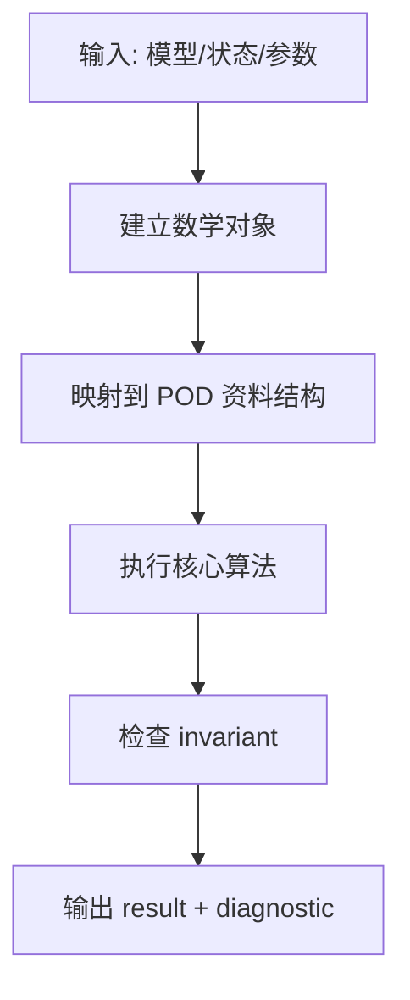

# Lesson 07 - 碰撞衝量、接觸速度與反彈

> Phase: Phase B - 一般物理引擎核心  
> Objective: 把 contact manifold 轉成速度層 impulse，推導 effective mass 與 restitution；這是碎片進入剛體後端後的第一個 solver。  
> Style: 数学不变量先行 -> POD 资料结构 -> C++17 实作 -> oracle 验证。

---


## 0. 本课在整套课程的位置

这一课不是孤立知识点。它必须接在前面的不变量之后，并为后面的 solver 或分析模块提供一个可测试的接口。

你读本课时，只问三件事：

1. 数学对象是什么？
2. 资料结构如何承载它？
3. 哪一个 invariant 可以证明实现没有偏离？

---


## 1. 专案源码对齐

本课优先对齐下列 FrameCore 源码或文件：

- FragmentMomentum.h
- README scope boundary: Chaos owns rigid-body fall
- DynamicCollapse fragment velocity

阅读顺序：

1. 先读 public header，确认 API 边界。
2. 再读 private implementation，确认数学如何落地。
3. 最后读 tests 或 verification map，确认 oracle。

---


## 2. 数学层：核心公式

以下公式不是装饰；每一个都必须能写成测试。

\[
v_c = v + omega x r
\]

\[
v_rel = n dot (v_Bc - v_Ac)
\]

\[
j = -(1+e)v_rel / (n^T M_eff^-1 n)
\]

\[
v' = v + M^-1 J^T lambda
\]

\[
omega' = omega + I^-1 (r x J)
\]


### 2.1 维度检查

写任何 solver 前，先做单位与维度检查：

```text
force      : N
length     : mm
stress     : N/mm^2 = MPa
rotation   : rad, dimensionless in linearized equations
stiffness  : translational N/mm, rotational N*mm
```

如果一个公式无法通过单位检查，不准进入实现。

### 2.2 从连续形式到离散形式

工程实现只处理离散资料结构。你必须能说明：

```text
continuous field / equation
        |
        v
finite-dimensional vector or matrix
        |
        v
POD data structure
        |
        v
testable invariant
```

---


## 3. 资料结构层

本课至少需要下列资料结构或概念：

- RigidBody
- ContactPoint
- ImpulseAccumulator
- MaterialContact{restitution,friction}

设计原则：

- public API 只放普通 C++ 型别。
- index 与 id 分离。
- 单位写进注释，不藏在命名习惯里。
- 可变状态和不可变模型资料分开。

### 3.1 最小资料流



---


## 4. 必守不变量

- normal impulse is non-negative
- restitution applies only when closing speed exceeds threshold
- impulse changes velocity, not position

把这些不变量写成测试，而不是写在 README 里相信自己。

### 4.1 Invariant template

```cpp
static void test_lesson_07_invariant() {
    // Arrange: build the smallest model that activates the formula.
    // Act: run the implementation.
    // Assert: compare against an independent oracle.
}
```

---


## 5. C++17 实作骨架

```cpp
// Lesson 7: 碰撞衝量、接觸速度與反彈
// Minimal C++17 skeleton. Keep it POD-first; do not leak Eigen/UE types here.

namespace mini {

struct Lesson07Context {
    // Inputs are explicit. No hidden global unit conversion.
    double tolerance = 1.0e-9;
};

struct Lesson07Result {
    bool ok = false;
    const char* diagnostic = "";
};

inline Lesson07Result runLesson07Check(const Lesson07Context& ctx) {
    Lesson07Result r;

    // TODO 1: encode the mathematical invariant for this lesson.
    // TODO 2: build the smallest data structure that can carry the invariant.
    // TODO 3: compare against an independent hand-computed oracle.
    // TODO 4: return diagnostic instead of silently producing nonsense.

    r.ok = ctx.tolerance > 0.0;
    r.diagnostic = r.ok ? "pass" : "invalid tolerance";
    return r;
}

} // namespace mini
```

### 5.1 实作输出物

本课结束时，你应该能提交：

- Implement normal impulse
- Add angular contribution
- Add restitution clamp
- Accumulate impulses for warm starting

### 5.2 文件组织建议

```text
Lesson07/
    include/
        Lesson07Types.hpp
        Lesson07Core.hpp
    tests/
        test_lesson07.cpp
    CMakeLists.txt
```

---


## 6. 手算例题

本课至少手算以下例题：

- 1D ball-wall impact
- two equal masses exchange velocity
- off-center hit creates angular velocity

### 6.1 手算格式

每题固定写成：

```text
Given:
    已知量、单位、坐标系

Derive:
    从定义开始，不跳步

Compute:
    代入数值

Check:
    单位、符号、极限情况
```

### 6.2 例题模板

\[
\text{input} \rightarrow \text{mathematical object} \rightarrow \text{matrix/vector} \rightarrow \text{oracle}
\]

---


## 7. Debug Checklist

优先检查这些错误：

- applying impulse twice per frame
- using penetration depth as impulse
- forgetting inverse inertia rotation

### 7.1 Debug 顺序

1. 检查单位。
2. 检查 index。
3. 检查 local/global convention。
4. 检查符号。
5. 检查 invariant。
6. 再检查数值误差。

---


## 8. 验证关卡

本课必须至少通过以下测试：

- momentum conservation e=1
- kinetic energy non-increase for e<=1
- no impulse for separating contact

### 8.1 Oracle 分类

优先级：

1. closed-form analytic solution
2. independent small dense implementation
3. external reference such as OpenSees
4. invariance test
5. regression test

不要用「同一段代码跑两次」当 oracle。

---


## 9. 课后硬核练习

### 题目 1：理论手算题

选择本课第 2 节的一个公式，给定具体数值，完整算到最后一行。要求写出单位。

<details>
<summary>解析方向</summary>

1. 先写定义。
2. 再代入数值。
3. 最后做单位检查。
4. 如果结果与直觉相反，先检查符号 convention。

</details>


### 题目 2：矩阵不变量题

构造一个最小矩阵或向量例子，验证本课 invariant。

<details>
<summary>解析方向</summary>

把 invariant 写成：

\[
\left|a-b\right| < \epsilon
\]

或：

\[
\frac{\|a-b\|}{\max(1,\|a\|)} < \epsilon
\]

不要只比较打印出来的小数位。

</details>


### 题目 3：核心程式码实作题

以 circle-plane 或 sphere-plane 寫一個 contact impulse solver，列印碰撞前後線動量。

要求：

- C++17。
- 不使用高层物理库。
- public header 不暴露 Eigen/UE。
- 至少一个失败测试能证明错误实现会被抓到。

---


## 10. 本课必背

- normal impulse is non-negative
- restitution applies only when closing speed exceeds threshold
- impulse changes velocity, not position
- v_c = v + omega x r
- v_rel = n dot (v_Bc - v_Ac)
- j = -(1+e)v_rel / (n^T M_eff^-1 n)

---


## 11. 下一课

下一课：**約束求解器**

你进入下一课前，应确认：

```text
[ ] 本课公式能手算
[ ] 本课资料结构能从零写出
[ ] 本课 invariant 有测试
[ ] 本课错误案例会失败
```

---


## A. 源碼閱讀卡片

### A.1 `FragmentMomentum.h`

閱讀時不要只找函式名稱。要回答四個問題：

1. 這個檔案位於 public API 還是 private backend？
2. 它承載的是資料、演算法、還是驗證？
3. 它依賴哪個 convention？
4. 它失敗時應該回傳 diagnostic、assert、還是測試失敗？

Freeform 卡片建議：

```text
[FragmentMomentum.h]
    input     -> ?
    output    -> ?
    invariant -> ?
    oracle    -> ?
```

### A.2 `README scope boundary: Chaos owns rigid-body fall`

閱讀時不要只找函式名稱。要回答四個問題：

1. 這個檔案位於 public API 還是 private backend？
2. 它承載的是資料、演算法、還是驗證？
3. 它依賴哪個 convention？
4. 它失敗時應該回傳 diagnostic、assert、還是測試失敗？

Freeform 卡片建議：

```text
[README scope boundary: Chaos owns rigid-body fall]
    input     -> ?
    output    -> ?
    invariant -> ?
    oracle    -> ?
```

### A.3 `DynamicCollapse fragment velocity`

閱讀時不要只找函式名稱。要回答四個問題：

1. 這個檔案位於 public API 還是 private backend？
2. 它承載的是資料、演算法、還是驗證？
3. 它依賴哪個 convention？
4. 它失敗時應該回傳 diagnostic、assert、還是測試失敗？

Freeform 卡片建議：

```text
[DynamicCollapse fragment velocity]
    input     -> ?
    output    -> ?
    invariant -> ?
    oracle    -> ?
```


---


## B. 公式逐步拆解卡片

### B.1 公式：`v_c = v + omega x r`

#### Step 1 - 先写数学对象

\[
v_c = v + omega x r
\]

不要直接写代码。先确认它描述的是标量、向量、矩阵、线性算子，还是约束列。

#### Step 2 - 写出输入与输出

```text
input  : 本公式需要的最小物理量
output : 本公式产生的数值对象
frame  : global / local / material / body
unit   : N, mm, MPa, tonne, rad
```

#### Step 3 - 单位检查

把每个符号都替换成单位。如果单位不收敛，先修公式，不要修代码。

```text
left hand side unit  = ?
right hand side unit = ?
must match           = true
```

#### Step 4 - 程式映射

```cpp
// Pseudocode mapping for this formula
auto input = read_model_or_state();
auto value = compute_formula(input);
assert(isfinite(value));
```

#### Step 5 - Oracle

为这个公式建立最小测试：

- 一个手算数值。
- 一个极限情况。
- 一个错误符号会失败的反例。

### B.2 公式：`v_rel = n dot (v_Bc - v_Ac)`

#### Step 1 - 先写数学对象

\[
v_rel = n dot (v_Bc - v_Ac)
\]

不要直接写代码。先确认它描述的是标量、向量、矩阵、线性算子，还是约束列。

#### Step 2 - 写出输入与输出

```text
input  : 本公式需要的最小物理量
output : 本公式产生的数值对象
frame  : global / local / material / body
unit   : N, mm, MPa, tonne, rad
```

#### Step 3 - 单位检查

把每个符号都替换成单位。如果单位不收敛，先修公式，不要修代码。

```text
left hand side unit  = ?
right hand side unit = ?
must match           = true
```

#### Step 4 - 程式映射

```cpp
// Pseudocode mapping for this formula
auto input = read_model_or_state();
auto value = compute_formula(input);
assert(isfinite(value));
```

#### Step 5 - Oracle

为这个公式建立最小测试：

- 一个手算数值。
- 一个极限情况。
- 一个错误符号会失败的反例。

### B.3 公式：`j = -(1+e)v_rel / (n^T M_eff^-1 n)`

#### Step 1 - 先写数学对象

\[
j = -(1+e)v_rel / (n^T M_eff^-1 n)
\]

不要直接写代码。先确认它描述的是标量、向量、矩阵、线性算子，还是约束列。

#### Step 2 - 写出输入与输出

```text
input  : 本公式需要的最小物理量
output : 本公式产生的数值对象
frame  : global / local / material / body
unit   : N, mm, MPa, tonne, rad
```

#### Step 3 - 单位检查

把每个符号都替换成单位。如果单位不收敛，先修公式，不要修代码。

```text
left hand side unit  = ?
right hand side unit = ?
must match           = true
```

#### Step 4 - 程式映射

```cpp
// Pseudocode mapping for this formula
auto input = read_model_or_state();
auto value = compute_formula(input);
assert(isfinite(value));
```

#### Step 5 - Oracle

为这个公式建立最小测试：

- 一个手算数值。
- 一个极限情况。
- 一个错误符号会失败的反例。

### B.4 公式：`v' = v + M^-1 J^T lambda`

#### Step 1 - 先写数学对象

\[
v' = v + M^-1 J^T lambda
\]

不要直接写代码。先确认它描述的是标量、向量、矩阵、线性算子，还是约束列。

#### Step 2 - 写出输入与输出

```text
input  : 本公式需要的最小物理量
output : 本公式产生的数值对象
frame  : global / local / material / body
unit   : N, mm, MPa, tonne, rad
```

#### Step 3 - 单位检查

把每个符号都替换成单位。如果单位不收敛，先修公式，不要修代码。

```text
left hand side unit  = ?
right hand side unit = ?
must match           = true
```

#### Step 4 - 程式映射

```cpp
// Pseudocode mapping for this formula
auto input = read_model_or_state();
auto value = compute_formula(input);
assert(isfinite(value));
```

#### Step 5 - Oracle

为这个公式建立最小测试：

- 一个手算数值。
- 一个极限情况。
- 一个错误符号会失败的反例。

### B.5 公式：`omega' = omega + I^-1 (r x J)`

#### Step 1 - 先写数学对象

\[
omega' = omega + I^-1 (r x J)
\]

不要直接写代码。先确认它描述的是标量、向量、矩阵、线性算子，还是约束列。

#### Step 2 - 写出输入与输出

```text
input  : 本公式需要的最小物理量
output : 本公式产生的数值对象
frame  : global / local / material / body
unit   : N, mm, MPa, tonne, rad
```

#### Step 3 - 单位检查

把每个符号都替换成单位。如果单位不收敛，先修公式，不要修代码。

```text
left hand side unit  = ?
right hand side unit = ?
must match           = true
```

#### Step 4 - 程式映射

```cpp
// Pseudocode mapping for this formula
auto input = read_model_or_state();
auto value = compute_formula(input);
assert(isfinite(value));
```

#### Step 5 - Oracle

为这个公式建立最小测试：

- 一个手算数值。
- 一个极限情况。
- 一个错误符号会失败的反例。


---


## C. 资料结构设计卡片

### C.1 `RigidBody`

这个资料结构必须回答：它保存 reference configuration、current state、solver cache，还是 result？

```cpp
struct Rigidbody {
    // Write only fields that are necessary for this lesson.
    // Do not store derived values unless caching is justified.
    bool valid = false;
};
```

字段设计检查：

- 是否需要 id？
- 是否需要 index？
- 是否需要单位注释？
- 是否应放在 public header？
- 是否会被 solver cache fingerprint 使用？

### C.2 `ContactPoint`

这个资料结构必须回答：它保存 reference configuration、current state、solver cache，还是 result？

```cpp
struct Contactpoint {
    // Write only fields that are necessary for this lesson.
    // Do not store derived values unless caching is justified.
    bool valid = false;
};
```

字段设计检查：

- 是否需要 id？
- 是否需要 index？
- 是否需要单位注释？
- 是否应放在 public header？
- 是否会被 solver cache fingerprint 使用？

### C.3 `ImpulseAccumulator`

这个资料结构必须回答：它保存 reference configuration、current state、solver cache，还是 result？

```cpp
struct Impulseaccumulator {
    // Write only fields that are necessary for this lesson.
    // Do not store derived values unless caching is justified.
    bool valid = false;
};
```

字段设计检查：

- 是否需要 id？
- 是否需要 index？
- 是否需要单位注释？
- 是否应放在 public header？
- 是否会被 solver cache fingerprint 使用？

### C.4 `MaterialContact{restitution,friction}`

这个资料结构必须回答：它保存 reference configuration、current state、solver cache，还是 result？

```cpp
struct MaterialcontactRestitutionFriction {
    // Write only fields that are necessary for this lesson.
    // Do not store derived values unless caching is justified.
    bool valid = false;
};
```

字段设计检查：

- 是否需要 id？
- 是否需要 index？
- 是否需要单位注释？
- 是否应放在 public header？
- 是否会被 solver cache fingerprint 使用？


---


## D. 建议实现顺序：可提交 milestone

每一步都应该能独立编译、独立测试。不要一次写完再 debug。

### D.1 Milestone - Implement normal impulse

交付物：

```text
source file      :
public API       :
private backend  :
unit test        :
expected failure :
```

验收条件：

- 编译通过。
- 至少一个正向案例。
- 至少一个反向案例。
- diagnostic 不为空。

### D.2 Milestone - Add angular contribution

交付物：

```text
source file      :
public API       :
private backend  :
unit test        :
expected failure :
```

验收条件：

- 编译通过。
- 至少一个正向案例。
- 至少一个反向案例。
- diagnostic 不为空。

### D.3 Milestone - Add restitution clamp

交付物：

```text
source file      :
public API       :
private backend  :
unit test        :
expected failure :
```

验收条件：

- 编译通过。
- 至少一个正向案例。
- 至少一个反向案例。
- diagnostic 不为空。

### D.4 Milestone - Accumulate impulses for warm starting

交付物：

```text
source file      :
public API       :
private backend  :
unit test        :
expected failure :
```

验收条件：

- 编译通过。
- 至少一个正向案例。
- 至少一个反向案例。
- diagnostic 不为空。


---


## E. 手算例题展开模板

### E.1 例题 - 1D ball-wall impact

#### Given

```text
geometry/material/state/load = fill by hand
unit system = N, mm, MPa unless explicitly stated
frame = local or global
```

#### Derivation

\[
\text{definition} \rightarrow \text{substitution} \rightarrow \text{numeric result}
\]

#### Implementation check

```cpp
// The test should compute the same scalar/vector/matrix.
// Do not compare formatted strings. Compare numeric tolerance.
```

#### Failure case

刻意翻转一个符号、交换一个 index、或切换 local/global frame，测试必须失败。

### E.2 例题 - two equal masses exchange velocity

#### Given

```text
geometry/material/state/load = fill by hand
unit system = N, mm, MPa unless explicitly stated
frame = local or global
```

#### Derivation

\[
\text{definition} \rightarrow \text{substitution} \rightarrow \text{numeric result}
\]

#### Implementation check

```cpp
// The test should compute the same scalar/vector/matrix.
// Do not compare formatted strings. Compare numeric tolerance.
```

#### Failure case

刻意翻转一个符号、交换一个 index、或切换 local/global frame，测试必须失败。

### E.3 例题 - off-center hit creates angular velocity

#### Given

```text
geometry/material/state/load = fill by hand
unit system = N, mm, MPa unless explicitly stated
frame = local or global
```

#### Derivation

\[
\text{definition} \rightarrow \text{substitution} \rightarrow \text{numeric result}
\]

#### Implementation check

```cpp
// The test should compute the same scalar/vector/matrix.
// Do not compare formatted strings. Compare numeric tolerance.
```

#### Failure case

刻意翻转一个符号、交换一个 index、或切换 local/global frame，测试必须失败。


---


## F. Debug 分页清单

### F.1 常见错误 - applying impulse twice per frame

症状：

```text
displacement wrong / force sign wrong / matrix nonsymmetric / singular unexpectedly
```

定位顺序：

1. 打印输入单位。
2. 打印 local/global frame。
3. 打印 DOF map。
4. 打印最小矩阵 block。
5. 比对手算 oracle。

修复原则：

- 不用调 tolerance 掩盖符号错误。
- 不改测试迁就错误实现。
- 先缩小到单元素模型。

### F.2 常见错误 - using penetration depth as impulse

症状：

```text
displacement wrong / force sign wrong / matrix nonsymmetric / singular unexpectedly
```

定位顺序：

1. 打印输入单位。
2. 打印 local/global frame。
3. 打印 DOF map。
4. 打印最小矩阵 block。
5. 比对手算 oracle。

修复原则：

- 不用调 tolerance 掩盖符号错误。
- 不改测试迁就错误实现。
- 先缩小到单元素模型。

### F.3 常见错误 - forgetting inverse inertia rotation

症状：

```text
displacement wrong / force sign wrong / matrix nonsymmetric / singular unexpectedly
```

定位顺序：

1. 打印输入单位。
2. 打印 local/global frame。
3. 打印 DOF map。
4. 打印最小矩阵 block。
5. 比对手算 oracle。

修复原则：

- 不用调 tolerance 掩盖符号错误。
- 不改测试迁就错误实现。
- 先缩小到单元素模型。


---


## G. Test Matrix

| Test | Purpose | Oracle | Expected failure |
|---|---|---|---|
| G1 `momentum conservation e=1` | protect lesson invariant | hand / dense / external | wrong convention must fail |
| G2 `kinetic energy non-increase for e<=1` | protect lesson invariant | hand / dense / external | wrong convention must fail |
| G3 `no impulse for separating contact` | protect lesson invariant | hand / dense / external | wrong convention must fail |

### G.x 最小测试程式骨架

```cpp
static void assertNear(double a, double b, double eps) {
    assert(std::abs(a - b) <= eps * std::max(1.0, std::abs(a)));
}

static void test_expected_failure_path() {
    // Build a deliberately wrong input or wrong convention.
    // The test must fail before the bug reaches a larger model.
}
```


---


## H. Freeform 大畫布排版建議

每一課匯入 Freeform 後，建議拆成 6 個大區塊：

```text
┌──────────────────────────────┐
│ Lesson 07: 碰撞衝量、接觸速度與反彈
├──────────────┬───────────────┤
│ 數學推導      │ 資料結構        │
├──────────────┼───────────────┤
│ C++ 實作      │ 測試 / oracle   │
├──────────────┴───────────────┤
│ Debug checklist + 課後練習     │
└──────────────────────────────┘
```

視覺規則：

- 中央只放本課核心公式。
- 左側放手算推導。
- 右側放 C++ struct / function。
- 下方放測試矩陣。
- 最外圈放錯誤案例與 debug checklist。

這樣你會得到「由中心慢慢擴散」的學習路徑，而不是一張裝飾圖。


---


## I. 本課完整複製任務書

### I.1 Scope

本課只實作和 `碰撞衝量、接觸速度與反彈` 直接相關的最小功能。不得提前實作後面課程的 solver。

### I.2 Source References

- FragmentMomentum.h
- README scope boundary: Chaos owns rigid-body fall
- DynamicCollapse fragment velocity

### I.3 Data Contract

- RigidBody
- ContactPoint
- ImpulseAccumulator
- MaterialContact{restitution,friction}

### I.4 Invariants

- normal impulse is non-negative
- restitution applies only when closing speed exceeds threshold
- impulse changes velocity, not position

### I.5 Rollback

如果本課實作導致後續測試混亂，rollback 方式是：

```text
1. 保留測試檔。
2. 移除本課新增實作。
3. 保留 public API 討論記錄。
4. 重新從最小 oracle 開始。
```

### I.6 Completion Definition

```text
[ ] 數學公式已手算
[ ] C++17 skeleton 已實作
[ ] 正向測試通過
[ ] 反向測試會失敗
[ ] Debug checklist 已跑過
[ ] Freeform 大畫布已整理
```

