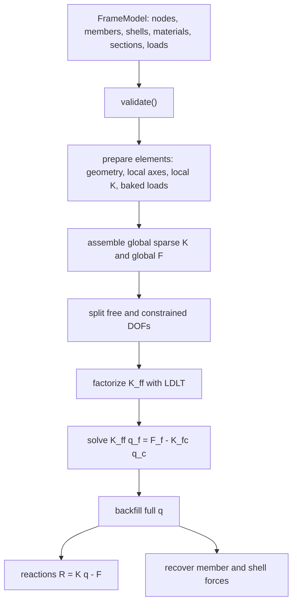

# FrameCore v2 力學引擎開發與理論實作課程筆記

版本基準：本筆記以 `ArchSim` 專案目前的 FrameCore 發布線為準：C++17 + Eigen、3-D direct-stiffness FEM、beam-column、MITC4 shell、S1-S10 分析線與 opt-in supernodal direct lane。

主要源碼錨點：

- `README.md`
- `docs/ARCHITECTURE.md`
- `docs/VERIFICATION.md`
- `Plugins/FrameSolver/Source/FrameCore/Public/FrameCore/FrameTypes.h`
- `Plugins/FrameSolver/Source/FrameCore/Public/FrameCore/Node.h`
- `Plugins/FrameSolver/Source/FrameCore/Public/FrameCore/Member.h`
- `Plugins/FrameSolver/Source/FrameCore/Public/FrameCore/FrameModel.h`
- `Plugins/FrameSolver/Source/FrameCore/Public/FrameCore/FrameSolver.h`
- `Plugins/FrameSolver/Source/FrameCore/Private/ElementStiffness.cpp`
- `Plugins/FrameSolver/Source/FrameCore/Private/BeamColumnElement.cpp`
- `Plugins/FrameSolver/Source/FrameCore/Private/FrameSolver.cpp`


## 課程藍圖

| 課次 | 主題 | FrameCore 對應模組 | 核心產出 |
|---:|---|---|---|
| 1 | 狀態向量、座標系、DOF 映射 | `FrameTypes`, `Node`, `Member`, `FrameModel`, `localAxes`, `transform12` | 從零建立可被 FEM 求解器理解的模型狀態 |
| 2 | 3-D beam-column 局部剛度矩陣 | `localStiffness12`, `localStiffness12T` | 推導 axial、torsion、Euler-Bernoulli、Timoshenko block |
| 3 | 全域稀疏組裝與邊界條件 | `BeamColumnElement::assemble`, `FrameSolver.cpp` | 寫出 triplet assembly、free/fixed partition、reaction recovery |
| 4 | 驗證、奇異性與機構偵測 | `LDLT`, `pivotMargin`, `VERIFICATION.md` | 用 pivot 與 oracle 判斷「模型不成立」 |
| 5 | 荷載、等效節點力與端釋放 | `MemberUDL`, `Qf`, `condenseReleases` | 推導 fixed-end force 與 release static condensation |
| 6 | 材料、截面與彈性強度篩選 | `Material`, `Section`, `ElasticAllowable` | 從應力到 D/C utilization |
| 7 | 質量矩陣、模態分析與 Newmark 積分 | `localMass12`, `ModalAnalysis`, `ModalDynamics` | 建立 \(K\phi=\omega^2M\phi\) 與時間步進 |
| 8 | 線性屈曲與 P-Delta | `localGeometric12`, `BucklingAnalysis`, `PDeltaAnalysis` | 推導幾何剛度與二階效應 |
| 9 | MITC4 shell 基礎 | `MITC4ShellElement` | Reissner-Mindlin、膜、板彎、剪力 tying point |
| 10 | shell 升級與幾何非線性 shell | S8 QM6/DKQ, shell EICR | 理解 locking、薄板快路徑與 corotational facet |
| 11 | factorize-once 與 ReSolve ladder | `PreparedSystem`, `Reanalysis` | Woodbury、stale-LDLT PCG、rebaseline |
| 12 | tension-only 與 active-set 求解 | `TensionOnly` | 纜索/斜撐壓縮失效的有限終止演算法 |
| 13 | progressive collapse 與塑性鉸 | `Collapse`, `Hinge`, `NMInteraction` | sequential linear collapse、event-to-event hinge、N-M interaction |
| 14 | dynamic collapse 與剛體碎片交接 | `DynamicCollapse`, `FragmentCluster` | modal Newmark、跨事件狀態投影、momentum handoff |
| 15 | co-rotational 大位移 beam | `CorotationalAnalysis` | SO(3) 有限轉角、Newton-Raphson、arc-length snap-through |
| 16 | 最佳化與 clone capstone | `SizeOpt`, `Topology`, CLI/C API | 複製最小 FrameCore：模型、組裝、求解、驗證 |
| 17 | 碰撞、衝量與約束求解器補課 | UE/Chaos handoff, 可替換 rigid-body backend | 釐清 FrameCore 與 rigid-body solver 邊界 |

注意：FrameCore 本體是結構 FEM 引擎。碰撞檢測、衝量響應、接觸約束求解主要屬於 UE5 Chaos 或可替換剛體後端；FrameCore 提供的是 `FragmentCluster` 的質量、質心、慣性張量與速度交接資料。第 17 課會把 collision/impulse/constraint 放在「碎片脫離後」的剛體後端來學，不把它偽裝成 FrameCore 內部核心。


## Lesson 1 - 狀態向量、局部座標與 FrameModel

### 1.1 本課目標

本課只處理「引擎如何表示一個力學問題」。暫時不解完整剛度矩陣。

你要掌握四件事：

1. 一個節點的 6 個自由度如何排成狀態向量。
2. 一個二節點 beam-column element 如何形成 12 DOF 元素向量。
3. 局部座標系如何由兩個節點與 `refVec` 推導出來。
4. 為什麼局部剛度要用

\[
K_g = T^T K_l T
\]

轉回全域座標。


### 1.2 FrameCore 的最低契約

FrameCore 的 public API 刻意保持 POD/plain C++：

```cpp
namespace frame {
using real = double;

enum Dof : int { Ux = 0, Uy = 1, Uz = 2, Rx = 3, Ry = 4, Rz = 5 };
inline constexpr int DOF_PER_NODE = 6;
inline constexpr int ELEM_DOF = 12;

inline int gdof(int nodeIndex, int localDof) {
    return DOF_PER_NODE * nodeIndex + localDof;
}
}
```

引擎採用：

- 單位：N, mm, MPa，其中 MPa = N/mm^2。
- 每節點 DOF 順序：

\[
q_a =
\begin{bmatrix}
U_x & U_y & U_z & R_x & R_y & R_z
\end{bmatrix}^T
\]

- 全域 DOF index：

\[
g(a,d)=6a+d,\qquad d\in\{0,1,2,3,4,5\}
\]

- 全域狀態向量：

\[
q =
\begin{bmatrix}
q_0\\
q_1\\
\vdots\\
q_{n-1}
\end{bmatrix}
\in \mathbb{R}^{6n}
\]

其中：

\[
q_a =
\begin{bmatrix}
u_x\\u_y\\u_z\\\theta_x\\\theta_y\\\theta_z
\end{bmatrix}_a
\]

位移單位是 mm；轉角以 rad 表示，數值上無因次。


### 1.3 Node：節點就是一個 6 DOF 邊界狀態

FrameCore 的 `Node`：

```cpp
struct Node {
    NodeId id = 0;
    Vec3 pos;
    std::array<bool, 6> fixed;
    std::array<real, 6> prescribed;
};
```

數學對應：

- `pos` 是節點參考構形位置：

\[
x_a^0 =
\begin{bmatrix}
X_a\\Y_a\\Z_a
\end{bmatrix}
\]

- `fixed[d] = true` 代表該 DOF 是約束自由度。
- `prescribed[d]` 是該約束自由度的指定值：

\[
q_c = \bar{q}_c
\]

如果節點完全固定：

\[
q_a =
\begin{bmatrix}
0&0&0&0&0&0
\end{bmatrix}^T
\]

這對應 `fixAll()`。


### 1.4 Member：二節點元素的 12 DOF 狀態

一個 beam-column member 連接節點 \(i\) 與 \(j\)。

元素全域向量：

\[
q_e^g =
\begin{bmatrix}
q_i\\
q_j
\end{bmatrix}
=
\begin{bmatrix}
U_{xi}\\U_{yi}\\U_{zi}\\R_{xi}\\R_{yi}\\R_{zi}\\
U_{xj}\\U_{yj}\\U_{zj}\\R_{xj}\\R_{yj}\\R_{zj}
\end{bmatrix}
\in\mathbb{R}^{12}
\]

FrameCore 的元素 DOF 順序固定為：

```text
[ node_i: Ux Uy Uz Rx Ry Rz ][ node_j: Ux Uy Uz Rx Ry Rz ]
```

也就是：

\[
\text{dofs}_e =
\begin{bmatrix}
g(i,0)&g(i,1)&\cdots&g(i,5)&g(j,0)&\cdots&g(j,5)
\end{bmatrix}
\]

這個順序不能隨意改。剛度矩陣、質量矩陣、端力 recovery、release mask 都假設這個順序。


### 1.5 極簡幾何圖

```text
global frame

        Z
        |
        |
        o------ Y
       /
      X

member:

  node i o--------------------o node j
          local x direction

refVec defines the local x-y plane.
local z completes a right-handed triad.
```

對一根 member：

\[
p_i =
\begin{bmatrix}X_i\\Y_i\\Z_i\end{bmatrix},\qquad
p_j =
\begin{bmatrix}X_j\\Y_j\\Z_j\end{bmatrix}
\]

長度：

\[
L = \lVert p_j-p_i\rVert_2
  = \sqrt{(X_j-X_i)^2+(Y_j-Y_i)^2+(Z_j-Z_i)^2}
\]

局部 \(x\) 軸：

\[
\hat{x}=\frac{p_j-p_i}{L}
\]

給定參考向量：

\[
r=\texttt{refVec}
\]

先建立：

\[
\tilde{z}=\hat{x}\times r
\]

若：

\[
\lVert\tilde{z}\rVert < \varepsilon
\]

表示 `refVec` 幾乎平行於 member 軸，FrameCore 會改用 fallback reference，例如 global \(+Y\)。

否則：

\[
\hat{z}=\frac{\tilde{z}}{\lVert\tilde{z}\rVert}
\]

再建立：

\[
\hat{y}=\hat{z}\times\hat{x}
\]

因此：

\[
\hat{x}\times\hat{y}=\hat{z}
\]

這是一組右手座標。


### 1.6 向量運算硬推導

對任意：

\[
a=
\begin{bmatrix}a_x\\a_y\\a_z\end{bmatrix},\qquad
b=
\begin{bmatrix}b_x\\b_y\\b_z\end{bmatrix}
\]

內積：

\[
a\cdot b = a_xb_x+a_yb_y+a_zb_z
\]

長度：

\[
\lVert a\rVert = \sqrt{a\cdot a}
\]

叉積：

\[
a\times b =
\begin{bmatrix}
a_yb_z-a_zb_y\\
a_zb_x-a_xb_z\\
a_xb_y-a_yb_x
\end{bmatrix}
\]

叉積的兩個關鍵性質：

\[
(a\times b)\cdot a = 0
\]

\[
(a\times b)\cdot b = 0
\]

所以 \(\hat{x}\times r\) 必定垂直於 \(\hat{x}\) 和 \(r\)。這就是用 `refVec` 定義 member 局部平面的原因。


### 1.7 座標轉換矩陣 \(R\)

FrameCore 的 `localAxes()` 回傳一個 \(3\times 3\) 矩陣 \(R\)，其 rows 是局部軸在全域座標中的方向：

\[
R =
\begin{bmatrix}
\hat{x}^T\\
\hat{y}^T\\
\hat{z}^T
\end{bmatrix}
=
\begin{bmatrix}
x_x&x_y&x_z\\
y_x&y_y&y_z\\
z_x&z_y&z_z
\end{bmatrix}
\]

任一全域向量 \(v_g\) 轉為局部分量：

\[
v_l = Rv_g
\]

因為：

\[
v_l =
\begin{bmatrix}
\hat{x}\cdot v_g\\
\hat{y}\cdot v_g\\
\hat{z}\cdot v_g
\end{bmatrix}
\]

若 \(\hat{x},\hat{y},\hat{z}\) 是正交單位基底，則：

\[
RR^T = I,\qquad R^{-1}=R^T
\]

反向轉換：

\[
v_g=R^Tv_l
\]


### 1.8 12 DOF 元素轉換矩陣 \(T\)

一個 beam-column 有 4 個 3D 向量區塊：

```text
node i translation  : [Ux Uy Uz]
node i rotation     : [Rx Ry Rz]
node j translation  : [Ux Uy Uz]
node j rotation     : [Rx Ry Rz]
```

所以：

\[
T =
\operatorname{diag}(R,R,R,R)
\in\mathbb{R}^{12\times 12}
\]

明寫為：

\[
T =
\begin{bmatrix}
R&0&0&0\\
0&R&0&0\\
0&0&R&0\\
0&0&0&R
\end{bmatrix}
\]

元素全域 DOF 轉為元素局部 DOF：

\[
q_e^l = Tq_e^g
\]

這對應 `transform12()`：

```cpp
Mat12 transform12(const Mat3& R) {
    Mat12 T = Mat12::Zero();
    for (int b = 0; b < 4; ++b) {
        T.block<3, 3>(3 * b, 3 * b) = R;
    }
    return T;
}
```


### 1.9 為什麼 \(K_g=T^TK_lT\)

在局部座標中：

\[
f_l = K_l q_l
\]

又因：

\[
q_l=Tq_g
\]

考慮虛功：

\[
\delta W = \delta q_l^T f_l
\]

代入：

\[
\delta q_l = T\delta q_g
\]

所以：

\[
\delta W
= (T\delta q_g)^T f_l
= \delta q_g^T T^T f_l
\]

全域力 \(f_g\) 必須滿足：

\[
\delta W=\delta q_g^T f_g
\]

因此：

\[
f_g=T^Tf_l
\]

再代入 \(f_l=K_lq_l=K_lTq_g\)：

\[
f_g=T^TK_lTq_g
\]

所以：

\[
K_g=T^TK_lT
\]

這就是 `BeamColumnElement::assemble()` 做的事：

```cpp
const Mat12 kg = T_.transpose() * kl_ * T_;
```


### 1.10 求解器的整體資料流



邊界條件的數學形式：

\[
\begin{bmatrix}
K_{ff}&K_{fc}\\
K_{cf}&K_{cc}
\end{bmatrix}
\begin{bmatrix}
q_f\\q_c
\end{bmatrix}
=
\begin{bmatrix}
F_f\\F_c
\end{bmatrix}
\]

其中 \(q_c=\bar{q}_c\) 已知。

自由 DOF 方程：

\[
K_{ff}q_f + K_{fc}\bar{q}_c = F_f
\]

因此：

\[
K_{ff}q_f = F_f - K_{fc}\bar{q}_c
\]

\[
q_f=K_{ff}^{-1}(F_f-K_{fc}\bar{q}_c)
\]

反力：

\[
R = Kq-F
\]

注意：FrameCore 的 singular/mechanism detection 來自 \(K_{ff}\) 的 factorization pivot，而不是只看拓樸連通。


### 1.11 最小模型：資料結構到數學

以下是 2 m 懸臂梁，根部全固定，端點受 global \(-Z\) 方向 1000 N。

```cpp
#include "FrameCore/FrameSolver.h"
using namespace frame;

Material mat(210000.0, 80769.0, 7850.0);
Section sec = Section::Rectangular(100.0, 100.0);

FrameModel m;
m.materials = { mat };
m.sections = { sec };

Node n0(0, 0, 0, 0);
n0.fixAll();
Node n1(1, 2000, 0, 0);

m.nodes = { n0, n1 };
m.members = { Member(0, 0, 1, 0, 0) };

NodalLoad p;
p.node = 1;
p.comp[Uz] = -1000.0;
m.nodalLoads = { p };

SolveResult r = solve(m);
```

數學上：

\[
n=2,\qquad q\in\mathbb{R}^{12}
\]

node 0 固定：

\[
q_c =
\begin{bmatrix}
q_0
\end{bmatrix}
=0
\]

node 1 自由：

\[
q_f =
\begin{bmatrix}
U_{x1}&U_{y1}&U_{z1}&R_{x1}&R_{y1}&R_{z1}
\end{bmatrix}^T
\]

外力向量的非零分量：

\[
F_{g(1,Uz)}=F_{6+2}=F_8=-1000
\]


### 1.12 第一課必須背下來的 invariants

1. 每個 node 永遠是 6 DOF：

\[
[Ux,Uy,Uz,Rx,Ry,Rz]
\]

2. 每個二節點 member 永遠是 12 DOF：

\[
[i:6][j:6]
\]

3. 全域 index 永遠是：

\[
6\cdot nodeIndex + localDof
\]

4. `R` 的 rows 是 local axes，所以：

\[
v_l=Rv_g,\qquad v_g=R^Tv_l
\]

5. element transform：

\[
q_l=Tq_g,\qquad T=\operatorname{diag}(R,R,R,R)
\]

6. stiffness transform：

\[
K_g=T^TK_lT
\]

7. reactions：

\[
R=Kq-F
\]

8. singularity 不是「看起來有連起來」就安全；它由 reduced stiffness factorization 判斷。


## 課後硬核練習

### 題 1 - 局部座標手算

給定：

\[
p_i=(0,0,0),\qquad p_j=(2000,0,0),\qquad r=(0,0,1)
\]

1. 求 \(\hat{x},\hat{y},\hat{z}\)。
2. 寫出 \(R\)。
3. 將 global force

\[
F_g=(0,0,-1000)
\]

轉成局部分量 \(F_l\)。

<details>
<summary>解析答案</summary>

長度：

\[
L=\lVert p_j-p_i\rVert=2000
\]

\[
\hat{x}=\frac{(2000,0,0)}{2000}=(1,0,0)
\]

先算：

\[
\tilde{z}=\hat{x}\times r
=(1,0,0)\times(0,0,1)
\]

由叉積：

\[
\tilde{z}=
\begin{bmatrix}
0\cdot1-0\cdot0\\
0\cdot0-1\cdot1\\
1\cdot0-0\cdot0
\end{bmatrix}
=
\begin{bmatrix}
0\\-1\\0
\end{bmatrix}
\]

所以：

\[
\hat{z}=(0,-1,0)
\]

\[
\hat{y}=\hat{z}\times\hat{x}
=(0,-1,0)\times(1,0,0)
=(0,0,1)
\]

因此：

\[
R=
\begin{bmatrix}
\hat{x}^T\\
\hat{y}^T\\
\hat{z}^T
\end{bmatrix}
=
\begin{bmatrix}
1&0&0\\
0&0&1\\
0&-1&0
\end{bmatrix}
\]

轉換力：

\[
F_l=RF_g
=
\begin{bmatrix}
1&0&0\\
0&0&1\\
0&-1&0
\end{bmatrix}
\begin{bmatrix}
0\\0\\-1000
\end{bmatrix}
=
\begin{bmatrix}
0\\-1000\\0
\end{bmatrix}
\]

結論：對一根沿 global \(+X\) 的 member，global \(-Z\) 荷載是 local \(-y\) 荷載。

</details>


### 題 2 - DOF reduction 與一維軸向求解

用 axial-only 模型近似一根二節點桿：

\[
E=200000\text{ MPa},\qquad A=1000\text{ mm}^2,\qquad L=1000\text{ mm}
\]

局部軸向剛度：

\[
k_a=\frac{EA}{L}
\begin{bmatrix}
1&-1\\
-1&1
\end{bmatrix}
\]

node 0 的 \(U_x\) 固定，node 1 的 \(U_x\) 自由。node 1 受 \(+1000\) N 軸向拉力。

求：

1. \(k=EA/L\)。
2. 自由端位移 \(u_1\)。
3. node 0 的反力。

<details>
<summary>解析答案</summary>

先算：

\[
k=\frac{EA}{L}
=\frac{200000\times1000}{1000}
=200000\text{ N/mm}
\]

完整軸向方程：

\[
\begin{bmatrix}
k&-k\\
-k&k
\end{bmatrix}
\begin{bmatrix}
u_0\\u_1
\end{bmatrix}
=
\begin{bmatrix}
F_0\\F_1
\end{bmatrix}
\]

已知：

\[
u_0=0,\qquad F_1=1000
\]

自由 DOF 方程：

\[
k u_1 = F_1
\]

\[
u_1=\frac{1000}{200000}=0.005\text{ mm}
\]

反力用：

\[
R=Kq-F
\]

\[
q=
\begin{bmatrix}
0\\0.005
\end{bmatrix}
\]

\[
Kq=
\begin{bmatrix}
k&-k\\
-k&k
\end{bmatrix}
\begin{bmatrix}
0\\0.005
\end{bmatrix}
=
\begin{bmatrix}
-1000\\1000
\end{bmatrix}
\]

外力：

\[
F=
\begin{bmatrix}
0\\1000
\end{bmatrix}
\]

所以：

\[
R=Kq-F=
\begin{bmatrix}
-1000\\0
\end{bmatrix}
\]

node 0 反力是 \(-1000\) N。這代表支承對結構施加 global \(-X\) 方向的平衡力。

</details>


### 題 3 - 核心程式碼實作題

在不修改 solver 行為的前提下，新增一個最小測試或 standalone 檢查，用來驗證 Lesson 1 的三個 invariants：

1. `gdof(1, Uz) == 8`
2. 對 \(p_i=(0,0,0)\)、\(p_j=(2000,0,0)\)、`refVec=(0,0,1)`，global \((0,0,-1000)\) 轉成 local \((0,-1000,0)\)。
3. 建立二節點懸臂模型，確認 `model.dofCount() == 12`，且端點 \(-Z\) 荷載寫入的是 `p.comp[Uz]`。

建議檔案：

```text
Plugins/FrameSolver/Source/FrameCore/Private/Tests/Lesson1StateTransformTest.cpp
```

最小測試邏輯：

```cpp
using namespace frame;

static void Lesson1_StateTransform() {
    // 1. DOF mapping
    assert(gdof(1, Uz) == 8);

    // 2. Build same model-level geometry used by localAxes.
    Vec3 pi{0, 0, 0};
    Vec3 pj{2000, 0, 0};
    Vec3 ref{0, 0, 1};

    // In production code, localAxes is private-side Eigen API.
    // For a public-side test, either expose a tiny test hook or validate through a solved model.
    // Preferred: keep public API clean, test this in private test code where ElementStiffness.h is visible.

    // 3. Model state
    FrameModel m;
    m.materials = { Material(210000.0, 80769.0, 7850.0) };
    m.sections = { Section::Rectangular(100.0, 100.0) };

    Node n0(0, 0, 0, 0);
    n0.fixAll();
    Node n1(1, 2000, 0, 0);
    m.nodes = { n0, n1 };
    m.members = { Member(0, 0, 1, 0, 0) };

    NodalLoad load;
    load.node = 1;
    load.comp[Uz] = -1000.0;
    m.nodalLoads = { load };

    assert(m.dofCount() == 12);
    assert(m.nodalLoads[0].comp[Uz] == -1000.0);
}
```

工程要求：

- 不要把 Eigen 型別暴露到 public API。
- 不要更改 `FrameTypes.h` 的 DOF 順序。
- 若測 `localAxes()`，測試檔應位於 private test 端，因為 `localAxes()` 屬於 private implementation seam。
- 測試要能失敗在「座標方向錯誤」，不是只檢查長度或 norm。


## 下一課預告

Lesson 2 會從 12 DOF beam-column 的局部剛度矩陣開始：

\[
K_l =
K_{\text{axial}}
+K_{\text{torsion}}
+K_{\text{bend-y}}
+K_{\text{bend-z}}
\]

核心是把以下四個子問題完整推導成程式碼：

\[
\frac{EA}{L},\qquad
\frac{GJ}{L},\qquad
\frac{12EI}{L^3},\qquad
\frac{6EI}{L^2},\qquad
\frac{4EI}{L},\qquad
\frac{2EI}{L}
\]

並解釋為什麼 local y bending 與 local z bending 的符號模式不同。
